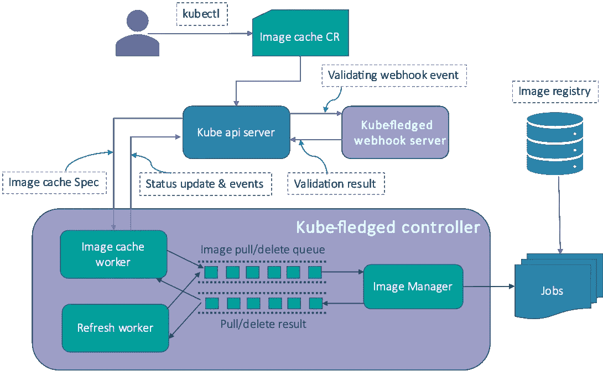

# Kube-fledged:在 Kubernetes 中缓存容器图像

> 原文：<https://itnext.io/kube-fledged-cache-container-images-in-kubernetes-7880a00bab91?source=collection_archive---------0----------------------->


游隼

游隼以其速度著称，在其特有的高速俯冲过程中，其速度可达每小时 200 多英里，这使它成为世界上最快的鸟类，也是动物王国中速度最快的成员(来源:维基百科)

# 介绍

当一个容器化的应用程序被部署到 Kubernetes 集群时，K8s 控制平面将 Pod 调度到集群中的一个工作节点。运行在 worker 节点中的节点代理(Kubelet)与安装在节点中的容器运行时(例如 containerd)相协调，并从映像注册表中提取必要的容器映像。根据图像的大小和可用的网络带宽，将所有图像提取到节点需要时间。因此，在任何容器化的应用程序中，我们都应该认识到从注册表中获取图像所带来的延迟。然而，作为进程运行的传统应用程序(例如由 systemd 管理的)不会遭受这种延迟，因为所有必需的文件都已经安装在机器中。

假设您的容器化应用程序经历了流量的突然激增，它需要立即*横向扩展(即需要创建额外的实例)。如果您配置了水平 Pod 自动缩放器(HPA)，K8s 控制平面会创建额外的 Pod 副本。然而，这些容器将无法用于处理增加的流量，*直到*所需的图像被提取，容器启动并运行。或者假设您的应用程序需要处理高速实时数据。这种应用对启动和扩展的速度有严格的要求，这是因为它所实现的目的的本质。简而言之，在一些用例中，由于从注册表中提取图像而引入的延迟是不可接受的。此外，群集和映像注册表之间的网络连接可能会受到带宽不足的影响，或者连接可能会完全丢失。有些情况下，尤其是在边缘计算中，应用程序必须优雅地容忍间歇性的网络连接。*

*这些挑战可以通过不同的方式解决。在这些场景中，一个非常有用的解决方案是将容器图像直接缓存在集群工作节点上，这样 Kubelet 就不需要提取这些图像，而是立即使用已经缓存在节点中的图像。在这篇博客中，我将解释如何使用开源项目[](https://github.com/senthilrch/kube-fledged)**在 Kubernetes 集群中构建和管理容器图像缓存。***

# ***现有解决方案***

***在向您介绍 kube-fledged 之前，让我简要描述一下解决这个问题的现有解决方案。广泛使用的方法是让注册表镜像在集群内运行。两种广泛使用的解决方案是 I)集群内自托管注册表 ii)直通缓存。在前一个解决方案中，本地注册中心在 k8s 集群中运行，并在容器运行时被配置为镜像注册中心。任何映像拉取请求都被定向到集群内注册表。如果失败，请求将被定向到主注册表。在后一种解决方案中，本地注册表具有缓存功能。当第一次提取图像时，它被缓存在本地注册表中。对该映像的后续请求由本地注册表提供服务。***

## ***现有解决方案的缺点***

1.  ***设置和维护本地注册表镜像会消耗大量的计算和人力资源。***
2.  ***对于跨越多个区域的大型集群，我们需要多个本地注册镜像。当应用程序实例跨越多个区域时，这会带来不必要的复杂性。您可能需要多个部署清单，每个清单都指向该区域的本地注册表镜像。***
3.  ***这些方法不能完全解决实现 Pod 快速启动的要求，因为从本地镜像提取图像时仍有明显的延迟。有几个用例不能容忍这种延迟。***
4.  ***节点可能会失去与本地注册表镜像的网络连接，因此 Pod 将被卡住，直到连接恢复。***

# ***kube-成熟的概述***

******

*****kube-friedged**是一个 kubernetes 插件或操作器，用于直接在 kubernetes 集群的工作节点上创建和管理容器映像缓存。它允许用户定义图像列表以及那些图像应该被缓存(即，拉取)到哪个工作者节点上。因此，应用程序窗格几乎可以立即启动，因为不需要从注册表中提取图像。kube-friedged 提供 CRUD APIs 来管理图像缓存的生命周期，并支持几个可配置的参数，以便根据个人需求定制功能。(网址:【https://github.com/senthilrch/kube-fledged )***

***kube-fledged 是作为一个通用的解决方案来设计和构建的，用于管理 Kubernetes 中的图像缓存。尽管主要用例是实现快速 Pod 启动和扩展，*该解决方案支持多种用例*，如下所述***

## ***用例***

*   ***需要快速启动的应用。例如，由于数据量的激增，执行实时数据处理的应用程序需要快速扩展。***
*   ***因为它们需要对到来的事件立即做出反应。***
*   ***在边缘设备上运行的物联网应用程序，因为边缘设备和图像注册表之间的网络连接会是间歇性的。***
*   ***如果需要从私有注册表中提取映像，并且不能授予每个人从该注册表中提取映像的访问权限，那么可以在集群的节点上提供映像。***
*   ***如果集群管理员或操作员需要对应用程序进行升级，并希望提前验证新映像是否可以成功获取。***

# ***kube-成熟的工作方式***

******

***Kubernetes 允许开发者通过定制资源来扩展 kubernetes api。kube-fledged 定义了一个定制的" **ImageCache** 类资源，并实现了一个定制的控制器(名为 kubefledged-controller)。kubefledged-controller 负责管理图像缓存。用户可以使用 kubectl 命令创建和删除 ImageCache 资源。***

***kubefledged-controller 有一个内置的图像管理器例程，负责拖动和删除图像。使用 kubernetes 作业提取或删除图像。如果启用，刷新工作器会定期刷新图像缓存。kubefledged-controller 在 ImageCache 资源的状态字段中更新图像提取、刷新和图像删除的状态。kubefledged-webhook-server 负责验证 ImageCache 资源的字段。***

***如果您需要在集群中创建一个图像缓存，您只需要通过指定要拉取的图像列表以及一个`nodeSelector`来创建一个`ImageCache`清单。`nodeSelector`用于指定图像应该缓存到的节点。如果您希望图像缓存在集群的所有节点中，那么省略`nodeSelector`。当您向集群提交清单时，API 服务器将向 kubefledged-webhook-server 发布一个验证 webhook 事件。webhook 服务器验证清单的`cacheSpec`。当收到来自 webhook 服务器的成功响应时，API 服务器会将 ImageCache 资源保存在 etcd 中。这将向 kubefledged-controller 触发一个 Informer 通知，后者将请求排队。该请求由映像缓存工作线程获取，它创建多个映像拉取请求(每个节点每个映像一个请求)并将它们放入映像拉取/删除队列中。这些请求由图像管理器例程处理。对于每个请求，映像管理器都会创建一个 k8s 作业，负责将映像拉入缓存。映像管理器会跟踪它创建的作业，一旦作业完成，它会将响应放入一个单独的队列中。然后，image cache worker 聚合来自 image manager 的所有结果，最后更新 image cache 资源的 status 部分。***

***kube-fledged 有一个刷新工作例程，它定期运行以保持图像缓存刷新。如果它发现缓存中缺少任何图像(可能被 kubelet 的图像垃圾收集删除了)，它会将图像重新拉入缓存。带有`:latest`标签的图像在刷新周期中总是被重新提取。默认情况下，刷新周期每隔`5m`触发一次。用户可以将其修改为不同的值，或者在部署 kube-friedged 时完全禁用自动刷新机制。还支持按需刷新机制，用户可以使用该机制请求 kube-friedged 立即刷新图像缓存。***

# ***kube-friedged 支持的图像缓存操作***

***kube-fledged 支持以下图像缓存操作。所有这些操作都可以使用 kubectl 或者通过直接向 Kubernetes API 服务器提交 REST API 请求来执行:***

*   ***创建图像缓存***
*   ***修改图像缓存***
*   ***刷新图像缓存***
*   ***清除图像缓存***
*   ***删除图像缓存***

# ***支持的容器运行时***

*   ***码头工人***
*   ***集装箱 d***
*   ***中国国际广播电台***

# ***支持的平台***

*   ***linux/amd64***
*   ***linux/arm***
*   ***linux/arm64***

# ***试试 kube-fledged***

***测试 kube-fledged 的最快方法是在项目的 GitHub Repo(【https://github.com/senthilrch/kube-fledged】)中使用 YAML 清单来部署它。你也可以使用舵图表和舵操作员来部署它。在下面找到使用清单部署 kube-fledged 的步骤:***

*   ***克隆源代码库***

```
***$ mkdir -p $HOME/src/github.com/senthilrch$ git clone https://github.com/senthilrch/kube-fledged.git $HOME/src/github.com/senthilrch/kube-fledged$ cd $HOME/src/github.com/senthilrch/kube-fledged***
```

*   ***将*部署到集群****

```
***$ make deploy-using-yaml***
```

*   ***验证*kube-edged*是否部署成功***

```
***$ kubectl get pods -n kube-fledged -l app=kubefledged$ kubectl get imagecaches -n kube-fledged (Output should be: 'No resources found')***
```

# ***类似的解决方案***

***下面是我注意到的类似开源解决方案的列表。这些解决方案试图使用替代方法来解决问题(如果你碰巧知道其他类似的解决方案，请在本博客中添加评论)。***

*****Stargz snapshoter:**带懒拉的快速容器图片分发插件(网址:[https://github.com/containerd/stargz-snapshotter](https://github.com/containerd/stargz-snapshotter))***

*****优步北海巨妖:**北海巨妖是一个 P2P Docker 注册中心，能够在几秒钟内分发数 TB 的数据(网址:[https://github.com/uber/kraken](https://github.com/uber/kraken)***

*****Imagewolf:** ImageWolf 是一个 PoC，它提供了一种非常快速的方式将 Docker 映像加载到您的集群中，从而允许更快地推送更新(URL:[https://github.com/ContainerSolutions/ImageWolf](https://github.com/ContainerSolutions/ImageWolf))***

# ***结论***

***有些应用和用例需要快速启动和扩展。在这种情况下，从注册表中提取图像所带来的延迟可能是不可接受的。此外，注册表的网络连接可能不稳定/时断时续。并且可能存在不允许所有用户访问安全注册表的安全原因。kube-friedged 是一个简单而有用的解决方案，可以直接在集群工作节点上构建和管理容器映像的缓存。***

***👉我定期在 Kubernetes 和云原生技术上发微博。 *跟我上* [*推特*](https://twitter.com/senthilrch) *和* [*中*](https://medium.com/@senthilrch)***