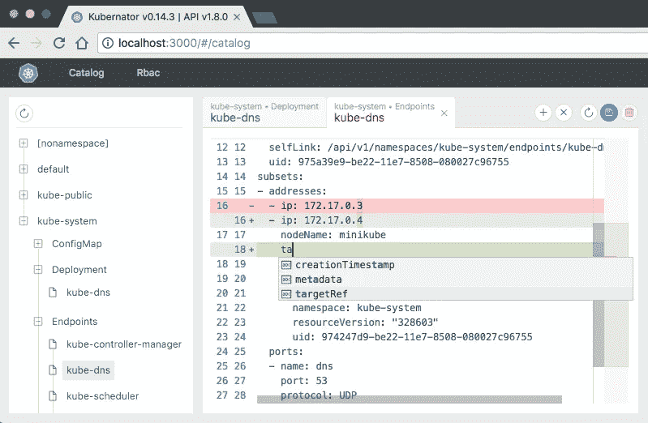
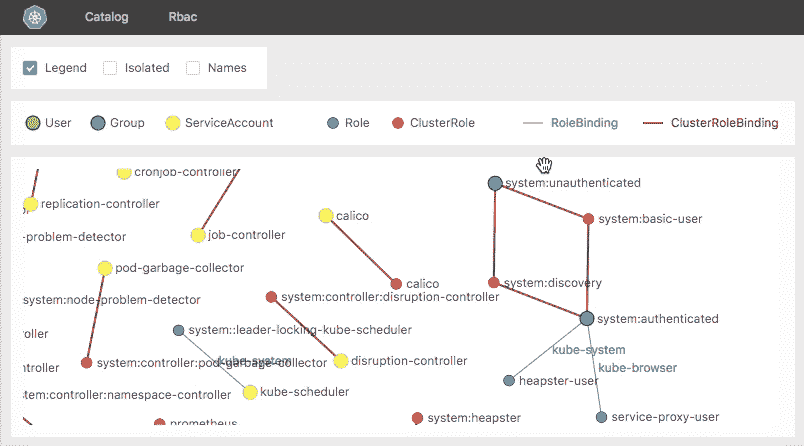

# 不到 3 分钟的 Kube 工具:Kubernator

> 原文：<https://itnext.io/kube-tool-in-less-than-3-min-kubernator-5350516c4cf7?source=collection_archive---------8----------------------->

今天，我们正在探索 Kubernetes 的替代仪表板。它不太关注绘制集群和工作负载状态，但它的主要目的是减轻对组成集群的所有这些大型 YAML 文件的负担。

首先，**感谢 smp.io** 创造了这个(以及其他许多)令人敬畏的工具。

## 快速链接

*   库伯纳特:[https://github.com/smpio/kubernator](https://github.com/smpio/kubernator)
*   掌舵图:[https://github.com/nachomillangarcia/helm-chart-kubernator](https://github.com/nachomillangarcia/helm-chart-kubernator/blob/master/README.md)



Kubernator 用户界面

Kubernator 在一个干净的、以代码为中心的 UI 中显示集群中的所有对象，包括定制资源定义(CRD)。它们按名称空间和对象类型分类。在编辑区，您可以编辑 YAML 代码，删除对象，也可以创建一个新的。正如你在截图中看到的，编辑准备提出建议，展示变化和更多的功能，这将使每个管理员高兴。

它还包括一个 *RBAC 查看器*，带有所有角色和绑定之间的关系模式:



RBAC 观察报

我不喜欢在这个工具的使用上展开更多，因为它自己的[文档](https://github.com/smpio/kubernator/blob/dev/README.md)非常简单和直观。

好吧，我们开始部署吧！与其他工具一样，我制作了一个舵图，用于在您的集群中自动部署它。GitHub 上有:[https://github.com/nachomillangarcia/helm-chart-kubernator](https://github.com/nachomillangarcia/helm-chart-kubernator)

```
helm install --name kubernator --set ingress.externalDnsName=<YOUR KUBERNATOR DNS> .
```

Kubernator 的一个警告是，它是一个客户端专用的应用程序。它直接与 Kubernetes API 连接。这意味着在正常部署下，您只能通过执行`kubectl proxy`来使用它，不可能使用入口。

我在 Helm chart 中做了一个变通方法来解决这个问题，在 pod 中添加了一个包含 kubectl 的容器，并添加了一些入口规则来将对 API 的查询重定向到该容器。

因此，该图表包括部署和服务定义，以及允许外部访问的入口和 RBAC 对象。保护入口端点非常重要；您可以随时禁用该功能(查看[自述文件](https://github.com/nachomillangarcia/helm-chart-kubernator/blob/master/README.md)获取说明)。

Kubernator 改变了我每天处理大量 YAML 定义的方式，我希望它也能帮助你。尽情享受吧！

[ignaciomillan.com](https://ignaciomillan.com)