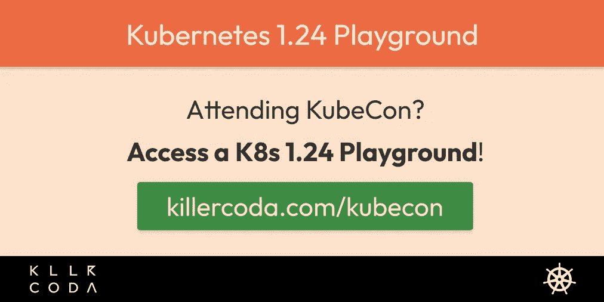

# KubeCon K8s 1.24 游乐场

> 原文：<https://itnext.io/kubecon-k8s-1-24-playground-eefe9d91cae9?source=collection_archive---------4----------------------->

## 试试你在 KubeCon 2022 中学到的东西吧！

[https://killercoda.com/kubecon](https://killercoda.com/kubecon)

# 参加 KubeCon？我们掩护你！

[Killercoda Kubernetes 游乐场](https://killercoda.com/kubecon)正在使用新鲜的 K8s 1.24 准备供您使用和休息。尝试一下你在 KubeCon 学到的新功能或新东西吧！

## 1.24 新特性？

在 [Sysdig](https://sysdig.com/blog/kubernetes-1-24-whats-new/) 的精彩概述。而[这个变化](https://twitter.com/KarlKFI/status/1525316811364765696)也会很有意思。

## 如何进入操场？

只需在[killercoda.com](https://killercoda.com/kubecon)上创建一个免费帐户，就可以开始游戏了！

## 它是如何工作的？

每次你重新加载你的浏览器标签，一个全新的 K8s 1.24 环境就会为你创建。你把事情搞砸了吗？点击刷新！

## 有使用限制吗？

环境最多可以使用一个小时，一个小时后就会过期，您可以重新加载您的标签来获取新的标签。您最多可以同时打开两个环境。

## 不仅仅是 K8s 游乐场吗？

对，还有[各种区域](https://killercoda.com/areas)！

## 任何人都可以创建场景并与他人分享吗？

是的，更多的[在这里](https://killercoda.com/creators/get-started)和[在这里](https://killercoda.com/creators)。

## 任何人都可以使用 Killercoda 进行研讨会或会议吗？

是的。

## 有更多的信息吗？

查看我们的[常见问题解答](https://killercoda.com/faq)。

## 保持最新和通知！

[推特](https://twitter.com/killercoda)

领英