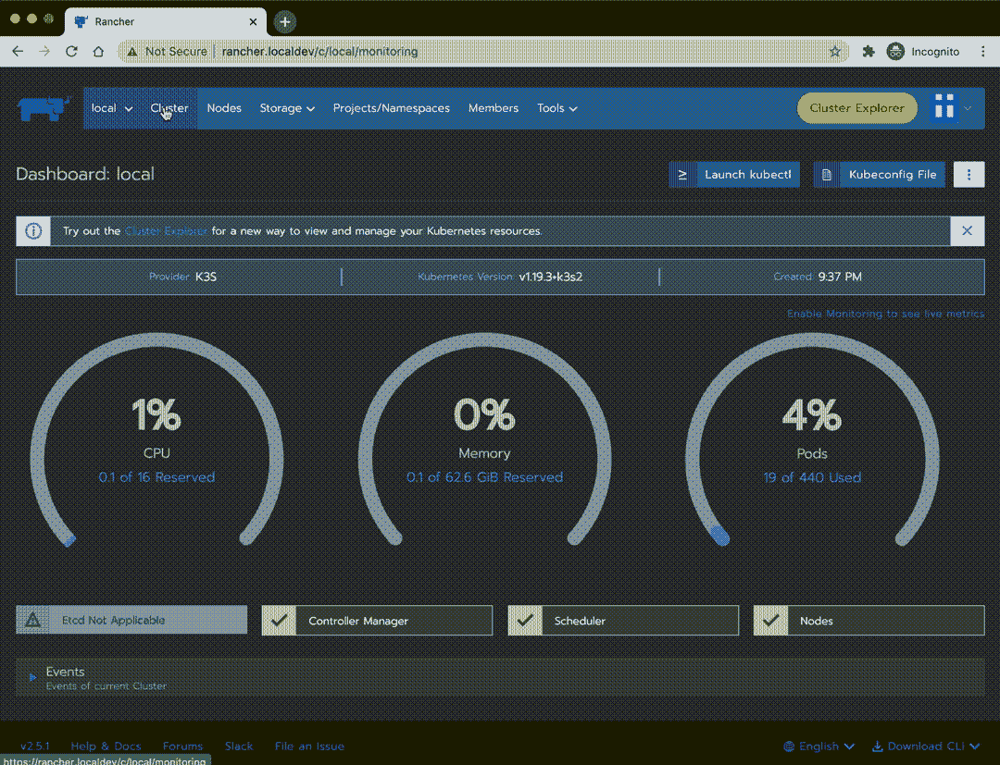
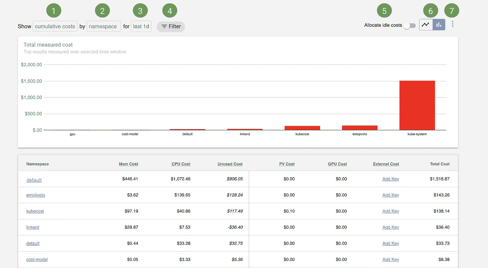
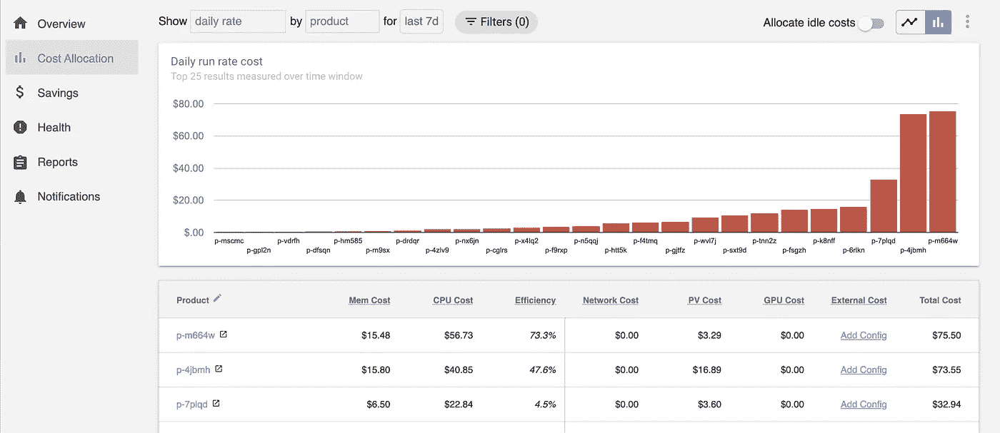

# Kubecost + Rancher = $$$节省

> 原文：<https://itnext.io/kubecost-rancher-saved-df30fe77135b?source=collection_archive---------2----------------------->

我[写了](https://medium.com/@jyeee/kubernetes-on-your-macos-laptop-with-multipass-k3s-and-rancher-2-4-6e9cbf013f58)几篇[文章](https://medium.com/@jyeee/rancher-2-4-14c31af12b7a)，讲述[牧场主集群经理](/rancher-2-4-kubernetes-on-your-macos-laptop-with-docker-k3d-b578b1c7568b)(来自被 SuSE 收购的[牧场主](https://rancher.com/))对我们的 DevOps 团队有多好。它使我们能够管理多个集群的资源，并控制其用户的权限。Rancher Cluster Manager 已经被证明对新接触 k8s 的开发人员是一个巨大的帮助，它具有可视化和使用 kubectl、部署/排除工作负载故障以及从浏览器装入 pods *的能力。*

在 k8s 中仍然很难做到的是项目成本。尽管 Rancher 为我们提供了一个 *Rancher 项目*的构造，它通过允许我们设置配额和分组名称空间/用户/秘密来帮助我们…

*   我们不知道每个命名空间的每个 pod 正在使用的节点的百分比
*   这变得更加复杂，因为一些团队将有不止一个名称空间用于开发或测试。
*   我们可以尝试使用`kubectl top`或者尝试用普罗米修斯/格拉法纳的指标做我们自己的核算，但这仍然是一个棘手的问题

谢天谢地([部分来自牧场主网络研讨会](https://opsmatters.com/events/rancher-kubernetes-master-class-kubernetes-cost-allocation-visibility-feat-kubecost))，我们发现了 [Kubecost，这是一款出色的开源产品](https://medium.com/kubecost)，安装简单，提供了[更好的 Kubernetes 成本监控方法](https://medium.com/kubecost/introducing-kubecost-a-better-approach-to-kubernetes-cost-monitoring-b5450c3ae940)！他们在 Medium 上有一些很棒的文章，他们的 Slack 社区非常有帮助。

按名称空间分组的成本，如[http://docs.kubecost.com/cost-allocation.html](http://docs.kubecost.com/cost-allocation.html)所示

更好的是，Kubecost 和 Rancher 项目彼此配合得非常好——如果您将“产品”字段设置为`field.cattle.io/projectId`,就大功告成了！

[https://kube cost/settings . html](https://kubecost.itss.forcenex.us/settings.html)

谢谢 Kubecost！！🙏🙌

这个数据也可以通过 API 获得，因此您可以在这个端点显示带有人类可读名称的 Rancher 项目:

[https://kube cost/model/aggregatedCostModel？window = 1d&offset = 1m&aggregation = label&allocate idle = false&time series = true&efficiency = true&aggregation subfield = field .黄牛. io/project id&shared namespaces =&shared split = weighted&shared label names =&shared label values =&shared split = weighted](https://kubecost.itss.forcenex.us/model/aggregatedCostModel?window=1d&offset=1m&aggregation=label&allocateIdle=false&timeSeries=true&efficiency=true&aggregationSubfield=field.cattle.io/projectId&sharedNamespaces=&sharedSplit=weighted&sharedLabelNames=&sharedLabelValues=&sharedSplit=weighted)

现在我们已经获得了这些数据，我们可以对我们的开发团队进行更好的估计，并对我们的云支出进行更好的预测。Kubecost 甚至提供了关于[如何节省额外成本和基于使用优化集群节点数量的建议](https://medium.com/kubecost/find-an-optimal-set-of-nodes-for-a-kubernetes-cluster-751e4c3b40b7)！