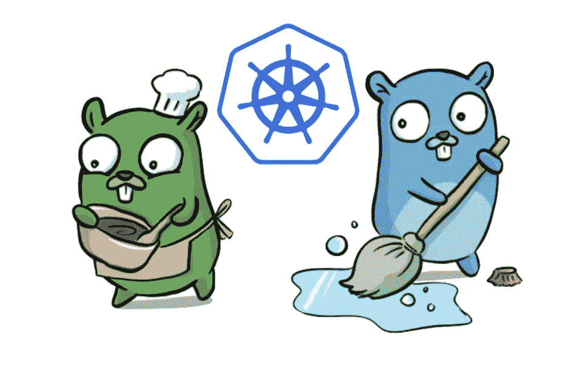
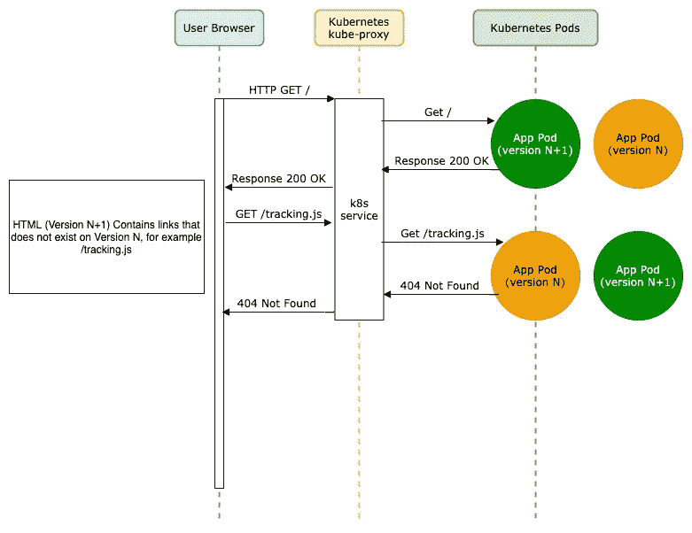

# 用于蓝/绿部署策略的 Kubectl 插件

> 原文：<https://itnext.io/kubectl-plugin-for-blue-green-deployment-strategy-cc5b40a87817?source=collection_archive---------2----------------------->

互联网上有许多文档解释了蓝/绿部署的工作原理以及在生产中使用它的优势。如果你不熟悉 Kubernetes 上的"**蓝/绿"**部署，你可以先在这篇[文章](https://www.weave.works/blog/kubernetes-deployment-strategies)中了解一下。本文的目的是解释在 Kubernetes 上部署 web 应用程序(尤其是静态 Web 应用程序)时，如果不使用“蓝/绿”策略，在发布期间可能会出现的问题。



艺术由[丹尼斯](https://twitter.com/deniseyu21)

## **滚动更新策略的问题**

每个静态 web 应用程序都包含 HTML、CSS、JavaScript 和图像资产，这些资产在两个连续版本之间可能会有所不同。
在应用发布时，没有人能保证所有版本在分布式环境中相互兼容，包括**用户浏览器缓存**、 **CDN 网络**和**为其服务的 Kubernetes 集群**。
与 **HTML** 和 **JS** 文件不同，所有其他资产都是独立的。由于 HTML 文件包含 javascript 文件的链接，在从版本(N)到版本(N+1)的每个版本中，我们可以用新的文件名和内容替换 javascript 链接/文件(构建过程的一部分)。

假设我们在 Kubernetes 中使用默认的滚动更新策略来管理我们的部署，在这种情况下，在发布时我们有两个关于 **JS** 和 **HTML** 文件的不兼容版本，如果第一个 HTTP 请求命中版本 N+1(新版本)，而来自用户的第二个 HTTP 请求(基于新版本的内容)到达版本 N(旧版本)，结果将是 **404 Not Found** ，因为旧版本没有该内容。
默认情况下，Kubernetes 盲目地将用户流量路由到 pod(因为 k8s **kube-proxy** 不知道 L7 报头请求)。



## 解决办法

使用蓝/绿部署可以解决这个问题。根据经验，同时组合不兼容的应用程序版本会导致不可预知的结果。

## 权衡取舍

有太多的技术和工具可以在 Kubernetes 上实现蓝/绿色部署，选择其中之一是一个困难的决定，就像世界上的其他决定一样，每一个都有利弊。我们应该根据我们的需求选择其中之一(或者创建一个新的解决方案)。

或许你已经知道服务网格技术，比如 [Istio](https://istio.io/) 、[consult](https://www.consul.io/)、 [Linkerd](https://linkerd.io/) 、[库马](https://kuma.io/)等等……这些技术可以处理不同的部署策略，具有大量的特性和出色的可见性。但另一方面，他们需要大量资源，还需要重新设计当前的 Kubernetes 集群，以满足实施要求。

在我的案例中，为了在一个小型且如此关键的 Kubernetes 集群中管理蓝/绿部署，我们需要一个具有**快速实施、低资源使用**和**总体** **低风险的解决方案。** 所以我们想出了创建一个简单的 [Kubectl 插件](https://github.com/afshinpaydar/kubedeploy)来管理蓝/绿部署，而不需要对我们的 k8s 集群进行巨大的改变。

## **插件如何工作****Kube-deploy**

**Kube-deploy** 插件需要两个以`-blue`和`-green`结尾的部署，每个部署都有“app”和“version”标签，如下例所示:

```
apiVersion: apps/v1
kind: Deployment
metadata:
  name: test-app-blue
  labels:
    app: test-app
    version: "V1"
spec:
  replicas: 1
  selector:
    matchLabels:
      app: test-app
  template:
    metadata:
      labels:
        app: test-app
        version: "V1"
    spec:
      containers:
        - name: test-app---
apiVersion: apps/v1
kind: Deployment
metadata:
  name: test-app-green
  labels:
    app: test-app
    version: "dormant"
spec:
  replicas: 0
  selector:
    matchLabels:
      app: test-app
  template:
    metadata:
      labels:
        app: test-app
        version: "dormant"
    spec:
      containers:
        - name: test-app
```

他们面前的服务带有“应用”和“版本”标签选择器，如下所示:

```
apiVersion: v1
kind: Service
metadata:
  name: test-app
spec:
  selector:
    app: test-app
    version: "V1"
  ports:
    - name: web
      protocol: TCP
      port: 80
```

运行`kubectl deploy bluegreen test-app V2`命令，首先将`dormant`部署(在上面的例子中:`test-app-green`)映像标签修补到版本`V2`，并等待直到该部署成功完成(为了安全部署，我们必须使用`livenessProbe`和`readinessProbe`)，然后它扩展新部署并将服务的标签选择器更改为新版本，这一更改将导致用户的流量立即转到新版本，最后旧部署将缩减到零`-replicas 0`，并将修补到下一个版本的`dormant`。

在任何情况下，如果部署到新版本失败，我们不再需要担心，因为服务和用户流量不会发生任何变化，部署将回滚，不会影响实时部署和流量。

**结论**

默认的 Kubernetes 实现并不适合每一个应用程序部署，我们应该根据我们的需求应用配置和附加组件，以帮助为用户提供更稳定的应用程序。
`[kubectl deploy](https://github.com/afshinpaydar/kubedeploy)`是一个简单的蓝/绿部署 kubectl 插件，它完成一项工作，而不会消耗更多的资源来为应用程序提供服务。它易于使用，资源消耗非常低。

Github 回购:【https://github.com/afshinpaydar/kubedeploy 