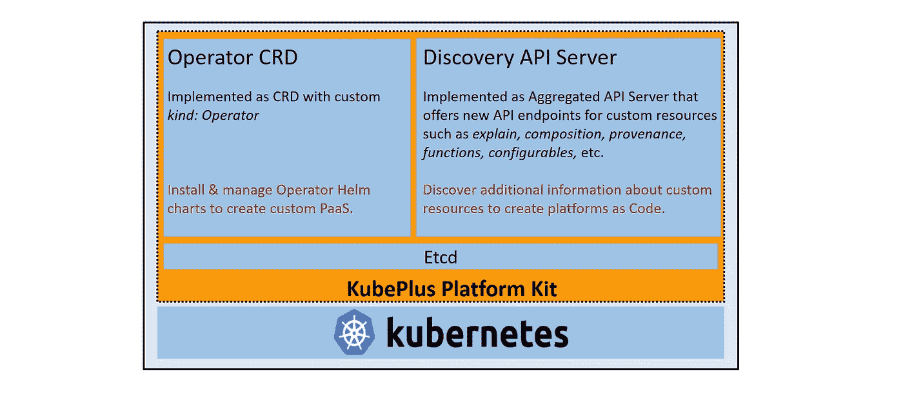
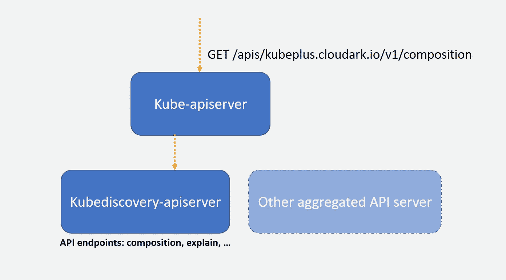
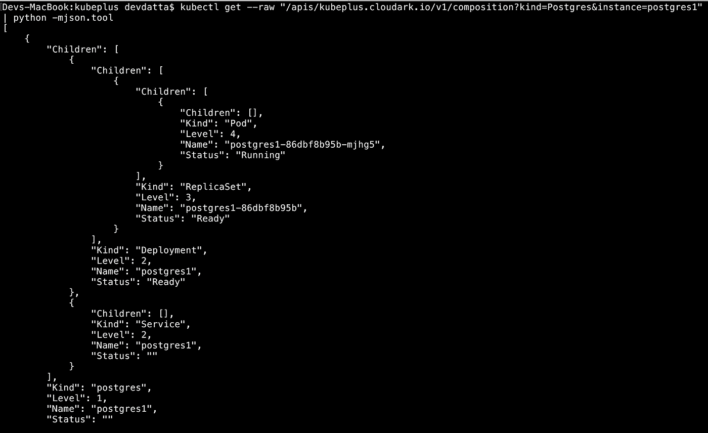
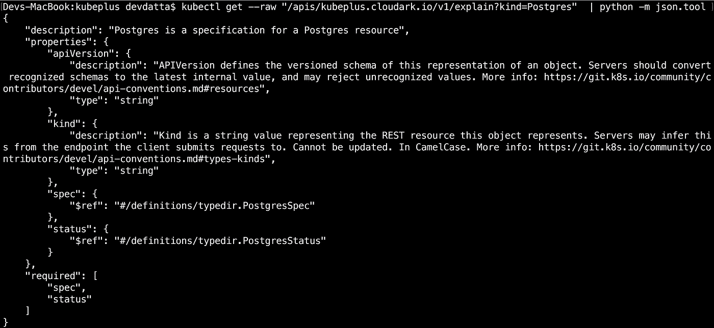
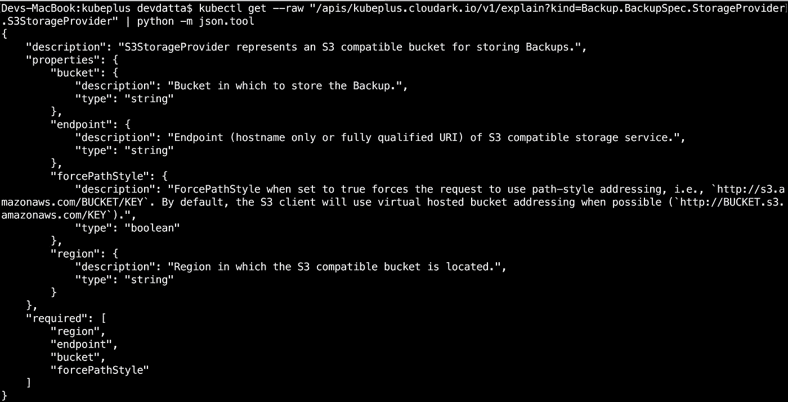

# kube discovery:Aggregated API Server 了解更多关于 Kubernetes 定制资源的信息

> 原文：<https://itnext.io/kubediscovery-aggregated-api-server-to-learn-more-about-kubernetes-custom-resources-18202a1c4aef?source=collection_archive---------2----------------------->

Kubernetes 定制资源通常由 Kubernetes 运营商引入。他们扩展了 Kubernetes API，将第三方软件作为本地 Kubernetes 对象来管理，例如 Postgres。标准的 Kubernetes 接口(Kubernetes YAML 和 kubectl)与定制资源一起工作，就像任何其他本地 Kubernetes 资源一样，比如 Pod、Deployment 等。然而，为了有意义地消费定制资源并使用它们构建应用平台，应用开发者需要更多地了解定制资源，例如它们在底层本地资源方面的组成、规范定义、支持的操作、可配置性等。在这方面，我们开发了一个名为 [Kubediscovery](https://github.com/cloud-ark/kubediscovery) 的 Kubernetes 聚合 API 服务器来提供帮助。

Kubediscovery 是我们 [KubePlus 平台工具包](https://github.com/cloud-ark/kubeplus)中的一个组件，该工具包通过简化部署、管理和使用 Kubernetes 运营商的流程来提供平台即代码体验。这是 KubePlus 的高级架构图，其中 Kubediscovery 显示为其中的 Discovery API 服务器组件。

KubePlus 平台工具包

**Kubediscovery 实施**

Kubediscovery 是一个 Kubernetes 聚合 API 服务器，它提供了新的 API 端点来传递关于定制资源的附加信息。

库贝发现

当前实现支持以下端点。

*   *合成* —根据底层资源实例检索定制资源实例的动态合成树(例如，哪些底层资源实例是 Postgres 定制资源实例的合成树的一部分。)[[*/APIs/kube plus . cloud ark . io/v1/composition*](https://github.com/cloud-ark/kubeplus/blob/master/examples/moodle/steps.txt#L71)]
*   *解释* —检索已注册定制资源的 OpenAPI 规范。[[*/APIs/kube plus . cloud ark . io/v1/explain*](https://github.com/cloud-ark/kubeplus/blob/master/examples/mysql/steps.txt#L53)]

**作文端点检索作文树**

“合成”端点用于根据其底层资源实例获得定制资源实例的动态合成树。

在 Kubernetes 中，某些资源是按层次结构组织的——父资源是使用其底层资源组成的。例如，一个部署由一个复制集组成，而复制集又由一个或多个 pod 组成。类似地，像 Postgres 这样的定制资源可以由一个部署和一个服务资源组成。

为了构建动态组合树，Kubediscovery 需要关于定制资源的资源层次结构的静态信息。为此，操作符开发人员在开发操作符时需要遵循某些准则。我们在这里详细介绍了这些指南[。Kubediscovery 上下文中的两个关键准则是:a)定义作为自定义资源的资源层次结构的一部分的基础资源，并在 CRD 注册 YAML 上添加注释(](https://github.com/cloud-ark/kubeplus/blob/master/Guidelines.md)[准则#9](https://github.com/cloud-ark/kubeplus/blob/master/Guidelines.md#9-define-underlying-resources-created-by-custom-resource-as-annotation-on-crd-registration-yaml) )，以及 b)为您的自定义资源所拥有的基础资源设置 owner references([准则#5](https://github.com/cloud-ark/kubeplus/blob/master/Guidelines.md#5-set-ownerreferences-for-underlying-resources-owned-by-your-custom-resource) )。

Kubediscovery 使用这些信息来跟踪各个资源实例的所有者引用，并构建动态合成树。这里有一个例子。它显示了“postgres”自定义资源的“postgres1”实例的合成树。

Postgres 自定义资源实例的合成树

**解释端点以检索 OpenAPI 规范**

“explain”端点用于获取自定义资源的静态信息，就像从标准的“kubectl explain”调用中获取的信息一样。这些信息本质上是定制资源的 OpenAPI 规范。在 KubePlus 中，我们提供了一个基于 kube-openapi 库的工具，为您的定制资源生成 openapi 规范。

下面是如何将“解释”端点用于自定义资源。在第一个示例中，我们使用“explain”端点来查找由我们的[示例 Postgres 操作符](https://github.com/cloud-ark/kubeplus/tree/master/postgres-crd-v2)注册的“Postgres”自定义种类的信息。在第二个示例中，我们使用“解释”来查找有关“S3StorageProvider”自定义种类的信息，该自定义种类是 Oracle MySQL 操作员的备份自定义资源规范定义的一部分。

为 Postgres 解释

解释 S3StorageProvider

目前[上游 Kubernetes](https://github.com/kubernetes/kubernetes/pull/67205) 的工作正在进行中，以扩展“kubectl explain”来处理定制资源。当 Kubediscovery 的“解释”端点功能通过主 API 服务器普遍可用时，我们计划弃用该端点。

**结论**

我们使用 Kubediscovery 的目标是帮助应用程序开发人员了解关于他们的集群上可用的定制资源的更多信息，以构建他们的应用程序平台。如上所述，目前它支持两个端点——“组合”和“解释”。未来，我们将考虑包括以下端点:

-“审计”:这将提供定制资源实例如何随时间变化的动态[血统跟踪(出处)](https://github.com/cloud-ark/kubeprovenance)。

-“功能”:这将提供关于定制资源支持哪些操作的静态信息，例如 Postgres 定制资源允许数据库创建、用户添加和密码更改功能。

-“可配置”:这将提供关于定制资源下受支持的配置参数的附加信息，这些配置参数影响底层平台元素(如 Postgres 数据库)的行为。

我们正在征求社区的意见，了解您希望在 Kubediscovery 中看到哪些额外的端点。此外，也欢迎任何关于上述端点的优先化意见。通过提交一个 [GitHub 问题](https://github.com/cloud-ark/kubeplus/issues)让我们知道。

[www.cloudark.io](https://cloudark.io/)