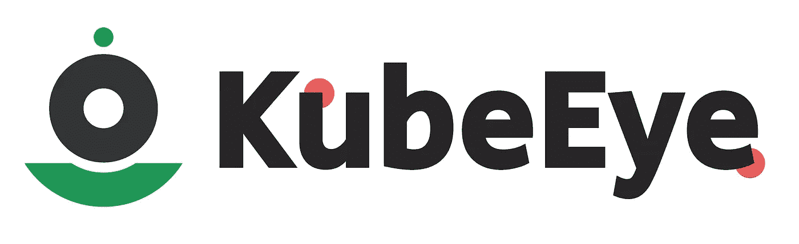
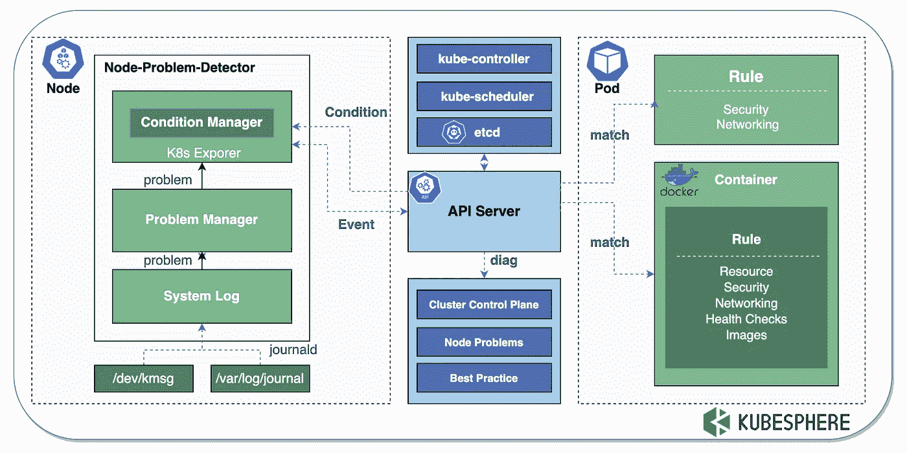
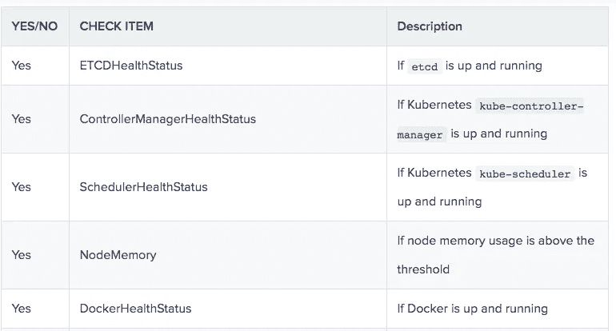
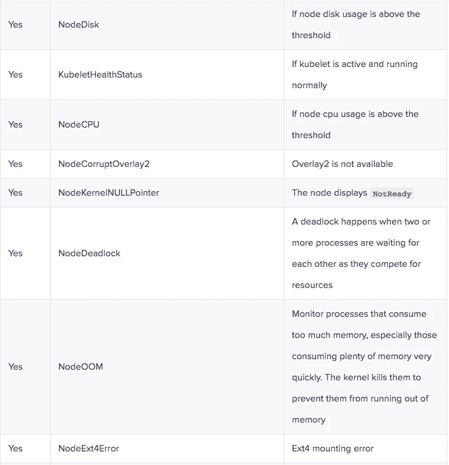
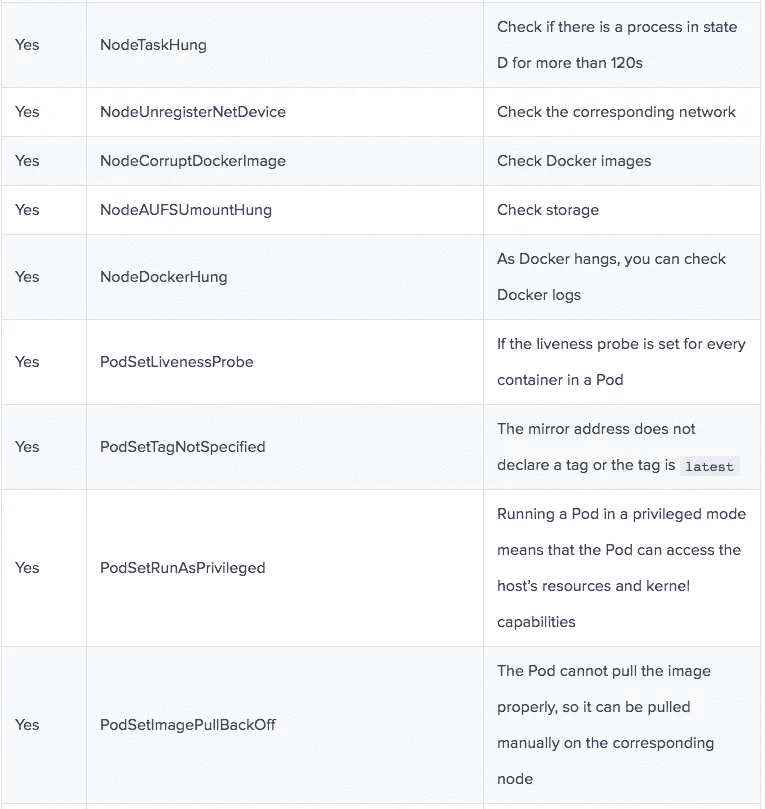
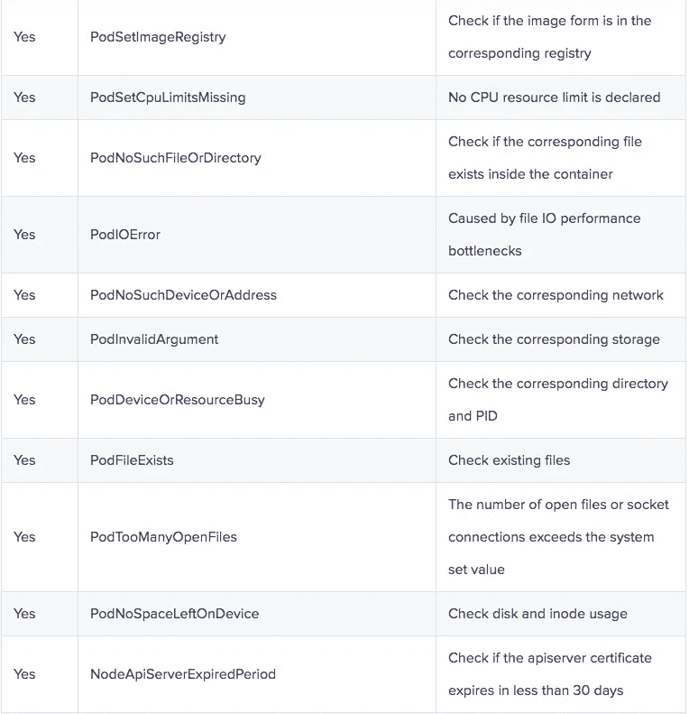
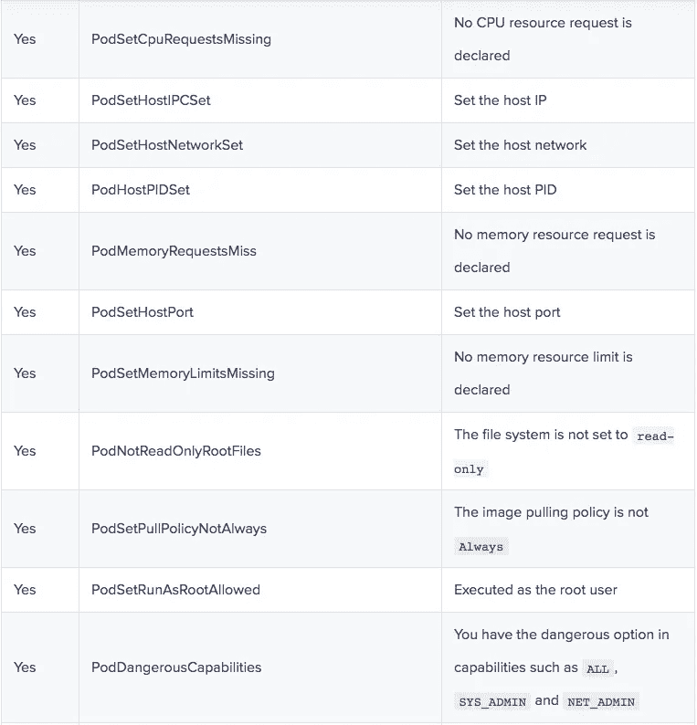
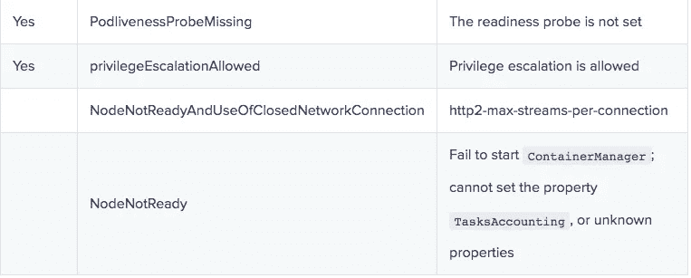

# KubeEye:一个自动诊断工具，提供 Kubernetes 集群的整体视图

> 原文：<https://itnext.io/kubeeye-an-automatic-diagnostic-tool-that-provides-a-holistic-view-of-your-kubernetes-cluster-badcb1a3ba59?source=collection_archive---------1----------------------->

[**KubeEye**](https://github.com/kubesphere/kubeeye) **是一个开源的诊断工具，用于自动识别各种 Kubernetes 集群问题，例如错误配置、不健康组件和节点故障**。它使集群操作员能够以及时、优雅的方式管理集群并对其进行故障排除。KubeEye 是在 Go 中基于 [Polaris](https://github.com/FairwindsOps/polaris) 和[节点问题检测器](https://github.com/kubernetes/node-problem-detector)开发的，内置了一系列异常检测规则。除了预定义的规则，KubeEye 还支持定制的规则。



# 为什么要开源

作为容器编排的事实上的标准，Kubernetes 具有强大而灵活的架构，支持各种云原生插件。也就是说，有一些障碍和问题长期困扰着集群运营商和工程师，例如:

*   CPU、内存或磁盘异常
*   内核死锁和文件系统损坏
*   容器运行时守护程序没有响应
*   不健康的 etcd
*   请求和限制黑盒
*   吊舱故障
*   证书过期
*   码头服务失败
*   OOM(内存不足)

其实这里列举的问题只是冰山一角。大多数集群问题都隐藏在表面之下，因为它们无法从集群控制平面直接检测到。**换句话说，即使有这些潜在的问题，Kubernetes 可能会继续将 Pods 调度到故障节点上，从而对集群的稳定性和安全性构成更大的威胁**。

为了及时发现这些问题， [KubeSphere](https://github.com/kubesphere) 团队开发了 KubeEye，它在面向社区用户和商业客户的 Kubernetes 集群生产管理和维护方面拥有三年多的专业知识。

# KubeEye 能做什么

*   识别并检测您的 Kubernetes 集群控制平面中的问题，包括`kube-apiserver`、`kube-controller-manager`和`etcd`。
*   识别和检测各种节点问题，包括内存、CPU 和磁盘压力，以及意外的内核问题。
*   验证工作负载的 YAML 规格，以获得行业最佳实践和合规性，从而提高集群稳定性。

# 库伯耶建筑

通过调用 Kubernetes API，KubeEye 定期将日志中的关键错误消息与容器语法规则进行匹配，从而获得诊断数据。请参见下面的架构图:



# 清单

以下是将由 KubeEye 检查的内置项目列表。未标记的项目仍在开发中。



# 开始使用 KubeEye

1.  克隆 KubeEye GitHub 库并安装工具。

`git clone [https://github.com/kubesphere/kubeeye.git](https://github.com/kubesphere/kubeeye.git)`

`cd kubeeye`

`make install`

*注*

*也可以从 KubeEye 的* [*GitHub 发布页面*](https://github.com/kubesphere/kubeeye/releases) *下载可执行文件。*

2.安装节点问题检测器(可选)，它将在集群中作为守护程序运行。你只需要安装 NPD 当你想要详细的报告。

`ke install npd`

3.使用 KubeEye 对您的集群进行诊断。

```
$ ke diag
NODENAME        SEVERITY     HEARTBEATTIME               REASON              MESSAGE
node18          Fatal        2020-11-19T10:32:03+08:00   NodeStatusUnknown   Kubelet stopped posting node status.
node19          Fatal        2020-11-19T10:31:37+08:00   NodeStatusUnknown   Kubelet stopped posting node status.
node2           Fatal        2020-11-19T10:31:14+08:00   NodeStatusUnknown   Kubelet stopped posting node status.
node3           Fatal        2020-11-27T17:36:53+08:00   KubeletNotReady     Container runtime not ready: RuntimeReady=false reason:DockerDaemonNotReady message:docker: failed to get docker version: Cannot connect to the Docker daemon at unix:///var/run/docker.sock. Is the docker daemon running?

NAME            SEVERITY     TIME                        MESSAGE
scheduler       Fatal        2020-11-27T17:09:59+08:00   Get [http://127.0.0.1:10251/healthz](http://127.0.0.1:10251/healthz): dial tcp 127.0.0.1:10251: connect: connection refused
etcd-0          Fatal        2020-11-27T17:56:37+08:00   Get [https://192.168.13.8:2379/health](https://192.168.13.8:2379/health): dial tcp 192.168.13.8:2379: connect: connection refused

NAMESPACE       SEVERITY     PODNAME                                          EVENTTIME                   REASON                MESSAGE
default         Warning      node3.164b53d23ea79fc7                           2020-11-27T17:37:34+08:00   ContainerGCFailed     rpc error: code = Unknown desc = Cannot connect to the Docker daemon at unix:///var/run/docker.sock. Is the docker daemon running?
default         Warning      node3.164b553ca5740aae                           2020-11-27T18:03:31+08:00   FreeDiskSpaceFailed   failed to garbage collect required amount of images. Wanted to free 5399374233 bytes, but freed 416077545 bytes
default         Warning      nginx-b8ffcf679-q4n9v.16491643e6b68cd7           2020-11-27T17:09:24+08:00   Failed                Error: ImagePullBackOff
default         Warning      node3.164b5861e041a60e                           2020-11-27T19:01:09+08:00   SystemOOM             System OOM encountered, victim process: stress, pid: 16713
default         Warning      node3.164b58660f8d4590                           2020-11-27T19:01:27+08:00   OOMKilling            Out of memory: Kill process 16711 (stress) score 205 or sacrifice child Killed process 16711 (stress), UID 0, total-vm:826516kB, anon-rss:819296kB, file-rss:0kB, shmem-rss:0kB
insights-agent  Warning      workloads-1606467120.164b519ca8c67416            2020-11-27T16:57:05+08:00   DeadlineExceeded      Job was active longer than specified deadline
kube-system     Warning      calico-node-zvl9t.164b3dc50580845d               2020-11-27T17:09:35+08:00   DNSConfigForming      Nameserver limits were exceeded, some nameservers have been omitted, the applied nameserver line is: 100.64.11.3 114.114.114.114 119.29.29.29
kube-system     Warning      kube-proxy-4bnn7.164b3dc4f4c4125d                2020-11-27T17:09:09+08:00   DNSConfigForming      Nameserver limits were exceeded, some nameservers have been omitted, the applied nameserver line is: 100.64.11.3 114.114.114.114 119.29.29.29
kube-system     Warning      nodelocaldns-2zbhh.164b3dc4f42d358b              2020-11-27T17:09:14+08:00   DNSConfigForming      Nameserver limits were exceeded, some nameservers have been omitted, the applied nameserver line is: 100.64.11.3 114.114.114.114 119.29.29.29

NAMESPACE       SEVERITY     NAME                      KIND         TIME                        MESSAGE
kube-system     Warning      node-problem-detector     DaemonSet    2020-11-27T17:09:59+08:00   [livenessProbeMissing runAsPrivileged]
kube-system     Warning      calico-node               DaemonSet    2020-11-27T17:09:59+08:00   [runAsPrivileged cpuLimitsMissing]
kube-system     Warning      nodelocaldns              DaemonSet    2020-11-27T17:09:59+08:00   [cpuLimitsMissing runAsPrivileged]
default         Warning      nginx                     Deployment   2020-11-27T17:09:59+08:00   [cpuLimitsMissing livenessProbeMissing tagNotSpecified]
insights-agent  Warning      workloads                 CronJob      2020-11-27T17:09:59+08:00   [livenessProbeMissing]
insights-agent  Warning      cronjob-executor          Job          2020-11-27T17:09:59+08:00   [livenessProbeMissing]
kube-system     Warning      calico-kube-controllers   Deployment   2020-11-27T17:09:59+08:00   [cpuLimitsMissing livenessProbeMissing]
kube-system     Warning      coredns                   Deployment   2020-11-27T17:09:59+08:00   [cpuLimitsMissing]
```

# 添加自定义检查规则

除了预定义的诊断项目和规则，KubeEye 还支持自定义规则。例如:

1.  确保您已经安装了 NPD。

`ke install npd`

2.使用 Kubectl 编辑其配置图。

`kubectl edit cm -n kube-system node-problem-detector-config`

3.为异常日志在配置映射中添加正则表达式规则。

# 自定义最佳实践规则

1.  在 YAML 创建一个规则。例如，下面的规则检查您的 Pod 规格，以确保图像仅来自授权的注册表。

```
checks:
  imageFromUnauthorizedRegistry: warning

customChecks:
  imageFromUnauthorizedRegistry:
    promptMessage: When the corresponding rule does not match, show that image from an unauthorized registry.
    category: Images
    target: Container
    schema:
      '$schema': [http://json-schema.org/draft-07/schema](http://json-schema.org/draft-07/schema)
      type: object
      properties:
        image:
          type: string
          not:
            pattern: ^quay.io
```

2.保存文件，比如`rule.yaml`。

3.用 YAML 的文件运行库比耶。

```
$ ke diag -f rule.yaml --kubeconfig ~/.kube/config
NAMESPACE     SEVERITY    NAME                      KIND         TIME                        MESSAGE
default       Warning     nginx                     Deployment   2020-11-27T17:18:31+08:00   [imageFromUnauthorizedRegistry]
kube-system   Warning     node-problem-detector     DaemonSet    2020-11-27T17:18:31+08:00   [livenessProbeMissing runAsPrivileged]
kube-system   Warning     calico-node               DaemonSet    2020-11-27T17:18:31+08:00   [cpuLimitsMissing runAsPrivileged]
kube-system   Warning     calico-kube-controllers   Deployment   2020-11-27T17:18:31+08:00   [cpuLimitsMissing livenessProbeMissing]
kube-system   Warning     nodelocaldns              DaemonSet    2020-11-27T17:18:31+08:00   [runAsPrivileged cpuLimitsMissing]
default       Warning     nginx                     Deployment   2020-11-27T17:18:31+08:00   [livenessProbeMissing cpuLimitsMissing]
kube-system   Warning     coredns                   Deployment   2020-11-27T17:18:31+08:00   [cpuLimitsMissing]
```

# 路标

展望未来，KubeEye 将增加对以下内容的支持:

*   细粒度的诊断项目，比如 Kubernetes 集群响应时间慢。
*   KubeSphere 组件的诊断，如 DevOps 和 service mesh。
*   集群网络和存储的诊断。

# 参考

[KubeEye GitHub 库](https://github.com/kubesphere/kubeeye)

[忽必烈常见问题解答](https://github.com/kubesphere/kubeeye/blob/main/docs/FAQ.md)

[节点问题检测器](https://github.com/kubernetes/node-problem-detector)

# 关于 KubeSphere

KubeSphere 是一个基于 Kubernetes 的开源容器平台，其核心是应用程序。它提供全栈 It 自动化操作和简化的开发运维工作流。

KubeSphere 已被全球数千家企业采用，如 Aqara、新浪、奔来、中国太平、华夏银行、国药控股、微众银行、Geko Cloud、VNG 公司和 Radore。KubeSphere 提供向导界面和各种企业级的运维功能，包括 Kubernetes 资源管理、DevOps (CI/CD)、应用生命周期管理、服务网格、多租户管理、监控、日志记录、警报、通知、存储和网络管理以及 GPU 支持。有了 KubeSphere，企业能够快速建立一个强大且功能丰富的容器平台。

更多信息请访问 [https://kubesphere.io](https://kubesphere.io)