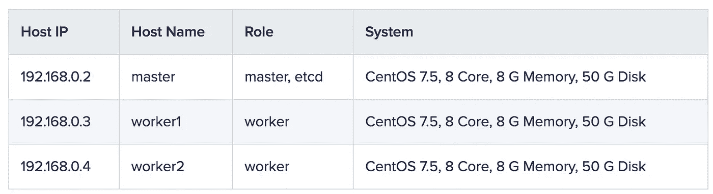
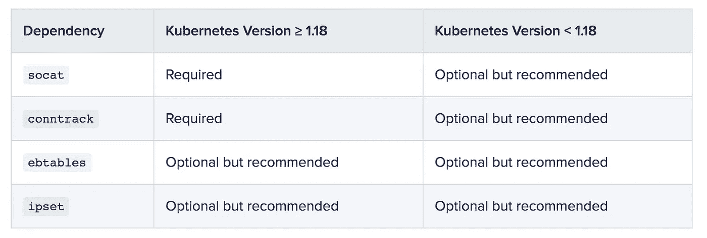
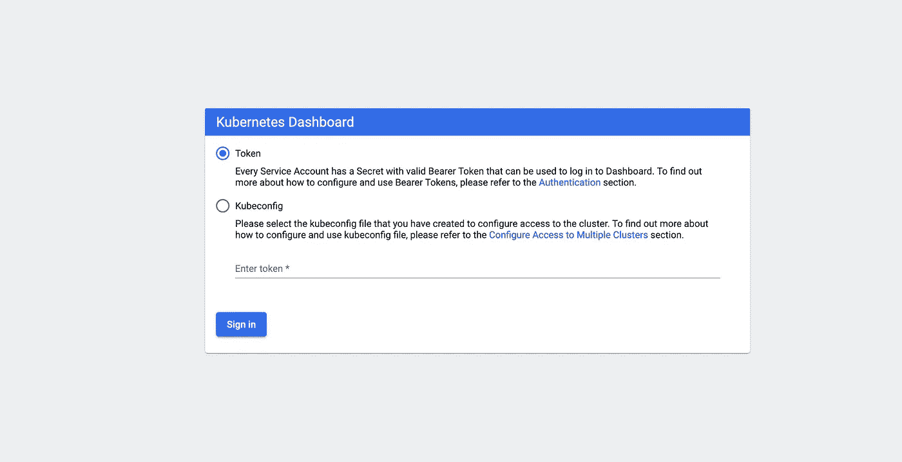
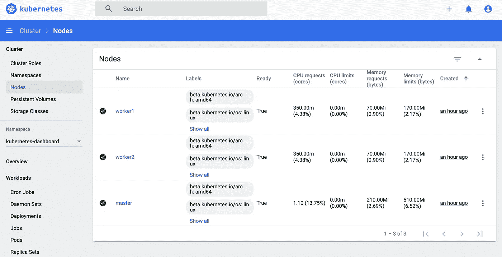
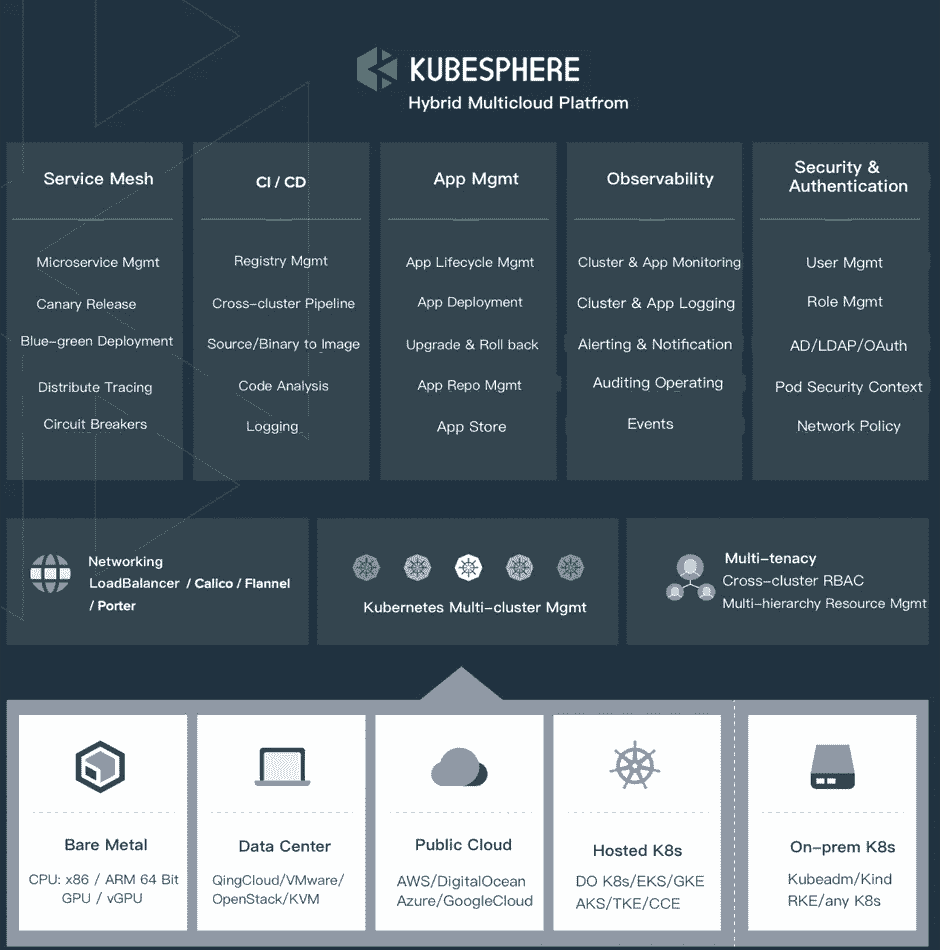
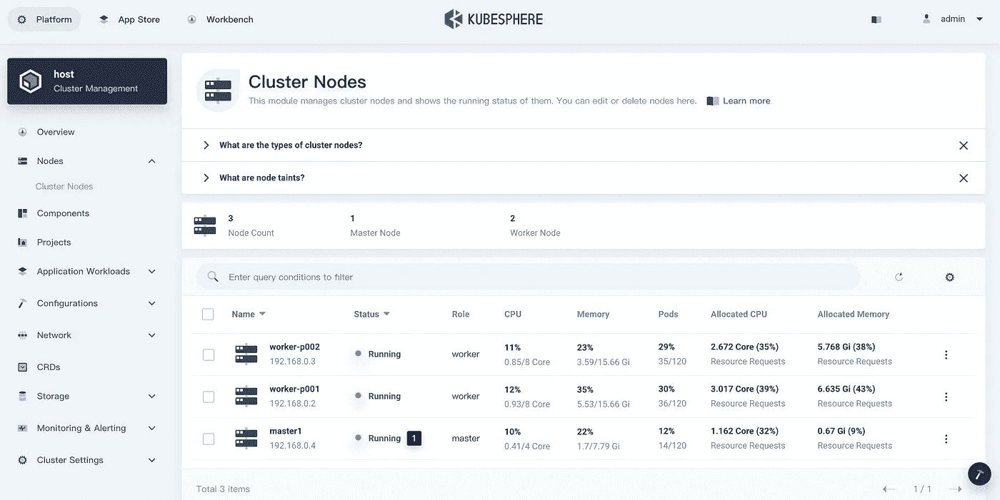

# KubeKey:安装 Kubernetes 和云原生插件的游戏改变者

> 原文：<https://itnext.io/kubekey-a-game-changer-for-the-installation-of-kubernetes-and-cloud-native-plugins-b8f2edcfafcc?source=collection_archive---------2----------------------->

由于 Kubernetes 是容器编排的事实上的标准，Kubernetes 的安装仍然是 Kubernetes 用户面临的最大挑战之一，尤其是新手。除了 Kubernetes 本身，他们还需要弄清楚如何安装安装所需的不同工具，比如 kubelet、kubeadm 和 kubectl。他们一直想知道是否有一个包含所有堆栈的工具，这样他们就可以只运行几个安装命令。

在本文中，我将演示如何使用 KubeKey 建立一个三节点 Kubernetes 集群。

# 什么是 KubeKey

KubeKey 在 Go 中开发，提供了一种简单、快速和灵活的方式来安装 Kubernetes 和任何可以部署为 YAML 或图表文件的附加组件。KubeKey 使用 kubeadm 在节点上尽可能并行地安装 Kubernetes 集群，以便降低安装复杂度，提高效率。与其他安装方法相比，它大大节省了安装时间。

众所周知，Kubernetes 集群可以跨内部环境、公共云、私有云或裸机进行部署。因此，它可以作为部署云原生应用的综合平台。然而，每个环境可能需要不同的配置和设置。事实上，这就是 KubeKey 改变游戏的地方，因为您可以使用它在任何环境中部署 Kubernetes。

使用 KubeKey 安装 Kubernetes 的一般步骤:

1.  下载 KubeKey。
2.  创建包含群集信息的配置文件，如主机和附加组件。
3.  应用配置文件，安装将自动开始。docker 等工具都将自动安装。

# 准备主机

我将在云上创建一个包含三个节点的集群。以下是我的机器配置供你参考:



*注*

*   *路径* `*/var/lib/docker*` *主要用于存储容器数据，在使用和运行过程中会逐渐变大。在生产环境中，建议* `*/var/lib/docker*` *单独挂载一个驱动器。*
*   建议您的操作系统保持干净(不安装任何其他软件)。否则，可能会有冲突。

# 节点要求

*   所有节点必须可以通过`SSH`访问。
*   所有节点的时间同步。
*   所有节点都应使用`sudo` / `curl` / `openssl`。
*   你可以预先在所有节点上安装 docker。或者，KubeKey 会在安装 Kubernetes 的同时自动安装 docker。如果从`dockerhub.io`下载图像有困难，建议准备一个镜像。更多信息，请参见[为 Docker 守护进程](https://docs.docker.com/registry/recipes/mirror/#configure-the-docker-daemon)配置注册表镜像。

# 依赖性要求

您可以使用 KubeKey 来安装指定的 Kubernetes 版本。根据要安装的 Kubernetes 版本，需要安装的依赖项可能会有所不同。您可以参考下面的列表，看看是否需要提前在您的所有节点上安装相关的依赖项。



# 网络和 DNS 要求

*   确保`/etc/resolv.conf`中的 DNS 地址可用。否则，可能会导致集群中的 DNS 出现一些问题。
*   如果您的网络配置使用防火墙规则或安全组，您必须确保基础架构组件可以通过特定端口相互通信。建议您关闭防火墙。更多信息，请参见[网络访问](https://github.com/kubesphere/kubekey/blob/master/docs/network-access.md)。

# 安装 Kubernetes

1.  从其 [GitHub 发布页面](https://github.com/kubesphere/kubekey/releases)下载 KubeKey，或者使用以下命令下载 KubeKey 版本 1.0.1。您只需要将 KubeKey 下载到您的一台作为**任务盒**进行安装的机器上，例如主节点。

`curl -sfL https://get-kk.kubesphere.io | VERSION=v1.0.1 sh -`

*注*

*您可以在命令中更改版本号，以下载特定版本*。

2.上面的命令下载 KubeKey 并解压文件。您的文件夹现在包含一个名为`kk`的文件。使其可执行:

`chmod +x kk`

3.现在 KubeKey 已经准备好了，我可以开始创建配置文件来指定集群信息。下面是创建配置文件的命令模板，它允许您使用定制的名称和路径安装指定的 Kubernetes 版本:

`./kk create config [--with-kubernetes version] [(-f | --file) path]`

默认的 Kubernetes 版本是 v1.17.9。有关受支持的 Kubernetes 版本的更多信息，请参见此[文件](https://github.com/kubesphere/kubekey/blob/master/docs/kubernetes-versions.md)。以执行以下命令为例:

`./kk create config --with-kubernetes v1.17.9`

4.如果您不自定义名称，将会创建一个默认文件`config-sample.yaml`。编辑文件。

`vi config-sample.yaml`

5.您将看到文件中预先填充了一些值。以下是我的配置供你参考:

```
apiVersion: kubekey.kubesphere.io/v1alpha1
kind: Cluster
metadata:
  name: sample
spec:
  hosts:
  - {name: master, address: 192.168.0.2, internalAddress: 192.168.0.2, user: root, password: Testing123}
  - {name: worker1, address: 192.168.0.3, internalAddress: 192.168.0.3, user: root, password: Testing123}
  - {name: worker2, address: 192.168.0.4, internalAddress: 192.168.0.4, user: root, password: Testing123}
  roleGroups:
    etcd:
    - master
    master:
    - master
    worker:
    - worker1
    - worker2
  controlPlaneEndpoint:
    domain: lb.kubesphere.local
    address: ""
    port: "6443"
  kubernetes:
    version: v1.17.9
    imageRepo: kubesphere
    clusterName: cluster.local
  network:
    plugin: calico
    kubePodsCIDR: 10.233.64.0/18
    kubeServiceCIDR: 10.233.0.0/18
  registry:
    registryMirrors: []
    insecureRegistries: []
  addons: []
```

在这个示例文件中，在`hosts`下面列出您的所有机器，并添加它们的详细信息。

*   `name`:实例的主机名。
*   `address`:通过 SSH 连接 taskbox 和其他实例的 IP 地址。这可以是公共 IP 地址，也可以是私有 IP 地址，具体取决于您的环境。例如，一些云平台为每个实例提供一个公共 IP 地址，您可以使用该地址通过 SSH 访问实例。在这种情况下，您可以为该字段输入公共 IP 地址。
*   `internalAddress`:实例的私有 IP 地址。
*   `user`和`password`字段表示您用来连接到实例的用户和密码。对于使用 SSH 密钥的无密码登录，您需要提供您的私钥路径，如下所示:

`hosts: - {name: master, address: 192.168.0.2, internalAddress: 192.168.0.2, privateKeyPath: "~/.ssh/id_rsa"}`

*   `etcd` : etcd 节点名称。
*   `master`:主节点名称。
*   `worker`:工作者节点名称。

你可以在这个配置文件中提供更多的值，比如`addons`。KubeKey 可以安装所有可以作为 YAML 文件或图表文件安装的[插件](https://github.com/kubesphere/kubekey/blob/release-1.0/docs/addons.md)。例如，KubeKey 在默认情况下不会为 Kubernetes 安装任何存储插件，但是您可以[添加自己的存储系统](https://kubesphere.io/docs/installing-on-linux/introduction/storage-configuration/)，包括 NFS 客户端、Ceph 和 Glusterfs。有关配置文件的更多信息，请参见 [Kubernetes 集群配置](https://kubesphere.io/docs/installing-on-linux/introduction/vars/)和[该文件](https://github.com/kubesphere/kubekey/blob/release-1.0/docs/config-example.md)。

6.完成编辑后保存文件，并执行以下命令来安装 Kubernetes:

`./kk create cluster -f config-sample.yaml`

7.安装完成后，您可以看到如下输出。

`Congratulations! Installation is successful.`

8.执行以下命令来检查名称空间的状态。

`kubectl get pod --all-namespaces`

```
NAMESPACE     NAME               READY   STATUS    RESTARTS   AGE
kube-system   calico-kube-
              controllers-
              59d85c5c84-mqk9g   1/1     Running   0         2m56s
kube-system   calico-node-hp6b5  1/1     Running   0         2m56s
kube-system   calico-node-stxj8  1/1     Running   0         2m55s
kube-system   calico-node-wzjn9  1/1     Running   0         2m55s
kube-system   coredns-74d59cc5c6
              -dkpq4             1/1     Running   0         3m5s
kube-system   coredns-74d59cc5c6
              -v2bvx             1/1     Running   0         3m5s
kube-system   kube-apiserver
              -master            1/1     Running   0         3m22s
kube-system   kube-controller
             -manager-master     1/1     Running   0         3m22s
kube-system   kube-proxy-5h6bv   1/1     Running   0         2m55s
kube-system   kube-proxy-btfxl   1/1     Running   0         3m5s
kube-system   kube-proxy-rht2m   1/1     Running   0         2m55s
kube-system   kube-scheduler
              -master            1/1     Running   0         3m22s
kube-system   nodelocaldns-2fkqb 1/1     Running   0         2m55s
kube-system   nodelocaldns-5gzmn 1/1     Running   0         2m55s
kube-system   nodelocaldns-mggpb 1/1     Running   0         3m5s
```

# 访问 Kubernetes 仪表板

1.  为了更直观地查看集群资源，可以访问基于 web 的 Kubernetes 用户界面。默认情况下，KubeKey 不会安装它。要部署它，请运行以下命令:

`kubectl apply -f [https://raw.githubusercontent.com/kubernetes/dashboard/v2.0.0/aio/deploy/recommended.yaml](https://raw.githubusercontent.com/kubernetes/dashboard/v2.0.0/aio/deploy/recommended.yaml)`

2.要访问 Kubernetes 仪表板，您可以运行`kubectl proxy`,如其官方文档[所述，而仪表板只能从执行命令的机器上访问。执行以下命令，您可以看到仪表板服务类型是`ClusterIP`。](https://kubernetes.io/docs/tasks/access-application-cluster/web-ui-dashboard/#accessing-the-dashboard-ui)

`kubectl get svc -n kubernetes-dashboard`

```
NAME        TYPE        CLUSTER-IP      EXTERNAL-IP   PORT(S)    AGEdashboard-
metrics-
scraper    ClusterIP   10.233.45.187   <none>      8000/TCP   5m51skubernetes-
dashboard   ClusterIP   10.233.62.52    <none>      443/TCP    5m51s
```

3.由于我的机器都在云上，我需要通过`NodePort`公开仪表板服务，这样我就可以在集群之外访问它。运行以下命令:

`kubectl edit svc kubernetes-dashboard -o yaml -n kubernetes-dashboard`

4.导航至`.spec.type`并将`ClusterIP`更改为`NodePort`。

```
spec:
  clusterIP: 10.233.62.52
  ports:
  - port: 443
    protocol: TCP
    targetPort: 8443
  selector:
    k8s-app: kubernetes-dashboard
  sessionAffinity: None
  type: NodePort  # Change ClusterIP to NodePort.
```

5.保存文件并再次检查仪表板服务。您可以看到仪表板服务是公开的。

`kubectl get svc -n kubernetes-dashboard`

```
NAME     TYPE        CLUSTER-IP      EXTERNAL-IP   PORT(S)      AGEdashboard-
metrics-
scraper   ClusterIP   10.233.45.187   <none>      8000/TCP       12m
kubernetes
-dashboard   NodePort    10.233.62.52    <none>  443:31259/TCP   12m
```

6.由于端口`31259`在本例中是公开的，所以我可以在`[https://IP:31259](https://IP:31259.)` [访问仪表板。](https://IP:31259.)



*注*

*根据您的环境，您可能需要在安全组中配置端口转发规则并打开端口。*

7.要登录到仪表板，您需要创建一个 ServiceAccount 对象和一个 ClusterRoleBinding 对象。在名称空间`kubernetes-dashboard`中创建名为`admin-user`的帐户。

`cat <<EOF | kubectl apply -f - apiVersion: v1 kind: ServiceAccount metadata: name: admin-user namespace: kubernetes-dashboard EOF`

创建 ClusterRoleBinding 对象。

```
cat <<EOF | kubectl apply -f -
apiVersion: rbac.authorization.k8s.io/v1
kind: ClusterRoleBinding
metadata:
  name: admin-user
roleRef:
  apiGroup: rbac.authorization.k8s.io
  kind: ClusterRole
  name: cluster-admin
subjects:
- kind: ServiceAccount
  name: admin-user
  namespace: kubernetes-dashboard
EOF
```

8.执行以下命令以获取不记名令牌来登录仪表板。

对于 Bash:

`kubectl -n kubernetes-dashboard describe secret $(kubectl -n kubernetes-dashboard get secret | grep admin-user | awk '{print $1}')`

对于 Powershell:

`kubectl -n kubernetes-dashboard describe secret $(kubectl -n kubernetes-dashboard get secret | sls admin-user | ForEach-Object { $_ -Split '\s+' } | Select -First 1)`

预期产出:

```
Name:         admin-user-token-flkqz
Namespace:    kubernetes-dashboard
Labels:       <none>
Annotations:  kubernetes.io/service-account.name: admin-user
              kubernetes.io/service-account.uid: 78870e66-89c1-4750-915d-b147dbba66cb

Type:  kubernetes.io/service-account-token

Data
====
ca.crt:     1025 bytes
namespace:  20 bytes
token:      eyJhbGciOiJSUzI1NiIsImtpZCI6Im9EaXNLOWUyV21UcDhOVzFUanl6bnRzdHBocWF6bjhLcXltSGM1Ulc5aVUifQ.eyJpc3MiOiJrdWJlcm5ldGVzL3NlcnZpY2VhY2NvdW50Iiwia3ViZXJuZXRlcy5pby9zZXJ2aWNlYWNjb3VudC9uYW1lc3BhY2UiOiJrdWJlcm5ldGVzLWRhc2hib2FyZCIsImt1YmVybmV0ZXMuaW8vc2VydmljZWFjY291bnQvc2VjcmV0Lm5hbWUiOiJhZG1pbi11c2VyLXRva2VuLWZsa3F6Iiwia3ViZXJuZXRlcy5pby9zZXJ2aWNlYWNjb3VudC9zZXJ2aWNlLWFjY291bnQubmFtZSI6ImFkbWluLXVzZXIiLCJrdWJlcm5ldGVzLmlvL3NlcnZpY2VhY2NvdW50L3NlcnZpY2UtYWNjb3VudC51aWQiOiI3ODg3MGU2Ni04OWMxLTQ3NTAtOTE1ZC1iMTQ3ZGJiYTY2Y2IiLCJzdWIiOiJzeXN0ZW06c2VydmljZWFjY291bnQ6a3ViZXJuZXRlcy1kYXNoYm9hcmQ6YWRtaW4tdXNlciJ9.SKseCm1u7Yga0jx2nFf5x4FoHgOONWQ8S1yDdPGXoZpuUShCr8b6ofmISHDi_Tsk3qQfwlMA99NWkLKeM6ijktULIbk9Y11GjMh0-rWjdxQPbxB6Bh0LGYh4SGLl_hNkYOVxd_1r8H-hddRHbkfs8t4eH-pUjQewC7LrCG5SQNrHtQnyuDleQQdSq1TNtDviCA17cL_XFomRkomqi4Vy7QExwEDYaNy7-9c_C-59Hh5QexZ4MoR8WsZewR-uXr_z2RmbTnuXaK-1wkIHt-niFdgxozGg4tcPvlIQ7XvJGMKXcSnrqnaieImUY_Y_6_Z8wm6LJl4XaypjhnYqJZD3wA
```

9.复制令牌并将其粘贴到**输入令牌**字段，点击**登录**。现在，您可以在仪表板上查看节点信息和编辑资源。



# KubeSphere 及其图形仪表盘

[KubeSphere](https://kubesphere.io/) 是一个**分布式操作系统，管理以 Kubernetes 为内核的云原生应用**。作为一个开源的企业级容器平台，它拥有全栈自动化 it 操作、多集群管理和简化的 DevOps 工作流。这是 KubeSphere 的建筑。



此外，KubeSphere 还拥有自己的基于网络的响应控制台，比 Kubernetes 仪表板更加强大和全面。拥有必要权限的用户可以直接在控制台上操作资源，同时他们还可以选择使用内置的 web 工具 kubectl。



事实上，您可以使用 KubeKey 同时安装 Kubernetes 和 KubeSphere。这个过程基本上是一样的，只是你需要在运行命令`./kk create config`时添加标志`--with-kubesphere [version]`。有关更多信息，请查看 KubeSphere 文档。

请观看此视频，了解实际操作教程:

在 Google Cloud 上安装一个多节点 Kubernetes 和 KubeSphere 集群

# 摘要

我在本文中演示的安装过程只是 KubeKey 所能做到的一小部分。除了安装 Kubernetes 和 KubeSphere 之外，您还可以使用它来扩展和升级您的集群。它还支持[气隙安装](https://kubesphere.io/docs/installing-on-linux/introduction/air-gapped-installation/)，只要你提前下载安装镜像。

我希望这篇文章能对那些长期以来一直在寻找安装方法的人有所帮助。我认为，有了 KubeKey，Kubernetes 社区在安装效率和用户体验方面向前迈进了一大步。

# 参考

[库伯基](https://github.com/kubesphere/kubekey)

[Kubernetes 仪表盘](https://kubernetes.io/docs/tasks/access-application-cluster/web-ui-dashboard/)

[多节点安装](https://kubesphere.io/docs/installing-on-linux/introduction/multioverview/)