# Kubernetes 本地无服务器框架

> 原文：<https://itnext.io/kubeless-kubernetes-native-serverless-framework-3d0f96e03add?source=collection_archive---------2----------------------->

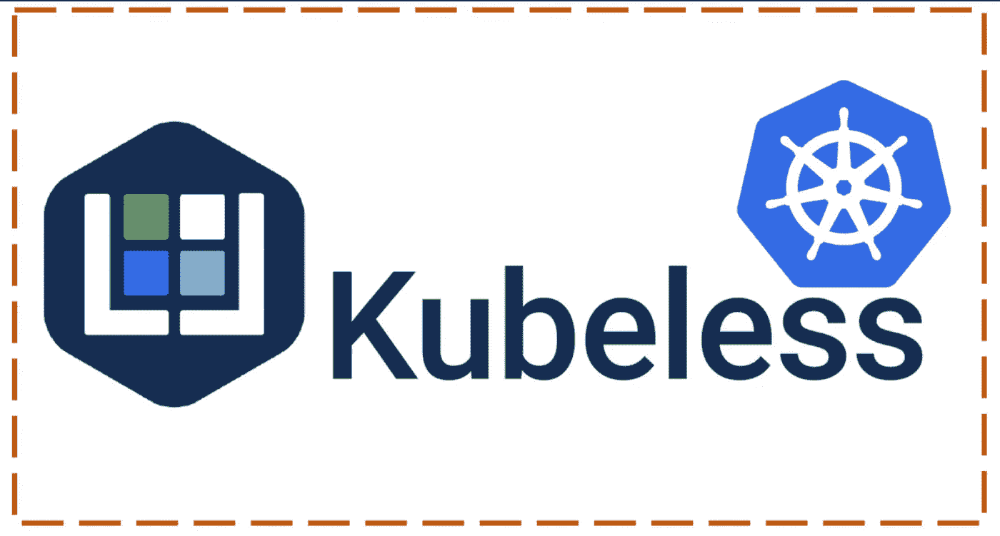

功能即服务(FaaS)

云计算行业有一个新的流行词——无服务器。无服务器计算消除了对服务器创建、维护、硬件、中断、支持和人力资源的担忧。无服务器架构利用云平台及其资源来处理供应基础设施以运行一段代码。这使得开发人员能够编写一段代码，并且在指定的云基础设施中的某个地方有相同的浮动，这有助于他们无缝地部署和测试代码，其中无服务器框架承担所有工作。

无服务器就是非常快速地构建新的应用程序。将云服务链接在一起，并在非常精细的粒度级别上收费:功能请求。这甚至揭示了开发软件同时优化成本/收益的概念。Kubernetes 是构建无服务器解决方案的完美系统。

Kubernetes 是一种通过无服务器框架部署和管理无服务器功能的本地方式。Kubernetes 是一个 Kubernetes-native 无服务器框架，支持在 K8s 集群上部署功能，同时允许用户利用 Kubernetes 资源来提供自动伸缩、API 路由、监控和故障排除。

Kubeless 是一个设计用于部署在 Kubernetes 集群之上的应用程序。它接受注册、删除和列出函数的命令。

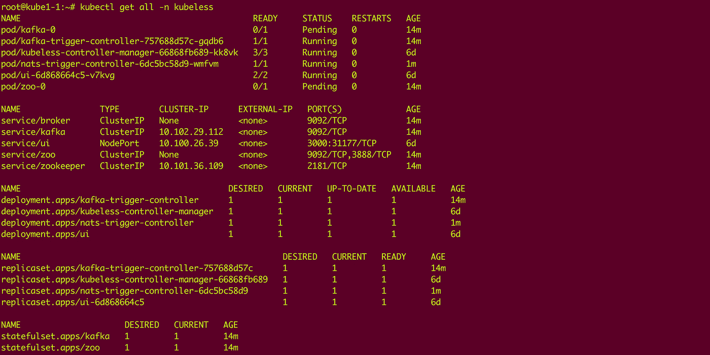

在 Kubernetes 上部署示例触发器的无库部署

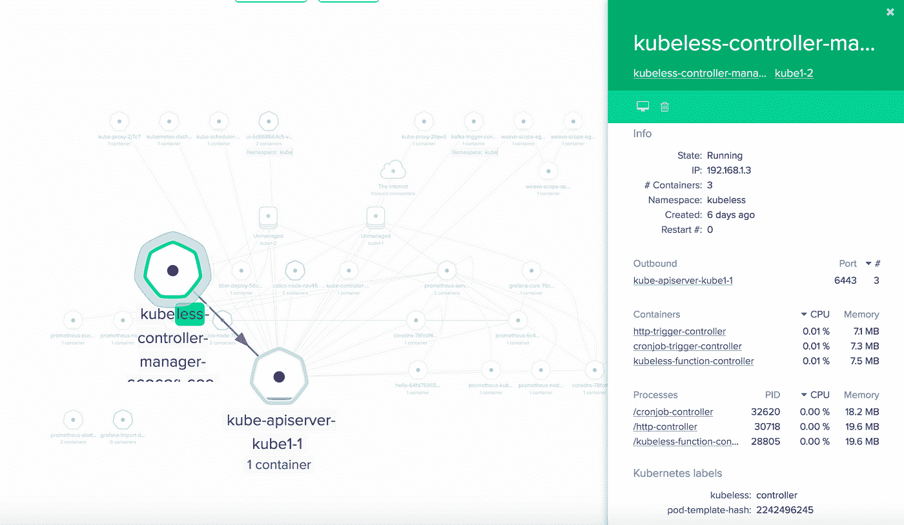

无电源控制器

任何触发无库函数执行的事情都被框架认为是一个**事件**。用户可以通过三种可能的事件/触发机制来部署功能:

*   pubsub 触发(卡夫卡，NATS)
*   http 触发(作为 Kubernetes 服务公开)
*   调度触发(Cron 作业)

如上图所示，默认情况下，Kubeless-Controller-Manager 由 http-trigger-controller 和 cronjob-trigger-controller 以及 function-controller 组成。无库支持 kafka(具有代理和动物园管理员的 Kafka 集群)和基于发布-订阅的触发的 NATS。


带有默认触发器的无库控制器管理器(Http/Cron)

一旦在 Kubernetes 集群上部署了上述所有容器，就会创建自定义资源定义，如下所示:

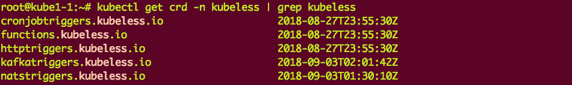

无库—自定义资源定义

Kubeless 支持多运行时，允许开发人员在创建函数时使用“— runtime”标志来选择特定的环境。支持的运行时:python2.7、python3.4、python3.6、nodejs6、nodejs8、nodejs _ distroless8、ruby2.4、php7.2、go1.10、dotnetcore2.0、java1.8、ballerina0.981.0、jvm1.8。

# 无库函数

函数是无库的主要实体。可以用不同的语言编写函数，但它们都有共同的属性，如通用接口、默认超时或运行时 UID。功能是一个独立的部署单元，就像微服务一样。它仅仅是部署在云中的代码，通常是为了执行一项工作而编写的。

# 功能结构:

函数可以被定义为一个文件，也可以被定义为一个 Kubernetes 清单文件(CRD 理解 Kubernetes 对象，并将其翻译成对象)。用户可以使用 Kubeless CLI 或 Kubectl 来部署这些功能。

每个函数都接收两个参数:事件和上下文。第一个参数包含关于函数接收到的事件源的信息。第二个包含关于函数的一般信息，比如它的名称或最大超时。

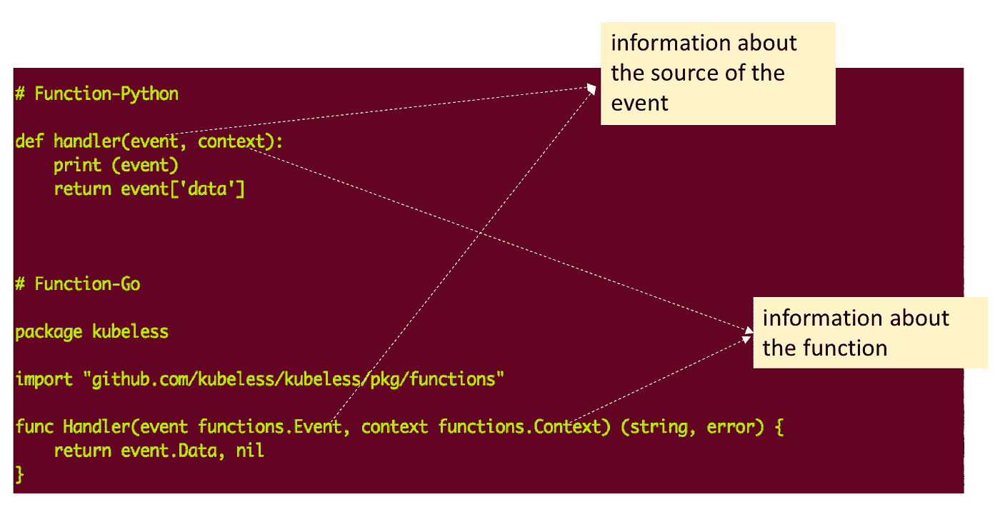

无库函数结构

使用 Kubernetes 清单部署函数:

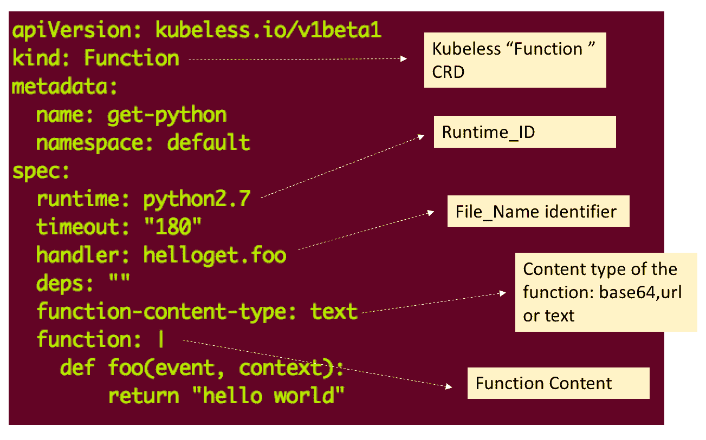

使用无库 CRD“Kind = Function”部署函数

# 功能部署架构:

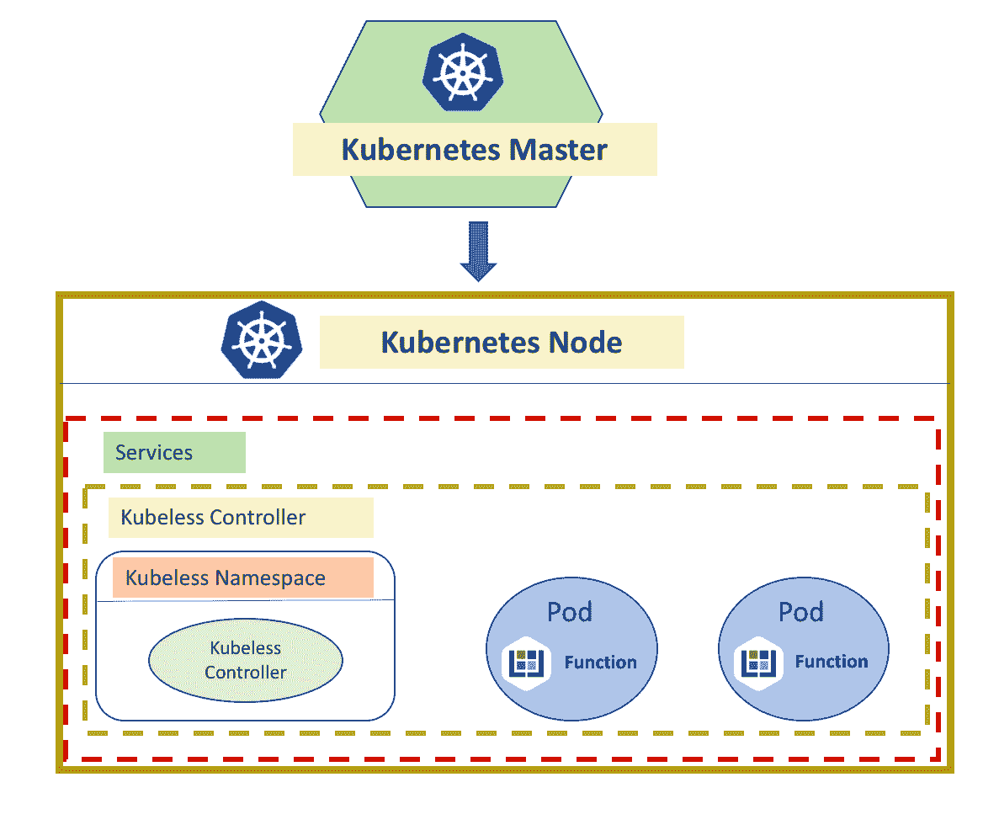

Kubernetes 上的无库功能建筑

每个功能都被部署为一个 pod，Kubeless controller 监听任何新功能，处理、更新、删除用户定义的功能。创建的函数使用 Kubernetes 服务公开。

# 使用 kubless-CLI 部署功能:

Kubeless 提供了一个全面的 CLI 来使用代码文件部署功能。

```
hello.pydef hello(event, context):
  print eventreturn event['data']
```

使用 Kubeless-CLI 部署上述功能:

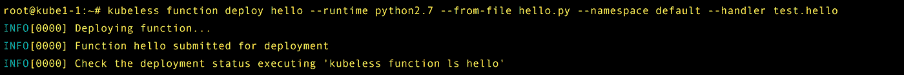

部署功能—无库 CLI


描述资源的无库 CLI

上面的函数创建了一个 pod，并使用 python2.7 环境(由用户在 CLI 中定义)部署了一个 pod，并将函数文件“hello.py”注入到该 pod 中。

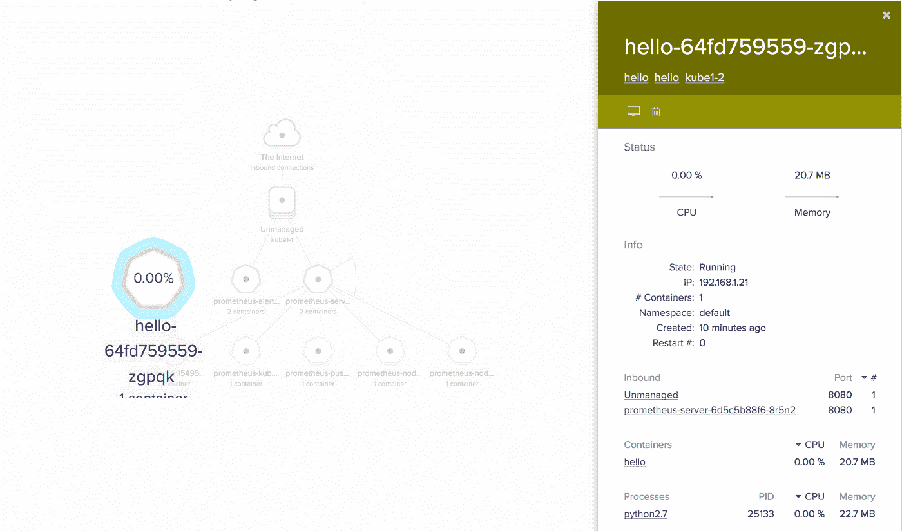

无库功能创建所需的库资源

用户可以使用 kubes-CLI 调用上面创建的函数，如下所示:

```
root@kube1-1:~# kubeless function call hello --data 'Hello Kubeless!'Hello Kubeless!
```

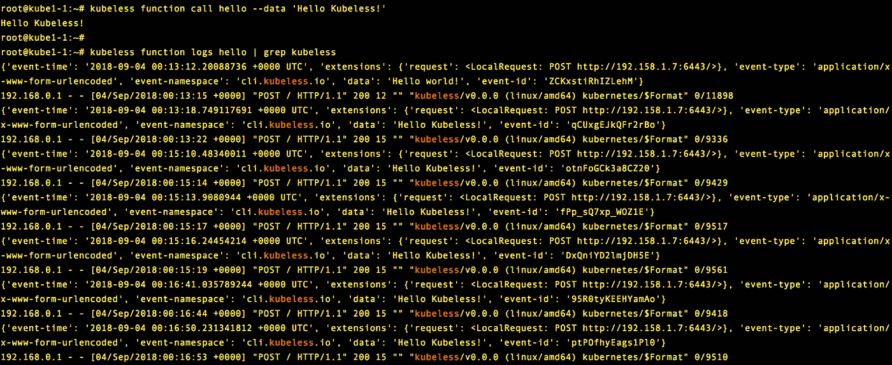

无库调用创建的函数

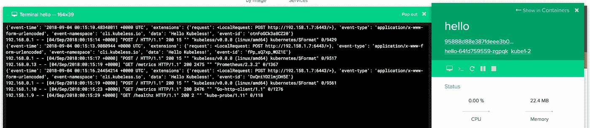

无库创建了响应函数调用的资源

用户可以使用 Kubeless-CLI 监控功能性能指标，也可以轻松导出到 Prometheus。

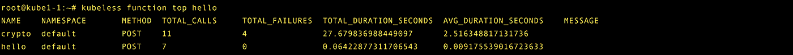

基于功能的资源使用统计

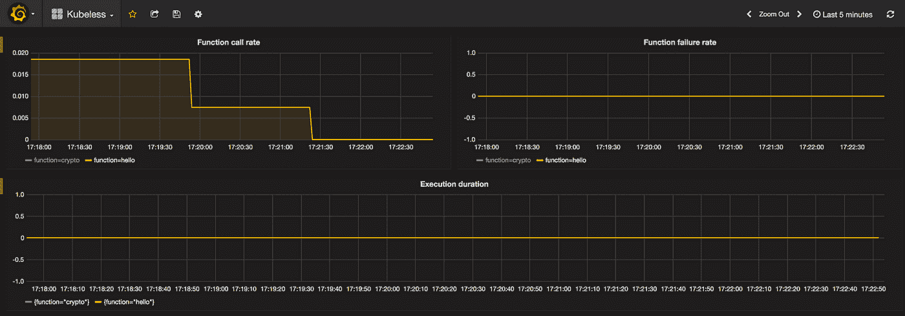

Grafana 可视化

一些其他有用的 CLI 操作:

```
Update a Function:
------------------
kubeless function update get-python --from-file hello.pyPassing Dependencies to a Function:
-----------------------------------
kubeless function deploy get-python-deps --runtime python2.7 --handler hello.foo --from-file hello.zip --dependencies requirements.txtPassing a Specified Port:
-------------------------
kubeless function deploy get-python-custom-port --runtime python2.7 --handler hello.foo --from-file hello.py --port 8081Scheduling Jobs:
----------------
kubeless function deploy scheduled-get-python --schedule "* * * * *" --runtime python2.7 --handler helloget.foo --from-file python/helloget.py
```

Kubeless 提供了一个 UI，用户可以使用该门户编写、编辑和运行功能:

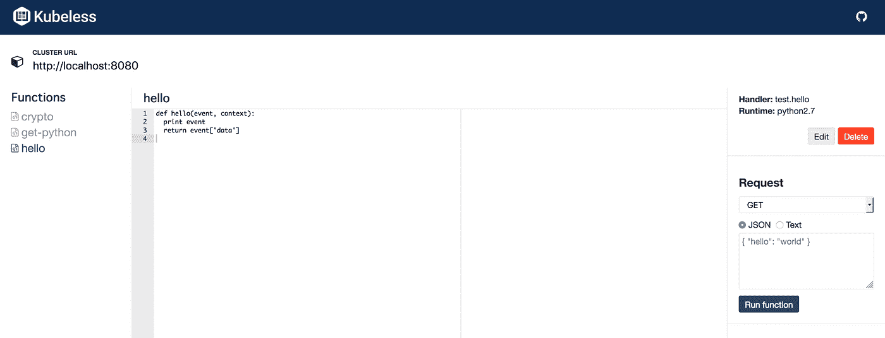

无库门户网站

# 使用 Kubernetes-Manifest 和 Kubectl 部署函数:

无库 CRD 使库贝奈特人能够识别所有与无库相关的对象。用户可以像创建 Kubernetes 对象一样使用 Kubernetes 清单。

```
---
apiVersion: kubeless.io/v1beta1
kind: Function
metadata:
  name: function
spec:
  handler: hello.handler
  runtime: python2.7
  function: |
      import json
      def handler():return "hello world"
```

用户可以使用 Kubectl 来部署上面的功能。部署模式与上面讨论的使用 kubesless-CLI 的模式相同。

# 使用 PubSub 机制触发无库功能——Apache Kafka

还可以注册无库功能来监听 Kafka 主题中的 PubSub 事件。作为无库部署的一部分，Kafka(和 Zookeeper)被部署在 Kubernetes 集群中。

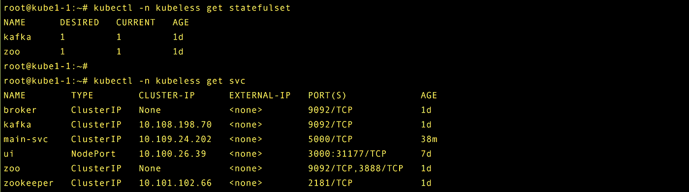

触发一个功能——阿帕奇卡夫卡

部署示例函数:

```
pub-sub-function.pydef foobar(event, context):
  print event['data']
  return event['data']$ kubeless function deploy hello-kafka --runtime python2.7 --handler test.hello --from-file pub-sub-function.py
```

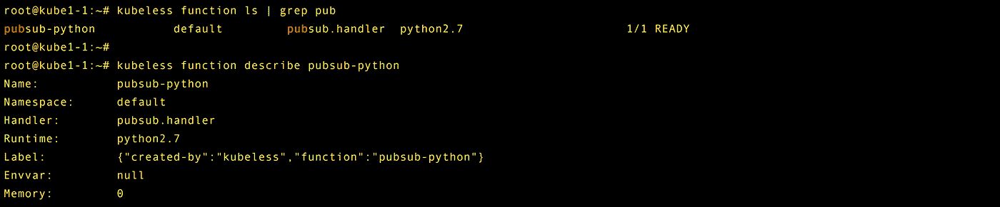

创建 PubSub 函数

创建一个 *Kafka* 触发器，允许用户将上面的功能与由-trigger-topic 指定的主题相关联，如下所示:

```
$ kubeless trigger kafka create hello --function-selector created-by=kubeless,function=hello-kafka --trigger-topic hello-topic
```

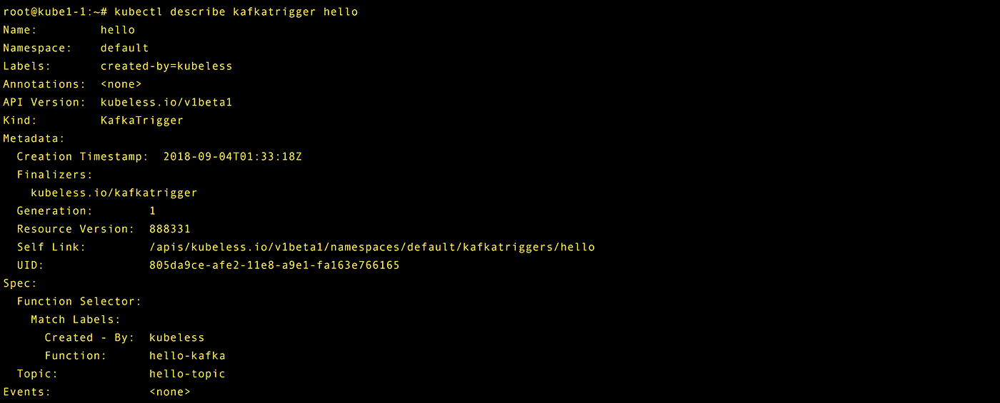

库布勒斯——卡夫卡触发器

这将上面创建的功能与 Kafka 触发器集成在一起。现在，用户可以使用上面创建的触发主题发布消息。可以使用 kubes-CLI 发布主题，主题名称应该与上面创建的“trigger-topic”相匹配。

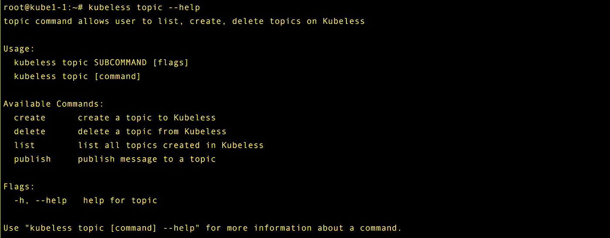

无知识的话题

```
$ kubeless topic create hello-topic$ kubeless topic publish --topic hello-topic --data "Hello Kafka!"
```

通过这种配置，用户可以向特定主题触发器下的所有触发器发布主题。如下所示，无论何时使用主题提供数据，函数都会处理相同的内容。

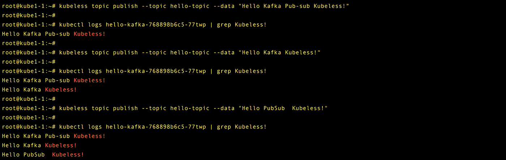

发布一个无意义的话题

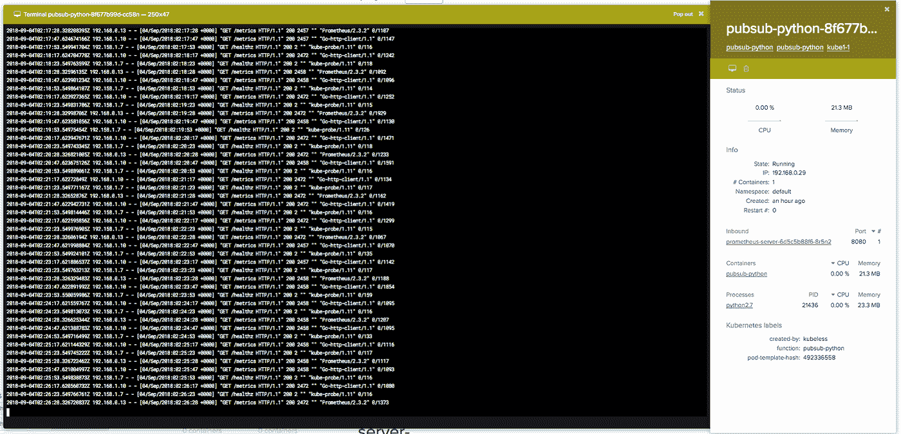

PubSub/Kafka Kubernetes Pod

这允许用户定义可以基于事件触发的功能，可以通过在某个主题下发布消息来触发功能。可以使用 trigger-topic 对函数进行分组，并且可以使用 PubSub 触发器以并行方式向多个函数提供数据。

# 利用 NATS 机制触发无库函数

[**【NATS】**](https://nats.io)**是一个 CNCF 孵化级托管项目，是一个简单而强大的开源消息传递技术，从头开始构建为云原生，实现发布订阅、请求回复、排队消息传递模型。Kubeless 支持 NATS 的 PubSub 触发器。**

**使用 NATS 部署上述相同的功能:**

**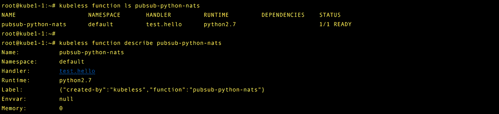**

**基于 NATS 的无库函数**

**创建主题:**

```
kubeless trigger nats create pubsub-python-nats --function-selector created-by=kubeless,function=pubsub-python-nats --trigger-topic hello-nats
```

**发布主题:**

```
root@kube1-1:~# kubeless trigger nats publish --url nats-server-ip --topic test --message "Hello World!"INFO[0000] Published [test] : 'Hello World!'
```

**NATS 群集运行服务器，并将其作为服务公开:**

**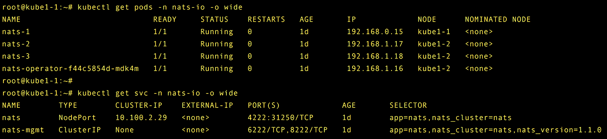**

**Kubernetes 上的 NATS 服务器**

**Kubeless 足矣无服务器框架的主要目标之一是为开发人员提供**平台无关的云体验**，在这里它管理 Kubernetes 前端所需的一切。这使得用户只需编写一次代码，就可以自由选择代码运行的位置。借助无库运行代码，无需配置或管理服务器，并行运行代码并轻松扩展，以独立于供应商的方式运行功能。使用 Kubeless，用户可以部署由云中发生的事件触发的功能，例如将文件上传到存储桶、数据流等等。**