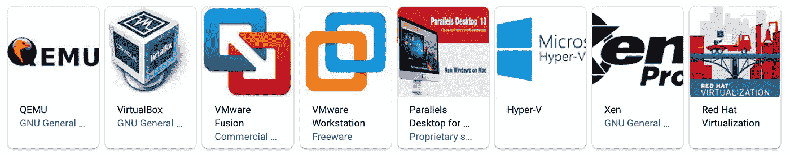
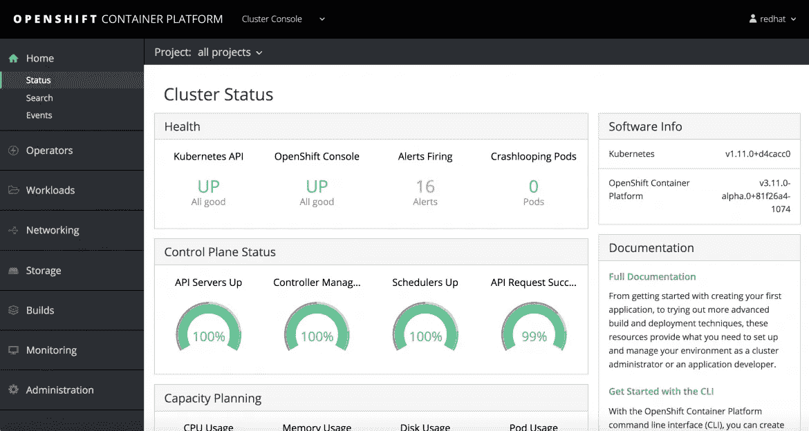
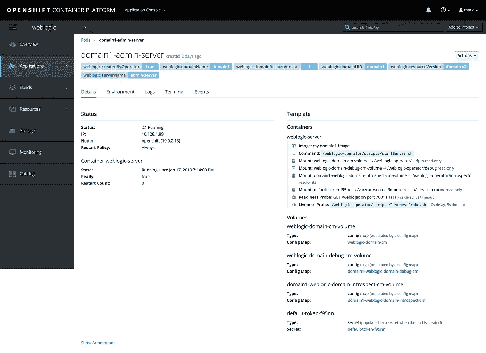
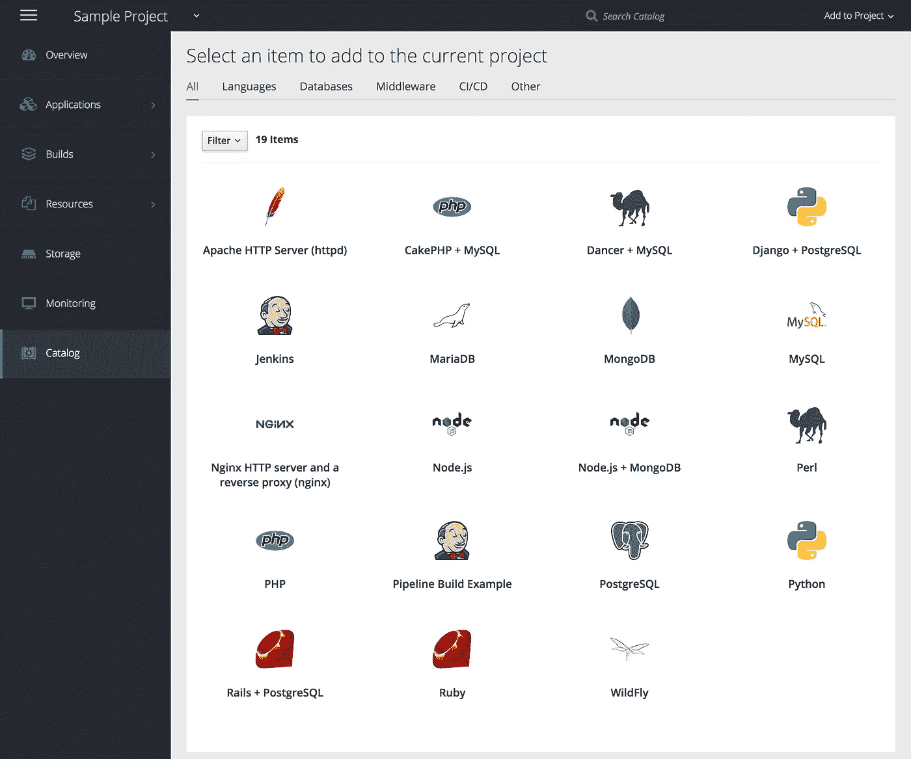

# 俱吠罗-开放-丹纳-红帽 Wutttt？

> 原文：<https://itnext.io/kuber-open-tainer-redhat-wutttt-a0581b9330ce?source=collection_archive---------2----------------------->

图片版权 IBM，2019。

> 向不知道我刚才说了什么的人解释虚拟机、容器、Kubernetes、OpenShift 和 Red Hat。另外，欢迎红帽子！在你加入 IBM 的第一天，我们能做些什么？

作为一名 IBM 人，我不得不承认，我已经推迟理解红帽收购 有一段时间了，因为……嗯……我不知道红帽是做什么的，而且看起来很复杂。但是今天，我开始挖掘并意识到——哇。这件事是一次旅行。如果你没有 DevOps 方面的背景，你不可能只在 Red Hat 或 Kubernetes 上做一个[googley](https://www.youtube.com/watch?v=p6e1qd5xggc)并理解他们做什么，更不用说理解 IBM 为什么花 340 亿美元收购他们了。或者如果你在走廊上碰到一个不知道他们在做什么或者他们对 IBM 有什么感觉的红帽子，你该说什么。

所以，我最终做了些调查，然后把它们都写在了这里，这样 1)它们就能牢牢地印在我的脑海里，2)尹就不用像我一样，花四个小时的时间在这一堆科技意大利面上冲浪了。

这是你即将开始的旅程:

## 虚拟机>容器>容器编排> Red Hat OpenShift > IBM + Red Hat =您是所有方面的杰出专家！

听起来很可怕，但如果我能做到，你肯定也能。好吗？准备，预备，开始！→

# 1.虚拟机

假设你刚刚得到一台新电脑，上面安装了所有最新的操作系统软件和可爱的应用程序，耶！但是你的公司使用的操作系统比较老，甚至不适合 MAC 电脑。呜呜呜。如果你想在家工作，你是否需要准备一台古董电脑？不要！你可以把你的硬盘分成两半——一半运行你新买的很酷的 macOS Mojave 软件，另一半运行 WindowsXP 或 Linux 或其他软件。*(有些人可能会把“把硬盘一分为二”理解为对双引导的描述。从技术上来说，虚拟机实际上是在另一个操作系统之上运行一个操作系统，但是为了便于可视化，你会得到我的“硬盘减半”的比喻。)*

这就是人们所说的虚拟机——就像二合一的机器。如果你不得不点击看起来像这些图标之一的东西来访问你的工作内容，这意味着你正在打开你硬盘上的虚拟机。*(或者说真的，如果你站在一个很酷的开发人员旁边，并且不想暴露自己是 n00b，就说 VM。)*

为什么这对没有经历过上述可怕用例的人来说很重要呢？你知道作为产品设计师，我们如何不断地为我们的产品部署(即不断地交付)新的更新吗？与此同时，其他地方也在发布新的软件更新？有时，如果你点击“更新软件”…唉，一切都坏了？没错。糟糕透了。但是，如果开发人员没有办法测试他们在旧操作系统和旧版本应用程序上构建的所有东西，以控制他们发布新版本时会破坏什么，不会破坏什么，情况可能会糟糕得多。

现在，我丈夫是一名 iOS 开发人员，这意味着他的办公桌上有大约 42 部旧 iPhones，他用这些旧 iPhones 在任何他创造的东西发布前亲自测试它们。操作系统、软件和网站开发人员出于同样的原因使用一台或多台虚拟机——只不过他们只是在一台机器上使用，而不是囤积计算机。*(有人能为 iPhones 做这些虚拟机的事情吗，这样我的家庭办公室就不会看起来像个当铺了？)*

**要点:开发者一直使用虚拟机在不同的操作系统环境中构建/测试/部署他们的工作，所有这些都是在一台机器上完成的，这样他们就不会疯狂地收集旧电脑。因此，我们其他人不必在每次点击“部署”时都被迫进行更新。**

***等等，这就是 340 亿美元的原因？真的吗？***

**不，这不是唯一的原因胡思乱想的裤子，只是给我一秒钟，老天。**

## 另一个原因

想象一下——你从网上下载了一个可爱的，看起来可爱的游戏，但是哦不不！一切都崩溃了！融化掉！你被骗了，让你的电脑中了病毒。好吧，如果你把那个游戏下载到你的虚拟机上，而不是你的硬盘上，猜猜会发生什么？没问题。只需删除虚拟机并安装一个新的。你的系统会没事的。

**重点:安全性。**

## 另一个原因

也许你从上一次游戏下载中吸取了教训，但你只是发现了一些你非常非常想尝试的插件和字体包，尽管上一次病毒的痛苦仍然记忆犹新，但你还是控制不住自己。

等等，老板。这里有一个想法——使用你的虚拟机来拍摄你当前运行良好的操作系统设置的快照——然后在虚拟机版本中进行所有可能不那么安全的下载。如果他们搞砸了你的虚拟机，没什么大不了的。只需恢复到最后一个干净的快照。虚拟机版本控制。迪斯科。

**重点:效率和安全性**。除了你琐碎的“*我想要潜在粗略的“让我的脸看起来老”应用*的原因，开发者需要测试不同的操作系统配置，而不仅仅是不同的版本。虚拟机允许他们创建他们喜欢的设置的克隆(即快照)，然后疯狂地修改版本，而不必担心会搞砸或必须为每个配置设置独特的虚拟机。

***给开发人员留下深刻印象提示:*** *也许可以在您当前的操作系统设置上创建一个虚拟机，即使您不需要使用旧软件，只是为了拥有一个完全干净的系统的备份版本…有点不必要，但很专业！*

# 2.容器

好了，你设置好你的虚拟机，你就可以在你的 Mac*上运行 Windows XP 了。太棒了。现在，您希望将应用程序添加到您的计算机/虚拟机的 Windows 部分。太好了。但是，如果你是一名开发人员，你可能需要测试这些应用程序的不同版本，还需要测试不同的操作系统。啊啊啊。

您必须为每个不同的应用程序版本安装虚拟机吗？幸运的是，没有。一家名为 [Docker](https://www.docker.com/) 的公司开创了容器的概念。容器基本上将您对虚拟机上运行的操作系统所做的一组定制以及您想要测试的各种应用程序设置保存在一个漂亮、安全的盒子中。在您的虚拟机中可以有多个容器，也称为测试环境，允许您在同一个虚拟机中测试您的所有变体(针对该虚拟机的操作系统+应用程序)。

这太棒了，因为它为开发人员省去了每次构建/测试/部署您刚刚做出的设计更新时必须记住大量设置的麻烦。又来了。再一次。

像小网站这样的简单项目不需要虚拟机和容器。但是项目越大，环境越复杂，如果没有容器来管理公司为了让用户满意而需要考虑的各种版本，几乎不可能构建/测试/部署。**

**重点:效率、准确性、压力较小的开发人员。**

**很酷的注意:虚拟机现在在云中运行，所以你可以免费使用你的 Mac 电脑！
* *另请注意:Web 主机可以为您管理虚拟机和容器设置。*

这个人=这个星球上最擅长解释这些东西的人

# 3.库伯内特斯

*   *但是，等等，我的虚拟机中可以有多少容器？*
*   *如果我有一个配置完美的容器，我想将其复制到多个虚拟机，但如果我对其进行任何更改，我希望所有虚拟机同时更新，该怎么办？*
*   *如果我想将一个 VM 中的几个容器链接在一起运行，但又留下几个，该怎么办？*

好问题，聪明人！所有这些都属于开发者所说的**容器编排**的范畴。

我不会深入到容器编排技术的所有疯狂方面，但如果你渴望打破大脑，这里有两个很好的视频，奠定了基础:

可跳过的视频:集装箱 101

可跳过的视频:容器编排

现在。老实说，我没有看所有可能解释容器编排的视频，因为嘿——为自己写这篇“给傻瓜”的文章可能会让我显得太专业了。但是这里有一个大概的想法:人们需要用和*到*容器做*很多事情。以至于他们不得不想出全新的工具和流程来保持一切正常…比如 [Docker Swarm](https://searchitoperations.techtarget.com/definition/Docker-Swarm) 和…等等…*

**Kubernetes！**

> Kubernetes 以及您可能听说过的其他容器编排工具，如 [Docker Compose](https://docs.docker.com/compose/) 和 [Apache Mezos](http://mesos.apache.org/) ，是管理具有多个容器的多个虚拟机的服务，正如您可以想象的那样，这变得极其复杂。光是想想就头疼。但是最后——你知道每个人一直说的那个奇怪的词是什么意思！

这里有一些你应该知道如何用俱吠罗语说的非常非常少的事情:

1.  **Kubernetes 用于管理应用程序部署流程的构建、推送、拉取和运行部分。**应用程序部署流程基本上是开发人员在编写了最新版本的应用程序后必须要做的事情，然后需要让它在各种操作系统和应用程序版本及配置上工作。
2.  **Kubernetes 集群服务** Kubernetes 强制执行所需的状态管理*(即，环境开发人员希望在部署新的应用程序更新之前对其进行测试)*，这意味着您将告诉集群服务一个特定的配置，它们将运行该配置。*(参见问题:如果我有一个已经配置好的容器，我想让它复制到多个虚拟机，但是如果我对它做了任何更改，我想让所有虚拟机同时更新，该怎么办？)*
3.  每个容器都有一个 Worker，它基本上是告诉容器集群服务想要它做什么的东西。*(参见问题:如果我有一个已经完美配置的容器，我想让它复制到多个虚拟机，但是如果我对它进行任何更改，我想让所有虚拟机同时更新，该怎么办？)*
4.  **吊舱配置** 你可以部署的最小的东西。它是一组一起发射的容器。*(参见问题:如果我想将一个 VM 中的几个容器链接在一起运行，但又留下几个，该怎么办？)*

5 分钟后 Kubernetes

# 4.红帽 OpenShift

你还和我在一起吗？我觉得我们现在对这种东西的了解比 100%的普通人多 99%。但是，如果下次有人问我们是否对收购 Red Hat 感到兴奋时，我们不想显得困惑的话，我们需要更多一点的背景知识。# 2019 年目标

这是:

[**红帽**](https://www.redhat.com/en) **是一家制作用于管理虚拟机上容器编排的开源软件的公司。他们的软件叫做**[**open shift**](https://youtu.be/B0bziEVHyqg)**，它和我们一直在谈论的东西有什么关系是这样的:**

> 虚拟机=硬盘(或云)的一部分，在现有操作系统(例如 VMware)
> 
> 容器=一种在运行完整操作系统设置(例如码头工人)
> 
> 容器编排=我们需要对容器做的不同事情，以使测试和部署软件高效、准确和可伸缩(例如 Kubernetes)
> 
> Container platform manager =一种工具，用于自动构建、部署和管理需要在多种操作系统和应用配置上工作的应用程序(例如红帽 OpenShift)

你看到最后一个了吗？

**OpenShift 是一个 Red Hat 平台，用于控制构建、部署和管理您希望在应用程序更新上线之前应用到应用程序更新的配置，包括您设置的虚拟机、虚拟机中的容器以及您用来管理这些容器的容器编排工具。**

什么！？！

通俗地说:OpenShift 是一个很好的控制面板 GUI，基于 DevOps 用来在一个地方管理所有这些 VM、容器、Kubernetes 的工具。太好了，对吧？如果您的公司拥有完整的产品组合，您可以看到这对于保持连续交付和维护安全性是绝对不可或缺的。和准确性。和版本控制。最重要的是，理智。

这个“控制面板 GUI”可以在物理机、虚拟机、公共云、私有云上工作，并且全部使用通用语言 Linux……开始明白为什么它对 IBM 如此有吸引力，以及我们最初是如何开始与 Red Hat 合作的了吗？

顺便说一句，这种关系开始于 20 多年前。

以下是红帽 OpenShift UI 的几个镜头:

这里有一个关于 OpenShift 的很好的解释，来自一个知道自己在说什么的人——*和*听起来有点担心必须在 10 分钟内解释它:

对 OpenShift 如此好、快速的解释！

# 5.准备好了吗？让我们结束这一切！

# IBM + Red Hat 收购:

## IBM 用 340 亿美元得到了什么？

*   对他们控制企业云世界的超级助力
*   红帽的销售不是由他们的技术推动的(这是开源的，因此是 100%免费的)。**客户购买红帽是因为他们的技术专长和支持**——这包括 IBM 的顶级企业云竞争对手(亚马逊、微软和谷歌)。这使得此次收购成为所有 IBM 竞争对手运行的系统。
*   **IBM 客户现在获得了他们需要的所有** **工具和** **专家支持**来更新他们的平台、过渡到云以及持续扩展，如果他们想要保持竞争力、安全性和适应性，这是绝对必要的。

## 问题和猜测从何而来？

*   Red Hat 被视为一家创新优先的开源公司，通过出售自由软件赚了 20 亿美元。
*   几十年来，IBM 一直是一家增长缓慢的公司，将收入的 7%投资回 R&D(相比之下，红帽公司的投资为 20%)。

杂色的傻瓜在几分钟内列出要点。

# 6.这对你/我们/他们/我们意味着什么？

“红帽子”很有可能很难理解 IBM 文化，也很难适应 IBM 文化。我们很多人都经历过这种转变。

*   那段时间对你有什么帮助？
*   你希望 IBM 和你的 IBM 同事做了什么来使它变得更容易？
*   或者，也许我们可以问问他们什么会有帮助？

> 对于我们能为这些# IBM[NKOTB](https://www.nkotb.com/)做些什么，有什么想法吗？请在下面留下你的想法和评论！

*Jennifer Sukis 是位于德克萨斯州奥斯汀的 IBM 的人工智能和机器学习设计负责人。以上文章为个人观点，不一定代表 IBM 的立场、策略或观点。*