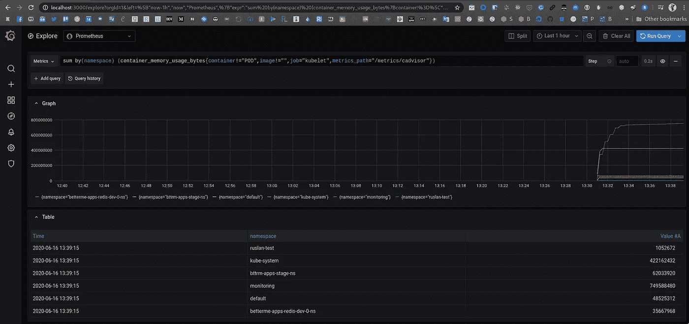
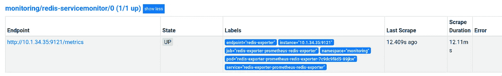
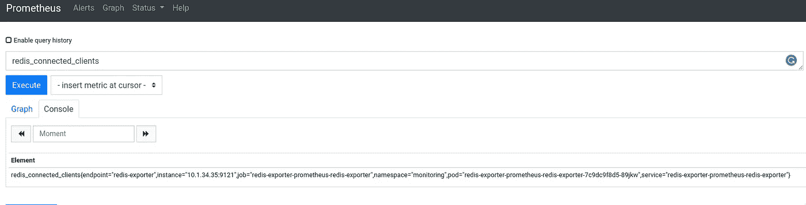
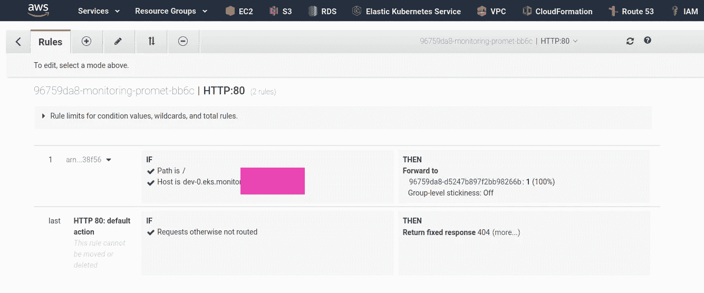
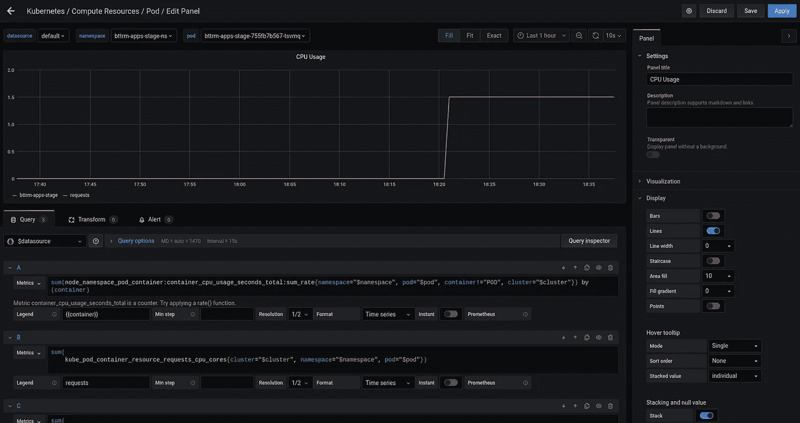
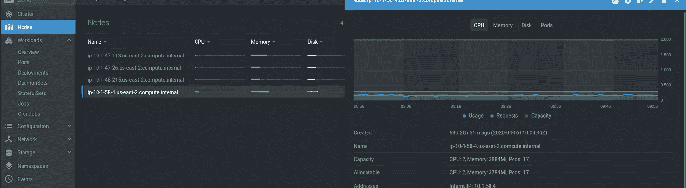

# Kubernetes:用 Prometheus 算子监视集群

> 原文：<https://itnext.io/kubernetes-a-clusters-monitoring-with-the-prometheus-operator-bfb4c04ba3c2?source=collection_archive---------4----------------------->


继续讨论 [Kubernetes:使用 Prometheus 进行监控——exporters、服务发现及其角色](https://rtfm.co.ua/en/kubernetes-monitoring-with-prometheus-exporters-a-service-discovery-and-its-roles/)，我们手动配置了 Prometheus 以查看其工作情况——现在，让我们尝试使用通过 Helm chart 安装的 [Prometheus 操作符](https://github.com/bitnami/charts/tree/master/bitnami/prometheus-operator/)。

因此，任务是在 AWS Elastic Kubernetes 集群中启动 Prometheus 服务器和所有必要的导出器，然后通过`[/federation](https://rtfm.co.ua/prometehus-obzor-federation-monitoring-docker-swarm-i-nastrojki-alertmanager/#Prometheus_crossservice_federation)`将指标传递到我们的“中央”Prometheus 服务器，该服务器带有 Alertmanager 警报和 Grafana 仪表板。

有一点令人困惑的是整套这样的掌舵图——有一个“简单”的普罗米修斯图，还有`kube-prometheus`和`prometheus-operator`:

*   Bitnami Prometheus 操作员—[https://github . com/bitnami/charts/tree/master/bitnami/Prometheus-Operator/](https://github.com/bitnami/charts/tree/master/bitnami/prometheus-operator/)
*   CoreOS Prometheus 操作员—[https://github.com/coreos/prometheus-operator](https://github.com/coreos/prometheus-operator)
*   赫尔姆社区普罗米修斯操作员—[https://github . com/helm/charts/tree/master/stable/Prometheus-Operator](https://github.com/helm/charts/tree/master/stable/prometheus-operator)
*   科瑞奥斯`kube-prometheus`-[https://github.com/coreos/kube-prometheus](https://github.com/coreos/kube-prometheus)
*   还有《只是一个普罗米修斯》——[https://github . com/helm/charts/tree/master/stable/普罗米修斯](https://github.com/helm/charts/tree/master/stable/prometheus)

虽然如果通过赫尔姆搜索寻找它——它返回唯一的一个`prometheus-operator`:

```
$ helm search repo stable/prometheus-operator -o yaml
- app_version: 0.38.1
description: Provides easy monitoring definitions for Kubernetes services, and deployment
and management of Prometheus instances.
name: stable/prometheus-operator
version: 8.14.0
```

`stable/prometheus`和`stable/prometheus-operator`的区别在于，运营商内置了 Grafana 和一套现成的仪表盘以及一套`ServiceMonitors`来收集集群服务的指标，如 CoreDNS、API 服务器、调度程序等。

因此，如前所述，我们将使用`[stable/prometheus-operator](https://github.com/helm/charts/tree/master/stable/prometheus-operator)`。

# 内容

*   [普罗米修斯操作员部署](https://rtfm.co.ua/en/kubernetes-a-clusters-monitoring-with-the-prometheus-operator/#Prometheus_Operator_deployment)
*   [格拉法纳接入](https://rtfm.co.ua/en/kubernetes-a-clusters-monitoring-with-the-prometheus-operator/#Grafana_access)
*   [普罗米修斯操作员配置](https://rtfm.co.ua/en/kubernetes-a-clusters-monitoring-with-the-prometheus-operator/#Prometheus_Operator_configuration)
*   [在监控下添加新应用](https://rtfm.co.ua/en/kubernetes-a-clusters-monitoring-with-the-prometheus-operator/#Adding_new_application_under_monitoring)
*   [Redis 服务器启动](https://rtfm.co.ua/en/kubernetes-a-clusters-monitoring-with-the-prometheus-operator/#Redis_server_launch)
*   [redis_exporter 发布](https://rtfm.co.ua/en/kubernetes-a-clusters-monitoring-with-the-prometheus-operator/#redisexporter_launch)
*   [添加 Kubernetes ServiceMonitor](https://rtfm.co.ua/en/kubernetes-a-clusters-monitoring-with-the-prometheus-operator/#Adding_Kubernetes_ServiceMonitor)
*   [Prometheus 操作员舵部署及其服务配置](https://rtfm.co.ua/en/kubernetes-a-clusters-monitoring-with-the-prometheus-operator/#Prometheus_Operator_Helm_deployment_and_its_services_configuration)
*   [AWS 负载平衡器配置](https://rtfm.co.ua/en/kubernetes-a-clusters-monitoring-with-the-prometheus-operator/#An_AWS_LoadBalancer_configuration)

# 普罗米修斯操作员部署

用头盔展开它:

```
$ helm install — namespace monitoring — create-namespace prometheus stable/prometheus-operator
manifest_sorter.go:192: info: skipping unknown hook: “crd-install”
manifest_sorter.go:192: info: skipping unknown hook: “crd-install”
manifest_sorter.go:192: info: skipping unknown hook: “crd-install”
manifest_sorter.go:192: info: skipping unknown hook: “crd-install”
manifest_sorter.go:192: info: skipping unknown hook: “crd-install”
manifest_sorter.go:192: info: skipping unknown hook: “crd-install”
NAME: prometheus
LAST DEPLOYED: Mon Jun 15 17:54:27 2020
NAMESPACE: monitoring
STATUS: deployed
REVISION: 1
NOTES:
The Prometheus Operator has been installed. Check its status by running:kubectl — namespace monitoring get pods -l “release=prometheus”Visit [https://github.com/coreos/prometheus-operator](https://github.com/coreos/prometheus-operator) for instructions on how to create & configure Alertmanager and Prometheus instances using the Operator.
```

检查舱:

```
$ kk -n monitoring get pod
NAME READY STATUS RESTARTS AGE
alertmanager-prometheus-prometheus-oper-alertmanager-0 2/2 Running 0 41s
prometheus-grafana-85c9fbc85c-ll58c 2/2 Running 0 46s
prometheus-kube-state-metrics-66d969ff69–6b7t8 1/1 Running 0 46s
prometheus-prometheus-node-exporter-89mf4 1/1 Running 0 46s
prometheus-prometheus-node-exporter-bpn67 1/1 Running 0 46s
prometheus-prometheus-node-exporter-l9wjm 1/1 Running 0 46s
prometheus-prometheus-node-exporter-zk4cm 1/1 Running 0 46s
prometheus-prometheus-oper-operator-7d5f8ff449-fl6x4 2/2 Running 0 46s
prometheus-prometheus-prometheus-oper-prometheus-0 3/3 Running 1 31
```

*注:* `*alias kk="kubectl" >> ~/.bashrc*`

因此，Prometheus 操作员的掌舵图创建了一整套服务——Prometheus 本身、Alertmanager、Grafana，以及一组服务监视器:

```
$ kk -n monitoring get servicemonitor
NAME AGE
prometheus-prometheus-oper-alertmanager 3m53s
prometheus-prometheus-oper-apiserver 3m53s
prometheus-prometheus-oper-coredns 3m53s
prometheus-prometheus-oper-grafana 3m53s
prometheus-prometheus-oper-kube-controller-manager 3m53s
prometheus-prometheus-oper-kube-etcd 3m53s
prometheus-prometheus-oper-kube-proxy 3m53s
prometheus-prometheus-oper-kube-scheduler 3m53s
prometheus-prometheus-oper-kube-state-metrics 3m53s
prometheus-prometheus-oper-kubelet 3m53s
prometheus-prometheus-oper-node-exporter 3m53s
prometheus-prometheus-oper-operator 3m53s
prometheus-prometheus-oper-prometheus 3m53s
```

ServiceMonitors 角色将在本帖子的[добавлениесеииавмисавмонитоииоииинг](https://rtfm.co.ua/?p=24374#%D0%94%D0%BE%D0%B1%D0%B0%D0%B2%D0%BB%D0%B5%D0%BD%D0%B8%D0%B5_%D1%81%D0%B5%D1%80%D0%B2%D0%B8%D1%81%D0%B0_%D0%B2_%D0%BC%D0%BE%D0%BD%D0%B8%D1%82%D0%BE%D1%80%D0%B8%D0%BD%D0%B3)部分进行回顾。

## 格拉夫纳入口

让我们来看看 Grafana 附带了哪些仪表盘。

找到格拉夫纳的豆荚:

```
$ kk -n monitoring get pod
NAME READY STATUS RESTARTS AGE
alertmanager-prometheus-prometheus-oper-alertmanager-0 2/2 Running 0 103s
prometheus-grafana-85c9fbc85c-wl856 2/2 Running 0 107s
…
```

运行`port-forward`:

```
$ kk -n monitoring port-forward prometheus-grafana-85c9fbc85c-wl856 3000:3000
Forwarding from 127.0.0.1:3000 -> 3000
Forwarding from [::1]:3000 -> 3000
```

打开 *localhost:3000* ，用 *admin* 用户名和 *prom-operator* 密码登录，你会看到很多准备好的用户图形:



在撰写本文时，Prometheus Operator 的 Grafana 版本为 7.0.3。

实际上，我们在这里不需要 Grafana 和 Alertmanager，因为它们在我们的“中央”监控服务器上使用，所以让我们从这里删除它们。

# 普罗米修斯操作员配置

Prometheus 操作员使用[自定义资源定义](https://kubernetes.io/docs/concepts/extend-kubernetes/api-extension/custom-resources/)描述其所有组件:

```
$ kk -n monitoring get crd
NAME CREATED AT
alertmanagers.monitoring.coreos.com 2020–06–15T14:47:44Z
eniconfigs.crd.k8s.amazonaws.com 2020–04–10T07:21:20Z
podmonitors.monitoring.coreos.com 2020–06–15T14:47:45Z
prometheuses.monitoring.coreos.com 2020–06–15T14:47:46Z
prometheusrules.monitoring.coreos.com 2020–06–15T14:47:47Z
servicemonitors.monitoring.coreos.com 2020–06–15T14:47:47Z
thanosrulers.monitoring.coreos.com 2020–06–15T14:47:48Z
```

例如，`prometheuses.monitoring.coreos.com` CRD 描述了一个名为*普罗米修斯*的定制资源:

```
$ kk -n monitoring get crd prometheuses.monitoring.coreos.com -o yaml
apiVersion: apiextensions.k8s.io/v1beta1
kind: CustomResourceDefinition
…
spec:
…
names:
kind: Prometheus
listKind: PrometheusList
plural: prometheuses
singular: prometheus
…
```

然后，您可以通过使用`names`字段中的名称，将该名称用作常见的 Kubernetes 对象，如 pod、节点、卷等:

```
$ kk -n monitoring get prometheus -o yaml
apiVersion: v1
items:
- apiVersion: monitoring.coreos.com/v1
kind: Prometheus
metadata:
annotations:
meta.helm.sh/release-name: prometheus
meta.helm.sh/release-namespace: monitoring
…
spec:
alerting:
alertmanagers:
- apiVersion: v2
name: prometheus-prometheus-oper-alertmanager
namespace: monitoring
pathPrefix: /
port: web
baseImage: quay.io/prometheus/prometheus
enableAdminAPI: false
externalUrl: [http://prometheus-prometheus-oper-prometheus.monitoring:9090](http://prometheus-prometheus-oper-prometheus.monitoring:9090)
listenLocal: false
logFormat: logfmt
logLevel: info
paused: false
podMonitorNamespaceSelector: {}
podMonitorSelector:
matchLabels:
release: prometheus
portName: web
replicas: 1
retention: 10d
routePrefix: /
ruleNamespaceSelector: {}
ruleSelector:
matchLabels:
app: prometheus-operator
release: prometheus
securityContext:
fsGroup: 2000
runAsGroup: 2000
runAsNonRoot: true
runAsUser: 1000
serviceAccountName: prometheus-prometheus-oper-prometheus
serviceMonitorNamespaceSelector: {}
serviceMonitorSelector:
matchLabels:
release: prometheus
version: v2.18.1
…
```

现在，我们感兴趣的是`serviceMonitorSelector`记录:

```
...
serviceMonitorSelector: 
  matchLabels:
    release: prometheus
```

它定义了在集群中 Prometheus 服务器的观察下将添加哪些 ServiceMonitors。

## 添加受监控的新应用程序

现在，让我们尝试在监控下添加一个额外的服务:

1.  启动 Redis 服务器
2.  还有`redis_exporter`
3.  将添加 ServiceMonitor
4.  最后，我们将配置 Prometheus Operator 使用 ServiceMonitor 从`redis_exporter`收集指标

## Redis 服务器启动

当被监视的应用程序位于一个命名空间中，而监视服务位于另一个命名空间中时，创建一个命名空间以使这种设置更加真实:

```
$ kk create ns redis-test
namespace/redis-test created
```

运行 Redis:

```
$ kk -n redis-test run redis — image=redis
deployment.apps/redis created
```

为 Redis 网络通信创建服务对象:

```
$ kk -n redis-test expose deploy redis — type=ClusterIP — name redis-svc — port 6379
service/redis-svc exposed
```

检查一下:

```
$ kk -n redis-test get svc redis-svc
NAME TYPE CLUSTER-IP EXTERNAL-IP PORT(S) AGE
redis-svc ClusterIP 172.20.237.116 <none> 6379/TCP 25s
```

好的— Redis 正在工作，现在让我们添加它的 Prometheus exporter。

## `redis_exporter`启动

用舵安装:

```
$ helm install -n monitoring redis-exporter — set “redisAddress=redis://redis-svc.redis-test.svc.cluster.local:6379” stable/prometheus-redis-exporter
```

检查其服务:

```
$ kk -n monitoring get svc
NAME TYPE CLUSTER-IP EXTERNAL-IP PORT(S) AGE
alertmanager-operated ClusterIP None <none> 9093/TCP,9094/TCP,9094/UDP 89m
…
redis-exporter-prometheus-redis-exporter ClusterIP 172.20.239.67 <none> 9121/TCP 84s
```

它的终点:

```
$ kk -n monitoring get endpoints redis-exporter-prometheus-redis-exporter -o yaml
apiVersion: v1
kind: Endpoints
metadata:
…
labels:
app: prometheus-redis-exporter
app.kubernetes.io/managed-by: Helm
chart: prometheus-redis-exporter-3.4.1
heritage: Helm
release: redis-exporter
name: redis-exporter-prometheus-redis-exporter
namespace: monitoring
…
ports:
- name: redis-exporter
port: 9121
protocol: TCP
```

转到检查指标—旋转一个新的 pod，例如用 Debian，并安装`curl`:

```
$ kk -n monitoring run — rm -ti debug — image=debian — restart=Never bash
```

如果看不到命令提示符，请尝试按 enter 键。

```
root@debug:/# apt update && apt -y install curl
```

并向`redis_exporter`提出要求:

```
root@debug:/# curl redis-exporter-prometheus-redis-exporter:9121/metrics
…
HELP redis_up Information about the Redis instance
TYPE redis_up gauge
redis_up 1
HELP redis_uptime_in_seconds uptime_in_seconds metric
TYPE redis_uptime_in_seconds gauge
redis_uptime_in_seconds 2793
```

或者没有额外的端口—只需将`port-forward`运行到`redis-svc`:

```
$ kk -n monitoring port-forward svc/redis-exporter-prometheus-redis-exporter 9121:9121
Forwarding from 127.0.0.1:9121 -> 9121
Forwarding from [::1]:9121 -> 9121
```

并从本地 PC 运行:

```
$ curl localhost:9121/metrics
…
redis_up 1
HELP redis_uptime_in_seconds uptime_in_seconds metric
TYPE redis_uptime_in_seconds gauge
redis_uptime_in_seconds 8818
```

好的——我们已经有了 Redis 服务器应用程序及其 Prometheus exporter，通过`/metrics` URI 和 9121 端口可以获得指标。

下一件事是配置 Prometheus Operator 将这些指标收集到它的数据库中，以便以后通过 Prometheus federation 由“中央”监控提取这些指标。

## 添加 Kubernetes ServiceMonitor

检查我们的`redis_exporter`标签:

```
$ kk -n monitoring get deploy redis-exporter-prometheus-redis-exporter -o yaml
apiVersion: extensions/v1beta1
kind: Deployment
metadata:
…
generation: 1
labels:
app: prometheus-redis-exporter
app.kubernetes.io/managed-by: Helm
chart: prometheus-redis-exporter-3.4.1
heritage: Helm
release: redis-exporter
…
```

并检查上面创建的`prometheus`资源的`serviceMonitorSelector`选择器:

```
$ kk -n monitoring get prometheus -o yaml
```

在输出的末尾，找到以下几行:

```
...
serviceMonitorSelector: 
  matchLabels:
    release: prometheus
```

因此，Prometheus 将寻找带有 *release* 标签和 *prometheus* 值的`ServiceMonitors`。

创建一个额外的`ServiceMonitor`:

```
apiVersion: monitoring.coreos.com/v1
kind: ServiceMonitor
metadata:
  labels:
    serviceapp: redis-servicemonitor
    release: prometheus
  name: redis-servicemonitor
  namespace: monitoring
spec:
  endpoints:
  - bearerTokenFile: /var/run/secrets/kubernetes.io/serviceaccount/token
    interval: 15s
    port: redis-exporter
  namespaceSelector:
    matchNames:
    - monitoring
  selector:
    matchLabels:
      release: redis-exporter
```

在它的`labels`中，我们设置了 *release: prometheus* 以便 prometheus 可以找到它，并在`selector.matchLabels`中指定查找任何标记为 *release: redis-exporter* 的服务。

应用它:

```
$ kk -n monitoring apply -f redis-service-monitor.yaml
servicemonitor.monitoring.coreos.com/redis-servicemonitor created
```

检查普罗米修斯的目标:



Redis 服务器指标:



太好了——“管用！”

下一步是什么？

接下来要做的是从我们的 Prometheus 操作员堆栈中删除 Alertmanager 和 Grafana。

# 普罗米修斯操作员头盔部署及其服务配置

实际上，为什么需要移除 Grafana？它已经准备好了非常有用的仪表板，所以就让它留在那里吧。

更好的方法似乎是:

*   在每艘 EKS 上，我们将配备普罗米修斯操作员，但没有警报器管理器
*   在集群的本地 Prometheus 服务器上，我们将存储指标的默认保留期设置为 2 周
*   将从那里删除 Alertmanager——将使用我们的“中央”监控 alert manager 和已经定义的路由和警报(有关路由的详细信息，请参见 [Prometheus: Alertmanager 的警报接收器和基于严重性级别和标签的路由](https://rtfm.co.ua/en/prometheus-alertmanagers-alerts-receivers-and-routing-based-on-severity-level-and-tags/)帖子)
*   在中央监控服务器上，我们将保留我们的指标一年，并将在那里放置一些 Grafana 仪表板

因此，我们需要添加两个负载平衡器——一个用于 Grafana 服务的*面向互联网的*类型，另一个用于 Prometheus 的*内部*类型，因为它将通过 [AWS VPC 对等](https://rtfm.co.ua/aws-nastrojka-vpc-peering/)与我们的中央监控主机通信。

稍后我们需要将它添加到我们的自动化中— [AWS Elastic Kubernetes 服务:集群创建自动化，第 2 部分— Ansible，eksctl](https://rtfm.co.ua/en/aws-elastic-kubernetes-service-a-cluster-creation-automation-part-2-ansible-eksctl/) 。

但是现在，让我们手动操作。

那么，我们需要改变普罗米修斯操作者的默认部署吗？

*   丢弃警报管理器
*   添加设置:
*   Prometheus 和 Grafana —它们必须部署在 AWS 负载平衡器之后
*   设置登录:通过логин-парольдля·格拉夫纳

所有可用的选项都可以在文档中找到—[https://github . com/helm/charts/tree/master/stable/Prometheus-operator](https://github.com/helm/charts/tree/master/stable/prometheus-operator)。

目前，我们从移除 Alertmanager 开始。

为此需要传递`alertmanager.enabled`参数。

现在检查它的吊舱:

```
$ kk -n monitoring get pod
NAME READY STATUS RESTARTS AGE
alertmanager-prometheus-prometheus-oper-alertmanager-0 2/2 Running 0 24h
…
```

重新部署它，并通过`--set`指定*alert manager . enabled = false*:

```
$ helm upgrade — install — namespace monitoring — create-namespace prometheus stable/prometheus-operator — set “alertmanager.enabled=false”
```

再次检查窗格—堆栈中现在不能有任何警报管理器。

## AWS 负载平衡器配置

为了让我们的 Grafana 在互联网上对外可用，我们需要为 Grafana 添加一个`Ingress`资源，为 Prometheus 添加一个专用的`Ingress`。

我们在文档中有什么:

`grafana.ingress.enabled`启用 Grafana 的入口`false` `grafana.ingress.hosts`入口接受 Grafana 的主机名`[]`

为 Grafana 添加`Ingress`:

```
$ helm upgrade — install — namespace monitoring — create-namespace prometheus stable/prometheus-operator — set “alertmanager.enabled=false” — set grafana.ingress.enabled=true
…
Error: UPGRADE FAILED: failed to create resource: Ingress.extensions “prometheus-grafana” is invalid: spec: Invalid value: []networking.IngressRule(nil): either `backend` or `rules` must be specified
```

呃…

文档中没有提到负载平衡器的配置，但是我在 Jupyter 的文档中搜索了一些。

让我们试试吧——现在通过`values.yaml`文件来避免一堆`--set`。

将`hosts`添加到文件中:

```
grafana:
  ingress:
    enabled: true
    annotations:
      kubernetes.io/ingress.class: "alb"
      alb.ingress.kubernetes.io/scheme: "internet-facing"
    hosts:
      - "dev-0.eks.monitor.example.com"
```

部署:

```
$ helm upgrade — install — namespace monitoring — create-namespace prometheus stable/prometheus-operator -f oper.yaml
```

检查 [Kubernetes ALB 控制器](https://rtfm.co.ua/en/aws-elastic-kubernetes-service-running-alb-ingress-controller/)日志:

> I 0617 11:37:48.272749 1 tags . go:43]monitoring/Prometheus-graf ana:修改标签{ ingress.k8s.aws/cluster: " bttrm-eks-dev-0 "、ingress.k8s.aws/stack: " monitoring/Prometheus-graf ana "、kubernetes.io/service-name: " Prometheus-grafa
> na "、kubernetes.io/service-port: " 80 "、ingress.k8s.aws/resource: " monitoring/Prometheus-graf ana-graf ana:80 "、kubernetes.io/cluster/bttrm-eks-dev-0: " owned "、kubernetes.io/namespace: " monitoring "、kubernetes.io/ingress-name
> :" Prometheus-graf ana " } on arn:AWS

好的—添加`/target-type: "ip"`以便 AWS ALB 将流量直接发送到 Grafana 的 pod，而不是 WorkerNodes 端口，让我们添加有效的 HTTP 代码:

```
grafana:
  ingress:
    enabled: true
    annotations:
      kubernetes.io/ingress.class: "alb"  
      alb.ingress.kubernetes.io/scheme: "internet-facing"
      alb.ingress.kubernetes.io/target-type: "ip"
      alb.ingress.kubernetes.io/success-codes: 200,302
    hosts:
      - "dev-0.eks.monitor.example.com"
```

或者换一种方式—重新配置 Grafana 的服务以使用`NodePort`:

```
grafana:
  service:
    type: NodePort
    port: 80
    annotations: {}
    labels: {}  
  ingress:
    enabled: true
    annotations:
      kubernetes.io/ingress.class: "alb"
      alb.ingress.kubernetes.io/scheme: "internet-facing"
      alb.ingress.kubernetes.io/success-codes: 200,302
    hosts:
      - "dev-0.eks.monitor.example.com"
```

重新部署运营商的堆栈:

```
$ helm upgrade — install — namespace monitoring — create-namespace prometheus stable/prometheus-operator -f oper.yaml
```

等待一分钟，然后再次检查 AWS 负载平衡器:

```
$ kk -n monitoring get ingress
NAME HOSTS ADDRESS PORTS AGE
prometheus-grafana dev-0.eks.monitor.example.com 96759da8-monitoring-promet-***.us-east-2.elb.amazonaws.com 80 30m
```

但是现在*dev-0.eks.monitor.example.com*将从我们的负载平衡器返回 404 代码:

```
$ curl -vL dev-0.eks.monitor.example.com
* Trying 3.***.***.247:80…
* Connected to dev-0.eks.monitor.example.com (3.***.***.247) port 80 (#0)
> GET / HTTP/1.1
> Host: dev-0.eks.monitor.example.com
> User-Agent: curl/7.70.0
> Accept: */*
>
* Mark bundle as not supporting multiuse
< HTTP/1.1 302 Found
…
< Location: /login
…
* Connection #0 to host dev-0.eks.monitor.example.com left intact
* Issue another request to this URL: ‘http://dev-0.eks.monitor.example.com/login'
…
> GET /login HTTP/1.1
…
< HTTP/1.1 404 Not Found
< Server: awselb/2.0
```

为什么会这样？

1.  ALB 接受对*dev-0.eks.monitor.example.com*URL 的请求，并将其重定向到带有 Grafana pod 的 WorkerNodes TargetGroup
2.  Grafana 将 302 重定向代码返回给`/login` URI
3.  该请求将返回到 ALB，但此时使用的是`/login` URI

检查 ALB 的监听器规则:



好了，就是这样——我们将为任何 URI 请求返回 404 代码，除了`/`。相应地，`/login`请求也将随着 404 一起被丢弃。

我想看看开发者的评论，他们把这个设置为`path`的默认行为。

回到我们的`values.yaml`，将`path`从`/`更换到`/*`。

并更新а`hosts`以避免“ ***无效值:【联网】。Ingres rule(nil):必须指定“后端”或“规则”*** "错误。

为了不将自己与任何特定的域名捆绑在一起，将其设置为`""`值:

```
grafana:
  ingress:
    enabled: true
    annotations:
      kubernetes.io/ingress.class: "alb"
      alb.ingress.kubernetes.io/target-type: "ip"
      alb.ingress.kubernetes.io/scheme: "internet-facing"
      alb.ingress.kubernetes.io/success-codes: 200,302
    hosts:
      - ""
    path: /*
```

重新部署，检查:

```
$ kk -n monitoring get ingress
NAME HOSTS ADDRESS PORTS AGE
prometheus-grafana * 96759da8-monitoring-promet-bb6c-2076436438.us-east-2.elb.amazonaws.com 80 15m
```

在浏览器中打开:



更重要的是，现在我们能够看到我们的开发人员使用的[镜头](https://github.com/lensapp/lens)实用程序中的所有图形，之前他们得到了“ ***指标不可用，原因是缺少或无效的普罗米修斯配置***【и】***指标此刻不可用*** ”错误消息:



实际上，这就是开始使用 Prometheus Operator 监视您的 Kubernetes 集群的全部内容

# 有用的链接

*   [Kubernetes 用 Prometheus 监控——Prometheus 操作员教程](https://sysdig.com/blog/kubernetes-monitoring-prometheus-operator-part3/)
*   [Prometheus 操作员—在 Kubernetes 环境中安装 Prometheus 监控系统](https://kruschecompany.com/kubernetes-prometheus-operator/)
*   [快速启动普罗米修斯监控](https://docs.couchbase.com/operator/current/tutorial-prometheus.html)
*   [Prometheus 运营商——如何监控外部服务](https://devops.college/prometheus-operator-how-to-monitor-an-external-service-3cb6ac8d5acb)
*   [如何用 Helm 和 Prometheus 操作员设置数字海洋 Kubernetes 集群监控](https://www.digitalocean.com/community/tutorials/how-to-set-up-digitalocean-kubernetes-cluster-monitoring-with-helm-and-prometheus-operator)
*   [用自动气象站 EKS 配置普罗米修斯操作员舵图](https://medium.com/zolo-engineering/configuring-prometheus-operator-helm-chart-with-aws-eks-c12fac3b671a)
*   [零到 JupyterHub 与 Kubernetes](https://zero-to-jupyterhub.readthedocs.io/en/latest/administrator/advanced.html#ingress)
*   [如何用 nginx 入口暴露 prometheus、grafana 和 alertmanager】](https://github.com/helm/charts/issues/11471)
*   [如何使用 nginx ingressEKS 公开 prometheus、grafana 和 alertmanager:由于没有匹配关键字的对象，无法加载 serviceAnnotation，因此无法协调 target groups](https://github.com/kubernetes-sigs/aws-alb-ingress-controller/issues/1053)

*最初发布于* [*RTFM: Linux、DevOps、系统管理*](https://rtfm.co.ua/en/kubernetes-a-clusters-monitoring-with-the-prometheus-operator/) *。*