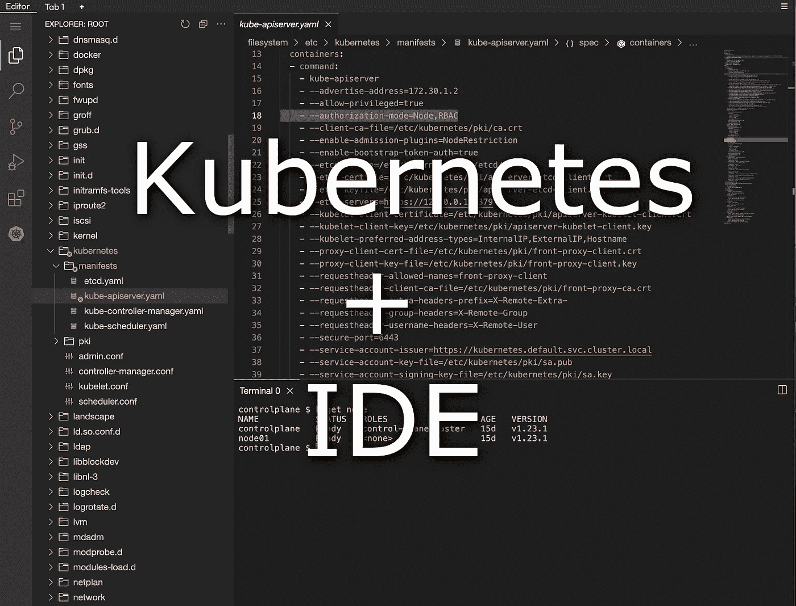
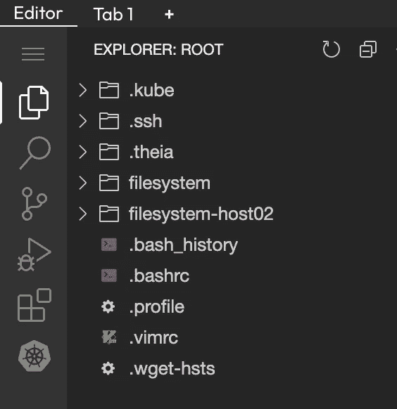
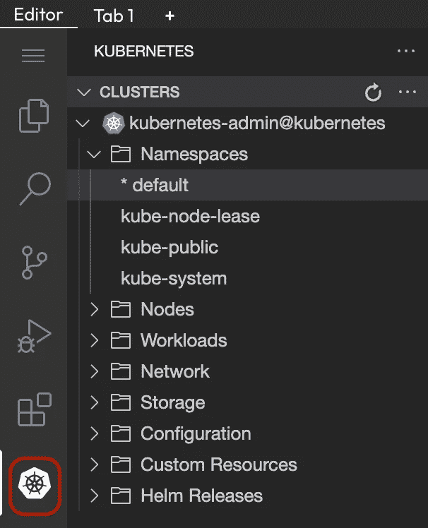
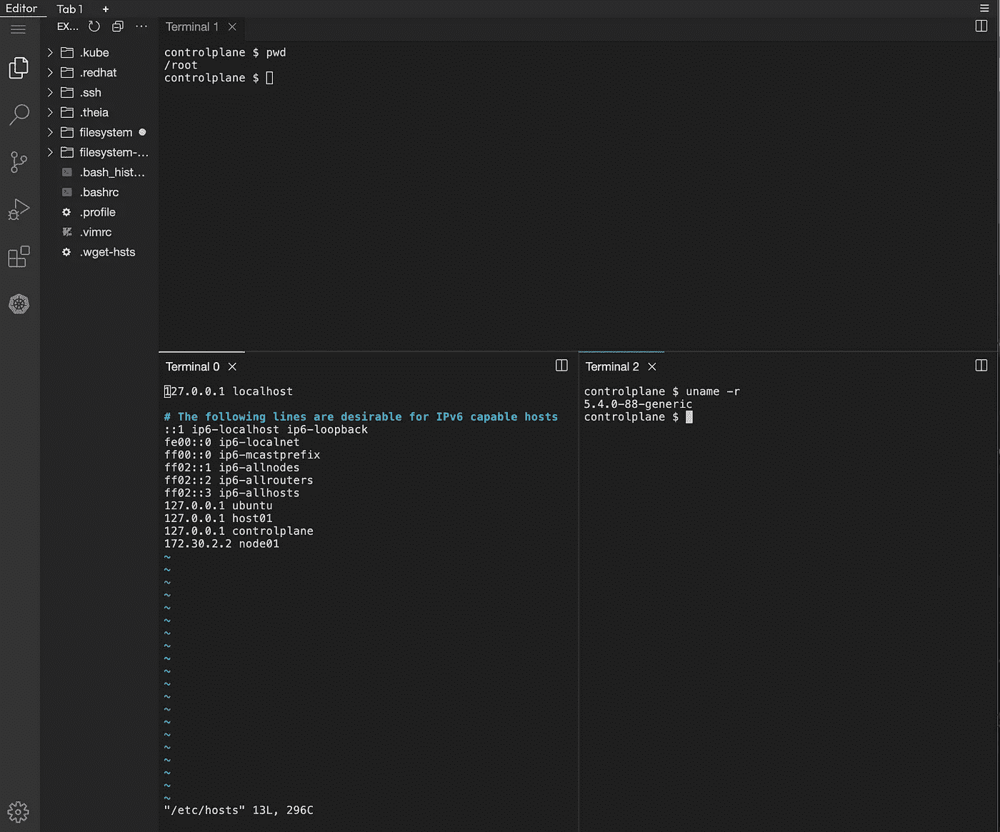

# Kubernetes 和 IDE 仅在您的浏览器中| Killercoda

> 原文：<https://itnext.io/kubernetes-and-ide-just-in-your-browser-killercoda-21ba309dd75c?source=collection_archive---------0----------------------->

## 我们如何在 Killercoda 的每个环境中添加忒伊亚，一个全面的类似 VSCode 的可视化编辑器



# TL；速度三角形定位法(dead reckoning)

您想在浏览器中即时访问 Linux|Kubernetes 环境以及一个成熟的 IDE 吗？看看[杀手科达](https://killercoda.com/)！

# Killercoda？

Killercoda 是一个交互式学习平台，允许每个人只需在浏览器中访问基于 Linux|Kubernetes 的环境。

[阅读更多](https://wuestkamp.medium.com/katacoda-alternative-1d33599af75f?source=friends_link&sk=853df1e3537cdd19dfcf4cfc0bcd1bff)

# 如果我们有 vim，为什么还需要 IDE？

听着，我们甚至不要去那里；)大家都要用自己最熟悉的编辑器！如果你正在准备 CKS|CKA|CKAD 考试，确保使用 Vim 或 Nano 等控制台编辑器，因为没有可视化编辑器。

# 忒伊亚·伊德

[忒伊亚](https://theia-ide.org/)太神奇了！它自称为

> 一个开放、灵活、可扩展的云和桌面 IDE 平台。忒伊亚是一个可扩展的平台，利用最先进的 web 技术来开发成熟的多语言云和桌面 IDE 类产品。

它允许您在浏览器中拥有一个成熟的 IDE，您甚至可以加载和使用 VSCode 扩展。

**但是要确保你理解**它真正的范围:

> 建立一个平台来构建类似 IDE 的产品

…就是这样！您可以使用忒伊亚来构建自己的 web 或桌面 IDE。开箱即用，您也将获得一个工作版本，但您可能需要一些开发工作来适应您的需求。为此做好准备。

# 忒伊亚对科达杀手采取行动

例如，在基勒科达开设 [CKA 游乐场](https://killercoda.com/playgrounds/scenario/cka)。您将获得一个包含两个虚拟机、一个控制面板和一个工作负载节点的环境。要访问忒伊亚切换到编辑*编辑器*选项卡:


## 我们如何管理忒伊亚？

我们在每个环境中的所有第一个虚拟机上运行忒伊亚。Killercoda 环境可以有一个或多个虚拟机。在 CKA 游乐场，忒伊亚在控制面板虚拟机上运行。

忒伊亚进程作为 root 用户直接在主机上运行，而不是在容器或任何抽象层中运行。这确保了忒伊亚终端和文件与主环境终端中的 100%相同。

## 如何访问文件系统？



默认情况下，忒伊亚被锁定到一个特定的目录。我们将其配置为运行它的虚拟机上的`/root`。我们认为`/root`将是人们工作的主要目录。

为了访问整个文件系统，我们创建了一个符号链接`filesystem`。

## 访问其他虚拟机文件系统？

如果环境中有更多的虚拟机，您可以设置一个 ssh-mount，如下所示。默认情况下，我们不使用 ssh-mount，因为它会导致高 CPU 使用率。

```
mkdir -p filesystem-host02sshfs -o StrictHostKeyChecking=no -o allow_other,default_permissions root@172.30.2.2:/ filesystem-host02
```

环境中虚拟机的 IP 地址是:

```
host1: 172.30.1.2
host2: 172.30.2.2
host3: 172.30.3.2
...
```

## Kubernetes 插件



扩展 *Vscode-Kubernetes* 也是默认安装的，并且可以与现有的 kubectl 上下文一起工作。

## 多个终端



你可以使用忒伊亚也只是因为他们漂亮的可调终端界面。打开多个，然后移动到顶部或彼此相邻！

# 忒伊亚 vs vs 代码

> 我们相信 VS 代码是一个优秀的产品。这就是为什么忒伊亚欣然接受了许多设计决策，甚至直接支持 VS 代码扩展。
> 
> 最显著的区别是:
> 
> *忒伊亚的架构更加模块化，允许更多的定制，
> 
> *忒伊亚是为在桌面和云上运行而全新设计的，并且
> 
> *忒伊亚是在厂商中立的开源基础上开发的。
> 
> ([来源](https://theia-ide.org/)

在 Killercoda，真正推动我们使用忒伊亚的是**的低足迹**。忒伊亚使用/需要大约 100MB，而 VSCode 可能需要 1GB+。

# 接下来是什么？

我们正在考虑实施的一些事情:

*   使用忒伊亚浏览器(例如查看图像)
*   存储会话之间持续的用户设置(如颜色主题)
*   允许方案创建者将编辑器选项卡设为默认值

# 结束了

如果有什么问题或者您有任何功能需求，请通过[支持](https://killercoda.com/support)告诉我们。