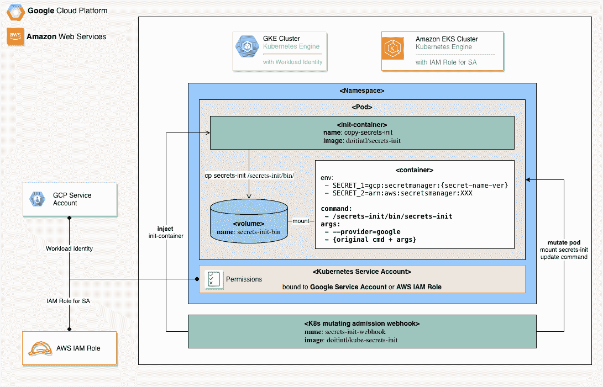

# Kubernetes 和云中的秘密管理:第二部分

> 原文：<https://itnext.io/kubernetes-and-secrets-management-in-cloud-part-2-6c37c1238a87?source=collection_archive---------4----------------------->

## 将 API 密钥、密码、证书和其他敏感数据存储在云原生秘密管理服务中，并从 K8s 集群访问它们。

## 介绍

*秘密对于许多生产系统的运作至关重要。意外泄露机密是应该妥善解决的最大风险之一。开发人员应该尽力保护应用程序的秘密。*

一旦公司转向微服务架构，多个服务需要访问不同的秘密才能正常工作，问题就变得更加棘手。这带来了新的挑战:如何分发、管理、监控和轮换应用程序机密，同时避免意外暴露？

在之前的帖子([第一部分](https://blog.doit-intl.com/kubernetes-and-secrets-management-in-cloud-858533c20dca))中，我展示了一种将 AWS 和 Google Cloud secrets 管理服务( [AWS Secrets Manager](https://aws.amazon.com/secrets-manager/) 、 [AWS SSM 参数存储](https://docs.aws.amazon.com/systems-manager/latest/userguide/systems-manager-parameter-store.html)和[Google Cloud Secret Manager](https://cloud.google.com/secret-manager))与 Kubernetes 集成的方法，使用了手动添加到目标 Pod 中的[doit intl/Secrets-init](https://hub.docker.com/r/doitintl/secrets-init)*init container*。

在这篇文章中，我将展示一种 **Kubernetes-native** 方法来集成上面提到的云秘密管理服务。

## 自动云秘密注入

虽然可以手动修改 Kubernetes 部署 YAML 文件以使用`secret-init`作为容器`init`系统，但更好的选择是，如果有人可以为您这样做，并且只为引用云秘密的 Kubernetes Pods 这样做。对我们来说幸运的是，Kubernetes 允许我们在使用一种称为[变异准入 webhook](https://kubernetes.io/docs/reference/access-authn-authz/extensible-admission-controllers/) 的机制创建容器之前检查和修改任何 Pod。

[DoiT intl/kube-secrets-init](https://github.com/doitintl/kube-secrets-init)是来自 [DoiT International](https://www.doit-intl.com/) 的一个开源项目，实现了一个用于云秘密注入的 Kubernetes *突变准入 webhook* ，支持 AWS 和 Google 云管理的秘密。

`kube-secrets-init`监控 Kubernetes 集群中新创建或更新的 pod，向直接(通过环境变量)和/或间接(通过 Kubernetes `Secret`和`ConfigMap`)引用云秘密的 pod 添加一个带有 [doitintl/secrets-init](https://hub.docker.com/r/doitintl/secrets-init) 实用程序的 *initContainer* 。

## 与 AWS Secrets Manager 集成

用户可以把一个 AWS 秘密 [ARN](https://docs.aws.amazon.com/general/latest/gr/aws-arns-and-namespaces.html) 引用作为一个环境变量值。`secrets-init`将使用指定的 ARN 将环境值解析为引用的秘密值。

## 与 AWS 系统管理器参数存储集成

可以使用 AWS 系统管理器参数存储来存储应用程序参数和机密。

用户可以将 AWS 参数存储 ARN 引用作为环境变量。`secrets-init`将使用指定的 ARN 将环境值解析为引用的参数存储值。

## 与谷歌秘密管理集成

用户可以将一个 Google Secret 名称(前缀为`gcp:secretmanager:`)作为环境变量值。`secrets-init`将使用指定的名称将环境值解析为引用的秘密值。秘密名称可以包括秘密版本，以引用秘密的特定版本。

# 要求

## 自动警报系统

为了从 AWS 机密管理器和参数存储中解析 AWS 机密，`secrets-init`应用程序应该在 AWS IAM 角色下运行，并附加以下 IAM 策略之一。

对于 AWS 机密管理器:

对于 AWS 系统管理器参数存储:

在 EKS 集群中运行时，建议对服务帐户使用 [AWS IAM 角色。也可以将 IAM 角色分配给 EC2 实例，容器在该实例中运行。这种选择被认为不太安全。](https://docs.aws.amazon.com/eks/latest/userguide/iam-roles-for-service-accounts.html)

## 谷歌云

为了从 Google Secret Manager 中解析 Google secrets，`secrets-init`应用程序应该在 IAM 角色下运行，拥有足够的权限来访问所需的机密。例如，您可以将以下两个预定义的 Google IAM 角色分配给一个 Google 服务帐户:`Secret Manager Viewer`和`Secret Manager Secret Accessor`角色。

在 GKE 集群中，可以将 IAM 角色分配给具有[工作负载标识](https://cloud.google.com/kubernetes-engine/docs/how-to/workload-identity)的 Kubernetes Pod。也可以将 IAM 角色分配给运行容器的 GCE 实例。这种选择被认为不太安全。

取消注释 [deployment.yaml](https://github.com/doitintl/kube-secrets-init/blob/master/deployment/deployment.yaml) 文件中的`--provider=google`标志。

## Webhook 部署

1.  为了部署`kube-secrets-init` webhook 服务器，我们需要在我们的 Kubernetes 集群中创建一个 webhook 服务和一个部署。这很简单，除了一点:服务器的 TLS 配置。如果您愿意检查一下 [deployment.yaml](https://github.com/doitintl/kube-secrets-init/blob/master/deployment/deployment.yaml) 文件，您会发现证书和相应的私钥文件是从命令行参数中读取的，并且这些文件的路径来自指向 Kubernetes 秘密的卷挂载:

需要记住的最重要的事情是稍后在 webhook 配置中设置相应的 CA 证书，这样`apiserver`就会知道它应该被接受。现在，我们将重用最初由 Istio 团队编写的脚本来生成证书签名请求。然后，我们将请求发送到 Kubernetes API，获取证书，并根据结果创建所需的秘密。

首先，运行[web hook-create-signed-cert . sh](https://github.com/doitintl/kube-secrets-init/blob/master/deployment/webhook-create-signed-cert.sh)脚本，检查持有证书和密钥的秘密是否已经创建:

一旦创建了秘密，我们就可以创建部署和服务。这些是标准的 Kubernetes 部署和服务资源。到目前为止，我们只制作了一个 HTTP 服务器，它通过端口`443`上的服务接受请求:

## 配置变异准入网络挂钩

现在我们的 webhook 服务器正在运行，它可以接受来自`apiserver`的请求。但是，我们应该首先在 Kubernetes 中创建一些配置资源。让我们从验证 webhook 开始，稍后我们将配置变异的 webhook。如果你看一下 [webhook 配置](https://github.com/doitintl/kube-secrets-init/blob/master/deployment/mutatingwebhook.yaml)，你会注意到它包含了一个`CA_BUNDLE`的占位符:

有一个[小脚本](https://github.com/doitintl/kube-secrets-init/blob/master/deployment/webhook-patch-ca-bundle.sh)用这个 CA 替换配置中的 CA_BUNDLE 占位符。在创建验证 webhook 配置之前运行以下命令:

创建变异 webhook 配置:

## 为 secrets-init-webhook 配置 RBAC

创建一个与`secrets-init-webhook`一起使用的 Kubernetes 服务帐户:

为 webhook 服务帐户定义 RBAC 权限:

## 摘要

我希望这篇文章对你有用。我期待您的评论和任何问题。

我们还邀请您为 GitHub 项目[doit intl/kube-secrets-init](https://github.com/doitintl/kube-secrets-init)贡献(问题、功能、PRs)。

想要更多来自阿列克谢的故事？在 [Medium](http://blog.doit-intl.com/) 上查看我们的博客，或者[在 Twitter 上关注阿列克谢](https://twitter.com/alexeiled)。