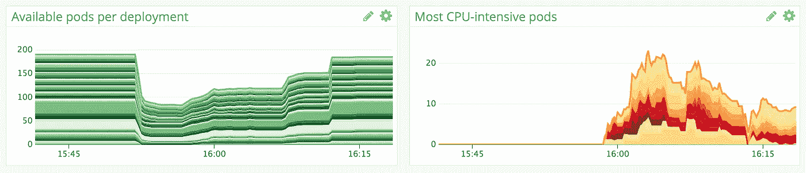
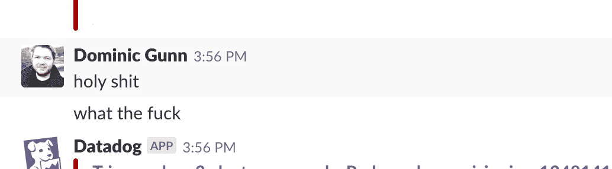
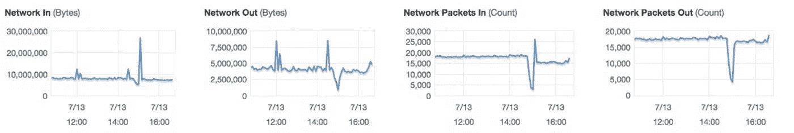

# 库伯内特和威胁 ELB，停电的故事

> 原文：<https://itnext.io/kubernetes-and-the-menace-elb-the-tale-of-an-outage-c00bef678fc0?source=collection_archive---------1----------------------->

在 Turnitin，我们正慢慢开始涉足 Kubernetes 的世界，我以前写过一点，但随着时间的推移，我们开始将越来越多的软件装载到我们的集群上，并将小部分流量慢慢转移到我们的新基础设施上。

这种经历始于一个平静而普通的下午，但很快升级为完全出乎意料和惊喜的经历，值得拥有自己的博客。

# 该事件

我们在 Turnitin 有各种各样的集群为不同的地区提供服务，但所有这些集群目前都由 AWS 中的基础设施提供支持，并由 [kube-aws](https://github.com/kubernetes-incubator/kube-aws) 提供，正如您所料，我们还有大量的警报来帮助监控我们集群的健康状况。

在我们每个集群的启动过程中，我们已经配置了集群`cluster.yaml`来为集群 API 设置一个私有 ELB，提供适当的子网、CIDRs 和托管区域，然后让 [kube-aws](https://github.com/kubernetes-incubator/kube-aws) 完成它的工作。

几个月过去了，在此之前，我们的任何一个集群都没有丢失任何东西



中断持续了 15 分钟多一点，轻微的服务中断持续了更长时间，那么发生了什么呢？我们的操作工程师碰过这个集群吗？部署真的出错了吗？我们所有的豆荚都到哪里去了？

# 调查

最初，我们有点不知所措，我们之前从未真正见过这种类型的中断，因此检查了我们节点的健康状况，大约一半的节点报告了`NotReady`状态。令人担忧的是，这也是我们的一个更安静的集群，尤其是考虑到事件发生的时间，它要对这个用户仍在睡觉的大陆上的交通负责。

调查显示这些节点上的 Kubelet 已经停止报告，我在这里删减了一些数据以保持简洁。

```
➜  $ kubectl describe node a-problem-node.internal
.....
Conditions:
  Type             Status    Message
  ----             ------    -------
  OutOfDisk        Unknown   Kubelet stopped posting node status.
  MemoryPressure   Unknown   Kubelet stopped posting node status.
  DiskPressure     Unknown   Kubelet stopped posting node status.
  Ready            Unknown   Kubelet stopped posting node status.
```

这很奇怪，为什么我们大约一半的节点突然停止报告？在调查过程中，我们的一名工程师偶然发现了这个日志:

> *streamwatcher.go:109】无法从监视流中解码事件:读取 TCP 10 . 69 . 12 . 245:50538->10 . 69 . 14 . 11:443:读取:没有到主机的路由*

我们检查了一个`NotReady`节点的健康状况，果然注意到一个巨大的网络峰值，这不是正常的行为。



突然，事情开始变得明朗起来，分配给 ELB 的一个提供集群 api 访问的动态 IP 发生了变化，并且这种变化没有传播到我们的 Kubelets。

# 解决

我们不是唯一一家在这个问题上陷入困境的公司，事实上你可以在[这个](https://github.com/kubernetes-incubator/kube-aws/issues/598) Github 问题上找到关于它的更深入的讨论。

有助于防止这种情况再次发生的行动现在已经开始实施，停电的原因是我们最初没有预料到的，因此没有防范，但这感觉像是我们可以并且应该分享的经验。

随着时间的推移，我希望我能少写些这样的东西，尽管这很令人难过，因为这些经历是多么值得分享。

在我的博客[https://寓言. sh](https://fable.sh) 上阅读这篇文章和更多内容！