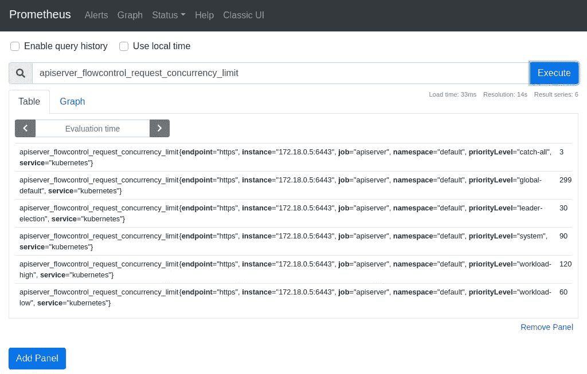
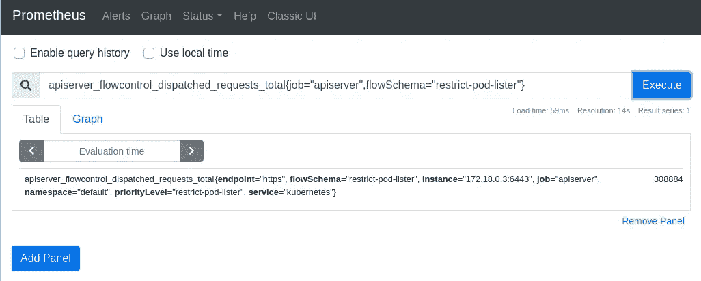
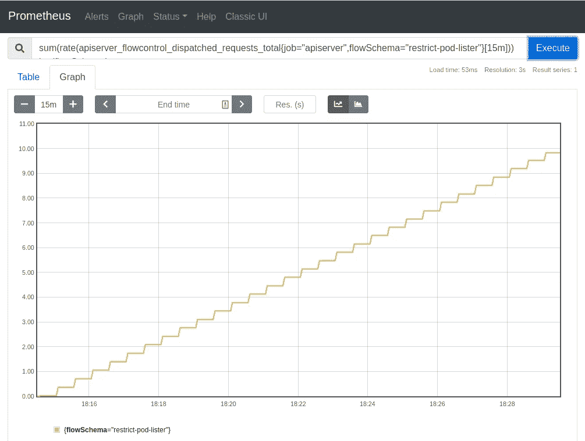
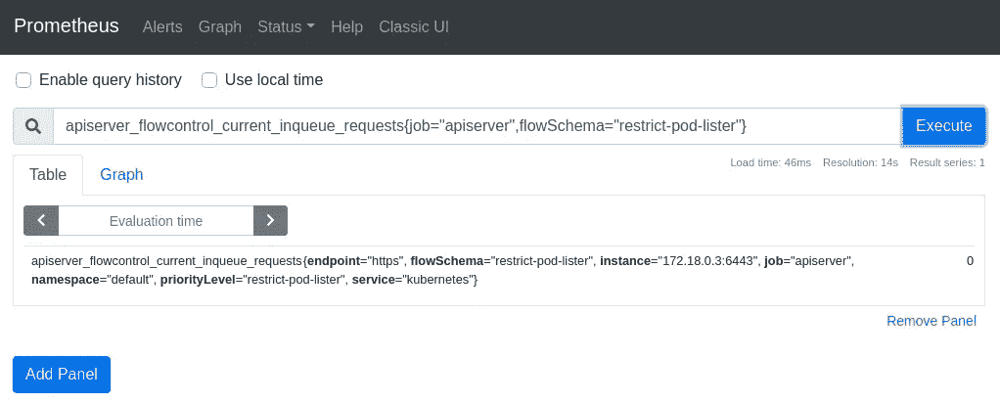
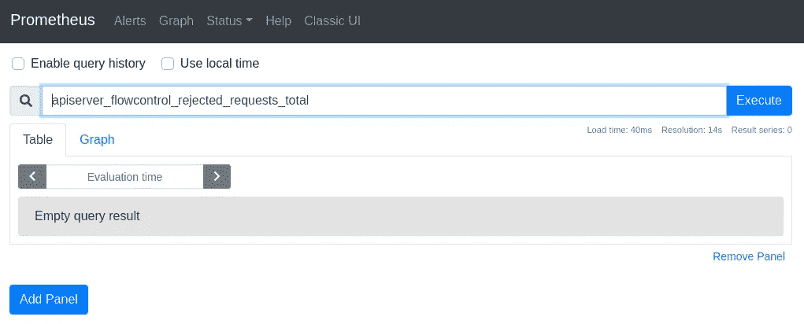
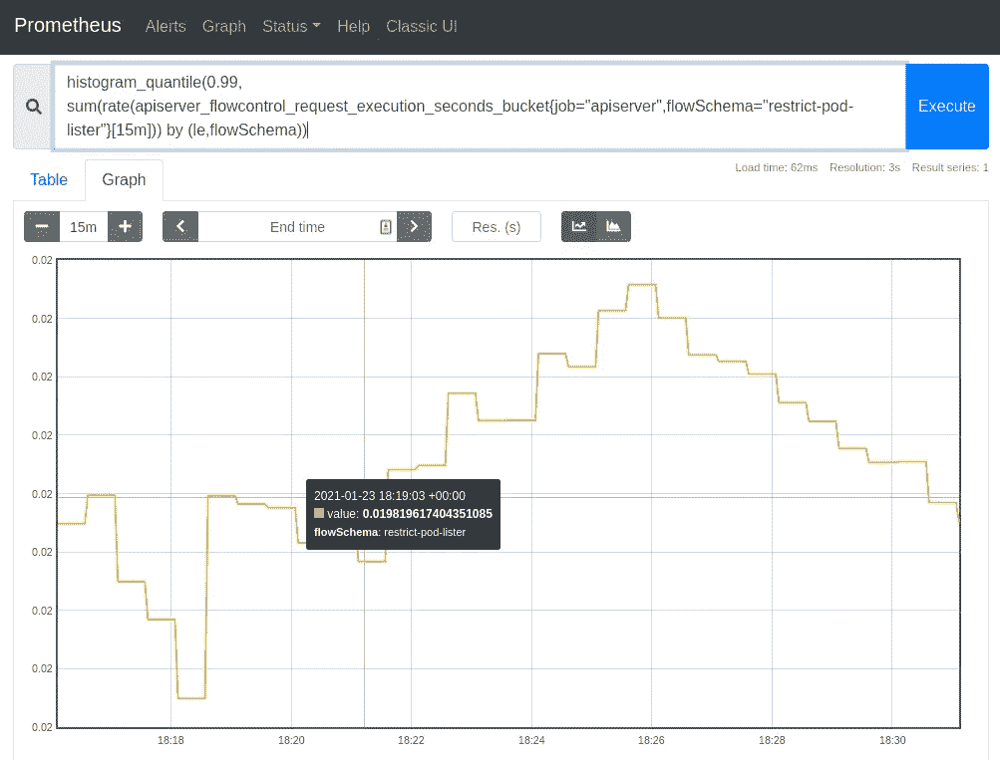
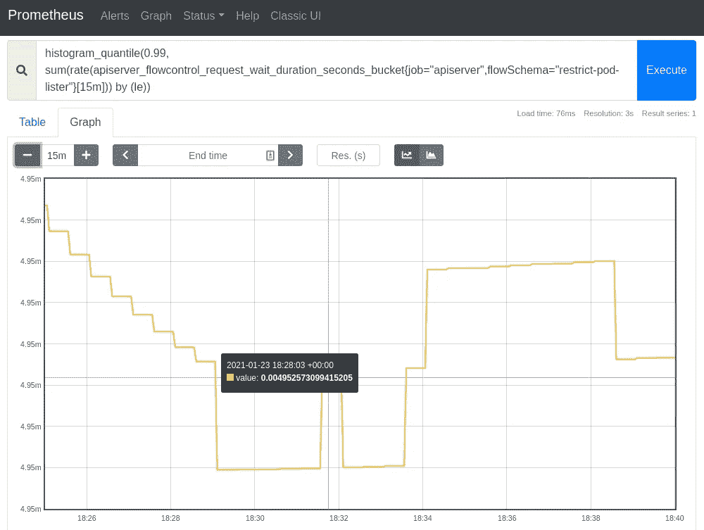
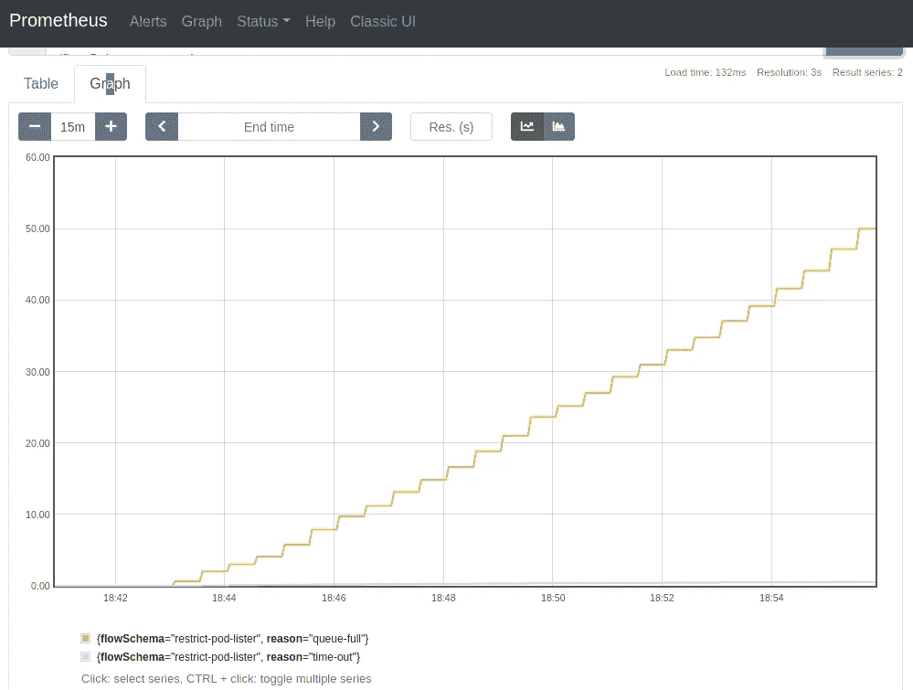
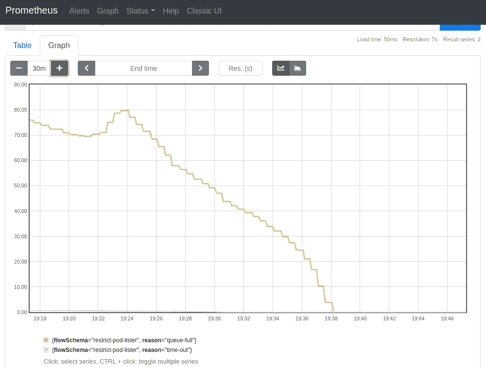

# Kubernetes API 优先级和公平性

> 原文：<https://itnext.io/kubernetes-api-priority-and-fairness-b1ef2b8a26a2?source=collection_archive---------3----------------------->

T 他的帖子是关于新的 Kubernetes [API 优先级和公平性](https://kubernetes.io/docs/concepts/cluster-administration/flow-control/) (APF)特性。我将与您分享我所学到的知识，并向您展示如何定义策略来对 Kubernetes API 服务器的入站请求进行优先级排序和节流。然后，我还将介绍一些指标和调试端点，您可以使用它们来确定 APF 是否影响了您的控制器。

🆕*在 Kubernetes 1.20 中默认启用 APF，作为 beta 特性。对于早期版本的 Kubernetes，可以通过* `APIPriorityAndFairness` *特性门* [*启用*](https://kubernetes.io/docs/concepts/cluster-administration/flow-control/#enabling-disabling-api-priority-and-fairness) *。*

# 什么是 APF

在 APF 之前，API 服务器使用`--max-requests-inflight`和`--max-mutating-requests-inflight`命令行标志来调节入站请求的数量。这个实现对请求的唯一区别是请求是否是变异的。例如，它们无法确保优先级较低的流量不会淹没关键流量，如[本期示例](https://github.com/kubernetes/kubernetes/issues/77723)中所述。

APF 提供了一种流量控制机制，以确保 API 服务器能够在保证公平性的同时抑制请求。它允许平台所有者定义 API 级策略，将入站请求分类为不同的*优先级*和*流*。


通过流量和优先级管理请求

一般来说，所有传入的请求都根据一组*流模式*进行评估。每个请求将与一个流模式相匹配，该模式将请求分配到一个*优先级*。当某个优先级的请求被抑制时，其他优先级的请求不受影响。

为了进一步加强优先级请求之间的公平性，匹配流模式将请求与*流*相关联，其中来自相同源的请求被分配相同的*流区分符*。

在这些流中，不能立即执行的请求将使用[混洗分片](https://aws.amazon.com/blogs/architecture/shuffle-sharding-massive-and-magical-fault-isolation/)进行排队，这是一种常用于隔离工作负载以提高容错能力的技术[。当有足够的容量可用时，使用一个](https://aws.amazon.com/builders-library/workload-isolation-using-shuffle-sharding/#What_is_shuffle_sharding.3F)[公平排队](https://en.wikipedia.org/wiki/Fair_queuing)算法来使流中的请求出列。

# 了解流模式和优先级配置

🛠️ ️ *本节使用的命令通过 Kubernetes 1.19 测试，使用* [*种类*](https://kind.sigs.k8s.io/)*v 0 . 9 . 0 .*`[*yq*](https://mikefarah.gitbook.io/yq/)`*v 4 . 3 . 1 创建，用于过滤 YAML 输出以提高可读性。*

️️🛠️ *普罗米修斯操作员使用* [*部署 kube-普罗米修斯*](https://github.com/prometheus-operator/kube-prometheus)*0.7 版本。查看 kube-prometheus* [*自述文件*](https://github.com/prometheus-operator/kube-prometheus#access-the-dashboards) *，了解如何通过端口转发访问 prometheus 控制台。*

在创建我们自己的`FlowSchema`和`PriorityLevelConfiguration`资源之前，让我们使用默认的概念来回顾一些重要的概念:

默认流模式列表

以`system-leader-election`流模式为例，它的`.spec`如下所示:

“系统-领导者-选举”流程图的规格

`rules`描述了用于识别匹配请求的标准列表。当且仅当以下情况时，流模式匹配请求:

*   至少有一个`subjects`与发出请求的主题相匹配，并且
*   它的`resourceRules`或`nonResourceRules`中至少有一个与被请求的动词和(非)资源匹配

`distinguishedMethod`定义了如何计算流识别符:

*   `ByUser`来自同一个`subject`的请求被分组到同一个流中，这样用户就不会互相淹没
*   `ByNamespace`来自同一个名称空间的请求被分组到同一个流中，这样一个名称空间中的工作负载就不会淹没其他名称空间中的工作负载
*   一个空字符串，其中所有请求都被分组到一个流中

当匹配请求时，具有较低`matchingPrecedence`的流模式比具有较高`matchingPrecendence`的流模式具有更高的优先级。

`priorityLevelConfiguration`是指指定流量控制属性的优先级配置资源。

让我们检查一下`leader-election`优先级配置的`.spec`:

“领导者选举”优先级配置的规格

`limited.assuredConcurrencyShares`定义了用于计算*保证并发值的*并发份额*。*[Kubernetes API 文档](https://kubernetes.io/docs/reference/generated/kubernetes-api/v1.20/#limitedprioritylevelconfiguration-v1beta1-flowcontrol-apiserver-k8s-io)提供了关于如何计算*保证并发值*的更多信息。

要查看每个优先级的计算并发限制，请查看`apiserver_flowcontrol_request_concurrenty_limit`指标:



所有优先级的并发限制

`limited.assuredConcurrencyShares`的值与`apiserver_flowcontrol_request_concurrency_limit`指标的值相关联，增加优先级的并发份额将增加其并发限制。由于 API 服务器的总并发限制是由所有优先级共享的，因此增加一个优先级的限制将会减少其他优先级的限制。

`limited.limitResponse`定义了处理不能立即执行的请求的策略。`limit.limitResponse.type`支持两个值:

*   `Queue`请求在哪里排队
*   `Reject`当请求因 HTTP 429 错误而被丢弃时

使用`Queue`限制响应类型，可以通过调整`limited.limitResponse.queuing`的属性来进一步配置排队行为。APF [文档](https://kubernetes.io/docs/concepts/cluster-administration/flow-control/#prioritylevelconfiguration)和[提案](https://github.com/kubernetes/enhancements/tree/master/keps/sig-api-machinery/1040-priority-and-fairness#assignment-to-a-queue)提供了关于改变`queues`、`queueLengthLimit`和`handSize`值的影响的更多信息。

在下一节中，我们将研究如何确定哪个模式与我们的请求相匹配。

# 确定匹配的流模式

确定哪个流模式匹配我们的请求的最快方法是检查来自 API 服务器的两个 APF 响应头`X-Kubernetes-PF-FlowSchema-UID`和`X-Kubernetes-PF-PriorityLevel-UID`。它们向我们展示了匹配流模式的 uid 和优先级配置:

确定匹配的流模式和优先级

在上面的例子中，我的`GET` pods 请求与`exempt`流模式和同名的优先级配置相匹配。

为了理解这个流模式对我的请求的影响，让我们检查一下它的`.spec`:

“豁免”流模式和优先级的规格

请注意`exempt`流模式:

1.  具有最高优先级，其`matchingPrecedence`设置为 1
2.  匹配来自`system:masters`组的请求

此外，`exempt`优先级配置将其`type`设置为`Exempt`，没有任何队列配置。

所有这些都是有意义的，因为我的 kubectl 是使用我的 cluster-admin kubeconfig 凭证进行身份验证的，该凭证与`system:masters`组相关联。来自`system:masters`组的请求被认为是关键流量，它们不受流量控制，并由`exempt`流模式根据其`exempt`优先级配置立即调度。

好了，我想我们现在已经准备好试验我们自己的流模式和优先级配置了🤘。

# 创建定制流模式和优先级

让我们首先创建一个具有 3 个服务帐户的`demo`名称空间，即`podlister-0`、`podlister-1.`和`podlister-2`，并具有从`demo`名称空间访问`LIST`和`GET`pod 的权限:

创建“演示”命名空间、其服务帐户和所需的 RBAC

然后，我们将创建一个自定义流模式来管理来自这 3 个服务帐户的请求:

部署 restrict-pod-lister 流模式和优先级配置

在`restrict-pod-lister`优先级中使用的唯一非缺省值是队列的大小(`spec.limited.limitResponse.queuing.queueLengthLimit`)，它被设置为 5 个请求。这将有助于更快地触发节流效应。

使用`kubectl --as`选项，我们可以[模拟](https://kubernetes.io/docs/reference/access-authn-authz/authentication/#user-impersonation)服务帐户向`LIST` pods 端点发送请求:

发送带有用户模拟的列表窗格请求

太好了！我们的请求按照预期由`restrict-pod-lister`流模式和优先级进行匹配👍。

# 检查 APF 指标

在本节中，我们将通过将一个自定义控制器部署到`demo`名称空间来模拟 API 服务器的一些流量，作为 3 个不同的`Deployment`。每个部署使用我们之前创建的 3 个服务帐户之一:

部署自定义控制器

控制器使用 Go 的`[time.Tick()](https://golang.org/pkg/time/#Tick)`函数向 API 服务器的`LIST` pod 端点发送连续流量，以检索`demo`名称空间中的所有 pod。源代码可在[这里](https://github.com/ihcsim/controllers/blob/master/podlister/main.go)获得。

切换到 Prometheus 控制台，让我们使用`apiserver_flowcontrol_dispatched_requests_total`指标来检索我们的流模式匹配的请求总数:

```
apiserver_flowcontrol_dispatched_requests_total{job=”apiserver”,flowSchema=”restrict-pod-lister”}
```



我们的流模式匹配的请求总数

正如对反向量的预期，我们观察到其速率总和呈上升趋势:

```
sum(rate(apiserver_flowcontrol_dispatched_requests_total{job="apiserver",flowSchema="restrict-pod-lister"}[15m])) by (flowSchema)
```



已调度请求速率总和的上升趋势

`apiserver_flowcontrol_current_inqueue_requests`指标显示了队列中等待的请求数量。`0`值表示我们的队列当前是空的:

```
apiserver_flowcontrol_current_inqueue_requests{job="apiserver",flowSchema="restrict-pod-lister"}
```



在我们的队列中等待的请求数

更重要的是，被拒绝的请求数量也是`0`，如`apiserver_flowcontrol_rejected_requests_total`指标所示:

```
apiserver_flowcontrol_rejected_requests_total{job="apiserver",flowSchema="restrict-pod-lister"}
```



被我们的流模式拒绝的请求数

`apiserver_flowcontrol_request_execution_seconds`指标提供了对队列中的请求执行时间的洞察:

```
histogram_quantile(0.99, sum(rate(apiserver_flowcontrol_request_execution_seconds_bucket{job="apiserver",flowSchema="restrict-pod-lister"}[15m])) by (le,flowSchema))
```



我们队列中请求执行时间的 p99(秒)

在这个特定的测试运行中，我们队列中请求执行时间的 p99 大约是 0.02 秒。

相反，`apiserver_flowcontrol_request_wait_duration_seconds`指标显示了请求在队列中花费的时间:

```
histogram_quantile(0.99, sum(rate(apiserver_flowcontrol_request_wait_duration_seconds_bucket{job="apiserver",flowSchema="restrict-pod-lister"}[15m])) by (le,flowSchema))
```



我们队列中请求等待持续时间(秒)的 p99

这个测试运行的请求等待持续时间 p99 大约是 4.95 毫秒。稍后我们将再次讨论这两个指标，看看它们如何影响我们的客户端上下文超时。

让我们添加更多的副本来增加流量，以激活排队效应:

增加自定义控制器副本的数量

当我们的队列饱和时，被拒绝的请求数量开始增加。`reason`标签告诉我们这些请求被拒绝的原因(即`queue-full`或`timeout`):

```
sum(rate(apiserver_flowcontrol_rejected_requests_total{job="apiserver",flowSchema="restrict-pod-lister"}[15m])) by (flowSchema,reason)
```



在控制器的日志中也可以看到节流消息:

来自自定义控制器的节流日志

请求**等待**持续时间(`apiserver_flowcontrol_request_wait_duration_seconds`)的 p99 在 4.0 到 7.5 秒之间徘徊。

p99 请求**执行**的时间(`apiserver_flowcontrol_request_execution_seconds`)约为 0.96 秒。

如果我们用小于队列等待持续时间的[上下文超时](https://golang.org/pkg/context/#WithTimeout)来更新控制器，我们将开始在日志中看到一些`context deadline exceeded`错误:

带有“超出上下文截止时间”错误的控制器日志

因此，如果您开始在控制器的日志中看到许多`context deadline exceeded`错误，您现在知道如何使用 APF 指标和调试端点来确定 APF 是否限制了您的请求。

这些是我发现非常有用的指标。还有其他 APF 指标在本文中没有涉及。查看 [APF 文档](https://kubernetes.io/docs/concepts/cluster-administration/flow-control/#metrics)获取完整列表。

# 检查调试端点

除了度量之外，APF 还公开了一些调试端点，这些端点提供了对队列和请求状况的进一步了解。

`/debug/api_priority_and_fairness/dump_priority_levels`端点告诉我们优先级中`executing`和`waiting`请求的总数:

调试端点显示了我们的优先级队列的情况

运行这个命令时，我们的队列中有 70 个`waiting`和 29 个`executing`请求。

`/debug/api_priority_and_fairness/dump_queues`端点为我们的流模式中的每个队列提供了进一步的可见性:

调试端点显示了优先级中每个队列的情况

为了可读性，上面的输出被截断了。注意，输出中显示的队列数量等于优先级的值`spec.limited.limitResponse.queuing.queues`。

最后，`/debug/api_priority_and_fairness/dump_requests`端点告诉我们分配给每个请求的流区分符，以及关于请求的`subject`的信息:

显示请求信息的调试端点

# 从节流效应中恢复

如果我们将控制器缩小到 0 个副本，随着 API 服务器从节流效应中恢复，被拒绝的请求数量将逐渐减少:

缩小定制控制器副本

```
sum(rate(apiserver_flowcontrol_rejected_requests_total{job="apiserver",flowSchema="restrict-pod-lister"}[15m])) by (flowSchema,reason)
```



在恢复过程中，被拒绝的请求数量会减少

# 结论

在这篇文章中，我向您展示了如何创建定制的`FlowSchema`和`PriorityLevelConfiguration`资源来管理 API 服务器的入站流量。我们检查了这些资源的规格。

使用自定义控制器来模拟到 API 服务器的恶意流量，我们能够使用不同的 APF 指标和调试端点来深入了解队列和请求。

我们还研究了这样一个场景，由于长时间的队列等待，在 API 服务器处理完我们的请求之前，我们的客户端上下文截止时间超时了。

流模式提供了其他配置，例如拒绝入站流量而不是对其进行排队，以及通过名称空间而不是用户来调节入站流量，所有这些都将留给读者练习。