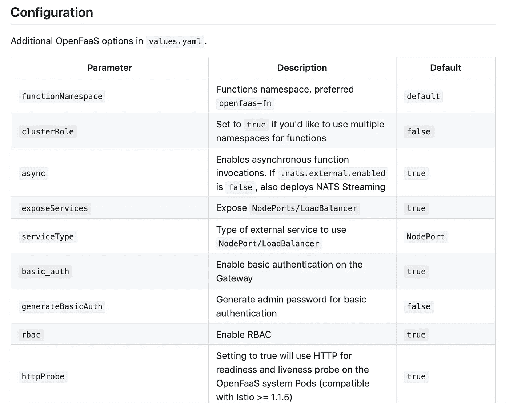

# arkade by example——Kubernetes 的应用程序，简单的方法

> 原文：<https://itnext.io/kubernetes-apps-the-easy-way-f06d9e5cad3c?source=collection_archive---------1----------------------->

为了得到正确版本的 [helm](https://helm.sh/) 并安装一个缺省值相同的图表而与几十个自述文件竞争的日子已经一去不复返了。

arkade ( `ark`简称)提供了一个简单的带有强类型标志的 CLI，通过一个命令就可以将 Helm charts 和 Kubernetes 应用程序安装到您的集群中。


arkade 是一个单一的静态 Golang CLI，可以为 Kubernetes 安装流行的应用程序

# 去找阿卡德

```
# Note: you can also run without `sudo` and move the binary yourself
curl -sLS [https://dl.get-arkade.dev](https://dl.get-arkade.dev) | sudo sharkade --help
ark --help  # a handy alias
```

安装时会创建一个别名`ark`，所以您也可以运行`ark install APP`

# 使用

这里有几个你可以安装的应用程序的例子，完整的列表如下:`arkade install --help`。

*   `arkade install` -安装一个应用程序
*   `arkade update` -更新阿卡德
*   `arkade info` -应用程序的安装后屏幕

# 安装应用程序

无需担心您安装的是英特尔架构还是 ARM 架构，正确的值会自动为您设置。

> 使无服务器变得简单的 [OpenFaaS](https://www.openfaas.com/) 应用程序可以安装到您的 Raspberry Pi、Graviton 服务器、笔记本电脑或托管的 Kubernetes 服务中，不需要任何更改。

```
arkade install openfaas \
  --gateways 2 \
  --load-balancer false
```

我们认为这种网格应该消失，代之以更直观的 CLI 标志。



GitHub 中的 values.yaml 示例

## 减少重复

[通常多达十几个命令](https://cert-manager.io/docs/installation/kubernetes/)(包括查找和下载 helm)，现在只有一个。没有搜索要应用的正确 CRD，没有尝试安装 helm，没有尝试找到要添加的正确 helm repo:

```
arkade install cert-manager
```

## 给我一些指标！

Kubernetes 社区保守得最好的秘密之一是 [metrics-server](https://github.com/kubernetes-sigs/metrics-server) ，安装了它，您可以访问两个新命令

```
# Get the memory/CPU per podkubectl top pod --namespace NS
kubectl top pod --all-namespaces/-A# Get CPU / RAM utilizationkubectl top node
```

除此之外，它还支持使用 Kubernetes 水平 Pod 自动缩放(HPA)。

## 如果您想要一个 IngressController 呢？

我们也包括在内。现在，如果你在公共云服务上运行 Kubernetes，比如 EKS、AKS 或 GKE，你可以通过负载均衡器安装并获得一个 IP

```
arkade install nginx-ingress# The IP will show up under "EXTERNAL-IP"
kubectl get svc
```

但是，如果您在本地机器上运行，或者通过 VPS/VM 运行，那么您需要使用一种替代方法。nginx-ingress 的图表确实支持使用每个节点的 IP 和端口 80/443(又名 NodePorts)，但安装命令确实又长又复杂，所以容易出错，也不可能记住。

我们已经解决了这个问题，我给你:

```
arkade install nginx-ingress --host-mode
```

就这样，现在集群中每个节点上的端口 80 和 443 将转到 Nginx。

## Bye-bye values.yaml，hello flags

我们使用强类型的 Go CLI 标志，这样你就可以运行`--help`而不是在无数的舵图自述文件中寻找你想要的正确的`--set`组合。

```
arkade install nginx-ingress --helpInstall nginx-ingress. This app can be installed with Host networking for 
cases where an external LB is not available. please see the --host-mode 
flag and the nginx-ingress docs for more infoUsage:
  arkade install nginx-ingress [flags]Examples:
  arkade install nginx-ingress --namespace defaultFlags:
      --helm3              Use helm3, if set to false uses helm2 (default true)
  -h, --help               help for nginx-ingress
      --host-mode          If we should install nginx-ingress in host mode.
  -n, --namespace string   The namespace used for installation (default "default")
      --update-repo        Update the helm repo (default true)
```

## 用`--set`覆盖

你也可以通过`--set`为使用头盔的应用程序设置头盔覆盖，这允许我们“向下”进入头盔图表并设置覆盖值。

```
ark install openfaas --set=faasIdler.dryRun=false
```

这就是我们如何通过其“ [faas-idler](https://github.com/openfaas-incubator/faas-idler) ”组件在 OpenFaaS 中实现零扩展行为。

安装后，将打印一条信息消息，并提供使用帮助，您可以通过以下方式随时返回:

```
$ arkade info <NAME>
```

这是它寻找`openfaas`的方式——可以在任何云上工作的无服务器，无论是英特尔还是 ARM。

```
$ arkade info openfaasInfo for app: openfaas# Get the faas-clicurl -SLsf https://cli.openfaas.com | sudo sh# Forward the gateway to your machinekubectl rollout status -n openfaas deploy/gatewaykubectl port-forward -n openfaas svc/gateway 8080:8080 &# If basic auth is enabled, you can now log into your gateway:PASSWORD=$(kubectl get secret -n openfaas basic-auth -o jsonpath="{.data.basic-auth-password}" | base64 --decode; echo)echo -n $PASSWORD | faas-cli login --username admin --password-stdinfaas-cli store deploy figletfaas-cli list# For Raspberry Pifaas-cli store list --platform armhffaas-cli store deploy figlet --platform armhf# Find out more at:# https://github.com/openfaas/faas
```

## 获得带身份验证的自托管 TLS 注册中心

以下是如何在一个空集群上通过 5 个命令获得一个自托管 Docker 注册表和 TLS 及身份验证:

```
arkade install nginx-ingress
arkade install cert-manager
arkade install docker-registry
arkade install docker-registry-ingress \
  --email web@example.com \
  --domain reg.example.com
```

要使用您的注册表，您现在可以运行:

```
docker login reg.example.com
docker pull reg.example.com/alpine:3.11
docker tag alpine:3.11 reg.example.com/alpine:3.11
docker push reg.example.com/alpine:3.11
```

要在 Kubernetes 中使用，请参阅 OpenFaaS 指南，该指南显示了如何为服务帐户使用 ImagePullSecret。

## 使用 TLS 获取 OpenFaaS

前面我们展示了一个如何安装 openfaas 的例子，但是如果您也想要 TLS 呢？(提示:你总是想要 TLS)

我们开始了 IngressController 的 nginx-ingress、为我们获取 TLS 的 cert-manager、openfaas 和 openfaas-ingress(一个入口和发行者模板):

```
arkade install nginx-ingress
arkade install cert-manager
arkade install openfaas
arkade install openfaas-ingress \
  --email web@example.com \
  --domain reg.example.com
```

你现在设置好了！您的网关是`[https://reg.example.com](https://reg.example.com)`，功能出现在`[https://reg.example.com/function/name](https://reg.example.com/function/name.)` [。](https://reg.example.com/function/name.)

但是你也想要像`api.mycorp.com/v1/name`一样的定制虚空域吗？我们已经通过[Ingres operator](https://github.com/openfaas-incubator/ingress-operator)覆盖了你。

## 为专用群集和 IngressController 获取公共 IP

如果你在私有云中、内部或笔记本电脑上运行，你可以简单地使用 [inlets-pro](https://docs.inlets.dev/) 添加 [inlets-operator](https://github.com/inlets/inlets-operator/) 来获得一个安全的 TCP 隧道和一个公共 IP 地址。

```
arkade install inlets-operator \
  --access-token $HOME/digitalocean-token \
  --region lon1 \
  --license $(cat $HOME/license.txt)
```

在文档中找到更多关于 [Inlets PRO 的信息](https://docs.inlets.dev/)

## 探索应用程序

```
arkade install --help
ark --helpcert-manager            Install cert-manager
chart                   Install the specified helm chart
cron-connector          Install cron-connector for OpenFaaS
crossplane              Install Crossplane
docker-registry         Install a Docker registry
docker-registry-ingress Install registry ingress with TLS
info                    Find info about a Kubernetes app
inlets-operator         Install inlets-operator
istio                   Install istio
kafka-connector         Install kafka-connector for OpenFaaS
kubernetes-dashboard    Install kubernetes-dashboard
linkerd                 Install linkerd
metrics-server          Install metrics-server
minio                   Install minio
mongodb                 Install mongodb
nginx-ingress           Install nginx-ingress
openfaas                Install openfaas
openfaas-ingress        Install openfaas ingress with TLS
postgresql              Install postgresql
```

## 现在安装，以后更新

```
curl -ssL [https://dev.get-arkade.dev](https://dev.get-arkade.dev) | sudo sh
```

当您想要更新时，只需运行`arkade update`

## 那是一个包裹

欢迎投稿，也欢迎对您喜爱的应用程序提出建议。

总结:arkade 是将应用程序安装到 Kubernetes 的简单方法。我们已经花了很多时间思考如何减少重复，因为我们的社区成员每天都在重复执行这些步骤。

[从纪念品商店购买自己的纪念品，以支持 arkade 的持续发展](https://store.openfaas.com/collections/frontpage/products/arkade-t-shirt)


从 OpenFaaS Ltd 购买您自己的 SWAG 并支持 arkade 的持续开发

接下来，我们将扩展功能[并减少代码库](https://github.com/alexellis/arkade)中的重复，当您想要在生产 devops 管道中运行 arkade 时，您还可以看到 GitOps 风格的工作流。

*   [在 GitHub 上开始或分叉项目](https://get-arkade.dev)
*   [联系 Slack 上的 Kubernetes 和 arkade 社区](https://slack.openfaas.io/)