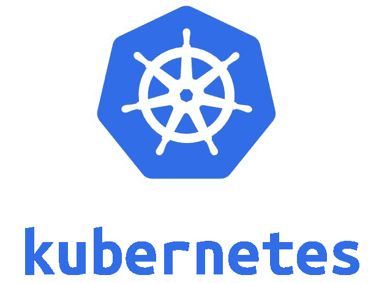

# Kubernetes:认证和授权

> 原文：<https://itnext.io/kubernetes-authentication-and-authorization-afce3c464e94?source=collection_archive---------3----------------------->

## 介绍

在本文中，我们将探讨 kubernetes 中的身份验证和授权是如何工作的。

但是首先有什么区别呢？

**认证**:

当您根据服务或系统验证您的身份时，您就通过了身份验证，这意味着系统会将您识别为有效用户。在 kubernetes 中，当您创建集群时，基本上是创建一个 CA (Certificate Authority ),然后使用它为所有组件和用户生成证书。

**授权**:

在你被认证之后，系统需要知道你是否有足够的特权去做你想做的任何事情。在 kubernetes 中，这被称为 RBAC(基于角色的访问控制),它将角色转换为具有权限的实体，并在给定的名称空间范围内通过角色绑定与服务帐户相关联，否则您可以拥有集群角色和集群角色绑定。

因此，我们将创建一个名称空间、一个服务帐户、一个角色和一个角色绑定，然后为它生成一个 kubeconfig，然后测试它。

这篇文章的来源可以在: [RBAC 例子](https://github.com/kainlite/rbac-example)找到

## 让我们开始吧

让我们开始，我将使用这些生成器，但我将它们保存到一个文件中，然后应用。

**名称空间**

命名空间资源类似于其他资源的容器，在将许多应用程序部署到同一个集群或有多个用户时，它通常很有用:

你可以在这里看到更多

**服务账户**

服务帐户是您作为系统一部分的身份，用户帐户与服务帐户有一些重要的区别，例如:

*   用户账户是给人类的。服务帐户用于在 pod 中运行的流程。
*   用户帐户应该是全局的。名称在群集的所有命名空间中必须是唯一的。服务帐户是有名称空间的。在本例中，我们为一个 pod 生成一个 serviceaccount，并为我们生成一个用户帐户，以便与 kubectl 一起使用(如果我们想要一个全局用户，我们应该使用 clusterrole 和 clusterrolebinding)。

你可以在这里看到更多

**角色**

该角色具有类似管理员的权限，允许的动词是，我们使用*表示所有，以防您对[API 组](https://kubernetes.io/docs/concepts/overview/kubernetes-api/#api-groups)有疑问，更多信息请参见[文档](https://kubernetes.io/docs/concepts/overview/kubernetes-api/#api-groups):

你可以看到更多的[这里](https://kubernetes.io/docs/reference/access-authn-authz/authorization/#determine-the-request-verb)和[这里](https://kubernetes.io/docs/reference/access-authn-authz/rbac/#clusterrole-example)

**角色绑定**

这是将角色中的权限赋予我们创建的服务帐户的粘合剂。

你可以在这里看到更多

**示例 pod**

在这里，我们用 curl 创建一个样本 pod，并给它一个服务帐户`--serviceaccount`

**申请**

在这里，我们创建所有资源

**从 pod 验证**

在这里，我们将导出服务帐户的令牌，并查询 kubernetes API。注意，为了能够访问 kubernetes 服务，因为它在不同的名称空间中，我们需要用`.default`来指定它(因为它在默认的名称空间中)，尝试:`kubectl get svc -A`来查看所有服务。

我们的 pod 一切顺利，我们可以从我们的 pod 与 API 通信，让我们看看它是否也适用于 kubectl。

**生成库对象配置**

获取令牌(如你所见，它被保存为 kubernetes 的秘密，所以它像任何其他秘密一样被安装到 pods，但自动感谢服务帐户)

注意:我使用了`kubectl config view`来发现种类端点，在我的例子中是`server: https://127.0.0.1:35617`，然后替换 CA 的秘密值和服务帐户令牌/秘密值，还要注意使用`kubectl get -o yaml`时需要从 base64 解码，还要注意当我们试图在名称空间之外做事情时会出错，因为我们没有权限， 这是向用户授予权限的一种非常有效的方式，这是因为我们为额外的用户和 pod 服务帐户创建了角色绑定(连接时要小心)。

这里可以看到更多[，这里](http://docs.shippable.com/deploy/tutorial/create-kubeconfig-for-self-hosted-kubernetes-cluster/)可以看到更多

## 打扫

永远记得清理你的本地机器/集群/等等，在我的情况下`kind delete cluster`会这样做。

# 正误表

如果您发现任何错误或有任何建议，请给我发消息，以便解决问题。

此外，您可以在这里检查源代码和[生成代码](https://github.com/kainlite/kainlite.github.io)和[源代码的变化](https://github.com/kainlite/blog)

*原载于 2020 年 11 月 29 日*[*https://tech squad . rocks*](https://techsquad.rocks/blog/kubernetes_authentication_and_authorization/)*。*