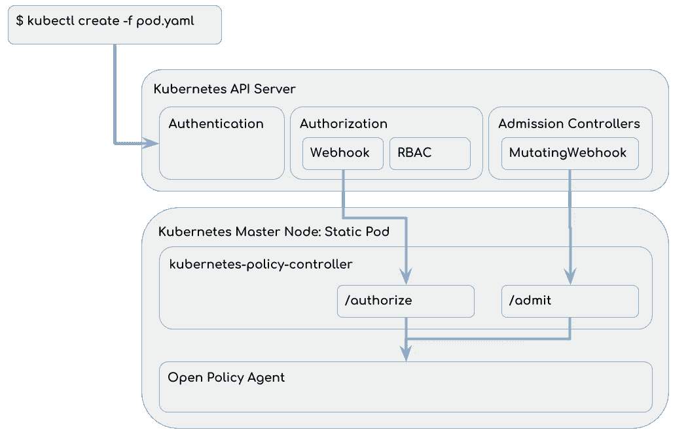

# 通过开放策略代理的 Kubernetes 授权

> 原文：<https://itnext.io/kubernetes-authorization-via-open-policy-agent-a9455d9d5ceb?source=collection_archive---------0----------------------->

在最佳实践的 Kubernetes 集群中，对 Kubernetes APIServer 的每个请求都经过身份验证和授权。[授权](https://kubernetes.io/docs/reference/access-authn-authz/authorization/)通常由 [RBAC](https://kubernetes.io/docs/reference/access-authn-authz/rbac/) 授权模块实现。但是还有其他选择，这篇博文解释了如何利用 [Webhook](https://kubernetes.io/docs/reference/access-authn-authz/webhook/) 授权模块，通过[开放策略代理(OPA)](https://www.openpolicyagent.org/) 实现高级授权策略。还有另一篇博文是关于如何针对生产环境对这个解决方案进行微调的([通过 Go Execution Tracer](/optimizing-open-policy-agent-based-kubernetes-authorization-via-go-execution-tracer-7b439bb5dc5b) 优化基于开放策略代理的 Kubernetes 授权)。

# 动机

我们是一个为公司内部客户提供托管 Kubernetes 集群的团队。为了提供一种接近上游的 Kubernetes 体验，我们希望授予我们的客户类似集群管理员的访问权限。但是为了确保基线的安全性和稳定性，我们不想授予完全的集群管理权限。例如:

*   我们希望允许对除“kube-system”之外的任何名称空间的完全访问，因为我们的基础设施(例如监控和日志记录)部署在那里。
*   我们希望实施一项 PodSecurityPolicy，不允许以“root”用户身份运行容器或直接装载“hostPath”卷。

我们的第一个实现是通过 Kubernetes RBAC 和一个定制运营商实现的。基本思想是通过 RBAC 角色绑定授予所有必要的权利。因此，除了“kube-system ”(通过操作符),我们为客户提供了每个名称空间的集群角色“admin”。每当我们发现某些东西不能按预期工作时，我们就添加额外的权限，或者通过每个名称空间的角色，或者通过一个集群角色。这导致了许多针对特定用例的单独规则，并且从长期来看是不可维护的。特别是随着我们的用户群继续增长，每当有人检测到与我们的配置不匹配的边缘情况时，调整角色实际上是不可行的。

因此，我们没有基于白名单配置授权，而是切换到基于黑名单的模型。我们实际上想要的是给予我们的客户集群管理访问权，并且只限制一些特定的权限。因此，通过开放策略代理基于黑名单的实现是一个自然的选择。

## 白名单与基于黑名单的授权

大多数关于授权的需求可以通过角色和角色绑定简单地使用 RBAC 授权模块来实现，这在[使用 RBAC 授权](https://kubernetes.io/docs/reference/access-authn-authz/rbac/)中有解释。但是 RBAC 在设计上仅限于白名单，也就是说，对于每个请求，它都会检查其中一个角色和角色绑定是否适用，在这种情况下，请求会被批准。只有在不匹配的情况下请求才会被拒绝，没有办法明确地拒绝请求。起初，这听起来并不是一个很大的限制，但是一些特定的用例需要更多的灵活性。例如:

*   用户应该能够在除“kube-system”之外的所有名称空间中创建/更新/删除 pod。通过 RBAC 实现这一点的唯一方法是在每个名称空间的基础上分配权限，例如通过部署集群角色和每个名称空间角色绑定。如果名称空间随时间变化，您必须手动部署这个 RoleBindings，或者为此运行一个操作符。
*   Kubernetes 集群提供了预安装的存储类。用户应该能够创建/更新/删除自定义存储类，但不能修改预安装的存储类。如果要通过 RBAC 实施，用户必须拥有创建存储类的权限，并且在创建存储类后，必须分配额外的权限来更新和删除该存储类。如上所述，这可以通过运营商来实现。

当你有很多这样的用例时，你会得到很多通过操作符实现的定制逻辑。这迟早不会扩展，因为有大量的操作员和伴随的 RBAC 角色，很难理解用户实际上拥有什么权限。我们将展示这两种情况都可以通过开放策略代理更容易地实现。

## Webhook 授权模块与验证 Webhook 和变异 Webhook

一些高级用例也可以通过[动态准入控制](https://kubernetes.io/docs/reference/access-authn-authz/extensible-admission-controllers/)实现，即 ValidatingWebhook 或 MutatingWebhook。还有一些博客文章深入探讨了开放策略代理如何用于此目的:[Policy Enabled Kubernetes with Open Policy Agent](https://medium.com/@jimmy.ray/policy-enabled-kubernetes-with-open-policy-agent-3b612b3f0203)和[Kubernetes Compliance with Open Policy Agent](/kubernetes-compliance-with-open-policy-agent-3d282179b1e9)。动态准入控制有一个限制，即 webhooks 只能在 Kubernetes 资源上创建、更新和删除事件时调用。例如，拒绝 get 请求是不可能的。但是与 Webhook 授权模块相比，它们也有优势，因为它们可以根据 Kubernetes 资源的内容拒绝请求。这些是 Webhook 授权模块无法访问的信息。作为参考，Webhook 授权模块基于 [SubjectAccessReviews](https://github.com/kubernetes/kubernetes/blob/master/pkg/apis/authorization/types.go#L30) 做出决定，而 ValidatingWebhook 和 MutatingWebhook 基于 [AdmissionReviews](https://github.com/kubernetes/api/blob/master/admission/v1beta1/types.go#L29) 做出决定。在我们的实现中，我们通过授权模块和变异 Webhook 集成了 OPA。

# 体系结构

本节在概念层面上展示了 Kubernetes 如何与开放策略代理集成。因为开放策略代理本身不实现 Kubernetes 所需的 REST 接口，所以 Kubernetes 策略控制器将 Kubernetes SubjectAccessReviews 和 AdmissionReviews 转换为开放策略代理查询。

对于 Kubernetes API 服务器收到的每个请求，将执行以下序列:

1.  请求已通过身份验证。
2.  基于由认证提取的用户信息，请求被授权:
    1。首先调用 Webhook。在我们的例子中，Webhook 可以拒绝请求，也可以将请求转发给 RBAC。Kubernetes Webhook 也可以允许请求，但是在 Kubernetes 策略控制器中没有实现。
    2。其次，执行 RBAC 模块。如果 RBAC 不允许这个请求，这个请求就会被拒绝。
3.  如果请求导致持久性的改变，例如创建/更新/删除资源，则执行准入控制器(MutatingWebhook 只是其中之一)。点击阅读更多关于准入控制器[的信息。](https://kubernetes.io/docs/reference/access-authn-authz/admission-controllers/)

因此，根据我们想要拒绝的具体内容，我们现在可以实现授权或准入 OPA 策略。关于如何配置这个场景的更多信息可以在这里找到[open-policy-agent/kubernetes-policy-controller(授权场景)](https://github.com/open-policy-agent/kubernetes-policy-controller)。

# 例子

本节展示了如何使用该设置来实现上述用例。

## 在除 kube-system 之外的每个名称空间中创建/更新/删除窗格

基本思想是通过 RBAC 授予集群范围内的 pods 创建/更新/删除权限，然后使用 OPA 策略拒绝对 kube 系统中的 pods 的访问。首先，我们授予“用户”组创建/更新/删除窗格的权限:

现在,“用户”组中的每个用户都可以在集群范围内创建/更新/删除 pod。为了通过 OPA 限制这些权限，部署了以下策略:

**备注:**

*   我们必须排除“系统:kube-控制器-管理器”和“系统:kube-调度器”,因为 Kubernetes 控制器管理器和调度器都必须能够访问 pod。
*   只需从策略中删除“resource . spec . resource attributes . resource = " pods " ”,我们就可以限制对“kube-system”中所有命名空间资源的访问。
*   我们必须小心否定正确的动词。在 RBAC，简单的“删除”允许“删除”和“删除集合”(参见[授权概述](https://kubernetes.io/docs/reference/access-authn-authz/authorization/))。
*   开放策略代理使得为我们所有的策略编写单元测试变得非常容易。有关更多信息，请参见[如何测试策略？](https://www.openpolicyagent.org/docs/how-do-i-test-policies.html)。

## 在特定存储类上创建/更新/删除

在本例中，我们希望授予用户对除“ceph”之外的所有存储类的创建/更新/删除权限。与第一个示例一样，我们必须通过 RBAC 授予用户访问权限:

现在我们拒绝通过 OPA 访问存储类“ceph”。因此，我们部署了以下策略:

这个策略的单元测试可以这样实现:

# 结论

总之，与内置的 RBAC 授权相比，OPA 允许更灵活的策略，尤其是在不使用额外操作符的情况下。在我看来，直接集成 OPA 作为授权模块和准入控制器是很好的，但同时 Kubernetes 策略控制器在 Kubernetes 和 OPA 之间架起了一座桥梁。可以实施的一些启示:

*   拒绝访问特定的 CustomResourceDefinitions，例如“calico”
*   拒绝对特定群集角色的访问，例如“群集管理”、“管理”、“编辑”、“查看”
*   仅允许端口转发到“kube-system”中的某些特定 pod
*   创建可以在哪些命名空间中使用哪些 PodSecurityPolicies 的映射
*   允许访问 validating webhook configuration s，除了一些预安装的配置

如何看待开放策略代理作为 Kubernetes 的策略引擎？您有哪些使用案例，它们已经被 RBAC 覆盖了吗？如果不是，您希望通过开放策略代理实现什么？

如果您计划在生产中通过开放策略代理使用策略实施，我建议您也阅读[通过 Go Execution Tracer 优化基于开放策略代理的 Kubernetes 授权](/optimizing-open-policy-agent-based-kubernetes-authorization-via-go-execution-tracer-7b439bb5dc5b)。

如果有任何进一步的问题，请写评论或通过 [@sbueringer](https://twitter.com/sbueringer) 联系我。

感谢[马里奥·康斯坦蒂](https://twitter.com/bavarian_bidi)和[克里斯蒂安·施洛特](https://twitter.com/chrischdi)在实施和审核这篇博文时给予的帮助:)感谢开放策略代理和 Kubernetes 策略控制器的所有贡献者，特别是 [Nikhil Bhatia](https://github.com/rite2nikhil) 和 [Torin Sandall](https://github.com/tsandall) 对我们实现开放策略代理授权模块集成的支持。