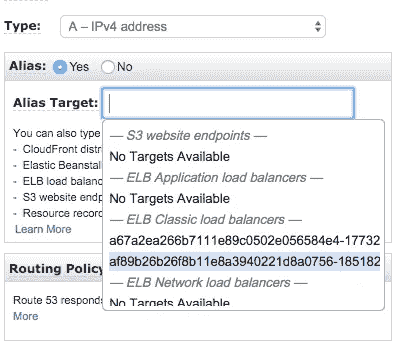

# nginx 的 Kubernetes 基本配置-入口+证书管理器+舵/舵杆

> 原文：<https://itnext.io/kubernetes-base-config-for-nginx-ingress-cert-manager-helm-tiller-edf5645e04ef?source=collection_archive---------0----------------------->


我们最近更新了我们的 kubernetes 集群，以便从 kube-lego 进行迁移(因为它现在已经过时了)，并在我们的服务中引入了基于角色的访问控制(RBAC)。

以下文章概述了如何使用 Helm/Tiller 安装 cert manager 和 nginx-ingress。我们使用 Git 存储库来存储我们所有的配置 YAML，所以如果您习惯于通过 CLI 进行部署，您仍然可以从这些 YAML 文件中获得您需要的详细信息。

# 与 RBAC 一起设置舵/舵

Helm 本质上是 kubernetes 的一个包管理器，Tiller 是其对应的服务器端部件。您在本地安装 Helm，并在您当前的 kubectl 环境中初始化它，它将在您的集群上安装 tiller。

从[在你的电脑上安装头盔](https://docs.helm.sh/using_helm/)开始:

```
# Mac
brew install kubernetes-helm# From Scripts
$ curl https://raw.githubusercontent.com/kubernetes/helm/master/scripts/get > get_helm.sh
$ chmod 700 get_helm.sh
$ ./get_helm.sh
```

在初始化 Helm 之前，请确保为 Tiller 设置了 RBAC 角色。下面是您可以使用的服务帐户配置。

我们将 Tiller 服务帐户配置设置为一个 ClusterRole，因为我们没有运行一个大规模的集群，也不太关心证书管理的特定于名称空间的权限。如果您需要这种粒度级别，还可以使用角色绑定并指定一个名称空间。

将此文件应用于:

```
kubectl apply -f ./tiller.serviceaccount.rbac.ymal
```

有了 Tiller 在集群上的权限，我们可以在本地初始化 Helm。如果您像我们一样管理多个上下文，请确保您位于想要安装 Tiller 的上下文上:

```
kubectl config current-context
```

如果你在正确的上下文中，用蒂勒的 RBAC 初始化赫尔姆:

```
helm init --service-account tiller
```

一旦得到确认，就大功告成了。检查您的 pod 以确认:

```
kubectl get pods --all-namespaces
>> kube-system tiller-deploy-75f5797b-rfcwr 1/1  Running 0 1m
```

# 设置证书管理器

证书管理器允许 kubernetes 为您的各种服务提供 TLS 证书。你可以在证书管理器 GitHub 页面上找到一些非常有用的[入门](https://github.com/jetstack/cert-manager/tree/master/docs/getting-started)指南。

为了节省时间，需要确定的一件事是，您是要使用名称空间颁发者还是集群颁发者。同样，我们没有大规模的集群，因此使用集群发行者意味着只需配置一个发行者来为我们所有的服务发行证书。你可以在[证书管理人员参考文件](https://github.com/jetstack/cert-manager/blob/master/docs/reference/issuers.rst)中了解不同之处。

下面是我们的集群发行者配置:

相应地设置您的私钥 ref 你需要在下一个头盔命令中使用这个名字。

有了这两个部分，您可以使用 Helm 进行 cert manager 的一个命令安装:

```
helm install \
--name cert-manager \
--namespace kube-system \
stable/cert-manager \
--set ingressShim.defaultIssuerName=letsencrypt-prod \
--set ingressShim.defaultIssuerKind=ClusterIssuer
```

如果您已经安装了 cert manager，并且只需要添加上述两个配置，您可以运行以下命令:

```
helm upgrade cert-manager \
stable/cert-manager \
--namespace kube-system \
--set ingressShim.defaultIssuerName=letsencrypt-prod \
--set ingressShim.defaultIssuerKind=ClusterIssuer
```

如果你从 kube-lego 升级，这两行是关键:

```
--set ingressShim.defaultIssuerName=letsencrypt-prod \
--set ingressShim.defaultIssuerKind=ClusterIssuer
```

它们允许您在入口中使用与 kube-lego 请求 TLS 相同的注释——这就是这里的这些行(您也可以在入口配置的末尾看到它们):

```
kubernetes.io/tls-acme: 'true'
nginx.ingress.kubernetes.io/tls-acme: 'true'
```

使用以下命令检查所有正在运行的程序:

```
kubectl get pods --all-namespace
```

希望你能在这里看到这个:

```
kube-system cert-manager-cert-manager-bcb987f-2ggf2 1/1 Running 0 1m
```

# 使用赫尔姆和 RBAC 设置 nginx-ingress

nginx-ingress 控制器的伟大之处在于，您需要配置的所有文件都可以在他们的 [Git repo here](https://github.com/kubernetes/ingress-nginx/tree/master/deploy) 中找到。但是我们使用的是 Helm，所以让我们接受黑盒的黑暗，只运行以下命令:

```
helm install stable/nginx-ingress --name nginx-ingress --set rbac.create=true
```

就这样…其实…今天就到此为止吧…到此为止。您可能希望添加的唯一内容是一些自定义 nginx 设置的 configmap.yml:

在您可以访问您的服务之前，请确保将您的主 DNS 端点指向您闪亮的新 nginx 负载平衡器。

在 route 53 中，选择您的名称记录，并为 kubernetes 刚刚启动的 ELB 负载平衡器设置一个别名:



# 设置服务和部署

你可以阅读我们在[这里](https://medium.com/@logojoyapp/the-worlds-longest-wordpress-deployment-5eda086bbc62)做的示例 WordPress 部署来查看这些配置的例子。你需要做的就是建立一个入口，运行 SSL。呜！