# 基于 Kubernetes 的 Istio 服务网格的微服务可观测性:第 2 部分

> 原文：<https://itnext.io/kubernetes-based-microservice-observability-with-istio-service-mesh-part-2-f25c4b474a65?source=collection_archive---------2----------------------->

## 使用 Jaeger、Prometheus、Grafana 和 Kiali 在 Google Cloud 的 GKE 和 Istio 服务网格上观察分布式系统

在这篇由两部分组成的文章中，我们将探索 Istio Service Mesh 最新版本中的一组可观察性工具。这些工具包括用于度量收集、监控和警报的[普罗米修斯](https://prometheus.io/)和[格拉法纳](https://grafana.com/)，用于分布式跟踪的[耶格](https://www.jaegertracing.io/)，以及用于基于 Istio 服务网格的微服务可视化的 [Kiali](https://www.kiali.io/) 。结合云平台-原生监控和日志服务，如谷歌云平台(GCP)上的[谷歌 Kubernetes 引擎](https://cloud.google.com/kubernetes-engine/) (GKE)的 [Stackdriver](https://cloud.google.com/monitoring/) ，我们有一个完整的现代分布式应用的可观测性解决方案。

# 参考平台

为了展示 Istio 的可观察性工具，在帖子的第一部分中，我们在 GCP 的 GKE 部署了一个用 Go 编写的参考微服务平台。该平台由(14)个组件组成，包括(8) [基于 Go 的](https://golang.org/)微服务，一般标记为服务 A 到服务 H，(1) Angular 7，[基于类型脚本的](https://en.wikipedia.org/wiki/TypeScript)前端，(4) MongoDB 数据库，以及(1)用于基于事件队列的通信的 RabbitMQ 队列。


参考平台旨在生成基于 HTTP 的服务到服务、基于 TCP 的服务到数据库(MongoDB)和基于 TCP 的服务到队列到服务(RabbitMQ) IPC(进程间通信)。服务 A 调用服务 B 和服务 C，服务 B 调用服务 D 和服务 E，服务 D 在 RabbitMQ 队列上产生一条消息，由服务 F 消费并写入 MongoDB，以此类推。目标是当系统部署到 Kubernetes 时，使用 Istio 的可观察性工具观察这些分布式通信。

# 支柱 1:伐木

如果您还记得，日志、度量和跟踪通常被称为可观察性的三大支柱。由于我们在 GCP 使用 GKE，我们将查看谷歌的 [Stackdriver 日志](https://cloud.google.com/monitoring/)。根据谷歌的说法，Stackdriver Logging 允许你存储、搜索、分析、监控和警告来自 GCP 甚至 AWS 的日志数据和事件。尽管 Stackdriver 日志记录不是一个 Istio 可观察性特性，但日志记录是整个可观察性策略的一个重要支柱。

## 基于 Go 的微服务日志记录

有效的日志记录策略始于您记录什么、何时记录以及如何记录。作为我们日志策略的一部分，八个基于 Go 的微服务正在使用 [Logrus](https://github.com/sirupsen/logrus) ，一个流行的 Go 结构化日志程序。微服务还实现了 Banzai Cloud 的 [logrus-runtime-formatter](https://github.com/sirupsen/logrus) 。有一篇关于格式化程序的优秀文章， [Golang 运行时 Logrus 格式化程序](https://banzaicloud.com/blog/runtime-logging/)。这两个日志包让我们能够更好地控制我们记录的内容、记录的时间以及记录微服务信息的方式。软件包的推荐配置是最低限度的。

```
**func** init() {
   formatter := runtime.Formatter{ChildFormatter: &log.JSONFormatter{}}
   formatter.Line = ***true*** log.SetFormatter(&formatter)
   log.SetOutput(os.Stdout)
   level, err := log.ParseLevel(getEnv(**"LOG_LEVEL"**, **"info"**))
   **if** err != nil {
      log.Error(err)
   }
   log.SetLevel(level)
}
```

与 Go 的简单日志包 [log](https://golang.org/pkg/log/) 相比，Logrus 提供了几个优势。日志条目不仅用于致命错误，也不应该在生产环境中输出所有详细日志条目。邮报的微服务利用了 Logrus 的七级日志功能:跟踪、调试、信息、警告、错误、致命和恐慌。我们还改变了日志级别，允许在部署时在 Kubernetes 部署资源中轻松地更改它。

微服务还利用了 Banzai Cloud 的[logrus-runtime-formatter](https://github.com/sirupsen/logrus)。Banzai 格式化程序自动用运行时/堆栈信息标记日志消息，包括函数名和行号；排除故障时非常有用。我们也在使用 Logrus 的 JSON 格式化程序。注意下面的每个日志条目是如何在消息中包含 JSON 有效负载的。

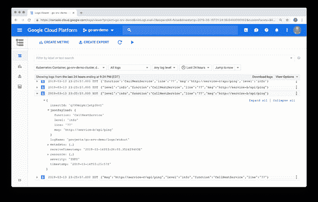

## 客户端角度 UI 日志记录

同样，我们使用 [NGX Logger](https://www.npmjs.com/package/ngx-logger) 增强了 Angular UI 的日志记录。NGX Logger 是一个流行的，简单的日志模块，目前用于 Angular 6 和 7。它允许“漂亮地打印”到控制台，并允许将日志消息发送到服务器端日志记录的 URL。对于本演示，我们将只打印到控制台。与 Logrus 类似，NGX Logger 支持多个日志级别:跟踪、调试、信息、警告、错误、致命和关闭。NGX Logger 不仅仅输出消息，还允许我们将格式正确的日志条目输出到 web 浏览器的控制台。

日志输出的级别取决于环境、生产或非生产。下面我们看到本地开发环境中日志条目的组合，包括调试、信息和错误。

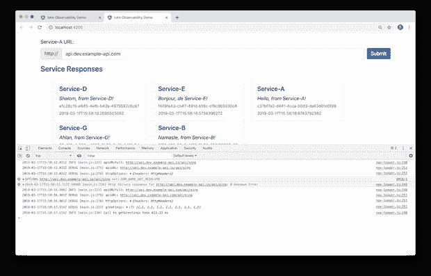

同样在下面，我们在 GKE 的生产环境中看到了相同的页面。请注意，在不更改配置的情况下，没有调试级别的日志条目输出到控制台。我们不希望在详细的日志输出中向生产中的最终用户公开潜在的敏感信息。

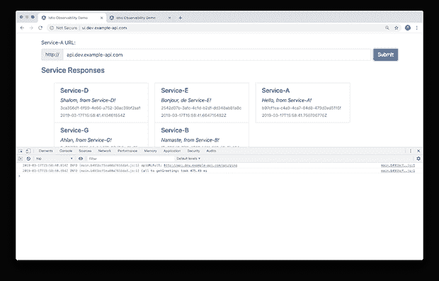

通过向 app.module.ts 文件添加以下三元运算符，可以控制日志记录级别。

```
LoggerModule.*forRoot*({
  level: !environment.production ? NgxLoggerLevel.*DEBUG* : NgxLoggerLevel.*INFO*,
  serverLogLevel: NgxLoggerLevel.*INFO* })
```

# 支柱 2:衡量标准

对于指标，我们将在[普罗米修斯](https://prometheus.io/)和[格拉夫纳](https://grafana.com/)进行检查。这两个领先的工具都是作为 Istio 部署的一部分安装的。

## 普罗米修斯

Prometheus 是一个完全开源的社区驱动的系统监控和警报工具包，最初建于 SoundCloud，大约在 2012 年。有趣的是，普罗米修斯在 2016 年加入了[云原生计算基金会](https://cncf.io/) (CNCF)，作为继 [Kubernetes](http://kubernetes.io/) 之后的第二个托管项目。

根据 [Istio](https://istio.io/docs/tasks/telemetry/querying-metrics/) 的说法，Istio 的混音器带有一个内置的 Prometheus 适配器，该适配器公开了一个提供生成的度量值的端点。Prometheus 附加组件是一个 Prometheus 服务器，它预先配置为收集 Mixer 端点以收集公开的指标。它提供了持久存储和查询 Istio 指标的机制。

随着 GKE 集群的运行、Istio 的安装和平台的部署，访问 Grafana 最简单的方法是使用`kubectl port-forward`连接到 Prometheus 服务器。根据 Google 的说法，Kubernetes [端口转发](https://kubernetes.io/docs/tasks/access-application-cluster/port-forward-access-application-cluster/)允许使用一个资源名，比如一个服务名，来选择一个匹配的 pod 进行端口转发，从 Kubernetes v1.10 开始。我们将一个本地端口转发到 Prometheus pod 上的一个端口。

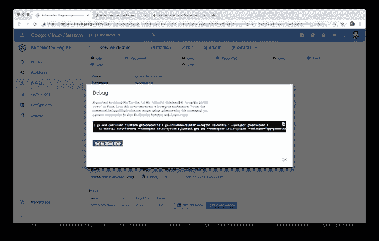

您可以使用 Google Cloud Shell 进行连接，或者将该命令复制并粘贴到您的本地 Shell，以便从本地端口进行连接。下面是这篇文章中使用的端口转发命令。

```
# Grafana
kubectl port-forward -n istio-system \
  $(kubectl get pod -n istio-system -l app=grafana \
  -o jsonpath='{.items[0].metadata.name}') 3000:3000 &

# Prometheus
kubectl -n istio-system port-forward \
  $(kubectl -n istio-system get pod -l app=prometheus \
  -o jsonpath='{.items[0].metadata.name}') 9090:9090 &

# Jaeger
kubectl port-forward -n istio-system \
$(kubectl get pod -n istio-system -l app=jaeger \
-o jsonpath='{.items[0].metadata.name}') 16686:16686 &

# Kiali
kubectl -n istio-system port-forward \
  $(kubectl -n istio-system get pod -l app=kiali \
  -o jsonpath='{.items[0].metadata.name}') 20001:20001 &
```

根据[普罗米修斯](https://prometheus.io/docs/prometheus/latest/querying/basics/)的说法，用户使用一种叫做 [PromQL](https://prometheus.io/docs/prometheus/latest/querying/basics/) (普罗米修斯查询语言)的函数式查询语言实时选择和聚合时间序列数据。表达式的结果既可以显示为图形，在 Prometheus 的表达式浏览器中以表格数据的形式查看，也可以由外部系统通过 Prometheus 的 [HTTP API](https://prometheus.io/docs/prometheus/latest/querying/api/) 使用。表达式浏览器包括一个下拉菜单，其中包含所有可用的指标作为构建查询的起点。下面是这篇文章中用到的几个 PromQL 例子。

```
up{namespace="dev",pod_name=~"service-.*"}container_memory_max_usage_bytes{namespace="dev",container_name=~"service-.*"}
container_memory_max_usage_bytes{namespace="dev",container_name="service-f"}
container_network_transmit_packets_total{namespace="dev",pod_name=~"service-e-.*"}istio_requests_total{destination_service_namespace="dev",connection_security_policy="mutual_tls",destination_app="service-a"}
istio_response_bytes_count{destination_service_namespace="dev",connection_security_policy="mutual_tls",source_app="service-a"}
```

下面，在 Prometheus 控制台中，我们看到了部署到 GKE 的八个基于 Go 的微服务的示例图。该图显示了五分钟内容器内存的使用情况。在一半的时间内，服务都处于静止状态。在后半段时间，服务处于模拟负载下，使用`hey`。查看负载下服务的内存配置文件可以帮助我们确定容器内存的最小值和极限值，这会影响 Kubernetes 在 GKE 集群上的工作负载调度。诸如此类的指标也可能揭示内存泄漏或路由问题，例如下面的服务，它似乎比它的同类多消耗 25-50%的内存。

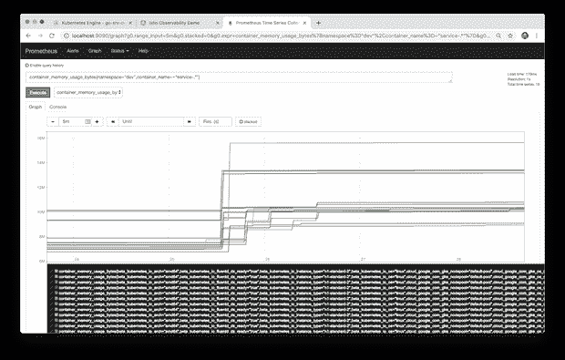

在下面的另一个例子中，我们看到一个图表，表示在系统处于负载状态时，对`dev`名称空间中的服务 A 的总 Istio 请求。

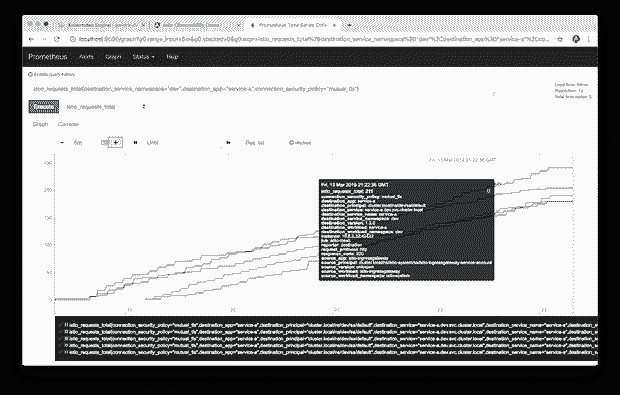

将上面的图表视图与控制台视图中显示的相同指标进行比较。多个条目反映了在五分钟内被检查的名称空间中服务 A 的多个实例。各个指标元素中的值表示收集的最新指标。

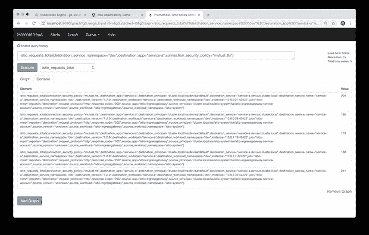

Prometheus 还收集关于 Istio 组件、Kubernetes 组件和 GKE 集群的基本指标。下面我们可以查看 GKE 集群中每个 n1-standard-2 虚拟机节点的总内存。

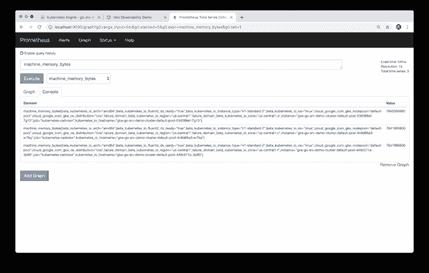

## 格拉夫纳

Grafana 称自己是领先的时间序列分析开源软件。据 [Grafana Labs，](https://grafana.com/grafana) Grafana 允许您查询、可视化、提醒和了解您的指标，无论它们存储在哪里。您可以轻松创建、浏览和共享视觉效果丰富的数据驱动仪表板。Grafana 还允许用户为他们最重要的指标可视化地定义警报规则。Grafana 将不断评估规则，并可以发送通知。

根据 [Istio](https://istio.io/docs/tasks/telemetry/using-istio-dashboard/#about-the-grafana-add-on) 的说法，Grafana 附加组件是 Grafana 的预配置实例。Grafana Docker 基本映像已经过修改，可以在安装了 Prometheus 数据源和 Istio 仪表板的情况下启动。特别是 Istio 和 Mixer 的基本安装文件附带了全局(用于每个服务)指标的默认配置。预配置的 Istio 仪表板旨在与默认的 Istio 指标配置和 Prometheus 后端结合使用。

下面，我们看到了预配置的 Istio 工作负载控制面板。较大仪表板的这个特定部分已经过过滤，以显示我们的 GKE 集群的`dev`名称空间中的出站服务指标。

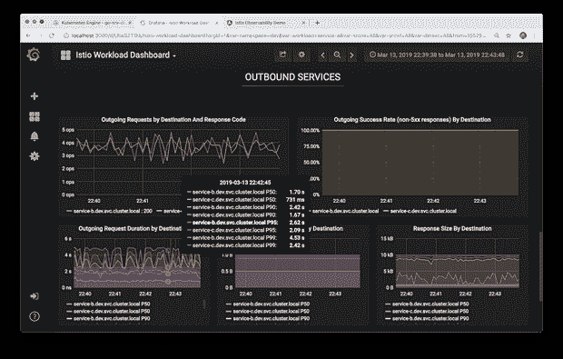

同样，在下面，我们可以看到预配置的 Istio 服务仪表板。较大仪表板的这一特定部分经过过滤，以显示 GKE 集群中 Istio 入口网关的客户端工作负载指标。

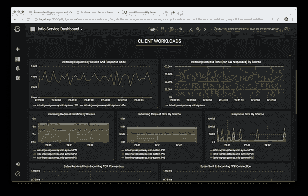

最后，我们看到预配置的 Istio Mesh 仪表盘。该仪表板经过过滤，以显示部署到我们的 GKE 集群的组件的度量表视图。

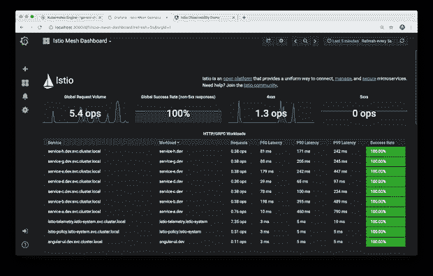

有效的可观察性策略必须不仅仅包括可视化结果的能力。有效的策略还必须包括检测异常并通知(警告)适当的资源或直接采取措施解决事故的能力。格拉夫纳和普罗米修斯一样，能够发出警报和通知。您可以直观地定义关键指标的警报规则。Grafana 将根据规则持续评估指标，并在违反预定义阈值时发送通知。

Prometheus 支持多种流行的[通知渠道](http://docs.grafana.org/alerting/notifications/#all-supported-notifier)，包括 PagerDuty、HipChat、Email、Kafka 和 Slack。下面，我们看到一个新的 Prometheus 通知通道，它向 Slack 支持通道发送警报通知。

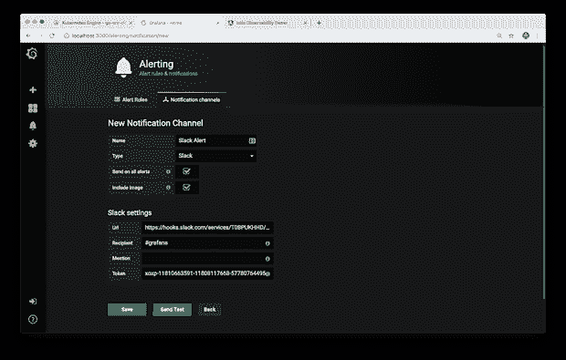

Prometheus 能够发送详细的基于文本和视觉的通知。

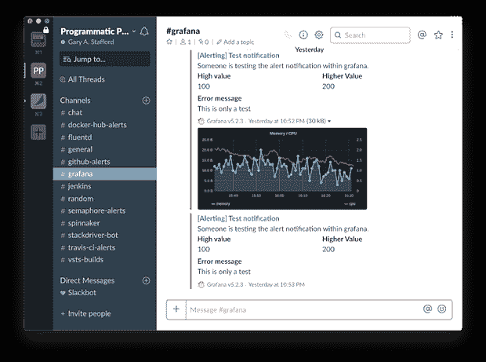

# 支柱 3:痕迹

据[开放跟踪网站](https://opentracing.io/docs/overview/what-is-tracing/)报道，分布式跟踪(distributed tracing)，也称为分布式请求跟踪(distributed request tracing)，是一种用于分析和监控应用程序的方法，尤其是那些使用微服务架构构建的应用程序。分布式跟踪有助于查明故障发生的位置以及导致低性能的原因。

根据 [Istio](https://istio.io/docs/tasks/telemetry/distributed-tracing/#understanding-what-happened) 的说法，尽管 Istio 代理能够自动发送 span，但应用程序需要传播适当的 HTTP 头，以便当代理发送 span 信息时，span 可以正确地关联到单个跟踪中。为了实现这一点，应用程序需要从传入请求到任何传出请求收集并传播以下标头。

*   `x-request-id`
*   `x-b3-traceid`
*   `x-b3-spanid`
*   `x-b3-parentspanid`
*   `x-b3-sampled`
*   `x-b3-flags`
*   `x-ot-span-context`

标题起源于 Zipkin 项目的一部分。标头的 B3 部分以 Zipkin 的原始名称 BigBrotherBird 命名。跨服务调用传递这些头被称为 [B3 传播](https://github.com/openzipkin/b3-propagation)。根据 [Zipkin](https://github.com/openzipkin/b3-propagation#b3-propagation) 的说法，这些属性在进程内传播，并最终传播到下游(通常通过 HTTP 头)，以确保源自同一根的所有活动都被收集在一起。

为了用 Jaeger 演示分布式跟踪，我修改了服务 A、服务 B 和服务 e。这是向其他上游服务发出 HTTP 请求的三个服务。我添加了以下代码，以便将消息头从一个服务传播到下一个服务。Istio sidecar 代理([特使](https://www.envoyproxy.io/))生成第一个[报头](https://www.envoyproxy.io/docs/envoy/latest/configuration/http_conn_man/headers#x-request-id)。像下面的代码一样，只传播下游请求中出现的有值的头，这一点很重要。传播空标头会破坏分布式跟踪。

```
headers := []string{
  "x-request-id",
  "x-b3-traceid",
  "x-b3-spanid",
  "x-b3-parentspanid",
  "x-b3-sampled",
  "x-b3-flags",
  "x-ot-span-context",
}for _, header := range headers {
  if r.Header.Get(header) != "" {
    req.Header.Add(header, r.Header.Get(header))
  }
}
```

下面，在突出显示的 Stackdriver 日志条目的 JSON 有效负载中，我们看到从根 span 传播的所需头，它包含一个值，在上游请求中从服务 A 传递到服务 C。

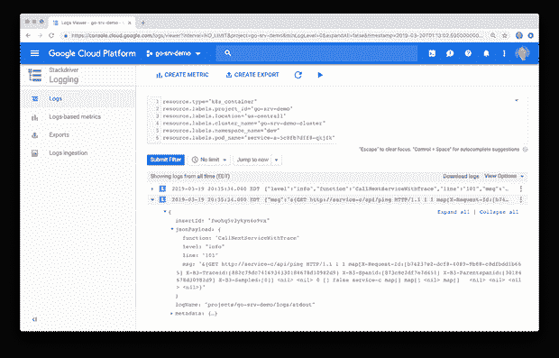

## 贼鸥

根据他们的网站介绍， [Jaeger](https://www.jaegertracing.io/docs/1.10/) 受 [Dapper](https://research.google.com/pubs/pub36356.html) 和 [OpenZipkin](http://zipkin.io/) 的启发，是一个由[优步科技](http://uber.github.io/)开源发布的分布式追踪系统。它用于对基于微服务的分布式系统进行监控和故障排除，包括分布式上下文传播、分布式事务监控、根本原因分析、服务依赖性分析以及性能和延迟优化。Jaeger [网站](https://www.jaegertracing.io/docs/1.10/architecture/)包含了 Jaeger 架构和一般追踪相关术语的良好概述。

下面我们看到了积家界面的痕迹视图。UI 显示了在大约 40 分钟的时间段内对 Istio 入口网关服务的搜索结果。我们在顶部看到跟踪时间线，下面是跟踪结果列表。正如在 Jaeger [网站](https://www.jaegertracing.io/docs/1.10/architecture/)上讨论的那样，一条轨迹由跨度组成。span 表示 Jaeger 中具有操作名称的逻辑工作单元。踪迹是通过系统的执行路径，并且可以被认为是[有向无环图](https://en.wikipedia.org/wiki/Directed_acyclic_graph) (DAG)的[跨度](https://www.jaegertracing.io/docs/1.10/architecture#span)。如果您曾经使用过像 Apache Spark 这样的系统，那么您可能已经熟悉 Dag 了。

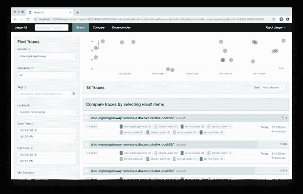

下面我们看到的是 Jaeger UI 跟踪细节视图。示例跟踪包含 16 个跨度，包含八个服务——八个基于 Go 的服务中的七个和 Istio 入口网关。轨迹和跨度都有计时。跟踪中的根跨度是 Istio 入口网关。加载在最终用户的 web 浏览器中的 Angular UI 通过 Istio 入口网关调用网格的边缘服务，即服务 A。从那里，我们看到了我们的服务到服务 IPC 的预期流程。服务 A 调用服务 B 和 c。服务 B 调用服务 E，服务 E 调用服务 G 和服务 h。在本演示中，跟踪不会跨越 RabbitMQ 消息队列。这意味着您不会看到包含从服务 D 通过 RabbitMQ 到服务 F 的调用的跟踪。

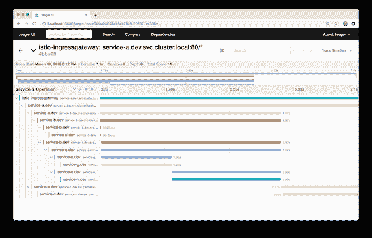

在 Jaeger UI Trace Detail 视图中，您还可以钻取包含附加元数据的单个范围。元数据包括被调用的 URL、HTTP 方法、响应状态和其他一些头。

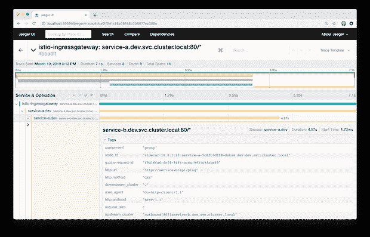

Jaeger 的最新版本还包括一个比较功能和两个依赖关系视图，力定向图和 DAG。我发现与 Kiali 相比，这两种视图都相当原始，更类似于服务图。缺少对 Kiali 的访问，这些视图作为依赖图没有多大用处。

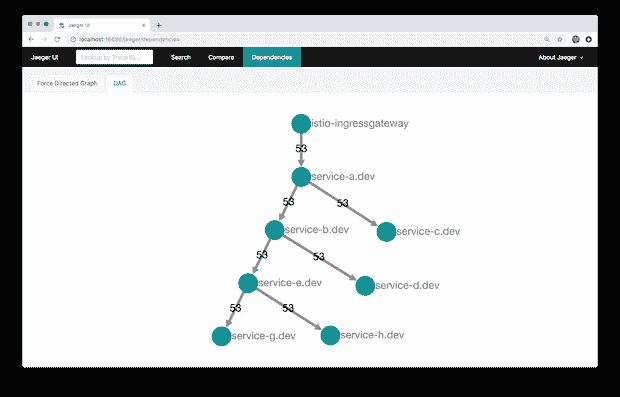

# Kiali:微服务可观察性

根据他们的[网站](https://www.kiali.io/documentation/overview/)，Kiali 提供了以下问题的答案:我的 Istio 服务网格中有哪些微服务，它们是如何连接的？有一个公共的 Kubernetes [秘密](https://istio.io/docs/tasks/telemetry/kiali/#before-you-begin)控制着对 Kiali API 和 UI 的访问。默认登录名为`admin`，密码为`1f2d1e2e67df`。

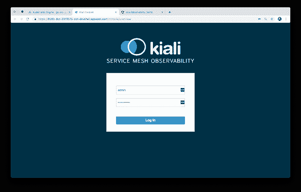

登录 Kiali，我们会看到 Overview 菜单项，它提供了 Istio 服务网格中所有名称空间的全局视图，以及每个名称空间中的应用程序数量。

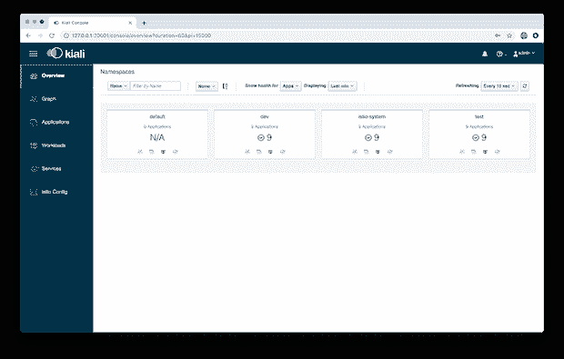

Kiali UI 中的图形视图是在 Istio 服务网格中运行的组件的可视化表示。下面，过滤集群的`dev`名称空间，我们可以观察到 Kiali 映射了 8 个应用程序(工作负载)、10 个服务和 24 条边(一个图形术语)。具体来说，我们看到位于服务网格边缘的 Istio Ingres 代理、Angular UI、八个基于 Go 的微服务以及它们的特使代理边站(在本例中，服务 F 没有从另一个服务获取任何直接流量)、外部 MongoDB Atlas 集群和外部 CloudAMQP 集群。请注意，使用 Istio，服务到服务的流量是如何从服务到其 sidecar 代理，再到另一个服务的 sidecar 代理，最后到服务的。


下面，我们看到了一个类似的服务网格视图，但是这一次，Istio 入口网关和服务 A 之间出现了故障，以红色显示。我们还可以观察 HTTP 流量的整体指标，比如每分钟的请求总数、错误和状态代码。

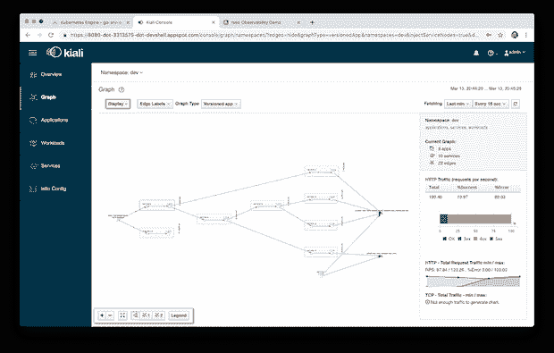

Kiali 还可以显示图中每条边(两个组件之间的通信)的平均请求时间和其他指标。

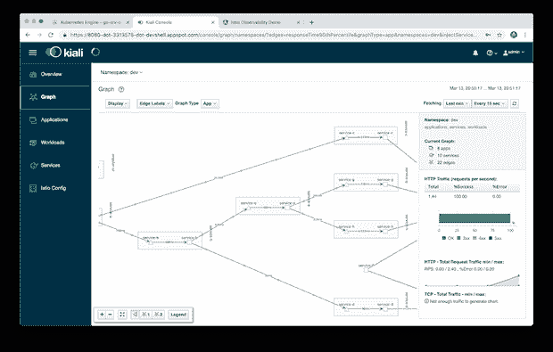

Kiali 还可以显示部署的应用版本，如下图，微服务是 1.3 和 1.4 版本的组合。

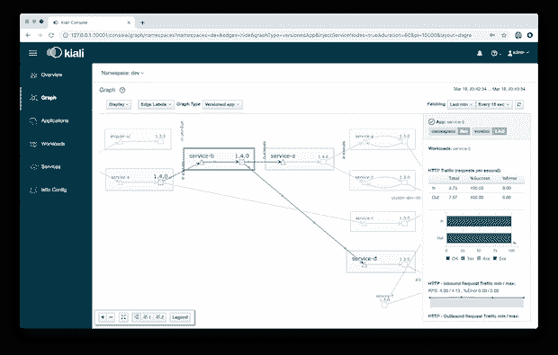

关注外部 MongoDB Atlas 集群，Kiali 还允许我们查看服务网格内的四个服务和外部集群之间的 TCP 流量。

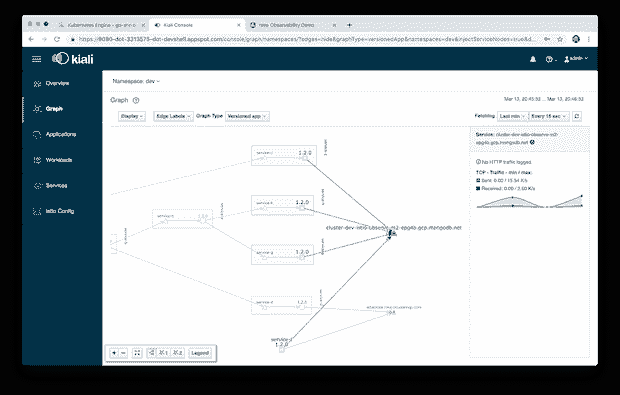

“应用程序”菜单项列出了所有应用程序及其错误率，可以按名称空间和时间间隔进行过滤。在这里，我们看到 Angular UI 产生了 16.67%的错误。

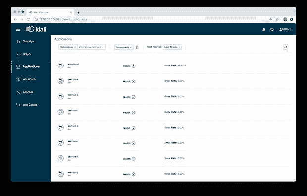

在“Applications”和“Workloads”菜单项上，我们可以深入到一个组件以查看更多详细信息，包括整体运行状况、pod 数量、服务和目标服务。下面，我们看到了服务 B 在`dev`名称空间中的细节。

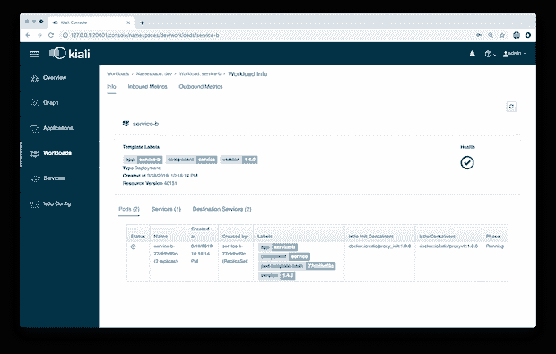

工作负载详细视图还包括入站和出站指标。下面是`dev`名称空间中服务 A 的出站容量、持续时间和大小指标。

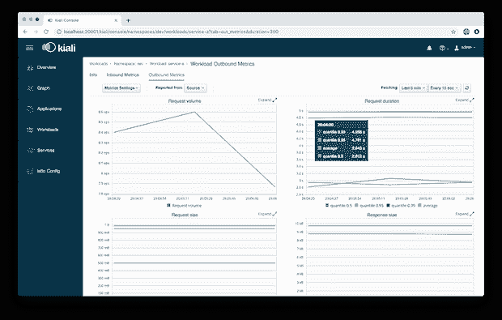

最后，Kiali 显示了一个 Istio 配置菜单项。Istio 配置菜单项显示用户环境中存在的所有可用 Istio 配置对象的列表。

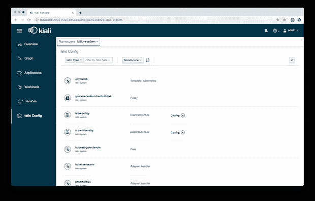

我经常发现 Kiali 是我解决平台问题的第一站。一旦我确定了有问题的特定组件或通信路径，我就可以通过 Grafana 仪表板搜索 Stackdriver 日志和 Prometheus 指标。

# 结论

在这篇由两部分组成的文章中，我们探索了当前的一组可观察性工具，它们是最新版本的 Istio 服务网格的一部分。这些工具包括用于指标收集、监控和警报的 Prometheus 和 Grafana，用于分布式跟踪的 Jaeger，以及用于基于 Istio 服务网格的微服务可视化的 Kiali。结合云平台原生监控和日志记录服务，如谷歌云平台(GCP)上的谷歌 Kubernetes 引擎(GKE)的 Stackdriver，我们有一个完整的现代分布式应用的可观测性解决方案。

*本文表达的所有观点都是我个人的，不一定代表我现在或过去的雇主或他们的客户的观点。*