# 基于 Kubernetes 的 Istio 服务网格的微服务可观测性:第 2 部分，共 2 部分

> 原文：<https://itnext.io/kubernetes-based-microservice-observability-with-istio-service-mesh-part-2-of-2-ceec27575040?source=collection_archive---------2----------------------->

## 通过 Istio 服务网格在亚马逊 EKS 上使用 Jaeger、Prometheus、Grafana、Kiali 和 Fluent Bit 观察分布式系统

在这篇由两部分组成的文章的第二部分中，我们将继续探索与 Istio 服务网格轻松集成的一组流行的开源可观察性工具。虽然这些工具不是 Istio 的一部分，但它们对于充分利用 Istio 的可观察性特性是必不可少的。这些工具包括用于分布式事务监控的 **Jaeger** 和 **Zipkin** ，用于指标收集和警报的 **Prometheus** ，用于指标查询、可视化和警报的 **Grafana** ，以及用于 Istio 整体可观察性和管理的 **Kiali** 。我们将通过添加用于日志处理和聚合的 **Fluent Bit** 来完善工具集。我们将使用这些工具来观察部署到**亚马逊弹性 Kubernetes 服务(亚马逊 EKS)** 集群的分布式、基于微服务的参考应用平台。该平台运行在 EKS 上，将使用亚马逊文档数据库作为持久数据存储，并使用亚马逊 MQ 来交换信息。

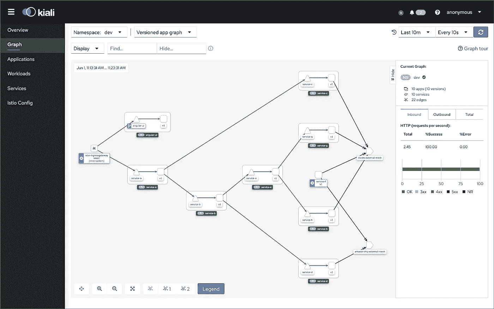

显示参考应用平台的 Kiali 管理控制台

# 可观察性

辛迪·斯里德哈兰所著的《分布式系统可观测性》一书在第四章中描述了可观测性的三大支柱。虽然简单地访问日志、度量和跟踪并不一定使系统更容易被观察到，但是这些是强大的工具，如果理解得好，可以释放构建更好的系统的能力。”

# 参考应用平台

为了展示 Istio 的可观察性工具，我们在 AWS 上为 EKS 部署了一个参考应用平台。我开发了应用程序平台来演示不同的 Kubernetes 平台，如 EKS、GKE、AKS，以及服务网格、API 管理、可观察性、DevOps 和混沌工程等概念。该平台包括一个后端，包含八个基于 Go 的微服务，一般标记为服务 A-服务 H，一个基于 Angular 12 TypeScript 的前端 UI，四个 MongoDB 数据库和一个 RabbitMQ 消息队列。

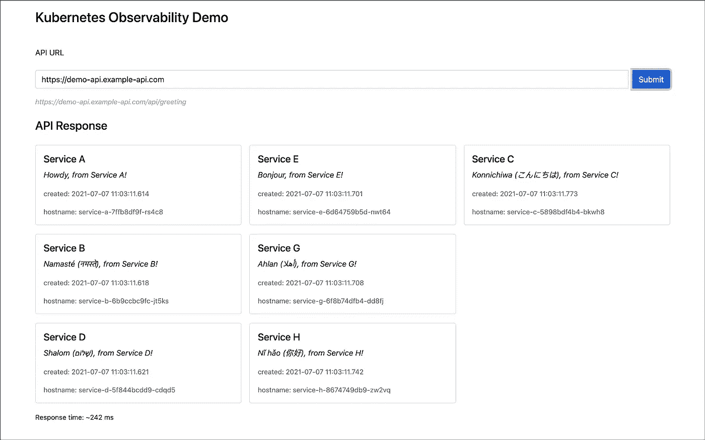

参考应用平台的基于角度的用户界面

该平台及其所有源代码都在 GitHub 上开源。

[](https://github.com/garystafford/k8s-istio-observe-backend) [## garystafter/k8s-istio-observe-back end

### 两篇博文的源代码，基于 Kubernetes 的带有 Istio 服务网格的微服务可观察性。请参见…

github.com](https://github.com/garystafford/k8s-istio-observe-backend) 

参考应用程序平台旨在生成基于 HTTP 的服务到服务、基于 TCP 的服务到数据库和基于 TCP 的服务到队列到服务 IPC(进程间通信)。比如服务 A 调用服务 B 和服务 C；服务 B 调用服务 D 和服务 E；服务 D 向 RabbitMQ 队列发送消息，服务 F 在 RabbitMQ 队列上使用消息，并写入 MongoDB，依此类推。当系统部署到运行 Istio 服务网格的 Kubernetes 集群时，可以使用 Istio 的可观察性工具观察平台的分布式服务通信。

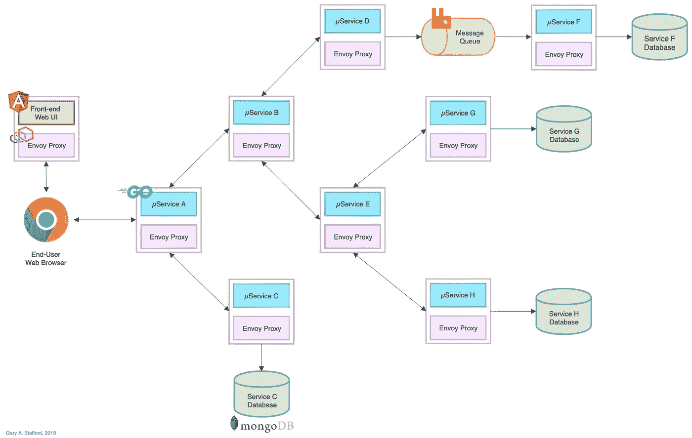

参考应用平台的高层架构

# 第二部分

在文章的第一部分，我们在 AWS 上的亚马逊 EKS 开发级集群上配置和部署了参考应用平台。运行在 EKS 上的参考应用程序与两个外部系统通信， [Amazon DocumentDB](https://aws.amazon.com/documentdb/) ( *兼容 MongoDB】)和 [Amazon MQ](https://aws.amazon.com/amazon-mq/) 。*

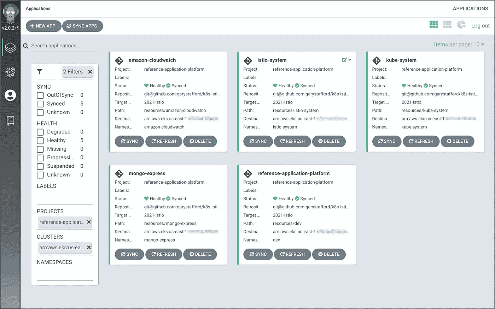

从 [Argo CD](https://argoproj.github.io/argo-cd/) 中可以看到部署的参考应用平台

在这篇文章的第二部分，我们将更详细地探讨我们安装的每个可观察性工具。我们将理解每个工具如何对可观察性的三个支柱做出贡献:日志、度量和跟踪。

> 日志、度量和跟踪通常被称为可观察性的三大支柱。
> —辛迪·斯里达哈兰

# 支柱一:原木

借用 Jay Kreps 在 LinkedIn 工程博客[上的话来说，日志是一个按时间排序的只追加的、完全有序的记录序列。记录的排序定义了“时间”的概念，因为左边的条目被定义为比右边的条目更老。日志是过去发生的事件的历史记录。日志几乎和计算机一样历史悠久，是许多分布式数据系统和实时应用程序架构的核心。](https://engineering.linkedin.com/distributed-systems/log-what-every-software-engineer-should-know-about-real-time-datas-unifying)

## 基于 Go 的微服务日志记录

有效的日志记录策略始于您记录什么、何时记录以及如何记录。作为平台日志策略的一部分，八个基于 Go 的微服务使用了 [Logrus](https://github.com/sirupsen/logrus) ，这是一个流行的 Go 结构化日志程序，于 2014 年首次发布。该平台的服务还实现了万岁云的[日志运行时格式器](https://github.com/banzaicloud/logrus-runtime-formatter)。这两个日志包让我们能够更好地控制您记录的内容、记录的时间以及记录服务信息的方式。封装的[推荐配置](https://github.com/banzaicloud/logrus-runtime-formatter#usage)最小。我选择了 Logrus' `JSONFormatter`,以便于第三方系统进行解析，并将额外的上下文数据字段注入到日志条目中。

```
func init() {
 formatter := runtime.Formatter{ChildFormatter: &log.JSONFormatter{}}
 formatter.Line = true
 log.SetFormatter(&formatter)
 log.SetOutput(os.Stdout)
 level, err := log.ParseLevel(logLevel)
 if err != nil {
  log.Error(err)
 }
 log.SetLevel(level)
}
```

与 Go 的简单日志包 [log](https://golang.org/pkg/log/) 相比，Logrus 提供了几个优势。例如，日志条目不仅用于致命错误，也不应该在生产环境中输出所有详细日志条目。Logrus 能够记录七个级别的日志:跟踪、调试、信息、警告、错误、致命和紧急。平台微服务的日志级别可以在运行时使用环境变量进行更改。

Banzai Cloud 的[logrus-runtime-formatter](https://github.com/banzaicloud/logrus-runtime-formatter)自动用运行时和堆栈信息标记日志消息，包括函数名和行号——在故障排除时非常有用。在 Banzai Cloud(现在是 Cisco 的一部分)格式化程序上有一个很好的帖子，[Golang runtime Logrus Formatter](https://banzaicloud.com/blog/runtime-logging/)。

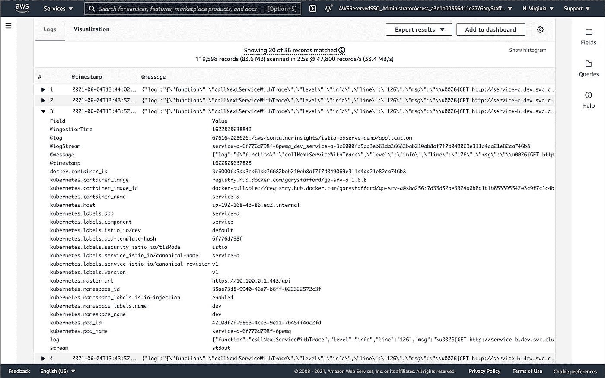

CloudWatch Insights 中的服务 A 日志条目

2020 年， [Logus](https://github.com/sirupsen/logrus) 进入维护模式。作者 Simon Eskildsen(Shopify 的首席工程师)表示，他们不会推出新功能。这并不意味着 Logrus 已经死了。Logrus 拥有超过 18，000 颗 GitHub 星，将继续维护其安全性、错误修复和性能。作者表示，现在存在许多替代 Logus 的奇妙选择，如 [Zerolog](https://github.com/rs/zerolog) 、 [Zap](https://github.com/uber-go/zap) 和 [Apex](https://github.com/apex/log) 。

## 客户端角度 UI 日志记录

同样，我使用 [NGX 记录器](https://www.npmjs.com/package/ngx-logger)增强了 Angular UI 的日志记录。NGX Logger 是 angular 的一个简单的日志模块(*目前支持 Angular 6+* )。它允许“漂亮地打印”到控制台，并允许将日志消息发布到服务器端日志记录的 URL。对于本演示，UI 将只记录到 web 浏览器的控制台。与 Logrus 类似，NGX Logger 支持多个日志级别:跟踪、调试、信息、警告、错误、致命和关闭。然而，NGX Logger 不仅仅输出消息，还允许我们将格式正确的日志条目输出到浏览器的控制台。

日志输出的级别配置为取决于环境、生产或非生产。下面是 Chrome 中 Angular UI 的日志输出示例。因为 UI 的 Docker 映像是用生产配置构建的，所以日志级别被设置为`INFO`。您不希望将详细日志输出中的潜在敏感信息暴露给生产中的最终用户。

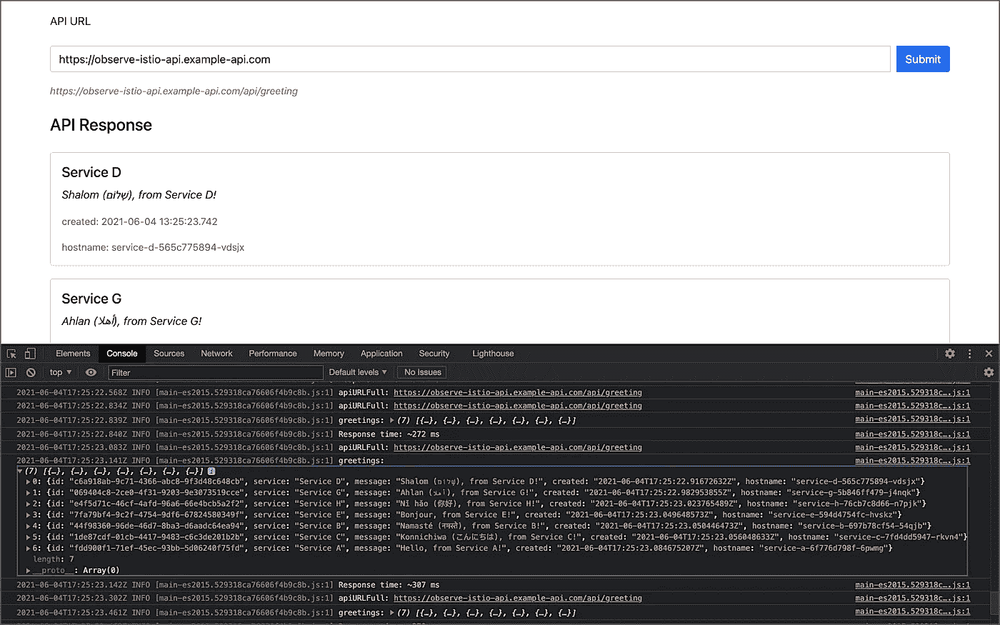

通过向`app.module.ts`文件添加以下三元运算符来控制日志记录级别。

```
imports: [
    BrowserModule,
    HttpClientModule,
    FormsModule,
 **LoggerModule.forRoot({
      level: !environment.production ?
        NgxLoggerLevel.DEBUG : NgxLoggerLevel.INFO,
      serverLogLevel: NgxLoggerLevel.INFO
    })**  ],
```

## 平台日志

基于在[第一部分](/kubernetes-based-microservice-observability-with-istio-service-mesh-part-1-of-2-19084d13a866)中构建、配置和部署的平台，您现在可以从多个来源访问日志。

1.  Amazon document db:Amazon cloud watch 审计和 Profiler 日志；
2.  亚马逊 MQ:亚马逊 CloudWatch 日志；
3.  亚马逊 EKS: API 服务器、审计、认证器、控制器管理器、调度器 CloudWatch 日志；
4.  Kubernetes 仪表板:个人 EKS Pod 和副本集日志；
5.  Kiali:单个 EKS 豆荚和集装箱原木；
6.  流畅位:EKS 性能、主机、数据面板、应用 CloudWatch 日志；

## 流畅位

根据 AWS 最近的一篇博客文章，[Fluent Bit Integration in CloudWatch Container Insights for EKS](https://aws.amazon.com/blogs/containers/fluent-bit-integration-in-cloudwatch-container-insights-for-eks/)， [Fluent Bit](https://fluentbit.io/) 是一个开源的多平台日志处理器和转发器，允许您从不同的来源收集数据和日志，并将其统一发送到不同的目的地，包括 cloud watch 日志。Fluent Bit 还完全兼容 Docker 和 Kubernetes 环境。使用新推出的 Fluent Bit `DaemonSet`，您可以将容器日志从您的 EKS 集群发送到 CloudWatch logs 进行日志存储和分析。

借助部署在[第一部分](/kubernetes-based-microservice-observability-with-istio-service-mesh-part-1-of-2-19084d13a866)中的 Fluent Bit，EKS 集群的性能、主机、数据面板和应用程序日志也将在 Amazon CloudWatch 中提供。

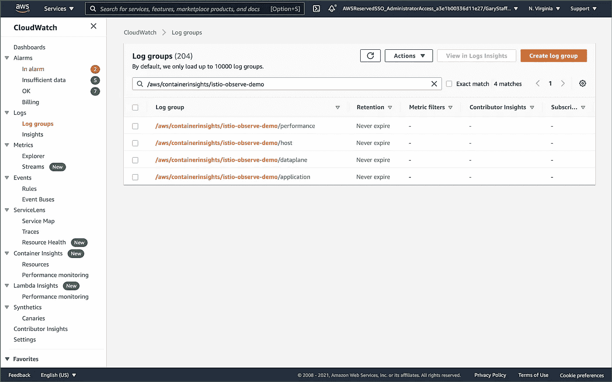

在应用程序日志组中，您可以访问每个参考应用程序组件的单独日志流。

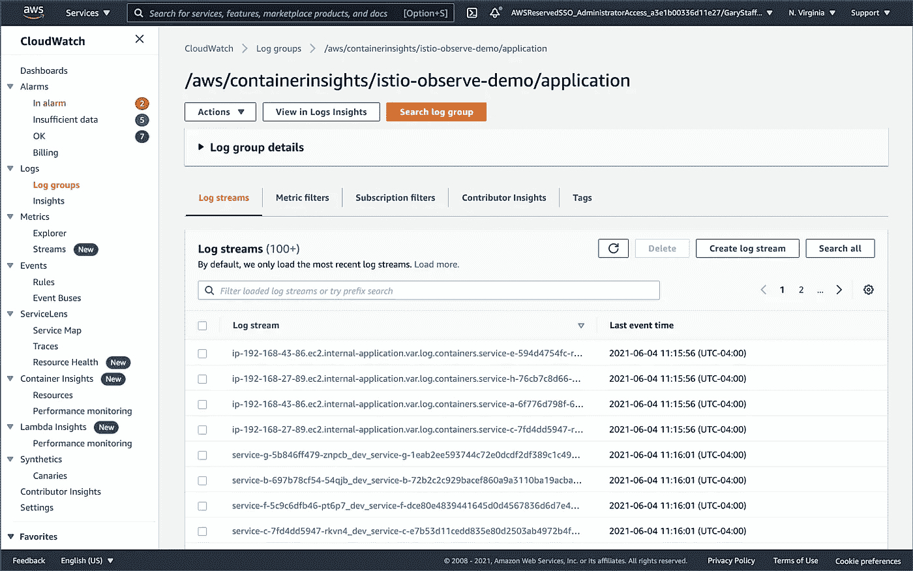

在每个 CloudWatch 日志流中，您可以查看单个日志条目。


[CloudWatch Logs Insights](https://docs.aws.amazon.com/AmazonCloudWatch/latest/logs/AnalyzingLogData.html) 让你能够在亚马逊 CloudWatch Logs 中交互式搜索和分析你的日志数据。您可以执行查询来帮助您更高效地响应操作问题。如果出现问题，您可以使用 CloudWatch Logs Insights 来确定潜在的原因并验证部署的修复。

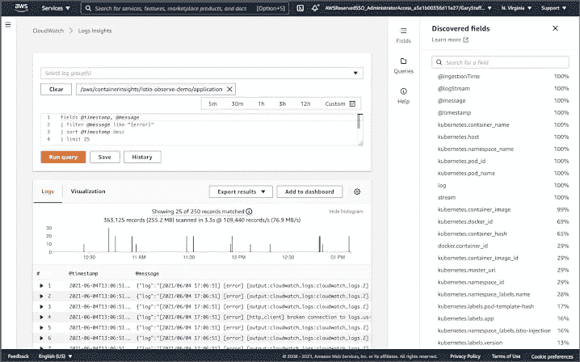

CloudWatch Logs Insights 支持 [CloudWatch Logs Insights 查询语法](https://docs.aws.amazon.com/AmazonCloudWatch/latest/logs/CWL_QuerySyntax.html)，这是一种可以用来对日志组执行查询的查询语言。每个查询可以包含一个或多个查询命令，用 Unix 样式的管道字符(|)分隔。例如:

```
fields [@timestamp](http://twitter.com/timestamp), [@message](http://twitter.com/message)
| filter kubernetes.container_name = "service-f" 
  and [@message](http://twitter.com/message) like "error"
| sort [@timestamp](http://twitter.com/timestamp) desc
| limit 20
```

# 支柱二:衡量标准

对于指标，我们将检查 [CloudWatch 容器洞察](https://docs.aws.amazon.com/AmazonCloudWatch/latest/monitoring/ContainerInsights.html)、 [Prometheus](https://prometheus.io/) 和 [Grafana](https://grafana.com/) 。Prometheus 和 Grafana 是您作为 Istio 部署的一部分安装的业界领先的工具。

# 普罗米修斯

[Prometheus](https://github.com/prometheus) 是一个开源系统监控和警报工具包，最初是在大约 2012 年 [SoundCloud](https://soundcloud.com/) 开发的。普罗米修斯于 2016 年加入[云原生计算基金会](https://cncf.io/) (CNCF)，作为继 [Kubernetes](https://kubernetes.io/) 之后主持的第二个项目。

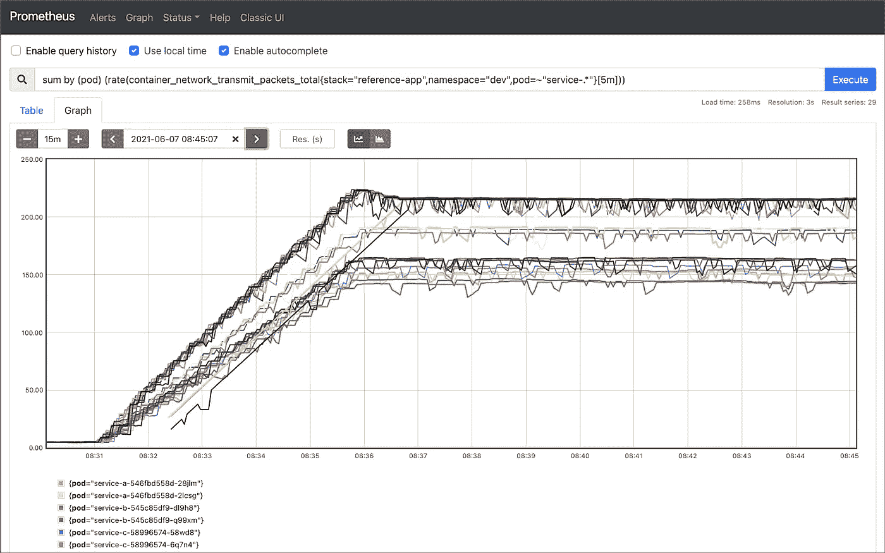

根据 [Istio](https://istio.io/latest/docs/ops/integrations/prometheus/) 的说法，Prometheus 插件是一个 Prometheus 服务器，预配置为收集 Istio 端点来收集指标。您可以将 Prometheus 与 Istio 一起使用，来记录跟踪 Istio 和服务网格中的应用程序的健康状况的指标。您可以使用像 [Grafana](https://istio.io/latest/docs/ops/integrations/grafana/) 和 [Kiali](https://istio.io/latest/docs/tasks/observability/kiali/) 这样的工具来可视化指标。Istio Prometheus 插件仅用于演示，并未针对性能或安全性进行调整。

`[istioctl dashboard](https://istio.io/latest/docs/reference/commands/istioctl/#istioctl-dashboard)`命令提供了对所有 Istio web 用户界面的访问。运行 EKS 集群，安装 Istio，部署参考应用平台，从终端使用`[istioctl dashboard prometheus](https://istio.io/latest/docs/reference/commands/istioctl/#istioctl-dashboard-prometheus)`命令访问 Prometheus。您必须从终端登录 AWS 才能成功连接到 Prometheus。如果你没有登录 AWS，你会经常看到以下错误:`Error: not able to locate <tool_name> pod: Unauthorized`。由于我们使用的是 Istio 插件的非生产演示版本，因此访问 Prometheus 不需要认证和授权。

根据 [Prometheus](https://prometheus.io/docs/prometheus/latest/querying/basics/) 的说法，用户使用名为 [PromQL](https://prometheus.io/docs/prometheus/latest/querying/basics/) (Prometheus 查询语言)的函数式查询语言实时选择和汇总时间序列数据。表达式的结果既可以显示为图形，在 Prometheus 的表达式浏览器中以表格数据的形式查看，也可以由外部系统通过 Prometheus 的 [HTTP API](https://prometheus.io/docs/prometheus/latest/querying/api/) 使用。表达式浏览器包括一个下拉菜单，其中包含所有可用的指标作为构建查询的起点。下面是一些 PromQL 的例子，它们是在撰写本文时开发的。

```
istio_agent_go_info{kubernetes_namespace="dev"}istio_build{kubernetes_namespace="dev"}up{alpha_eksctl_io_cluster_name="istio-observe-demo", job="kubernetes-nodes"}sum by (pod) (rate(container_network_transmit_packets_total{stack="reference-app",namespace="dev",pod=~"service-.*"}[5m]))sum by (instance) (istio_requests_total{source_app="istio-ingressgateway",connection_security_policy="mutual_tls",response_code="200"})sum by (response_code) (istio_requests_total{source_app="istio-ingressgateway",connection_security_policy="mutual_tls",response_code!~"200|0"})
```

## 普罗米修斯蜜蜂

Prometheus 既有一个 [HTTP API](https://prometheus.io/docs/prometheus/latest/querying/api/#http-api) 又有一个[管理 API](https://prometheus.io/docs/prometheus/latest/management_api/) 。除了 Prometheus UI 之外，还有许多有用的端点，可在`[http://localhost:9090/graph](http://localhost:9090/graph)`获得。例如，列出所有命令行配置标志的 Prometheus HTTP API 端点在`[http://localhost:9090/api/v1/status/flags](http://localhost:9090/api/v1/status/flags)`可用。列出所有可用普罗米修斯指标的端点可在`[http://localhost:9090/api/v1/label/__name__/values](http://localhost:9090/api/v1/label/__name__/values)`获得；本演示中共有 951 项指标！


在`[http://localhost:9090/metrics](http://localhost:9090/metrics)`可以找到 Prometheus 端点，它列出了许多可用的指标，用`HELP`和`TYPE`来解释它们的功能。

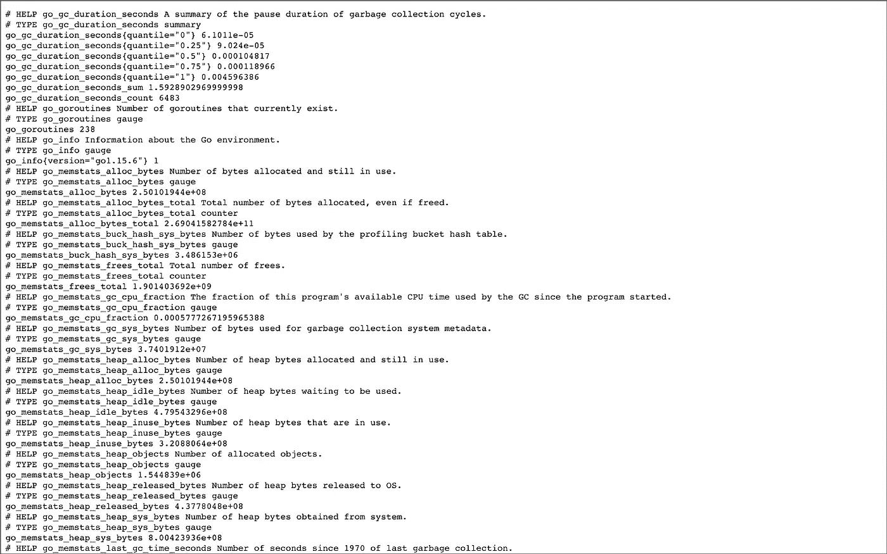

## 了解指标

除了这些端点，Istio 导出并通过 Prometheus 提供的标准服务水平指标可在 [Istio 标准指标](https://istio.io/latest/docs/reference/config/metrics/#metrics)文档中找到。在他们的 GitHub 网站上的 cAdvisor [README](https://github.com/google/cadvisor/blob/master/docs/storage/prometheus.md#prometheus-container-metrics) 中也可以找到 Prometheus 中许多可用指标的解释。正如在这篇 [AWS 博客文章](https://aws.amazon.com/blogs/containers/monitoring-amazon-eks-on-aws-fargate-using-prometheus-and-grafana/)中提到的，cAdvisor 指标也可以通过命令行使用以下命令获得:

```
export NODE=$(kubectl get nodes | sed -n '2 p' | awk {'print $1'})kubectl get --raw "/api/v1/nodes/${NODE}/proxy/metrics/cadvisor"
```

## 观察指标

下面是部署到 EKS 的后端微服务容器的示例图。graph PromQL 表达式返回工作集内存量，包括最近访问的内存、脏内存和内核内存(`container_memory_working_set_bytes`)，按 pod 求和，以兆字节(MB)为单位。在显示的时间段内，服务上没有负载。

```
sum by (pod) (container_memory_working_set_bytes{image=~"registry.hub.docker.com/garystafford/.*"}) / (1024^2)
```

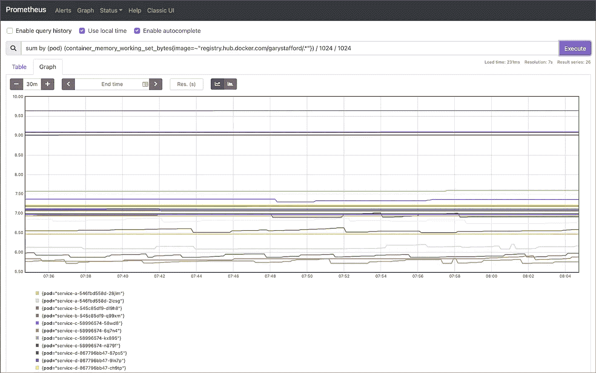

`container_memory_working_set_bytes`度量与`kubectl top`命令使用的度量相同(不是`container_memory_usage_bytes`)。

```
> kubectl top pod -n dev --containers=true --use-protocol-bufferPOD                          NAME          CPU(cores)   MEMORY(bytes)
service-a-546fbd558d-28jlm   service-a     1m           6Mi
service-a-546fbd558d-2lcsg   service-a     1m           6Mi
service-b-545c85df9-dl9h8    service-b     1m           6Mi
service-b-545c85df9-q99xm    service-b     1m           5Mi
service-c-58996574-58wd8     service-c     1m           7Mi
service-c-58996574-6q7n4     service-c     1m           7Mi
service-d-867796bb47-87ps5   service-d     1m           6Mi
service-d-867796bb47-fh6wl   service-d     1m           6Mi
...
```

在另一个 Prometheus 示例中，PromQL 查询表达式返回以 [CPU 单位](https://kubernetes.io/docs/tasks/configure-pod-container/assign-cpu-resource/#cpu-units) (1 个 CPU = 1 个 AWS vCPU)度量的 CPU 资源的每秒[速率，该速率是在过去 5 分钟内根据范围向量中的时间序列由 pod 求和得到的。在此期间，后端服务处于使用`hey`的 25 个并发用户的一致模拟负载下。在此期间，四个服务 D 单元消耗了最多的 CPU 单元。](https://prometheus.io/docs/prometheus/latest/querying/functions/#rate)

```
sum by (pod) (rate(container_cpu_usage_seconds_total{image=~"registry.hub.docker.com/garystafford/.*"}[5m])) * 1000
```

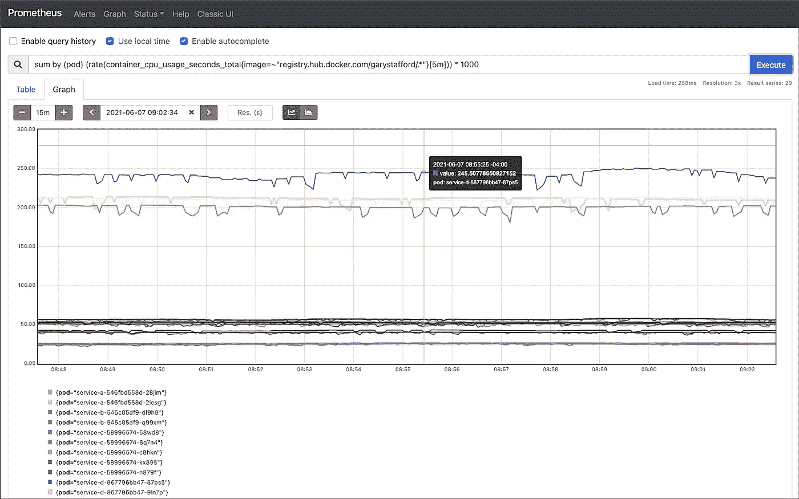

`container_cpu_usage_seconds_total`度量与`kubectl top`命令使用的度量相同。上面的 PromQL 表达式将查询结果乘以 1000，以匹配来自`kubectl top`的结果，如下所示。

```
> kubectl top pod -n dev --containers=true --use-protocol-bufferPOD                          NAME          CPU(cores)   MEMORY(bytes)
service-a-546fbd558d-28jlm   service-a     25m          9Mi
service-a-546fbd558d-2lcsg   service-a     27m          8Mi
service-b-545c85df9-dl9h8    service-b     29m          11Mi
service-b-545c85df9-q99xm    service-b     23m          8Mi
service-c-58996574-c8hkn     service-c     62m          9Mi
service-c-58996574-kx895     service-c     55m          8Mi
service-d-867796bb47-87ps5   service-d     285m         12Mi
service-d-867796bb47-9ln7p   service-d     226m         11Mi
...
```

## 限制

普罗米修斯也暴露了容器资源的限制。例如，在参考平台的后端服务上设置的内存限制，使用`container_spec_memory_limit_bytes`指标以兆字节(MB)为单位显示。当与服务消耗的实时资源一起查看时，这些指标有助于正确配置和监控 Kubernetes 管理功能，如[水平 Pod 自动缩放器](https://kubernetes.io/docs/tasks/run-application/horizontal-pod-autoscale/)。

```
sum by (container) (container_spec_memory_limit_bytes{image=~"registry.hub.docker.com/garystafford/.*"}) / (1024^2) / count by (container) (container_spec_memory_limit_bytes{image=~"registry.hub.docker.com/garystafford/.*"})
```

或者，Pod 的内存限制:

```
sum by (pod) (container_spec_memory_limit_bytes{image=~"registry.hub.docker.com/garystafford/.*"}) / (1024^2)
```

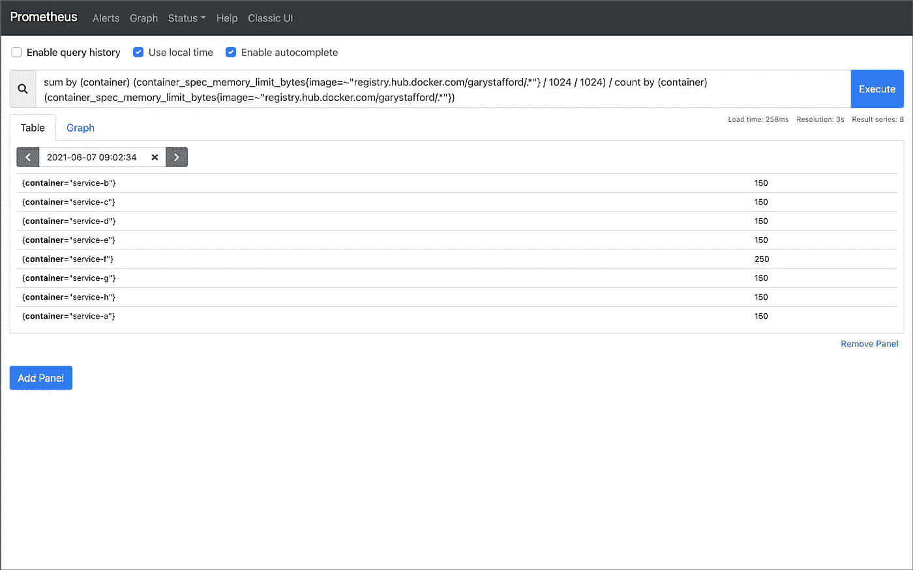

## 聚类指标

Prometheus 还包含关于 Istio 组件、Kubernetes 组件和 EKS 集群的指标。例如，`istio-observe-demo` EKS 集群的`managed-ng-1`受管节点组中每个`m5.large` EC2 工作节点的总内存(GB)。

```
machine_memory_bytes{alpha_eksctl_io_cluster_name="istio-observe-demo", alpha_eksctl_io_nodegroup_name="managed-ng-1"} / (1024^3)
```

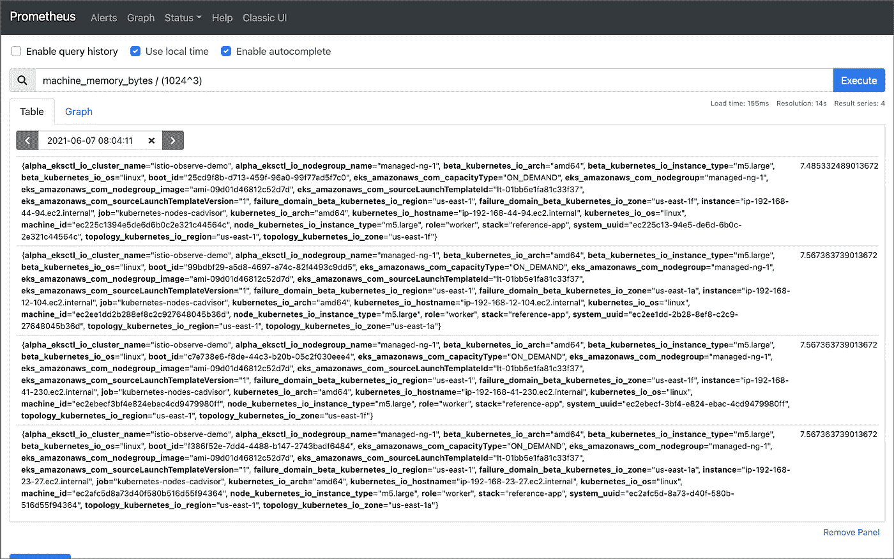

对于物理核心总数，使用`machine_cpu_physical_core`指标，对于 vCPU 核心，使用`machine_cpu_cores`指标。

# 格拉夫纳

Grafana 称自己是领先的时间序列分析开源软件。根据 [Grafana Labs 的说法，](https://grafana.com/grafana) Grafana 允许您查询、可视化、提醒和了解您的指标，无论它们存储在哪里。您可以轻松创建、浏览和共享视觉效果丰富的数据驱动仪表板。Grafana 还允许用户可视化地为他们最重要的指标定义警报规则。Grafana 将不断评估规则，并可以发送通知。

如果你使用帖子的[第一部分](/kubernetes-based-microservice-observability-with-istio-service-mesh-part-1-of-2-19084d13a866)中演示的 Istio addons 过程部署 Grafana，访问 Grafana 类似于其他工具:

```
istioctl dashboard grafana
```

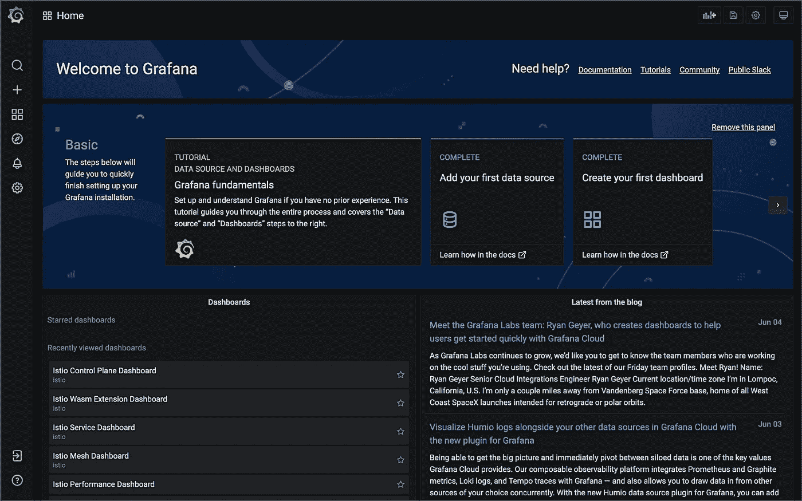

据[消息，Istio](https://istio.io/docs/tasks/telemetry/using-istio-dashboard/#about-the-grafana-add-on) ， [Grafana](https://grafana.com/) 是一款开源监控解决方案，用于为 Istio 配置仪表盘。您可以使用 Grafana 来监控服务网格中 Istio 和应用程序的健康状况。虽然您可以构建自己的仪表板，但 Istio 为网格和控制平面的所有最重要指标提供了一组预配置的仪表板。预配置的仪表板使用 Prometheus 作为数据源。

*   [Mesh Dashboard](https://grafana.com/grafana/dashboards/7639) 提供了 Mesh 中所有服务的概述。
*   [Service Dashboard](https://grafana.com/grafana/dashboards/7636) 提供了服务指标的详细分解。
*   [工作负载仪表板](https://grafana.com/grafana/dashboards/7630)提供工作负载指标的详细细分。
*   [性能仪表板](https://grafana.com/grafana/dashboards/11829)监控网格的资源使用情况。
*   [控制面板仪表板](https://grafana.com/grafana/dashboards/7645)监控控制面板的健康和性能。

下面是一个 Istio [网格仪表板](https://grafana.com/grafana/dashboards/7639)的例子，过滤后显示了在`dev`名称空间中运行的八个后端服务工作负载。在此期间，后端服务处于使用`hey`的大约 20 个并发用户的一致模拟负载下。您可以观察这些工作负载的请求的 p50、p90 和 p99 延迟。


仪表板由 Grafana 中的基本可视化构建模块[面板](https://grafana.com/docs/grafana/latest/panels/)构建而成。每个面板都有一个特定于所选数据源(在本例中为 Prometheus)的查询编辑器。查询编辑器允许您编写(PromQL)查询。下面是负责 Istio Mesh 仪表板中显示的 p50 延迟面板的 PromQL 表达式查询。

```
 label_join((histogram_quantile(0.50, sum(rate(istio_request_duration_milliseconds_bucket{reporter="source"}[1m])) by (le, destination_workload, destination_workload_namespace)) / 1000) or histogram_quantile(0.50, sum(rate(istio_request_duration_seconds_bucket{reporter="source"}[1m])) by (le, destination_workload, destination_workload_namespace)), "destination_workload_var", ".", "destination_workload", "destination_workload_namespace")
```

下面是 Istio [工作负载仪表板](https://grafana.com/grafana/dashboards/7630)的出站工作负载部分的示例。完整的控制面板包含三个部分:常规、入站工作负载和出站工作负载。在这里，我们已经在`dev`名称空间中过滤了 on reference 平台的后端服务。

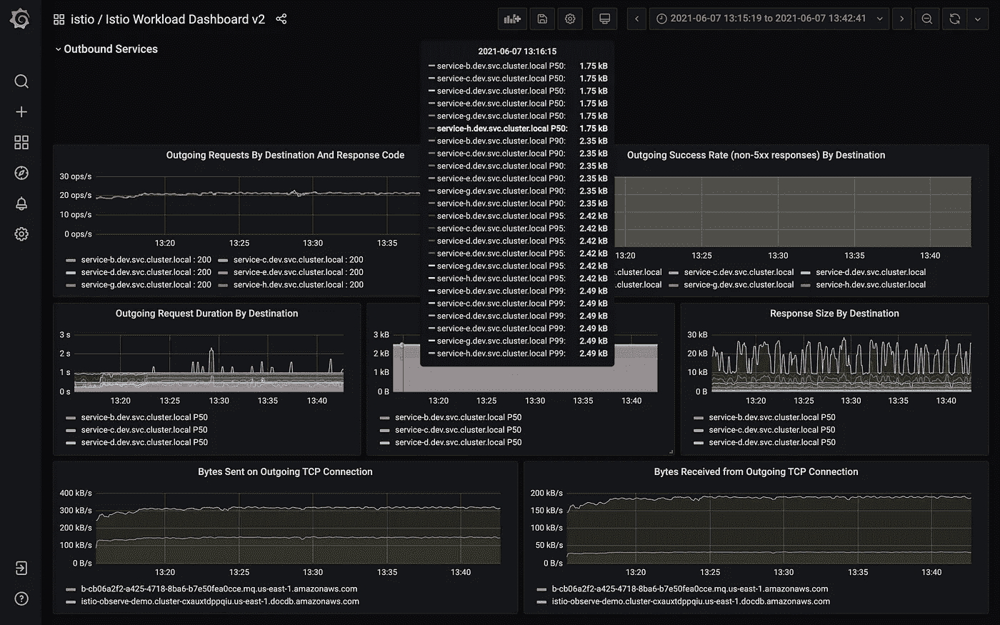

这是 Istio [工作负载仪表板](https://grafana.com/grafana/dashboards/7630)的不同视图，仪表板的入站工作负载部分过滤为单个工作负载，服务 A，后端的边缘服务。服务 A 接受来自 Istio 入口网关的传入流量，如仪表板面板所示。

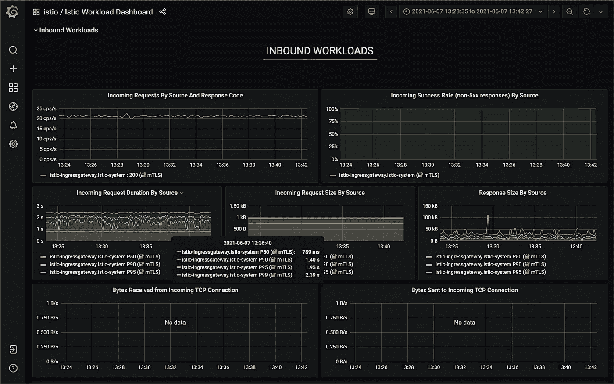

Grafana 提供了浏览面板的能力。[浏览](https://grafana.com/docs/grafana/latest/explore/)去掉仪表板和面板选项，以便您可以专注于查询。它帮助您迭代，直到您有一个工作查询，然后考虑建立一个仪表板。下面是一个面板示例，显示了基于`istio_tcp_sent_bytes_total`指标的服务 F 的出口 TCP 流量。服务 F 消耗 RabbitMQ 队列(Amazon MQ)上的消息，并将消息写入 MongoDB (DocumentDB)。

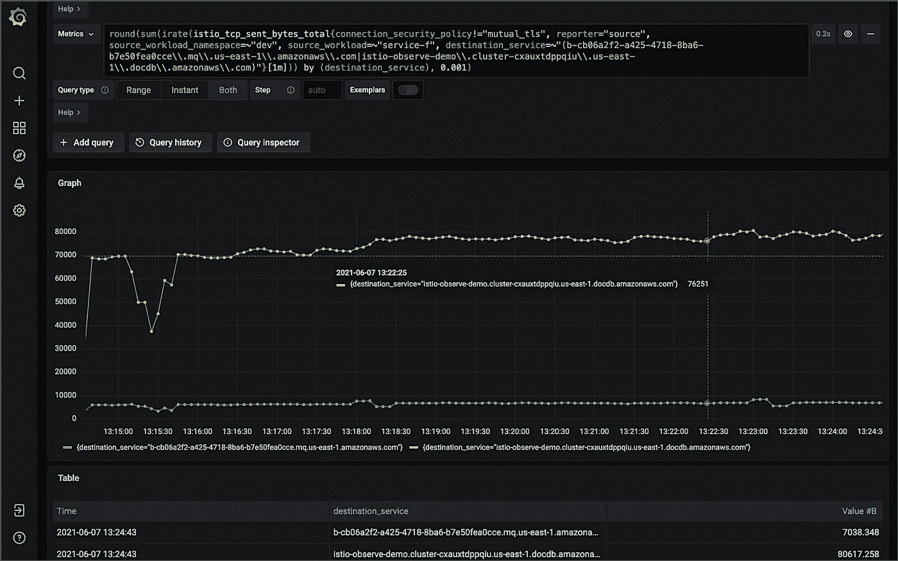

您可以使用[性能仪表板](https://grafana.com/grafana/dashboards/11829)监控 Istio 的资源使用情况。

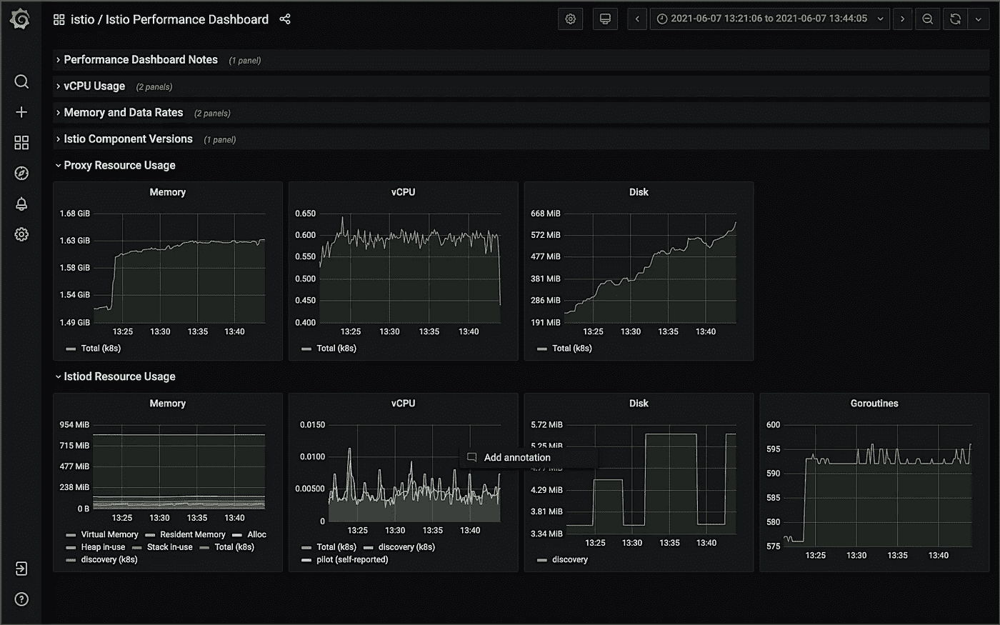

## 附加仪表板

Grafana 提供了一个包含官方和社区构建的仪表板的网站，其中包括上述 Istio 仪表板。将仪表板导入 Grafana 实例非常简单，只需复制仪表板 URL 或 Grafana 仪表板站点提供的 ID，并将其粘贴到 Grafana 实例的仪表板导入选项中。请注意，并不是 Grafan 网站上的每个 Kubernetes 仪表板都与您的特定版本的 Kubernetes、Istio 或 EKS 兼容，也不依赖 Prometheus 作为数据源。因此，您可能必须测试和调整导入的仪表板，以使它们工作。

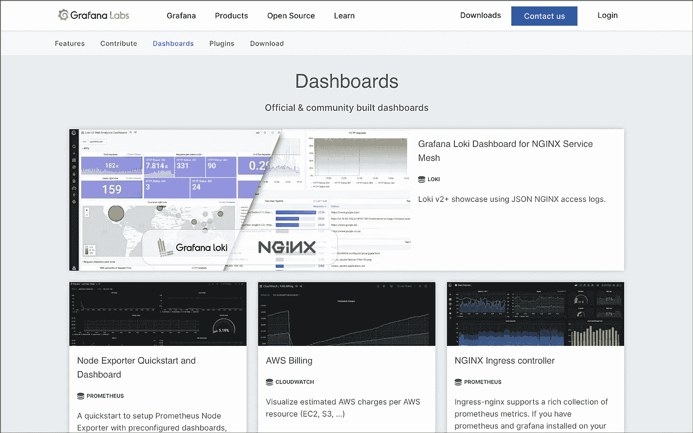

下面是一个由的[instruments 团队开发的](https://grafana.com/orgs/instrumentisto)[Kubernetes cluster monitoring(via Prometheus)](https://grafana.com/grafana/dashboards/315)(仪表板 ID 315)的导入社区仪表板示例。

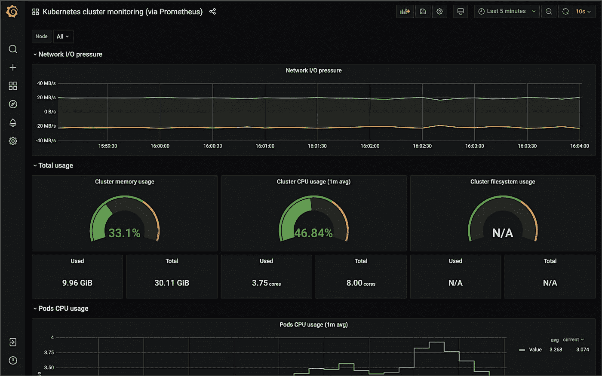

## 发信号

有效的可观察性策略必须不仅仅包括可视化结果的能力。有效的策略还必须检测异常情况，并通知(提醒)适当的资源或直接解决事故。格拉夫纳和普罗米修斯一样，能够发出警报和通知。您可以直观地定义关键指标的警报规则。Grafana 将根据规则持续评估指标，并在违反预定义阈值时发送通知。

Prometheus 支持多个流行的[通知渠道](http://docs.grafana.org/alerting/notifications/#all-supported-notifier)，包括 PagerDuty、HipChat、Email、Kafka、Slack。下面是一个 Prometheus 通知通道的示例，它向 Slack 支持通道发送预警通知。

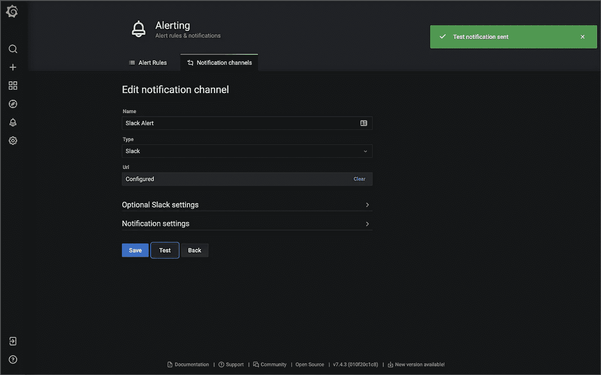

下面是一个基于 300 毫 CPU)的任意高 CPU 使用率的警报示例。当单个 pod 的 CPU 使用率超过该值超过 3 分钟时，将会发送警报。高 CPU 使用率可能是由于水平机架自动缩放器不起作用，或者 HPA 已达到其`maxReplicas`限制，或者群集中没有足够的可用资源来调度额外的机架。


由警报触发，Prometheus 向指定的 Slack 信道发送详细的通知。

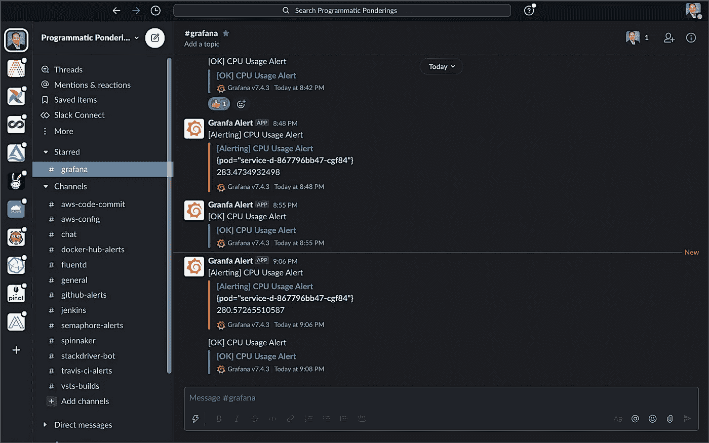

# 亚马逊云观察容器洞察

最后，在指标类别中，[Amazon cloud watch Container Insights](https://docs.aws.amazon.com/AmazonCloudWatch/latest/monitoring/ContainerInsights.html)从您的容器化应用和微服务中收集、汇总和总结指标和日志。可以根据 Container Insights 收集的指标设置 CloudWatch 警报。Container Insights 可用于亚马逊弹性容器服务(Amazon ECS)，包括亚马逊 EC2 上的 Fargate、亚马逊 EKS 和 Kubernetes 平台。

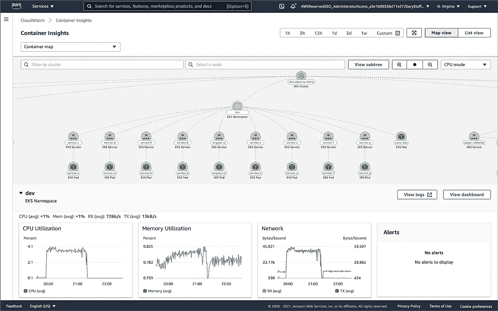

在亚马逊 EKS，Container Insights 使用 CloudWatch 代理的容器化版本来发现集群中所有正在运行的容器。然后，它在性能堆栈的每一层收集性能数据。Container Insights 使用[嵌入式指标格式](https://docs.aws.amazon.com/AmazonCloudWatch/latest/monitoring/CloudWatch_Embedded_Metric_Format.html)收集性能日志事件数据。这些性能日志事件是使用结构化 JSON 模式的条目，该模式支持大规模接收和存储高基数数据。

在文章的第一部分中，我们还为 Prometheus 安装了 cloud watch Container Insights monitoring，它可以自动从容器化的系统和工作负载中发现 Prometheus 指标。

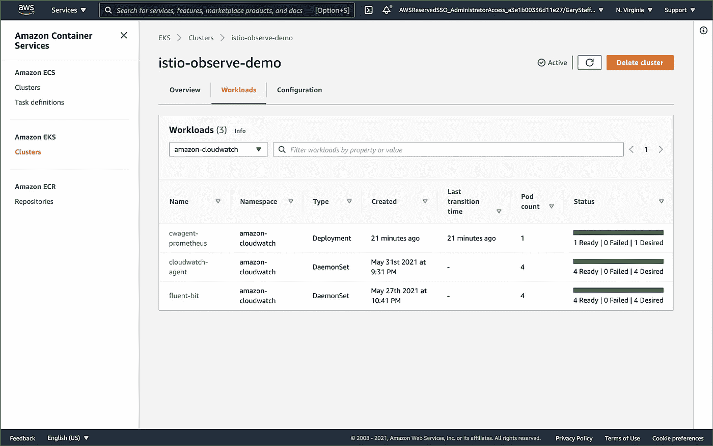

下面是一个基本性能监控 CloudWatch Container Insights 仪表板的示例。仪表板被过滤到 EKS 集群的`dev`名称空间，参考应用程序平台在此运行。在此期间，使用`hey`将后端服务置于模拟负载下。随着应用程序负载的增加，根据部署资源和 HPA 配置，观察到单元的数量从 19 个增加到 34 个。还有一个警告，显示在屏幕的右侧。任意高水平的网络传输活动触发了警报。

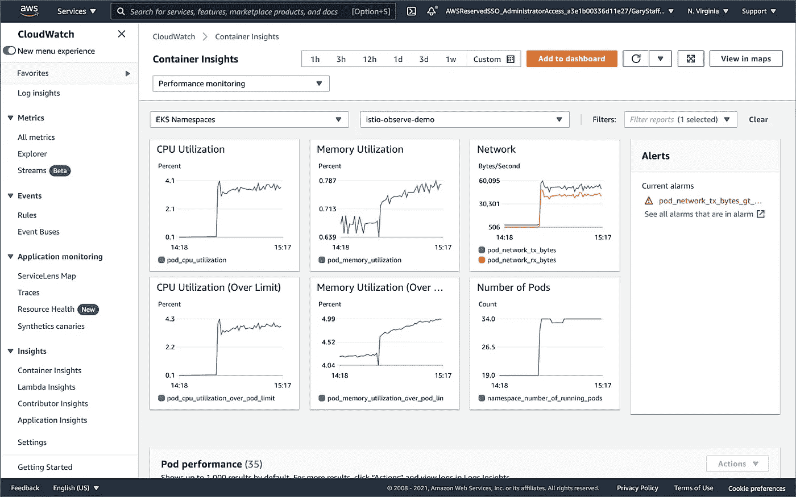

接下来是 Container Insights 在内存模式下的容器图视图示例。您可以看到`dev`名称空间的可视化表示，其中显示了每个后端服务的`Service`和`Deployment`资源。

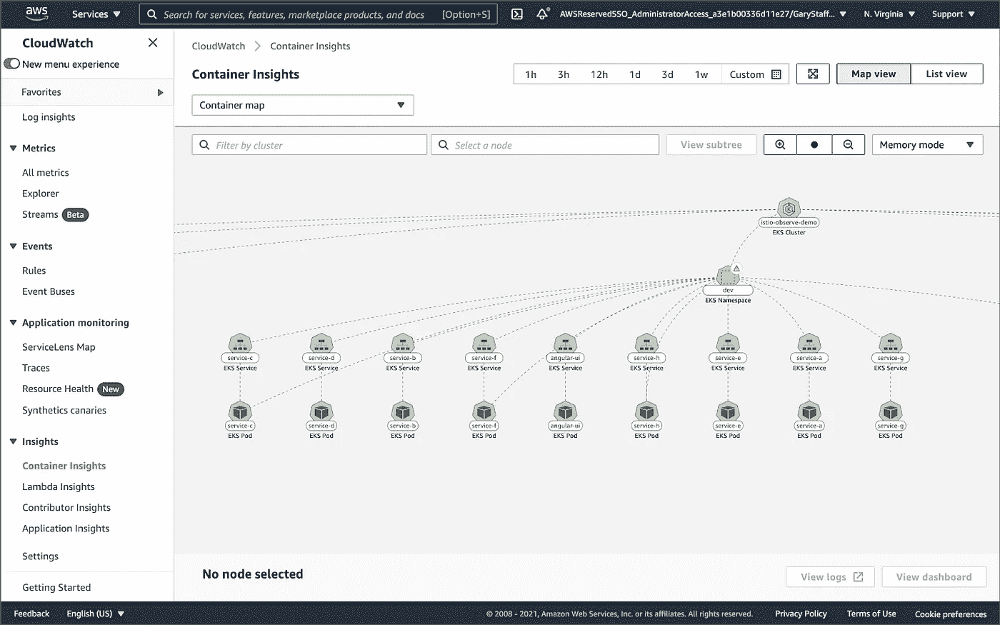

有一个警告图标，指示集群上的警报被触发。

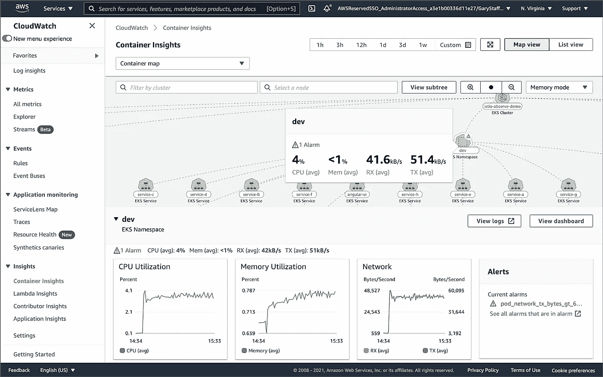

最后，CloudWatch Insights 允许您从 CloudWatch Insights 跳转到 CloudWatch Log Insights 控制台。CloudWatch Insights 还将为您编写 CloudWatch Insights 查询。下面，我们从 CloudWatch Insights 性能监控控制台中的 Service D container metrics 视图直接转到 CloudWatch Log Insights 控制台，带有一个查询，准备运行。

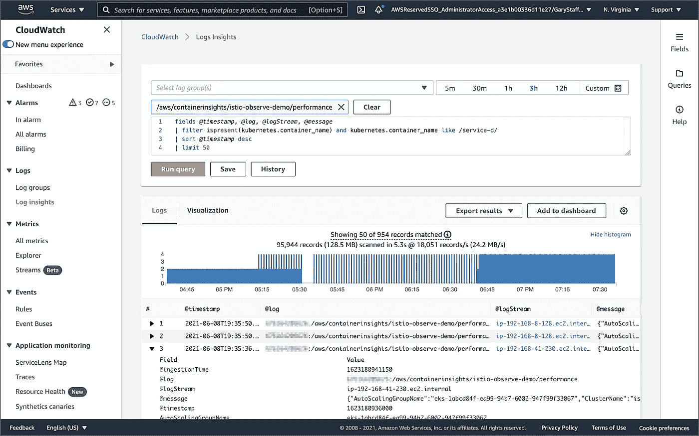

# 支柱 3:痕迹

根据[开放跟踪网站](https://opentracing.io/docs/overview/what-is-tracing/)的说法，分布式跟踪，也称为分布式请求跟踪，用于分析和监控应用程序，尤其是那些使用微服务架构构建的应用程序。分布式跟踪有助于查明故障发生的位置以及导致低性能的原因。

根据 [Istio](https://istio.io/docs/tasks/telemetry/distributed-tracing/#understanding-what-happened) 的说法，头传播可以通过客户端库来完成，比如 [Zipkin](https://zipkin.io/pages/tracers_instrumentation.html) 或者 [Jaeger](https://github.com/jaegertracing/jaeger-client-java/tree/master/jaeger-core#b3-propagation) 。也可以手动完成，称为跟踪上下文传播，记录在[分布式跟踪任务](https://istio.io/latest/docs/tasks/observability/distributed-tracing/overview/#trace-context-propagation)中。Istio 代理可以自动发送跨度。应用程序需要传播适当的 HTTP 头，以便当代理发送跨度信息时，跨度可以正确地关联到单个跟踪中。为了实现这一点，应用程序需要从传入请求到任何传出请求收集并传播以下标头。

*   `x-request-id`
*   `x-b3-traceid`
*   `x-b3-spanid`
*   `x-b3-parentspanid`
*   `x-b3-sampled`
*   `x-b3-flags`
*   `x-ot-span-context`

标题起源于 Zipkin 项目的一部分。报头的 B3 部分以 Zipkin 的原名命名，**B**ig**B**rother**B**ird。跨服务调用传递这些头被称为 [B3 传播](https://github.com/openzipkin/b3-propagation)。根据 [Zipkin](https://www.envoyproxy.io/docs/envoy/latest/intro/arch_overview/observability/tracing#arch-overview-tracing) 的说法，这些属性会在进程内传播，并最终传播到下游(通常通过 HTTP 头),以确保源自同一个根的所有活动都被收集在一起。

为了演示 Jaeger 和 Zipkin 的分布式跟踪，服务 A、服务 B 和服务 E 被修改为传递 b3 头。这是向其他上游服务发出 HTTP 请求的三个服务。添加了以下代码来将标头从一个服务传播到下一个服务。Istio sidecar 代理([特使](https://www.envoyproxy.io/))生成第一个[报头](https://istio.io/latest/about/faq/#distributed-tracing)。关键是只传播下游请求中出现的头并有一个值，如下面的代码所示。传播空标头会破坏分布式跟踪。

```
incomingHeaders := []string{
  "x-b3-flags",
  "x-b3-parentspanid",
  "x-b3-sampled",
  "x-b3-spanid",
  "x-b3-traceid",
  "x-ot-span-context",
  "x-request-id",
 }for _, header := range incomingHeaders {
  if r.Header.Get(header) != "" {
   req.Header.Add(header, r.Header.Get(header))
  }
 }
```

下面，来自对服务 A 的`/api/request-echo`端点的调用的响应有效负载的突出显示部分揭示了源自 Istio 代理并传递给服务 A 的 b3 头。

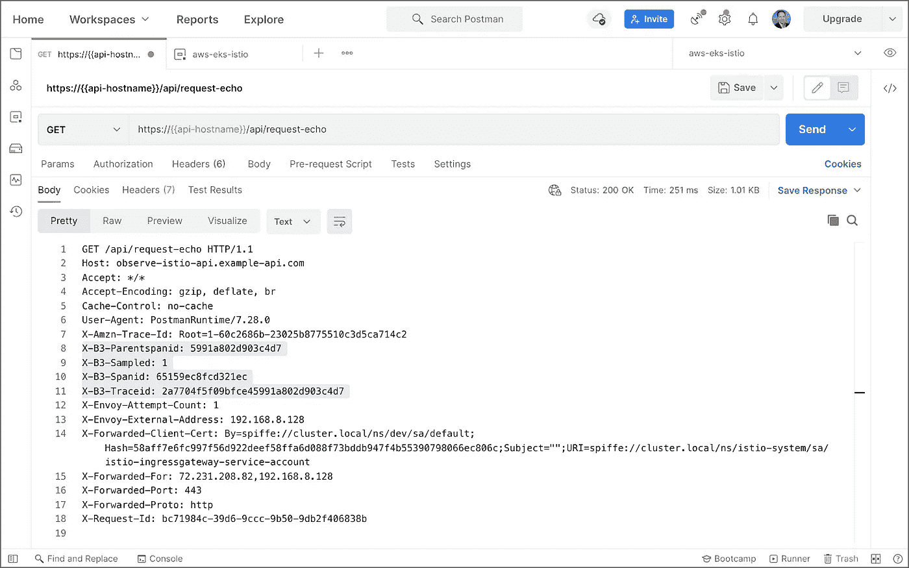

# 贼鸥

根据他们的网站介绍， [Jaeger](https://www.jaegertracing.io/docs/1.10/) 受 [Dapper](https://research.google.com/pubs/pub36356.html) 和 [OpenZipkin](http://zipkin.io/) 的启发，是由[优步科技](http://uber.github.io/)开源发布的分布式追踪系统。Jaeger 用于对基于微服务的分布式系统进行监控和故障排除，包括分布式上下文传播、分布式事务监控、根本原因分析、服务依赖性分析以及性能和延迟优化。Jaeger 网站包含 Jaeger 架构和一般追踪相关术语的有用概述。

如果您使用本文第一部分中演示的 Istio 插件过程部署了 Jaeger，请使用类似于其他工具的方式访问 Jaeger:

```
istioctl dashboard jaeger
```

以下是 Jaeger UI 的搜索视图示例，显示了一段时间内对 Istio 入口网关服务的搜索结果。我们在顶部看到跟踪时间线，下面是跟踪结果列表。正如 Jaeger [网站](https://www.jaegertracing.io/docs/1.10/architecture/)上所讨论的，一条轨迹由跨度组成。span 表示 Jaeger 中具有操作名称的逻辑工作单元。踪迹是通过系统的执行路径，可以被认为是[跨度](https://www.jaegertracing.io/docs/1.10/architecture#span)的[有向无环图](https://en.wikipedia.org/wiki/Directed_acyclic_graph) (DAG)。如果您使用过像 Apache Spark 这样的系统，您可能已经熟悉 Dag 的概念。

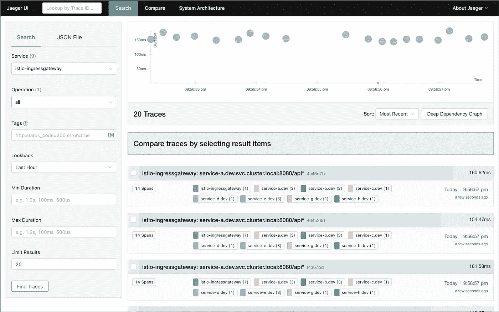

下面是 Jaeger 的轨迹时间线模式中单个轨迹的详细视图。14 个跨度包含参考平台的八个组件:八个后端服务中的七个和 Istio 入口网关。每个跨度都有单独的计时，总跟踪时间为 160 ms。跟踪中的根跨度是 Istio 入口网关。加载在最终用户的 web 浏览器中的 Angular UI 通过 Istio 入口网关调用服务 A。从那里，我们看到了我们的服务到服务 IPC 的预期流程。服务 A 调用服务 B 和服务 c，服务 B 调用服务 E，服务 E 调用服务 G 和服务 h。

在这个演示中，跟踪既没有跨越 RabbitMQ 消息队列，也没有跨越 MongoDB。这意味着您不会看到包含通过 RabbitMQ 从服务 D 到服务 F 的调用的跟踪。


跟踪时间线的可视化展示了参考平台的服务到服务 IPC 的同步性质，而不是使用 RabbitMQ 消息队列的解耦通信的异步性质。服务 A 等待其调用链中的每个服务做出响应，然后将其响应返回给请求者。

在 Jaeger 的跟踪时间线视图中，您可以钻取包含附加元数据的单个跨度。span 的元数据包括被调用的 API 端点 URL、HTTP 方法、响应状态和其他几个头。

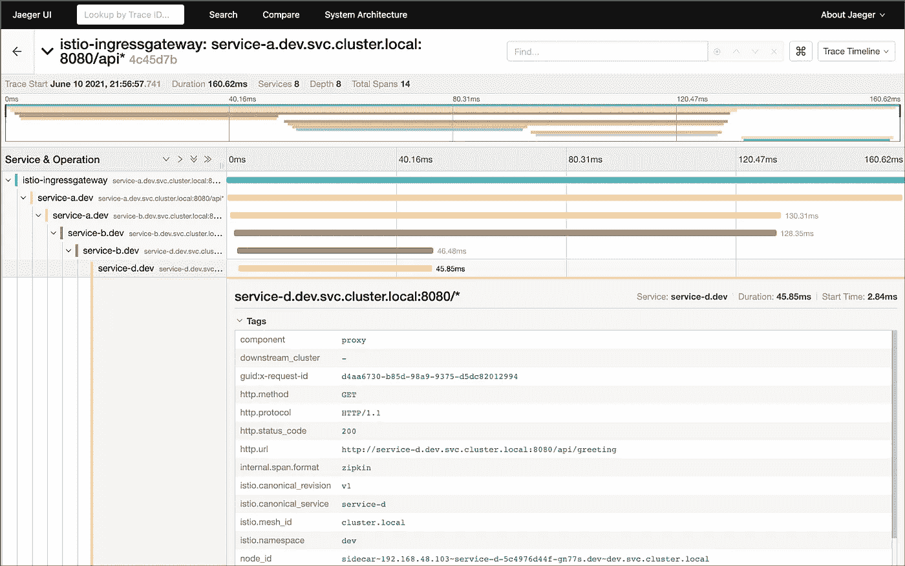

Jaeger 还有一个实验性的 Trace Graph 模式，可以显示相同轨迹的图形视图。

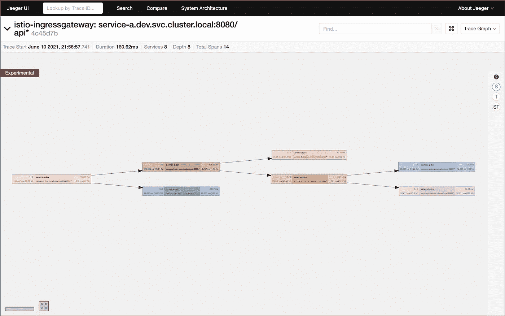

Jaeger 还包括一个比较跟踪功能和两个依赖关系视图:力定向图和 DAG。我发现这两种观点与基亚利相比都相当原始。缺少对 Kiali 的访问，这些视图作为依赖图没有多大用处。


# 齐普金

Zipkin 是一个分布式跟踪系统，它帮助收集解决服务架构中的延迟问题所需的时间数据。根据 2012 年在 [Twitter 的工程博客](https://blog.twitter.com/engineering/en_us/a/2012/distributed-systems-tracing-with-zipkin)上的一篇帖子，Zipkin 是在 Twitter 的第一个黑客周期间作为一个项目开始的。在那一周，他们实施了一个基本版本的[谷歌衣冠楚楚](http://research.google.com/pubs/pub36356.html)节俭纸。

Zipkin 和 Jaeger 在能力上非常相似。我选择在这篇文章中关注耶格，因为比起齐普金，我更喜欢它。如果你想尝试 Zipkin 而不是 Jaeger，你可以使用以下命令从 Istio addons extras 目录中移除 Jaeger 并[安装 Zipkin](https://istio.io/latest/docs/ops/integrations/zipkin/) 。在帖子的第一部分，我们在部署 Istio 插件时没有默认安装 Zipkin。请注意，在同一个 Kubernetes 集群中同时运行这两个工具会导致不可预测的跟踪结果。

```
kubectl delete -f [https://raw.githubusercontent.com/istio/istio/release-1.10/samples/addons/jaeger.yaml](https://raw.githubusercontent.com/istio/istio/release-1.10/samples/addons/jaeger.yaml)kubectl apply -f [https://raw.githubusercontent.com/istio/istio/release-1.10/samples/addons/extras/zipkin.yaml](https://raw.githubusercontent.com/istio/istio/release-1.10/samples/addons/extras/zipkin.yaml)
```

访问 Zipkin 类似于其他观察工具:

```
istioctl dashboard zipkin
```

下面是一个在 Zipkin 的 UI 中可视化的分布式轨迹的例子，包含 14 个跨度。这与 Jaeger 中显示的轨迹非常相似，如上所示。该跨度包含参考平台的八个组件:八个后端服务中的七个和 Istio 入口网关。每个跨度都有单独的计时，总跟踪时间为 154 ms。

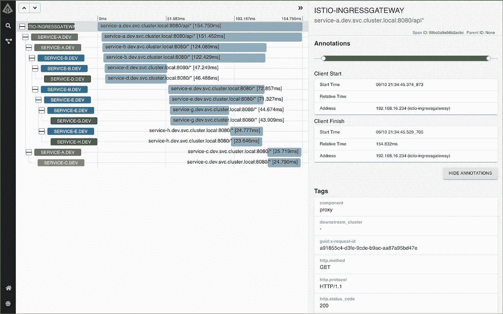

Zipkin 还可以基于分布式跟踪可视化一个依赖图。下面是一个两分钟内的流量模拟示例，显示了参考平台组件之间的网络流量，以依赖关系图的形式显示。

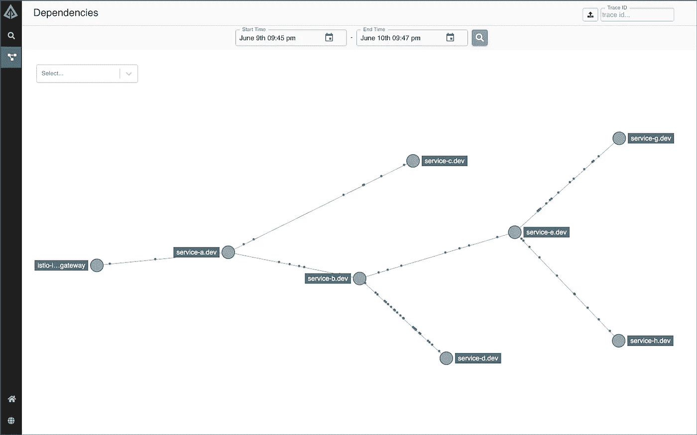

# Kiali:微服务可观察性

根据他们的[网站](https://kiali.io/)，Kiali 是一个基于 Istio 的服务网格的管理控制台。它提供了仪表板、可观察性，并允许您使用健壮的配置和验证功能来操作网格。它通过推断流量拓扑和显示网格的健康状况来显示服务网格的结构。Kiali 提供了详细的指标、强大的验证、Grafana 访问以及与 Jaeger 的分布式跟踪的强大集成。

如果你使用本文第一部分中展示的 Istio addons 过程部署了 Kaili，访问 Kiali 的方式与其他工具类似:

```
istioctl dashboard kaili
```

为了提高安全性，我选择使用 Istio 文档中提到的[可定制安装](https://istio.io/latest/docs/ops/integrations/kiali/#option-2-customizable-install)来安装最新版本的 Kaili。使用 Kiali 的[Install via Kiali Server Helm Chart](https://kiali.io/documentation/latest/quick-start/#_install_via_kiali_server_helm_chart)选项添加了基于令牌的身份验证，类似于 Kubernetes 仪表板。

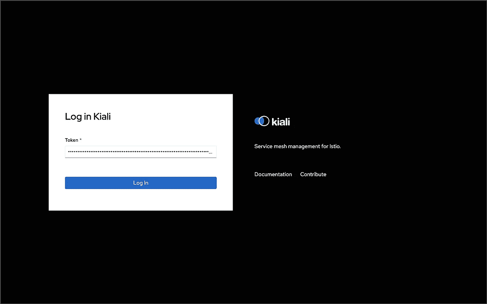

登录 Kiali，我们会看到 Overview 选项卡，它提供了 Istio 服务网格中所有名称空间的全局视图，以及每个名称空间中的应用程序数量。

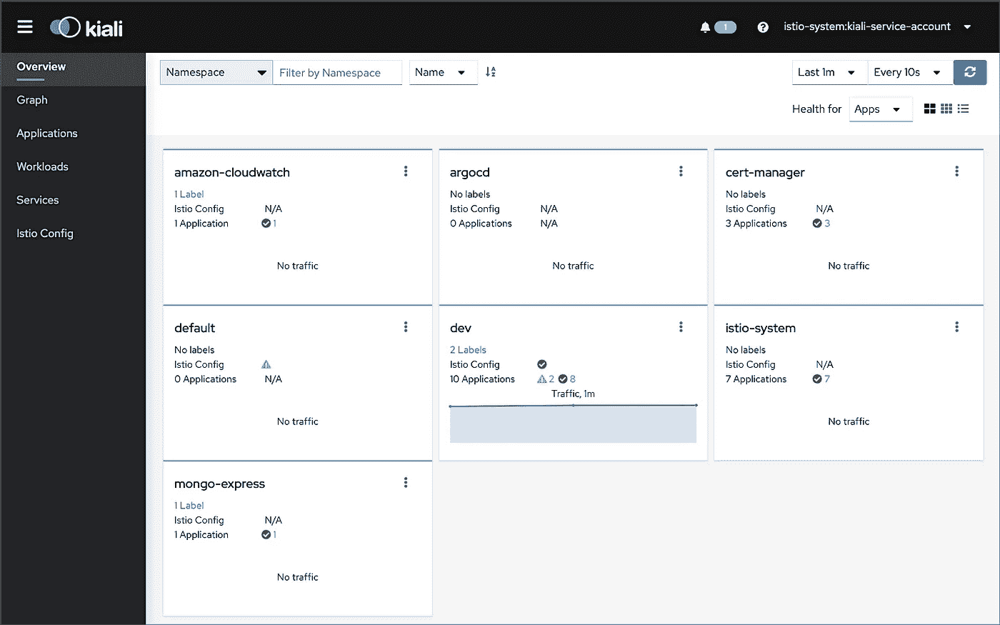

Kiali UI 中的 Graph 选项卡表示在 Istio 服务网格中运行的组件。下面，过滤集群的`dev`名称空间，我们可以观察到 Kiali 映射了 8 个应用程序(工作负载)、10 个服务和 22 个边缘(一个图形术语)。具体来说，我们看到位于服务网格边缘的 Istio Ingres 代理、Angular UI 和八个后端服务，所有这些服务都有各自的 Envoy 代理侧柜，这些侧柜接收流量(在本例中，服务 F 没有从另一个服务接收任何直接流量)、外部 DocumentDB 出口点和外部 Amazon MQ 出口点。最后，注意使用 Istio，服务到服务的流量是如何从服务到其 sidecar 代理，再到另一个服务的 sidecar 代理，最后到服务的。

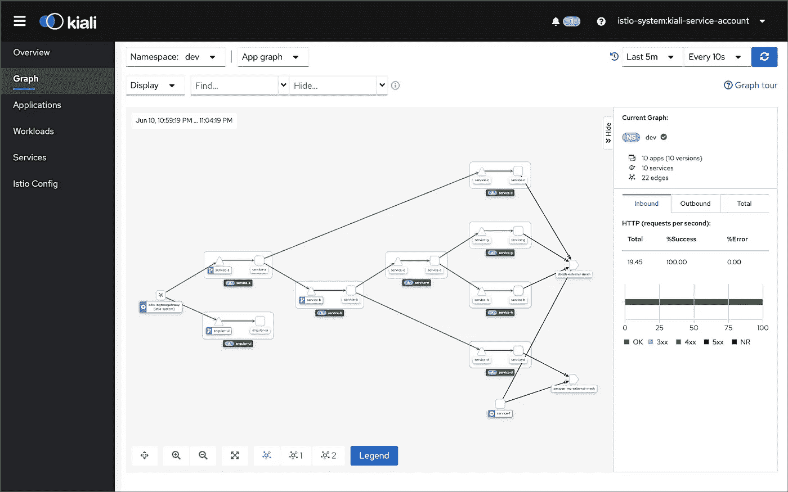

下面是服务网格的类似视图，但这一次，Istio 入口网关和服务 A 之间存在故障，以红色显示。我们还可以观察 HTTP 流量的总体指标，例如每秒入站和出站请求数、总请求数、成功率和出错率，以及 HTTP 状态代码。

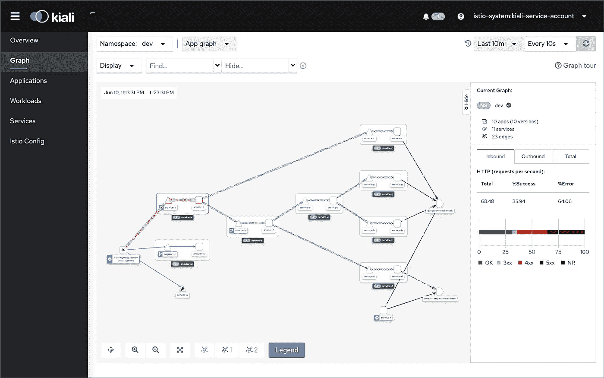

Kiali 允许您放大并关注图表中的单个组件及其各个指标。

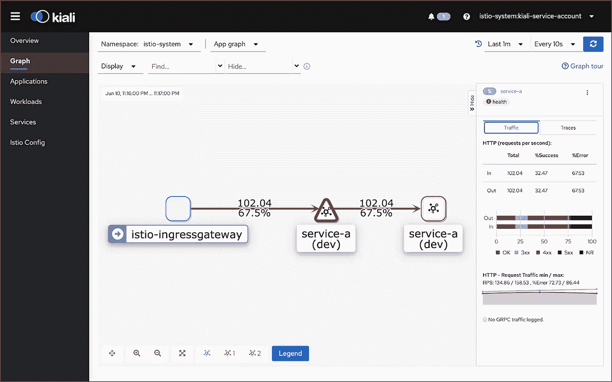

Kiali 还可以显示图中每条边的平均请求时间和其他指标(两个组件之间的通信)。Kaili 甚至可以使用 Kiali 的重放功能显示给定时间段内的这些指标，如下所示。

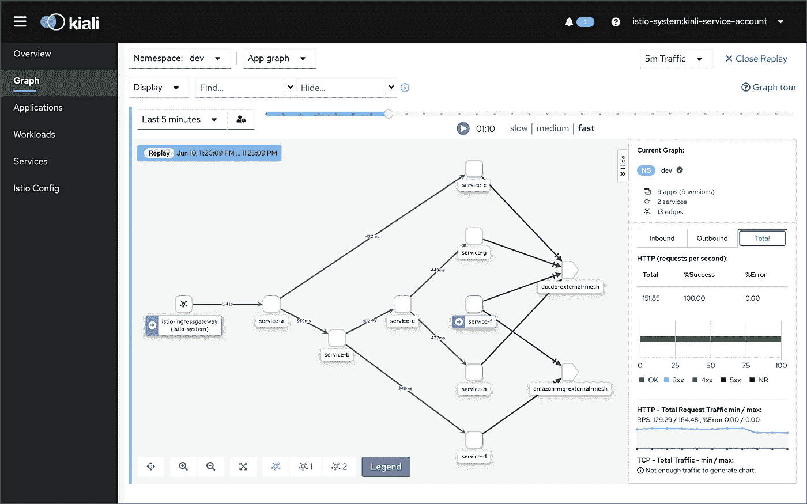

关注外部 DocumentDB 集群，Kiali 还允许我们查看连接到外部集群的服务网格中的四个服务之间的 TCP 流量。

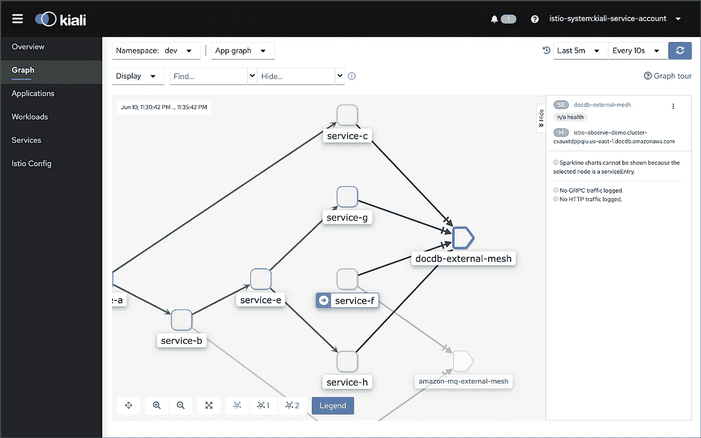

“应用程序”选项卡列出了所有应用程序、它们的名称空间和标签。

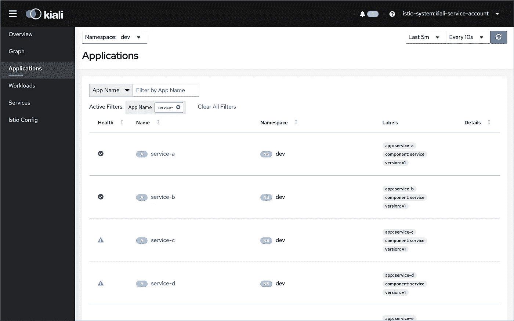

您可以在“应用程序”和“工作负载”选项卡上深入查看单个组件，并查看更多详细信息。详细信息包括总体运行状况、pod 和 Istio 配置状态。下面是对`dev`名称空间中服务 A 工作负载的概述。

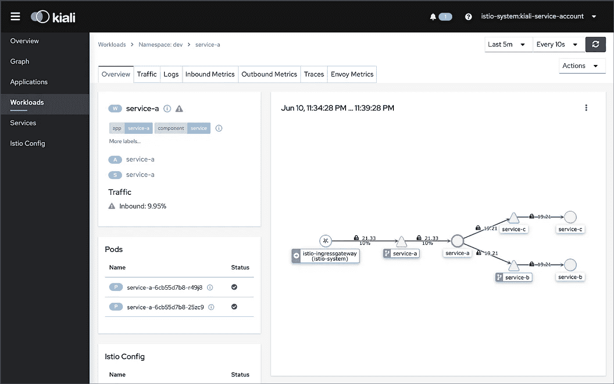

工作负载详细视图还包括入站和出站指标。下面是在`dev`名称空间中服务 A 的出站请求量、持续时间、吞吐量和大小度量的示例。

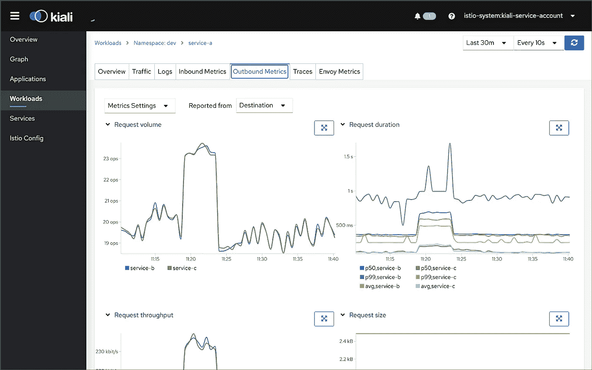

Kiali 还可以让您访问单个 pod 的集装箱日志。虽然日志访问不像前面讨论的其他日志源那样用户友好，但是在 Kiali 中提供日志以及度量(与 Grafana 集成)、跟踪(与 Jaeger 集成)和网格可视化，作为可观察性的单一源是非常有效的。

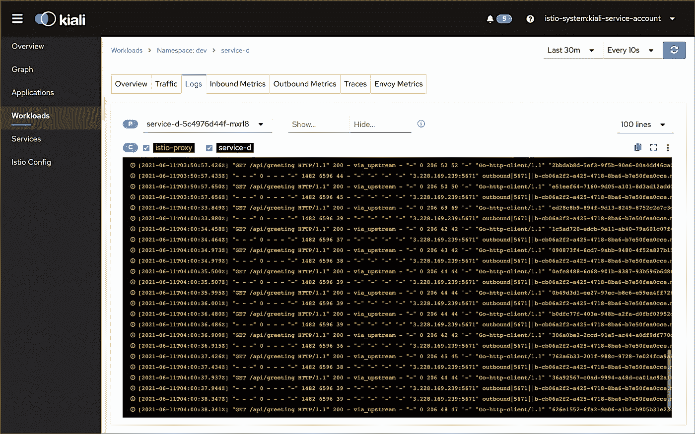

Kiali 还有一个 Istio 配置选项卡。Istio 配置选项卡显示用户环境中存在的所有可用 Istio 配置对象的列表。

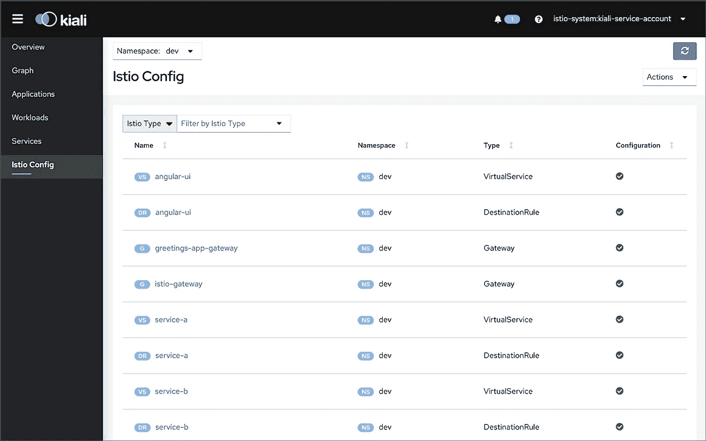

您可以使用 Kiali 来配置和管理 Istio 服务网格及其安装的资源。使用 Kiali，您实际上可以修改已部署的资源，类似于使用`kubectl edit`命令。

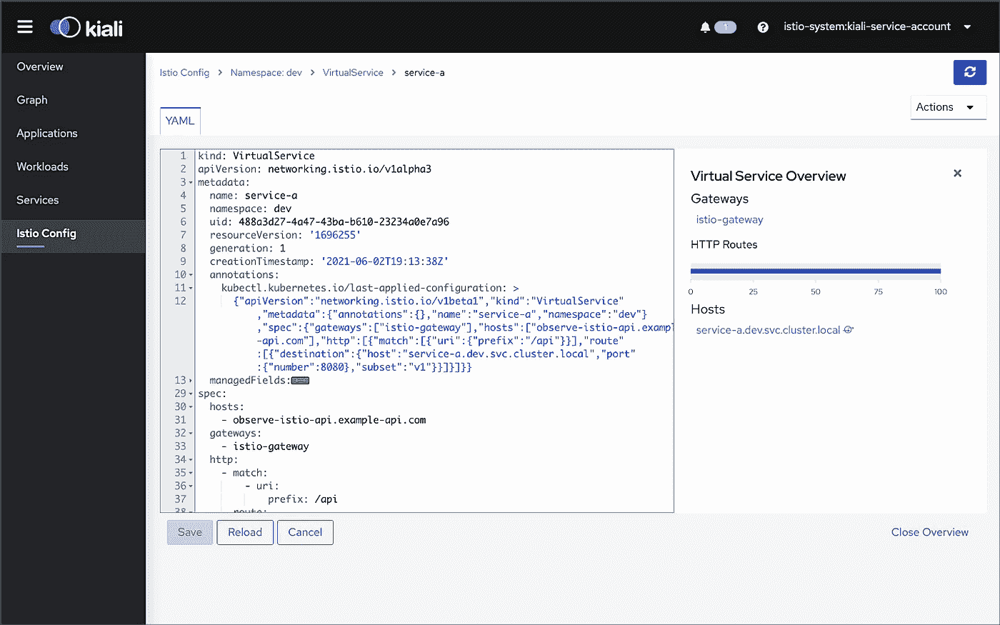

我经常发现 Kiali 是我解决平台问题的第一站。一旦我确定了有问题的特定组件或通信路径，我就可以通过 Grafana 仪表板查询 CloudWatch 日志和 Prometheus 指标。

# 拆毁

要拆除 EKS 集群、DocumentDB 集群和 Amazon MQ broker，请使用以下命令:

```
# EKS cluster
eksctl delete cluster --name $CLUSTER_NAME# Amazon MQ
aws mq list-brokers | jq -r '.BrokerSummaries[] | .BrokerId'aws mq delete-broker --broker-id **{{ your_broker_id }}**# DocumentDB
aws docdb describe-db-clusters \
    | jq -r '.DBClusters[] | .DbClusterResourceId'aws docdb delete-db-cluster \
    --db-cluster-identifier **{{ your_cluster_id }}**
```

# 结论

在这篇由两部分组成的文章中，我们探索了一组流行的开源可观察性工具，它们很容易与 Istio 服务网格集成。这些工具包括用于分布式事务监控的 Jaeger 和 Zipkin，用于指标收集和警报的 Prometheus，用于指标查询、可视化和警报的 Grafana，以及用于 Istio 整体可观察性和管理的 Kiali。我们完善了工具集，增加了用于日志处理和转发到 Amazon cloud watch Container Insights 的 Fluent Bit。使用这些工具，我们成功观察了部署到亚马逊 EKS 的基于微服务的分布式参考应用平台。

# 基于 gRPC 的可观测性

有兴趣探索这些相同的可观察性工具来监视另一组基于 Go 的微服务，这些服务使用[协议缓冲区](https://developers.google.com/protocol-buffers)(又名*proto buf*)over[gRPC](https://grpc.io/)(gRPC 远程过程调用)和 [HTTP/2](https://en.wikipedia.org/wiki/HTTP/2) 进行客户端-服务器通信，而不是更常见的 RESTful JSON over HTTP？

[](https://garystafford.medium.com/observing-grpc-based-microservices-on-amazon-eks-running-istio-77ba90dd8cc0) [## 观察亚马逊 EKS 上运行 Istio 的基于 gRPC 的微服务

### 在亚马逊 EKS 上使用 Jaeger、Zipkin、Prometheus、Grafana 和 Kiali 观察一个基于 Kubernetes 的分布式应用程序…

garystafford.medium.com](https://garystafford.medium.com/observing-grpc-based-microservices-on-amazon-eks-running-istio-77ba90dd8cc0) 

这篇博客代表我自己的观点，而不是我的雇主亚马逊网络服务公司(AWS)的观点。所有产品名称、徽标和品牌都是其各自所有者的财产。