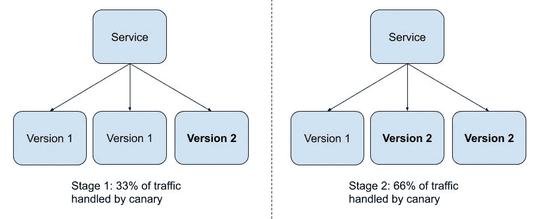
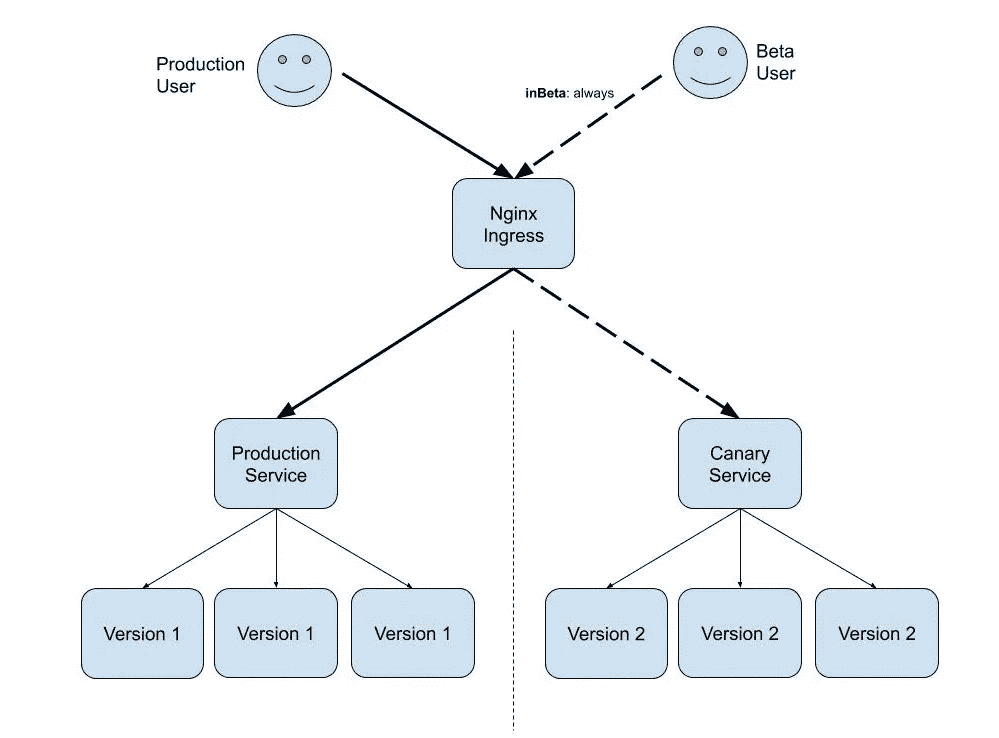

# 用于用户测试的 Kubernetes Canary 部署

> 原文：<https://itnext.io/kubernetes-canary-deployments-for-user-beta-testing-70c714ab3f59?source=collection_archive---------1----------------------->

在 NewsWhip，我们喜欢与真实用户一起对我们正在开发的新功能进行测试，以确保我们所构建的东西是有价值的。通常，这些首先在内部推出，因此我们可以获得有价值的内部反馈，然后随着功能越来越接近生产就绪，逐步向外部用户发布。

虽然这个过程对于我们构建具有最高用户价值的功能来说是无价的，但是运行这样一个程序的技术含义是相当沉重的。就我们的技术体系而言，我们基本上有两种选择，这两种选择都存在问题:

*   使用功能标志为特定用户打开功能。这对我们来说是个问题，因为我们没有一个健壮的特性标记系统，所以选择这种方法对代码维护和测试有很大的影响，特别是对于主要的变更。
*   在另一个 DNS 后面使用完全独立的部署，例如*betatest.newswhip.com*。这对我们来说也是一个问题，因为它要求用户需要切换到一个新的网站来使用测试版功能，从而影响了功能的参与，并减少了可用的测试用户。

**输入 Kubernetes 金丝雀部署**

随着我们的基础设施最近迁移到 Kubernetes，我们开始探索该生态系统中可用的部署机制是否可以为我们提供更强大的解决方案，尤其是“金丝雀部署”。

金丝雀的部署在其他地方有很好的记录，但是在这里总结一下。canary 部署是用新版本的服务代码更新负责运行服务的服务器子集，即“canaries ”,允许新代码与现有代码并行测试。运行新版本的服务器数量逐渐增加，而旧版本的数量逐渐减少，最终，一旦确定一切正常，就可以完全部署。在下面的示例中，我们可以看到运行服务版本 2 的节点(金丝雀节点)的数量是如何逐渐增加的，并与旧版本的服务代码一起运行

canary 部署如何与 Kubernetes 服务和部署一起工作的概述

Canary 部署是无价的，因为它们允许在生产中安全地测试新功能，并确保性能不会下降或错误率不会增加。

Canary 部署通常与 Kubernetes 服务和部署相结合，以安全地管理更传统的“后端”服务的更新，例如位于数据库前端的内部 API 服务。

然而，新闻鞭用来将外部用户的请求路由到我们的 web 应用程序的 Nginx 入口也支持 canary 部署。使用这个功能，Nginx 可以将设置了特定标志的请求路由到 canary 服务，在这个服务后面，一个完全扩展的部署正在运行，如下图所示。

入口中的金丝雀配置允许路由到不同的服务

在这里我们可以看到，Beta 用户请求的 cookie 值 *inBeta* 被设置为“总是”，这意味着该请求被定向到 canary 服务。所有其他请求都发送到生产服务。Nginx 可以根据 header、cookie 中设置的值或者根据请求的百分比将请求路由到 canary 服务。

考虑到这一点，我们开始测试，然后使用 canary nginx 配置来运行我们的 beta 测试基础设施。

**在 Kubernetes 中使用带有 Nginx 的 Canary 部署**

设置 Nginx 来处理到不同服务的请求路由非常简单，但是最初可能会有点混乱，因为同一个入口有两个独立的 YAML 配置文件。我们的设置概要如下:

*   两个服务正在运行—一个用于生产，一个用于 canary。在我们的例子中，它们是 *yourapp-prod-service* 和 *yourapp-canary-service*
*   生产 nginx 正常运行，配置了您需要的所有路由。例如，这里我们有一个 nginx 配置路由片段***【yourapp.example.com】****到***your app-prod-service***监听端口 9000*

*   *然后，我们使用设置金丝雀配置的单独入口配置文件来配置金丝雀。为了实现这一点，我们在相同的名称空间 prod 中操作，但是我们使用了不同的名称，这样我们就不会替换生产 nginx 配置。在本例中，如果任何传入请求的 cookie 值“inBeta”设置为“always”，那么该请求将被定向到 **yourapp-canary-service** ，也在端口 9000 上侦听。这里需要理解的一个关键点是，cookie 值应该设置为“always ”,因为这是 Nginx 对 canary 设置的要求:*

*有了这个，用户就可以访问*yourapp.example.com*，如果他们的请求的“in beta”cookie 被设置为“always ”,那么这个请求将被定向到 canary 部署。*

***细节中的魔鬼***

*为了使用这种基础设施配置，我们更新了我们的应用程序，以便在用户登录时检查他们的测试状态，如果用户应该在测试组中，我们就相应地设置“inBeta”金丝雀 cookie 值。虽然这是一个简单的变化，但我们确实需要我们的应用程序更多的参与来支持。这可能适用于其他人，但这取决于您的系统架构。*

*我们特别关心的是确保客户端浏览器为生产或 canary 部署下载了正确的 javascript 代码包。考虑到我们对不同用户测试潜在的非常不同的应用程序版本的用例，两个环境之间可能会有很大的不兼容性，这意味着如果客户端下载了不正确的客户端代码，应用程序将无法正常运行。*

*然而，在我们的应用程序中，客户机代码包是在对成功的登录请求的即时响应中发送的。这意味着，如果用户刚刚被添加到 beta 测试组，初始登录请求将不会设置 cookie 值，因此将被定向到错误的服务，因此客户端将下载不正确的包。*

*为了处理这种情况，如果我们检测到用户登录请求到达了不正确的服务，例如应该设置 inBeta cookie 但没有设置，我们会立即使用户的会话无效，但保留正确的 inBeta cookie 设置。这意味着下一个登录请求将被发送到正确的服务器。虽然这需要用户再次登录，但实际上这仅发生在我们将用户移入或移出测试组时，这种情况很少发生。*

***结论***

*有了这个系统，我们就有了一个简单的机制，可以无缝地将用户路由到一个完全不同的应用程序版本。还有其他系统可以更健壮地处理 canary 部署，比如 istio，我们还在应用程序中处理了更多的特性标志。然而，这需要我们进行大量的基础设施投资，而我们目前并不需要，这也是未来工作的基础。*