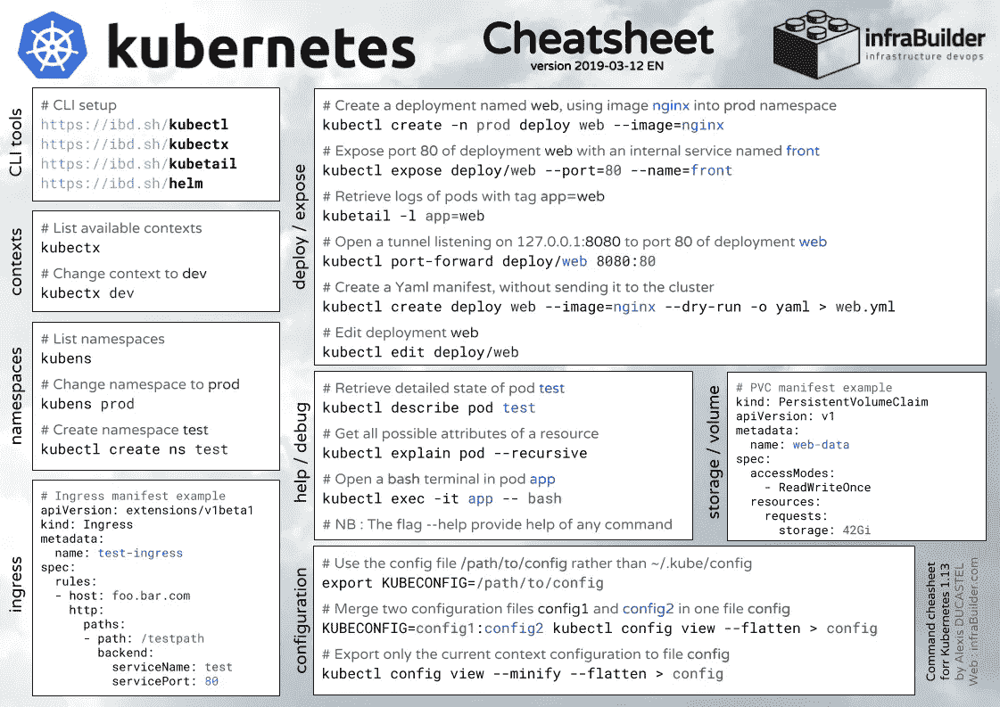
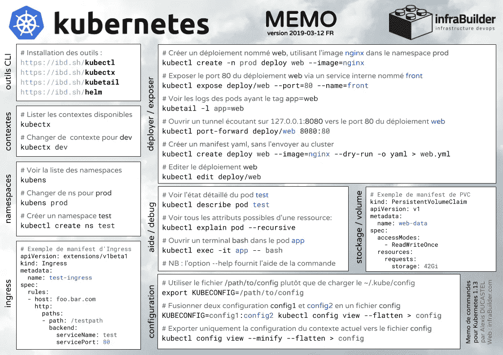

# 英文和法文的 Kubernetes 备忘单

> 原文：<https://itnext.io/kubernetes-cheatsheets-in-english-and-french-e655a8dcd452?source=collection_archive---------2----------------------->

长话短说，这里有两份 Kubernetes 的备忘单(1.13 测试)，一份是英文的，一份是法文的。它会给你一些有用的命令，使用 kubectl，kubectx，kubens，kubetail，…以及一些入口和 PersistentVolumeClaim 的清单示例。

您可以在[https://ibd.sh/cheatsheet-k8s](https://ibd.sh/cheatsheet-k8s)找到 PDF 格式的英文版本

法文 PDF 版本在:【https://ibd.sh/memo-k8s 

以下是英文版的预览:

kubernetes cheat sheet EN-PDF 可在 https://ibd.sh/cheatsheet-k8s[获得](https://ibd.sh/cheatsheet-k8s)

法语也是如此:

Kubernetes 备忘录— PDF 格式，可在 https://ibd.sh/memo-k8s[显示](https://ibd.sh/memo-k8s)