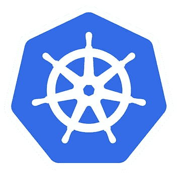
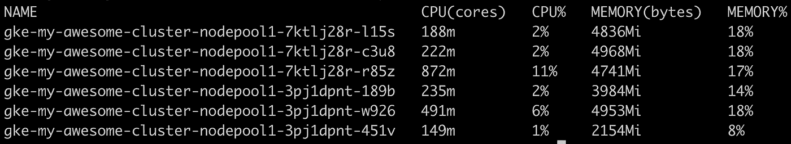

# Kubernetes 集群自动扩展:不仅仅是横向扩展

> 原文：<https://itnext.io/kubernetes-cluster-autoscaler-more-than-scaling-out-7b2d97f10b27?source=collection_archive---------3----------------------->

现在，您已经有了全新的 Kubernetes (k8s)集群，并且已经部署了第一批应用程序。您已经启用了[水平窗格自动缩放](https://kubernetes.io/docs/tasks/run-application/horizontal-pod-autoscale/)，您已经为您的应用程序准备好了黄金时间。您已经为您的集群配置了最小和最大数量的节点，以便在调度的 pods 不适合现有节点的情况下，[集群自动缩放器](https://github.com/kubernetes/autoscaler/tree/master/cluster-autoscaler#cluster-autoscaler) (CA)可以扩展集群本身。您已经为您的应用程序准备好了黄金时间！🚀

您会发现一切都很顺利，但是在运行一段时间和多次部署之后，您会注意到下图:

# 除了向外扩展 k8s 集群之外，集群自动缩放器是将它向内扩展的组件。

但是为了做到这一点，您必须给它所需的灵活性，这在许多情况下并不是默认的。但是，我们所说的“灵活性”是什么意思呢？让我们先来看看缩放的一些基础知识。

> 在简单的情况下，如果一个节点最终没有任何正在运行的 pod(DaemonSets 除外)，它将被终止。

除了上面的简单情况，在很多情况下，您的集群可能会有很多节点没有得到充分利用。事实上，在某些情况下，您可能会观察到您的集群*未得到充分利用*。

根据[文档](https://github.com/kubernetes/autoscaler/blob/master/cluster-autoscaler/FAQ.md#what-types-of-pods-can-prevent-ca-from-removing-a-node)，在以下情况下，集群自动缩放器不会为了缩小节点而驱逐 pod:

1.  **现有 Pod 中断预算**:这些 Pod 有一个 [Pod 中断预算](https://kubernetes.io/docs/tasks/run-application/configure-pdb/) (PDB)，限制 CA 驱逐它们。例如，您可能正在运行 2 个 pod，同时您可能已经指定希望任何时候至少有 2 个 pod 可用。考虑到 CA 在驱逐 pod 时尊重 pdb，这使得它无法移动它们。
2.  **kube-system pdb**:您尚未为位于`**kube-system**`名称空间中的 Pod 指定 Pod 中断预算(从 CA `0.6`开始)。例如，这些 pdb 没有设置在 GKE，因为对`kube-system` pod 中断的容忍度与您在集群中运行的工作负载类型直接相关。
3.  **本地存储**:吊舱带有**本地存储**。*警告* **:** 如果您正在使用 Istio，`istio-proxy`边车会在默认设置中装载一个`emptyDir`卷。您需要为集群自动缩放器添加`"cluster-autoscaler.kubernetes.io/safe-to-evict": "true"`注释，以便能够驱逐它们。同样，您必须确保关键组件高度可用。
4.  **其他节点与 pod 约束不匹配**:可能存在这样的情况，即使某个节点未被充分利用，pod 也不适合其他节点。

> **Pod 资源请求非常重要。您必须确保，与 pod 实际需要的 CPU 和内存相比，您不会将 CPU 和内存请求放得很高。在这种情况下，您将有一个未充分利用的节点，并且 pod 资源请求将高到足以阻止 pod 适合另一个节点，从而导致 CA 无法驱逐它。**

# CA 疑难解答

下面是一个有用的提示，可以查看集群自动缩放器是否考虑将任何节点作为终止的候选节点(在将 pod 逐出之后):

`kubectl get configmap cluster-autoscaler-status -n kube-system -o yaml`

这将显示每个可用性区域中有多少节点(如果您有多个 az ),以及其中有多少被视为终止的候选节点。

另一个有用的提示是，假设 CA 使用由`metrics-server`提供的指标来确定节点利用率，`metrics-server`必须正确地从节点收集指标(`kubectl top nodes`应该返回所有节点的指标)。

# 结论

正确设置 Pod 中断预算和资源请求，并允许收回具有本地存储的 Pod，这将为集群自动缩放器提供开始移动 Pod 的灵活性。这将导致未充分利用的节点的终止，从而对您的基础设施成本产生非常积极的影响。