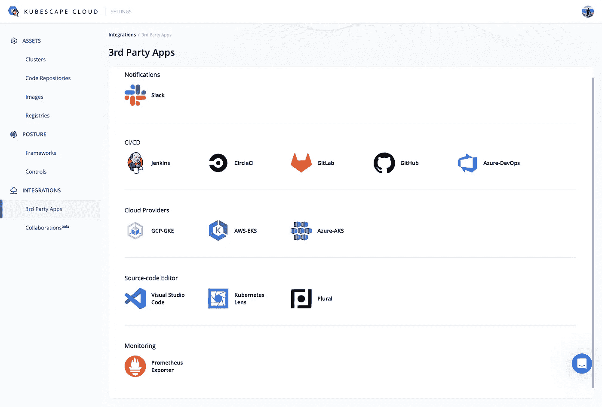
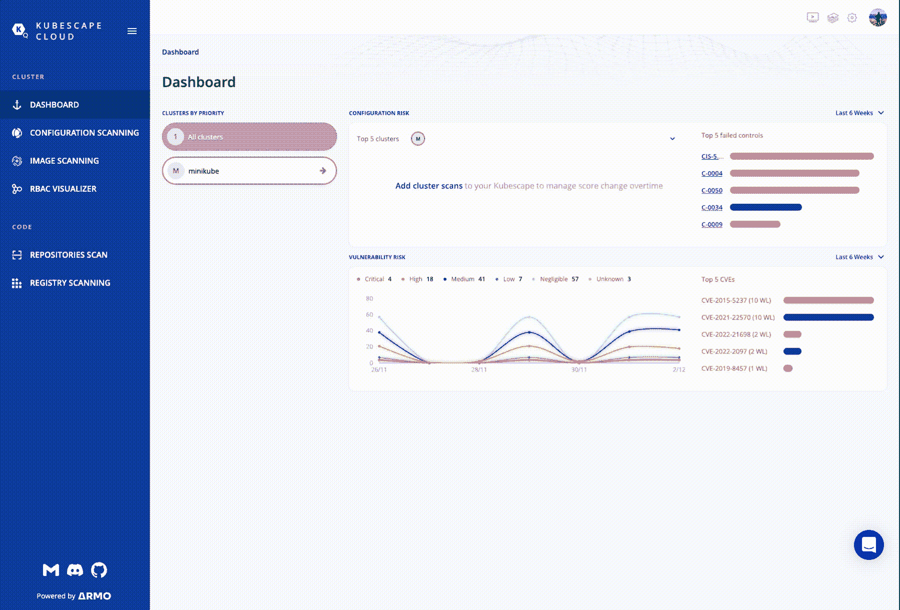
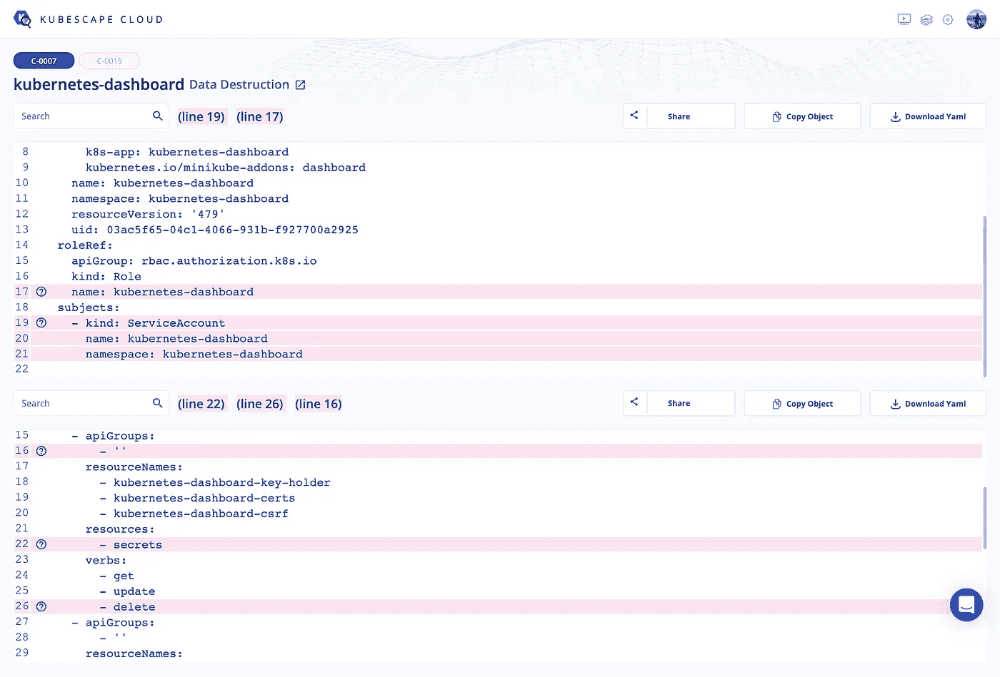
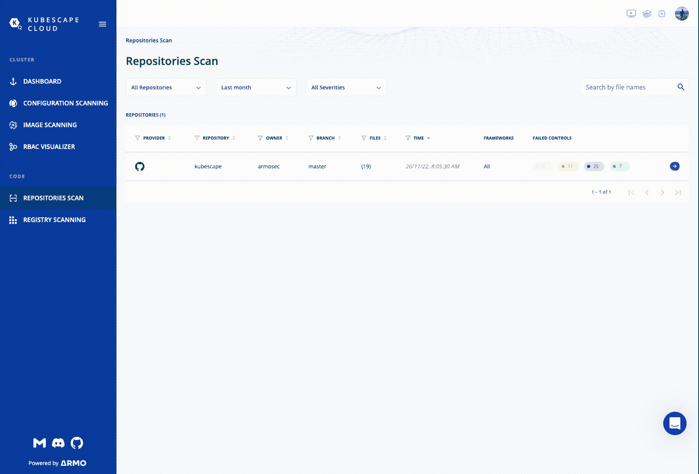

# Kubernetes 集群配置和漏洞扫描

> 原文：<https://itnext.io/kubernetes-cluster-configuration-and-vulnerability-scan-52450aad7c58?source=collection_archive---------2----------------------->


照片由[threatstack.com](https://www.threatstack.com/blog/3-things-to-know-about-kubernetes-security)拍摄

Kubernetes 已经成为管理基于容器的基础设施的首选工具，并且是每个工程师日常生活的一部分。

到目前为止，我们都知道管理服务器和容器集群(无论大小)意味着什么。通过处理网络通信、部署、存储、pod 等等，它让我们的生活变得更加轻松。

不管 Kubernetes 的能力和它所做的一切，作为工程师，我们仍然需要考虑安全性、正确的配置、使用正确的 docker 映像等等。

尽管我们尽了最大努力，但我们无法记住并手动处理所有这些事情，也无法确保我们做出了正确的决定，并使用了正确的设置或图像。毕竟，我们只是人类，我们只能做这么多。

想象一下，如果我们搞砸了，并使用一个 docker 图像，没有验证和审计，安全方面。我们可以为攻击者创造潜在的漏洞，他们可以利用这些漏洞来关闭我们的基础架构或部署勒索软件。

我们需要工具来帮助我们优化流程，自动化我们需要运行的所有安全检查和配置验证，并使我们在流程中的生活更加轻松，这样我们就可以晚上睡个好觉😉。

有很多工具可以帮助我们处理这些检查，甚至使它们自动化，比如 [Kube-bench](https://github.com/aquasecurity/kube-bench) 、 [terrascan](https://github.com/tenable/terrascan) 、 [Kube-hunter](https://github.com/aquasecurity/kube-hunter/) 等。你可以在这篇由 [Gupta Bless](https://medium.com/u/23b3a82550cd?source=post_page-----52450aad7c58--------------------------------) 撰写的[文章](https://medium.com/codex/5-kubernetes-security-tools-every-developer-should-use-de5f52362499)中阅读更多关于这些工具的内容。我更喜欢的，也是这篇文章将要描述的是[库贝西云](https://cloud.armosec.io/account/sign-up)。

Kubescape 可以配置不同的 CI/CD 平台，如 GitHub、Gitlab、CircleCI 和 Jenkins，可以集成 VSCode 和 [Kubernetes Lens](https://k8slens.dev/) 或 [Prometheus](https://prometheus.io/) 进行监控。它也可以与 Slack 和吉拉集成。



第三方集成

Kubescape 用不同的控制检查扫描集群、代码库映像和注册中心。一些框架是 [ArmoBest](https://www.armosec.io/blog/armobest-kubernetes-framework/) 、[互联网安全中心(CIS)](https://www.cisecurity.org/insights/blog/how-to-get-up-and-running-with-cis-workbench) 、 [MITRE](https://www.microsoft.com/en-us/security/blog/2020/04/02/attack-matrix-kubernetes/) 和 [NSA](https://kubernetes.io/blog/2021/10/05/nsa-cisa-kubernetes-hardening-guidance/) 。所有这些框架都有几个控制检查，Kubescape 使用这些检查作为扫描我们的配置和运行服务的规则。这些控件可以在[这里](https://hub.armosec.io/docs/controls)找到，并有非常详细的解释。我们甚至可以创建一个带有自己的控件集的自定义框架，这将在[这里](https://hub.armosec.io/docs/customization)描述。

Kubescape 既可以在本地执行，也可以在部署的集群中执行。

在本地，可以使用以下命令执行它，这些命令有时会对未安装的主机扫描器发出警告。这可以通过启用主机扫描标志来修复，如下所示

```
curl -s https://raw.githubusercontent.com/armosec/kubescape/master/install.sh | /bin/bash
kubescape scan --submit --account=YOUR_ACCOUNT_TOKEN --enable-host-scan
```

在集群中，可以通过使用以下命令将舵图应用于部署来执行。

```
helm repo add kubescape https://kubescape.github.io/helm-charts/
helm repo update
helm upgrade --install kubescape kubescape/kubescape-cloud-operator -n kubescape --create-namespace --set account=YOUR_ACCOUNT_TOKEN --set clusterName=`kubectl config current-context`
```

为了展示这个工具的运行，我在运行 hello minikube 服务的本地集群上本地执行了这些命令。

在执行完成后，我能够在[kubisce UI 仪表板](https://cloud.armosec.io/dashboard)中看到结果。

## 仪表盘



带有快速概览的主仪表板

上面的主控制面板显示了我们已经扫描的集群，当鼠标悬停在集群上时，它会显示测试集群所依据的框架。在右侧的顶部面板中，它显示了前 5 个失败的配置控制或验证，以及一个用于添加更多集群的链接，该链接将显示一个带有上述命令的弹出窗口。底部面板根据风险级别显示了该群集所有安全漏洞的图表，并列出了发生频率最高的前 5 个中、高和严重问题。

## 配置扫描

Kubescape 配置扫描报告

如上面的视频所示，配置扫描部分显示了有关我们的群集配置的所有问题的报告，以及我们需要做些什么来修复这些问题。我们可以将报告导出为 CSV 文件，从用户界面再次运行扫描，甚至可以定期将其安排为 cron 作业。



突出显示的配置问题

上图显示了当我们单击视频中提到的修复图标时，资源的配置问题是如何突出显示的。如果我们将鼠标悬停在问号图标上，我们还会看到一条消息，说明问题是什么以及我们需要修复什么。

## 图像和注册表扫描

图像安全扫描

上面的视频显示了我们的 docker 图像的漏洞扫描报告。注册表扫描报告与此类似，这也是它包含在本节中的原因。

在这里，作为配置扫描，我们可以从 UI 运行扫描，并安排一个常规的 cron 作业来持续检查我们的映像。

我们可以根据左侧面板中的严重性筛选问题，在右侧面板中可以看到每个严重性的图表。severities 表也有自己的过滤器，我们可以将报告导出为 CSV 文件。

## 存储库扫描



存储库扫描

借助存储库扫描功能，我们可以直接从存储文件的存储库检查集群配置和安全性，而无需将其部署到任何地方。这可以通过下面的命令来完成。

```
kubescape scan https://github.com/kubescape/kubescape --submit
```

执行该命令后，我们会得到上面 GIF 中显示的报告，其中显示了我们拥有的所有配置文件，我们可以按严重性过滤报告结果。除此之外，我们还可以根据报告表提供的过滤器进行过滤。我们甚至可以直接导航到配置文件，并在“提交者”列中查看是谁导致了问题。

这是通过在本地运行存储库扫描命令生成的报告。

```
Controls: 69 (Failed: 47, Excluded: 0, Skipped: 0)
Failed Resources by Severity: Critical — 0, High — 29, Medium — 158, Low — 58

+----------+-------------------------------------------------------------------------------------+------------------+--------------------+---------------+--------------+
| SEVERITY |                                    CONTROL NAME                                     | FAILED RESOURCES | EXCLUDED RESOURCES | ALL RESOURCES | % RISK-SCORE |
+----------+-------------------------------------------------------------------------------------+------------------+--------------------+---------------+--------------+
| High     | Apply Security Context to Your Pods and Containers                                  |        14        |         2          |      16       |     88%      |
| High     | Host PID/IPC privileges                                                             |        1         |         0          |      16       |      6%      |
| High     | HostNetwork access                                                                  |        1         |         0          |      16       |      6%      |
| High     | List Kubernetes secrets                                                             |        6         |         0          |       6       |     100%     |
| High     | Minimize the admission of Windows HostProcess Containers                            |        1         |         2          |       3       |     33%      |
| High     | Minimize the admission of privileged containers                                     |        1         |         2          |       3       |     33%      |
| High     | Privileged container                                                                |        1         |         0          |      16       |      6%      |
| High     | Resource limits                                                                     |        1         |         0          |      16       |      6%      |
| High     | Resources CPU limit and request                                                     |        1         |         0          |      16       |      6%      |
| High     | Resources memory limit and request                                                  |        1         |         0          |      16       |      6%      |
| High     | Writable hostPath mount                                                             |        1         |         0          |      16       |      6%      |
| Medium   | Access container service account                                                    |        4         |         0          |       4       |     100%     |
| Medium   | Allow privilege escalation                                                          |        14        |         2          |      16       |     88%      |
| Medium   | Automatic mapping of service account                                                |        2         |         2          |      19       |     11%      |
| Medium   | CVE-2022-0492-cgroups-container-escape                                              |        13        |         2          |      16       |     81%      |
| Medium   | Cluster internal networking                                                         |        1         |         2          |       3       |     33%      |
| Medium   | Configured liveness probe                                                           |        3         |         0          |      16       |     19%      |
| Medium   | Container hostPort                                                                  |        1         |         0          |      16       |      6%      |
| Medium   | Create administrative boundaries between resources using namespaces                 |        1         |         2          |       3       |     33%      |
| Medium   | Ensure that Service Account Tokens are only mounted where necessary                 |        2         |         2          |      19       |     11%      |
| Medium   | Ensure that all Namespaces have Network Policies defined                            |        1         |         2          |       3       |     33%      |
| Medium   | Ensure that default service accounts are not actively used                          |        1         |         0          |       3       |     33%      |
| Medium   | Ensure that the cluster has at least one active policy control mechanism in place   |        1         |         2          |       3       |     33%      |
| Medium   | Ensure that the seccomp profile is set to docker/default in your pod definitions    |        14        |         2          |      16       |     88%      |
| Medium   | Images from allowed registry                                                        |        14        |         2          |      16       |     88%      |
| Medium   | Ingress and Egress blocked                                                          |        14        |         2          |      16       |     88%      |
| Medium   | Linux hardening                                                                     |        14        |         2          |      16       |     88%      |
| Medium   | Minimize access to secrets                                                          |        6         |         0          |       6       |     100%     |
| Medium   | Minimize the admission of HostPath volumes                                          |        1         |         2          |       3       |     33%      |
| Medium   | Minimize the admission of containers which use HostPorts                            |        1         |         2          |       3       |     33%      |
| Medium   | Minimize the admission of containers wishing to share the host IPC namespace        |        1         |         2          |       3       |     33%      |
| Medium   | Minimize the admission of containers wishing to share the host network namespace    |        1         |         2          |       3       |     33%      |
| Medium   | Minimize the admission of containers wishing to share the host process ID namespace |        1         |         2          |       3       |     33%      |
| Medium   | Minimize the admission of containers with added capabilities                        |        1         |         2          |       3       |     33%      |
| Medium   | Minimize the admission of containers with allowPrivilegeEscalation                  |        1         |         2          |       3       |     33%      |
| Medium   | Minimize the admission of containers with capabilities assigned                     |        1         |         2          |       3       |     33%      |
| Medium   | Minimize the admission of containers with the NET_RAW capability                    |        1         |         2          |       3       |     33%      |
| Medium   | Minimize the admission of root containers                                           |        1         |         2          |       3       |     33%      |
| Medium   | Non-root containers                                                                 |        14        |         2          |      16       |     88%      |
| Medium   | The default namespace should not be used                                            |        28        |         0          |      35       |     80%      |
| Low      | Configured readiness probe                                                          |        2         |         0          |      16       |     13%      |
| Low      | Immutable container filesystem                                                      |        13        |         2          |      16       |     81%      |
| Low      | K8s common labels usage                                                             |        14        |         2          |      16       |     88%      |
| Low      | Kubernetes CronJob                                                                  |        1         |         0          |       1       |     100%     |
| Low      | Label usage for resources                                                           |        14        |         0          |      16       |     88%      |
| Low      | Network mapping                                                                     |        1         |         2          |       3       |     33%      |
| Low      | Pods in default namespace                                                           |        13        |         0          |      16       |     81%      |
+----------+-------------------------------------------------------------------------------------+------------------+--------------------+---------------+--------------+
|          |                                  RESOURCE SUMMARY                                   |        38        |         4          |      45       |    29.98%    |
+----------+-------------------------------------------------------------------------------------+------------------+--------------------+---------------+--------------+
FRAMEWORKS: DevOpsBest (risk: 20.27), ArmoBest (risk: 30.79), MITRE (risk: 10.48), CIS (risk: 44.16), NSA (risk: 29.12), AllControls (risk: 25.57)
```

## RBAC(基于角色的访问控制)可视化器

这个可视化工具显示了我们集群中的所有资源。它直观地显示了哪个资源可以访问什么以及拥有什么特权，并可用于执行不同类型的查询，从而让我们更好地了解我们的资源基于每个角色所拥有的权限。所有可能的选项都显示在下面的视频中，在我看来，这是这个工具的一个非常强大的功能。

RBAC 视觉仪

> 顺便说一下，这个工具是免费和开源的。可以在这个 GitHub [资源库](https://github.com/kubescape/kubescape)中找到。

在下面的要点中，还有一个关于在 minikube 集群上本地执行 kubispect 扫描程序的详细日志。它扫描配置和漏洞，并可视化 RBAC。

本地执行的详细日志

希望你觉得这些信息有用，并随时让我知道你的想法。

如果您想与我联系，您可以关注或联系我的任何社交网站，或者通过我的[个人网站](https://abame.github.io/)上的联系方式。