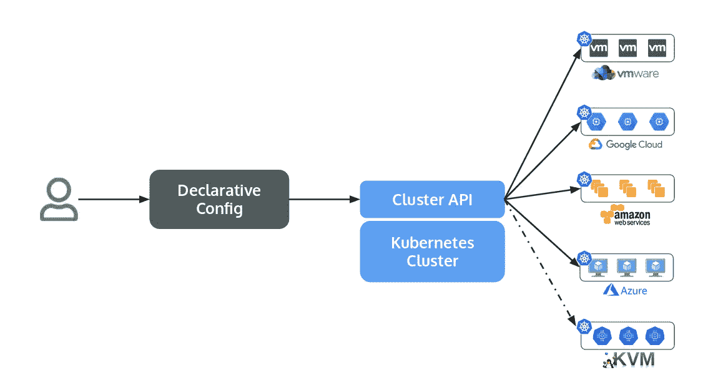
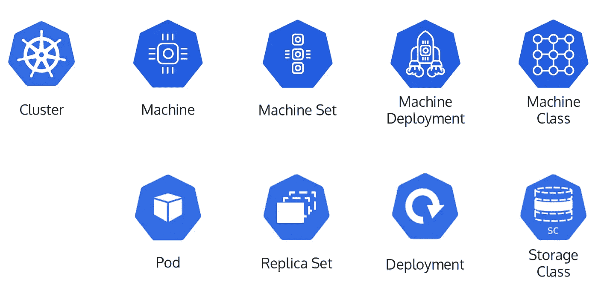
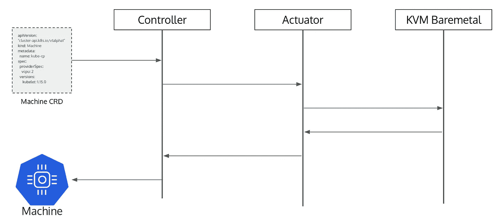
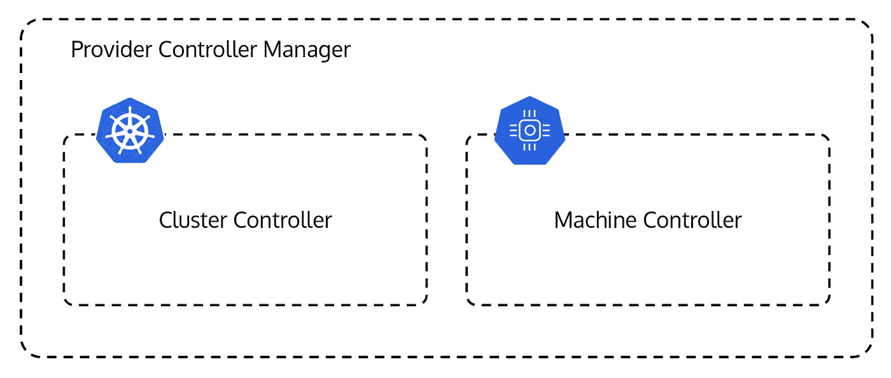
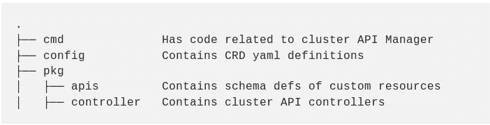

# 如何为在 baremetal 上运行 Kubernetes 集群编写一个集群 API 提供程序

> 原文：<https://itnext.io/kubernetes-cluster-creation-on-baremetal-host-using-cluster-api-1c2373230a17?source=collection_archive---------1----------------------->

**这篇博文是开源峰会 Japan 2019 上呈现的** [**talk**](https://www.slideshare.net/HimaniAgrawal4/using-libvirt-with-cluster-api-to-manage-baremetal-kubernetes) **的总结。** [**演示链接**](https://events.linuxfoundation.org/wp-content/uploads/2018/07/OSS-Japan-Cluster-API-Himani-Agrawal-Giri-Kuncoro.pdf) **。**

供应和管理 Kubernetes 集群一直是一项具有挑战性的任务，尽管从早期开始已经变得容易了。为了使 Kubernetes 的创建和管理更加容易，[集群生命周期 SIG](https://github.com/kubernetes/community/tree/master/sig-cluster-lifecycle) 已经提出了一些工具，如 [kubeadm](https://kubernetes.io/docs/setup/production-environment/tools/kubeadm/create-cluster-kubeadm/) 、 [kops](https://github.com/kubernetes/kops) 等。

kubeadm 是一个与云无关的工具，提供 Kubernetes 集群并处理集群升级，但不涉及基础设施管理领域。

**kops** 处理云资源的创建，在 [AWS](https://github.com/kubernetes/kops/blob/master/docs/aws.md) 和 [GCE](https://github.com/kubernetes/kops/blob/master/docs/tutorial/gce.md) 上安装依赖项和创建 Kubernetes 集群。但是它不支持许多其他基础设施提供商。

虽然这两个只是例子，但是有 70 多种方法可以部署 Kubernetes 集群。

到目前为止缺少的是:

1.  一个声明性的， [Kubernetes 风格的 API](https://kubernetes.io/docs/concepts/overview/kubernetes-api/) ，所以我们可以用我们习惯的方式管理和维护 Kubernetes 基础设施。
2.  与我们已经拥有的工具兼容，例如 [kubectl](https://kubernetes.io/docs/reference/kubectl/overview/) 。
3.  跨多个云提供商提供和管理 Kubernetes 集群的一致方式。
4.  通过单一界面管理基础架构和集群。

为了解决上述问题，SIG 社区启动了一个名为[集群 API](https://github.com/kubernetes-sigs/cluster-api) 的新项目。

# **什么是集群 API？**

集群 API 是 Kubernetes 中集群生命周期 SIG 项目的一部分，为集群创建、配置和管理带来了声明性的、 [Kubernetes 风格的 API](https://kubernetes.io/docs/concepts/overview/kubernetes-api/)。它通过[自定义资源定义(CRD)](https://kubernetes.io/docs/concepts/extend-kubernetes/api-extension/custom-resources/) 在核心 Kubernetes API 之上提供可选的附加功能。



集群 API 功能工作流

虽然项目名称中有“API ”,但它不仅仅是一个 API。它可以被看作是一个框架。它当然提供了一个 API，但也附带了一个协调集群的控制器——创建、更新和删除云中的资源。除了控制器之外，我们还有一个名为`clusterctl`的 CLI，用于从零开始创建新的集群。

用户可以声明性地指定集群规范，比如有多少节点、Kubernetes 的版本等等。集群 API 调用适当的基础设施提供者——AWS、GCP 等。—创建实际的基础架构资源，例如虚拟机、VPC、负载平衡器等。最后，它在这些资源的基础上创建了一个 Kubernetes 集群。

> 在这里，我们将概述集群 API 提供程序组件，以及如何使用 Libvirt 为裸机主机编写集群 API 提供程序。人们可以使用相同的概念为他们选择的基础设施创建新的提供者。

**集群 API 基础知识**

集群 API 使用底层的 [CRDs](https://kubernetes.io/docs/concepts/extend-kubernetes/api-extension/custom-resources/) 来供应和管理 Kubernetes 集群。

它由 Kubernetes 集群上的五个定制资源组成。



它类似于集群 API CRDs 和 Kubernetes 资源

一个**集群**资源提供了一种为要部署的 Kubernetes 集群(也称为目标集群)定义公共配置的方法。如何实际创建集群的实现取决于基础设施提供商。群集定义是在群集资源规范中指定的，它具有一般的群集信息，如网络 CIDRs、API 端点、服务域等。

**机器**资源类似于一个单独的 Kubernetes 控制平面或 Kubernetes 工作节点。机器定义在机器资源规范中指定。它由 kubelet 版本等信息组成。机器资源类似于 Kubernetes 行话中的 **Pod** 。

一个**机器集**资源代表一组机器。MachineSet 的概念来自 ReplicaSet，但是它不是表示一组 pod，而是表示一组机器。

一个 **MachineDeployment** 资源代表机器的部署对象。这类似于 Kubernetes 中的**部署**资源。

一个 **MachineClass** 资源有关于应该创建哪种机器的细节。例如，对于 GCE 提供者，该资源将具有关于机器是否是 n1-standard-1、n1-standard-2 等的细节。这类似于**存储类**资源。

## 集群 API 如何工作

让我们来看看这些资源是什么样子的。我们从机器规格开始。

上面显示的机器规格由集群 API 组件— **机器控制器**使用。该控制器调用**机器执行器**负责创建/更新/删除机器。致动器由供应商指定。



类似地，还有一个维护集群范围状态的集群控制器。

群集控制器和机器控制器一起构成提供者控制器管理器。



# **实施**

让我们把手弄脏吧。带上你的 Linux 机器，让我们一起来解决吧！如果你没有，你也可以在一个嵌套的 KVM 机器上试试，从 DigitalOcean 或者 GCP 或者你自己的实验室得到一个。

> 到本文结束时，我们已经使用集群 API Libvirt 提供程序创建了一个 Kubernetes 控制平面，我们将从头开始编写。

## **系统要求**

一台**支持虚拟化的** Ubuntu 18.04 机器具有以下依赖关系。

*   [戈朗 v1.12.6](https://golang.org/)
*   Libvirt v4.0.0(参考下一节以确保 Libvirt 配置正确)
*   [Docker v18.09.7](https://docs.docker.com/install/linux/docker-ce/ubuntu/)
*   [Kubebuilder v1.0.8](https://book-v1.book.kubebuilder.io/getting_started/installation_and_setup.html)
*   [Kustomize v1.0.11](https://github.com/kubernetes-sigs/kustomize/releases/tag/v1.0.11)
*   [Kubectl v1.13](https://kubernetes.io/docs/tasks/tools/install-kubectl/#install-kubectl-on-linux)
*   [Minikube 1 . 2 . 0 版](https://kubernetes.io/docs/tasks/tools/install-minikube/)
*   [VirtualBox v6.0.8](https://www.virtualbox.org/wiki/Downloads)

**Libvirt 安装&配置**

运行下面的命令来安装`libvirt`以及其他一些相关的包。

```
$ sudo apt-get install -y \
   qemu-kvm \
   libvirt-daemon-system \
   libvirt-clients \
   bridge-utils \
   libvirt-bin
```

将当前用户添加到`libvirt`用户组，以便 libvirt 可以作为非 root 用户使用。

```
$ usermod -a -G libvirt $(whoami)
```

注销并重新登录以使用户组更改生效。

接下来，我们将配置 libvirt，使其接受 TCP 连接。确保`/etc/default/libvirtd`文件如下所示。

```
start_libvirtd="yes"
libvirtd_opts="--listen"
```

更改`/etc/libvirt/libvirtd.conf`文件，使其具有以下配置。

```
# Disable TLS
listen_tls = 0# Enable TCP port
listen_tcp = 1# Add TCP port
tcp_port = "16509"# Setup libvirt socket group
unix_sock_group = "libvirt"# Setup libvirt socket permissions
unix_sock_ro_perms = "0777"
unix_sock_rw_perms = "0770"# Setup libvirt auth
auth_unix_ro = "none"
auth_unix_rw = "none"# Disable TCP auth
auth_tcp = "none"# Enable auth log
audit_logging = 1
```

通过运行命令重新启动 libvirtd 服务

```
$ sudo systemctl restart libvirtd
```

## **创建新的存储库**

现在系统已经配置好了，让我们开始编码吧。我们将首先创建脚手架和样板代码。然后，我们将着手编写业务逻辑。

```
$ mkdir -p ${GOPATH}/src/sigs.k8s.io/cluster-api-provider-libvirt
$ cd ${GOPATH}/src/sigs.k8s.io/cluster-api-provider-libvirt
```

接下来，我们将使用 kubebuilder 来生成脚手架。

**什么是 kubebuilder？**

Kubebuilder 是一个 SDK，用于在 Go 中快速构建和发布 Kubernetes APIs。它建立在用于构建核心 Kubernetes APIs 的规范技术之上，提供简单的抽象来减少样板文件和繁琐的工作。

**生成脚手架**

在新创建的存储库中运行以下命令。

```
$ kubebuilder init --domain cluster.k8s.io --license apache2 --owner "GOJEK Tech"
```

Kubebuilder 会请求你的许可来运行`dep ensure`。当询问时，输入`y`授予许可。

```
Run `dep ensure` to fetch dependencies (Recommended) [y/n]?
y
```

这个命令生成一堆文件。让我们快速看一下它生成的主要文件夹以及它们的用途。



**为机器生成提供者资源**

将`cluster-api`作为依赖项添加到我们的项目中。

```
dep ensure -add sigs.k8s.io/cluster-api@0.1.0
```

现在让我们为 libvirt 提供者定义机器资源。

```
kubebuilder create api --group libvirt --version v1alpha1 --kind LibvirtMachineProviderSpec
```

Kubebuilder 提示我们创建资源和控制器。我们只会创造资源。我们不需要创建新的控制器，因为我们将使用集群 API codebas 中的控制器。

```
Create Resource under pkg/apis [y/n]?
y
Create Controller under pkg/controller [y/n]?
n
```

**寄存器方案**

kubebuilder 生成的管理器只知道我们定义的资源。它不知道公共集群 API 代码中定义的资源。因此，用下面的代码替换`cmd/manager/main.go`中的内容。

**登记控制器**

要注册控制器，将`pkg/controller/add_machine_controller.go`中的代码更改如下。

现在我们有了一个新的集群 API 提供者样板代码。

**定义机器规格**

我们将在结构`LibvirtMachineProviderSpecSpec`中定义机器创建所需的自定义字段。这些值必须由 CRD 的用户在使用该提供程序时提供。

该结构在`pkg/apis/libvirt/v1aplha1/libvirtmachineproviderspec_types.go`中定义。

一旦该结构被修改，运行`make`重新生成相关代码。

**Libvirt 特定代码**

我们现在将在`pkg/cloud/libvirt/domain.go`中添加 libvirt 特定代码

**致动器**

执行器是集群 API 的主要组件之一。在`pkg/cloud/libvirt/actuators/machine/actuator.go`创建一个新的执行器

**Dockerfile**

我们将在 Docker 容器上部署我们的提供者。容器应该已经安装了`libvirt-dev`，因为它是一个`libvirt-xml`依赖项。

**Makefile**

在 Makefile 中更改一些任务。

## 部署提供程序

我们将在 minikube 上部署我们的提供者，我们已经在 kvm hypervisor 上运行了它。

```
$ minikube start --vm-driver kvm2
$ export IMG=himani93/cluster-api-provider-libvirt
$ dep ensure -v
$ make docker-build IMG=${IMG}
$ make docker-push IMG=${IMG}
$ make deploy
```

## 控制平面图像

我们现在将为运行 Kubernetes 控制平面的机器创建基本映像。

**创建启动盘镜像**

我们需要一个安装了 Docker 和 Kubernetes 组件的基本 Ubuntu 映像。这个映像将作为控制面板的引导盘。

请按照资源库[https://github.com/himani93/vm-builder](https://github.com/himani93/vm-builder)中的说明创建此图像或使用您自己的图像。

**创建用户数据图像**

现在，我们为节点初始化创建一个 cloud-init 映像。创建一个名为`user-data`的文件，内容如下。

```
#cloud-config
password: passw0rd
chpasswd: {expire: False}
ssh_pwauth: Trueruncmd:
  - echo "127.0.0.1 kube-cp-01" >> /etc/hosts
  - kubeadm init --pod-network-cidr 10.40.0.0/16
```

下面的文件名为`meta-data`

```
instance-id: kube-cp
local-hostname: kube-cp
```

生成上述 cloud-init 文件的 ISO 映像。

```
$ genisoimage -output user-data.img -volid cidata -joliet -rock user-data meta-data
```

## **创建 Kubernetes 控制平面**

最后，是时候收获我们努力的成果了。我们现在将使用刚刚编写的自定义提供程序创建一个新的 Kubernetes 控制平面。

**定义机床 CRD**

创建`create_machine.yaml`。我们指定要使用的提供者以及创建它所需的其他机器特定信息，如`imageURI`、`userDataURI`等。

终于跑了

```
kubectl apply -f create-machine.yaml
```

现在，机器控制器将创建一个名为`kube-cp`的机器。

可以使用以下方式访问创建的机器

```
virsh console kube-cp
```

机器`kube-cp`上运行的 kubernetes pods 可在登录到机器`kube-cp`后访问。

```
kube-cp$ kubectl --kubeconfig /etc/kubernetes/admin.conf get pods -n kube-system
```

集群 API libvirt 提供程序控制器管理器日志可以使用

```
kubectl logs -f cluster-api-provider-libvirt-controller-manager-0 -n cluster-api-provider-libvirt-system -c manager
```

## 结论:

集群 API 可以使用声明式 API 提供基础设施和 Kubernetes 集群。它可以跨不同的云提供商运行，还可以灵活地定义基础架构和集群的供应。

该项目仍处于 alpha 阶段，没有被广泛采用。

## 参考资料:

[https://blogs . VMware . com/cloud native/2019/03/14/what-and-why-of-cluster-API/](https://blogs.vmware.com/cloudnative/2019/03/14/what-and-why-of-cluster-api/)

[https://blogs . VMware . com/cloud native/2019/05/14/cluster-API-kubernetes-life cycle-management/](https://blogs.vmware.com/cloudnative/2019/05/14/cluster-api-kubernetes-lifecycle-management/)

[https://blog . hep TiO . com/the-kubernetes-cluster-API-de 5a 1 ff 870 a 5](https://blog.heptio.com/the-kubernetes-cluster-api-de5a1ff870a5)

## 想了解关于集群 API 的更多信息:

集群 API 松弛通道: [#cluster-api](http://slack.k8s.io/)

集群 API Github Repo:[https://github.com/kubernetes-sigs/cluster-api](https://github.com/kubernetes-sigs/cluster-api)

集群 API git book:[https://cluster-api.sigs.k8s.io/](https://cluster-api.sigs.k8s.io/)