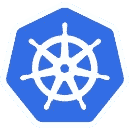
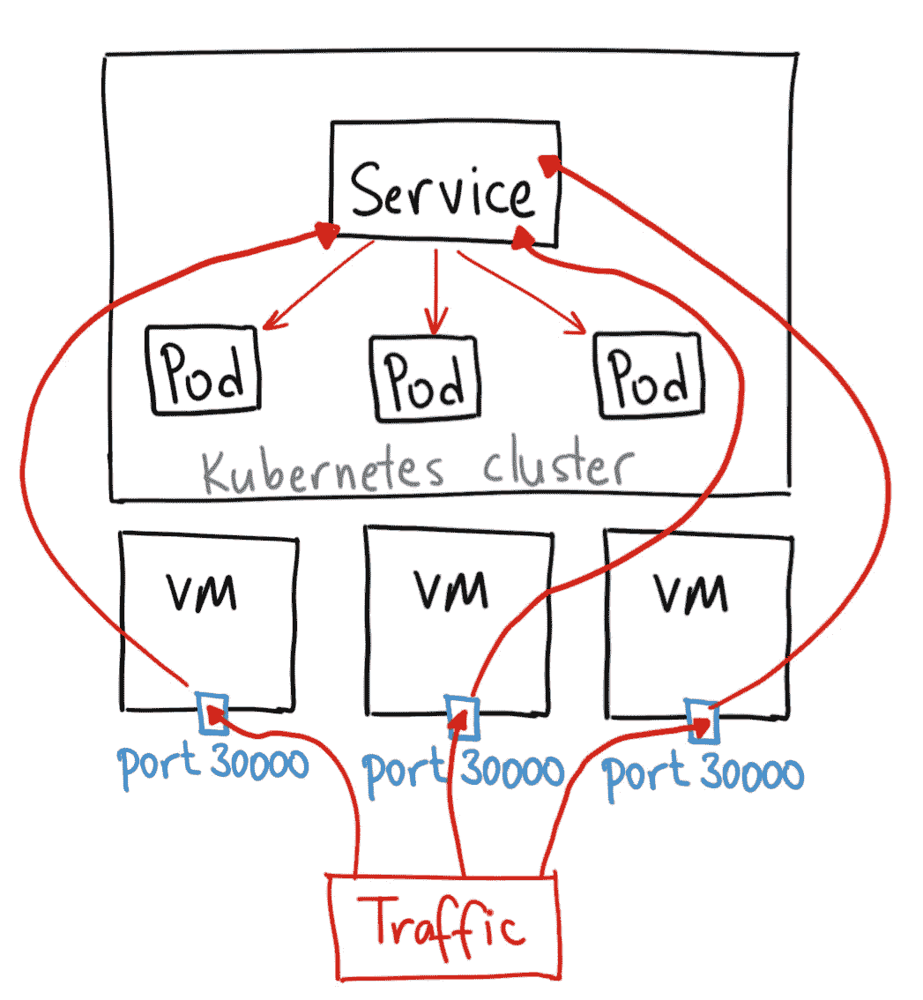
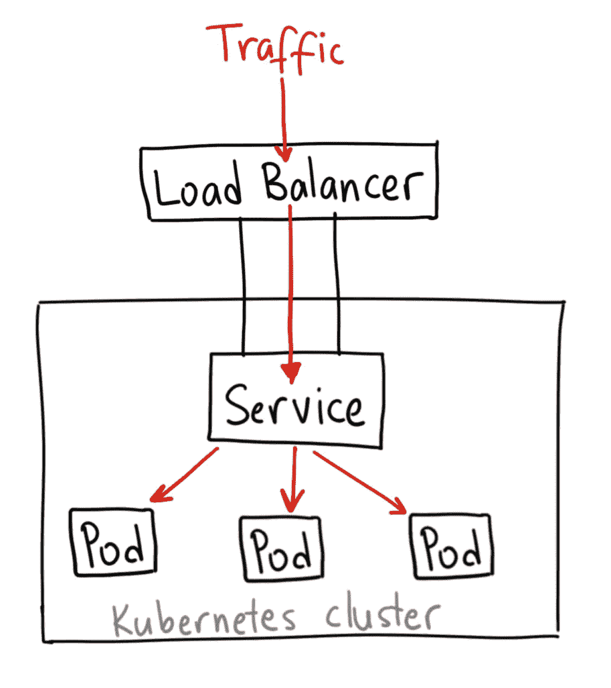
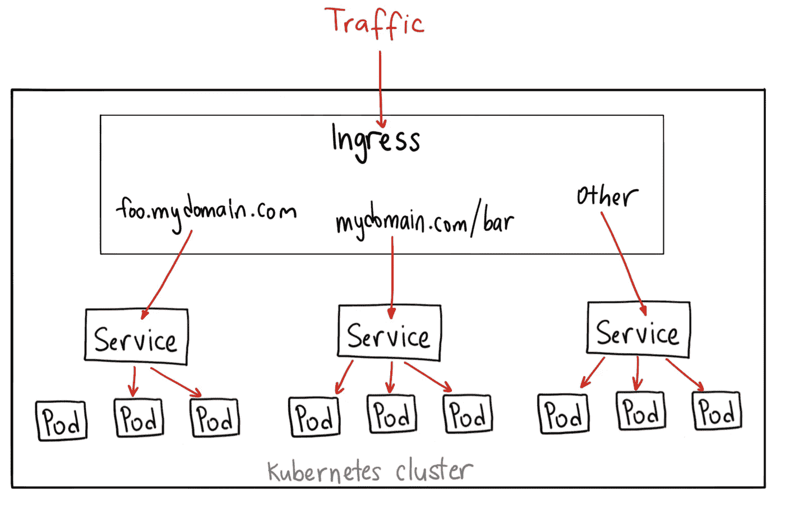
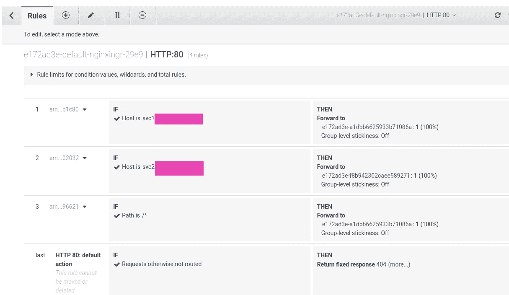

# Kubernetes:集群 IP 与节点端口与负载平衡器、服务和入口—示例概述

> 原文：<https://itnext.io/kubernetes-clusterip-vs-nodeport-vs-loadbalancer-services-and-ingress-an-overview-with-722a07f3cfe1?source=collection_archive---------1----------------------->



对于网络通信，Kubernetes 提供了四种服务类型— `ClusterIP`(默认)、`NodePort`、`LoadBalancer`和`ExternalName`，以及`Ingress`资源。

在这篇文章中，我们将对它们进行一个简短的概述，并检查它们是如何工作的。

文档可在此处获得— [发布服务(服务类型)](https://kubernetes.io/docs/concepts/services-networking/service/#publishing-services-service-types)。

我使用的是 AWS Elastic Kubernetes 服务，所以请记住，我们有 AWS 虚拟私有云以及 AWS 应用程序负载平衡器。

# 网络和 Kubernetes

在 Kubernetes 集群中，您可能需要使用以下网络场景:

*   容器之间的直接通信—由 *Pod* 抽象提供，容器通过同一 Pod 内的本地主机相互访问—参见[Pod](https://kubernetes.io/docs/concepts/workloads/pods/pod/)
*   集群范围内 Pod 之间的通信——由网络插件提供，对于 AWS EKS，参见[用于 Kubernetes 的 AWS VPC CNI](https://kubernetes.io/docs/concepts/cluster-administration/networking/#aws-vpc-cni-for-kubernetes)
*   从 Pod 到服务的连接—由服务抽象提供，例如— `ClusterIP`
*   从世界到集群中的 pod 的连接—由服务抽象提供，使用外部资源，例如— AWS 负载平衡器

Kubernetes 中服务的主要目标是提供对其 pod 的持久访问，而不必在每次重新创建这样的 Pod 时都寻找 Pod 的 IP。

此外，服务可以在相似的 pod 之间提供最小的负载平衡，参见[服务](https://kubernetes.io/docs/concepts/services-networking/service/#virtual-ips-and-service-proxies)。

# 准备

为了进行测试，让我们使用一个带有 NGINX web 服务器的 pod 创建一个部署，该部署将接受到其端口 80 的连接:

```
$ kubectl create deployment nginx --image=nginx
deployment.apps/nginx created
```

检查:

```
$ kk get deploy nginx
NAME READY UP-TO-DATE AVAILABLE AGE
nginx 1/1 1 1 53s
```

因为服务将根据标签来查找 pod，所以让我们检查一下此部署有哪些标签:

```
$ kubectl get deploy nginx -o jsonpath=’{.metadata.labels}’
map[app:nginx]
```

好的——这是带有 *nginx* 值的 *app* 标签——记住它。

## `kubectl port-forward`

为了确保我们的 pod 启动并运行，并且能够处理到端口 80 的传入连接，让我们使用`[kubectl port-forward](https://kubernetes.io/docs/tasks/access-application-cluster/port-forward-access-application-cluster/)`。在我们检查它是否工作之后——我们可以从 Kubernetes 集群端开始使用网络设置。

找到 pod 的名称:

```
$ kubectl get pod
NAME READY STATUS RESTARTS AGE
nginx-554b9c67f9-rwbp7 1/1 Running 0 40m
```

将其作为第一个参数传递给`kubectl port-forward`，然后指定一个本地端口( *8080* )和 pod 上的端口( *80* ):

```
$ kubectl port-forward nginx-554b9c67f9-rwbp7 8080:80
Forwarding from [::1]:8080 -> 80
```

从本地机器检查到 Kubernetes 集群中 NGINX pod 的连接:

```
$ curl localhost:8080
<!DOCTYPE html>
<html>
<head>
<title>Welcome to nginx!</title>
…
```

酷—“管用！”，我们有一个工作舱，现在我们可以用它来为我们的服务。

# Kubernetes 服务类型—概述

让我们简要概述一下每种类型，然后从示例开始:

1.  `**ClusterIP**`:默认类型，将从集群的池中创建一个具有 IP 地址的服务资源，这样的服务将只在集群内部可用(或使用`[kube-proxy](https://rtfm.co.ua/?p=24328kubectl_proxy)`
2.  `**NodePort**`:将在每个 worker node e eс2 上打开一个 TCP 端口，“在它后面”将自动创建一个`ClusterIP`服务，并将流量从ес2 上的这个 TCP 端口路由到这个`ClusterIP`——这样的服务将可以从全世界(显然，如果 EC2 有公共 IP)或在 VPC 内访问
3.  `**LoadBalancer**`:将创建一个外部负载平衡器(AWS Classic LB)，“在其后面”将自动创建一个`NodePort`，然后是`ClusterIP`，并以这种方式将流量从负载平衡器路由到集群中的一个单元
4.  `**ExternalName**`:类似 DNS-proxy 的东西-响应这样的服务将返回一个通过 CNAME 获取的记录，该记录在`externalName`中指定

## ClusterIP

最简单的类型，默认的那种。

将开放对群集中应用程序的访问，而不允许外界访问。


例如，可以使用它来访问缓存服务，使名称空间中的所有 pod 都可以访问该服务。

让我们使用下一个 Kubernetes 清单:

```
---
apiVersion: v1
kind: Service
metadata:
  name: "nginx-service"
  namespace: "default"
spec:
  ports:
    - port: 80
  type: ClusterIP
  selector:
    app: "nginx"
```

创建服务:

```
$ kubectl apply -f nginx-svc.yaml
service/nginx-service created
```

检查一下:

```
$ kk get svc nginx-service
NAME TYPE CLUSTER-IP EXTERNAL-IP PORT(S) AGE
nginx-service ClusterIP 172.20.54.138 <none> 80/TCP 38s
```

## `kubectl proxy`和服务域名系统

因为`ClusterIP`服务类型只能从集群中访问——我们可以使用`[kubectl proxy](https://kubernetes.io/docs/tasks/access-kubernetes-api/http-proxy-access-api/#using-kubectl-to-start-a-proxy-server)`来测试它——这将打开一个到 API 服务器的本地 TCP 端口，然后我们可以使用它来访问我们的 NGINX。

启动代理:

```
$ kubectl proxy --port=8080
Starting to serve on 127.0.0.1:8080
```

现在，知道了我们的服务名——我们在`metadata: name`中设置它——我们可以打开到 *localhost:8080* 的连接，然后通过名称空间名称连接到服务本身:

```
$ curl -L localhost:8080/api/v1/namespaces/default/services/nginx-service/proxy
<!DOCTYPE html>
<html>
<head>
<title>Welcome to nginx!</title>
…
```

或者只是可以获得关于服务的信息:

```
$ curl -L localhost:8080/api/v1/namespaces/default/services/nginx-service/
{
“kind”: “Service”,
“apiVersion”: “v1”,
“metadata”: {
“name”: “nginx-service”,
“namespace”: “default”,
“selfLink”: “/api/v1/namespaces/default/services/nginx-service”,
```

…

所以，`ClusterIP`:

*   将提供对 Kubernetes 集群中的应用程序的访问，但不从外部访问
*   将使用集群 IP 池中的 IP，并可通过集群范围内的 DNS 名称进行访问，请参见[服务和 pod 的 DNS](https://kubernetes.io/docs/concepts/services-networking/dns-pod-service/)

## `NodePort`

现在，让我们仔细看看`NodePort`服务类型。

使用这种类型，Kubernetes 将在每个 WorkerNode 上打开一个 TCP 端口，然后通过在所有节点上工作的`[kube-proxy](https://kubernetes.io/docs/reference/command-line-tools-reference/kube-proxy/)`将请求从这个 TCP 端口代理到这个节点上的一个 pod。



更新我们的清单:

```
---
apiVersion: v1
kind: Service
metadata:
  name: "nginx-service"
  namespace: "default"
spec:
  ports:
    - port: 80
      nodePort: 30001
  type: NodePort
  selector:
    app: "nginx"
```

这里的`nodePort`参数是可选的，这里添加只是为了举例。如果没有它，Kubernetes 将从 30000-32767 端口范围内分配一个端口。

更新服务:

```
$ kubectl apply -f nginx-svc.yaml
service/nginx-service configured
```

检查一下:

```
$ kubectl get svc nginx-service
NAME TYPE CLUSTER-IP EXTERNAL-IP PORT(S) AGE
nginx-service NodePort 172.20.54.138 <none> 80:30001/TCP 20h
```

并检查 EC2 实例上的端口:

```
[root@ip-10–3–49–200 ec2-user]# netstat -anp | grep 30001
tcp6 0 0 :::30001 :::* LISTEN 5332/kube-proxy
```

显然，如果 WorkerNodes 被放在私有子网中，并且它们不能从外部访问——这样的服务就不能用于从网络外部访问应用程序。

不过，您仍然可以从同一个网络访问 NGINX 应用程序，例如从 Bastion-host:

```
[ec2-user@ip-10–3–49–200 ~]$ curl 10.3.49.200:30001
<!DOCTYPE html>
<html>
<head>
<title>Welcome to nginx!</title>
…
```

所以，`NodePort`式为:

*   绑定到一个特定的宿主，比如ес2
*   如果主机在世界上不可用，那么这样的服务将不会提供对 pod 的外部访问
*   将使用提供商池中的 IP，例如 AWS VPC CIDR
*   将仅在同一工作节点上提供对 pod 的访问

## `LoadBalancer`

最常用的服务类型。

对于 AWS —将创建一个 AWS 负载平衡器，默认情况下为经典类型，它会将流量代理到与此负载平衡器关联的 TargetGroup 的所有ес2 实例，然后通过`NodePort`服务代理到所有 pod。



在这样的负载平衡器上，您可以[使用 TLS](https://kubernetes.io/docs/concepts/services-networking/service/#ssl-support-on-aws) ，可以使用各种负载平衡器类型——内部/外部，等等，请参见[其他 ELB 注释](https://kubernetes.io/docs/concepts/services-networking/service/#other-elb-annotations)。

更新清单:

```
---
apiVersion: v1
kind: Service
metadata:
  name: "nginx-service"
  namespace: "default"
spec:
  ports:
    - port: 80
  type: LoadBalancer
  selector:
    app: "nginx"
```

应用它:

```
$ kubectl apply -f nginx-svc.yaml
service/nginx-service configured
```

检查:

```
$ kubectl get svc nginx-service
NAME TYPE CLUSTER-IP EXTERNAL-IP PORT(S) AGE
nginx-service LoadBalancer 172.20.54.138 ac8415de24f6c4db9b5019f789792e45–443260761.us-east-2.elb.amazonaws.com 80:30968/TCP 21h
```

请稍等几分钟，您的 DSN 将会更新，并检查所创建的平衡器的 URL:

```
$ curl ac8415de24f6c4db9b5019f789792e45–443260761.us-east-2.elb.amazonaws.com
<!DOCTYPE html>
<html>]
<head>
<title>Welcome to nginx!</title>
…
```

使用这种类型不能使用主机或基于路径的路由，请参见[应用负载平衡器与传统负载平衡器](https://cloudacademy.com/blog/application-load-balancer-vs-classic-load-balancer/)。

实际上，为了在 AWS **应用**负载均衡器上拥有所有的可能性，我们可以使用另一种服务类型— `Ingress`，我将在这篇文章的[入口](https://rtfm.co.ua/kubernetes-clusterip-vs-nodeport-vs-loadbalancer-services-i-ingress-obzor-primery/#Ingress)部分简要介绍它。

所以，`LoadBalancer`服务类型:

*   将提供外部进入吊舱的通道
*   将为不同 EC2 上的 pod 提供基本的负载平衡
*   将提供终止 SSL/TLS 会话的能力
*   不支持 7 级路由

## `ExternalName`

另一种服务类型是`ExternalName`，它会将请求重定向到其`externalName`参数中指定的域:

```
---
apiVersion: v1
kind: Service
metadata:
  name: "google-service"
  namespace: "default"
spec:
  ports:
    - port: 80
  type: ExternalName
  externalName: google.com
```

创建它:

```
$ kubectl apply -f nginx-svc.yaml
service/google-service created
```

检查服务:

```
$ kubectl get svc google-service
NAME TYPE CLUSTER-IP EXTERNAL-IP PORT(S) AGE
google-service ExternalName <none> google.com 80/TCP 33s
```

并检查它是如何工作的——转到 NGINX pod 并使用`dig`实用程序来检查 DNS 记录:

```
root@nginx-554b9c67f9-rwbp7:/# dig google-service.default.svc.cluster.local +short
google.com.
172.217.8.206
```

在这里，我们请求一个本地 DNS 名称为 *google-servic* e，它被解析为在`externalName`中设置的*google.com*域的一个 IP。

# `Ingress`

实际上，`Ingress`并不是一个专用的服务——它只是描述了 Kubernetes 入口控制器创建负载平衡器的一组规则，它的监听器和路由规则。

这里的文献资料是[>>>](https://kubernetes.io/docs/concepts/services-networking/ingress/)。

在 AWS 的情况下，它将是 ALB 入口控制器——参见亚马逊 EKS 上的 [ALB 入口控制器](https://docs.aws.amazon.com/eks/latest/userguide/alb-ingress.html)和 [AWS 弹性 Kubernetes 服务:运行 ALB 入口控制器](https://rtfm.co.ua/en/aws-elastic-kubernetes-service-running-alb-ingress-controller/)。

为了让它工作，`Ingress`需要一个额外的服务，其中`Ingress`将把流量路由到一种后端。



对于 ALB 入口控制器，具有`Ingress`及其服务的清单可以是下一个:

```
---
apiVersion: v1
kind: Service
metadata:
  name: "nginx-service"
  namespace: "default"
spec:
  ports:
    - port: 80
  type: NodePort
  selector:
    app: "nginx"
--- 
apiVersion: extensions/v1beta1
kind: Ingress
metadata:
  name: "nginx-ingress"
  annotations:
    kubernetes.io/ingress.class: alb
    alb.ingress.kubernetes.io/scheme: internet-facing
  labels:
    app: "nginx"
spec:
  backend:
    serviceName: "nginx-service"
    servicePort: 80
```

这里我们创建了一个类型为`NodePort`的服务和类型为 ALB 的`Ingress`。

Kubernetes 将创建一个`Ingress`对象，然后 *alb-ingress-controller* 将看到它，将使用来自`Ingress`的`spec`的路由规则创建一个 AWS ALBс，将使用`NodePort`端口创建一个服务对象，然后将在 WorkerNodes 上打开一个 TCP 端口，并开始通过服务将流量从 clients = >路由到负载平衡器= >再到 EC2 = >上的 NodePort。

让我们检查一下。

该服务:

```
$ kubectl get svc nginx-service
NAME TYPE CLUSTER-IP EXTERNAL-IP PORT(S) AGE
nginx-service NodePort 172.20.54.138 <none> 80:30968/TCP 21h
```

`Ingress`:

```
$ kubectl get ingress nginx-ingress
NAME HOSTS ADDRESS PORTS AGE
nginx-ingress * e172ad3e-default-nginxingr-29e9–1405936870.us-east-2.elb.amazonaws.com 80 5m22s
```

和负载平衡器的 URL:

```
$ curl e172ad3e-default-nginxingr-29e9–1405936870.us-east-2.elb.amazonaws.com
<!DOCTYPE html>
<html>
<head>
<title>Welcome to nginx!</title>
…
```

“管用！”

## 基于路径的路由

在上面的例子中，我们将把来自 ALB 的所有流量发送到同一个服务及其 pod。

通过使用`Ingress`和 it 规则，我们还可以根据请求的 URI 来指定将流量发送到特定后端的规则。

那么，让我们旋转两个 NGINX pods:

```
$ kubectl create deployment nginx-1 --image=nginx
deployment.apps/nginx-1 created$ kubectl create deployment nginx-2 --image=nginx
deployment.apps/nginx-2 created
```

在每个文件上创建一个文件，但内容不同:

```
$ kubectl exec nginx-1–75969c956f-gnzwv --bash -c "echo svc-1 > /usr/share/nginx/html/sv1.html"$ kubectl exec nginx-2-db55bc45b-lssc8 --bash -c "echo svc-2 > /usr/share/nginx/html/svc2.html"
```

更新清单文件，增加一个服务，为有两个后端的`Ingress`设置规则:

```
---
apiVersion: v1
kind: Service
metadata:
  name: "nginx-1-service"
  namespace: "default"
spec:
  ports:
    - port: 80
  type: NodePort
  selector:
    app: "nginx-1"
---
apiVersion: v1
kind: Service
metadata:
  name: "nginx-2-service"
  namespace: "default"
spec:
  ports:
    - port: 80
  type: NodePort
  selector:
    app: "nginx-2"    
---
apiVersion: extensions/v1beta1
kind: Ingress
metadata:
  name: "nginx-ingress"
  annotations:
    kubernetes.io/ingress.class: alb
    alb.ingress.kubernetes.io/scheme: internet-facing
  labels:
    app: "nginx"
spec:
  rules:
  - http:
      paths:
      - path: /svc1.html
        backend:
          serviceName: "nginx-1-service"
          servicePort: 80
      - path: /svc2.html
        backend:
          serviceName: "nginx-2-service"
          servicePort: 80
```

这里我们设置了两条规则:如果 svc1.html = =/*或 svc2.html/*——则相应地将流量发送到 *nginx-1* 或 *nginx-2* 。**

**部署它:**

```
**$ kubectl apply -f nginx-svc.yaml
service/nginx-1-service created
service/nginx-2-service created
ingress.extensions/nginx-ingress configured**
```

**检查规则:**

```
**$ kubectl describe ingress nginx-ingress
…
Rules:
Host Path Backends
 — — — — — — — — 
*
/svc1.html nginx-1-service:80 (<none>)
/svc2.html nginx-2-service:80 (<none>)
…**
```

**检查一下——向 svc1.html 的 URIs *和 svc2.html 的*发出请求:****

```
*$ curl e172ad3e-default-nginxingr-29e9–1405936870.us-east-2.elb.amazonaws.com/svc1.htmlsvc-1$ curl e172ad3e-default-nginxingr-29e9–1405936870.us-east-2.elb.amazonaws.com/svc2.htmlsvc-2*
```

## *基于名称的路由*

*另一个例子是基于主机名的路由。*

*让我们创建三个 DNS 记录——*svc1.example.com*、*svc2.example.com*和*svc.example.com*，然后通过 CNAME 记录将它们指向我们从`Ingress`资源创建的负载平衡器 URL。*

*然后，更新清单:*

```
*---
apiVersion: v1
kind: Service
metadata:
  name: "nginx-1-service"
  namespace: "default"
spec:
  ports:
    - port: 80
  type: NodePort
  selector:
    app: "nginx-1"
---
apiVersion: v1
kind: Service
metadata:
  name: "nginx-2-service"
  namespace: "default"
spec:
  ports:
    - port: 80
  type: NodePort
  selector:
    app: "nginx-2"    
---
apiVersion: extensions/v1beta1
kind: Ingress
metadata:
  name: "nginx-ingress"
  annotations:
    kubernetes.io/ingress.class: alb
    alb.ingress.kubernetes.io/scheme: internet-facing
  labels:
    app: "nginx"
spec:
  rules:
  - host: "svc1.example.com"
    http:
      paths:
      - backend:
          serviceName: "nginx-1-service"
          servicePort: 80
  - host: "svc2.example.com"
    http:
      paths:
      - backend:
          serviceName: "nginx-2-service"
          servicePort: 80
  - http:
      paths:      
      - backend:
          serviceName: "nginx-1-service"
          servicePort: 80*
```

*这里我们没有对服务做任何修改，但是在规则中，我们设置了一个对 svc1.example.com 的请求必须发送到服务 1 的 T1、服务 2 的 svc2.example.com、服务 2 的 T2、服务 1 的 svc.example.com、服务 1 的 T4。*

*检查一下:*

```
*$ curl svc1.example.com
svc-1$ curl svc2.example.comsvc-2$ curl svc.example.com
svc-1*
```

*并在 AWS 控制台中检查负载平衡器的侦听器上的规则:*

**

*“那都是乡亲们！”*

**最初发布于* [*RTFM: Linux、DevOps、系统管理*](https://rtfm.co.ua/en/kubernetes-clusterip-vs-nodeport-vs-loadbalancer-services-and-ingress-an-overview-with-examples/) *。**