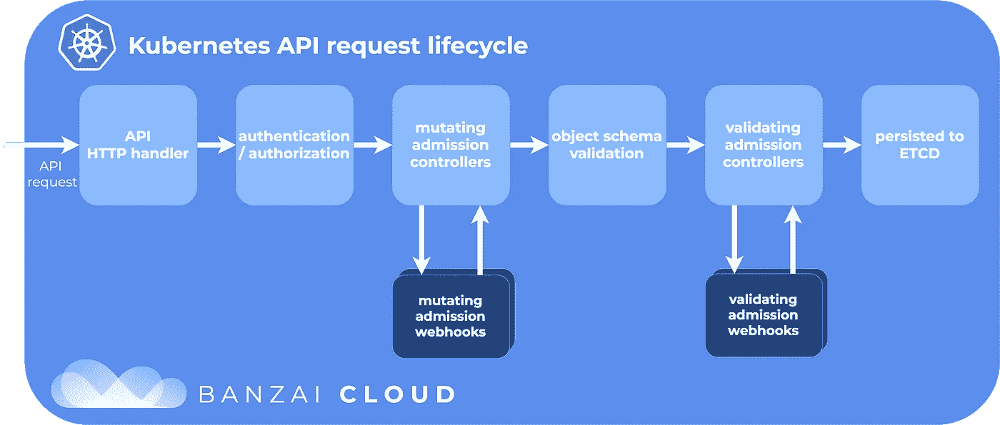
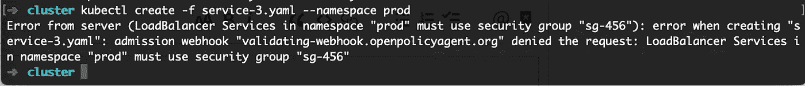

# Kubernetes 遵从开放策略代理

> 原文：<https://itnext.io/kubernetes-compliance-with-open-policy-agent-3d282179b1e9?source=collection_archive---------2----------------------->

西奥·托马迪斯在 [Unsplash](https://unsplash.com?utm_source=medium&utm_medium=referral) 上拍摄的照片

在一家对云基础架构实施合规性控制的企业中，EKS 提出了一个有趣的挑战。

考虑一个组织政策，该政策禁止开发人员将开发环境中的服务暴露给公共互联网。在 Fargate 或 ECS 环境中，可以在云形成审查阶段强制执行该策略。但是，EKS 集群的默认配置允许开发人员定义入口或服务，从而创建弹性负载平衡器。审查云形成模板不再足以确保全面的基础设施控制和可见性。

为了保持所需的控制级别，有必要在堆栈中向下移动一层，并在 Kubernetes 级别强制执行。

要在 EKS 集群中解决这个问题，您有几个选择，取决于您对“解决”的定义:
-手动检查部署到集群的所有对象，以确保它们符合标准
-使用 Kubernetes [准入控制器](https://kubernetes.io/docs/reference/access-authn-authz/admission-controllers/)在集群级别强制执行该策略
-取消 EKS 通过 IAM 创建和管理 elb 的能力

第一个选项提供了一些保护，应该合并到代码审查过程中，但是引入了错误的空间，并且不能很好地伸缩。

第二种选择最终更加安全，因为它确保即使有人绕过 CICD 管道，策略也能得到执行。这允许开发人员获得他们可以访问的沙箱集群，同时仍然确信他们的集群配置阻止他们向公共互联网公开服务。

第三种选择是大锤方法，但在某些情况下可能是合适的——如果你永远不希望 EKS 创造一个 ELB，为什么不完全取消许可呢？

我的目标是研究第二个选项，并使用准入控制器来实现以下场景:

*   服务无法创建负载平衡器
*   如果服务拥有所需的静态注释，它们可以创建负载平衡器
*   如果服务拥有目标名称空间所需的注释，它们就可以创建负载平衡器

# 开放策略代理

[开放策略代理](https://www.openpolicyagent.org)是一个通用策略引擎，可用于在一系列应用中实施策略。它充当一个策略中间件应用程序——策略在 OPA 中定义，应用程序查询 OPA 以做出决策。它本质上提供了策略即服务，并将策略从应用程序配置中分离出来。

OPA 文档包含一个验证准入控制器的[示例，它在创建、删除或更新 Kubernetes 对象之前强制执行它们的语义验证。](https://www.openpolicyagent.org/docs/kubernetes-admission-control.html)

准入控制器在请求被认证之后但在对象被持久存储到存储器之前被执行。对请求进行身份验证后，Kubernetes 向 OPA 发送一个 webhook。webhook 响应控制是否允许请求继续。

来源:坂仔云

关于准入控制器架构和工作流程的更多细节，请参见[这篇博文](https://banzaicloud.com/blog/k8s-admission-webhooks/)。

# 安装 OPA

我首先根据[文档](https://www.openpolicyagent.org/docs/kubernetes-admission-control.html)安装和配置 OPA。

在 minikube 或 Docker for Mac 中运行本地 Kubernetes 集群时，一切都是现成的。如果在 AWS EKS 中运行，请确保允许集群控制平面安全组访问端口 443 上的 worker 节点安全组，否则 Kubernetes 主服务器将无法向 OPA 发送 webhook，并且所有 kubectl 命令都将超时。

策略是用[减压阀语言](https://www.openpolicyagent.org/docs/language-reference.html)编写的，乍一看有些不直观，策略存储在“opa”名称空间的 ConfigMaps 中。OPA 将自动加载该名称空间中的任何配置映射。

## 阻止所有负载平衡器服务

在示例中，OPA 被配置为“默认允许”模式——除了那些被明确拒绝的请求之外，所有请求都被允许。策略文档将由对于不符合的资源评估为真的规则组成。

第一条规则应该阻止创建任何 LoadBalancer 类型的服务。这在减压阀可以写成:

在英语中，这条规则说:

*   如果正在创建的对象类型是服务，并且
*   如果请求操作是创建，并且
*   如果服务类型是负载平衡器，则
*   拒绝请求。

我创建了一个示例服务来测试该策略:

尝试创建此服务导致错误“不允许负载平衡器服务”。

## 实施注释策略

全局禁用负载平衡器是一个非常棘手的解决方案。如果我们希望允许负载平衡器，但前提是它们符合某些要求，那该怎么办？

Kubernetes 使用服务注释来配置负载平衡器。在 AWS 中，这些可以用来配置安全组、SSL 证书和访问日志记录。例如，可以通过用*serviceβkubernetes . io/AWS-load-balancer-SSL-cert = arn:AWS:ACM:…*注释服务来将 SSL 证书添加到 ELB。

考虑到这一点，我们可以定义一个允许负载平衡器的策略，但前提是它们使用已知的安全组。在本例中，我们将确保负载平衡器使用安全组 sg-123。

这在减压阀表现为:

我创建了一个示例服务，它缺少安全组注释:

尝试创建此服务失败，出现“负载平衡器类型的服务必须使用安全组 sg-123”。添加缺少的注释后，服务创建成功。

## 动态注释

前面的例子引入了对资源创建更细粒度的控制，但是对资源(如安全组)的硬编码引用不是一个可伸缩的解决方案。此外，所需的安全组可能会因集群环境而异。高级策略可能会说“开发环境只能暴露于公司 IP 范围”。以可伸缩的方式实现这一点需要可以利用动态数据的策略——在这种情况下，为特定的名称空间查找允许的安全组。

幸运的是，OPA 可以使用各种来源的数据，并将其纳入政策制定决策中。

在教程中，OPA 以标记“—replicate-cluster = v1/namespaces”开始。这导致 OPA 不断复制 Kubernetes 名称空间状态，使得名称空间及其元数据在策略评估期间可用。

我们可以在名称空间的注释中存储任意数据。我们将使用它来存储对名称空间中允许的安全组的引用。只有当服务引用目标名称空间的正确安全组时，才允许服务。

我创建了两个名称空间，配置如下:

然后，我创建了以下策略:

该规则将服务规范中给定的安全组与目标名称空间允许的安全组进行比较。例如，如果 dev 名称空间中的服务引用 prod 名称空间中使用的安全组，则请求被拒绝。

为了验证这一点，我创建了一个负载平衡服务，它使用 dev 名称空间的安全组:

我在 dev 名称空间中创建了这个服务，没有任何错误。尝试在 prod 命名空间中创建相同的服务时，如预期的那样失败:

成功！任何将不合规的基础架构部署到群集的尝试都将失败，部署日志将解释失败的原因。

# 结论

Kubernetes 提供了在集群级别实施策略所需的原语，但是它们需要一些配置和管理。正如 Kelsey Hightower 所说，Kubernetes 是一个搭建平台的平台。

OPA 有一个陡峭的学习曲线，但它提供了大量的能力和灵活性作为回报。拥有一个通用的决策即服务工具引入了一系列有趣的可能性。

到目前为止，所有的例子都是在 Kubernetes 许可控制周期的上下文中——YAML 资源定义在创建之前就被验证了。如果开发人员试图部署不兼容的基础架构，他们只会在部署失败时才发现。在构建和发布周期的早期让开发人员注意到这个问题会更有效，这样可以避免由于遵从性错误导致的[周期时间](https://www.gocd.org/2018/01/31/continuous-delivery-metrics/)的增加。

在技术层面上，Kubernetes 准入控制者只是将 YAML 定义交给 OPA，并请求批准继续。OPA 根据定义的策略验证 YAML 并做出决定。

因为验证过程与准入控制无关，所以 YAML 文件可以作为用于交付 Kubernetes 资源的 CICD 过程的一部分提交给 OPA。

这意味着同一策略规则集可以在管道中的多个阶段进行验证和实施。在 CICD 过程中，OPA 充当质量检查的角色，尽早通知开发人员他们的更改将不被允许。在 Kubernetes 准入控制流程中，OPA 充当了一个强制工具，防止创建不兼容的基础设施。

将遵从性视为代码意味着采用软件开发过程中的最佳实践。其中之一就是不要重复自己。将策略从应用程序中分离出来，并在多个位置重用策略定义，是这个规则的一个很好的实现。

云原生合规性监控三巨头的最后一个组成部分是与 CloudTrail 等服务集成，以便在检测到不合规的基础架构时提供实时警报。然后，可以使用一个策略规则集来实现三个目标:

1)预发布:CICD 流程可防止开发人员交付不合规的基础架构
2)预部署:Kubernetes 可防止部署不合规的基础架构
3)部署后:CloudTrail 可提供审核跟踪，证明所有基础架构在创建时都是合规的，并可识别任何因政策变更而变得不合规的基础架构

第一个使部署兼容的基础设施变得容易。
第二个原因是无法部署不合规的基础设施。
第三个证明另外两个有效。

总之，OPA 是一个有趣且灵活的工具，其操作模型非常适合云原生环境。Kubernetes 准入控制器代表了在集群中实施策略的理想接口。