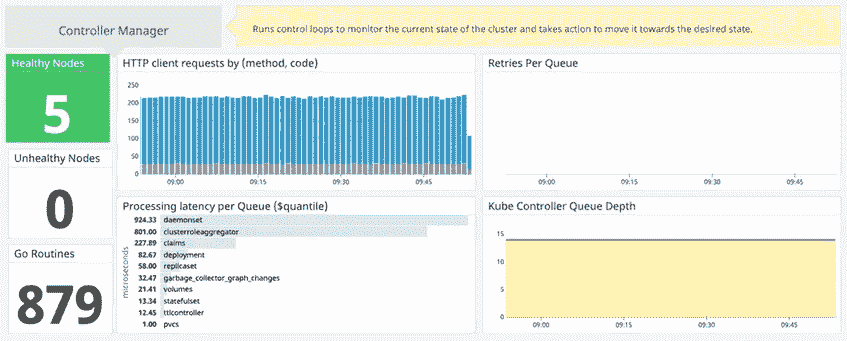

# 使用 Datadog 和 Helm 监控 Kubernetes 控制平面

> 原文：<https://itnext.io/kubernetes-control-plane-monitoring-using-datadog-and-helm-6c2daf2039d8?source=collection_archive---------6----------------------->


# 简介:

Datadog 是最棒的监控工具之一。它们提供了与不同云提供商和开源工具的惊人集成。他们支持 kubernetes 监控已经有一段时间了，但是还不支持控制平面监控。Kubernetes 控制平面的各个部分，如 Kubernetes 主进程和 kubelet 进程，控制着 Kubernetes 如何与集群通信。控制平面维护系统中所有 Kubernetes 对象的记录，并运行连续的控制循环来管理这些对象的状态。与控制平面相关的问题可能会导致群集范围的中断，因此监控控制平面非常重要。以下是运行在 Kubernetes 主节点上的 Kubernetes 控制平面的四个组件，datadog 可以从 2019 年 6 月开始对其进行监控:

*   **kube-API server:**kubernetes 控制平面的前端，充当所有组件与集群通信的通信枢纽。
*   **etcd:** 一致且高度可用的键值存储，用作 Kubernetes 所有集群数据的后备存储，例如集群配置、运行组件的期望状态等。
*   **kube-scheduler:** 监视新创建的没有分配节点的 pod，并为它们选择一个节点来运行。
*   kube-controller-manager: 它是一个守护进程，嵌入了 Kubernetes 附带的核心控制循环。它通过 API 服务器监视功能监视集群的状态，并进行更改以将集群移向所需的状态。

需要设置 Datadog 代理来监控您的基础架构。Datadog 代理将指标和日志发送到您的 datadog 帐户。您可以将来自多个集群的指标和日志发送到您的 Datadog 组织，为此您需要一个应用密钥和 api 密钥。Datadog 提供了多个选项来在您的 kubernetes 集群上部署 datadog 代理，其中我最喜欢的是 helm。你可以从这个[链接](https://github.com/helm/charts/tree/master/stable/datadog)了解更多关于 datadog 头盔图的信息。您可以使用 helm 通过您的配置和检查，helm 会创建一个包含您所有配置的 Datadog [Daemonset](https://kubernetes.io/docs/concepts/workloads/controllers/daemonset/) 。

# 正在为 Datadog 代理创建控制平面配置:

让我们从在 Kubernetes 主节点上运行 datadog 所需的基本配置开始。

参考这个[链接](https://github.com/DataDog/integrations-core/blob/master/kube_apiserver_metrics/datadog_checks/kube_apiserver_metrics/data/conf.yaml.example)来获得 **kubernetes api 服务器**的所有配置。下面是我们将在 helm 图表中使用的 **api-server** 的配置:

对于 **kubernetes 调度器**，检查所有配置的[链接](https://github.com/DataDog/integrations-core/blob/master/kube_scheduler/datadog_checks/kube_scheduler/data/conf.yaml.example)。

对于 **kubernetes 控制器管理器**，检查所有配置的[链接](https://github.com/DataDog/integrations-core/blob/master/kube_controller_manager/datadog_checks/kube_controller_manager/data/conf.yaml.example)。

## etcd3 配置和证书创建:

从 Kubernetes 版本 12 开始，使用 etcd3。etcd3 具有额外的安全特性。我们需要向 datadog config 提供证书以进行身份验证。我使用 KOPS 来管理 kubernetes，对于 kops，这些证书已经可以在 kubernetes 主节点的`/etc/kubernetes/pki/kube-apiserver`目录中获得。如果您喜欢为不同的服务使用不同的证书，那么您可以创建自己的证书并提供给 datadog。KOPS 正在使用 etcd 管理器，它在`/etc/kubernetes/pki/etcd-manager-main`存储证书。使用以下命令创建您自己的证书集:

```
## Run the openssl commands on one of the KOPS master node.
## You can run this commands from tmp directoryopenssl req -nodes -new -out datadog.csr -keyout datadog.key -subj "/CN=datadog"openssl x509 -req -in datadog.csr -CA /etc/kubernetes/pki/etcd-manager-main/etcd-clients-ca.crt -CAkey /etc/kubernetes/pki/etcd-manager-main/etcd-clients-ca.key -CAcreateserial -out datadog.crt -days 365 -sha256openssl x509 -in datadog.crt -outform PEM -out datadog.pemopenssl x509 -in /etc/kubernetes/pki/etcd-manager-main/etcd-clients-ca.crt -outform PEM -out etcd-ca.pem## Test your certificates by running below command:
curl --cacert etcd-ca.pem --cert datadog.pem --key datadog.key [https://127.0.0.1:4001/metrics](https://127.0.0.1:4001/metrics)
```

这些证书必须安装在 datadog daemonset 上。我们稍后会谈到这一点，现在让我们假设我们将把它们挂载到`/etc/datadog-agent/certs/`目录中。下面是您的 etcd 配置文件的样子:

# 用于控制平面监控的舵图

我们有了为舵图创建值文件所需的所有部分。除此之外，我们还需要您的 Datadog 帐户提供 api 密钥和 app 密钥。您可以创建新的 app-api 密钥，也可以使用现有的密钥。下面的文档描述了如何获得:

 [## API 和应用程序密钥

### API 密钥对您的组织来说是唯一的。Datadog 代理需要一个 API 键来向…提交指标和事件

docs.datadoghq.com](https://docs.datadoghq.com/account_management/api-app-keys/) 

Datadog helm chart 附带了一个选项来启用 **datadog 集群代理**。Datadog 集群代理提供了一种简化的集中式方法来收集集群级监控数据。我正在启用集群代理，因为它是一个很好的特性，并且易于使用 helm 进行配置。集群代理需要一个令牌，该令牌可以以纯文本形式提供，也可以通过您的舵轮图的密码提供。这篇[文章](https://docs.datadoghq.com/agent/kubernetes/cluster/#secure-cluster-agent-to-agent-communication)解释了更多关于集群代理令牌的内容。

下面是 datadog helm 图表的 values.yaml 文件的外观:

> 我们使用容错来确保控制平面配置在主节点上运行。在 worker 上运行此命令将在与控制平面服务相关的 worker 节点日志中创建大量错误。

我们必须将这种容忍度设置在达蒙塞特水平。以下是正在使用的公差:

```
tolerations:    
- effect: NoSchedule      
  key: node-role.kubernetes.io/master    
- key: CriticalAddonsOnly      
  operator: Exists
```

我们正在启用日志、apm、processagents 以及 datadog 提供的所有优秀特性。要了解更多功能或禁用某些功能，请查看此[链接](https://github.com/helm/charts/tree/master/stable/datadog)。这是一篇来自 datadog 的关于使用舵图的好文章:

[](https://docs.datadoghq.com/agent/kubernetes/helm/?tab=macoshomebrew) [## 使用 Helm 在 Kubernetes 中部署 Datadog

### Helm 是 Kubernetes 的一个包管理工具。对于其他平台和安装舵的方法，请参考舵…

docs.datadoghq.com](https://docs.datadoghq.com/agent/kubernetes/helm/?tab=macoshomebrew) 

最后一部分是运行 helm 命令，并在控制面板上完成 datadog 的设置。我们将把我们的值文件命名为`master-node-datadog-values.yaml`:

```
helm install --name control-plane-ddagent \
    --set datadog.apiKey=<DATADOG_API_KEY> \
    --set datadog.appKey=<DATADOG_APP_KEY \
    --set clusterAgent.token= "<ThirtyX2XcharactersXlongXtoken>" \
    -f master-node-datadog-values.yaml \
    stable/datadog
```

## 工作节点的舵图:

上述所有步骤将只为控制平面设置数据狗。在 worker 节点上运行 datadog 实际上很容易。通过移除控制平面特定配置，我们可以获得工作节点的值文件。

下面是一个简单的值文件，我们称之为`worker-node-datadog-values.yaml`:

舵命令保持不变，我们只改变值文件和发布名称:

```
helm install --name workder-node-ddagent \
    --set datadog.apiKey=<DATADOG_API_KEY> \
    --set datadog.appKey=<DATADOG_APP_KEY \
    --set clusterAgent.token= "<ThirtyX2XcharactersXlongXtoken>" \
    -f worker-node-datadog-values.yaml \
    stable/datadog
```

# 支持集成:

到目前为止，我们已经启用了指标和日志收集。Datadog 为 kubernetes 服务提供了良好的集成，只需点击几下鼠标即可启用。只需进入整合页面:[https://app.datadoghq.com/account/settings](https://app.datadoghq.com/account/settings)并搜索 Kubernetes 整合。启用集成将帮助您从 datadog 获得 OOTB 仪表板。例如，控制器管理器仪表板:



# 现有问题:

控制平面监控是一项新功能，datadog 目前正在开发中。有些问题可能会让你担心:

*   etcd 集成存在问题，因为它支持 api 版本 v2，而 etcd3 使用的是 api 版本 v3。因此，Datadog 提供的仪表板中没有数据。
*   如果您是`datadoghq.eu`用户，那么 API-服务器集成将不可用。我目前正在跟踪他们的工程师，他们正在解决这个问题。