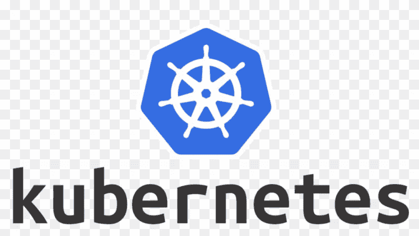
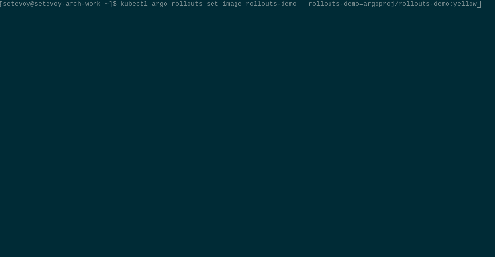

# Kubernetes:部署策略类型和 Argo 展开

> 原文：<https://itnext.io/kubernetes-deployment-strategies-types-and-argo-rollouts-9d5f98e8b24e?source=collection_archive---------3----------------------->



在我们的项目中， [ArgoCD](https://rtfm.co.ua/en/category/ci-cd-en/argocd-en/) 实现的目标之一是为我们的应用程序使用新的部署策略。

在本帖中，我们将观察 Kubernetes 中的部署类型，部署在 Kubernetes 中是如何工作的，以及 Argo 部署的一个快速示例。

*   [部署策略和 Kubernetes](https://rtfm.co.ua/en/kubernetes-deployment-strategies-types-and-argo-rollouts/#Deployment_Strategies_and_Kubernetes)
*   [再造](https://rtfm.co.ua/en/kubernetes-deployment-strategies-types-and-argo-rollouts/#Recreate)
*   [滚动更新](https://rtfm.co.ua/en/kubernetes-deployment-strategies-types-and-argo-rollouts/#Rolling_Update)
*   [Kubernetes 金丝雀部署](https://rtfm.co.ua/en/kubernetes-deployment-strategies-types-and-argo-rollouts/#Kubernetes_Canary_Deployment)
*   [Kubernetes 蓝/绿展开](https://rtfm.co.ua/en/kubernetes-deployment-strategies-types-and-argo-rollouts/#Kubernetes_BlueGreen_Deployment)
*   [部署和复制集](https://rtfm.co.ua/en/kubernetes-deployment-strategies-types-and-argo-rollouts/#Deployment_and_ReplicaSet)
*   [阿尔戈发布](https://rtfm.co.ua/en/kubernetes-deployment-strategies-types-and-argo-rollouts/#Argo_Rollouts)
*   [安装 Argo 卷展栏](https://rtfm.co.ua/en/kubernetes-deployment-strategies-types-and-argo-rollouts/#Install_Argo_Rollouts)
*   [kubectl 插件](https://rtfm.co.ua/en/kubernetes-deployment-strategies-types-and-argo-rollouts/#kubectl_plugin)
*   [一个应用的部署](https://rtfm.co.ua/en/kubernetes-deployment-strategies-types-and-argo-rollouts/#An_applications_deploy)

# 部署策略和 Kubernetes

让我们简要概述一下 Kubernetes 中使用的部署策略。

开箱即用，Kubernetes 有两种主要类型的`.spec.strategy.type`—*Recreate*和 *RollingUpdate* ，这是默认类型。

此外，您可以实现一种金丝雀和蓝绿色的部署，尽管有一些限制。

文档在这里是[>>>](https://kubernetes.io/docs/concepts/workloads/controllers/deployment/#strategy)。

## 再创造

最简单明了的类型:在这样的部署过程中，Kubernetes 将停止所有现有的 pod，然后启动新的一组。

显然，在此期间您会有一些停机时间，因为首先需要停止旧的 Pod(详情请参见 [Pod 生命周期-Pod post](https://rtfm.co.ua/en/kubernetes-nginx-php-fpm-graceful-shutdown-and-502-errors/#Pod_Lifecycle_-_Termination_of_Pods)的终止)，然后才会创建新的，然后它们需要通过[就绪](https://kubernetes.io/docs/tasks/configure-pod-container/configure-liveness-readiness-startup-probes/)检查，在此过程中，您的应用程序将对用户不可用。

如果您的应用程序不能同时使用不同的版本，例如由于数据库的限制，那么使用 b 是有意义的。

这种部署的一个例子是:

```
apiVersion: apps/v1
kind: Deployment
metadata:
  name: hello-deploy
spec:
  replicas: 2
  selector:
    matchLabels:
      app: hello-pod
      version: "1.0"
  strategy:
    type: Recreate
  template:
    metadata:
      labels:
        app: hello-pod
    spec:
      containers:
      - name: hello-pod
        image: nginxdemos/hello
        ports:
        - containerPort: 80
```

展开它的`version: "1.0"`:

```
$ kubectl apply -f deployment.yaml
deployment.apps/hello-deploy created
```

检查舱:

```
$ kubectl get pod -l app=hello-pod
NAME READY STATUS RESTARTS AGE
hello-deploy-77bcf495b7-b2s2x 1/1 Running 0 9s
hello-deploy-77bcf495b7-rb8cb 1/1 Running 0 9s
```

将其`label`更新为`version: "2.0"`，重新部署并再次检查:

```
$ kubectl get pod -l app=hello-pod
NAME READY STATUS RESTARTS AGE
hello-deploy-dd584d88d-vv5bb 0/1 Terminating 0 51s
hello-deploy-dd584d88d-ws2xp 0/1 Terminating 0 51s
```

两个豆荚都被杀死了，只有在这之后，新豆荚才会被创造出来:

```
$ kubectl get pod -l app=hello-pod
NAME READY STATUS RESTARTS AGE
hello-deploy-d6c989569-c67vt 1/1 Running 0 27s
hello-deploy-d6c989569-n7ktz 1/1 Running 0 27s
```

## 滚动更新

RollingUpdate 更有趣一点:在这里，Kubernetes 将运行新的 pod 与旧的并行，然后将杀死旧的版本并将留下新的。因此，在部署期间，旧版本和新版本的应用程序都需要一些时间。是默认的部署类型。

使用这种方法，我们的停机时间为零，因为在更新过程中，我们同时运行两个版本。

尽管如此，仍然存在这种方法不能应用的情况，例如，如果在 start 期间，pods 将运行 [MySQL 迁移](https://rtfm.co.ua/en/kubernetes-running-sql-migrations-with-kubernetes-job-and-helm-hook/)，这将以旧应用程序版本不能使用的方式更新数据库模式。

这种部署的一个例子是:

```
apiVersion: apps/v1
kind: Deployment
metadata:
  name: hello-deploy
spec:
  replicas: 2
  selector:
    matchLabels:
      app: hello-pod
  strategy:
    type: RollingUpdate
    rollingUpdate:
      maxUnavailable: 0
      maxSurge: 1
  template:
    metadata:
      labels:
        app: hello-pod
        version: "1.0"
    spec:
      containers:
      - name: hello-pod
        image: nginxdemos/hello
        ports:
        - containerPort: 80
```

这里，我们将`strategy.type: Recreate`更改为`type: RollingUpdate`，并添加了两个可选字段，它们将定义更新期间的部署行为:

*   `maxUnavailable`:从`replicas`中可以杀死多少个豆荚来运行新的。可以设置为数字或百分比。
*   `maxSurge`:根据`replicas`的值可以创建多少个 pod。可以设置为数字或百分比。

在上面的示例中，我们在`maxUnavailable`中设置了 0，也就是说，在新的 pod 启动之前，我们不想停止任何现有的 pod，并且`maxSurge`设置为 1，因此在更新期间，Kubernetes 将创建一个额外的 pod，当它处于运行状态时，Kubernetes 将丢弃一个旧的 pod。

使用 1.0 版本进行部署:

```
$ kubectl apply -f deployment.yaml
deployment.apps/hello-deploy created
```

运行两个吊舱:

```
$ kubectl get pod -l app=hello-pod
NAME READY STATUS RESTARTS AGE
hello-deploy-dd584d88d-84qk4 0/1 ContainerCreating 0 3s
hello-deploy-dd584d88d-cgc5v 1/1 Running 0 3s
```

将版本更新到 2.0，再次部署，并检查 pod:

```
$ kubectl get pod -l app=hello-pod
NAME READY STATUS RESTARTS AGE
hello-deploy-d6c989569-dkz7d 0/1 ContainerCreating 0 3s
hello-deploy-dd584d88d-84qk4 1/1 Running 0 55s
hello-deploy-dd584d88d-cgc5v 1/1 Running 0 55s
```

我们得到了一个超出`replicas`价值的额外吊舱。

## Kubernetes 金丝雀部署

金丝雀类型意味着创建新的 pod 与旧的并行，与滚动更新的方式相同，但对更新过程有更多的控制。

在运行应用程序的新版本后，新请求的一部分将被路由到它，而另一部分将使用旧版本继续。

如果新版本运行良好，那么其余的用户将被切换到新版本，旧的 pod 将被删除。

金丝雀类型不包括在`.spec.strategy.type`中，但 Kubernetes 本身可以在没有新控制器的情况下实现。

这样做，解决方案将是初步的，而且在管理上很复杂。

尽管如此，我们可以通过在一个应用程序上创建两个不同版本的部署来实现，但是两个部署都将使用一个在其`selector`中具有相同`labels`集的服务。

因此，让我们用`LoadBalancer`类型创建这样的部署和服务。

在部署-1 设置`replicas=2`中，对于部署-2 - `0`:

```
apiVersion: apps/v1
kind: Deployment
metadata:
  name: hello-deploy-1
spec:
  replicas: 2
  selector:
    matchLabels:
      app: hello-pod
  template:
    metadata:
      labels:
        app: hello-pod
        version: "1.0"
    spec:
      containers:
      - name: hello-pod
        image: nginxdemos/hello
        ports:
        - containerPort: 80
        lifecycle:
          postStart:
            exec:
              command: ["/bin/sh", "-c", "echo 1 > /usr/share/nginx/html/index.html"]
---
apiVersion: apps/v1
kind: Deployment
metadata:
  name: hello-deploy-2
spec:
  replicas: 0
  selector:
    matchLabels:
      app: hello-pod
  template:
    metadata:
      labels:
        app: hello-pod
        version: "2.0"
    spec:
      containers:
      - name: hello-pod
        image: nginxdemos/hello
        ports:
        - containerPort: 80
        lifecycle:
          postStart:
            exec:
              command: ["/bin/sh", "-c", "echo 2 > /usr/share/nginx/html/index.html"]
---
apiVersion: v1
kind: Service 
metadata:
  name: hello-svc
spec:
  type: LoadBalancer
  ports:
  - port: 80
    targetPort: 80
    protocol: TCP
  selector:
    app: hello-pod
```

使用`postStart`让我们重写一个 NGINX 的索引文件，这样我们可以看到哪个 pod 接受了一个请求。

部署它:

```
$ kubectl apply -f deployment.yaml
deployment.apps/hello-deploy-1 created
deployment.apps/hello-deploy-2 created
service/hello-svc created
```

检查舱:

```
$ kubectl get pod -l app=hello-pod
NAME READY STATUS RESTARTS AGE
hello-deploy-1-dd584d88d-25rbx 1/1 Running 0 71s
hello-deploy-1-dd584d88d-9xsng 1/1 Running 0 71s
```

目前，该服务会将所有流量从部署-1:

```
$ curl adb469658008c41cd92a93a7adddd235–1170089858.us-east-2.elb.amazonaws.com
1$ curl adb469658008c41cd92a93a7adddd235–1170089858.us-east-2.elb.amazonaws.com
1
```

现在，我们可以更新 Deployment-2 并设置`replicas: 1`:

```
$ kubectl patch deployment.v1.apps/hello-deploy-2 -p ‘{“spec”:{“replicas”: 1}}’
deployment.apps/hello-deploy-2 patched
```

我们让 pod 运行相同的`label app=hello-pod`:

```
$ kubectl get pod -l app=hello-pod
NAME READY STATUS RESTARTS AGE
hello-deploy-1-dd584d88d-25rbx 1/1 Running 0 3m2s
hello-deploy-1-dd584d88d-9xsng 1/1 Running 0 3m2s
hello-deploy-2-d6c989569-x2lsb 1/1 Running 0 6s
```

我们的服务会将 70%的流量从部署 1 路由到 pod，其余的流量从部署 2 路由到 pod:

```
$ curl adb***858.us-east-2.elb.amazonaws.com
1
$ curl adb***858.us-east-2.elb.amazonaws.com
1
$ curl adb***858.us-east-2.elb.amazonaws.com
1
$ curl adb***858.us-east-2.elb.amazonaws.com
1
$ curl adb***858.us-east-2.elb.amazonaws.com
1
$ curl adb***858.us-east-2.elb.amazonaws.com
1
$ curl adb***858.us-east-2.elb.amazonaws.com
2
$ curl adb***858.us-east-2.elb.amazonaws.com
1
$ curl adb***858.us-east-2.elb.amazonaws.com
2
```

在我们检查 2.0 版本工作正常并且没有错误之后，我们可以删除旧版本，将新版本扩展到 2 个 pod。

## Kubernetes 蓝/绿部署

同样，当我们有一个旧版本(*绿色*)和一个新版本(*蓝色*)时，我们可以创建一种蓝绿色部署，但所有流量都将被发送到新版本。如果我们在新版本中遇到错误，我们可以很容易地将它切换回以前的版本。

为此，我们使用`label` *版本*将服务的`.spec.selector`字段更新为仅从第一个“绿色”部署中选择 pod:

```
...
  selector:
    app: hello-pod
    version: "1.0"
```

重新部署并检查:

```
$ curl adb***858.us-east-2.elb.amazonaws.com
1
$ curl adb***858.us-east-2.elb.amazonaws.com
1
```

现在，将`selector`改为`version: 2`，将流量切换到“蓝色”版本:

```
$ kubectl patch services/hello-svc -p ‘{“spec”:{“selector”:{“version”: “2.0”}}}’
service/hello-svc patched
```

检查一下:

```
$ curl adb***858.us-east-2.elb.amazonaws.com
2
$ curl adb***858.us-east-2.elb.amazonaws.com
2
```

一切正常后，我们可以删除旧版本,“蓝色”将变成“绿色”。

当将 Canary 和 Blue-Green 部署与上述解决方案一起使用时，我们会遇到一系列问题:需要管理各种部署，检查它们的版本和法规，检查错误，等等。

相反，我们可以用 Istio 或 ArgoCD 做同样的事情。

Istio 将在后面讨论，此时让我们看看如何使用 ArgoCD 实现这一点。

# 部署和复制集

在继续之前，让我们看看部署和更新在 Kubernetes 中是如何工作的。

因此， [Deployment](https://kubernetes.io/docs/concepts/workloads/controllers/deployment/) 是一个 Kubernetes 类型，我们可以在其中描述一个模板来创建新的 pod。

在创建这样一个部署之后，它将创建一个 [ReplicaSet](https://kubernetes.io/docs/concepts/workloads/controllers/replicaset/) 对象来管理这个部署中的 pod。

在部署更新期间，它将创建另一个具有新配置的副本集，该副本集又将创建新的 pod:

参见[更新部署](https://kubernetes.io/docs/concepts/workloads/controllers/deployment/#updating-a-deployment)。

部署创建的每个 pod 都有一个副本集链接，并且这个副本集有一个到相应部署的链接。

检查吊舱:

```
$ kubectl describe pod hello-deploy-d6c989569–96gqc
Name: hello-deploy-d6c989569–96gqc
…
Labels: app=hello-pod
…
Controlled By: ReplicaSet/hello-deploy-d6c989569
```

…

此 pod 由:ReplicaSet/hello-deploy-d6c 989569 控制，检查此 replica set:

```
$ kubectl describe replicaset hello-deploy-d6c989569
…
Controlled By: Deployment/hello-deploy
…
```

这是我们的部署— *由:Deployment/hello—deploy*控制。

而 pods 的 ReplicaSet 模板正是其部署的`spec.template`的内容:

```
$ kubectl describe replicaset hello-deploy-2–8878b4b
…
Pod Template:
Labels: app=hello-pod
pod-template-hash=8878b4b
version=2.0
Containers:
hello-pod:
Image: nginxdemos/hello
Port: 80/TCP
Host Port: 0/TCP
Environment: <none>
Mounts: <none>
Volumes: <none>
Events: <none>
```

现在，让我们去阿尔戈推出。

# 阿尔戈推出

文档—[https://argoproj.github.io/argo-rollouts](https://argoproj.github.io/argo-rollouts)。

Argo Rollouts 是另一个 Kubernetes 控制器和一组 Kubernetes 自定义资源定义，它们一起允许创建更复杂的 Kubernetes 部署。

它可以单独使用，也可以与 NGINX 和 AWS ALB 控制器等入口控制器集成，或者与 Istio 等各种服务网格解决方案集成。

在部署过程中，Argo Rollouts 可以检查新应用程序的版本，并在出现问题时运行回滚。

为了使用 Argo 卷展栏而不是部署，我们将创建一个新的类型-卷展栏，其中在`spec.strategy`中将定义部署类型和参数，例如:

```
...
spec:
  replicas: 5
  strategy:
    canary:
      steps:
      - setWeight: 20
...
```

它的其余字段与常见的 Kubernetes 部署相同。

与部署一样，Rollout 使用 ReplicaSet 来构建新的单元。

在此期间，安装 Argo 部署后，您仍然可以使用标准部署及其`spec.strategy`和新的部署。此外，您可以轻松地将现有部署迁移到部署，请参见[将部署转换为部署](https://argoproj.github.io/argo-rollouts/migrating/)。

另请参见[架构](https://argoproj.github.io/argo-rollouts/architecture/#architecture)、[展示规范](https://argoproj.github.io/argo-rollouts/features/specification/) и [更新展示](https://github.com/argoproj/argo-rollouts/blob/master/docs/getting-started.md#2-updating-a-rollout)。

## 安装 Argo 展开

创建专用命名空间:

```
$ kubectl create namespace argo-rollouts
namespace/argo-rollouts created
```

从清单文件部署必要的 Kubernetes CRD、ServiceAccount、ClusterRoles 和部署:

```
$ kubectl apply -n argo-rollouts -f [https://raw.githubusercontent.com/argoproj/argo-rollouts/stable/manifests/install.yaml](https://raw.githubusercontent.com/argoproj/argo-rollouts/stable/manifests/install.yaml)
```

稍后，当我们将它安装在生产中时，可以使用 [Argo 展开舵](https://github.com/argoproj/argo-helm/tree/master/charts/argo-rollouts)图。

检查一个 pod —它是 Argo 展开控制器:

```
$ kubectl -n argo-rollouts get pod
NAME READY STATUS RESTARTS AGE
argo-rollouts-6ffd56b9d6–7h65n 1/1 Running 0 30s
```

## `kubectl`插件

为`kubectl`安装一个插件:

```
$ curl -LO [https://github.com/argoproj/argo-rollouts/releases/latest/download/kubectl-argo-rollouts-linux-amd64](https://github.com/argoproj/argo-rollouts/releases/latest/download/kubectl-argo-rollouts-linux-amd64)
chmod +x ./kubectl-argo-rollouts-linux-amd64
$ sudo mv ./kubectl-argo-rollouts-linux-amd64 /usr/local/bin/kubectl-argo-rollouts
```

检查一下:

```
$ kubectl argo rollouts version
kubectl-argo-rollouts: v1.0.0+912d3ac
BuildDate: 2021–05–19T23:56:53Z
GitCommit: 912d3ac0097a5fc24932ceee532aa18bcc79944d
GitTreeState: clean
GoVersion: go1.16.3
Compiler: gc
Platform: linux/amd64
```

## 应用程序部署

部署测试应用程序:

```
$ kubectl apply -f [https://raw.githubusercontent.com/argoproj/argo-rollouts/master/docs/getting-started/basic/rollout.yaml](https://raw.githubusercontent.com/argoproj/argo-rollouts/master/docs/getting-started/basic/rollout.yaml)
rollout.argoproj.io/rollouts-demo created
```

检查一下:

```
$ kubectl get rollouts rollouts-demo -o yaml
apiVersion: argoproj.io/v1alpha1
kind: Rollout
…
spec:
replicas: 5
revisionHistoryLimit: 2
selector:
matchLabels:
app: rollouts-demo
strategy:
canary:
steps:
- setWeight: 20
- pause: {}
- setWeight: 40
- pause:
duration: 10
- setWeight: 60
- pause:
duration: 10
- setWeight: 80
- pause:
duration: 10
template:
metadata:
creationTimestamp: null
labels:
app: rollouts-demo
spec:
containers:
- image: argoproj/rollouts-demo:blue
name: rollouts-demo
ports:
- containerPort: 8080
name: http
protocol: TCP
…
```

这里，在`spec.strategy`中使用 Canary 部署类型，在一组步骤中将执行 pod 的升级:首先，20%的现有 pod 将被新版本替换，然后暂停以检查它们是否工作，然后更新 40%，再次暂停，等等，直到所有的 pod 都将被升级。

通过使用上面安装的插件，我们可以添加`--watch`参数来实时查看升级过程:

```
$ kubectl argo rollouts get rollout rollouts-demo — watch
```

安装测试服务:

```
$ kubectl apply -f [https://raw.githubusercontent.com/argoproj/argo-rollouts/master/docs/getting-started/basic/service.yaml](https://raw.githubusercontent.com/argoproj/argo-rollouts/master/docs/getting-started/basic/service.yaml)
service/rollouts-demo created
```

并通过设置新的映像版本进行更新:

```
$ kubectl argo rollouts set image rollouts-demo rollouts-demo=argoproj/rollouts-demo:yellow
```

检查进度:



完成了。

*最初发布于* [*RTFM: Linux，DevOps，和系统管理*](https://rtfm.co.ua/en/kubernetes-deployment-strategies-types-and-argo-rollouts/) *。*