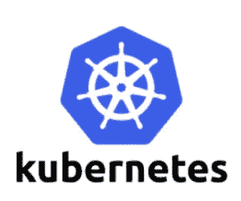

# Kubernetes 反对 Docker 运行时

> 原文：<https://itnext.io/kubernetes-deprecation-of-docker-runtime-4fce6845f77f?source=collection_archive---------3----------------------->

> 像水一样，我的朋友。

来自 ais.com 的 img

# 这最终肯定会发生

大多数使用 Kubernetes 的人可能已经听说了 Kubernetes 将在即将到来的版本中取消 Docker 支持的消息。令人惊讶的是，我从托管自己集群的消费者和使用托管解决方案(如 AKS 和 GKE)的消费者那里看到了相当多的恐慌。特别是因为在 1.2 版本中，它是如何避免被弃用的。

在 1.2 中，消费者应该注意到的唯一一件事是 kubelet 警告，如果 Docker 是当前的运行时，实际的弃用预计要到 1.23 或更高版本才会发生，直到 2021 年底才会发布。

> 你有的是时间！

我不打算重复**许多**已经重复的故事。相反，我将与你分享一些信息，我相信这些信息将通过预先向你提供最好的信息来帮助你节省时间和防止过早衰老。

1.  [K8s 官方博文](https://kubernetes.io/blog/2020/12/02/dont-panic-kubernetes-and-docker/)

如果你不完全清楚 Docker 和 Container 的运行时间，这有助于澄清一些误解。长话短说，K8s 必须在 docker 运行时使用一个垫片，因为 Docker 不符合 CRI。

2. [K8s Dockershim 弃用常见问题解答](https://kubernetes.io/blog/2020/12/02/dockershim-faq/)

关于什么可行，什么不可行，你应该做什么等等的一个可靠的信息列表。这应该有助于你放松心情。

3.[开发到](https://dev.to/inductor/wait-docker-is-deprecated-in-kubernetes-now-what-do-i-do-e4m)的折旧过帐

关于正在发生的事情的很好的信息，给我们带来了讨论开发人员和管理员应该考虑什么的完整循环，同时以一种非常清晰抽象的方式解释为什么。

4. [K8 讨论](https://discuss.kubernetes.io/)

女士们先生们…用这个。不要等到最后一秒才问问题，如果你没有得到你想要的，这些问题可能会对你产生负面影响。

# 最后的想法

你有足够的时间来解决这个问题。一定要清楚自己需要做什么才能成功。提问。如果你使用的是 AKS 或 GKE 这样的托管解决方案，你就不需要太担心了，因为他们会通过升级主服务器来为你处理一切，并帮助升级过程变得简单，就像点击*升级*或运行一个简单的命令一样。

我知道的一个事实是，在 AKS 中，你已经可以开始使用使用 containerd 作为运行时的集群，尽管它是在预览中。点击查看[。](https://docs.microsoft.com/en-us/azure/aks/cluster-configuration#container-runtime-configuration)