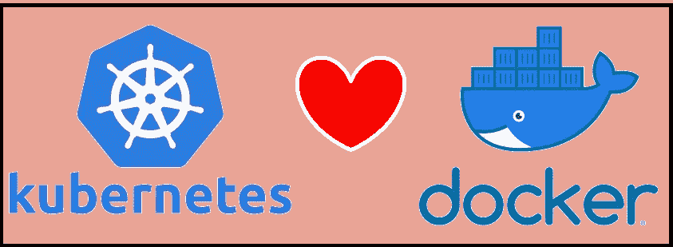

# Kubernetes 没有“杀死”Docker！

> 原文：<https://itnext.io/kubernetes-did-not-kill-docker-6a76bcc03fc0?source=collection_archive---------2----------------------->

最近，关于 Kubernetes 从其平台上避开 Docker 的最后一步，互联网上出现了广泛的恐慌。

像“码头工人的末日”、“Kubernetes 杀了码头工人”和无数点击诱饵这样的闪亮标题散布在讨论这个问题的整个网络上。

事实是，这些说法没有那么戏剧化，当然也不准确。

在这篇短文中，我将省去不必要的最高级和过多的数据，简单地向您解释 Docker 和 Kubernetes 在不久的将来会发生什么。

剧透——没那么多；)

# 码头工人的定义

> Docker 是一组“平台即服务”产品，使用操作系统级虚拟化来交付软件包中的软件，称为 containers-Wikipedia

我最喜欢用一句话向我的客户和学生解释 Docker 的方式:
“总的来说，Docker 是一个非常舒适的容器包装工具。”

# Kubernetes 和 Docker 有什么问题？

关于这个话题的大部分困惑源于缺乏对 Docker 产品功能的理解。

总的来说，Docker 产品有三个主要功能:

> -图像的开发环境
> 
> -集装箱的 UX 管理界面
> 
> -容器的运行时环境

Kubernetes 本质上是一个容器编排器，也就是说它的工作或名称主要是以冗余和高效的方式运行容器，因此 Kubernetes 在一天结束时对 Docker 的所有“需求”只是他的“运行时环境”功能。

因此，其他功能加重了 Kubernetes 生态系统的负担，降低了其性能。
此外，Docker 的运行时环境与 Kubernetes 中负责运行名为 [**CRI**](https://kubernetes.io/blog/2016/12/container-runtime-interface-cri-in-kubernetes/) 的容器的组件不兼容。
因此，一个名为 [Dockershim](https://kubernetes.io/blog/2020/12/02/dockershim-faq/) 的特殊接口抽象层被引入，并导致了一些问题，如:
兼容性问题、开发开销和低劣的性能。

因此，Kubernetes 团队做出了一个公正但艰难的决定，从 1.22 版本开始，从较新版本的 Kubernetes 中删除 Dockershim

# 对最终用户的影响

对最终用户的影响几乎不存在，因为由 Docker 构建的图像仍然可以像由 Kaniko、IMG 和 Buildah 等其他工具构建的图像一样正常工作。

# 对云托管服务的影响

对托管的 Kubernetes 服务的影响很小，很容易升级节点，使其能够在不同的运行时环境中工作。
目前，大多数提供商正致力于为旧集群提供舒适的过渡。

> 比如
> 在谷歌这个功能已经内置了
> [https://cloud . Google . com/kubernetes-engine/docs/concepts/using-containerd。](https://cloud.google.com/kubernetes-engine/docs/concepts/using-containerd.)
> 
> 在 AKS 中，“Containerd”已经自动安装。

# 对本地集群的影响

Kubernetes On-prem 的影响更大，因为您需要将所有集群服务器的运行时环境替换为新的容器运行时 **CRI** 批准的组件，如:

> -包含
> 
> - CRI-O

这一转换过程确实会比托管服务花费更多的时间(取决于您的集群的大小和复杂性),但也不会更复杂。

# 结论

你没有什么可担心的！

1.  您可以继续使用 Docker 作为您的主要图像构建工具。

2.在 Kubernetes 版本弃用 Docker 容器引擎之前，您还有一年多的时间，因此您有足够的时间来准备这一微小的变化。

3。最终，这是 Kubernetes 生态系统中的一个小变化，将带来更高的性能并防止未来的故障。

别担心，一切都很好:)

希望对你有帮助，

或者妈妈

[www.linkedin.com/in/ormaman](http://www.linkedin.com/in/ormaman)Orm@sela.co.il