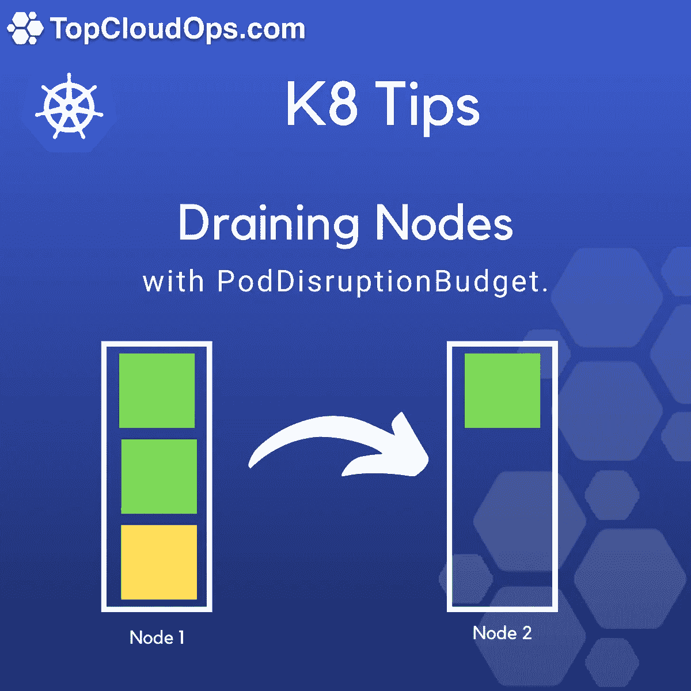

# Kubernetes 正确排出节点

> 原文：<https://itnext.io/kubernetes-draining-nodes-properly-79e18dca4d5e?source=collection_archive---------2----------------------->



我叫 Guillermo Quiros，是 topcloudops.com 的一名 AWS 解决方案架构师和 Kubernetes 专家。

我只想分享一些最佳实践，当我们的所有顾问需要在不中断他们所拥有的服务的情况下耗尽一个节点时，我们会强制执行这些实践。

这里要理解的主要事情是，如果我们耗尽一个节点，在该节点上运行的所有 pod 都将被终止。而不管群集中运行的副本数量是否正确。
为了避免我们正在耗尽一个节点的情况，我们希望避免可能的服务中断，我们需要创建一个所谓的 PodDisruptionBudget。

假设我们有一个包含两个节点(节点 1 和节点 2)的环境，我们有一个这样的部署:

```
apiVersion: apps/v1
kind: Deployment
metadata:
  name: apache-deployment
  labels:
    app: webserver
    name: webserver
spec:
  replicas: 2
  selector:
    matchLabels:
      app: webserver
      name: webserver
  template:
    metadata:
      labels:
        app: webserver
        name: webserver
    spec:
      containers:
      - name: apache
        image: fedora/apache
        ports:
        - containerPort: 80
```

这个部署的两个 pod 都在 node1 中运行。现在我们需要对 node1 进行维护，以升级机器的硬件。我们还要求我们的 apache 服务需要始终可用。

为了确保在我们的集群上始终运行最少数量的 Pods，我们将通过以下方式创建 PodDisruptionBudget:

```
apiVersion: policy/v1beta1
kind: PodDisruptionBudget
metadata:
  name: apache-disruption-budget-min-available
spec:
  minAvailable: 2
  selector:
    matchLabels:
      app: webserver
```

这将告诉 Kubernetes，无论发生什么情况，他需要确保我们总是有最小数量的符合标签的 pod 运行。

我们还可以定义一个 PDB，指定与标签匹配的不可用 pod 的最大百分比:

```
apiVersion: policy/v1beta1
kind: PodDisruptionBudget
metadata:
  name: apache-disruption-budget-max-unavailable
spec:
  maxUnavailable: "50%"
  selector:
    matchLabels:
      app: webserver
```

在这种情况下，我们告诉 Kubernetes 不可用的 apache pods 的最大数量是 1。

现在，它被保存以开始清空节点 1，我们将使用以下命令来完成此操作:

```
kubectl drain node1
```

drain 命令要做的第一件事是封锁节点，**封锁**禁用 node1 上的 pods 调度。一旦节点 1 被封锁，Kubernetes 就开始驱逐 pod，但要遵守系统上配置的 pdb 上定义的规则。

如果我们希望在维护完成后再次启用节点 1。我们需要记住运行 **uncordon** 命令来允许在 node1 上调度 pod。我们通过运行以下命令来实现这一点:

```
kubectl uncordon node1
```

我希望这对你有所帮助！