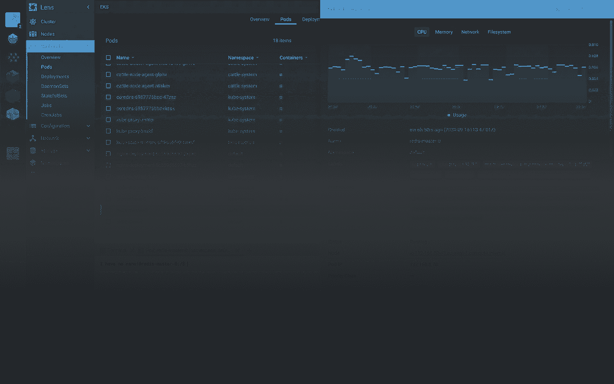
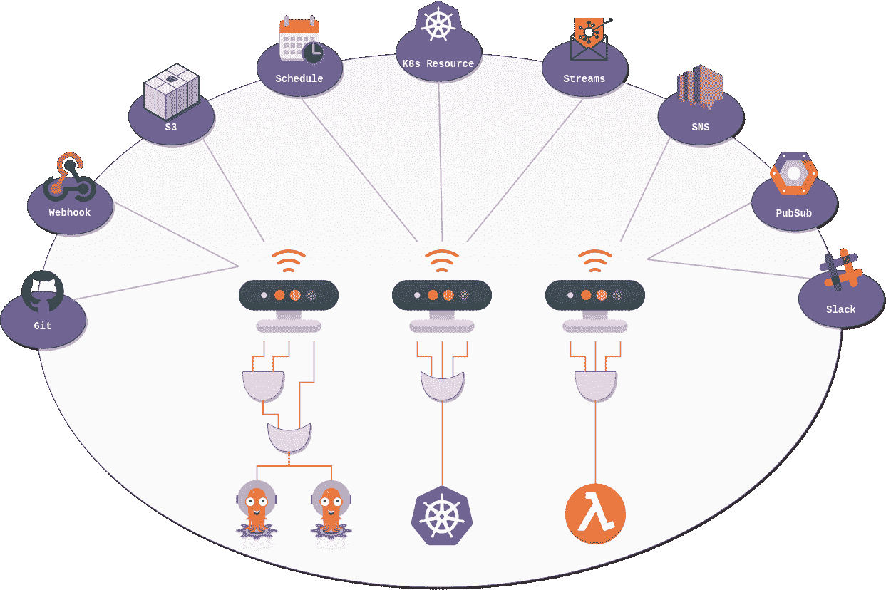
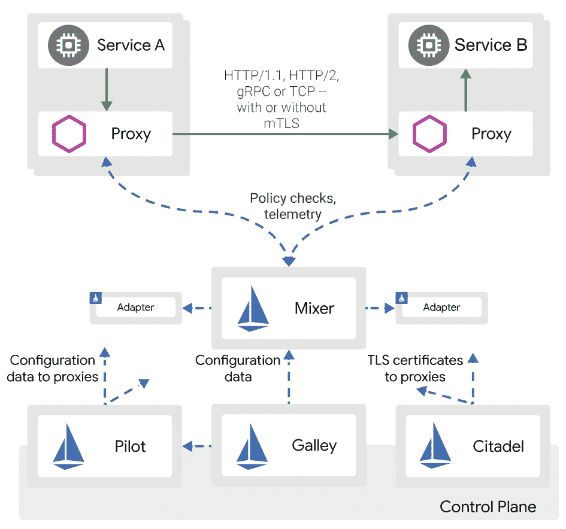
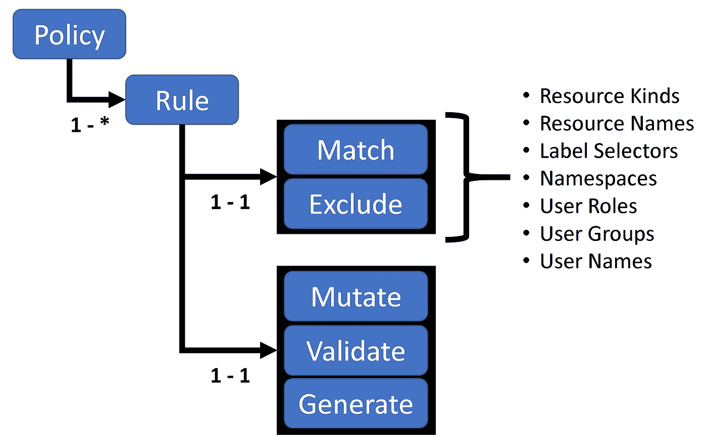
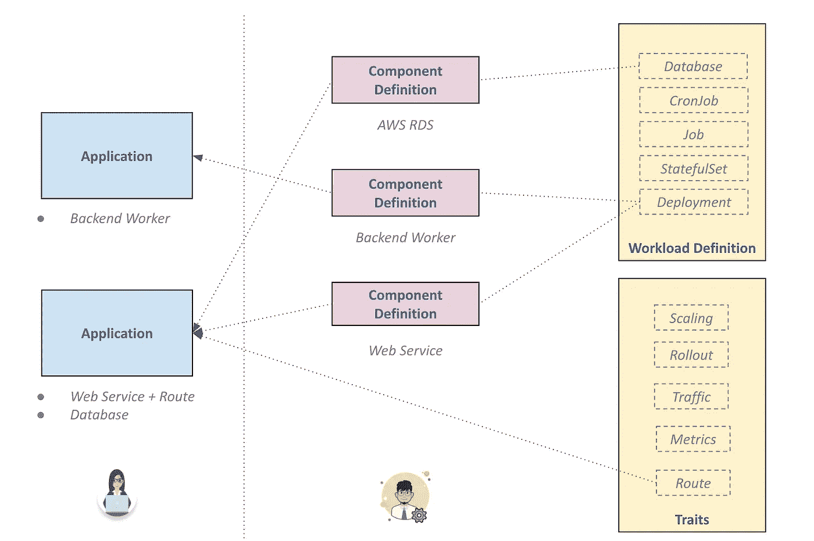
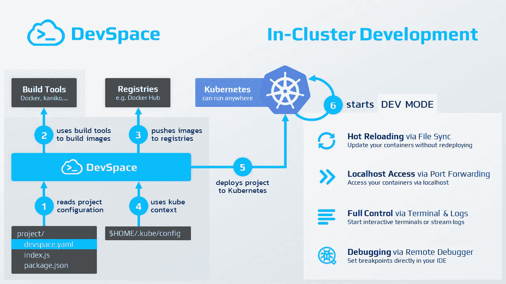
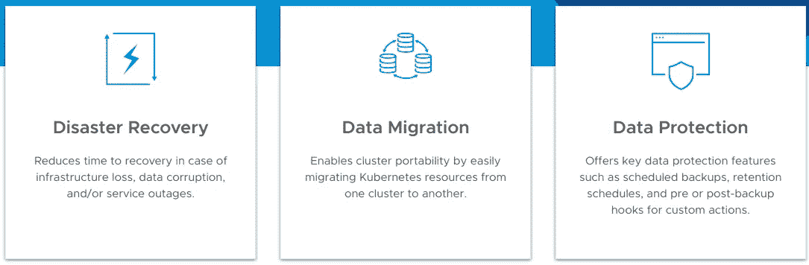
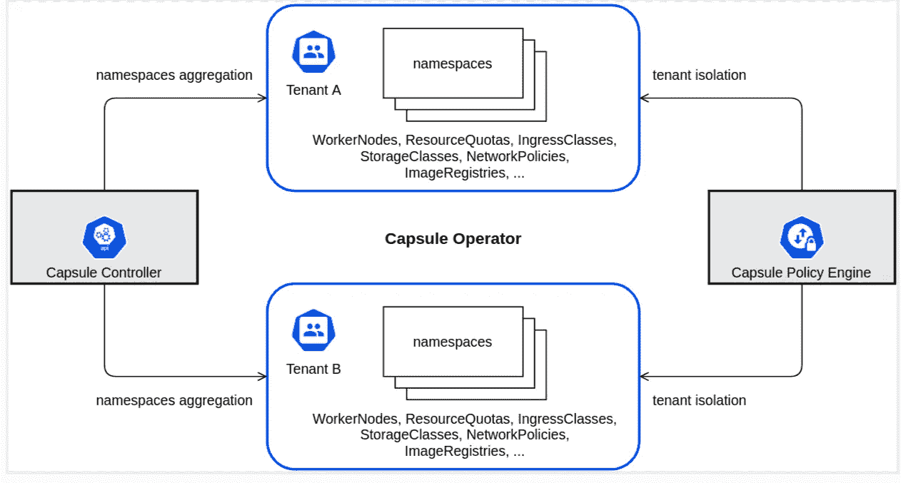
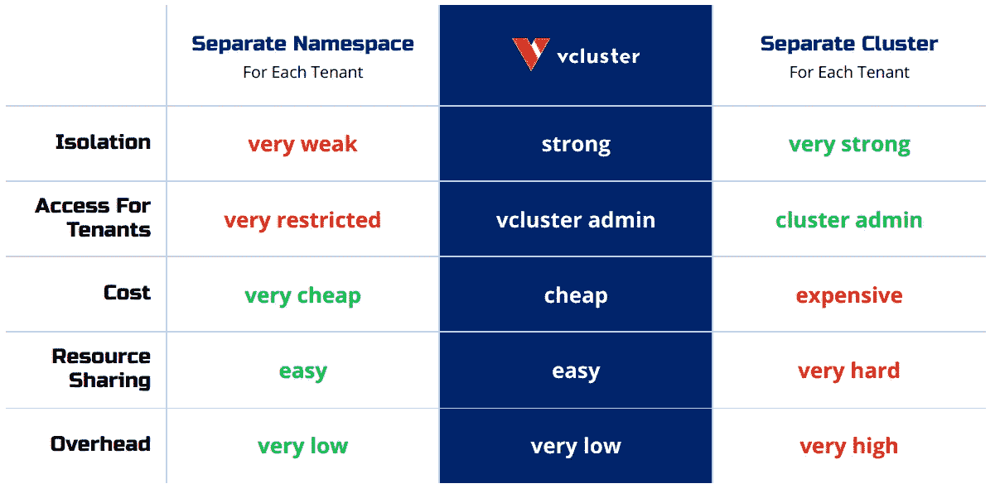
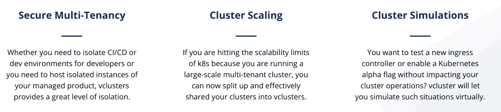

# Kubernetes 基本工具

> 原文：<https://itnext.io/kubernetes-essential-tools-2021-def12e84c572?source=collection_archive---------0----------------------->

本杰明·戴维斯在 [Unsplash](https://unsplash.com?utm_source=medium&utm_medium=referral) 上拍摄的照片

# 介绍

在这篇文章中，我将尝试总结我最喜欢的 [**Kubernetes**](https://kubernetes.io/) 工具，特别强调最新的**和鲜为人知的工具，我认为它们会变得非常流行。**

**这只是我根据我的经验列出的个人清单，但是为了避免偏见，我会试着提及每种工具的替代方案，这样你就可以根据你的需求进行比较和决定。我会尽可能保持这篇文章的简短，我会尽量提供链接，这样你可以自己探索更多。我的目标是回答这个问题:*“我在 Kubernetes 怎么做 X？”*通过描述工具来完成不同的软件开发任务。**

# **K3D**

**[**K3D**](https://k3d.io/) 是我最喜欢的在笔记本电脑上运行 **Kubernetes** (K8s)集群的方式。它非常轻便，速度也非常快。使用 **Docker** 对 [**K3S**](https://k3s.io/) 进行包装。所以，你只需要 Docker 来运行它，它有一个非常低的资源使用率。唯一的问题是**它并不完全符合 K8s**，但是这对于本地开发来说应该不是问题。对于测试环境，您可以使用其他解决方案。K3D 比 Kind 快，但是 Kind 完全兼容。**

## **可供选择的事物**

*   **[**K3S**](https://k3s.io/) 为物联网或边缘**
*   **[**类**](https://kind.sigs.k8s.io/) 作为完全兼容的替代**
*   **[**MicroK8s**](https://microk8s.io/)**
*   **[**MiniKube**](https://minikube.sigs.k8s.io/docs/)**

# **克鲁**

**[**Krew**](https://krew.sigs.k8s.io/) 是管理 **Kubectl** **插件**的必备工具，这是任何 K8s 用户都必须具备的**。超过 145 个可用的[插件](https://krew.sigs.k8s.io/plugins/)我就不赘述了但是至少要安装[***kubens***](https://github.com/ahmetb/kubectx)和[***kubectx***](https://github.com/ahmetb/kubectx)。****

# ****镜头****

****[**镜头**](https://k8slens.dev/) 是 K8s 的 **IDE** 给 SREs，op，开发者。它适用于任何 Kubernetes 发行版:本地或云中。这是快速，易于使用，并提供实时观察。有了 Lens，管理多个集群变得非常容易。如果你是集群操作员，这是必须的。****

********

****镜头****

## ****可供选择的事物****

*   ****[**K9s**](https://k9scli.io/)**对于喜欢轻量化**终端**替代的人来说是一个绝佳的选择。K9s 不断观察 Kubernetes 的变化，并提供后续命令来与您观察到的资源进行交互。******

# ****舵****

****[**掌舵人**](https://helm.sh/) 应该不需要介绍，对于 Kubernetes 来说最著名的**包经理**。是的，你应该在 K8s 中使用包管理器，就像你在编程语言中使用它一样。Helm 允许您将应用打包在 [**图表**](https://artifacthub.io/) 中，这些图表将复杂的应用抽象为可重用的简单组件，易于定义、安装和更新。****

****它还提供了一个强大的**模板引擎**。 [Helm](https://helm.sh/docs/) 比较成熟，有很多预定义的图表，很大的支持，很容易使用。****

## ****可供选择的事物****

*   ****Kustomize 是 helm 的一个更新更好的替代品，它不使用模板引擎，而是使用一个覆盖引擎，在上面有基本定义和覆盖。****

# ****ArgoCD****

****我相信 [**GitOps**](https://www.gitops.tech/) 是过去十年中最好的想法之一。在软件开发中，我们应该使用**单一来源的真相**来跟踪构建软件所需的所有移动部分，而 **Git** 是完成这一任务的完美工具。其想法是建立一个 Git 存储库，其中包含应用程序代码以及基础设施的声明性描述(**)，这些描述代表了所需的生产环境状态；以及一个**自动化过程**来使期望的环境与存储库中描述的状态相匹配。******

> ******GitOps** :声明性基础设施之上的版本化 CI/CD。停止编写脚本，开始发货。****
> 
> ****— [凯尔西·海托华](https://twitter.com/kelseyhightower/status/953638870888849408)****

****虽然使用 [**Terraform**](https://www.terraform.io/) 或类似的工具，你可以将你的基础设施作为代码( [**IaC**](https://en.wikipedia.org/wiki/Infrastructure_as_code) )，但这还不足以将你在 Git 中想要的状态与生产同步。我们需要一种方法来持续监控环境，并确保没有配置偏差。使用 Terraform，你必须编写运行`terraform apply`的脚本，并检查状态是否与 Terraform 的状态相匹配，但这很繁琐，也很难维护。****

****Kubernetes 是按照自下而上的控制循环的思想构建的，这意味着 Kubernetes 总是在监视集群的状态，以确保它与所需的状态相匹配，例如，运行的副本数量与所需的副本数量相匹配。GitOps 的想法是将这一点扩展到应用程序，因此您可以将您的服务定义为代码，例如，通过定义 Helm Charts，并使用一个利用 K8s 功能的工具来监控您的应用程序的状态并相应地调整集群。也就是说，如果更新您的代码报告，或您的掌舵图表，生产集群也将更新。这才是真正的 [**连续部署**](https://en.wikipedia.org/wiki/Continuous_deployment) 。核心原则是应用程序部署和生命周期管理应该是自动化的、可审计的和易于理解的。****

****对我来说，这个想法是革命性的，如果做得好，将使组织更多地关注特性，而不是为自动化编写脚本。这个概念可以扩展到软件开发的其他领域，例如，您可以在代码中存储您的文档，以跟踪更改的历史，并确保文档是最新的；或者使用 [**ADRs**](https://github.com/jamesmh/architecture_decision_record) 跟踪架构决策。****

****在我看来， **Kubernetes** 中最好的 GitOps 工具是[**argod**](https://argoproj.github.io/argo-cd/)。你可以在这里阅读更多关于它的[。ArgoCD 是 Argo 生态系统的一部分，该生态系统还包括一些其他优秀的工具，其中一些我们将在后面讨论。](https://argoproj.github.io/argo-cd/core_concepts/)****

****使用 **ArgoCD** 你可以在一个代码库中拥有每个**环境**，在那里你可以为那个环境定义所有的配置。Argo CD 在指定的目标环境中自动部署所需的应用程序状态。****

********

****ArgoCD 建筑****

****Argo CD 是作为一个 **kubernetes 控制器**实现的，该控制器持续监控运行的应用程序，并将当前的实时状态与所需的目标状态进行比较(如 Git 报告中所述)。Argo CD 报告并可视化这些差异，并且可以自动或手动将实时状态同步回所需的目标状态。****

## ****可供选择的事物****

*   ****[**通量**](https://fluxcd.io/) 其中刚刚发布了一个有很多改进的新版本。它提供了非常相似的功能。****

# ****Argo 工作流和 Argo 事件****

****在 Kubernetes 中，您可能还需要运行**批处理作业或复杂的工作流**。这可能是您的数据管道、异步流程甚至 CI/CD 的一部分。除此之外，您甚至可能需要运行驱动的微服务，对某些事件做出反应，如文件上传或消息发送到队列。对于这一切，我们有 [**蓉城工作流程**](https://argoproj.github.io/argo-workflows/) 和 [**蓉城事件**](https://argoproj.github.io/argo-events/) 。****

****尽管它们是独立的项目，但它们往往会一起部署。****

****Argo Workflows 是一个**编排** **引擎**，类似于[阿帕奇气流](https://airflow.apache.org/)，但原生于 Kubernetes。它使用自定义的 **CRDs** 来定义复杂的工作流程，使用 K8s 中感觉更自然的[**Dag**](https://en.wikipedia.org/wiki/Directed_acyclic_graph)来定义复杂的工作流程。它有一个很好的用户界面，重试机制，基于 cron 的工作，输入和输出跟踪等等。您可以使用它来编排数据管道、批处理作业等等。****

****有时，您可能希望将您的管道与异步服务集成，如流引擎(如[**Kafka**](https://kafka.apache.org/)**)**、队列、webhooks 或深度存储服务。例如，您可能希望对上传到 S3 的文件等事件做出反应。为此，你要用 [**蓉城事件**](https://argoproj.github.io/argo-events/) 。****

********

****阿尔戈事件****

****这两个工具结合起来为您的所有管道需求提供了一个简单而强大的解决方案，包括 **CI/CD** 管道，它将允许您在 Kubernetes 中本地运行 CI/CD 管道。****

## ****可供选择的事物****

*   ****对于 ML 管道，您可以使用为此目的而构建的[**kube flow**](https://www.kubeflow.org/)**。******
*   ******对于 CI/CD 管线，您可以使用 [**Tekton**](https://tekton.dev/docs/pipelines/pipelines/) 。******

# ****卡尼科****

****我们刚刚看到了如何使用 Argo 工作流运行 Kubernetes native **CI/CD** 管道。一个常见的任务是**构建 Docker 映像**，这在 Kubernetes 中通常很繁琐，因为构建过程实际上是在容器本身上运行的，您需要使用变通办法来使用主机的 Docker 引擎。****

********

****底线是**你不应该使用 Docker 建立你的图像**:使用 [**Kaniko**](https://github.com/GoogleContainerTools/kaniko) 代替。Kaniko 不依赖 Docker 守护进程，完全在用户空间中执行 Docker 文件中的每个命令。这使得在不能轻松或安全地运行 Docker 守护进程的环境中构建容器映像成为可能，比如标准的 Kubernetes 集群。这消除了关于在 K8s 集群中构建映像的所有问题。****

# ****伊斯迪奥****

****[**Istio**](https://istio.io/) 是市面上最著名的 [**服务网**](https://en.wikipedia.org/wiki/Service_mesh) ，它是开源的，非常受欢迎。我不会详细讨论什么是服务网格，因为这是一个很大的话题，但是如果您正在构建 [**微服务**](https://microservices.io/) ，并且很可能您应该这样做，那么您将需要一个服务网格来管理通信、可观察性、错误处理、安全性以及作为**微服务架构**一部分的所有其他交叉方面。与其用重复的逻辑污染每个微服务的代码，不如利用服务网格来为您做这件事。****

********

****Istio 建筑****

****简而言之，服务网格是一个可以添加到应用程序中的专用基础设施层。它允许您透明地添加诸如可观察性、流量管理和安全性等功能，而无需将它们添加到您自己的代码中。****

****Istio 用于运行微服务，虽然你可以在任何地方运行 Istio 和使用微服务，但 Kubernetes 已经一次又一次地被证明是运行它们的最佳平台。 **Istio** 还可以将您的 K8s 集群扩展到其他服务，如虚拟机，让您拥有混合环境，这在迁移到 Kubernetes 时非常有用。****

## ****可供选择的事物****

*   ****[**Linkerd**](https://linkerd.io/) 是一个**更轻**并且可能**更快**的发球网。Linkerd 完全是为了安全而构建的，它的功能包括[默认开启的 mTLS](https://linkerd.io/2.10/features/automatic-mtls/) 、用 Rust 构建的数据平面[、内存安全语言](https://github.com/linkerd/linkerd2-proxy)以及[定期安全审计](https://github.com/linkerd/linkerd2/blob/main/SECURITY_AUDIT.pdf)****
*   ****[**Consul**](https://www.consul.io/) 是为任何运行时和云提供商构建的服务网格，因此它非常适合跨 k8 和云提供商的混合部署。如果不是所有的工作负载都在 Kubernetes 上运行，这是一个很好的选择。****

# ****阿尔戈推出****

****我们已经提到，您可以使用 Kubernetes 来运行您的 CI/CD 管道，使用 Argo 工作流或类似的工具使用 Kaniko 来构建您的图像。下一个合乎逻辑的步骤是继续进行**连续部署**。由于涉及的高风险，这在现实场景中非常具有挑战性，这就是为什么大多数公司只做**连续交付**，这意味着他们有自动化，但他们仍然有人工批准和验证，这种人工步骤是由于团队**不能完全信任他们的自动化。******

****那么，如何建立这种信任，以便能够摆脱所有的脚本，从源代码到生产全自动化呢？答案是:**可观测性**。您需要将资源更多地集中在指标上，并收集准确表示应用程序状态所需的所有数据。目标是使用一组指标来建立信任。如果您在 [**Prometheus**](https://prometheus.io/) 中拥有所有数据，那么您就可以自动化部署，因为您可以基于这些指标自动化应用程序的逐步推出。****

****简而言之，你需要比 K8s 现成提供的 [**滚动更新**](https://www.educative.io/blog/kubernetes-deployments-strategies) 更高级的部署技术。我们需要使用 [**金丝雀**部署](https://semaphoreci.com/blog/what-is-canary-deployment)的渐进式交付。目标是逐步将流量路由到新版本的应用程序，等待收集指标，分析这些指标，并将其与预定义的规则进行匹配。如果一切正常，我们增加流量；如果有任何问题，我们将回滚部署。****

****要在 Kubernetes 中做到这一点，你可以使用 [**Argo Rollouts**](https://argoproj.github.io/argo-rollouts/) 提供金丝雀发布和更多。****

> ****Argo Rollouts 是一个 [Kubernetes 控制器](https://kubernetes.io/docs/concepts/architecture/controller/)和一组[CRD](https://kubernetes.io/docs/concepts/extend-kubernetes/api-extension/custom-resources/)，它们向 Kubernetes 提供高级部署功能，如蓝绿色、金丝雀、金丝雀分析、实验和渐进交付功能。****

****虽然像 [**Istio**](https://istio.io/) 这样的服务网格提供金丝雀版本，但 Argo Rollouts 使这个过程变得更加容易，并且以开发者为中心，因为它是专门为此目的而构建的。最重要的是， **Argo 部署**可以与任何服务网络集成。****

******逃离德黑兰功能:******

*   ****蓝绿更新策略****
*   ****金丝雀更新策略****
*   ****细粒度的加权流量转移****
*   ****自动回滚和升级或人工判断****
*   ****可定制的指标查询和业务 KPI 分析****
*   ****入口控制器集成:NGINX、ALB****
*   ****服务网格集成:Istio、Linkerd、SMI****
*   ****指标提供商集成:Prometheus、Wavefront、 **Kayenta** 、Web、Kubernetes Jobs****

## ****可供选择的事物****

*   ****[**Istio**](https://istio.io/)**作为金丝雀发布的服务网格。Istio 不仅仅是一个渐进式交付工具，它是一个完整的 [**服务网**](https://en.wikipedia.org/wiki/Service_mesh) 。Istio 不自动部署，Argo Rollouts 可以与 Istio 集成来实现这一点。******
*   ****[**Flagger**](https://flagger.app/) 非常类似于 Argo 的推出，它与 [**Flux**](https://fluxcd.io/) 非常好地集成在一起，所以如果你的 ar 使用 Flux 的话可以考虑 [Flagger](https://flagger.app/) 。****
*   ****[**Spinnaker**](https://spinnaker.io/) 是 Kubernetes 的第一个连续交付工具，它有很多特性，但是使用和设置起来有点复杂。****

# ****交叉平面****

****[**Crossplane**](https://crossplane.io/) 是我的新宠 **K8s** 工具，我对这个项目非常兴奋，因为它为 Kubernetes 带来了一个关键的缺失部分:**管理第三方服务，就像它们是 K8s 资源一样**。这意味着，您可以供应云提供商数据库，如**AWS**[**RDS**](https://aws.amazon.com/rds/)或 **GCP** **云 SQL** ，就像您在 K8s 中供应数据库一样，使用在 **YAML** 中定义的 K8s 资源。****

********

****有了**交叉平面**，就不需要使用不同的工具和方法来分离基础设施和代码。**你可以用 K8s 资源定义一切。**这样就不需要学习 [**Terraform**](https://www.terraform.io/) 之类的新工具，单独保存。****

> ****Crossplane 是一个开源的 Kubernetes 插件，使平台团队能够组装来自多个供应商的基础设施，并为应用团队提供更高级别的自助服务 API，而无需编写任何代码。****

******Crossplane** 扩展您的 Kubernetes 集群，为您提供适用于任何基础设施或托管云服务的 **CRDs** 。此外，它允许您完全实施**连续部署**，因为与其他工具(如 Terraform)相反，Crossplane 使用现有的 K8s 功能(如控制循环)来持续监视您的集群，并自动检测对其起作用的任何配置漂移。例如，如果您定义了一个托管数据库实例，而有人手动更改了它，Crossplane 将自动检测到该问题，并将其设置回以前的值。这将基础设施作为代码和 [**GitOps**](https://www.gitops.tech/) 原则来实施。 **Crossplane** 与 Argo CD 配合使用非常好，它可以查看源代码，并确保您的代码报告是真实的单一来源，并且代码中的任何更改都会传播到集群和外部云服务。如果没有 Crossplane，您只能在 K8s 服务中实现 [**GitOps**](https://www.gitops.tech/) ，而不能在不使用单独流程的情况下实现云服务，现在您可以这样做了，这太棒了。****

## ****可供选择的事物****

*   ****[**Terraform**](https://www.terraform.io/) 这是最著名的 IaC 工具，但不是 K8s 原生的，需要新技能，不会自动观察配置漂移。****
*   ****[**Pulumi**](https://www.pulumi.com/) 这是一个 Terraform 的替代品，它使用开发者可以测试和理解的编程语言工作。****

# ****Knative****

****如果你在云中开发你的应用程序，你可能已经使用了一些**无服务器**技术，比如[**AWSλ**](https://aws.amazon.com/lambda/)**，这是一个事件驱动的范例，被称为**。********

******我过去已经讲过 [**无服务器**](https://en.wikipedia.org/wiki/Serverless_computing) ，所以检查我的 [**以前的文章**](/scaling-my-app-serverless-vs-kubernetes-cdb8adf446e1) 来了解更多关于这方面的内容。无服务器的问题是它与云提供商紧密耦合，因为提供商可以为事件驱动的应用程序创建一个伟大的生态系统。******

****对于 Kubernetes 来说，如果你想将函数作为代码运行，并使用事件驱动架构，你最好的选择是 [**Knative**](/scaling-my-app-serverless-vs-kubernetes-cdb8adf446e1) 。Knative 是为了在 Kubernetes 上运行功能而构建的，它在 Pod 上创建了一个抽象。****

******特点**:****

*   ****针对常见应用程序用例的具有更高级抽象的集中 API。****
*   ****在几秒钟内建立一个可扩展的、安全的、无状态的服务。****
*   ****松散耦合的特性允许您使用您需要的部分。****
*   ****可插拔组件让您可以拥有自己的日志记录和监控、网络和服务网格。****
*   ****Knative 是可移植的:在 Kubernetes 运行的任何地方运行它，永远不用担心被供应商锁定。****
*   ****惯用的开发人员体验，支持常见模式，如 GitOps、DockerOps、ManualOps。****
*   ****Knative 可以与常见的工具和框架一起使用，比如 Django、Ruby on Rails、Spring 等等。****

## ****可供选择的事物****

*   ****[**Argo Events**](https://argoproj.github.io/argo-events/) 为 Kubernetes 提供事件驱动的工作流引擎，可以与 AWS Lambda 等云引擎集成。它不是 FaaS，而是为 Kubernetes 提供了一个事件驱动的架构。****
*   ****[**OpenFaas**](https://www.openfaas.com/)****

# ****kyverno****

****Kubernetes 提供了很大的灵活性，以增强敏捷自治团队的能力，但是能力越大，责任越大。必须有一套**最佳实践和规则**来确保以一致和连贯的方式部署和管理符合公司政策和安全要求的工作负载。****

****有几个工具可以做到这一点，但没有一个是 Kubernetes 自带的…直到现在。 [**Kyverno**](https://kyverno.io/) 是一款专为 Kubernetes 设计的策略引擎，策略作为 Kubernetes 资源进行管理，无需新语言编写策略。Kyverno 策略可以验证、变异和生成 Kubernetes 资源。****

********

****Kyverno 政策是一系列规则的集合。每个规则由一个`[match](https://kyverno.io/docs/writing-policies/match-exclude/)`子句、一个可选的`[exclude](https://kyverno.io/docs/writing-policies/match-exclude/)`子句以及一个`[validate](https://kyverno.io/docs/writing-policies/validate/)`、`[mutate](https://kyverno.io/docs/writing-policies/mutate/)`或`[generate](https://kyverno.io/docs/writing-policies/generate)`子句组成。一个规则定义只能包含一个`validate`、`mutate`或`generate`子节点。****

****您可以应用任何一种关于最佳实践、网络或安全性的策略。例如，您可以强制所有服务都有标签，或者所有容器都作为非根运行。您可以在此查看一些政策示例[。策略可以应用于整个集群或给定的命名空间。您还可以选择是否只想**审核**策略或强制执行这些策略来阻止用户部署资源。](https://github.com/kyverno/policies/)****

## ****可供选择的事物****

*   ****[**开放策略代理**](https://www.openpolicyagent.org/) 是著名的云原生基于策略的控制引擎。它使用自己的声明性语言，可以在许多环境下工作，不仅仅是在 Kubernetes 上。它比 [**更难管理**](https://kyverno.io/) 却更强大。****

# ****库伯韦拉****

****Kubernetes 的一个问题是，开发人员需要非常了解平台和集群配置。许多人会认为 K8s 的抽象层次太低，这给那些只想专注于编写和发布应用程序的开发人员造成了很多摩擦。****

******开放应用模型** ( [**OAM**](https://oam.dev/) )就是为了克服这个问题而产生的。这个想法是围绕独立于底层运行时的应用程序创建一个更高层次的抽象。你可以在这里阅读规格[。](https://github.com/oam-dev/spec)****

> ****关注于*应用*而不是容器或流程编排器，开放应用模型【OAM】带来了模块化、可扩展和可移植的设计，用于使用更高级但一致的 API 来建模应用部署。****

****[**Kubevela**](https://kubevela.io/) 是 OAM 模型的一种实现。KubeVela 是运行时不可知的，本机可扩展，但最重要的是，*以应用为中心*。在 Kubevela 中，应用程序是作为 Kubernetes 资源实现的一等公民。**集群运营者(平台团队)和开发者(应用团队)是有区别的。**集群操作员通过定义**组件**(组成您的应用程序的可部署/可临时提供的实体，如舵图)和 [**特征**](https://kubevela.io/docs/platform-engineers/cue/trait/) **来管理集群和不同的环境。开发人员通过组装组件和特征来定义应用程序。******

********

******平台团队**:将平台功能建模和管理为组件或特征，以及目标环境规范。**应用程序团队**:选择一个环境，根据需要用组件和特征组装应用程序，并将其部署到目标环境。****

******KubeVela** 是一个[云本地计算基金会](https://cncf.io/)沙盒项目，尽管它仍处于起步阶段，但它可以在不久的将来改变我们使用 Kubernetes 的方式，允许开发人员专注于应用程序，而无需成为 Kubernetes 专家。然而，我确实有些担心 **OAM** 在现实世界中的适用性，因为一些服务，如系统应用程序、ML 或大数据流程，在很大程度上依赖于底层细节，这些细节可能很难纳入 OAM 模型。****

## ****可供选择的事物****

*   ****[**Shipa**](https://www.shipa.io/getting-started/) 遵循类似的方法，使平台和开发者团队能够一起工作，轻松地将应用部署到 Kubernetes。****
*   ****[**Ketch**](https://learn.theketch.io/docs) 还试图通过使用非常简单的命令行界面来部署应用程序，从而简化开发人员的生活。问题是它没有遵循 GitOps 原则，而是使用了一种命令式的方法，这种方法更容易开始，但是对于更大的项目来说更复杂。我真的推荐 Ketch 用于简单的应用程序或小团队，而不是大项目。****

# ****Snyk****

****在任何开发过程中，一个非常重要的方面是**安全性**，这一直是 Kubernetes 的一个问题，因为想要迁移到 Kubernetes 的公司无法轻松实现他们当前的安全原则。****

****Snyk 试图通过提供一个可以轻松与 Kubernetes 集成的安全框架来缓解这一问题。它可以检测容器图像、您的代码、开源项目等等中的漏洞。****

## ****可供选择的事物****

*   ******更新** : [**Falco**](https://falco.org/) 是一款针对 Kubernetes 的运行时安全线程检测工具。****

# ****发展空间****

****[**DevSpace**](https://devspace.sh/) 对于 Kubernetes 来说是一个很棒的**开发工具**，它提供了许多特性，但最重要的一个是能够在本地集群中部署应用，并启用**热重装**。这意味着您可以打开您的 IDE，任何更改都将被复制到您的本地环境中部署的 pod。这个工具填补了 Kubernetes 生态系统中的一个空白，改善了开发体验。****

********

****开发空间功能****

****如果没有 DevSpace，开发人员将不得不依赖于应用程序语言的特定工具来启用带有热重载的快速开发环境。这意味着，安装您的操作系统所需的所有工具，这不仅繁琐，而且容易出错，因为您的笔记本电脑操作系统和目标基础架构之间可能存在不匹配。 **DevSpace** 将为您提供相同的开发人员体验，让您确信正在运行的程序使用的是与生产相同的平台。****

# ****韦莱罗****

****如果您在 Kubernetes 中运行工作负载，并且使用卷来存储数据，那么您需要**创建和管理备份**。 [**Velero**](https://velero.io/) 提供了简单的备份/恢复流程、灾难恢复机制和数据迁移。****

********

****Velero 功能****

****与其他直接访问 Kubernetes *etcd* 数据库来执行备份和恢复的工具不同，Velero 使用 Kubernetes API 来捕获集群资源的状态，并在必要时进行恢复。此外，Velero 使您能够在配置的同时备份和恢复您的应用程序持久数据。****

# ****模式英雄****

****软件开发中的另一个常见过程是在使用关系数据库时管理**模式演变**。****

****[**SchemaHero**](https://schemahero.io/) 是一个开源数据库**模式迁移**工具，它将模式定义转换成可以在任何环境中应用的迁移脚本。它使用 Kubernetes 的声明性来管理数据库模式迁移。您只需指定所需的状态，剩下的由 SchemaHero 管理。****

## ****可供选择的事物****

*   ****[**液基**](https://www.liquibase.org/) 是最著名的替代品。它更难使用，也不是 Kubernetes 本地的，但它有更多的功能。****

# ****比特纳米密封的秘密****

****我们已经介绍了许多 **GitOps** 工具，例如 [**ArgoCD**](https://argoproj.github.io/argo-cd/) 。我们的目标是将一切都保存在 Git 中，并使用 Kubernetes 的声明性来保持环境同步。我们刚刚看到了我们如何能够(也应该)在 Git 中保留我们的真实来源，并让自动化流程处理配置更改。****

****在 Git 中通常很难保存的一件事是秘密，比如数据库密码或 API 密匙，这是因为**你不应该在你的代码库中保存秘密。**一种常见的解决方案是使用外部保险库，如[**AWS Secret Manager**](https://aws.amazon.com/secrets-manager/)**或 HashiCorp [**保险库**](https://www.vaultproject.io/) 来存储秘密，但这造成了很多摩擦，因为你需要有一个单独的进程来处理秘密。理想情况下，我们希望能够像其他资源一样，在 Git 中安全地存储秘密。******

****[**密封秘密**](https://github.com/bitnami-labs/sealed-secrets) 就是为了克服这个问题而产生的，它允许你通过使用强加密将你的敏感数据存储在 Git 中。Bitnami **Sealed Secrets** 原生集成在 Kubernetes 中，允许您只能通过运行在 Kubernetes 中的 Kubernetes 控制器来解密秘密，而不能通过其他人。控制器将解密数据并创建安全存储的本地 K8s 秘密。这使我们能够将所有内容作为代码存储在我们的 repo 中，使我们能够安全地执行连续部署，而无需任何外部依赖。****

****密封的秘密由**和**两部分组成:****

*   ****集群侧控制器****
*   ****客户端实用程序:`kubeseal`****

****`kubeseal`实用程序使用非对称加密来加密只有控制器才能解密的秘密。这些加密的秘密被编码在一个`SealedSecret` K8s 资源中，可以存储在 Git 中。****

## ****可供选择的事物****

*   ****[**SOPS**](https://github.com/mozilla/sops) ，非常类似于封印的秘密。****
*   ****[**AWS 秘密管理器**](https://aws.amazon.com/secrets-manager/)****
*   ****[**跳马**](https://www.vaultproject.io/)****

# ****胶囊****

****许多公司使用多租户来管理不同的客户。这在软件开发中很常见，但在 Kubernetes 中很难实现。**名称空间**是将集群的逻辑分区创建为隔离的*片*的好方法，但是这还不够，为了安全地隔离客户，我们需要实施网络策略、配额等等。您可以为每个名称空间创建网络策略和规则，但这是一个很难扩展的繁琐过程。此外，租户将不能使用一个以上的名称空间，这是一个很大的限制。****

****[**分层名称空间**](https://kubernetes.io/blog/2020/08/14/introducing-hierarchical-namespaces/) 就是为了克服这些问题而产生的。这个想法是为每个租户提供一个父名称空间，并为租户提供通用的网络策略和配额，同时允许创建子名称空间。这是一个很大的改进，但是它在安全性和治理方面没有对租户的本地支持。此外，它还没有达到生产状态，但版本 1.0 预计将在未来几个月内发布。****

****目前解决这一问题的一种常见方法是为每个客户创建一个群集，这是安全的，可以提供租户所需的一切，但这很难管理，而且非常昂贵。****

****[**Capsule**](https://github.com/clastix/capsule) 是一个为单个集群中的多个租户提供本地 Kubernetes **支持的工具。**借助 Capsule，您可以拥有一个适用于所有租户的集群。Capsule 将为租户提供“几乎”本地的体验(有一些小的限制)，租户将能够创建多个名称空间并使用集群，因为集群对他们来说是完全可用的，从而隐藏了集群实际上是共享的这一事实。****

********

****胶囊建筑****

****在单个集群中，Capsule 控制器将多个名称空间聚合在一个名为 ***Tenant*** 的轻量级 Kubernetes 抽象中，这是一组 Kubernetes 名称空间。在每个租户内，用户可以自由创建他们的命名空间并共享所有分配的资源，而策略引擎会将不同的租户相互隔离。****

*****网络和安全策略*、*资源配额*、*限制范围*、 *RBAC* 以及在租户级定义的其他策略被租户中的所有命名空间自动继承，类似于分层命名空间。然后，用户可以自由自主地操作他们的租户，而无需集群管理员的干预。Capsule 已经准备好 GitOps，因为它是声明性的，所有的配置都可以存储在 Git 中。****

# ****vCluster****

****[**VCluster**](https://www.vcluster.com/) 在多租户方面更进一步，它在 Kubernetes 集群内提供了**虚拟集群**。每个集群运行在一个常规的名称空间上，并且是完全隔离的。虚拟集群有自己的 API 服务器和独立的数据存储，因此您在 vcluster 中创建的每个 Kubernetes 对象只存在于 vcluster 内部。此外，您可以将 kube context 与虚拟集群一起使用，就像使用常规集群一样。****

********

****只要您可以在单个名称空间内创建部署，您就能够创建虚拟集群并成为该虚拟集群的管理员，租户可以创建名称空间、安装 CRD、配置权限等等。****

******vCluster** 使用 [**k3s**](https://k3s.io/) 作为其 API 服务器，使虚拟集群超轻量级，性价比高；由于 k3s 群集 100%兼容，虚拟群集也 100%兼容。 **vclusters** 是超级轻量级的(1 pod)，消耗很少的资源，可以在任何 Kubernetes 集群上运行，而不需要对底层集群的特权访问。与 **Capsule** 相比，它确实使用了更多的资源，但它提供了更多的灵活性**因为多租户只是其中一个用例。******

********

****vCluster 使用案例****

# ****其他工具****

*   ****[**KubeApps**](https://kubeapps.com/) 是一个基于 web 的 UI，用于在 Kubernetes 集群中部署和管理应用程序。它提供了一个很好的用户界面，你可以浏览和安装公共或私人应用程序(舵图)。****
*   ****KubeSphere 是一个巨大的项目，它提供了**许多**的特色。它有一个很好的用户界面，允许你管理 K8s 集群，用户和应用程序。它还有一个类似 KubeApps 的应用商店。它有许多集成。我可以就此写一篇单独的文章，但在我看来，KubeSphere 有一些缺点。第一个是它有点过时，而且没有遵循最新的 Kubernetes 最佳实践，比如 GitOps。第二，它非常需要资源。我建议你检查这个项目，特别是如果你更喜欢使用 UI 和/或你是使用更传统工具的组织的一部分。****
*   ****[**trouble shooting . sh**](https://troubleshoot.sh/)是对运行在 Kubernetes 上的**应用进行**故障排除的必备工具。它有许多检查，分析器和收集器，以获得您需要的所有信息。这对于解决在客户实例中运行的应用程序的问题非常有用。您可以设置检查，客户可以运行这些检查来帮助解决问题，还可以设置收集器来获取所需的所有数据，以便客户可以向您发送包含所有详细信息的 zip 文件。****
*   ****[**kube-burner**](https://github.com/cloud-bulldozer/kube-burner) 用于**压力测试**。它提供指标和警报。****
*   ****[**石蕊**](https://github.com/litmuschaos/litmus) 为混沌工程。****
*   ****[**kubewatch**](https://github.com/bitnami-labs/kubewatch) 用于监控，但主要集中在基于 Kubernetes 事件的**推送通知**，如资源创建或删除。它可以集成许多工具，如 **Slack** 。****
*   ****[**BotKube**](https://www.botkube.io/) 是一个用于监控和调试 Kubernetes 集群的消息传递机器人。类似于 kubewatch，但更新和更多的功能。****
*   ****[**Mizu**](https://getmizu.io/) 是一个 API 流量查看器和调试器。****
*   ******是一个 Kubernetes 插件，用于直接在 Kubernetes 集群的 worker 节点上创建和管理容器图像的缓存。结果，**应用程序几乎立即启动**，因为图像不需要从注册表中取出。******

# ****结论****

****在本文中，我们回顾了我最喜欢的 Kubernetes 工具。我关注的是可以包含在任何 Kubernetes 发行版中的开源项目。我没有介绍商业解决方案，如 [**OpenShift**](https://www.openshift.com/) 或云提供商插件，因为我想保持它的通用性，但我鼓励你探索一下如果你在云上运行 Kubernetes 或使用商业工具，你的云提供商能为你提供什么。****

****我的目标是向你展示在 Kubernetes 你可以做任何你在现场做的事情。我还更关注那些我认为可能有很大潜力的不太为人知的工具，如****Argo Rollouts 或**[**Kubevela**](https://kubevela.io/)。让我比较兴奋的工具有[**v cluster**](https://www.vcluster.com/)[**cross plane**](https://crossplane.io/)和 **ArgoCD/Workflows** 。******

*****记得来* ***拍拍*** *如果你喜欢这篇文章还有* [***关注*** ***我***](https://javier-ramos.medium.com/subscribe) *或* [***订阅***](https://javier-ramos.medium.com/membership) *获取更多更新！*****

******更新**:我目前在坦桑尼亚帮助当地的一所学校，我创建了一个 [**GoFundMe 活动**](https://www.gofundme.com/f/help-the-mango-school-children-in-tanzania) 来帮助孩子们，通过这个[链接](https://www.gofundme.com/f/help-the-mango-school-children-in-tanzania)来捐款，每一点帮助！****

****[**订阅**](https://javier-ramos.medium.com/subscribe) 获得**通知**当我发表一篇文章和 [**加入 Medium.com**](https://javier-ramos.medium.com/membership)访问百万或文章！****