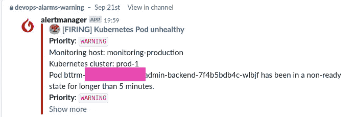
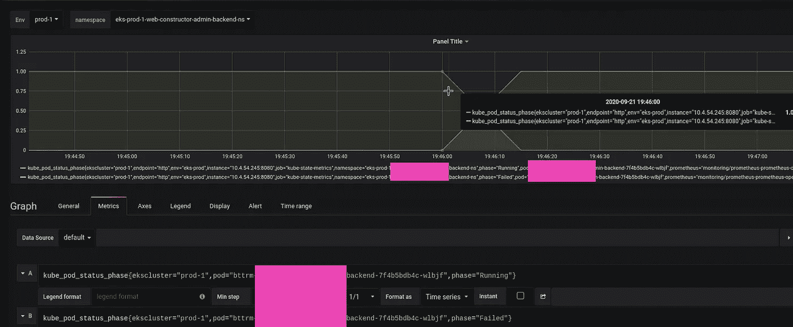
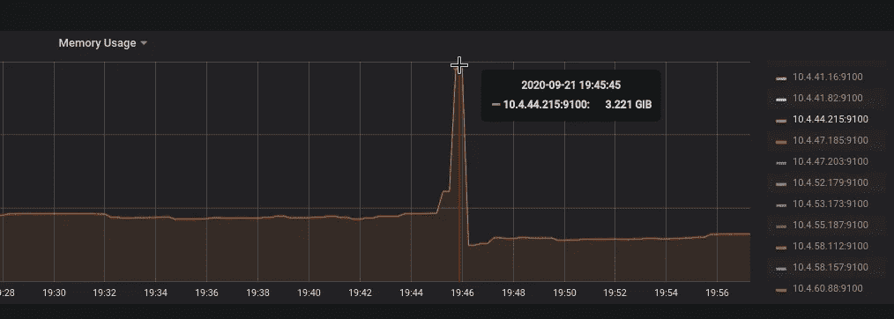
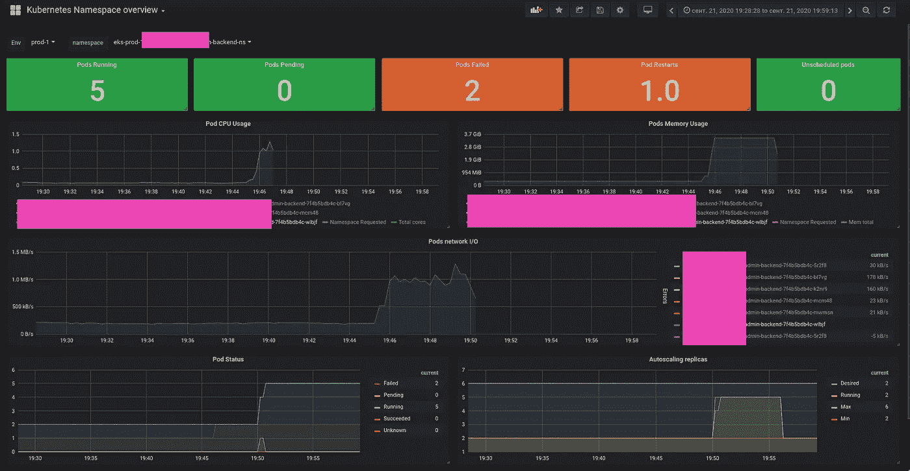

# Kubernetes:被驱逐的 pod 和 pod 服务质量

> 原文：<https://itnext.io/kubernetes-evicted-pods-and-pods-quality-of-service-4892b45aa4c0?source=collection_archive---------4----------------------->


我们有一个运行在 AWS 弹性 Kubernetes 服务上的 Kubernetes 集群。

在此群集中，我们有一个通常运行良好的应用程序，但有时我们的监控系统会通知不健康的 pod:



检查舱:

```
$ kk -n eks-prod-1-web-projectname-admin-backend-ns get pod
NAME READY STATUS RESTARTS AGE
bttrm-web-projectname-admin-backend-64648597fc-9j29n 1/1 Running 0 43m
bttrm-web-projectname-admin-backend-64648597fc-kptjj 1/1 Running 0 43m
bttrm-web-projectname-admin-backend-7f4b5bdb4c-wlbjf 0/1 Evicted 0 12d
bttrm-web-projectname-admin-backend-8478d778f9–5mrnc 0/1 Evicted 0 15d
```

在这里，我们可以看到两个 pod 处于**被逐出**状态—让我们来看看发生了什么。

# Kubernetes `requests`和`limits`

因此，在 Kubernetes 中，我们可以用两种方式限制应用程序使用的资源——用`requests`和`limits`:

```
resources:
  requests:
    cpu: 100m
    memory: 100Mi
  limits:
    cpu: 100m
    memory: 100Mi
```

这里:

*   `requests`:由 [Kubernetes 调度器](https://kubernetes.io/docs/concepts/scheduling-eviction/kube-scheduler/)使用，根据请求的值选择放置 pod 的工作节点——节点必须有足够的空闲资源在其上运行这个 pod
*   `limits`:这样一个“硬限制”——一个 pod 可以使用的资源的最大值

# Kubernetes pods QoS 类别

文档— [为 pod 配置服务质量](https://kubernetes.io/docs/tasks/configure-pod-container/quality-service-pod/)。

Kubernetes 中的 pod 可以属于三种服务质量(QoS)级别之一:

*   *保证*:pod，有请求和限制，它们对 pod 中的所有容器都是相同的
*   *可突发*:至少为一个容器设置了至少或个 CPU 或内存请求的非保证 pod
*   最大努力:没有任何要求和限制的豆荚

您可以使用`describe pod -o wide`检查您的 pod 的 QoS 等级:

```
$ kubectl get pod appname-54545944b4-h8gmv -o yaml
…
resources:
requests:
cpu: 100m
…
qosClass: Burstable
…
```

在这里，我们有仅用于 CPU 的`requests`，因此这样的 pod 将属于可突发 QoS 类别。

现在，让我们来看看 QoS 等级如何影响 pod 的寿命。

# 节点容差

当集群中的 Kubernetes WorkerNode 开始缺少可用资源(内存、磁盘、CPU 等)时，集群的调度程序首先会停止在这样的节点上添加新的 pods。

此外，Kubernetes 还为这样的节点添加了描述其状态的特殊注释，例如— `node.kubernetes.io/memory-pressure`。

点击此处查看完整列表— [基于污点的驱逐](https://kubernetes.io/docs/concepts/scheduling-eviction/taint-and-toleration/#taint-based-evictions)。

在这种情况下，这样一个节点上的`kubelet`将开始杀死正在运行的容器，它们的 pod 将处于 ***失败*** 状态。

例如，如果一个节点的硬盘耗尽，那么`kubelet`将开始删除未使用的窗格及其容器，然后将删除所有未使用的图像。

如果这还不够，那么它将按照以下顺序开始杀死(实际上是— ***驱逐*** )用户单元:

*   *尽力而为* —没有任何要求和限制的 pod
*   *可爆发的*—pod，使用在其请求中设置的更多资源
*   *可突发的* — pods 使用的资源比其请求中设置的要少

一般来说，有保证的 pod 绝不能受到任何影响，但是在节点没有更多要移除并且它仍然需要资源的情况下——`kubelet`也将开始移除这样的 pod，即使它们在有保证的 QoS 类别下。

要找到一个 pod 被驱逐的真正原因，您可以检查它的事件。

现在回到我们的豆荚:

```
$ kk -n eks-prod-1-web-projectname-admin-backend-ns get pod
NAME READY STATUS RESTARTS AGE
…
bttrm-web-projectname-admin-backend-7f4b5bdb4c-wlbjf 0/1 Evicted 0 14d
bttrm-web-projectname-admin-backend-8478d778f9–5mrnc 0/1 Evicted 0 17d
```

和他们的活动:

```
$ kk -n eks-prod-1-web-projectname-admin-backend-ns get pod bttrm-web-projectname-admin-backend-7f4b5bdb4c-wlbjf -o yaml
…
status:
message: ‘The node was low on resource: memory. Container bttrm-web-projectname-admin-backend was using 1014836Ki, which exceeds its request of 300Mi. ‘
phase: Failed
reason: Evicted
```

这里 Kubernetes 告诉我们“ ***容器使用了 1014836Ki，这超过了它要求的 300Mi*** ”。

这里 *Ki* == kibibyte (1024 字节，8192 位)，а *Mi* — mebibyte，т.е。1024 千比字节，или 1048576 字节。

让我们将 1014836Ki 转换为兆字节:

```
$ echo 1014836/1024 | bc
991
```

几乎千兆字节的节点内存。

让我们再次检查在此 pod 的部署中指定的资源:

```
$ kk -n eks-prod-1-web-projectname-admin-backend-ns get deploy bttrm-web-projectname-admin-backend -o yaml
…
resources:
  limits:
    memory: 3Gi
  requests:
    cpu: 100
    memory: 300Mi
…
```

因此，这里我们有 ni 个 CPU 限制，并且对 CPU 和内存的限制和请求不相等，那么它有 QoS 突发类。此外，这个节点没有运行其他吊舱，所以 Kubernetes 杀死了那个。

Grafana 的图表可以向我们展示全貌—检查 pod 的状态历史(参见[Kubernetes:Prometheus 操作员的集群监控](https://rtfm.co.ua/en/kubernetes-a-clusters-monitoring-with-the-prometheus-operator/)帖子):



于是 pod 在*运行*状态下在 10.4.44.215 WorkerNode 上工作，但是后来在 19:40 的时候被杀了。

这次让我们检查一下 WorkerNode 10.4.44.215:



节点内存耗尽(AWS EC2 t3.medium，4GB RAM)并且`kubelet`开始移除 pod。

让我们看看 pod 使用的资源:



实际上，我们可以看到 pod 收到了一些传入流量，并开始消耗大量内存。

节点上的记忆结束，`kubelet`杀死了那个 pod。

下面的问题是给开发人员的——或者这是意料之中的，我需要将应用程序移动到有更多可用内存的节点，或者他们在应用程序中有一些内存泄漏——开发人员必须修复它。

# 有用的链接

*   [资源配额](https://kubernetes.io/docs/concepts/policy/resource-quotas/)
*   [配置 pod 的服务质量](https://kubernetes.io/docs/tasks/configure-pod-container/quality-service-pod/)
*   [给容器和 pod 分配内存资源](https://kubernetes.io/docs/tasks/configure-pod-container/assign-memory-resource/)
*   [了解 kubernetes 中的资源限制:内存](https://medium.com/@betz.mark/understanding-resource-limits-in-kubernetes-memory-6b41e9a955f9)

*最初发布于* [*RTFM: Linux，devo PSисистемноеадминитиовваниованиее*T11*。*](https://rtfm.co.ua/en/kubernetes-evicted-pods-and-pods-quality-of-service/)