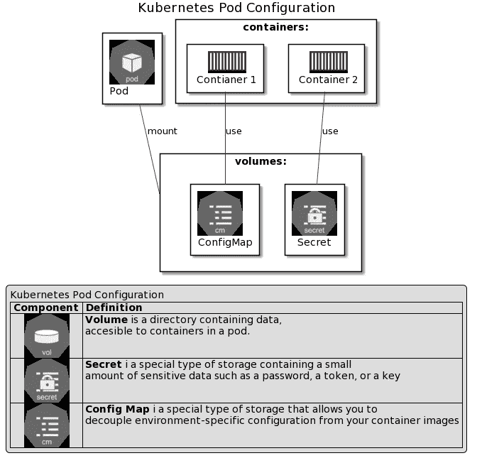
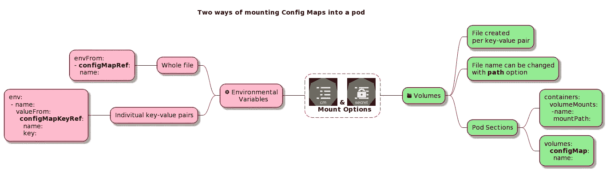

# Kubernetes 解释的够深刻:配置

> 原文：<https://itnext.io/kubernetes-explained-deep-enough-configuration-cd4a9d1d8dcd?source=collection_archive---------4----------------------->


费伦茨·阿尔马西在 [Unsplash](https://unsplash.com/s/photos/configuration?utm_source=unsplash&utm_medium=referral&utm_content=creditCopyText) 上的照片

## 第 4 部分:配置映射、秘密和卷

## 更新:增加了自定进度学习的 Katacoda 场景

[](https://www.katacoda.com/decoder/scenarios/k8s-configuration) [## k8s-配置|解码器| Katacoda

### 在本练习中，您可以随意单击 Octant 选项卡，以可视化方式探索集群状态。我们将重点关注…

www.katacoda.com](https://www.katacoda.com/decoder/scenarios/k8s-configuration) 

# 介绍

这是 Kubernetes 迷你系列的第四部 **Kubernetes 解释得够深刻了**

关于本博客的网络版以及关于 docker、Kubernetes 和 Docker 认证的更多信息，请访问:

 [## IT 认证指南

### 描述

www.itcertificationsguide.com](https://www.itcertificationsguide.com/#/) 

[第一部分:简介](https://piotrzan.medium.com/kubernetes-explained-deep-enough-1ea2c6821501)

[第 2 部分:Kubernetes 解释得够深刻:存储](/kubernetes-explained-deep-enough-storage-eb16a66483c2)

[第 3 部分:Kubernetes 解释得足够深入:部署](/kubernetes-explained-deep-enough-deployments-371755fbe2a3)

第 4 部分:Kubernetes 解释得够深刻了:配置—这个博客

[第 5 部分:服务可发现性、DNS、集群通信](https://piotrzan.medium.com/kubernetes-explained-deep-enough-services-1a0647499616)

> 如果您需要复习[配置](https://kubernetes.io/docs/concepts/configuration/)，请访问 Kubernetes 文档
> 
> 下图提供了基本定义

# 它是如何工作的？

Kubernetes 本身支持两种资源，用于存储 pods 使用的配置。两种配置类型都要求数据以*键:值*对的格式表示。

*   *配置映射*:用于存储非机密数据
*   *秘密*:用于存储机密数据(令牌、SSH 密钥、密码、证书等)

> 配置图不适合存储大量数据。为此，请使用外部存储器。作为旁注， etcd *，Kubernetes 存储其所有状态的键值存储只能容纳 1MN 大小的资源。*
> 
> *Kubernetes 中的秘密实际上不是* ***加密的*** *，而是* ***base64 编码的*** *，因此最适合存储关键敏感信息，建议使用带 Helm sidecar 的*[*hashi corp Vault*](https://learn.hashicorp.com/vault)*或公共云提供商的原生产品，如*[*Azure Key Vault*](https://azure.microsoft.com/en-us/services/key-vault/)



配置图和密码都可以通过两种方式安装到 pod 中:

*   作为卷
*   作为环境变量

> *下图显示了配置图示例中的选项，同样适用于机密信息*



# 它解决什么问题？

*   支持应用程序代码和配置的分离
*   允许接收机密和其他安全敏感信息
*   配置图或秘密的更新会自动反映在 pod 中

# 如何实施？

# 先决条件

我们将使用 [Docker 桌面](https://www.docker.com/products/docker-desktop)来实现这个例子，因为 PWK 已经有几天不为我工作了。然而，这些示例可以在任何 Kubernetes 设置上工作。

# 创建 Kubernetes 资源

> *为了更容易地使用 kubectl，我们将创建一个别名* `*alias k=kubectl*`

我们将为每个实验创建单独的 Kubernetes 资源

> ***在从远程源创建资源之前，始终检查文件的内容。***

# 让我们实验一下

> *每个实验都有相应的* `*asciinema*` *记录，您可以跟随并直接从记录中复制/粘贴命令。*

我们将重温[一节中的场景，它解决了什么问题？](#what-problem-does-it-solve)并验证陈述是否正确。

## 支持应用程序代码和配置的分离

1.  创建配置映射
2.  创建将配置映射装载为卷的部署
3.  检查配置图数据是如何装入 pod 模板中指定的文件夹的

要创建的资源:

```
*#Create config map:* k apply -f [https://raw.githubusercontent.com/Piotr1215/dca-exercises/master/k8s/configuration/1-create-configmap.yaml](https://raw.githubusercontent.com/Piotr1215/dca-exercises/master/k8s/configuration/1-create-configmap.yaml) *#Create deployment with config map mounted as volume:* k apply -f [https://raw.githubusercontent.com/Piotr1215/dca-exercises/master/k8s/configuration/4-Create-deployment.yaml](https://raw.githubusercontent.com/Piotr1215/dca-exercises/master/k8s/configuration/4-Create-deployment.yaml)
```

[](https://asciinema.org/a/384410) [## kuberneteconfigappconfigseparation

### nginx-test-59dc49778c-lg7lp 0/1 容器正在创建 00s nginx-test-59dc 49778 c-cqd j9 1/1 正在运行 0 3s…

asciinema.org](https://asciinema.org/a/384410) 

清理资源:

```
*#Delete deployment:* k delete -f [https://raw.githubusercontent.com/Piotr1215/dca-exercises/master/k8s/configuration/4-Create-deployment.yaml](https://raw.githubusercontent.com/Piotr1215/dca-exercises/master/k8s/configuration/4-Create-deployment.yaml) *#Delete config map:* k delete -f [https://raw.githubusercontent.com/Piotr1215/dca-exercises/master/k8s/configuration/1-create-configmap.yaml](https://raw.githubusercontent.com/Piotr1215/dca-exercises/master/k8s/configuration/1-create-configmap.yaml)
```

**结论:**我们已经成功地证明了应用程序和配置可以使用 confg 映射轻松地解耦

## 允许接收机密和其他安全敏感信息

> *secret 默认为 base64 编码，但是可以使用****string data:****代替****data****secret YAML*的一部分来创建纯文本的 secret

要创建的资源:

```
*#Create encoded secret:* k apply -f [https://raw.githubusercontent.com/Piotr1215/dca-exercises/master/k8s/configuration/3-create-secret-encoded.yaml](https://raw.githubusercontent.com/Piotr1215/dca-exercises/master/k8s/configuration/3-create-secret-encoded.yaml)*#Create deployment with secret mounted as volume:* k apply -f [https://raw.githubusercontent.com/Piotr1215/dca-exercises/master/k8s/configuration/5-create-deployment-secret.yaml](https://raw.githubusercontent.com/Piotr1215/dca-exercises/master/k8s/configuration/5-create-deployment-secret.yaml)
```

1.  创建秘密
2.  创建将机密装载为卷的部署
3.  检查 secret 是否正确安装在 pod 上
4.  使用*描述*命令显示秘密*密码*值
5.  从 base64 `echo 'dW5icmVha2FibGU=' | base64 --decode`解码秘密*密码*值

[](https://asciinema.org/a/384412) [## KubernetesSecretMounting

### nginx-test-59dc49778c-lg7lp 0/1 容器正在创建 00s nginx-test-59dc 49778 c-cqd j9 1/1 正在运行 0 3s…

asciinema.org](https://asciinema.org/a/384412) 

清理资源:

```
*#Delete encoded secret:* k delete -f [https://raw.githubusercontent.com/Piotr1215/dca-exercises/master/k8s/configuration/3-create-secret-encoded.yaml](https://raw.githubusercontent.com/Piotr1215/dca-exercises/master/k8s/configuration/3-create-secret-encoded.yaml) *#Delete deployment:* k delete -f [https://raw.githubusercontent.com/Piotr1215/dca-exercises/master/k8s/configuration/5-create-deployment-secret.yaml](https://raw.githubusercontent.com/Piotr1215/dca-exercises/master/k8s/configuration/5-create-deployment-secret.yaml)
```

> *Kubernetes 目前没有对其数据存储* etcd *中的秘密进行加密。挂载的机密只被编码，然而，有讨论提供静态和传输中的机密加密，所以在处理敏感信息时使用机密被认为是最佳实践。*

**结论:**我们已经成功地证明了 base64 编码的秘密可以被 pod 和容器摄取和消费

## 配置图或秘密的更新会自动反映在 pod 中

*   该功能仅适用于作为卷安装到 pod 的配置或机密
*   **如果您想要反映从配置或机密中注入的环境变量的变化，则需要手动重启 pod**
*   **你可以在这里投票推动[https://github.com/kubernetes/kubernetes/issues/22368](https://github.com/kubernetes/kubernetes/issues/22368)引入自动重启，类似于配置和秘密挂载成卷**
*   **或者，[许可控制器](https://github.com/xing/kubernetes-deployment-restart-controller)设置也是可能的，但这超出了本练习的范围**

**创建资源:**

```
*#Create config map:* k apply -f [https://raw.githubusercontent.com/Piotr1215/dca-exercises/master/k8s/configuration/1-create-configmap.yaml](https://raw.githubusercontent.com/Piotr1215/dca-exercises/master/k8s/configuration/1-create-configmap.yaml) *#Create deployment with config map mounted as volume:* k apply -f [https://raw.githubusercontent.com/Piotr1215/dca-exercises/master/k8s/configuration/4-Create-deployment.yaml](https://raw.githubusercontent.com/Piotr1215/dca-exercises/master/k8s/configuration/4-Create-deployment.yaml)
```

1.  **创建配置映射**
2.  **创建将配置映射装载为卷的部署**
3.  **检查配置图数据是如何装入 pod 模板中指定的文件夹的**
4.  **编辑配置图并调整一个值**
5.  **检查如何在 pod 模板中指定为挂载点的文件夹 pod 中更新配置映射数据**

**[](https://asciinema.org/a/384415) [## KubernetesConfigUpdate

### deployment.apps/nginx-test 映像已更新，等待部署“nginx-test”首次展示完成:3 个旧副本…

asciinema.org](https://asciinema.org/a/384415) 

清理资源:

```
*#Delete deployment:* k delete -f [https://raw.githubusercontent.com/Piotr1215/dca-exercises/master/k8s/configuration/4-Create-deployment.yaml](https://raw.githubusercontent.com/Piotr1215/dca-exercises/master/k8s/configuration/4-Create-deployment.yaml) *#Delete config map:* k delete -f [https://raw.githubusercontent.com/Piotr1215/dca-exercises/master/k8s/configuration/1-create-configmap.yaml](https://raw.githubusercontent.com/Piotr1215/dca-exercises/master/k8s/configuration/1-create-configmap.yaml)
```

**结论:**我们已经成功验证了装载到 pod 的配置值，因为在配置映射更改后，卷会自动更新

# 挑战

你想测试什么吗？思考一个场景，测试一下，然后在评论中告诉我们。**