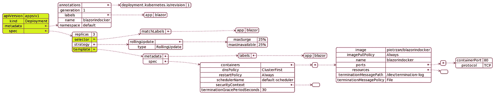
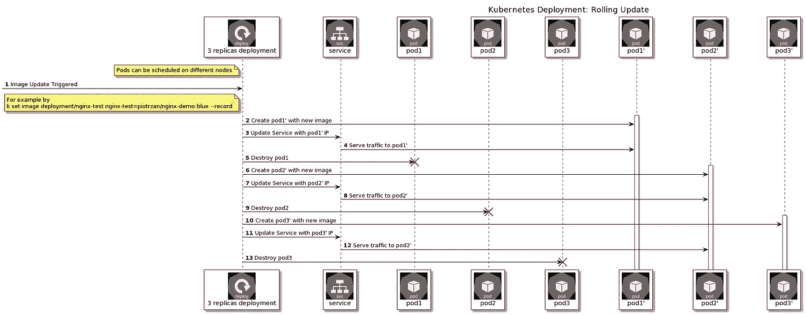

# 库本尼斯解释得够深了:部署

> 原文：<https://itnext.io/kubernetes-explained-deep-enough-deployments-371755fbe2a3?source=collection_archive---------4----------------------->

来自[皮克斯拜](https://pixabay.com/?utm_source=link-attribution&utm_medium=referral&utm_campaign=image&utm_content=441989)的[jarosaw Bialik](https://pixabay.com/users/echosystem-437254/?utm_source=link-attribution&utm_medium=referral&utm_campaign=image&utm_content=441989)的图像

## 第 3 部分:部署、推出和回滚

## 更新:为自定进度学习添加了 Katacoda 场景

 [## k8s-部署|解码器| Katacoda

### 运行 launch.sh 启动集群。现在，我们需要确保附加的 Kubernetes 节点:node01 具有相同的…

www.katacoda.com](https://www.katacoda.com/decoder/scenarios/k8s-deployments) 

# 介绍

这是库本内特斯迷你系列**的第三部分，库本内特斯解释得足够深入**

关于本博客的网络版和更多关于 docker、Kubernetes 和 Docker 认证的信息，请访问:

 [## 码头工人认证助理准备指南

### 描述

dcaguide.net](https://dcaguide.net/#/) 

[第一部分:简介](https://piotrzan.medium.com/kubernetes-explained-deep-enough-1ea2c6821501)

[第 2 部分:Kubernetes 解释够深:储存](/kubernetes-explained-deep-enough-storage-eb16a66483c2)

第三部分:库本内特斯解释得够深了:部署——这个博客

[第 4 部分:库本尼斯讲解够深:配置](https://piotrzan.medium.com/kubernetes-explained-deep-enough-configuration-cd4a9d1d8dcd)

[第五部分:服务可发现性，DNS，集群通信](https://piotrzan.medium.com/kubernetes-explained-deep-enough-services-1a0647499616)

> 如果您需要复习关于[部署](https://kubernetes.io/docs/concepts/workloads/controllers/deployment/)的内容，请访问 Kubernetes 文档
> 
> 基本定义见下图

# 它是如何工作的？

典型的部署资源由以下对象组成:

像往常一样*版本、种类、元数据和规格*是每个 Kubernetes 资源中的必填字段。部署在*规格*下增加了以下重要字段:

*   副本:通过部署复制的 pod 数量
*   选择器:告诉 Kubernetes 部署应该如何找到行动的吊舱
*   模板:本节下的字段是指部署所作用的 pod 规范

# 它解决了什么问题？

部署非常灵活，可以用于多种方式。下面，我选择了部署有助于解决的最重要的问题。

*   **可扩展性**:实现豆荚的上下扩展
*   **配置**:允许在飞行中改变吊舱状态和配置
*   **部署**:实现 pod 到新版本的零停机更新
*   **交付控制**:通过使用推出和回滚来实现对交付过程的高度控制

# 如何实施？

# 先决条件

我们将使用 [Docker Desktop](https://www.docker.com/products/docker-desktop) 来实现这个例子，因为 PWK 已经有几天不为我工作了。然而，这些示例可以在任何 Kubernetes 设置上工作。

# 创建 Kubernetes 资源

> *为了更容易地使用 kubectl，我们将创建一个别名* `*alias k=kubectl*`

创建部署:`k apply -f https://raw.githubusercontent.com/Piotr1215/dca-exercises/master/k8s/deployment/1-create-deployment.yaml`这将创建一个简单的 nginx 部署。

> *在从远程源创建资源之前，始终检查文件的内容。*

# 让我们实验一下

> *每个实验都有相应的* `*asciinema*` *记录，你可以跟着做，也可以直接从记录中复制/粘贴命令。*

我们将重温[一节中的场景，它解决了什么问题？并验证陈述是否正确。](#what-problem-does-it-solve)

## 可伸缩性:支持单元的上下扩展

1.  向上扩展部署并观察正在创建的 pod
2.  缩小部署规模，观察吊舱被终止

 [## ascicast:kubernetdeploymentscaling

### kubernetes.io/change-cause:库贝克特尔设置映像部署➜解码器…

asciinema.org](https://asciinema.org/a/383682) 

**结论:**我们已经成功地证明了 pod 可以轻松地放大和缩小。

> *在此，我们已经手动计算了 pod 副本的数量。有几种方法可以启用自动定标:*

*   [水平 Pod 自动缩放器](https://kubernetes.io/docs/tasks/run-application/horizontal-pod-autoscale/)
*   [Kubernetes 事件驱动自动缩放:KEDA](https://kubernetes.io/docs/tasks/run-application/horizontal-pod-autoscale/)

## 配置:允许在飞行中改变吊舱状态和配置

1.  将 pod 扩展到 5
2.  检查吊舱上没有环境变量
3.  在部署上设置环境变量
4.  注意到已经添加了环境变量

 [## 澳大利亚:改变部署

### kubernetes.io/change-cause:库贝克特尔设置映像部署➜解码器…

asciinema.org](https://asciinema.org/a/383703) 

**结论:**我们已经成功证明了部署中的 pod 可以通过部署操作轻松更改。

## 部署:实现 pods 到新版本的零停机更新

这个场景稍微复杂一点，所以还需要几个步骤。我们将使用 **octant** 来查看实时更新的 pods 以及由 nginx 提供的[非常简单的静态页面](https://hub.docker.com/repository/docker/piotrzan/nginx-demo)。

> *查看* [*系列介绍*](/kubernetes-explained-deep-enough-1ea2c6821501) *进行设置。*

1.  安装并运行 **octant**
2.  安装[浏览器自动刷新插件](https://www.supersimpleautorefresh.tk/)查看更新效果
3.  如果尚未创建部署，请创建部署
4.  将部署扩展到 5 个副本
5.  通过创建类型为*节点端口*的服务来公开部署
6.  检查新服务的端口
7.  在浏览器中访问 pod**localhost:PORT**
8.  更新由我们的部署控制的 pod 中运行的容器的映像
9.  观察页面如何更改为新版本

这个短片展示了实际操作的步骤

**结论:**我们已经成功地证明了部署中的 pod 可以轻松地用新版本的映像进行更新，而不会导致可用性停机。

## 交付控制:通过使用推出和回滚来实现对交付过程的高度控制

首先，我们需要了解 Kubernetes 如何执行更新:

> *Kubernetes 支持两种部署策略*

*   滚动更新
*   再创造

> *我们只关注*下面的 RollingUpdate

*来源*:[https://kubernetes . io/docs/tutorials/kubernetes-basics/update/update-intro/](https://kubernetes.io/docs/tutorials/kubernetes-basics/update/update-intro/)

回滚只是滚动更新的反向操作。Kubernetes 存储以前更新的状态，所以很容易恢复到以前的版本。

让我们开始吧！

1.  您应该拥有前面示例中的部署和服务，确保将副本设置为 10
2.  检查当前部署的映像，并通过设置映像的新版本(蓝色或绿色标签)来触发滚动更新
3.  观察 Kuberentes 如何进行首次展示
4.  通过设置图像的新版本来触发另一个滚动更新，但是这次在图像名称上出错
5.  观察 Kuberentes 如何进行首次展示
6.  检查日志以查看错误消息
7.  检查首次展示历史以确定记录了多少个修订，至少应该有一个
8.  执行回滚到以前的版本
9.  观察 Kuberentes 如何执行新的首次展示
10.  对服务进行检查，以确保部署成功

 [## ascicast:kubernetdeploymentrolloutsrollbacks

### nginx-test-59dc49778c-lg7lp 0/1 容器正在创建 00s nginx-test-59dc 49778 c-cqd j9 1/1 正在运行 0 3s…

asciinema.org](https://asciinema.org/a/383849) 

**结论:**我们已经成功地证明了 Kubernetes 允许通过推出和回滚对软件交付过程进行细粒度控制。

# 挑战

你想测试什么吗？思考一个场景，测试一下，然后在评论中告诉我们。