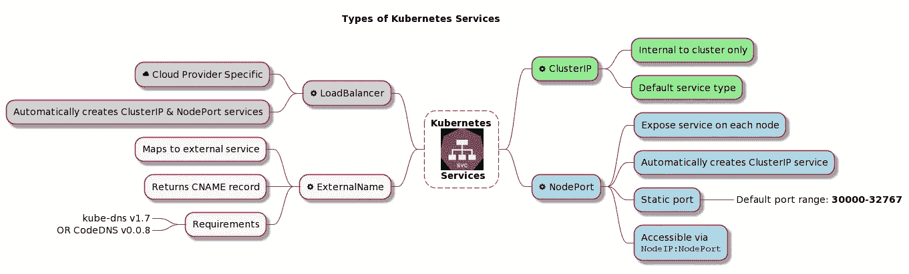
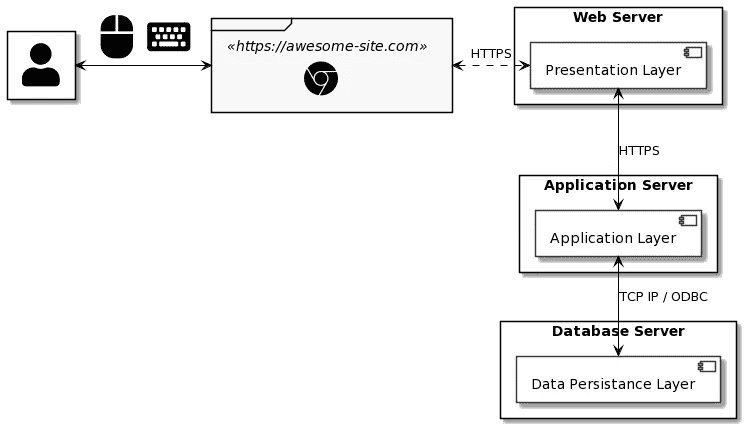
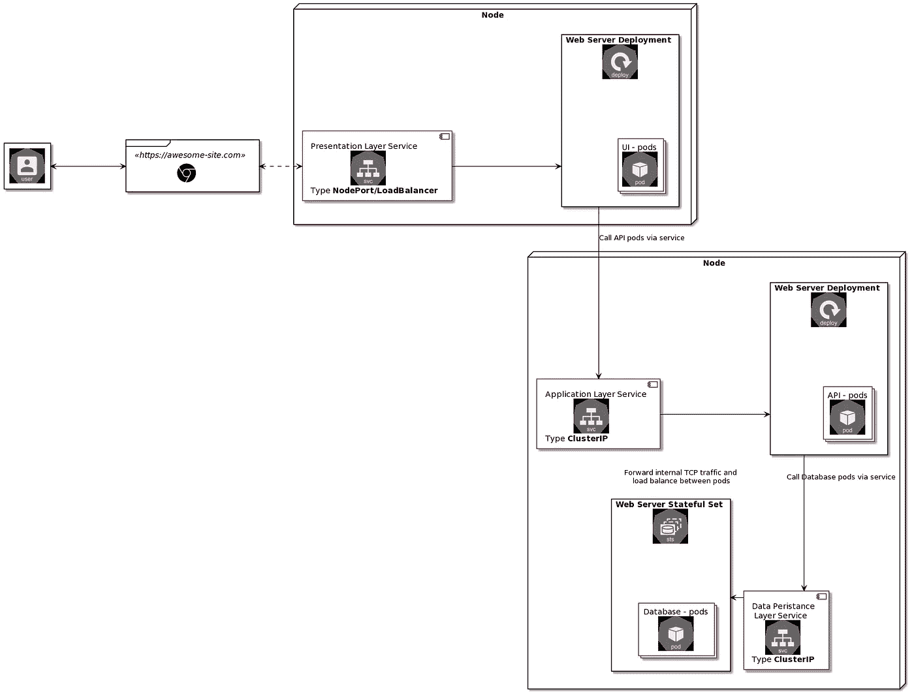
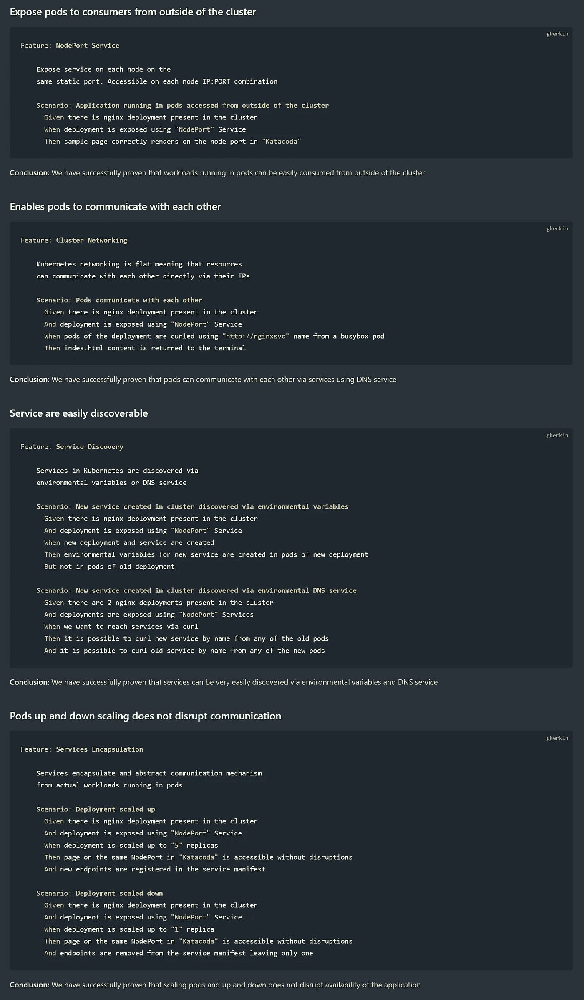

# Kubernetes 解释得足够深刻:服务

> 原文：<https://itnext.io/kubernetes-explained-deep-enough-services-1a0647499616?source=collection_archive---------3----------------------->

图片由[皮克斯拜](https://pixabay.com/?utm_source=link-attribution&utm_medium=referral&utm_campaign=image&utm_content=3699542)的 Gerd Altmann 提供

## 第 5 部分:服务可发现性、DNS、集群通信

# 介绍

这是 Kubernetes 迷你系列的第五部 **Kubernetes 解释得够深刻了**

关于本博客的网络版以及关于 docker、Kubernetes 和 Docker 认证的更多信息，请访问:

 [## IT 认证指南

### 描述

www.itcertificationsguide.com](https://www.itcertificationsguide.com/#/) 

## 自定进度学习的 Katacoda 场景

 [## Kubernetes 网络:公开和消费服务|解码器| Katacoda

### 这个场景是 Kubernetes 的博客的一部分，解释得足够深入。Kubernetes 网络是一个非常复杂的话题…

www.katacoda.com](https://www.katacoda.com/decoder/courses/k8s-networking/k8s-networking-services) 

[第一部分:简介](https://piotrzan.medium.com/kubernetes-explained-deep-enough-1ea2c6821501)

[第 2 部分:Kubernetes 解释得够深刻:存储](/kubernetes-explained-deep-enough-storage-eb16a66483c2)

[第 3 部分:Kubernetes 解释得足够深入:部署](/kubernetes-explained-deep-enough-deployments-371755fbe2a3)

[第四部分:Kubernetes 解释得够深刻:配置](/kubernetes-explained-deep-enough-configuration-cd4a9d1d8dcd)

第 5 部分:服务可发现性、DNS、集群通信——这个博客

这个博客比其他部分稍微长一点，Kubernetes 解释得足够深入。Kubernetes 网络是一个非常复杂的主题，试图写出不同服务和机制的所有细微差别可能需要几个博客。相反，我们将关注 Kubernetes 网络的特定领域:服务，并着眼于它们的实际应用。

由于本系列是关于练习和实践的例子，我们将较少关注对每种服务类型的深入研究，而是将它们合并到一个更广泛的类别*网络*中，并从整体的角度来看待它，只突出那些对我们将使用的例子重要的方面。

> 如果您需要复习关于[服务](https://kubernetes.io/docs/concepts/services-networking/service/)的内容，请访问 Kubernetes 文档
> 
> 下图提供了基本定义

# 它是如何工作的？

在 Kubernetes *中，service* 是一种资源，它抽象并封装了一种将运行在 pods 中的应用程序公开为网络服务的方式。

> 虽然服务不需要 DNS 就能工作，但强烈建议使用附加组件在 Kubernetes 上设置 DNS 服务。有几个 DNS 服务兼容 [*Kubernetes dns 规范*](https://github.com/kubernetes/dns/blob/master/docs/specification.md) *，2 个最流行的是:*

*   [核心域名](https://coredns.io/)
*   [Kube-DNS](https://github.com/kubernetes/dns)

在集群上设置 DNS 服务后，利用为每个服务创建的 DNS 记录来调用服务是非常容易的。由于 Kubernetes 网络是扁平的，这意味着资源可以通过它们的 IP 直接相互通信，这意味着应该可以从任何名称空间中的任何 pod 调用任何名称空间中的任何服务(假设没有网络策略阻止流量)。

Kubernetes 有 4 种类型的服务:

[https://kubernetes . io/docs/concepts/services-networking/service/# publishing-services-service-types](https://kubernetes.io/docs/concepts/services-networking/service/#publishing-services-service-types)

> *关于端口的注意事项:理解服务清单中哪些端口做什么经常会令人困惑，所以让我们确保刷新定义:*

*   **目标端口**是*应用*配置给*监听*的端口
*   **端口**是从外部访问应用程序的方式
*   ***节点端口**是每个节点上的*静态端口*，类型*节点端口*的服务被公开*

# *它解决什么问题？*

*   *向集群外部的消费者公开 pod*
*   *使 pod 能够相互通信*
*   *服务很容易被发现*
*   *pod 向上和向下缩放不会中断通信*

# *如何实施？*

*我们将重温[一节中的场景，它解决了什么问题？](#what-problem-does-it-solve)并验证陈述是否正确。*

> **如果你想学习一些有用的网络命令，我已经创建了一个帮助我通过 CKA 认证的要点**

# *先决条件*

*这次我们将使用 [katacoda](https://www.katacoda.com/) 代替 asciinema 录音。你只需要一个网络浏览器，好奇的心态和一些学习新事物的业余时间，不需要其他先决条件:)*

> ***是一项伟大的免费服务。这是一个“为软件工程师提供的交互式学习和培训平台”，能够“在您的浏览器中使用真实环境学习新技术”***

# **示例场景**

**在任何系统中，一个非常常见的需求是能够促进已部署工件之间的点对点通信。这种类型的通信最常见的场景之一是多层架构(最常见的是 3 层):**

*   **表示层(UI)**
*   **应用层(业务逻辑、API、中间件)**
*   **数据持久层(通常是数据库，但也可以是磁盘等)**

**下图显示了多层架构应用程序不同层之间的连接。我们将看到如何使用 Kubernetes 的本地资源重新创建这个设置的通信部分。**

****

> ***现代架构，尤其是微服务遵循不同的架构模式。例如* [*十二因素应用*](https://12factor.net/) *方法，其中应用层和数据持久层之间的连接通过 HTTPS 完成，通常应用的 UI 部分作为静态 web 应用或 SPA。***

**Kubernetes 世界和更广泛的基础设施即代码时代的一个关键区别是，服务器和其他资源一样，是动态配置的。工作负载可以随时在不同的服务器上重新安排，无需通知，一切都将照常运行。因此，第一个变化是，我们有了动态、灵活的基础架构，而不是固定的服务器。这些是 Kubernetes 集群节点。**

**我们不打算关注在公共 DNS 上发生的浏览器地址中 URL 的 DNS 解析。**

**现在，让我们看看使用 Kubernetes 时类似的架构会是什么样子:**

****

**通过引入*服务*抽象，我们将实际工作负载从通信机制中分离出来。这使我们能够利用 Kubernetes 基础设施的动态特性，并释放更多可能性，如扩展、层分离等。Kubernetes 现在可以将 pod 移动到其他节点，扩展它们，或者破坏和重新创建，而不会对我们的应用程序造成中断。**

**这一次，对于每个场景，我们将使用称为[小黄瓜语法](https://docs.specflow.org/projects/specflow/en/latest/Gherkin/Gherkin-Reference.html)的形式化符号。这将帮助我们更好地表达我们实验的目标和条件。**

> ***通常我们会使用测试框架，如* [*Specflow*](https://docs.specflow.org/projects/specflow/en/latest/index.html) *或*[*Cucumber*](https://cucumber.io/)*，但出于学习的目的，我们将在 Katacoda 环境中手动执行步骤。***

**让我们描述一下我们的场景，然后前往我的 [Katacoda 场景](https://www.katacoda.com/decoder/courses/k8s-networking/k8s-networking-services)并自己进行实验！**

** [## Kubernetes 网络:公开和消费服务|解码器| Katacoda

### 这个场景是 Kubernetes 的博客的一部分，解释得足够深入。Kubernetes 网络是一个非常复杂的话题…

www.katacoda.com](https://www.katacoda.com/decoder/courses/k8s-networking/k8s-networking-services) 

# Katacoda 场景

下面是用 katacoda 编写的测试场景的概述。每个场景都用 gherkin 语法编写，并在我们的实验环境中突出了 Kubernetes 的一个特性。

剧透警报，所有测试成功通过:)

# 挑战

你想测试什么吗？思考一个场景，测试一下，然后在评论中告诉我们。**