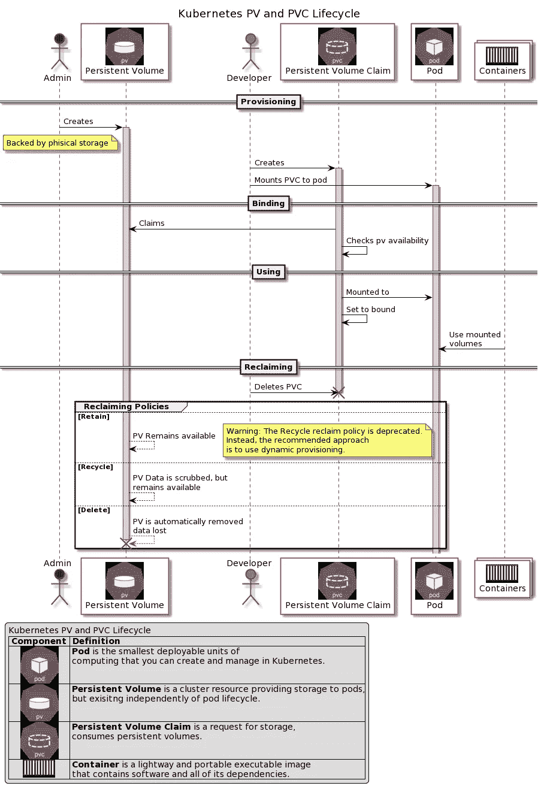

# Kubernetes 解释得足够深刻:存储

> 原文：<https://itnext.io/kubernetes-explained-deep-enough-storage-eb16a66483c2?source=collection_archive---------2----------------------->


图片来自 [Pixabay](https://pixabay.com/?utm_source=link-attribution&utm_medium=referral&utm_campaign=image&utm_content=1850170) 的[像素](https://pixabay.com/users/pexels-2286921/?utm_source=link-attribution&utm_medium=referral&utm_campaign=image&utm_content=1850170)

第 2 部分:持久卷和持久卷声明

# 介绍

这是 Kubernetes 迷你系列的第二部 **Kubernetes 解释得够深刻了**

关于本博客的网络版以及关于 docker、Kubernetes 和 Docker 认证的更多信息，请访问:

 [## IT 认证指南

### 描述

www.itcertificationsguide.com](https://www.itcertificationsguide.com/#/) 

[第一部分:简介](https://piotrzan.medium.com/kubernetes-explained-deep-enough-1ea2c6821501)

第 2 部分:Kubernetes 解释得够深刻了:存储——这个博客

[第三部分:Kubernetes 解释得够深刻:部署](https://piotrzan.medium.com/kubernetes-explained-deep-enough-deployments-371755fbe2a3)

[第四部分:Kubernetes 解释得够深刻:配置](https://piotrzan.medium.com/kubernetes-explained-deep-enough-configuration-cd4a9d1d8dcd)

[第 5 部分:服务可发现性、DNS、集群通信](https://piotrzan.medium.com/kubernetes-explained-deep-enough-services-1a0647499616)

> 如果您需要复习关于[持久卷](https://kubernetes.io/docs/concepts/storage/persistent-volumes/)和[持久卷声明](https://kubernetes.io/docs/concepts/storage/persistent-volumes/#persistentvolumeclaims)的内容，请访问 Kubernetes 文档
> 
> 下图提供了基本定义

# 它是如何工作的？

集群管理员创建*持久卷*作为集群资源，开发人员使用*持久卷声明*来使用持久卷。这个过程有些手动，但是有一些方法可以通过*存储类和动态卷供应*来实现自动化，我们将在下一个练习中探讨这些方法。

下图显示了 pv、pvc、pod 及其容器之间的典型交互，以创建、认领、使用和清理存储。



# 它解决什么问题？

PVs 和 PVC 解决了几个问题:

*   销毁 pod 后启用持久化数据
*   将存储配置活动与其消耗分离开来(这使得集群管理员和开发人员之间的顾虑得以分离)
*   启用 pod 之间的数据共享

# 如何实施？

## 先决条件

我们将基于 Azure AKS 集群实现这个例子。

> *要使用 terraform 在 Azure 上创建 AKS 集群，请遵循* [*我的指南*](https://piotrzan.medium.com/try-kubernetes-in-cloud-for-free-e5e431c507a7) *或者使用* [*微软 AKS 部署演练使用 az CLI*](https://docs.microsoft.com/en-us/azure/aks/kubernetes-walkthrough)

我们将遵循上图中的步骤，看看这在实践中是如何工作的。

## 创建 Kubernetes 资源

此步骤假设您已经创建了带有文件共享的存储帐户，如果没有[请按照以下步骤创建它](https://docs.microsoft.com/en-us/azure/aks/azure-files-volume#create-an-azure-file-share)。

创建存储帐户和文件共享后，我们需要创建 Kubernetes secret，并提供文件共享的凭据，以使 pod 能够访问文件共享

> *为了更容易地使用 kubectl，我们将创建一个别名* `*alias k=kubectl*`

```
# Define variables
RG="<resource group name where storage account is>"
AKS_PERS_STORAGE_ACCOUNT_NAME="<storage account name>"# Retrieve storage key
STORAGEKEY=$(az storage account keys list --account-name $AKS_PERS_STORAGE_ACCOUNT_NAME --resource-group $RG \
--query "[?keyName == 'key1'].value" -o tsv)echo $AKS_PERS_STORAGE_ACCOUNT_NAME
echo $STORAGEKEY# Create secret to enable the pod to mount the PVC
k create secret generic azure-secret --from literal=azurestorageaccountname=$AKS_PERS_STORAGE_ACCOUNT_NAME \
--from-literal=azurestorageaccountkey=$STORAGEKEY
```

一旦秘密被创造出来，我们就可以为这个练习创造资源。Kubectl 使我们能够基于远程 yaml 文件创建资源，在本例中是来自练习 Github 存储库。

> ***在从远程源创建资源之前，总是检查文件的内容。***

```
*#Persistent Volume bound to the file share* 
k apply -f https://raw.githubusercontent.com/Piotr1215/dca-exercises/master/k8s/storage-pv-pvc/1-create-pv.yaml 

*#Persistent Volume Claim* 
k apply -f https://raw.githubusercontent.com/Piotr1215/dca-exercises/master/k8s/storage-pv-pvc/2-create-pvc.yaml *#Pod with Persistent Volume Claim mounted as volume* 
k apply -f https://raw.githubusercontent.com/Piotr1215/dca-exercises/master/k8s/storage-pv-pvc/3-create-pod.yaml
```

> *在不使用持久卷的情况下，可以在 pod 和 Azure 文件共享之间创建绑定。也可以让 Azure 动态提供文件共享给 Kubernetes 资源使用。出于练习和演示的目的，我们在这里详细说明。*

# 让我们实验一下

我们将重温*一节中的场景，它解决了什么问题？并验证这些陈述是正确的。*

## 销毁 pod 后启用持久化数据

```
# Create a file inside a mounted folder of the pod
k exec -it testpod -- sh
cd /mnt/azure/
echo "Will I still be here for new pod?" > testfile.txt
cat testfile.txt# Remove the pod
k delete pod testpod# Create pod again
k apply -f https://raw.githubusercontent.com/Piotr1215/dca-exercises/master/k8s/storage-pv-pvc/3-create-pod.yaml# Check if the file still exist in the mounted directory
k exec -it testpod -- cat /mnt/azure/testfile.txt
```

最后一个命令应该产生文本:“我还会在这里等待新的 pod 吗？”

**结论:**我们已经成功地证明了在 pod 破坏事件之间数据是持久的。

## 将存储资源调配活动与其消费相分离

```
# Increase persistent volume capacity
k edit pv azurefile# Change storage to 10Gi, exit and save vim (:wq). Check pv
k describe pv azurefile# Make sure that file is still there
k exec -it testpod -- cat /mnt/azure/testfile.txt
```

**结论:**我们已经成功地证明了数据集群管理员可以在不影响开发人员活动的情况下执行他们的任务。

## 启用 pod 之间的数据共享

```
# Create another pod bound to the same persistent volume
k apply -f https://raw.githubusercontent.com/Piotr1215/dca-exercises/master/k8s/storage-pv-pvc/4-create-pod2.yaml# Open new Azure Cloud session and exec into testpod
k exec -it testpod -- sh
cd /mnt/azure/
ls# Watch for file changes
watch -n1 'ls ./*'# Swap to another shell and create file in testpod2
k exec -it testpod2 -- touch /mnt/azure/new_testfile.txt
```

最后一个命令应该导致 *new_testfile.txt* 立即出现在另一个 shell 中

**结论:**我们已经成功证明了 pod 之间可以实时共享数据。

## 清除

运行`k get pv`显示持久卷*回收策略*处于**回收**模式。这意味着删除 pod 后，永久卷将保持可用。通过移除 pod 来测试它，并检查您的文件共享是否仍然存在。

> 如果你使用免费订阅，不要忘记清理 Azure 上的资源。最简单的方法是删除创建所有资源的资源组。在我们的例子中`az group delete --name ResourceGroupName`

# 挑战

你想测试什么吗？思考一个场景，测试一下，然后在评论中告诉我们。