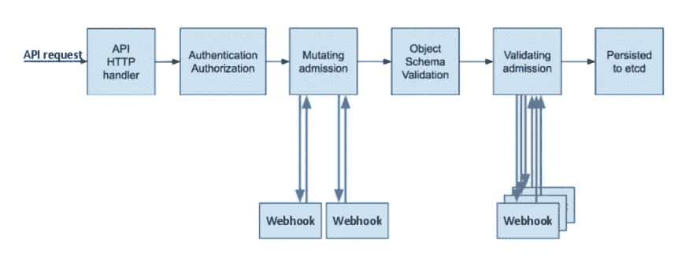

# Kubernetes 扩展性介绍

> 原文：<https://itnext.io/kubernetes-extensibility-c5fed27f0952?source=collection_archive---------3----------------------->


Kubernetes 提供了很多好处:一个拥有大量参与者的巨大生态系统，自我修复能力等。然而，没有免费的午餐。它也有缺点，主要是复杂性和运营成本。

然而，我和 Kubernetes 合作得越多，我就越觉得它最重要的资产是**可扩展性**。如果您需要平台默认不提供的东西，可以选择自己开发并集成它。在这篇文章中，我想列出这样的扩展点。

# 库伯内特 101

很多关于 Kubernetes 的解释都集中在架构上。我相信他们考虑太多细节而忽略了大局。在这里，我只想强调一下基本概念。

在最基本的层面上，Kubernetes 只是一个能够运行容器映像的平台。它将其配置存储在分布式存储引擎中。该配置的最重要部分专用于对象的*期望状态*。例如，只有当您使用`kubectl`命令行安排一个 pod 时，您才可以更新这个状态。

称为控制器的其他组件观察配置变化并读取*期望状态*。然后，他们试图使*期望状态*与*实际状态*相一致。这不是什么革命性的东西:Puppet 基于同样的控制回路方法，而 AFAIK，Chef。通常，控制器管理单一类型的对象，*例如，*，`DeploymentController`管理部署。

制作通用工具背后的想法是遵循帕累托定律:用 20%的努力解决 80%的问题。不幸的是，工具越通用，用户基础越广泛，就越需要定制剩下的 20%。

Kubernetes 的设计师认为这个问题是广泛采用的最关键的障碍。因此，Kubernetes 提供了许多扩展点。

# 可扩展模型

在上一节中，我提到了调度 pod。pod 是 Kubernetes 开箱即用的众多对象之一。其他对象包括:部署、作业、服务等。

一些解决方案很容易符合这种模式。例如，可以很容易地创建三个 Hazelcast 吊舱的部署。它开箱即用:豆荚将通过网络多播，找到彼此，并形成一个集群。

其他解决方案并不如此同质。在 [KIP-500](https://cwiki.apache.org/confluence/display/KAFKA/KIP-500%3A+Replace+ZooKeeper+with+a+Self-Managed+Metadata+Quorum) 之前，卡夫卡会依赖动物园管理员。At 集群由至少三个 Zookeeper 节点和任意数量的 Kafka 节点组成。Kubernetes 使得在同一个 pod 上部署多个映像成为可能。然而，如果所有需要的组件都在同一个 pod 上，而 pod 出现故障，那就什么都不是了。我们应该将一个常规组件映射到一个 pod。

在这种情况下，我们需要一个功能齐全的 Kubernetes 清单来描述架构。由于不同的需求，我们需要使它可配置。Kubernetes 的生态系统提供了几个解决这个问题的替代方案:Kustomize 和 Helm 是最流行的解决方案。但是两者都不能在理想的抽象层次上工作，即 Kafka 集群。

因此，Kubernetes 允许设计一个新的`Kafka`对象。这种自定义对象被称为 CRD。下面是一个简单的任意`Foo`对象的例子:

```
apiVersion: apiextensions.k8s.io/v1       #1
kind: CustomResourceDefinition
metadata:
 name: foos.frankel.ch                    #2
spec:
 group: frankel.ch                        #3
 names:
   plural: foos                           #4
   singular: foo                          #5
   kind: Foo                              #6
 scope: Namespaced                        #7
 versions:
   - name: v1alpha1
     served: true                         #8
     storage: true                        #9
     schema:
       openAPIV3Schema:
         type: object
         properties:
           spec:
             type: object
             properties:
               bar:
                 type: string
             required: ["bar"]
         required: ["spec"]
```

1.  必需的标题
2.  匹配以下`<plural>.<group>`
3.  REST API 的组名— `/apis/<group>/<version>`
4.  REST API 的复数名称— `/apis/<group>/<version>/<plural>`
5.  用于 CLI 和显示的单数名称
6.  在清单中使用
7.  可以是`Cluster`也可以是`Namespaced`。一个`Cluster`资源被声明为集群范围的，每个集群可以有一个单独的资源；`Namespaced`资源可以是多个，需要在一个命名空间下；默认情况下，`default`
8.  可以启用/禁用某个版本
9.  最新版本必须标记为存储版本

一旦应用了这个清单，您就可以管理您的`Foo`。让我们创建一个清单来创建一个新的`Foo`对象。

```
apiVersion: foos.frankel.ch/v1alpha1
kind: Foo
metadata:
  name: myfoo
spec:
  bar: "whatever"kubectl apply -f foo.yml
kubectl get foo
```

以上命令用新的`Foo`类型更新了数据模型，并创建了一个`Foo`对象。但是实际上，我们只是通过 Kubernetes API 将数据存储在`etcd`中。除非我们启动一个控制器来观察新的对象并对它们进行操作，否则什么都不会发生。请注意，管理 CRDs 的控制器的名称是*操作员*。

# 可扩展验证

对于可以运行第三方工作负载的平台，一个常见的问题是只允许经过审查的工作负载。有些工作负载可能会消耗太多资源；其他人可能是恶意的。

这里有两个具体的场景:

*   作为集群操作员，您希望管理集群有限的物理资源(CPU/内存)并在所有 pod 之间共享它们。为此，您需要强制每个 pod 描述其[资源需求](https://kubernetes.io/docs/concepts/configuration/manage-resources-containers/)。开发人员通过设置`request`和`limits`属性来实现这一点。您想要禁止没有它们的 pod。
*   作为一名注重安全的操作员，您希望防止[权限升级](https://docs.bridgecrew.io/docs/bc_k8s_19)。它不应该改变豆荚的最终行为。你想把`allowPrivilegeEscalation=false`加到每一个豆荚里。

虽然可以通过“构建”管道来管理这两种情况，但 Kubernetes 提供了开箱即用的解决方案。

正如我上面解释的，Kubernetes 存储配置是`etcd`，而控制器观察变化并对其采取行动。为了防止不必要的行为，最安全的方法是验证改变配置的有效负载；这是*准入控制器*的作用。

> *准入控制器是一段代码，它在对象持久化之前，但是在请求被认证和授权之后，拦截对 Kubernetes API 服务器的请求。控制器由下面的列表组成，被编译成 kube-apiserver 二进制文件，并且只能由集群管理员进行配置。在那个列表中，有两个特殊的控制器:* `*MutatingAdmissionWebhook*` *和* `*ValidatingAdmissionWebhook*` *。它们分别执行在 API 中配置的变异和验证准入控制网络挂钩。*
> 
> *—* [*使用录取控制器*](https://kubernetes.io/docs/reference/access-authn-authz/admission-controllers/)

简而言之，有两种准入控制器可用:

1.  验证准入 webhook 允许/阻止请求改变状态
2.  变异准入网页挂钩改变请求

它们按照下图依次运行:



*从* [*到*](https://kubernetes.io/blog/2019/03/21/a-guide-to-kubernetes-admission-controllers) 的一个引导

每个都可以解决上面强调的场景。

# 可扩展的客户端功能

在最基本的层面上，`kubectl`命令行是对 REST 客户端的高级抽象。您可以通过设置详细选项来验证它:

```
kubectl get pods --v=8loader.go:372] Config loaded from file:  /Users/nico/.kube/config
round_trippers.go:463] GET https://127.0.0.1:61378/api/v1/namespaces/default/pods?limit=500
round_trippers.go:469] Request Headers:
round_trippers.go:473]     Accept: application/json;as=Table;v=v1;g=meta.k8s.io,application/json;as=Table;v=v1beta1;g=meta.k8s.io,application/json
round_trippers.go:473]     User-Agent: kubectl/v1.24.2 (darwin/arm64) kubernetes/f66044f
round_trippers.go:574] Response Status: 200 OK in 8 milliseconds
round_trippers.go:577] Response Headers:
round_trippers.go:580]     Cache-Control: no-cache, private
round_trippers.go:580]     Content-Type: application/json
round_trippers.go:580]     X-Kubernetes-Pf-Flowschema-Uid: 479e2d49-7b9f-4e4c-8fca-63c273cfb525
round_trippers.go:580]     X-Kubernetes-Pf-Prioritylevel-Uid: 4787583d-e7d4-4679-a474-ebb66919a43c
round_trippers.go:580]     Date: Sun, 04 Sep 2022 09:32:39 GMT
round_trippers.go:580]     Audit-Id: 2f2f163d-fb6d-4149-ba44-ecf4395028aa
request.go:1073] Response Body: {"kind":"Table","apiVersion":"meta.k8s.io/v1","metadata":{"resourceVersion":"263411"},"columnDefinitions":[{"name":"Name","type":"string","format":"name","description":"Name must be unique within a namespace. Is required when creating resources, although some resources may allow a client to request the generation of an appropriate name automatically. Name is primarily intended for creation idempotence and configuration definition. Cannot be updated. More info: http://kubernetes.io/docs/user-guide/identifiers#names","priority":0},{"name":"Ready","type":"string","format":"","description":"The aggregate readiness state of this pod for accepting traffic.","priority":0},{"name":"Status","type":"string","format":"","description":"The aggregate status of the containers in this pod.","priority":0},{"name":"Restarts","type":"string","format":"","description":"The number of times the containers in this pod have been restarted and when the last container in this pod has restarted.","priority":0},{"name":"Age","type":"st [truncated 6465 chars]
```

Kubernetes 的 REST API 是(大部分？)基于 CRUD 操作。有时，您需要运行几个命令来获得想要的结果。例如，我们希望查询哪些主体可以执行某个操作。

`kubectl`包括一个机制，让[编写代码](https://kubernetes.io/docs/tasks/extend-kubectl/kubectl-plugins/)来编排这些调用。该机制与 Git 非常相似:

1.  你根据特定的格式编写代码——一个*插件*
2.  你在你的`PATH`变量中设置它

从这一点上，`kubectl`可以发现它。

您可以在您的机器上管理您的插件，但是这种方法不能扩展到整个组织。解决方案是插件管理器。认识克鲁:

> *Krew 是* `*kubectl*` *命令行工具的插件管理器。*
> 
> *Krew 帮你:*
> 
> **发现* `*kubectl*` *插件，*
> 
> **将它们安装到您的机器上，*
> 
> **并保持已安装的插件最新。*
> 
> *—* [*什么是 Krew？*](https://krew.sigs.k8s.io/)

关于哪些主体可以执行操作，以下是操作方法:

```
brew install krew                              #1 
kubectl krew completion                        #2
# follow instructions to update your shell
kubectl krew update                            #3
kubectl krew install who-can                   #4
k who-can watch pod                            #5
```

1.  在 Mac 上安装`brew`
2.  显示自动完成指令
3.  更新缓存的插件列表
4.  安装`who-can` Krew 插件
5.  尽情享受吧！

```
No subjects found with permissions to watch pod assigned through RoleBindingsCLUSTERROLEBINDING                             SUBJECT                                 TYPE            SA-NAMESPACE
apisix-clusterrolebinding                      apisix-ingress-controller               ServiceAccount  ingress-apisix
cluster-admin                                  system:masters                          Group
local-path-provisioner-bind                    local-path-provisioner-service-account  ServiceAccount  local-path-storage
system:controller:attachdetach-controller      attachdetach-controller                 ServiceAccount  kube-system
system:controller:daemon-set-controller        daemon-set-controller                   ServiceAccount  kube-system
system:controller:deployment-controller        deployment-controller                   ServiceAccount  kube-system
system:controller:endpoint-controller          endpoint-controller                     ServiceAccount  kube-system
system:controller:endpointslice-controller     endpointslice-controller                ServiceAccount  kube-system
system:controller:ephemeral-volume-controller  ephemeral-volume-controller             ServiceAccount  kube-system
system:controller:generic-garbage-collector    generic-garbage-collector               ServiceAccount  kube-system
system:controller:job-controller               job-controller                          ServiceAccount  kube-system
system:controller:persistent-volume-binder     persistent-volume-binder                ServiceAccount  kube-system
system:controller:pod-garbage-collector        pod-garbage-collector                   ServiceAccount  kube-system
system:controller:pvc-protection-controller    pvc-protection-controller               ServiceAccount  kube-system
system:controller:replicaset-controller        replicaset-controller                   ServiceAccount  kube-system
system:controller:replication-controller       replication-controller                  ServiceAccount  kube-system
system:controller:resourcequota-controller     resourcequota-controller                ServiceAccount  kube-system
system:controller:statefulset-controller       statefulset-controller                  ServiceAccount  kube-system
system:coredns                                 coredns                                 ServiceAccount  kube-system
system:kube-controller-manager                 system:kube-controller-manager          User
system:kube-scheduler                          system:kube-scheduler                   User
```

# 结论

在本文中，我们浏览了 Kubernetes 中的几个扩展点:数据模型、准入控制器和客户端。这是一个非常简短的介绍，在广度和深度上都是如此。然而，我希望它能为进一步的研究提供一个很好的切入点。

*   [用 CustomResourceDefinitions 扩展 Kubernetes API](https://kubernetes.io/docs/tasks/extend-kubernetes/custom-resources/custom-resource-definitions/)
*   [自定义资源定义中的版本](https://kubernetes.io/docs/tasks/extend-kubernetes/custom-resources/custom-resource-definition-versioning/)
*   [使用许可控制器](https://kubernetes.io/docs/reference/access-authn-authz/admission-controllers/)
*   [用插件扩展 ku bectl](https://kubernetes.io/docs/tasks/extend-kubectl/kubectl-plugins/)
*   [Krew 插件](https://krew.sigs.k8s.io/plugins/)

*原载于* [*一个 Java 怪胎*](https://blog.frankel.ch/kubernetes-extensibility/)*2022 年 9 月 18 日*