# kubernetes & F @ H——与新冠肺炎战斗

> 原文：<https://itnext.io/kubernetes-f-h-battling-covid-19-152883904b0c?source=collection_archive---------9----------------------->

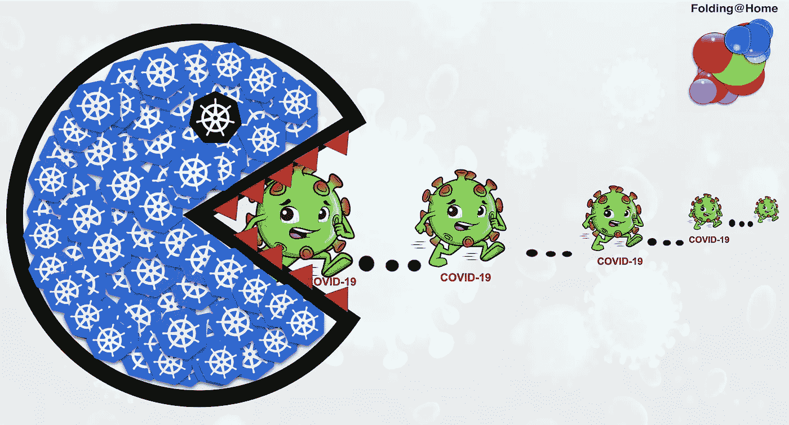

在家折叠 Kubernetes 上的 FAH 客户端——模拟蛋白质折叠

Folding@home (FAH 或 F@h)是一个分布式计算项目，用于疾病研究，模拟蛋白质折叠、计算药物设计和其他类型的分子动力学。 [FAHClient](https://exhibits.stanford.edu/data/browse/folding-home) 是斯坦福大学开发的一个程序。FAH 正在通过模拟蛋白质靶标的可药用设计来帮助研究人员对抗新冠肺炎。更好地理解蛋白质错误折叠有助于设计对抗这种病毒的药物和疗法。折叠是一个非常复杂的过程，在机器很少的实验室里进行研究通常很有挑战性。

模拟需要超级计算能力，性能范围为 exaFLOPS/PetaFLOPS (FLOPS 是衡量计算机性能的指标)。通过使用来自世界各地志愿者的计算机，Folding@home 是第一台达到 exaFLOPS 规模的计算机，现在估计比接下来的 100 台超级计算机加起来还要强大。Folding@home 的总马力现在超过了 1.5 万亿次，即每秒一千万亿次计算。这是价值 6 亿美元的超级计算机 El Capitan 预计速度的四分之三。

该项目率先将中央处理器(CPU)、图形处理器(GPU)、PlayStation 3s、消息传递接口(用于多核处理器上的计算)和一些索尼 Xperia 智能手机用于分布式计算和科学研究。该项目使用统计模拟方法，这是传统计算方法的一种范式转变。

FAH 使用客户机-服务器模型网络体系结构，每个志愿机器接收一个模拟片段(工作单元)，完成它们，并把它们返回到项目的数据库服务器，在那里这些单元被编译成一个整体模拟。志愿者可以在 Folding@home 网站上跟踪他们的贡献，这使得志愿者的参与具有竞争性，并鼓励长期参与。

# 分布式计算—方法

分布式计算是使用多台计算机通过分布在连接的计算机之间的计算来解决共同问题的概念，这不同于使用公共内存池的并行计算系统。

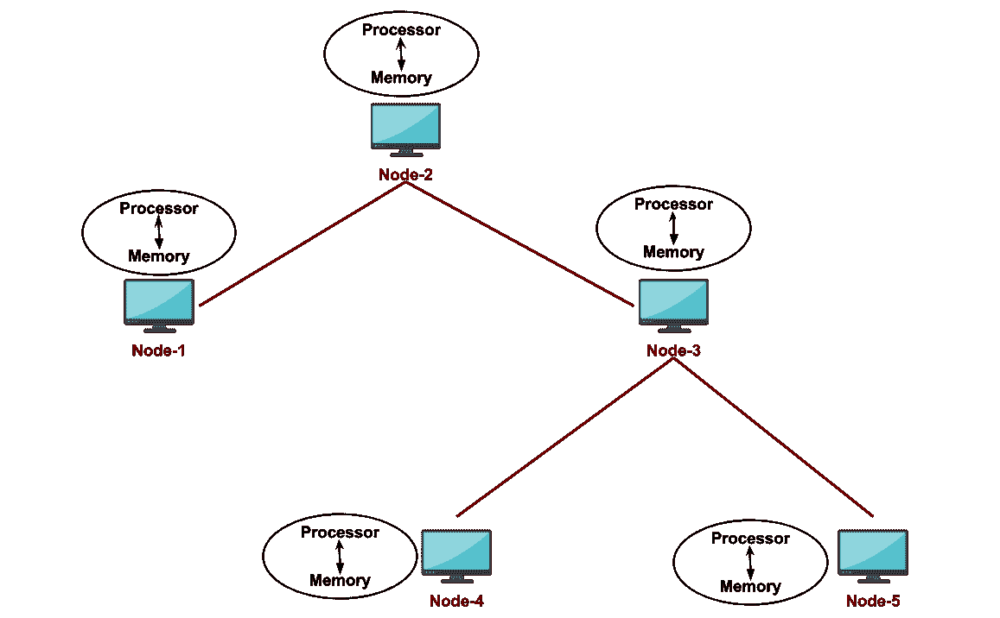

分布式计算—架构

分布式计算有不同的消息传递机制，可能包括 http、RPC 和消息队列。实现架构也各不相同，可分为以下架构之一:客户端-服务器、N 层、对等(P2P)或集群计算。FAH 实现是使用 RPC 连接器进行通信的客户机服务器架构的一个很好的例子。

# FAH —分布式计算模型—步骤序列

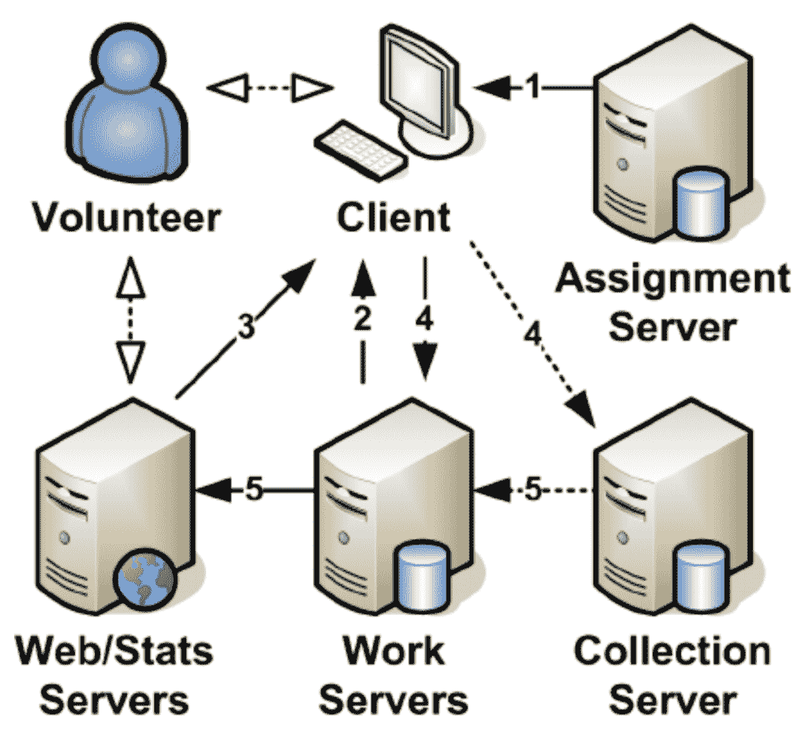

FAH 客户端和服务器—步骤序列

首先，由志愿者安装的客户机请求分配服务器将其分配给工作服务器:

(1).接下来，客户机与工作服务器通信并请求一个工作单元，工作单元是在一段时间内处理一个作业所需的一组输入文件

(2).基于工作单元，客户端然后可以从网络服务器下载完成工作所需的计算核心

(3).工作完成后，客户端将结果发送到相同的工作服务器，或者如果工作服务器不可达，则发送到专门指定的收集服务器

(4).然后，从工作服务器收集日志文件和信用，并将其传递到统计服务器，以便制表并显示给参与者

虽然 Folding@home 专注于蛋白质折叠模拟，但这种架构非常灵活，可以支持许多其他类型的项目。

# Kubernetes 上的 FAHClient

FAHclient [包](https://download.foldingathome.org/releases/public/release/fahclient/)可用于各种平台。这是由 FAHControl 管理的(后端)客户端软件，通常在后台运行。这是一个真正统一的客户端(插槽)管理器。FAHClient 启动一个或多个 FAHCore 实例，并管理每个客户机“插槽”的工作分配。这些包可以用来创建一个带有源映像(ubuntu/centos)的 [Docker 容器](https://gist.github.com/gokulpch/7431b75fc521f950a5d1a1b669162c92)，并且可以作为一个[部署或 Daemonset](https://gist.github.com/gokulpch/91a14f35e504bca7f89f0abd5fac1268) 部署在 Kubernetes 集群上。

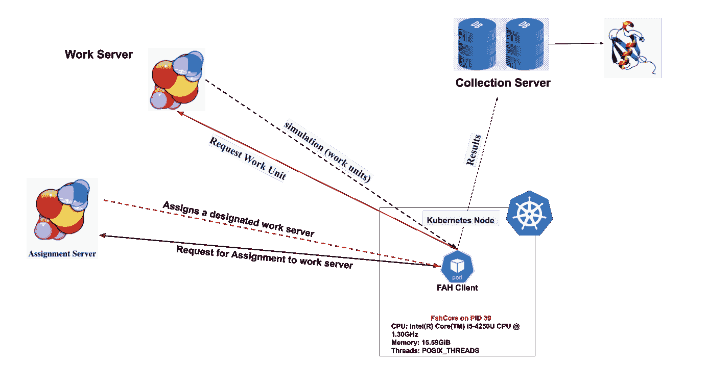

Kubernetes 上的 FAHClient

可以创建一个可选的密钥，该密钥唯一地识别个体捐献者，并且与个体已经完成的结果相关联。该键可以作为容器的参数提供。

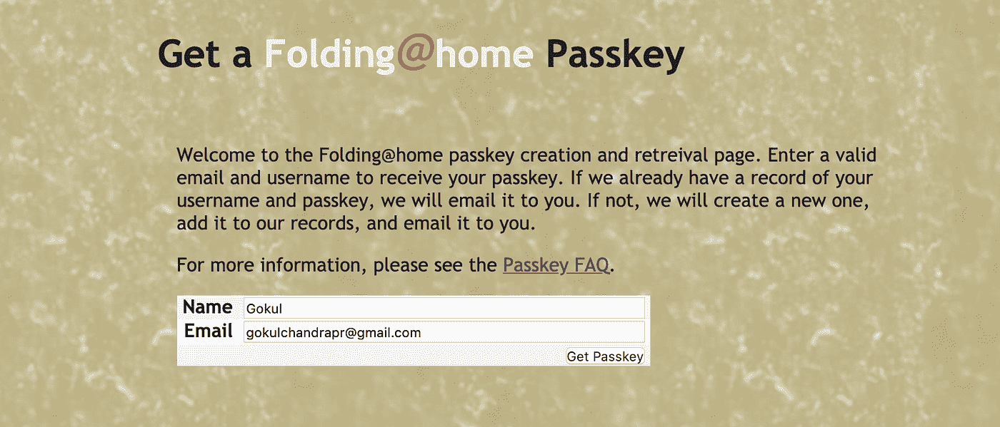

用户名和密码—个人捐献者身份证明

除了用户和密码，用户还可以定义“功率”,控制分配给 FAH 的资源数量(轻/中/满)。

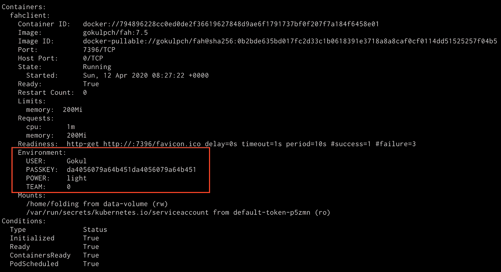

fah 客户端配置

FAH 可以同时利用 CPU 和 GPU。安装相关驱动程序可以促进 GPU 的使用，因为 GPU 将为这类任务提供更强大的数字处理能力。k8s-device-plugin 和 CUDA toolkit 可用于利用 Kubernetes 集群上的 GPU 进行折叠。在构建容器时，可以在配置文件中提供所有可配置的参数以及插槽:GPU/CPU 的用法。

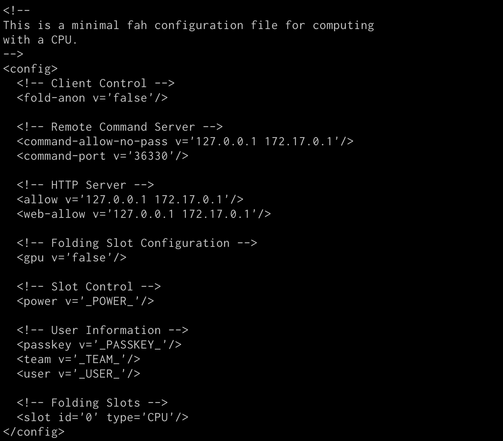

fah 客户端配置

FAHClient 可以部署为 deployment 或 daemonset(如果集群中的所有节点都运行使用资源的客户机，则需要使用它)。

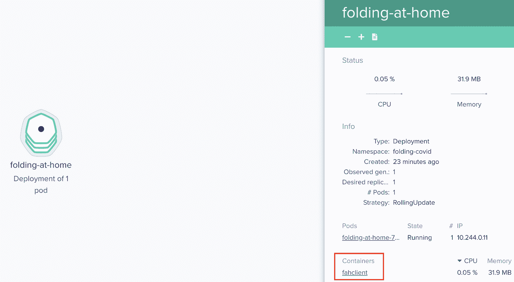

fah 客户端部署— Kubernetes

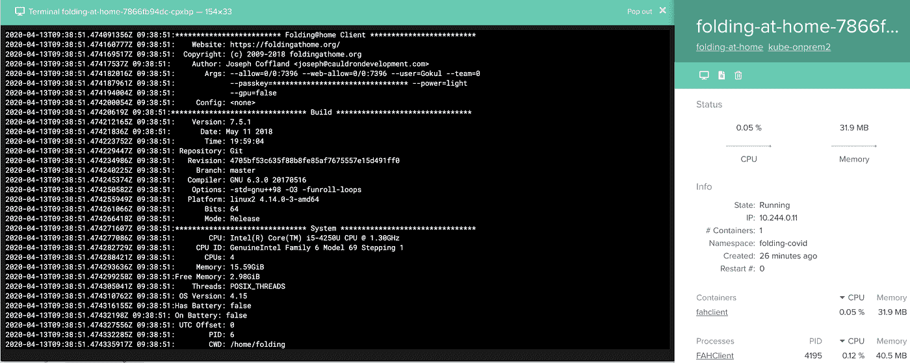

fah 客户端部署— Kubernetes

部署客户端后，将分析节点上所有可用资源的使用情况:

FAHClient —初始化

客户端发起到分配服务器的连接，以获得工作服务器分配，从而获得工作单元。分配服务器为客户端分配指定的工作服务器，工作服务器将指定项目的工作单元提供给客户端进行折叠。

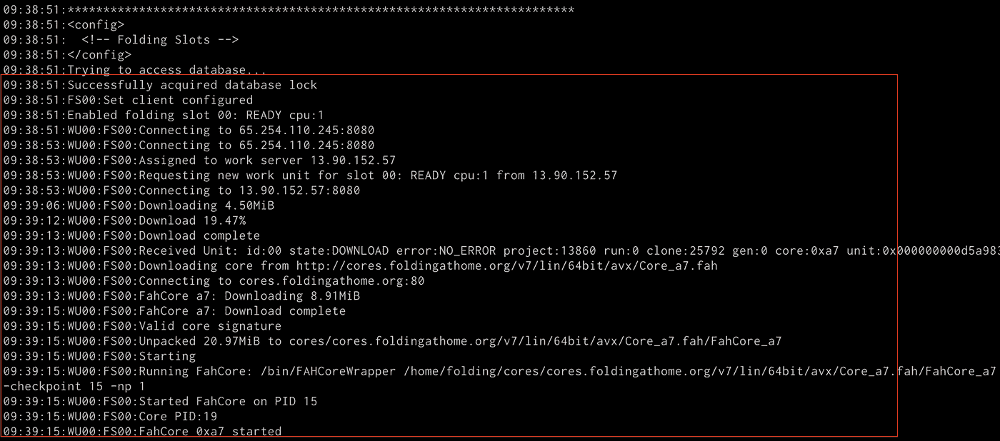

FAHClient —任务和工作服务器

如上所示(FAHClient pod 的日志)，“65.254.110.245”是分配服务器，“13.90.152.57”是工作服务器。

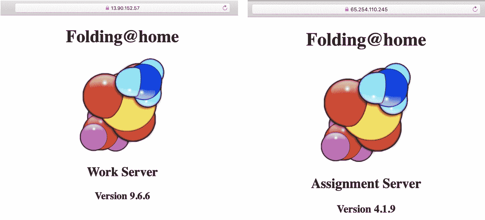

FAHClient —任务和工作服务器

成功连接到工作服务器后，客户端下载模拟(工作单元)。这些模拟配置包含所需的模拟参数。下面提供了一个模拟配置文件示例:

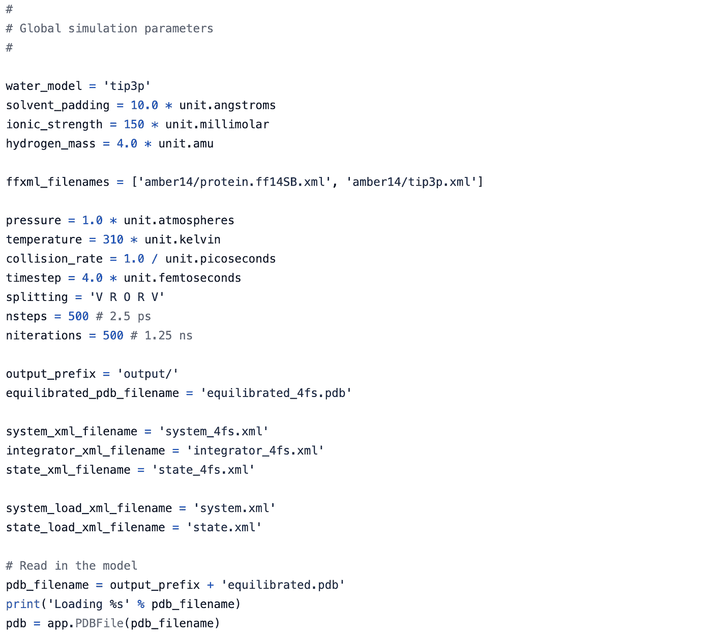

示例模拟参数和数据

一旦客户机获得工作单元，FAHClient 就启动一个或多个 FAHCore 实例，并根据用户配置的功率级别管理每个客户机“插槽”的工作分配。下面是一个模拟示例— CPU 和内存使用情况:

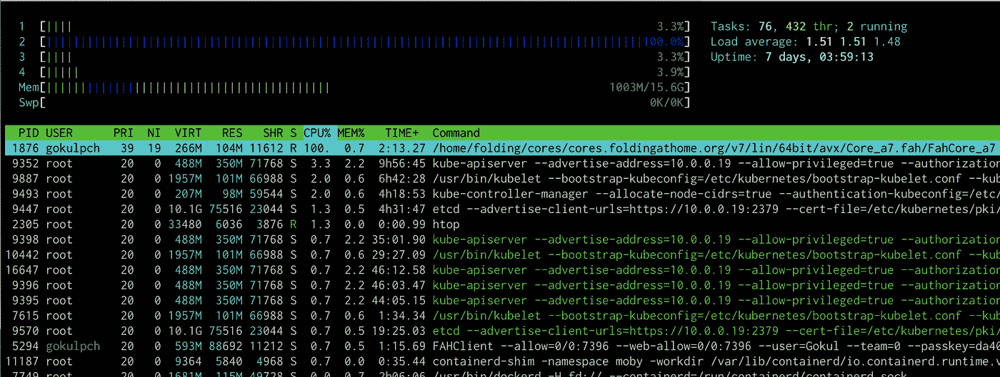

FAHClient 的 CPU 和内存使用示例

FAH 在客户端级别提供了一个 Web 界面，用户可以在其中配置和操作单个客户端。该界面提供了一个工作单元的 ETA 和折叠完成百分比的详细视图。

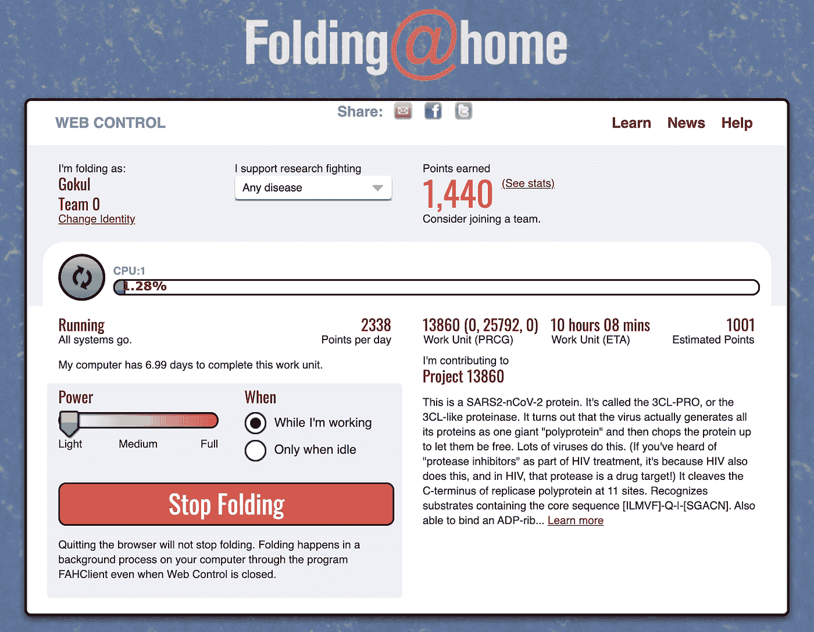

折叠@ home-Web

特定的工作单元是单个项目的一部分，这同样意味着让用户知道他们正在为哪个特定的项目做贡献。[新冠肺炎](https://foldingathome.org/2020/02/27/foldinghome-takes-up-the-fight-against-covid-19-2019-ncov/)工作单位目前被优先考虑，但是 folding@home 客户端也可以选择其他疾病的工作。相关的示例项目如下所示:

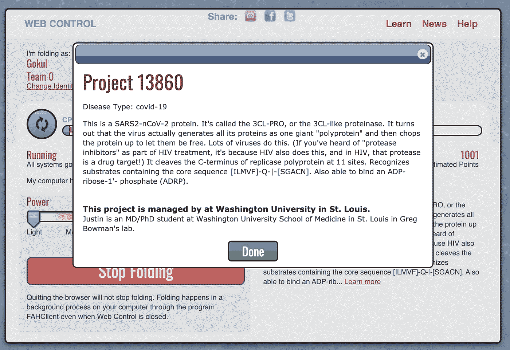

折叠@ home-Web

与一个工作单元相关的所有任务都是分步执行的，一旦完成一个特定的工作单元，所有分析的数据都被馈送到同一个工作服务器，或者如果工作服务器不可达，则被馈送到专门指定的收集服务器，然后是新的任务和工作单元。

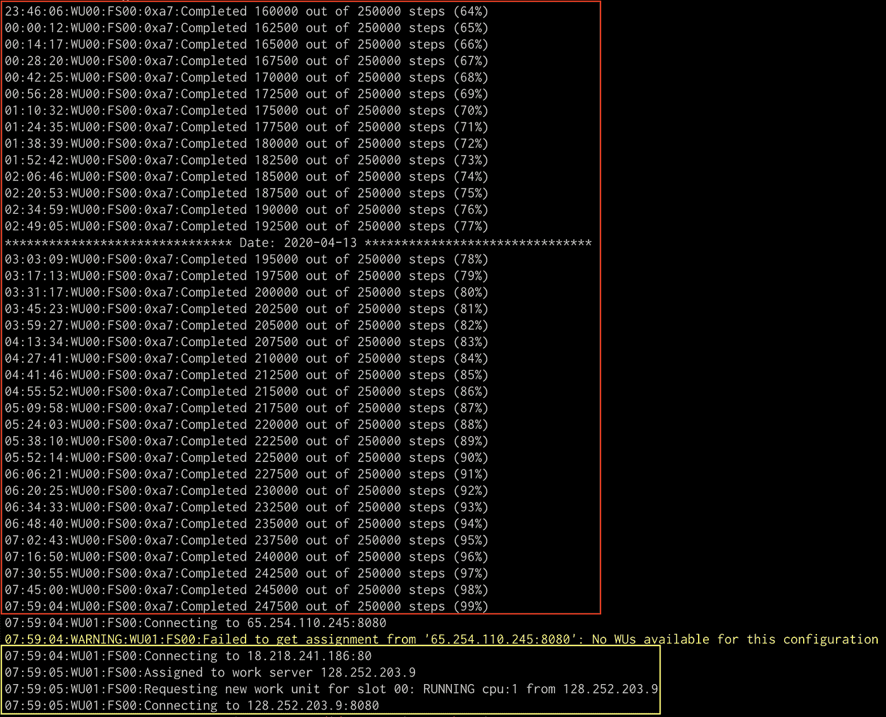

分步执行工作单元和新分配

用户可以使用 UI 中的电源级别来控制资源分配。用户可以在需要时暂停或停止折叠。

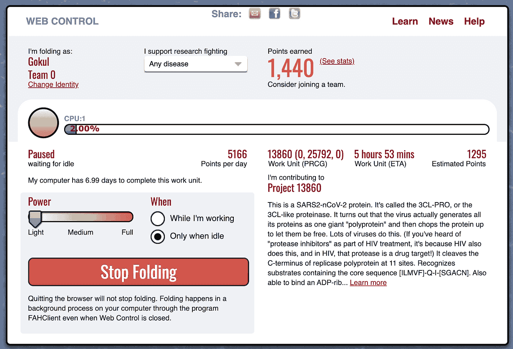

折叠@ home-Web

在有 GPU 的集群中，只要在配置中提供<gpu v="’true’/">，就可以激活 FHClient，并在集群上启用所需的插件。</gpu>

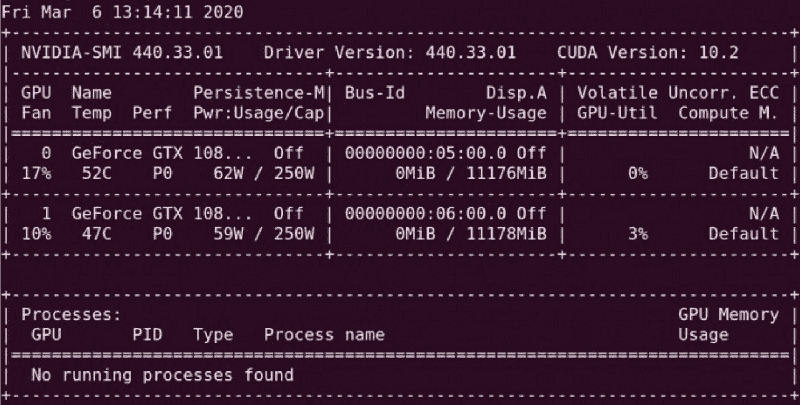

FAHClient-GPU 使用

[Rancher](https://rancher.com/blog/2020/fighting-covid-19) 已经宣布通过在 Rancher 平台的官方应用程序目录中添加舵图来支持 F@h。运行 Rancher 的用户可以使用目录选择要在集群上部署的应用程序:

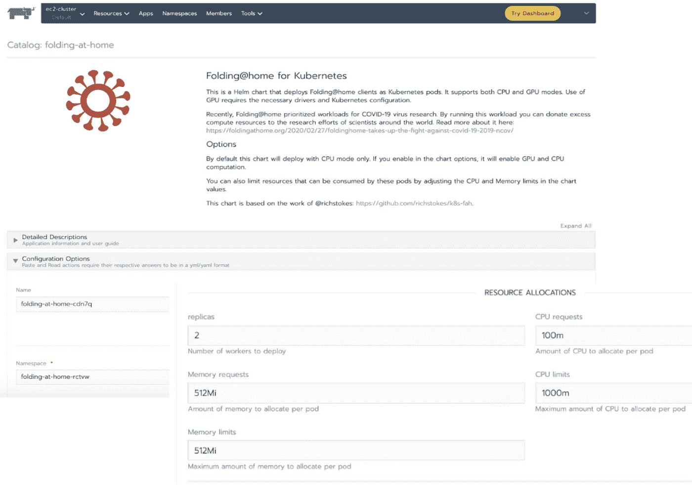

Rancher —带有 FAH 的应用程序目录

FAH 已经发布了第一波项目，模拟来自新型冠状病毒(导致新冠肺炎的病毒)和相关的 SARS-CoV 病毒的潜在可药用蛋白质靶标。

在过去的三周里，超过 70 万名公民科学家加入了 F@h 项目。参与人数增加了 20 倍，给新冠肺炎带来了前所未有计算能力。

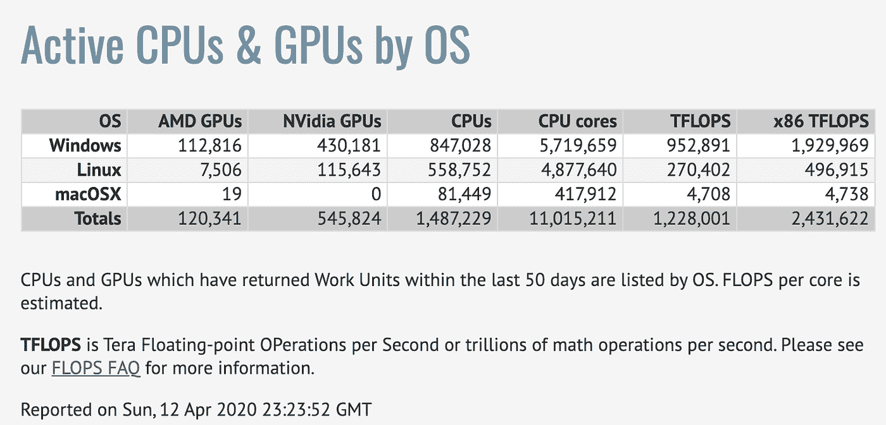

团体中活动 CPU 和 GPU 的数量

事实上，Folding@home 是第一台达到 exaFLOPS 规模的计算机，现在估计比接下来的前 100 台超级计算机加起来还要强大。

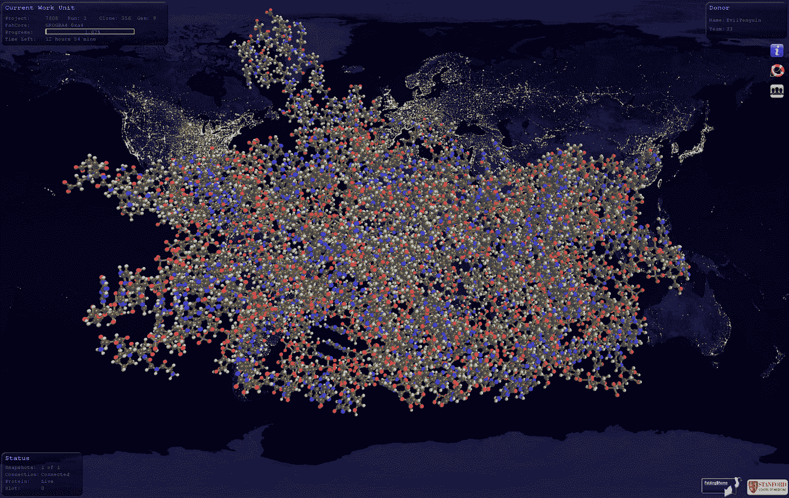

FAH 全球仪表板

Kubernetes 支持轻松部署，并允许轻松的资源管理，包括基于智能资源导向范式的工作负载自动调度。最近，高性能计算(HPC)越来越接近企业，因此可以从 HPC 容器和 Kubernetes 生态系统中受益，并提出了快速向 HPC 工作负载分配和取消分配计算资源的新要求。

每一个 Kubernetes 节点都可以成为分布在世界各地的超级计算机中的工蜂。有许多场景(例如:演示群集、测试环境、没有工作负载的 PoC 环境、大型裸机环境上的小型群集等。)在群集未得到充分利用的情况下，捐赠未得到充分利用的/多余的计算能力/时间有助于寻找新冠肺炎的解决方案。