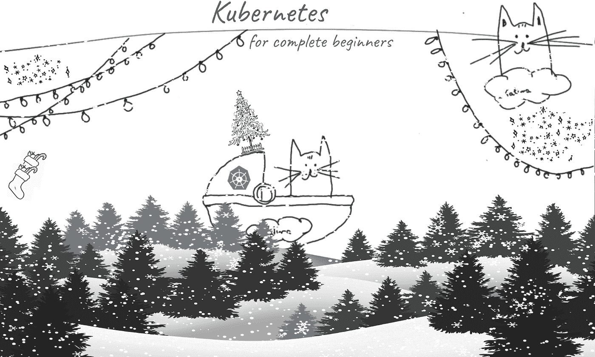
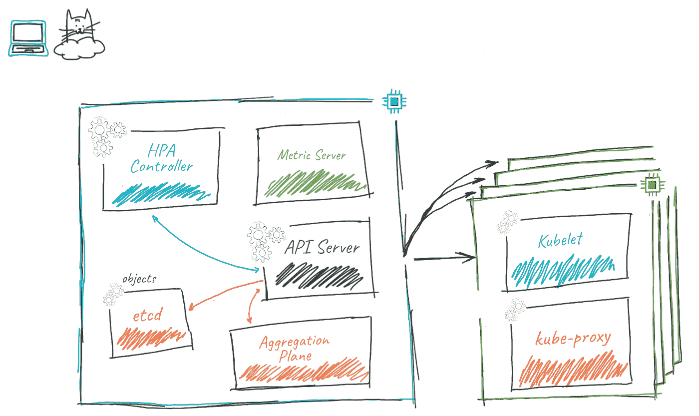
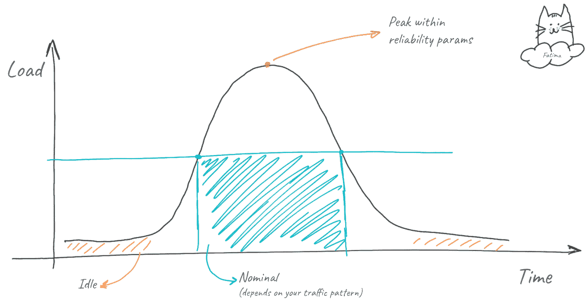
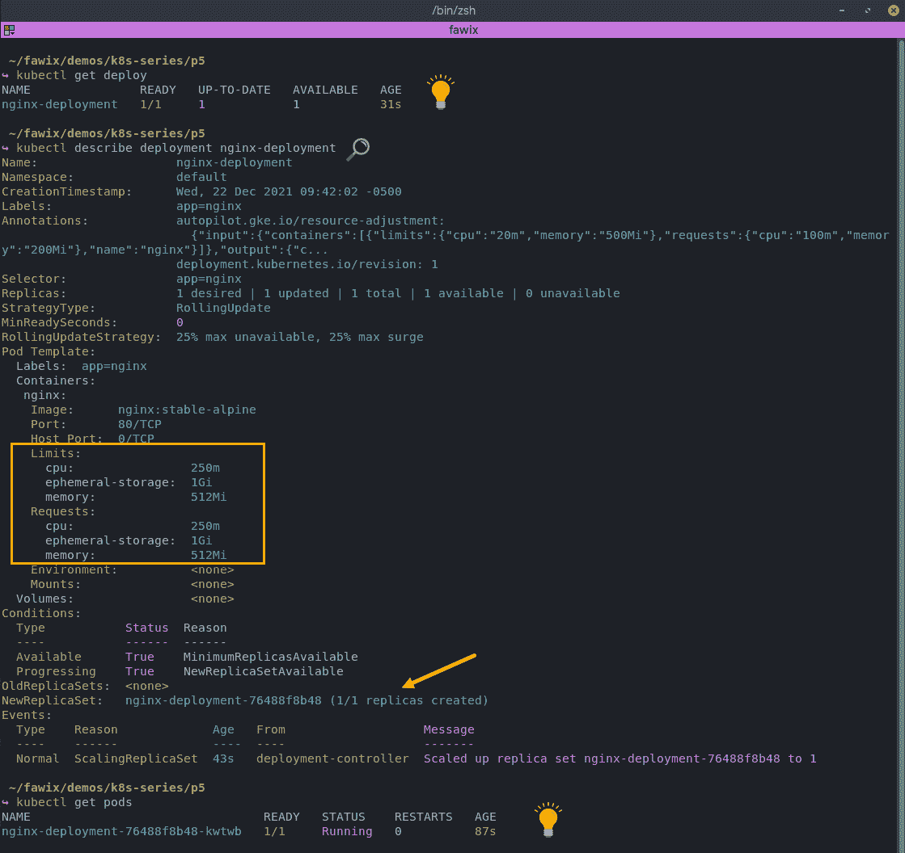
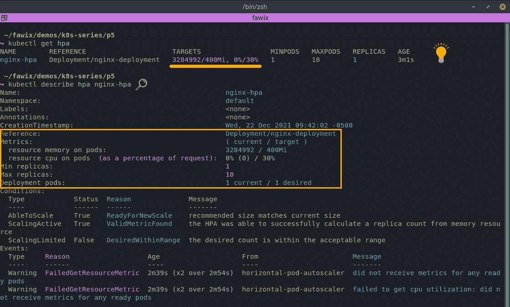
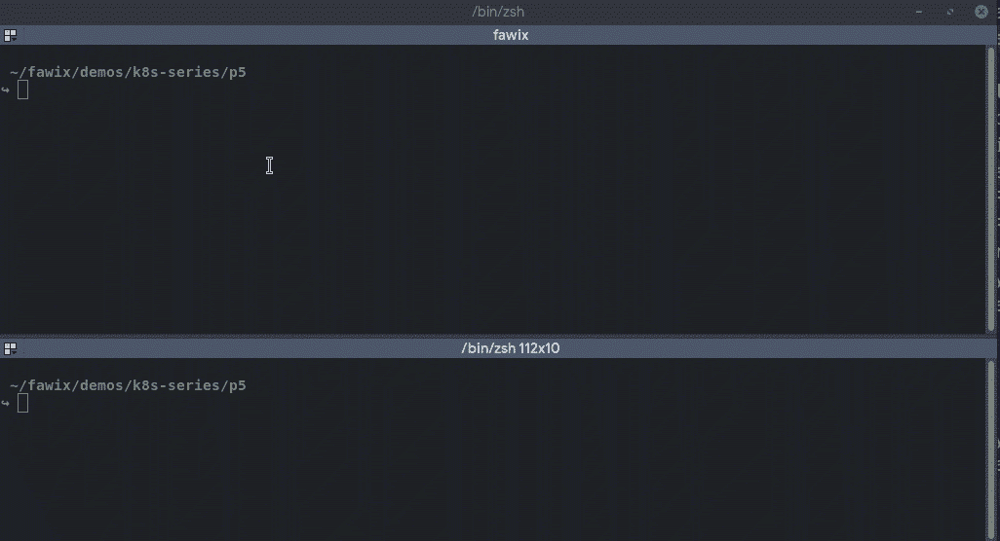

# Kubernetes for dummies:部署自动伸缩

> 原文：<https://itnext.io/kubernetes-for-dummies-deployment-auto-scaling-28ad0f9da1df?source=collection_archive---------0----------------------->

## KUBERNETES |云概念

## 第 5 部分—使用水平 Pod 自动缩放器

欢迎回来，我的绝地学徒伙伴！现在我们已经很好地掌握了使用原力的基本知识。让我们开始进入一些有趣的相邻概念。如果你需要复习，这里有我们到目前为止讨论过的内容的链接:

*   第 1 部分 kubernetes 到底是什么？
*   [第二部分——引擎盖下的一瞥](https://bit.ly/fawix-k8s-p2)
*   [第三部分——豆荚的寿命](https://bit.ly/fawix-k8s-p3)
*   [第 4 部分—部署和服务](https://bit.ly/fawix-k8s-p4)

现在我们可以开始探索如何使用部署来实现一些很酷的东西，比如自动伸缩、自动修复和适度降级；这一部分将基于我们在第 4 部分中学到的概念。这篇文章是关于使用部署自动伸缩的！

# 自动缩放#WTF

这是一个简单的概念:您的工作负载可以根据集群中的负载或工作负载资源进行伸缩。

我所说的扩大规模，实际上是指部署新的分离舱，然后缩小规模摧毁它们。为了实现这一点，Kubernetes 有一个名为“Horizontal Pod AutoScaler”(又名 HPA)的对象，它必须引用带有 ReplicaSet 的部署(第 4 部分)。幸运的是，一旦您在部署中定义了 HPA，ReplicaSet 就变成隐含的了。还有，有 HPA 控制器；它监视资源并更改 ReplicaSet 对象中的 replicas 值。HPA 对象告诉 k8s 我们想要自动扩展部署，这样控制器就知道它应该监视 Pod 及其资源(啊哈！“构建模块”😉 ).

现在，这就是 k8s 中扩展的基本工作方式，但是请记住，我们需要一个参考点…工作负载是根据某个东西进行扩展的。那东西是豆荚资源。最基本的 Pod 资源是 CPU 和内存。群集自动监控它们的利用率，并保持相关的 Pod 资源对象是最新的；它使用一个度量服务器来实现这一点，该服务器通过查询每个节点的 kubelet 来聚集跨节点的度量。下面的图表是为了说明的目的，但是给你一个很好的感觉这是如何适合图片的。

此外，资源也可以是其他参数。任何可以作为 Pod 资源导入的内容都可以用作缩放参考。Kubernetes 有一些机制可以做到这一点。度量服务器中最常见的“自定义度量”。也可以使用一个叫做“扩展资源”的对象。这有效地允许您从集群外部声明可能影响您的工作负载规模的资源(对于事件驱动的架构很有用)。让我知道，如果你想要一个关于这方面的帖子，我们可以进一步深入探讨！

# 避免噪音邻居#最佳实践

我们应该讨论一下，是的，邻居！本质上，噪声邻居是消耗太多资源而损害集群中其他单元的单元。因此，为您的 pod 至少定义内存和 CPU 消耗(即使您没有使用 HPA)是一个好的实践，以避免您的节点过度拥挤的风险。这样做的另一个好处是 kubelet 将跟踪节点中的 CPU 和内存利用率，因此控制平面可以为 pod 选择具有足够容量的节点。此外，当您定义最小值和最大值时，它允许 pod 通过从一开始就拥有专用的资源量来预热，并防止流氓工作负载在出现问题或容器受损的情况下消耗所有可用资源。

理想情况下，您应该测量一个 Pod 的工作负载资源消耗情况。负载测试是帮助您理解这一点的最佳工具。只需监视 Pod 的 CPU 和内存使用情况，同时确保应用程序保持稳定，并且在您的可靠性参数(延迟、可用性、错误率等)范围内。

有几件事你应该考虑；把这个练习想象成一条高斯曲线，你选择什么取决于你的交通模式。

上图意在说明这一点:

*   最小负载(黄色):您得到的最低负载(这可能是空闲的或有涓流流量)
*   标称负载(蓝色):一个周期中选定的百分比，代表您的应用程序最常见的负载(例如一天中的第 99 或 95 个负载)
*   峰值负载(红色):应用程序能够可靠服务的最大负载。

您希望配置 Pod 资源，以便在达到峰值负载之前，在启动和扩大时请求额定或最小负载。您选择哪一个取决于您的应用程序花费时间最多的地方。当然，这种情况会随着时间的推移而改变，所以一定要经常重温这一点。主要版本或流量模式的变化是您的价值需要审查的良好指标。

现在你问我，这有这么多工作…我不能只是猜测吗？好吧，年轻的绝地学徒…没人会阻止你的！但是，要意识到这意味着什么。您可能会过早或过晚地结束扩展，也可能会阻塞比您需要的更多或更少的资源。因此，测量是更好的方法(即使是部分测量，让你做出一个有根据的猜测)。如果可以，消除猜测！！

好了，回到我们的部署！让我们从定义部署中的资源开始。还记得第 4 部分中我们友好的 NGINX 部署吗？下面是为内存和 CPU 定义了资源的对象的样子:

正如您所看到的，我们不再需要告诉部署我们需要的副本数量(HPA 将负责这一点)，因此我们删除了`spec.replicas`。我们还设置了`spec.containers.resources`字段，限制了我们需要多少 CPU 和内存。这也是您引用自定义指标的地方。

信用:imgflip.com

关于读取 CPU 和内存值的侧边栏。他们第一眼看上去相当混乱！（

*   内存——以字节计量，可以用*二进制前缀* (Ki，Mi，Gi)或*十进制前缀* (K，M，G)来表示。
*   CPU——以 CPU 单位衡量(这取决于您在哪里运行),对于裸机来说是 1 个超线程，但在 GCP 是 1 个内核。该指标允许分数，因此我们实际上可以请求半个 CPU (0.5 —读作 50%)。大多数工作负载实际上不会占用那么多，所以 kubernetes 使用“m”前缀来表示 milli(在*十进制前缀*中)——因此请求 200m 相当于请求 0.2 个单位的 CPU(又名:20%的 CPU 利用率)。

我强烈建议您选择二进制或十进制前缀。保持所有部署文件的一致性，尤其是对于大规模工作负载。

我希望这有用！)

现在添加 HPA 很简单…算是吧。HPA 对象仍在发展。特别注意你选择的`apiVersion`(`autoscaling/v1`vs`autoscaling/v2beta2`)。在 v2 上，您可以扩展多个指标，而 v1 不能。这里我们用的是 v2 口味。

出于自动扩展的目的，我们定义了 Pod 资源。我们还定义了升级应该发生的消耗阈值。HPA 控制器将每 15 秒查询一次资源(默认)，并根据阈值和实际消耗进行调整。正如你在上面的对象上看到的，那是`spec.metrics[].resource.target`字段；它通过`spec.scaleTargetRef`字段链接回部署。

让我们来看看这个动作——抓住上面的 YAML，跟着做吧！现在你已经非常熟悉`kubectl apply`了，所以我将跳过这一步。让我们专注于酷的东西！

是时候检查部署了！您可以看到资源参数和副本集；请注意，它从单个 pod 开始。

让我们检查实际的 HPA 对象，注意指标部分:

如您所见，它引用了我们的 nginx 部署，当前部署的 pod 数量是一个。现在，作为一个快速测试，我们可以生成一些负载并查看自动伸缩的效果:

进行自动扩展配置需要做几件事情。然而，从你所拥有的开始。如果你不能做预测或者没有所有需要的数据(我看到你的新应用)，它不应该阻止你从足够好的数字开始。你可以随着时间的推移进行微调。

这是一个非常酷的概念，可以进一步探索，我建议花一些时间来玩这个配置；作为一个练习，试着预测你将使用 3、5 和 10 个吊舱的 TPS，看看你是否正确。注意到负载消失后缩减所需的时间了吗？在不同的交通模式下会有怎样的表现？

像往常一样，如果你还没有你的集群 [Katacoda 游乐场](https://www.katacoda.com/courses/kubernetes/playground)仍然是一个选择。你也可以使用[免费等级和 GCP](https://cloud.google.com/free) 的积分来创建一个你可以玩的 GKE 集群！

在这篇文章中，我们回顾了如何实现部署的自动伸缩，在下一篇文章中，我们将关注自动修复、适度降级，这使我们能够在 kubernetes 中创建更具弹性的工作负载。

到目前为止你喜欢这个系列吗？让我知道！另外，请在[推特(@fawix)](https://twitter.com/fawix) 或 [LinkedIn](https://www.linkedin.com/in/fatimasilv/) 上关注我，这样你就不会错过更新了！愿集装箱与你同在！