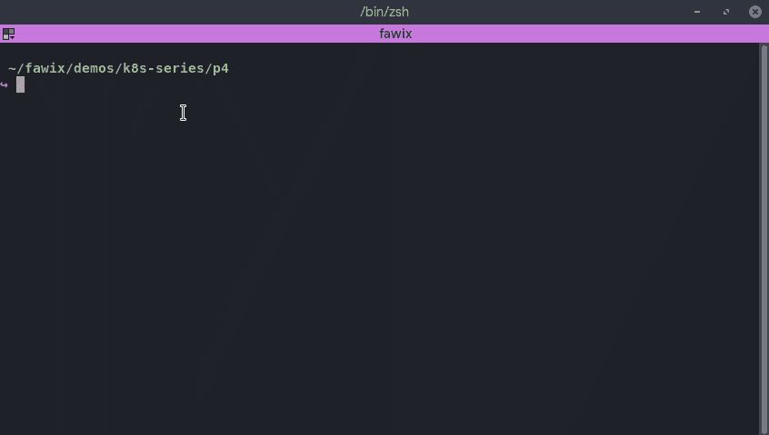
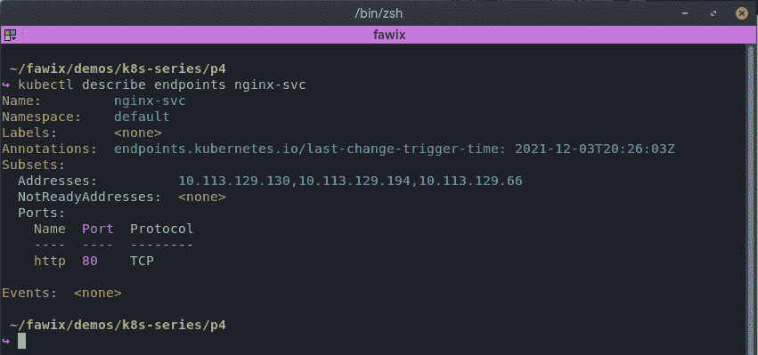
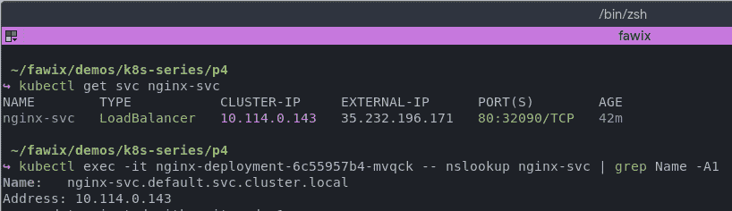
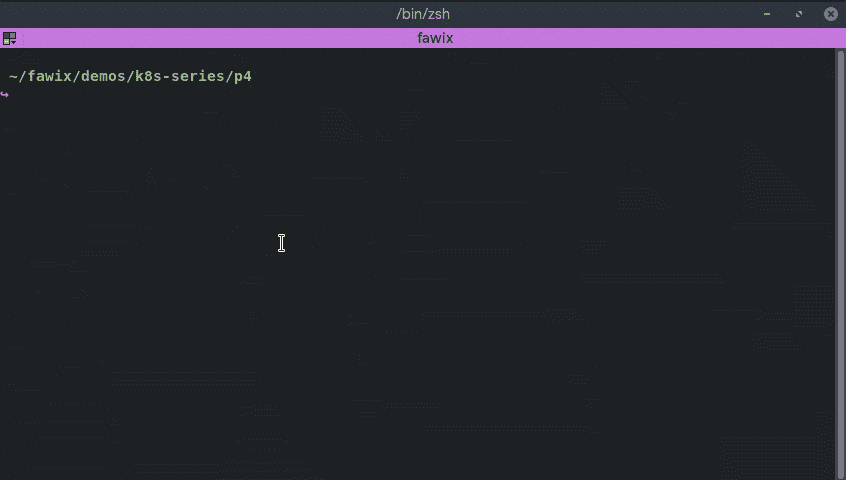

# 虚拟的 Kubernetes:部署和服务

> 原文：<https://itnext.io/kubernetes-for-dummies-deployments-and-services-7403f30d30ba?source=collection_archive---------0----------------------->

## KUBERNETES |云概念

## 第 4 部分—让 pod 更有用

欢迎回来，年轻的学徒！现在您已经对集群的内部工作方式和 Pod 的工作方式有了很好的了解，让我们来看看如何更有效地使用这些东西。

正如我们在[的上一篇文章](https://bit.ly/fawix-k8s-p3)中看到的，Pod 提供了我们的基本构建模块，但它不一定有利于生产。我们只能从舱内进入应用程序。这样把它暴露在互联网上真的很不方便，也很冒险。另外，这不是永久的。如果一个豆荚死了，它就一直死着。解决这两个问题有不同的方法。我们将介绍基础知识，并在过程中不断添加。

让我们来发现服务和部署对象😎

# 部署#WTF

部署为 pod 增加了几个好处，并支持几个重要的相邻用例。本质上，部署允许 k8s 在一个或一组 Pod 上拥有**期望的状态规则**。这些是基本级别的版本展示、回滚和暂停。

Kubernetes 部署还利用其他 k8s 对象来进一步增强功能。一个非常常见的构造是“ReplicaSet ”,它定义了这个部署应该创建同一个 Pod 的多少个副本。Pod 的副本称为副本。如果我们说一个部署包含 3 个副本，这意味着它将运行同一 Pod 的 3 个副本。这意味着，在任何给定的时间，k8s 将确保期望数量的 pod 作为部署的一部分运行！如果一个 pod 死了，k8s 会启动一个新的替换它，匹配我们想要的状态。

还记得我们的 [nginx Pod](https://gist.github.com/fawix/d50d9bb3510f41e2c3f347a1e44ccba9#file-k8s_pod_example-yaml) 吗？如果我们想让它成为一个部署，这样万一我们的 Pod 死了，k8s 会自动重启它？

这个物体看起来是这样的:

请注意，对象类型现在是 Deployment。还有，看`spec.template`？它包含实际 Pod 的定义。如果您将它与我们在第 3 部分中创建的 Pod 进行比较，您会发现它是相同的。另外，请特别注意`spec.replicas`字段。这是副本集的一部分，定义了我们需要多少副本。

还记得我们在第 3 部分讨论过标签吗？这是它的应用之一。复制集控制器选择所有与`spec.selector.matchLabels`匹配的容器，并将其与所需状态进行比较。这些标签应与`spec.template.metadata.labels`中实际 Pod 标签上的信息相匹配。这个概念在 k8s 中的几个地方被使用，并且将相关的对象分组以围绕它们构建功能。

标签是组织大型部署的基础。您还可以通过标签执行`kubectl`操作过滤，使这个构造非常强大。这些也称为选择器标签，有时也称为过滤器(虽然不太常见)。

让我们来看看实际情况:

好了，现在我们解决了永久性问题，让我们来谈谈访问应用程序。

# 服务#WTF

使用 k8s 有多种方法来公开您的应用程序。服务是我们可以做到的简单方法之一。

将服务对象视为一个网络抽象。它提供了一种通过单个 IP 公开在一个或多个 pods 中运行的应用程序的方法。记住豆荚有自己的 IP。例如，如果您的部署有 3 个副本，您不希望在应用程序中管理它；您需要一种统一的方式来访问它。服务对象将负责处理该位。

服务对象看起来是这样的:

服务的一个便利特性是，它可以将任何传入端口映射到容器上的目标端口，正如您在上面的示例中所看到的。传入流量(进入服务)在`spec.ports.port`上，从服务到容器的流量在`spec.ports.targetPort`中映射。

在较低的级别，服务包含端点的集合。端点是具有 Pod IP 的简单对象。记得标签吗？这就是 k8s 用来将端点作为服务的一部分进行分组的方法。通常，您不需要担心创建端点，因为这是在幕后完成的，但是您可以实际看到它的运行:

有了标签，k8s 将自动创建端点。端点对象还允许您将服务指向群集外的 IP；通过手动设置端点对象。这对于测试未部署在集群中但需要由 pod 访问的环境或外部依赖项尤其有用。

服务对象将在集群 DNS 服务器上为我们提供一个 IP 和一个 DNS 条目，以便于服务到服务的通信。

说到 DNS… kube-dns 是一个经常部署在集群中的组件。虽然不是强制的也不是核心的组件，但是它对于运行多种服务的集群来说是必不可少的。如果需要，可以用其他 DNS 服务替换它。一个流行的选择是 coreDNS。它在群集内提供名称解析，包括服务域名。

有许多类型的服务，每一种都有自己擅长的事情:

*   **节点端口:**这实际上阻塞了节点中的一个特定端口，让流量直接通过节点 IP 到达服务。
*   **ClusterIP:** 这让集群从它的服务 IP 池中为服务分配一个 IP(在以后的文章中会详细介绍)
*   **负载平衡器:**这实际上将使用云控制器管理器在云提供商提供的基础设施上创建一个负载平衡器(假设您正在超大规模环境中运行)。

让我们把它们放在一起！

如您所见，我们可以从集群外部访问工作负载。服务对象非常简单，不支持复杂的流量规则。我们可以用其他物品来达到这个目的。一个流行的选项是入口对象。顾名思义，它提供了关于入站流量的期望状态规则，并将入站流量路由到部署/服务中。我们将在以后的文章中详细讨论。

我们只是触及了表面！还有很多东西需要探索；从这篇博客文章中获取示例部署和服务对象，启动您的 Kubernetes 集群！如果你还没有安装，可以随意使用[奥赖利的 Katacoda 互动游乐场](https://www.katacoda.com/courses/kubernetes/playground)。好奇！更改服务类型。它表现如何？更改现有部署的所需复制副本数量。修改 NGINX 欢迎页面，看看是否可以路由到应用程序的两个不同版本。使用原力，我的绝地学徒伙伴！

现在，我们的工作负载更加强大，但我们还可以做得更好！在[的下一篇文章](https://bit.ly/fawix-k8s-pt5)中，我们将看看这种技术带来的一些关键用例。我们将看看相邻的概念，如自动愈合，自动伸缩；以及它们如何在 kubernetes 中创建弹性工作负载。

在 [Twitter (@fawix)](https://twitter.com/fawix) 或 [LinkedIn](https://www.linkedin.com/in/fatimasilv/) 上关注我，这样你就不会错过更新了！愿集装箱与你同在！