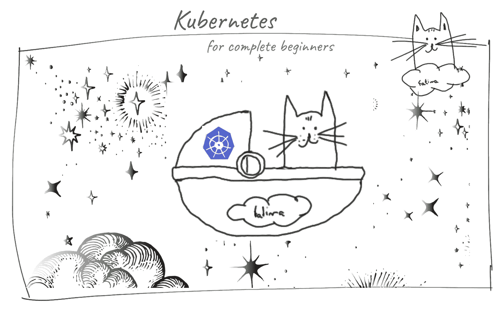
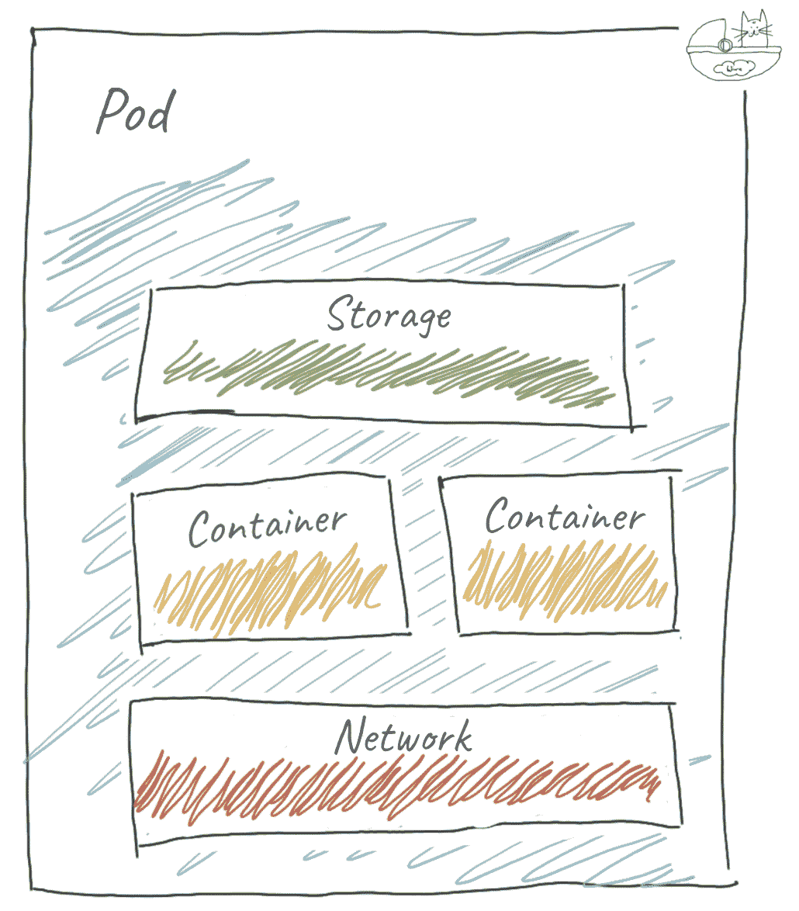
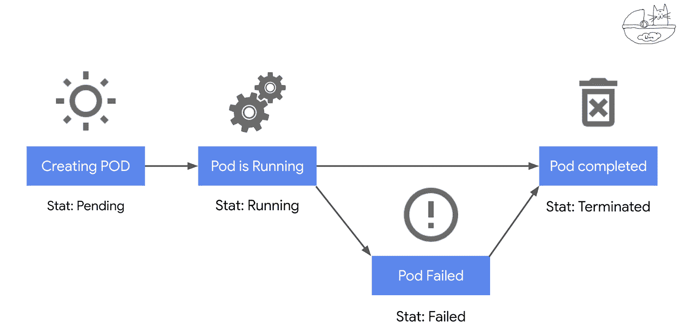
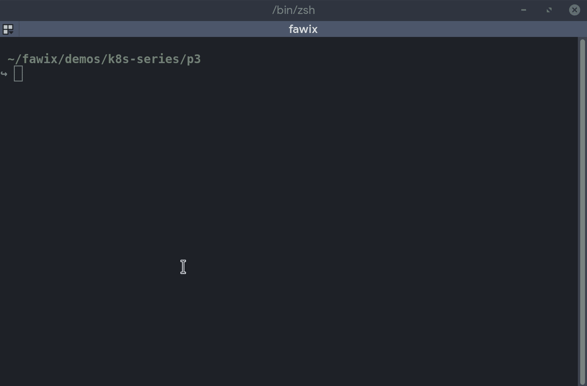
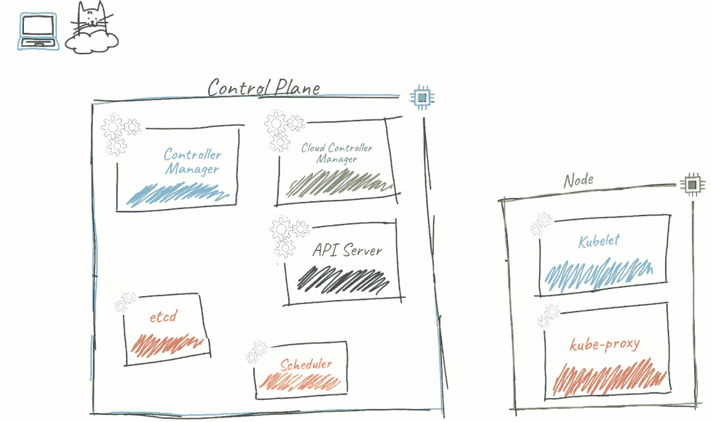
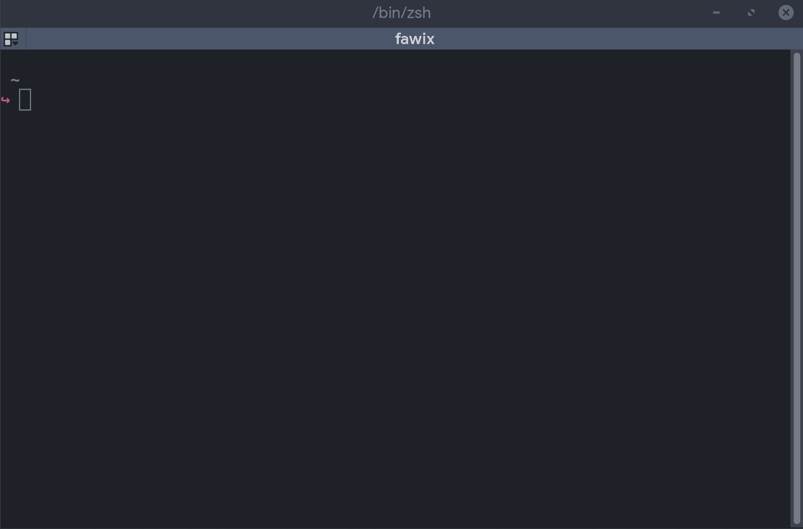

# 假人的 Kubernetes:豆荚的生活

> 原文：<https://itnext.io/kubernetes-for-dummies-life-of-a-pod-fc8158e27aa?source=collection_archive---------0----------------------->

## KUBERNETES |云概念

## 第三部分——豆荚和其他东西？

欢迎回来，年轻的学徒！现在，您已经了解了 k8s 集群中的组件([第 2 部分](http://bit.ly/fawix-k8s-p2))。今天我们来看看我们最基本的构造之一:豆荚。当我们运行应用程序时，我们将看到它们是如何参与的。

# Pod #WTF

pod 是 Kubernetes 中最基本的构建模块之一。它们是最小的可展开物体。他们的目标是为你的容器提供一个运行时环境。尽管 Pods 需要其他对象才能真正有用，但它们是 Kubernetes 中代表您的应用程序的部分。其他几个物体将建立在吊舱所提供的能力上。今天，我们将重点讨论他们如何运行我们的工作负载。在下一篇文章中，我们将关注那些与 pod 交互的其他对象，以使它们更加健壮和通用。

也许你希望我说最小的 Kubernetes 对象是容器？不是这样的，年轻的学徒！k8s 集群中每个正在运行的容器都在一个 Pod 中。实际上，你永远不会让容器自己运行。

Pod 为容器提供了一个运行环境，包括网络和存储。如有必要，一个 Pod 可以有多个容器。同一 Pod 中的容器紧密耦合并共享资源(网络和存储、安全规则等。).

从概念上讲，Pod 如下所示:

一个 Pod 只能分配一个 IP，不管它有多少个容器。也就是说，在一个 Pod 中，容器共享相同的网络名称空间(IP 和端口)。结果是 Pod 中的容器可以通过 localhost (127.0.0.1)进行通信。或者，Pod 还可以指定一种或多种存储方法，称为卷。Pod 中的所有容器都可以访问已装载的卷。豆荚也可以共享存储，但这是另一篇文章。

有趣的是，Pod 这个名字来自鲸鱼的统称。它暗指里面的容器，主要是与 Docker(Docker 标志是一条鲸鱼！).

当然，现在我们来看看一个实际的物体是什么样子的:

这些是安装 Pod 所需的必填字段。随着我们的发展，我们将会看到其他物体使用豆荚来建立更多的能力，然后扩展到其他领域。

上面需要注意的一件重要事情是字段`spec.containers`，它是一个您可以定义的容器数组。`image`字段是实际容器的名称及其存储库(省略时，默认为 DockerHub)和一个标签。容器标记只是管理您的版本和发布的一种方式。有了这个，你就可以瞄准容器的一个特定版本。在上面的例子中，我们在 DockerHub 中使用带有 stable-alpine 标签的 [nginx 容器(因为我们省略了存储库位)。](https://hub.docker.com/layers/nginx/library/nginx/stable-alpine/images/sha256-415f060bbd6fbabb39d19b604247204b5429f340fa571bfdd12f724dbff2839a?context=explore)

# 并非所有容器都是生而平等的

当我们谈到容器时，首先想到的是运行我们的应用程序的容器。通常是一个长期运行的进程，它会一直运行，直到我们终止它或出现问题。但是，我想快速介绍一下 Pod 中的另外两种容器，以及它们的用途:

**Init 容器:**顾名思义，Init 容器适用于初始化和设置。它们在 pod 中的常规容器启动之前运行。与常规容器不同，这些容器应该总是运行到完成并成功退出，否则 Pod 将进入失败状态(下面将详细介绍)。

**短暂容器:**这是一种相当新的(1.22 中的 alpha)容器类型。它对资源或执行没有任何保证，它们永远不会自动重启(不要用它们来构建应用程序)。这对于故障排除和短期操作的交互式 shells 非常有用。

为了保持一致，每当我谈到“容器”时，它就是您的常规工作负载容器。当我们谈论其他两种类型时，我将特别指出它们。

# 豆荚的生命

如您所见，Pods 提供了运行容器所需的基本组件。现在让我们来看看一个荚果是如何产生生命并最终死亡的:荚果生命周期。

从高层次上来说，概念化很简单:

首先，我们创建 Pod。在这个阶段，Kubernetes 从注册中心获取容器。然后 k8s 让一个节点运行 Pod 这导致围绕网络和存储创建必要的结构。然后它在那个空间运行容器。如果提取容器失败，Pod 将呈现“未知”状态。

容器中的进程将处于前台，直到完成或外部命令终止它。这就是跑步状态。如果 Pod 失败，则状态设置为失败。如果运行成功，它将呈现终止状态。

好，让我们创建一个 POD！如果你想继续下去，年轻学徒，抓取上面的示例对象并将其保存为`pod.yaml`！PS:如果你还没有 k8s 安装，可以随意使用[奥赖利的 Katacoda 互动游乐场](https://www.katacoda.com/courses/kubernetes/playground)。

为此，我们将简单地运行`kubectl create -f pod.yaml`

还记得我们在第二部分中描述的组件吗？你已经可以放弃原力了，年轻的学徒。你认为引擎盖下发生了什么？在你继续阅读以获得最大经验值之前，好好想想吧！

好了，准备好了！？

让我们检查运行该命令时发生的详细情况:

1.  用户运行 kubectl create 命令来创建对象
2.  kubectl 调用 API 服务器来创建对象
3.  API 服务器将对象保存在 etcd 中
4.  调度程序检测到新的 Pod 已创建，并且未分配给节点
5.  然后，调度程序用选择的节点更新 Pod 对象。它考虑了几个约束来定义哪个节点获得 Pod。这些标签和污点定义了相似性(一起运行 pod 组)或反相似性(避免将 pod 安排在一起)规则。
6.  kube-controller-manager 随后检测到 Pod 所需的状态与当前状态不匹配，并对 API 服务器进行必要的调用(这是一个双向流程)；在这一点上，正确的控制器将作出反应，做这些变化
7.  这又触发了从 API 服务器到选定节点中的 kubelet 的 API 调用，以创建实际的 Pod
8.  作为设置 Pod 的一部分，联网 kube-proxy 通过包过滤层对操作系统进行所需的更改

这样，你的豆荚就创建好了！任何对象创建都像这样工作，根据需要涉及不同的控制器。

此时，您只能通过本地网络访问工作负载。这意味着，您需要连接到 Pod:

如果你创造了我们的豆荚，你应该花些时间玩它。检查运行`kubectl describe pod nginx`时会发生什么，或者尝试从 Pod 内部发送一个`SIGKILL`到 nginx 进程。看看会发生什么！好奇！

现在，你可能会想:我不能用本地主机访问运行我的应用程序！？正确你是！这对于工作负载来说并不理想，我们将在第 4 部分使用服务来解决这个问题。然而，此时此刻，您实际上已经在 kubernetes 中运行了您的工作负载！需要注意的一点是，一旦 Pod 被终止或遇到故障，它将只是处于终止或故障状态，不会重新启动。这是部署解决的问题，我们将在下一篇文章[中看到。](https://bit.ly/fawix-k8s-p4)

在 [Twitter (@fawix)](https://twitter.com/fawix) 或 [LinkedIn](https://www.linkedin.com/in/fatimasilv/) 上关注我，这样你就不会错过更新了！愿集装箱与你同在！