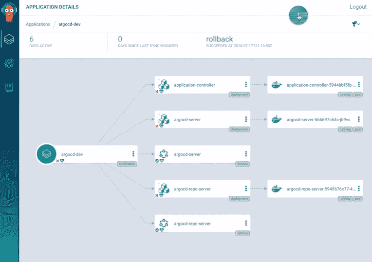
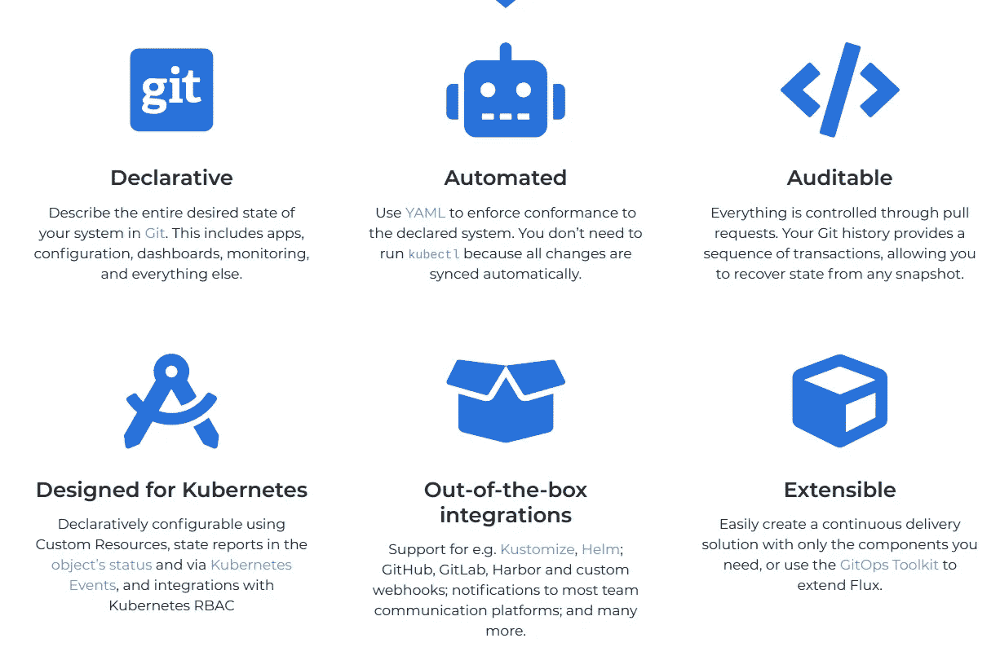
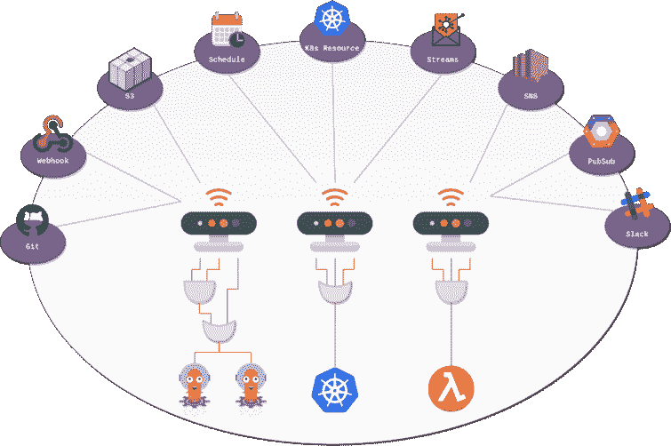
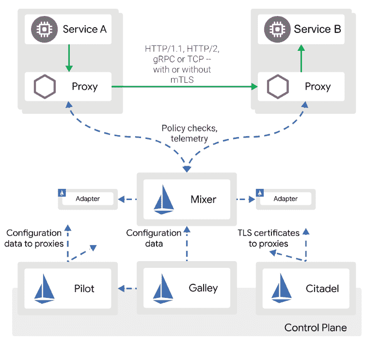
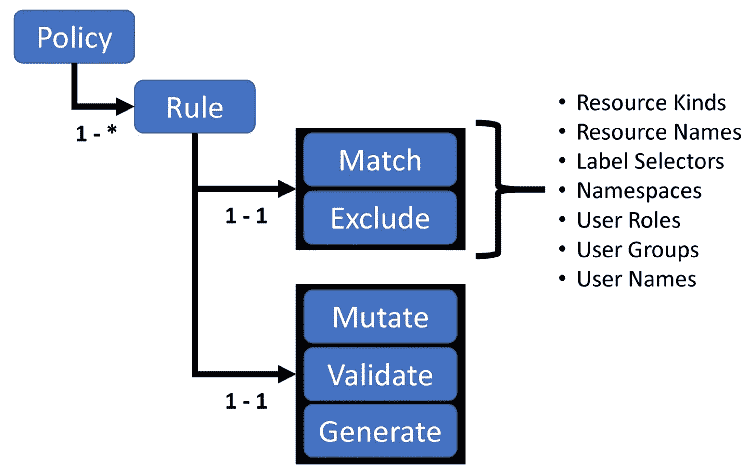
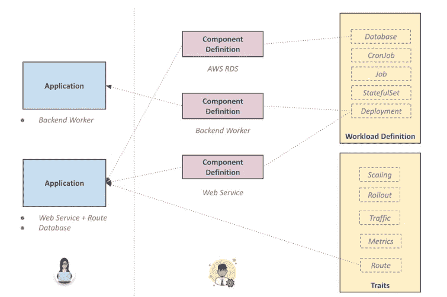
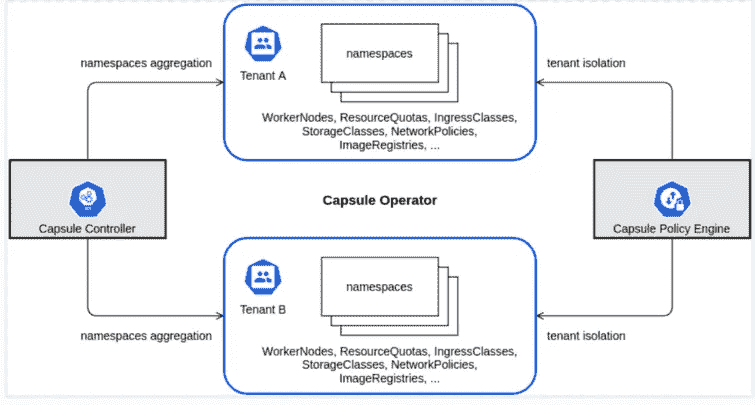

# Kubernetes GitOps 工具

> 原文：<https://itnext.io/kubernetes-gitops-tools-cf0247eb5368?source=collection_archive---------0----------------------->

照片由[扬西·敏](https://unsplash.com/@yancymin?utm_source=medium&utm_medium=referral)在 [Unsplash](https://unsplash.com?utm_source=medium&utm_medium=referral) 上拍摄

# 介绍

在这篇文章中，我将回顾一下我最喜欢的 [**GitOps**](https://www.gitops.tech/) 工具目前在 [**Kubernetes**](https://kubernetes.io/) 中可用。这篇文章基于我之前的一篇文章，在这篇文章中我回顾了更多我最喜欢的 Kubernetes 工具。

在我看来， [**Kubernetes**](https://kubernetes.io/) 的主要优势在于其**声明性**与控制循环相结合，控制循环持续观察集群的实时状态，确保其与 [**etcd**](https://www.ibm.com/cloud/learn/etcd) 中存储的期望状态相匹配。这个想法本身非常强大，但它仅限于不能提供足够可见性的 [**etcd**](https://www.ibm.com/cloud/learn/etcd) 数据库。这限制了应用到集群中的变更的责任性和可审核性。另一个缺点是，我们最终会有两个真实的来源， [etcd](https://www.ibm.com/cloud/learn/etcd) 和代码库，这可能会产生非常难以管理的配置漂移。

开发人员长期以来一直在使用代码库，以便以一种安全且完全可追踪的方式轻松存储代码。 [**开发工作流**](https://www.atlassian.com/git/tutorials/comparing-workflows/gitflow-workflow) 是为了以一种高效的方式管理一个中央存储库，在这里不同的团队成员可以并行工作而不会有太多的摩擦，同时确保任何更改都是可审查的、可追踪的并且易于回滚。

如果我们能够从围绕 Git 存储库创建的流程中获得所有这些巨大的优势，并将它们扩展到基础设施中，这不是很好吗？Kubernetes 怎么样？…欢迎来到 [**GitOps**](https://www.gitops.tech/) 世界！

首先，我将简单介绍一下什么是 **GitOps** 以及如何将其应用于 Kubernetes，然后转向声明性 GitOps 工具，即用于在 Kubernetes 中实现 GitOps 的工具，最后回顾一些对 **GitOps** 友好的工具，即它们是声明性的，并作为代码实现。

# 什么是 GitOps？

[**GitOps**](https://www.gitops.tech/) 的目标是将这种声明性从 [etcd](https://www.ibm.com/cloud/learn/etcd) 一直扩展到代码所在的 **Git** **库**中，从而创建一个单一的事实来源。通过这样做，我们还获得了成熟 Git 过程的所有优势，如代码审查、历史、快速回滚、可追溯性等等。

> GitOps 的核心思想是拥有一个 Git 存储库，该存储库总是包含生产环境中当前所需的基础设施的声明性描述，以及一个使生产环境与存储库中描述的状态相匹配的自动化过程。如果您想要部署一个新的应用程序或更新一个现有的应用程序，您只需要更新存储库—自动化过程会处理所有其他事情。这就像用巡航控制来管理生产中的应用程序一样。—[https://www.gitops.tech/](https://www.gitops.tech/)

**GitOps** 并不特定于 Kubernetes，事实上它是通过将 [**基础设施作为代码**](https://www.ibm.com/cloud/learn/infrastructure-as-code) 存储在 Git 存储库中，将应用程序代码最佳实践扩展到基础设施。这是通过 [**Terraform**](https://www.terraform.io/) 等工具推广的。注意[代码形式的声明性基础设施](https://www.ibm.com/cloud/learn/infrastructure-as-code)对于实现 GitOps 起着巨大的作用，但不仅仅如此。GitOps 利用 Git 的整个生态系统和工具，并将其应用于基础设施。仅仅将 Terraform 文件放在 Git 中并不能保证基础设施的状态总是与生产环境的状态相匹配。您将需要连续运行 Terraform 命令(`terraform apply`)来观看实况版本，并且您将需要在您的管道中实现手动批准等等。

GitOps 的思想是持续观察集群的状态，并将其与 Git 存储库进行比较，并在出现配置偏差时立即做出任何更改。最重要的是，您可以获得 Git 的所有好处，比如可以用于人工批准的代码审查。

对我来说，这个想法是革命性的，如果做得好，将使组织更多地关注特性，而不是为自动化编写脚本。这个概念可以扩展到软件开发的其他领域，例如，您可以在代码中存储您的文档，以跟踪更改的历史，并确保文档是最新的；或者使用 [**ADRs**](https://github.com/jamesmh/architecture_decision_record) 跟踪架构决策。

# 库贝内特斯的吉托普

**Kubernetes** 采用了自下而上的控制循环的理念，这意味着 Kubernetes 总是在观察集群的状态，以确保它与所需的状态相匹配，例如，运行的副本数量与所需的副本数量相匹配。GitOps 的想法是将其扩展到应用程序，这样您就可以将您的服务定义为代码，例如，通过定义 [**Helm**](https://helm.sh/) 图表，并使用一个利用 K8s 功能的工具来监控您的应用程序的状态并相应地调整集群。也就是说，如果更新您的代码库，或者您的舵图，生产集群也会更新。这才是真正的 [**连续部署**](https://en.wikipedia.org/wiki/Continuous_deployment) 。核心原则是应用程序部署和生命周期管理应该是自动化的、可审计的和易于理解的。

这个想法是为每个环境建立一个代码存储库，您可以在其中定义给定集群的期望状态。然后，Kubernetes [**操作符**](https://kubernetes.io/docs/concepts/extend-kubernetes/operator/) 将继续监控特定的分支(通常是主分支),当在 Git 中检测到变化时，它将传播到集群，并在 **etcd** 中更新状态。通过这种方式， [etcd](https://www.ibm.com/cloud/learn/etcd) 只是作为一个数据库，而不是事实的集群单一来源。在包含声明性 Kubernetes 基础设施的 Git 存储库中，可以有定义应用程序的 Helm chart 定义。此外，您可以链接存储库，以便一个存储库监视另一个存储库，以此类推。Kubernetes **GitOps** 工具可以监视其他存储库，如 **Helm** 图表存储库，这样您的集群环境存储库就不必拥有 Helm 图表本身，而是拥有一个指向 Helm 存储库的链接，该存储库也会被监控更改，因此当您发布新图表时，它会自动部署到集群中。这样，您可以拥有自动的端到端**声明性 CI/CD 管道**。

# 声明性 GitOps 工具

如果我们正在讨论 Kubernetes 中的 GitOps，我们应该从讨论 Kubernetes 中实现 GitOps 原则的工具开始，这些工具负责监视 Git 的状态，并将其与集群同步。

## ArgoCD

在我看来， **Kubernetes** 中最好的 GitOps 工具是 [**ArgoCD**](https://argoproj.github.io/argo-cd/) 。你可以在这里了解更多。ArgoCD 是 Argo 生态系统的一部分，该生态系统还包括一些其他优秀的工具，其中一些我们将在后面讨论。

有了 ArgoCD，你可以在一个代码库中拥有每一个环境，在这里你可以定义该环境的所有配置。Argo CD 在指定的目标环境中自动部署所需的应用程序状态。

ArgoCD 建筑

Argo CD 被实现为一个 **kubernetes 控制器**，该控制器持续监控运行的应用程序，并将当前的实时状态与所需的目标状态进行比较(如 Git 报告中所指定的)。Argo CD 报告并可视化这些差异，并且可以自动或手动将实时状态同步回所需的目标状态。

行动中的 ArgoCD

ArgoCD 有一个优秀的用户界面， **SSO** 支持，它是安全的，可扩展的，非常容易使用。

## 流量

[**Flux**](https://fluxcd.io/) 是 ArgoCD 的另一个非常受欢迎的替代品。新版本包括许多改进，功能与 ArgoCD 非常相似。Flux 是一个 **CNCF** 在孵项目。

通量特征

# GitOps 工具

在这一节中，我们将回顾一些我最喜欢的 **GitOps 友好**工具。简而言之，任何基于 [**自定义资源定义(CRDs)**](https://www.bmc.com/blogs/kubernetes-crd-custom-resource-definitions/) 的工具都应该是 GitOps 友好的。

## 舵

[**掌舵人**](https://helm.sh/) 应该不需要介绍，对于 Kubernetes 来说最著名的**包经理**。是的，你应该在 K8s 中使用包管理器，就像你在编程语言中使用它一样。Helm 允许您将应用打包在 [**图表**](https://artifacthub.io/) 中，这些图表将复杂的应用抽象为可重用的简单组件，易于定义、安装和更新。

它还提供了强大的**模板引擎**。Helm 很成熟，有很多预定义的图表，很好的支持，并且很容易使用。

Helm 与 **ArgoCD** 或 **Flux** 完美集成，因为两者都可以查看 Helm 存储库并在新图表发布时部署它们。这个想法是将 ArgoCD 或 Flux 指向一个 Helm 存储库，并指定一个特定的版本或通配符版本。如果使用通配符，每当发布新版本时，都会自动部署它。您可以使用主要版本或次要版本。我通常喜欢将我的应用程序打包成图表，作为 CI/CD 的一部分构建，然后让 ArgoCD 监视特定的存储库。这种**关注点分离**允许开发人员在独立于环境的单独存储库中管理他们的应用程序，然后让**argod**选择将哪些图表部署到哪些环境。您可以使用多个 Helm 存储库，并根据不同的环境执行提升。例如，在一个 PR 被合并之后，你可以做一个“bronce”构建，它作为一个掌舵图被发布到一个“bronce”存储库中。dev environment ArgoCD 存储库将指向“bronce”存储库，并将在可用时部署新版本。暂存环境 ArgoCD 存储库将指向“白银”存储库，而生产环境将指向黄金存储库。当您想要将某些内容升级到试运行或生产时，您的 CI/CD 只需将图表发布到下一个存储库。

**ArgoCD** 可以覆盖任何环境特定的**舵**值。

Kustomize 是 helm 的一个更新更好的选择，它不使用模板引擎，而是一个覆盖引擎，你可以在上面有基本定义和覆盖。

## Argo 工作流和 Argo 事件

在 Kubernetes 中，您可能还需要运行**批处理作业或复杂的工作流**。这可能是您的数据管道、异步流程甚至 CI/CD 的一部分。除此之外，您甚至可能需要运行驱动的微服务，对某些事件做出反应，如文件上传或消息发送到队列。对于这一切，我们有 [**蓉城**](https://argoproj.github.io/argo-workflows/) 和 [**蓉城事件**](https://argoproj.github.io/argo-events/) 。

尽管它们是独立的项目，但它们往往会一起部署。

Argo Workflows 是一个**编排** **引擎**，类似于[阿帕奇气流](https://airflow.apache.org/)，但原生于 Kubernetes。它使用自定义的 **CRDs** 来定义复杂的工作流程，使用 K8s 中感觉更自然的[**Dag**](https://en.wikipedia.org/wiki/Directed_acyclic_graph)来定义复杂的工作流程。它有一个很好的用户界面，重试机制，基于 cron 的工作，输入和输出跟踪等等。您可以使用它来编排数据管道、批处理作业等等。

有时，您可能希望将您的管道与异步服务集成，如流引擎(如[**Kafka**](https://kafka.apache.org/)**)**、队列、webhooks 或深度存储服务。例如，您可能希望对上传到 S3 的文件等事件做出反应。为此，你要用 [**蓉城事件**](https://argoproj.github.io/argo-events/) 。

阿尔戈事件

这两个工具结合起来为您的所有管道需求提供了一个简单而强大的解决方案，包括 **CI/CD** 管道，它将允许您在 Kubernetes 中本地运行 CI/CD 管道。

正如您所料，Argo 工作流与 **ArgoCD** 完美集成，因为所有工作流定义都是 **CRDs** ，可以打包到舵图中。

对于 ML 管道，您可以使用为此目的而构建的[**kube flow**](https://www.kubeflow.org/)**。**

**对于 CI/CD 管线，您可以使用 [**Tekton**](https://tekton.dev/docs/pipelines/pipelines/) 。**

# **伊斯迪奥**

**[**Istio**](https://istio.io/) 是市面上最著名的 [**服务网**](https://en.wikipedia.org/wiki/Service_mesh) ，它是开源的，非常受欢迎。我不会详细讨论什么是服务网格，因为这是一个很大的话题，但是如果您正在构建 [**微服务**](https://microservices.io/) ，并且很可能您应该这样做，那么您将需要一个服务网格来管理通信、可观察性、错误处理、安全性以及作为**微服务架构**一部分的所有其他交叉方面。与其用重复的逻辑污染每个微服务的代码，不如利用服务网格来为您做这件事。**

****

**Istio 建筑**

**简而言之，服务网格是一个可以添加到应用程序中的专用基础设施层。它允许您透明地添加诸如可观察性、流量管理和安全性等功能，而无需将它们添加到您自己的代码中。**

****Istio** 使用 [CRDs](https://www.bmc.com/blogs/kubernetes-crd-custom-resource-definitions/) 实现其所有功能，因此虚拟服务、网关、策略等可以定义为代码，打包为舵图，并与 ArgoCD 或 Flux making Istio 一起使用，不仅非常强大，而且**gitop**友好。**

**[**Linkerd**](https://linkerd.io/)**或者[**领事**](https://www.consul.io/) 都是 **Istio 的绝佳替代品。******

## ****阿尔戈推出****

****我们已经提到过，您可以使用 Kubernetes，通过使用 **Argo 工作流**或类似的工具来运行您的 CI/CD 管道。下一个合乎逻辑的步骤是继续进行**连续部署**。由于所涉及的高风险，这在现实场景中极具挑战性，这就是为什么大多数公司只做**连续交付**，这意味着他们已经有了自动化，但他们仍然有手动批准和验证，这一手动步骤是由团队**不能完全信任他们的自动化这一事实造成的。******

****那么，如何建立这种信任，以便能够摆脱所有的脚本，从源代码到生产全自动化呢？答案是:**可观测性**。您需要将资源更多地集中在指标上，并收集准确表示应用程序状态所需的所有数据。目标是使用一组指标来建立信任。如果您在 [**普罗米修斯**](https://prometheus.io/) 中拥有所有数据，那么您可以自动化部署，因为您可以基于这些指标自动化应用程序的逐步推出。****

****简而言之，你需要比 K8s 现成提供的 [**滚动更新**](https://www.educative.io/blog/kubernetes-deployments-strategies) 更高级的部署技术。我们需要使用 [**金丝雀**部署](https://semaphoreci.com/blog/what-is-canary-deployment)的渐进式交付。目标是逐步将流量路由到新版本的应用程序，等待收集指标，分析这些指标，并将其与预定义的规则进行匹配。如果一切正常，我们增加流量；如果有任何问题，我们将回滚部署。****

****要在 Kubernetes 中做到这一点，你可以使用 [**Argo Rollouts**](https://argoproj.github.io/argo-rollouts/) ，它提供金丝雀版本等等。****

> *****Argo Rollouts 是一个* [*Kubernetes 控制器*](https://kubernetes.io/docs/concepts/architecture/controller/) *和一组*[***CRDs***](https://kubernetes.io/docs/concepts/extend-kubernetes/api-extension/custom-resources/)*为 Kubernetes 提供高级部署功能，如蓝绿、金丝雀、金丝雀分析、实验和渐进式交付功能。*****

****虽然像 [**Istio**](https://istio.io/) 这样的服务网格提供金丝雀版本，但 Argo Rollouts 使这一过程变得更加容易和以开发者为中心，因为它是专门为此目的而构建的。除此之外， **Argo 部署**可以与任何服务网格集成。****

******Argo 展示**是 **GitOps** 友好的，并且与 **Argo 工作流程**和 **ArgoCD 完美集成；结合这 3 个工具，你可以创建一个非常强大的声明性工具集来满足你所有的部署需求。******

****[**Flagger**](https://flagger.app/) 非常类似于 Argo 的推出，并且它与 [**Flux**](https://fluxcd.io/) 非常好地集成在一起，所以如果你的 ar 使用 Flux，请考虑 [Flagger](https://flagger.app/) 。****

## ****交叉平面****

****[**Crossplane**](https://crossplane.io/) 是我的新宠 **K8s** 工具，它为 Kubernetes 带来了关键的缺失部分:**管理第三方服务，就像它们是 K8s 资源一样**。这意味着，您可以供应云提供商数据库，如**AWS**[**RDS**](https://aws.amazon.com/rds/)或 **GCP** **云 SQL** ，就像您在 K8s 中供应数据库一样，使用在 **YAML** 中定义的 K8s 资源。****

********

****有了**交叉平面**，就不需要使用不同的工具和方法来分离基础设施和代码。**你可以用 K8s 资源定义一切。**这样就不需要学习 [**Terraform**](https://www.terraform.io/) 等新工具，单独保存。****

> *****Crossplane 是一个开源的 Kubernetes 插件，它使平台团队能够组装来自多个供应商的基础设施，并为应用团队提供更高级别的自助服务 API，而无需编写任何代码。*****

******Crossplane** 扩展您的 Kubernetes 集群，为您提供适用于任何基础设施或托管云服务的 **CRDs** 。此外，它允许您完全实施**连续部署**，因为与其他工具(如 Terraform)相反，Crossplane 使用现有的 K8s 功能(如控制循环)来持续监视您的集群，并自动检测任何配置漂移。例如，如果您定义了一个托管数据库实例，而有人手动更改了它，Crossplane 将自动检测到该问题，并将其设置回以前的值。这将基础设施作为代码和 [**GitOps**](https://www.gitops.tech/) 原则来实施。****

******Crossplane** 与 Argo CD 配合使用非常好，它可以查看源代码，并确保您的代码报告是真实的单一来源，并且代码中的任何更改都会传播到集群和外部云服务。****

****如果没有 Crossplane，您只能在 K8s 服务中实现 [**GitOps**](https://www.gitops.tech/) ，而不能在不使用单独流程的情况下实现云服务，现在您可以这样做了，这太棒了。****

## ****Kyverno****

****Kubernetes 提供了很大的灵活性，以增强敏捷自治团队的能力，但是能力越大，责任越大。必须有一套**最佳实践和规则**来确保以一致和连贯的方式部署和管理符合公司政策和安全要求的工作负载。****

****有几个工具可以做到这一点，但没有一个是 Kubernetes 自带的…直到现在。 [**Kyverno**](https://kyverno.io/) 是一个为 Kubernetes 设计的策略引擎，策略作为 Kubernetes 的资源进行管理，不需要新的语言来编写策略。Kyverno 策略可以验证、变异和生成 Kubernetes 资源。****

********

****Kyverno 政策是一系列规则的集合。每个规则由一个`[match](https://kyverno.io/docs/writing-policies/match-exclude/)`子句、一个可选的`[exclude](https://kyverno.io/docs/writing-policies/match-exclude/)`子句以及一个`[validate](https://kyverno.io/docs/writing-policies/validate/)`、`[mutate](https://kyverno.io/docs/writing-policies/mutate/)`或`[generate](https://kyverno.io/docs/writing-policies/generate)`子句组成。一个规则定义只能包含一个`validate`、`mutate`或`generate`子节点。****

****您可以应用任何一种关于最佳实践、网络或安全性的策略。例如，您可以强制所有服务都有标签，或者所有容器都作为非根运行。你可以点击查看一些政策示例[。策略可以应用于整个集群或给定的命名空间。您还可以选择是否只想**审核**策略或者强制执行这些策略来阻止用户部署资源。](https://github.com/kyverno/policies/)****

## ****库伯韦拉****

****Kubernetes 的一个问题是，开发人员需要非常了解平台和集群配置。许多人会认为 K8s 的抽象层次太低，这给那些只想专注于编写和发布应用程序的开发人员造成了很多摩擦。****

******开放应用模型** ( [**OAM**](https://oam.dev/) )就是为了克服这个问题而产生的。这个想法是围绕独立于底层运行时的应用程序创建一个更高层次的抽象。你可以在这里阅读规格。****

> *****开放式应用模型[OAM]专注于应用，而不是容器或流程编排器，它采用模块化、可扩展和可移植的设计，通过更高级但一致的 API 为应用部署建模。*****

****[**Kubevela**](https://kubevela.io/) 是 OAM 模型的一种实现。KubeVela 是运行时不可知的，本机可扩展，但最重要的是，*以应用为中心*。在 Kubevela 中，应用程序是作为 Kubernetes 资源实现的一等公民。**集群运营者(平台团队)和开发者(应用团队)是有区别的。**集群操作员通过定义**组件**(组成您的应用程序的可部署/可临时提供的实体，如 helm charts)和 [**特征**](https://kubevela.io/docs/platform-engineers/cue/trait/) **来管理集群和不同的环境。**开发者通过组装组件和特征来定义应用。****

********

****平台团队:将平台功能建模和管理为组件或特征，以及目标环境规范。应用程序团队:选择一个环境，根据需要用组件和特征组装应用程序，并将其部署到目标环境。****

******KubeVela** 是一个[云本地计算基金会](https://cncf.io/)沙盒项目，尽管它仍处于起步阶段，但它可以在不久的将来改变我们使用 Kubernetes 的方式，允许开发人员专注于应用程序，而无需成为 Kubernetes 专家。然而，我确实对 **OAM** 在现实世界中的适用性有些担心，因为一些服务，如系统应用程序、ML 或大数据流程，在很大程度上依赖于底层细节，这些细节可能很难融入 OAM 模型。****

## ****模式英雄****

****软件开发中的另一个常见过程是在使用关系数据库时管理**模式演变**。****

****SchemaHero 是一个开源数据库**模式迁移**工具，它将模式定义转换成可以在任何环境中应用的迁移脚本。它使用 Kubernetes 的声明性来管理数据库模式迁移。您只需指定所需的状态，其余的由 SchemaHero 管理。****

## ****比特纳米密封的秘密****

****我们已经涵盖了许多 **GitOps** 工具，如 [**ArgoCD**](https://argoproj.github.io/argo-cd/) 。我们的目标是将一切都保存在 Git 中，并使用 Kubernetes 的声明性来保持环境同步。我们刚刚看到了我们如何能够(也应该)在 Git 中保留我们的真实来源，并让自动化流程处理配置更改。****

****在 Git 中通常很难保存的一件事是秘密，比如数据库密码或 API 密匙，这是因为**你不应该在你的代码库中保存秘密。**一种常见的解决方案是使用外部保险库，如[**AWS Secret Manager**](https://aws.amazon.com/secrets-manager/)**或 HashiCorp [**保险库**](https://www.vaultproject.io/) 来存储机密，但这造成了很多摩擦，因为您需要有一个单独的进程来处理机密。理想情况下，我们希望能够像其他资源一样，在 Git 中安全地存储秘密。******

****[**密封机密**](https://github.com/bitnami-labs/sealed-secrets) 就是为了克服这个问题而产生的，它允许你通过使用强加密将你的敏感数据存储在 Git 中。Bitnami **Sealed Secrets** 原生集成在 Kubernetes 中，允许您仅通过运行在 Kubernetes 中的 Kubernetes 控制器解密秘密，而不是其他人。控制器将解密数据并创建安全存储的本地 K8s 秘密。这使我们能够将所有内容作为代码存储在我们的 repo 中，使我们能够安全地执行连续部署，而无需任何外部依赖。****

****密封的秘密由**和**两部分组成:****

*   ****集群侧控制器****
*   ****客户端实用程序:`kubeseal`****

****`kubeseal`实用程序使用非对称加密来加密只有控制器才能解密的秘密。这些加密的秘密被编码在一个`SealedSecret` K8s 资源中，您可以将它存储在 **Git** 中。****

## ****胶囊****

****许多公司使用多租户来管理不同的客户。这在软件开发中很常见，但在 Kubernetes 中很难实现。**名称空间**是将集群的逻辑分区创建为隔离的*片*的好方法，但是这还不够，为了安全地隔离客户，我们需要实施网络策略、配额等等。您可以为每个名称空间创建网络策略和规则，但这是一个很难扩展的繁琐过程。此外，租户将不能使用一个以上的名称空间，这是一个很大的限制。****

****[**分层名称空间**](https://kubernetes.io/blog/2020/08/14/introducing-hierarchical-namespaces/) 就是为了克服这些问题而产生的。这个想法是为每个租户提供一个父名称空间，并为租户提供通用的网络策略和配额，同时允许创建子名称空间。这是一个很大的改进，但是它在安全性和治理方面没有对租户的本地支持。此外，它还没有达到生产状态，但版本 1.0 预计将在未来几个月内发布。****

****目前解决这一问题的一种常见方法是为每个客户创建一个群集，这是安全的，可以提供租户所需的一切，但这很难管理，而且非常昂贵。****

****[**Capsule**](https://github.com/clastix/capsule) 是一个为单个集群中的多个租户提供原生 Kubernetes **支持的工具。**使用 Capsule，您可以为所有租户创建一个集群。Capsule 将为租户提供“几乎”本地的体验(有一些小的限制)，租户将能够创建多个名称空间并使用集群，因为集群对他们来说是完全可用的，从而隐藏了集群实际上是共享的这一事实。****

********

****胶囊建筑****

****在单个集群中，Capsule 控制器在一个名为 ***Tenant*** 的轻量级 Kubernetes 抽象中聚合了多个名称空间，这是 Kubernetes 名称空间的一个分组。在每个租户内，用户可以自由创建他们的命名空间并共享所有分配的资源，而策略引擎会将不同的租户相互隔离。****

*****网络和安全策略*、*资源配额*、*限制范围*、 *RBAC* 以及在租户级定义的其他策略被租户中所有类似于分层名称空间的名称空间自动继承。然后，用户可以自由自主地操作他们的租户，而无需集群管理员的干预。****

****Capsule 已经准备好了，因为它是声明性的，所有的配置都可以存储在 Git 中。****

# ****结论****

****在这篇文章中，我们回顾了我最喜欢的 **GitOps** 友好 **Kubernetes** 工具。我关注的是可以包含在任何 Kubernetes 发行版中的开源项目。****

****我的目标是向您展示**您可以在 Kubernetes** 中做任何事情，这得益于 GitOps 的最佳实践，利用了它的**声明性**特性。****

*****记得来* ***拍拍*** *如果你喜欢这篇文章* [***关注*******me****](https://javier-ramos.medium.com/subscribe)**或*[*订阅*](https://javier-ramos.medium.com/membership) *获取更多更新！******

*****[**订阅**](https://javier-ramos.medium.com/subscribe) 获得**通知**当我发表一篇文章和 [**加入 Medium.com**](https://javier-ramos.medium.com/membership)访问数百万或文章！*****