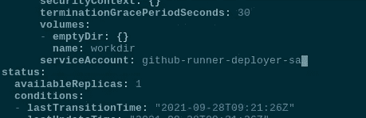

# kubernetes:Helm—“x509:由未知机构签署的证书”，以及 Pod 的服务帐户

> 原文：<https://itnext.io/kubernetes-helm-x509-certificate-signed-by-unknown-authority-and-serviceaccount-for-pod-900f70638c32?source=collection_archive---------4----------------------->


我们的 AWS Elastic Kubernetes 服务集群中有 Github runners，用于构建 Docker 映像，并通过 Helm 或 ArgoCD 部署它们。

在 Github runner 的 Pod 中第一次运行`helm install`时，我们得到了“ ***x509:由未知机构*** 签署的证书”错误:

```
$ helm --kube-apiserver=https://kubernetes.default.svc.cluster.local list
Error: Kubernetes cluster unreachable: Get “https://kubernetes.default.svc.cluster.local/version?timeout=32s": x509: certificate signed by unknown authority
```

或者，如果没有设置 API URL，那么我们可以看到一个权限错误:

```
$ helm list
Error: list: failed to list: secrets is forbidden: User “system:serviceaccount:dev-1–18-backend-github-runners-helm-ns:default” cannot list resource “secrets” in API group “” in the namespace “dev-1–18-backend-github-runners-helm-ns”
```

所以，原因很明显:Pod 中的 Helm 试图使用 Github runner 部署期间创建的*默认* ServiceAccount 访问 Kubernetes API 服务器。

# 检查服务帐户的权限

正如在 [Kubernetes: ServiceAccounts，JWT 令牌，认证和 RBAC 授权](https://rtfm.co.ua/en/kubernetes-serviceaccounts-jwt-tokens-authentication-and-rbac-authorization/)帖子中已经讨论过的，要在 API 服务器上进行认证，我们需要有它的认证中心密钥和令牌。

连接到 pod:

```
$ kubectl -n dev-1–18-backend-github-runners-helm-ns exec -ti actions-runner-deployment-7f78968949-tmrtt bash
Defaulting container name to runner.
Use ‘kubectl describe pod/actions-runner-deployment-7f78968949-tmrtt -n dev-1–18-backend-github-runners-helm-ns’ to see all of the containers in this pod.
root@actions-runner-deployment-7f78968949-tmrtt:/actions-runner#
```

设置变量:

```
root@actions-runner-deployment-7f78968949-tmrtt:/actions-runner# CA_CERT=/var/run/secrets/kubernetes.io/serviceaccount/ca.crtroot@actions-runner-deployment-7f78968949-tmrtt:/actions-runner# TOKEN=$(cat /var/run/secrets/kubernetes.io/serviceaccount/token)root@actions-runner-deployment-7f78968949-tmrtt:/actions-runner# NAMESPACE=$(cat /var/run/secrets/kubernetes.io/serviceaccount/namespace)
```

现在尝试访问 API:

```
root@actions-runner-deployment-7f78968949-tmrtt:/actions-runner# curl -s — cacert $CA_CERT -H “Authorization: Bearer $TOKEN” “https://kubernetes.default.svc.cluster.local/api/v1/namespaces/$NAMESPACE/pods" | jq ‘{message, code}’
{
“message”: “pods is forbidden: User \”system:serviceaccount:dev-1–18-backend-github-runners-helm-ns:default\” cannot list resource \”pods\” in API group \”\” in the namespace \”dev-1–18-backend-github-runners-helm-ns\””,
“code”: 403
}
```

如果尝试运行`kubectl get pod`，您会得到类似的错误:

```
root@actions-runner-deployment-7f78968949-tmrtt:/actions-runner# kubectl get pod
Error from server (Forbidden): pods is forbidden: User “system:serviceaccount:dev-1–18-backend-github-runners-helm-ns:default” cannot list resource “pods” in API group “” in the namespace “dev-1–18-backend-github-runners-helm-ns”
```

好吧，我们能做什么呢？

# 为 Kubernetes Pod 创建 Kubernetes 服务帐户

实际上，我们可以使用 Kubernetes RBAC 角色和 Kubernetes RBAC 角色绑定来创建自己的权限集，而不是将默认的 ServiceAccount 安装到 pod。

## 创建 RBAC 角色

我们可以使用此处列表中的预定义角色— [面向用户的角色](https://kubernetes.io/docs/reference/access-authn-authz/rbac/#user-facing-roles)，例如*集群管理*:

```
$ kubectl get clusterrole cluster-admin
NAME CREATED AT
cluster-admin 2020–11–27T14:44:52Z
```

或者，我们可以自己写，有严格的限制。例如，让我们授予对*资源* `pod`的*动词* `get`和`list`的访问权:

```
kind: Role
apiVersion: rbac.authorization.k8s.io/v1beta1
metadata:
   name: "github-runner-deployer-role"
rules:
 - apiGroups: [""]
   resources: ["pods"]
   verbs: ["get", "list"]
```

在必要的 Kubernetes 名称空间中创建角色:

```
$ kubectl -n dev-1–18-backend-github-runners-helm-ns apply -f github-runner-deployer-role.yaml
role.rbac.authorization.k8s.io/github-runner-deployer-role created
```

检查一下:

```
$ kubectl -n dev-1–18-backend-github-runners-helm-ns get role
NAME CREATED AT
github-runner-deployer-role 2021–09–28T08:05:20Z
```

## 创建服务帐户

接下来，在同一个命名空间中创建一个新的 ServiceAccount:

```
apiVersion: v1
kind: ServiceAccount
metadata:
  name: "github-runner-deployer-sa"
```

应用它:

```
$ kubectl -n dev-1–18-backend-github-runners-helm-ns apply -f github-runner-deployer-sa.yaml
```

## 创建角色绑定

现在，我们需要创建一个*绑定*——这个 ServiceAccount 和上面创建的角色之间的连接。

创建角色绑定:

```
kind: RoleBinding
apiVersion: rbac.authorization.k8s.io/v1beta1
metadata:
   name: "github-runner-deployer-rolebinding"
subjects:
 - kind: ServiceAccount
   name: "github-runner-deployer-sa"
   namespace: "dev-1-18-backend-github-runners-helm-ns"
roleRef:
   kind: Role
   name: "github-runner-deployer-role"
   apiGroup: rbac.authorization.k8s.io
```

应用它:

```
$ kubectl -n dev-1–18-backend-github-runners-helm-ns apply -f github-runner-deployer-rolebinding.yaml
rolebinding.rbac.authorization.k8s.io/github-runner-deployer-rolebinding created
```

## 将服务帐户安装到 Kubernetes Pod

最后一件事是将这个服务帐户附加到我们的 pod 上。

首先，让我们手动进行检查，无需部署:

```
apiVersion: v1
kind: Pod
metadata:
  name: "github-runners-deployer-pod"
spec:
  containers:
    - name: "github-runners-deployer"
      image: "nginx"
      ports:
        - name: "web"
          containerPort: 80
          protocol: TCP
  serviceAccountName: "github-runner-deployer-sa"
```

创建此窗格:

```
$ kubectl -n dev-1–18-backend-github-runners-helm-ns apply -f github-runner-deployer-pod.yaml
pod/github-runners-deployer-pod created
```

连接到它:

```
$ kubectl -n dev-1–18-backend-github-runners-helm-ns exec -ti github-runners-deployer-pod bash
root@github-runners-deployer-pod:/#
```

并检查 API 访问:

```
root@github-runners-deployer-pod:/# CA_CERT=/var/run/secrets/kubernetes.io/serviceaccount/ca.crtroot@github-runners-deployer-pod:/# TOKEN=$(cat /var/run/secrets/kubernetes.io/serviceaccount/token)root@github-runners-deployer-pod:/# NAMESPACE=$(cat /var/run/secrets/kubernetes.io/serviceaccount/namespace) root@github-runners-deployer-pod:/# curl -s --cacert $CA_CERT -H “Authorization: Bearer $TOKEN” “https://kubernetes.default.svc.cluster.local/api/v1/namespaces/$NAMESPACE/pods"
{
“kind”: “PodList”,
“apiVersion”: “v1”,
“metadata”: {
“selfLink”: “/api/v1/namespaces/dev-1–18-backend-github-runners-helm-ns/pods”,
“resourceVersion”: “251020450”
},
“items”: [
{
“metadata”: {
“name”: “actions-runner-deployment-7f78968949-jsh6l”,
“generateName”: “actions-runner-deployment-7f78968949-”,
“namespace”: “dev-1–18-backend-github-runners-helm-ns”,
…
```

现在我们可以对 pod 使用`get`和`list`，但不能对秘密使用，因为我们没有添加这个权限:

```
root@github-runners-deployer-pod:/# curl -s — cacert $CA_CERT -H “Authorization: Bearer $TOKEN” “https://kubernetes.default.svc.cluster.local/api/v1/namespaces/$NAMESPACE/secrets"
{
“kind”: “Status”,
“apiVersion”: “v1”,
“metadata”: {
},
“status”: “Failure”,
“message”: “secrets is forbidden: User \”system:serviceaccount:dev-1–18-backend-github-runners-helm-ns:github-runner-deployer-sa\” cannot list resource \”secrets\” in API group \”\” in the namespace \”dev-1–18-backend-github-runners-helm-ns\””,
…
```

# Helm 服务帐户

让我们回到 Github Runners 和 helm 那里。

因此，由于这个舵将用于在 EKS 集群中的任何地方部署任何东西，我们可以通过使用*cluster-admin*cluster role 授予它管理员访问权限。

删除之前创建的 RoleBinding:

```
$ kubectl -n dev-1–18-backend-github-runners-helm-ns delete rolebinding github-runner-deployer-rolebinding
rolebinding.rbac.authorization.k8s.io “github-runner-deployer-rolebinding” deleted
```

创建一个新的，但是此时通过使用 ClusterRoleBinding `type`来授予对整个集群的访问权:

```
kind: ClusterRoleBinding
apiVersion: rbac.authorization.k8s.io/v1beta1
metadata:
   name: "github-runner-deployer-cluster-rolebinding"
subjects:
 - kind: ServiceAccount
   name: "github-runner-deployer-sa"
   namespace: "dev-1-18-backend-github-runners-helm-ns"
roleRef:
   kind: ClusterRole
   name: "cluster-admin"
   apiGroup: rbac.authorization.k8s.io
```

将此服务帐户附加到此群集角色:

```
$ kubectl -n dev-1–18-backend-github-runners-helm-ns apply -f github-runner-deployer-clusterrolebinding.yaml
clusterrolebinding.rbac.authorization.k8s.io/github-runner-deployer-rolebinding created
```

回到舱里去，现在试着获取一个库本内特的秘密:

```
root@github-runners-deployer-pod:/# curl -s --cacert $CA_CERT -H “Authorization: Bearer $TOKEN” “https://kubernetes.default.svc.cluster.local/api/v1/namespaces/$NAMESPACE/secrets"
{
“kind”: “SecretList”,
“apiVersion”: “v1”,
“metadata”: {
“selfLink”: “/api/v1/namespaces/dev-1–18-backend-github-runners-helm-ns/secrets”,
“resourceVersion”: “251027845”
},
“items”: [
{
“metadata”: {
“name”: “bttrm-docker-secret”,
“namespace”: “dev-1–18-backend-github-runners-helm-ns”,
“selfLink”: “/api/v1/namespaces/dev-1–18-backend-github-runners-helm-ns/secrets/bttrm-docker-secret”,
…
```

很好—现在我们的掌舵人可以完全访问集群了！

让我们更新 Github Runners 部署来使用这个 ServiceAccount。

编辑它:

```
$ kubectl -n dev-1–18-backend-github-runners-helm-ns edit deploy actions-runner-deployment
```

通过添加`serviceAccount`来设置新的 ServiceAccount:



等待新的 Pod 被创建(检查 [Kubernetes: ConfigMap 和 Secrets—Pod 中的数据自动重新加载](https://rtfm.co.ua/en/kubernetes-configmap-and-secrets-data-auto-reload-in-pods/))，现在连接并检查 Pod 的权限:

```
root@actions-runner-deployment-6dfc9b457f-mc7rt:/actions-runner# kubectl auth can-i list pods
yes
```

并检查对另一个名称空间的访问，因为我们已经创建了适用于整个集群的 ClusterRoleBinding:

```
root@actions-runner-deployment-6dfc9b457f-mc7rt:/actions-runner# kubectl auth can-i list pods — namespace istio-system
yes
```

很好——我们还可以访问 *istio-system* 名称空间。

检查舵:

```
root@actions-runner-deployment-6dfc9b457f-mc7rt:/actions-runner# helm list
NAME NAMESPACE REVISION UPDATED STATUS CHART APP VERSION
github-runners dev-1–18-backend-github-runners-helm-ns 2 2021–09–22 19:50:18.828686642 +0300 +0300 deployed github-runners-1632329415 v1.0.0
```

完成了。

*最初发布于* [*RTFM: Linux、DevOps、系统管理*](https://rtfm.co.ua/en/kubernetes-helm-x509-certificate-signed-by-unknown-authority-and-serviceaccount-for-pod/) *。*