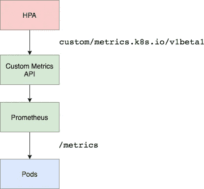
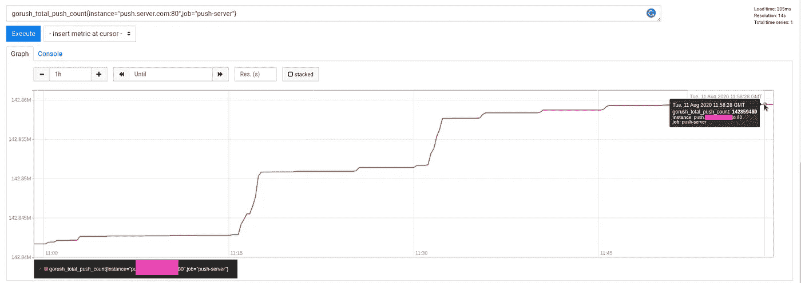
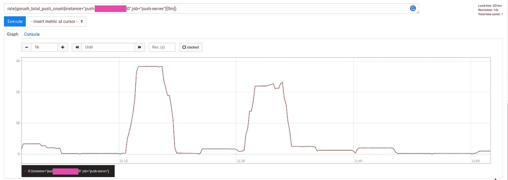

# kubernetes:HorizontalPodAutoscaler—示例概述

> 原文：<https://itnext.io/kubernetes-horizontalpodautoscaler-an-overview-with-examples-51f0d520bfe6?source=collection_archive---------1----------------------->


[Kubernetes HorizontalPodAutoscaler](https://kubernetes.io/docs/tasks/run-application/horizontal-pod-autoscale/)根据 CPU、内存或其他指标，在`[ReplicationController](https://kubernetes.io/docs/concepts/workloads/controllers/replicationcontroller/)`、`[Deployment](https://kubernetes.io/docs/concepts/workloads/controllers/deployment/)`或`[ReplicaSet](https://kubernetes.io/docs/concepts/workloads/controllers/replicaset/)`控制器下自动扩展 Kubernetes Pods。

在 [Kubernetes:为 Kubernetes Pod AutoScaler](https://rtfm.co.ua/en/kubernetes-running-metrics-server-in-aws-eks-for-a-kubernetes-pod-autoscaler/) 帖子在 AWS EKS 运行 metrics-server 中，我们曾对此进行过简短的讨论，现在让我们更深入地检查一下可用于缩放的所有选项。

对于 HPA，您可以使用三种 API 类型:

*   `metrics.k8s.io`:默认指标，基本由`[metrics-server](https://github.com/kubernetes-incubator/metrics-server)`提供
*   `[custom.metrics.k8s.io](https://github.com/kubernetes/community/blob/master/contributors/design-proposals/instrumentation/custom-metrics-api.md)`:指标，由集群内部的适配器提供，例如- [微软 Azure 适配器](https://github.com/Azure/azure-k8s-metrics-adapter)、[谷歌 Stackdriver](https://github.com/GoogleCloudPlatform/k8s-stackdriver) 、[普罗米修斯适配器](https://github.com/directxman12/k8s-prometheus-adapter)(普罗米修斯适配器将在本文稍后使用)，查看完整列表[此处> > >](https://github.com/kubernetes/metrics/blob/master/IMPLEMENTATIONS.md#custom-metrics-api)
*   `[external.metrics.k8s.io](https://github.com/kubernetes/community/blob/master/contributors/design-proposals/instrumentation/external-metrics-api.md)`:类似于自定义指标 API，但是指标是由外部系统提供的，比如 AWS CloudWatch

文档:[支持度量 API](https://kubernetes.io/docs/tasks/run-application/horizontal-pod-autoscale/#support-for-metrics-apis)，以及[用于自动扩展工作负载的自定义和外部度量](https://cloud.google.com/kubernetes-engine/docs/concepts/custom-and-external-metrics)。

除了水平吊舱自动缩放器(HPA)，您还可以使用[垂直吊舱自动缩放(VPA)](https://cloud.google.com/kubernetes-engine/docs/concepts/verticalpodautoscaler) ，它们可以一起使用，尽管有一些限制，参见[水平吊舱自动缩放限制](https://cloud.google.com/kubernetes-engine/docs/concepts/horizontalpodautoscaler#limitations)。

# 内容

*   [创建 HorizontalPodAutoscaler](https://rtfm.co.ua/en/kubernetes-horizontalpodautoscaler-an-overview-with-examples/#Create_HorizontalPodAutoscaler)
*   [负载测试 horizontalpod 自动缩放](https://rtfm.co.ua/en/kubernetes-horizontalpodautoscaler-an-overview-with-examples/#Load_testing_HorizontalPodAutoscaler_scaling)
*   [多指标缩放](https://rtfm.co.ua/en/kubernetes-horizontalpodautoscaler-an-overview-with-examples/#Multimetrics_scaling)
*   [自动缩放 API 组版本](https://rtfm.co.ua/en/kubernetes-horizontalpodautoscaler-an-overview-with-examples/#autoscaling_API_group_versions)
*   [自定义指标](https://rtfm.co.ua/en/kubernetes-horizontalpodautoscaler-an-overview-with-examples/#Custom_Metrics)
*   [内存指标缩放](https://rtfm.co.ua/en/kubernetes-horizontalpodautoscaler-an-overview-with-examples/#Memory_metrics_scaling)
*   [基于应用的指标扩展](https://rtfm.co.ua/en/kubernetes-horizontalpodautoscaler-an-overview-with-examples/#Applicationbased_metrics_scaling)
*   [Kubernetes service monitor](https://rtfm.co.ua/en/kubernetes-horizontalpodautoscaler-an-overview-with-examples/#Kubernetes_ServiceMonitor)
*   [Prometheus 适配器配置图—系列查询和度量查询](https://rtfm.co.ua/en/kubernetes-horizontalpodautoscaler-an-overview-with-examples/#Prometheus_Adapter_ConfigMap_%E2%80%93_seriesQuery_and_metricsQuery)

# 创建 HorizontalPodAutoscaler

让我们从一个简单的 HPA 开始，它将根据 CPU 的使用情况来扩展单元:

```
apiVersion: autoscaling/v1
kind: HorizontalPodAutoscaler
metadata:
  name: hpa-example
spec:
  scaleTargetRef:
    apiVersion: apps/v1
    kind: Deployment
    name: deployment-example
  minReplicas: 1
  maxReplicas: 5
  targetCPUUtilizationPercentage: 10
```

这里:

*   `apiVersion: autoscaling/v1` -一个 API 组`autoscaling`，注意 API 版本，因为在撰写本文时的`v1`中，缩放仅由 CPU 指标提供，因此内存和自定义指标只能与 API `v2beta2`一起使用(仍然可以使用带注释的`v1`，参见 [API 对象](https://kubernetes.io/docs/tasks/run-application/horizontal-pod-autoscale/#api-object)。
*   `spec.scaleTargetRef`:为нра指定将缩放哪个控制器(`ReplicationController`、`Deployment`、`ReplicaSet`)，在这种情况下，HPA 将寻找名为*部署的`Deployment`对象——例如*
*   `spec.minReplicas`、`spec.maxReplicas`:该 HPA 运行的最小和最大 pod
*   `targetCPUUtilizationPercentage`:当 HPA 添加或移除 pod 时，来自`[requests](https://cloud.google.com/blog/products/gcp/kubernetes-best-practices-resource-requests-and-limits)`的 CPU 使用率%

创建它:

```
$ kubectl apply -f hpa-example.yaml
horizontalpodautoscaler.autoscaling/hpa-example created
```

检查:

```
$ kubectl get hpa hpa-example
NAME REFERENCE TARGETS MINPODS MAXPODS REPLICAS AGE
hpa-example Deployment/deployment-example <unknown>/10% 1 5 0 89s
```

目前，它的`TARGETS`具有未知的*<>*值，因为还没有创建 pod，但是指标已经可用:

```
$ kubectl get — raw “/apis/metrics.k8s.io/” | jq{
“kind”: “APIGroup”,
“apiVersion”: “v1”,
“name”: “metrics.k8s.io”,
“versions”: [
{
“groupVersion”: “metrics.k8s.io/v1beta1”,
“version”: “v1beta1”
}
],
“preferredVersion”: {
“groupVersion”: “metrics.k8s.io/v1beta1”,
“version”: “v1beta1”}
}
```

添加名为*的部署-示例*T15:

```
apiVersion: apps/v1
kind: Deployment
metadata:
  name: deployment-example
spec:
  replicas: 1
  strategy:
    type: RollingUpdate
  selector:
    matchLabels:
      application: deployment-example
  template:
    metadata:
      labels:
        application: deployment-example
    spec: 
      containers:
      - name: deployment-example-pod
        image: nginx
        ports:
          - containerPort: 80
        resources:
          requests:
            cpu: 100m
            memory: 100Mi
```

在这里，我们定义了一个部署，它将使用 NINGX 和`requests`为 100 毫核和 100 [兆字节](https://en.wikipedia.org/wiki/Mebibyte)内存旋转一个 pod，请参见 [Kubernetes 最佳实践:资源请求和限制](https://cloud.google.com/blog/products/gcp/kubernetes-best-practices-resource-requests-and-limits)。

创建它:

```
$ kubectl apply -f hpa-deployment-example.yaml
deployment.apps/deployment-example created
```

现在检查 HPA:

```
$ kubectl get hpa hpa-example
NAME REFERENCE TARGETS MINPODS MAXPODS REPLICAS AGE
hpa-example Deployment/deployment-example 0%/10% 1 5 1 14m
```

我们的нра发现了部署，并开始检查其吊舱的指标。

让我们检查这些指标—找到一个 pod:

```
$ kubectl get pod | grep example | cut -d “ “ -f 1
deployment-example-86c47f5897–2mzjd
```

并运行以下 API 请求:

```
$ kubectl get — raw /apis/metrics.k8s.io/v1beta1/namespaces/default/pods/deployment-example-86c47f5897–2mzjd | jq
{
“kind”: “PodMetrics”,
“apiVersion”: “metrics.k8s.io/v1beta1”,
“metadata”: {
“name”: “deployment-example-86c47f5897–2mzjd”,
“namespace”: “default”,
“selfLink”: “/apis/metrics.k8s.io/v1beta1/namespaces/default/pods/deployment-example-86c47f5897–2mzjd”,
“creationTimestamp”: “2020–08–07T10:41:21Z”
},
“timestamp”: “2020–08–07T10:40:39Z”,
“window”: “30s”,
“containers”: [
{
“name”: “deployment-example-pod”,
“usage”: {
“cpu”: “0”,
“memory”: “2496Ki”
}
}
]
}
```

CPU 使用率—零，内存—2mb，让我们用`top`确认一下:

```
$ kubectl top pod deployment-example-86c47f5897–2mzjd
NAME CPU(cores) MEMORY(bytes)
deployment-example-86c47f5897–2mzjd 0m 2Mi
```

*“好吧，这些家伙*！”(с)

好了，我们有了指标，创建了 HPA 和部署，让我们来看看这里的扩展是如何工作的。

## 负载测试水平自动缩放

对于负载测试，我们可以使用[load impact/loadgentest-wrk](https://hub.docker.com/r/loadimpact/loadgentest-wrk)实用程序映像。

现在，使用 NGINX 运行从本地工作站到 pod 的端口重定向，因为我们没有添加任何负载平衡器(参见[Kubernetes:cluster IP vs NodePort vs 负载平衡器、服务和入口—示例概述](https://rtfm.co.ua/en/kubernetes-clusterip-vs-nodeport-vs-loadbalancer-services-and-ingress-an-overview-with-examples/)):

```
$ kubectl port-forward deployment-example-86c47f5897–2mzjd 8080:80
Forwarding from 127.0.0.1:8080 -> 80
Forwarding from [::1]:8080 -> 80
```

再次检查资源:

```
$ kubectl get hpa hpa-example
NAME REFERENCE TARGETS MINPODS MAXPODS REPLICAS AGE
hpa-example Deployment/deployment-example 0%/10% 1 5 1 33m
```

CPU 使用率为 0%，一个 pod 正在运行(`REPLICAS` *1* )。

运行测试:

```
$ docker run — rm — net=host loadimpact/loadgentest-wrk -c 100 -t 100 -d 5m [http://127.0.0.1:8080](http://127.0.0.1:8080)
Running 5m test @ [http://127.0.0.1:8080](http://127.0.0.1:8080)
```

这里:

*   使用 100 个线程打开 100 个连接
*   运行测试 5 分钟

检查吊舱:

```
$ kubectl top pod deployment-example-86c47f5897–2mzjd
NAME CPU(cores) MEMORY(bytes)
deployment-example-86c47f5897–2mzjd 49m 2Mi
```

CPU 使用率现在为 49mi，在`requests`中，我们已经设置了 10mi CPU 限制——检查 HPA:

```
$ kubectl get hpa hpa-example
NAME REFERENCE TARGETS MINPODS MAXPODS REPLICAS AGE
hpa-example Deployment/deployment-example 49%/10% 1 5 4 42m
```

`TARGETS`从 10%的限制提高到 49%，我们的 HPA 开始了新的 pod-`REPLICAS`*4*:

```
$ kubectl get pod | grep example
deployment-example-86c47f5897–2mzjd 1/1 Running 0 31m
deployment-example-86c47f5897–4ntd4 1/1 Running 0 24s
deployment-example-86c47f5897-p7tc7 1/1 Running 0 8s
deployment-example-86c47f5897-q49gk 1/1 Running 0 24s
deployment-example-86c47f5897-zvdvz 1/1 Running 0 24s
```

# 多指标缩放

好吧，我们可以按 CPU 使用率进行扩展，但是如果您想同时按 CPU 和内存使用率进行扩展呢？

添加另一个`Resource`，内存限制设置为相同的 10%:

```
apiVersion: autoscaling/v2beta1
kind: HorizontalPodAutoscaler
metadata:
  name: hpa-example
spec:
  scaleTargetRef:
    apiVersion: apps/v1
    kind: Deployment
    name: deployment-example
  minReplicas: 1
  maxReplicas: 5
  metrics:
  - type: Resource
    resource:
      name: cpu
      targetAverageUtilization: 10
  - type: Resource
    resource:
      name: memory 
      targetAverageUtilization: 10
```

## 自动缩放 API 组版本

让我们回到 API 版本。

在 HPA 的第一个清单中，我们使用了 [autoscaling/v1](https://kubernetes.io/docs/reference/generated/kubernetes-api/v1.18/#horizontalpodautoscaler-v1-autoscaling) API，它只有一个`targetCPUUtilizationPercentage`参数。

检查 [autoscaling/v2beta1](https://kubernetes.io/docs/reference/generated/kubernetes-api/v1.18/#metricspec-v2beta1-autoscaling) —现在，它增加了`metrics`字段，这是 [MetricSpec](https://kubernetes.io/docs/reference/generated/kubernetes-api/v1.18/#metricspec-v2beta1-autoscaling) 数组，可以保存新字段`external`、`object`、`pods`、`resource`。

反过来，`resource`拥有 [ResourceMetricSource](https://kubernetes.io/docs/reference/generated/kubernetes-api/v1.18/#resourcemetricsource-v2beta1-autoscaling) ，它拥有两个字段- `targetAverageUtilization`和`targetAverageValue`，这两个字段现在在`mertics`中使用，而不是在`targetCPUUtilizationPercentage`中使用。

应用 HPA 更新:

```
$ kubectl apply -f hpa-example.yaml
horizontalpodautoscaler.autoscaling/hpa-example configured
```

检查一下:

```
$ kubectl get hpa hpa-example
NAME REFERENCE TARGETS MINPODS MAXPODS REPLICAS AGE
hpa-example Deployment/deployment-example 3%/10%, 0%/10% 1 5 2 126m
```

`TARGETS`现在显示两个指标——CPU 和内存。

很难让 NGINX 消耗大量内存，所以我们用下面的`kubectl`命令来看看它现在用了多少:

```
$ kubectl get — raw /apis/metrics.k8s.io/v1beta1/namespaces/default/pods/deployment-example-c4d6f96db-jv6nm | jq ‘.containers[].usage.memory’
“2824Ki”
```

2 兆。

让我们再次更新我们的 PHA 并设置一个新的限制，但此时我们将使用原始值而不是百分比—1024 千字节， 1 兆字节使用`targetAverageUtilization`而不是先前使用的`targetAverageUtilization`:

```
...
  metrics:
  - type: Resource
    resource:
      name: cpu
      targetAverageUtilization: 10
  - type: Resource
    resource:
      name: memory
      targetAverageValue: 1024Ki
```

应用并检查:

```
$ kubectl get hpa hpa-example
NAME REFERENCE TARGETS MINPODS MAXPODS REPLICAS AG
hpa-example Deployment/deployment-example 2551808/1Mi, 0%/10% 1 5 3 2m8s
```

`REPLICAS` == 3 现在，pod 被缩放，检查来自`TARGETS`的值-将其转换为千字节:

```
$ echo 2551808/1024 | bc
2492
```

并检查实际内存使用情况:

```
$ kubectl get — raw /apis/metrics.k8s.io/v1beta1/namespaces/default/pods/deployment-example-c4d6f96db-fldl2 | jq ‘.containers[].usage.memory’
“2496Ki”
```

2492 ~= 2496Ki。

好了，我们现在能够通过 CPU 和内存使用来扩展部署。

# 自定义指标

## 内存指标扩展

除了 API 服务器和`cAdvisor`提供的指标，我们可以使用任何其他指标，例如由 Prometheus 收集的指标。

它可以是 Cloudwatch 导出器 Prometheus 的`node_exporter`收集的指标，也可以是来自应用程序的指标。

文件是[这里的> > >](https://github.com/kubernetes/community/blob/master/contributors/design-proposals/instrumentation/custom-metrics-api.md) 。

由于我们正在使用 Prometheus(参见 [Kubernetes:使用 Prometheus 进行监控— exporters，一个服务发现，及其角色](https://rtfm.co.ua/en/kubernetes-monitoring-with-prometheus-exporters-a-service-discovery-and-its-roles/)和 [Kubernetes:使用 Prometheus 操作员进行集群监控](https://rtfm.co.ua/en/kubernetes-a-clusters-monitoring-with-the-prometheus-operator/))所以让我们添加它的适配器:



如果您现在尝试访问外部或自定义 API 端点，您会得到错误:

```
$ kubectl get — raw /apis/custom.metrics.k8s.io/
Error from server (NotFound): the server could not find the requested resource$ kubectl get — raw /apis/external.metrics.k8s.io/
Error from server (NotFound): the server could not find the requested resource
```

从舵图上安装适配器:

```
$ helm install prometheus-adapter stable/prometheus-adapter
NAME: prometheus-adapter
LAST DEPLOYED: Sat Aug 8 13:27:36 2020
NAMESPACE: default
STATUS: deployed
REVISION: 1
TEST SUITE: None
NOTES:
prometheus-adapter has been deployed.
```

几分钟后，您应该能够使用以下命令列出指标:

```
$ kubectl get — raw /apis/custom.metrics.k8s.io/v1beta
```

等待一两分钟，再次检查 API:

```
$ kubectl get — raw=”/apis/custom.metrics.k8s.io/v1beta1" | jq .
{
“kind”: “APIResourceList”,
“apiVersion”: “v1”,
“groupVersion”: “custom.metrics.k8s.io/v1beta1”,
“resources”: []
}
```

嗯，但是为什么`"resources":[]`是空的？

检查适配器的 pod 日志:

```
$ kubectl logs -f prometheus-adapter-b8945f4d8-q5t6x
I0808 10:45:47.706771 1 adapter.go:94] successfully using in-cluster auth
E0808 10:45:47.752737 1 provider.go:209] unable to update list of all metrics: unable to fetch metrics for query “{__name__=~\”^container_.*\”,container!=\”POD\”,namespace!=\”\”,pod!=\”\”}”: Get [http://prometheus.default.svc:9090/api/v1/series?match%5B%5D=%7B__name__%3D~%22%5Econtainer_.%2A%22%2Ccontainer%21%3D%22POD%22%2Cnamespace%21%3D%22%22%2Cpod%21%3D%22%22%7D&start=1596882347.736:](http://prometheus.default.svc:9090/api/v1/series?match%5B%5D=%7B__name__%3D~%22%5Econtainer_.%2A%22%2Ccontainer%21%3D%22POD%22%2Cnamespace%21%3D%22%22%2Cpod%21%3D%22%22%7D&start=1596882347.736:) dial tcp: lookup prometheus.default.svc on 172.20.0.10:53: no such host
I0808 10:45:48.032873 1 serving.go:306] Generated self-signed cert (/tmp/cert/apiserver.crt, /tmp/cert/apiserver.key)
…
```

错误如下:

> 拨打 tcp:在 172.20.0.10:53 上查找 prometheus.default.svc:没有这样的主机

让我们试着通过`Service` DNS 名称从 pod 访问我们的 Prometheus 操作员:

```
$ kubectl exec -ti deployment-example-c4d6f96db-fldl2 curl prometheus-prometheus-oper-prometheus.monitoring.svc.cluster.local:9090/metrics | head -5
HELP go_gc_duration_seconds A summary of the pause duration of garbage collection cycles.
TYPE go_gc_duration_seconds summary
go_gc_duration_seconds{quantile=”0"} 2.0078e-05
go_gc_duration_seconds{quantile=”0.25"} 3.8669e-05
go_gc_duration_seconds{quantile=”0.5"} 6.956e-05
```

好的，我们可以使用*Prometheus-Prometheus-oper-Prometheus . monitoring . SVC . cluster . local:9090*URL 到达它。

编辑适配器的部署:

```
$ kubectl edit deploy prometheus-adapter
```

更新其`prometheus-url`:

```
...
    spec:
      affinity: {}
      containers:
      - args:
        - /adapter
        - --secure-port=6443
        - --cert-dir=/tmp/cert
        - --logtostderr=true
        - --prometheus-url=http://prometheus-prometheus-oper-prometheus.monitoring.svc.cluster.local:9090
...
```

应用更改并再次检查:

```
$ kubectl get — raw “/apis/custom.metrics.k8s.io/v1beta1” | jq . |grep “pods/” | head -5
“name”: “pods/node_load15”,
“name”: “pods/go_memstats_next_gc_bytes”,
“name”: “pods/coredns_forward_request_duration_seconds_count”,
“name”: “pods/rest_client_requests”,
“name”: “pods/node_ipvs_incoming_bytes”,
```

很好—我们已经有了我们的指标，现在可以在 HPA 中使用它们。

检查 API 服务器上的`memory_usage_bytes`指标:

```
$ kubectl get — raw=”/apis/custom.metrics.k8s.io/v1beta1/namespaces/default/pods/*/memory_usage_bytes” | jq .
{
“kind”: “MetricValueList”,
“apiVersion”: “custom.metrics.k8s.io/v1beta1”,
“metadata”: {
“selfLink”: “/apis/custom.metrics.k8s.io/v1beta1/namespaces/default/pods/%2A/memory_usage_bytes”
},
“items”: [
{
“describedObject”: {
“kind”: “Pod”,
“namespace”: “default”,
“name”: “deployment-example-c4d6f96db-8tfnw”,
“apiVersion”: “/v1”
},
“metricName”: “memory_usage_bytes”,
“timestamp”: “2020–08–08T11:18:53Z”,
“value”: “11886592”,
“selector”: null
},
…
```

更新нра的清单:

```
apiVersion: autoscaling/v2beta1
kind: HorizontalPodAutoscaler
metadata:
  name: hpa-example
spec:
  scaleTargetRef:
    apiVersion: apps/v1
    kind: Deployment
    name: deployment-example
  minReplicas: 1
  maxReplicas: 5
  metrics:
  - type: Pods
    pods:
      metricName: memory_usage_bytes
      targetAverageValue: 1024000
```

现在检查 HPA 的值:

```
$ kubectl get hpa hpa-example
NAME REFERENCE TARGETS MINPODS MAXPODS REPLICAS AGE
hpa-example Deployment/deployment-example 4694016/1Mi, 0%/10% 1 5 5 69m
```

应用最新的更改:

```
$ kubectl apply -f hpa-example.yaml
horizontalpodautoscaler.autoscaling/hpa-example configured
```

再次检查:

```
$ kubectl get hpa hpa-example
NAME REFERENCE TARGETS MINPODS MAXPODS REPLICAS AGE
hpa-example Deployment/deployment-example 11853824/1024k 1 5 1 16s
```

仍有 1 个副本，请检查事件:

```
…
43s Normal ScalingReplicaSet Deployment Scaled up replica set deployment-example-c4d6f96db to 1
16s Normal ScalingReplicaSet Deployment Scaled up replica set deployment-example-c4d6f96db to 4
1s Normal ScalingReplicaSet Deployment Scaled up replica set deployment-example-c4d6f96db to 5
16s Normal SuccessfulRescale HorizontalPodAutoscaler New size: 4; reason: pods metric memory_usage_bytes above target
1s Normal SuccessfulRescale HorizontalPodAutoscaler New size: 5; reason: pods metric memory_usage_bytes above target
…
```

还有 HPA:

```
$ kubectl get hpa hpa-example
NAME REFERENCE TARGETS MINPODS MAXPODS REPLICAS AGE
hpa-example Deployment/deployment-example 6996787200m/1024k 1 5 5 104s
```

太好了——“管用！”

这有利于集群中已经存在的指标，比如默认情况下由 cAdvisor 从集群中的所有容器收集的`memory_usage_bytes`。

让我们尝试使用更多的自定义指标，例如，让我们通过使用自己的指标来扩展 Gorush-server，参见 [Kubernetes:在 AWS 负载平衡器后面运行带有 Gorush 的推送服务器](https://rtfm.co.ua/en/kubernetes-running-a-push-server-with-gorush-behind-an-aws-loadbalancer/)。

## 基于应用的指标扩展

因此，我们在集群中运行 Gorush 服务器，用于向移动客户端发送推送通知。

它有内置的`/metrics`端点，该端点返回可以在 Prometheus 中使用的标准时间序列指标。

为了运行测试 Gorush 服务器，我们可以使用这样的`Service`、`ConfigMap`和`Deployment`:

```
apiVersion: v1
kind: Service
metadata:
  name: gorush
  labels:
    app: gorush
    tier: frontend
spec:
  selector:
    app: gorush
    tier: frontend
  type: ClusterIP
  ports:
  - name: gorush
    protocol: TCP
    port: 80
    targetPort: 8088
---
apiVersion: v1
kind: ConfigMap
metadata:
  name: gorush-config
data:
  stat.engine: memory
---
apiVersion: apps/v1
kind: Deployment
metadata:
  name: gorush
spec:
  replicas: 1
  selector:
    matchLabels:
      app: gorush
      tier: frontend
  template:
    metadata:
      labels:
        app: gorush
        tier: frontend
    spec:
      containers:
      - image: appleboy/gorush
        name: gorush
        imagePullPolicy: Always
        ports:
        - containerPort: 8088
        livenessProbe:
          httpGet:
            path: /healthz
            port: 8088
          initialDelaySeconds: 3
          periodSeconds: 3
        env:
        - name: GORUSH_STAT_ENGINE
          valueFrom:
            configMapKeyRef:
              name: gorush-config
              key: stat.engine
```

创建专用命名空间:

```
$ kubectl create ns eks-dev-1-gorush
namespace/eks-dev-1-gorush created
```

创建应用程序:

```
$ kubectl -n eks-dev-1-gorush apply -f my-gorush.yaml
service/gorush created
configmap/gorush-config created
deployment.apps/gorush created
```

检查它的豆荚:

```
$ kubectl -n eks-dev-1-gorush get pod
NAME READY STATUS RESTARTS AGE
gorush-5c6775748b-6r54h 1/1 Running 0 83s
```

Gorush 服务:

```
$ kubectl -n eks-dev-1-gorush get svc
NAME TYPE CLUSTER-IP EXTERNAL-IP PORT(S) AGE
gorush ClusterIP 172.20.186.251 <none> 80/TCP 103s
```

将`port-forward`运行至其舱:

```
$ kubectl -n eks-dev-1-gorush port-forward gorush-5c6775748b-6r54h 8088:8088
Forwarding from 127.0.0.1:8088 -> 8088
Forwarding from [::1]:8088 -> 8088
```

检查指标:

```
$ curl -s localhost:8088/metrics | grep gorush | head
HELP gorush_android_fail Number of android fail count
TYPE gorush_android_fail gauge
gorush_android_fail 0
HELP gorush_android_success Number of android success count
TYPE gorush_android_success gauge
gorush_android_success 0
HELP gorush_ios_error Number of iOS fail count
TYPE gorush_ios_error gauge
gorush_ios_error 0
HELP gorush_ios_success Number of iOS success count
```

或者换一种方式:利用它的`Service`名，我们可以直接到达。

查找服务:

```
$ kubectl -n eks-dev-1-gorush get svc
NAME TYPE CLUSTER-IP EXTERNAL-IP PORT(S) AGE
gorush ClusterIP 172.20.186.251 <none> 80/TCP 26m
```

API 服务器的开放代理:

```
$ kubectl proxy — port=8080
Starting to serve on 127.0.0.1:8080
```

并连接到服务:

```
$ curl -sL localhost:8080/api/v1/namespaces/eks-dev-1-gorush/services/gorush:gorush/proxy/metrics | head
HELP go_gc_duration_seconds A summary of the GC invocation durations.
TYPE go_gc_duration_seconds summary
go_gc_duration_seconds{quantile=”0"} 9.194e-06
go_gc_duration_seconds{quantile=”0.25"} 1.2092e-05
go_gc_duration_seconds{quantile=”0.5"} 2.1812e-05
go_gc_duration_seconds{quantile=”0.75"} 5.1794e-05
go_gc_duration_seconds{quantile=”1"} 0.000145631
go_gc_duration_seconds_sum 0.001080551
go_gc_duration_seconds_count 32
HELP go_goroutines Number of goroutines that currently exist.
```

## Kubernetes `ServiceMonitor`

接下来要做的是为我们的 Prometheus 操作员向 Kubernetes 集群添加一个`ServiceMonitor`来收集这些指标，检查[添加 Kubernetes ServiceMonitor](https://rtfm.co.ua/en/kubernetes-a-clusters-monitoring-with-the-prometheus-operator/#Adding_Kubernetes_ServiceMonitor) 。

现在使用端口转发检查指标:

```
$ kubectl -n monitoring port-forward prometheus-prometheus-prometheus-oper-prometheus-0 9090:9090
Forwarding from [::1]:9090 -> 9090
Forwarding from 127.0.0.1:9090 -> 9090
```

尝试访问它们:

```
$ curl “localhost:9090/api/v1/series?match[]=gorush_total_push_count&start=1597141864”
{“status”:”success”,”data”:[]}
```

`"data":[]`现在是空的——或者普罗米修斯还没有收集那些指标。

定义`ServiceMonitor`:

```
apiVersion: monitoring.coreos.com/v1
kind: ServiceMonitor
metadata:
  labels:
    serviceapp: gorush-servicemonitor
    release: prometheus
  name: gorush-servicemonitor
  namespace: monitoring
spec:     
  endpoints:
  - bearerTokenFile: /var/run/secrets/kubernetes.io/serviceaccount/token
    interval: 15s
    port: gorush
  namespaceSelector:
    matchNames: 
    - eks-dev-1-gorush
  selector: 
    matchLabels:
      app: gorush
```

***注*** *:普罗米修斯资源包括一个名为* `*serviceMonitorSelector*` *的字段，定义了要使用的服务监视器的选择。默认情况下，在版本* `*v0.19.0*` *之前，ServiceMonitors 必须安装在与 Prometheus 实例相同的名称空间中。使用 Prometheus 操作符* `*v0.19.0*` *和更高版本，可以通过 Prometheus 资源的* `*serviceMonitorNamespaceSelector*` *字段在 Prometheus 名称空间之外选择 ServiceMonitors。*
*见* [*普罗米修斯算子*](https://github.com/prometheus-operator/prometheus-operator/blob/master/Documentation/user-guides/getting-started.md)

创建此 ServiceMonitor:

```
$ kubectl apply -f ../../gorush-service-monitor.yaml
servicemonitor.monitoring.coreos.com/gorush-servicemonitor created
```

在*目标*中检查:


*上升*，好。

几分钟后，再次检查指标:

```
$ curl “localhost:9090/api/v1/series?match[]=gorush_total_push_count&start=1597141864”
{“status”:”success”,”data”:[{“__name__”:”gorush_total_push_count”,”endpoint”:”gorush”,”instance”:”10.3.35.14:8088",”job”:”gorush”,”namespace”:”eks-dev-1-gorush”,”pod”:”gorush-5c6775748b-6r54h”,”service”:”gorush”}]}
```

或者这样:

```
$ curl -s localhost:9090/api/v1/label/__name__/values | jq | grep gorush
“gorush_android_fail”,
“gorush_android_success”,
“gorush_ios_error”,
“gorush_ios_success”,
“gorush_queue_usage”,
“gorush_total_push_count”,
```

很好，我们已经得到了我们的指标，让我们继续在本次部署的`HorizontalPodAutoscaler`中使用它们。

查看此处提供的指标组:

```
$ kubectl get — raw “/apis/custom.metrics.k8s.io/v1beta1” | jq . | grep “gorush”
“name”: “services/gorush_android_success”,
“name”: “pods/gorush_android_fail”,
“name”: “namespaces/gorush_total_push_count”,
“name”: “namespaces/gorush_queue_usage”,
“name”: “pods/gorush_ios_success”,
“name”: “namespaces/gorush_ios_success”,
“name”: “jobs.batch/gorush_ios_error”,
“name”: “services/gorush_total_push_count”,
“name”: “jobs.batch/gorush_queue_usage”,
“name”: “pods/gorush_queue_usage”,
“name”: “jobs.batch/gorush_android_fail”,
“name”: “services/gorush_queue_usage”,
“name”: “services/gorush_ios_success”,
“name”: “jobs.batch/gorush_android_success”,
“name”: “jobs.batch/gorush_total_push_count”,
“name”: “pods/gorush_ios_error”,
“name”: “pods/gorush_total_push_count”,
“name”: “pods/gorush_android_success”,
“name”: “namespaces/gorush_android_success”,
“name”: “namespaces/gorush_android_fail”,
“name”: “namespaces/gorush_ios_error”,
“name”: “jobs.batch/gorush_ios_success”,
“name”: “services/gorush_ios_error”,
“name”: “services/gorush_android_fail”,
```

添加带有 HPA 的新清单，HPA 将使用来自`Pods`组的`gorush_queue_usage`:

```
apiVersion: autoscaling/v2beta1
kind: HorizontalPodAutoscaler
metadata:
  name: gorush-hpa
spec:
  scaleTargetRef:
    apiVersion: apps/v1
    kind: Deployment
    name: gorush
  minReplicas: 1
  maxReplicas: 5
  metrics:
  - type: Pods
    pods:
      metricName: gorush_total_push_count
      targetAverageValue: 2
```

通过这样的设置，一旦`gorush_total_push_count`的值超过 *2* ，HPA 必须缩放吊舱。

创建它:

```
$ kubectl -n eks-dev-1-gorush apply -f my-gorush.yaml
service/gorush unchanged
configmap/gorush-config unchanged
deployment.apps/gorush unchanged
horizontalpodautoscaler.autoscaling/gorush-hpa created
```

立即检查其价值:

```
$ kubectl get — raw=”/apis/custom.metrics.k8s.io/v1beta1/namespaces/eks-dev-1-gorush/pods/*/gorush_total_push_count” | jq ‘.items[].value’
“0”
```

检查нра:

```
$ kubectl -n eks-dev-1-gorush get hpa
NAME REFERENCE TARGETS MINPODS MAXPODS REPLICAS AGE
gorush-hpa Deployment/gorush 0/1 1 5 1 17s
```

`TARGETS` *0/1* ，好的。

发送推送:

```
$ curl -X POST a6095d18859c849889531cf08baa6bcf-531932299.us-east-2.elb.amazonaws.com/api/push -d ‘{“notifications”:[{“tokens”:[“990004543798742”],”platform”:2,”message”:”Hello Android”}]}’
{“counts”:1,”logs”:[],”success”:”ok”}
```

再次检查`gorush_total_push_count`度量:

```
$ kubectl get — raw=”/apis/custom.metrics.k8s.io/v1beta1/namespaces/eks-dev-1-gorush/pods/*/gorush_total_push_count” | jq ‘.items[].value’
“1”
```

已发送一条推送消息。

再次检查 HPA:

```
$ kubectl -n eks-dev-1-gorush get hpa
NAME REFERENCE TARGETS MINPODS MAXPODS REPLICAS AGE
gorush-hpa Deployment/gorush 1/2 1 5 1 9m42s
```

`TARGETS` *1/2* ，`REPLICAS`仍有 1，发送另一个推送并检查事件:

```
$ kubectl -n eks-dev-1-gorush get events — watch
LAST SEEN TYPE REASON KIND MESSAGE
18s Normal Scheduled Pod Successfully assigned eks-dev-1-gorush/gorush-5c6775748b-x8fjs to ip-10–3–49–200.us-east-2.compute.internal
17s Normal Pulling Pod Pulling image “appleboy/gorush”
17s Normal Pulled Pod Successfully pulled image “appleboy/gorush”
17s Normal Created Pod Created container gorush
17s Normal Started Pod Started container gorush
18s Normal SuccessfulCreate ReplicaSet Created pod: gorush-5c6775748b-x8fjs
18s Normal SuccessfulRescale HorizontalPodAutoscaler New size: 2; reason: pods metric gorush_total_push_count above target
18s Normal ScalingReplicaSet Deployment Scaled up replica set gorush-5c6775748b to 2
```

以及住房津贴:

```
$ kubectl -n eks-dev-1-gorush get hpa
NAME REFERENCE TARGETS MINPODS MAXPODS REPLICAS AGE
gorush-hpa Deployment/gorush 3/2 1 5 2 10m
```

太好了！因此，通过`gorush_total_push_count`进行缩放是可行的。

但是这里有一个陷阱:`gorush_total_push_count`是累积指标，例如，在生产图上，它看起来像下面这样:



在这种情况下，我们的 HPA 将会扩展豆荚直到时间的尽头。

## 普罗米修斯适配器`ConfigMap` - `seriesQuery`和`metricsQuery`

为了减轻这种情况，让我们添加一个自己的指标。

普罗米修斯适配器有自己的`ConfigMap`:

```
$ kubectl get cm prometheus-adapter
NAME DATA AGE
prometheus-adapter 1 46h
```

其中包含了`config.yaml`，这里见其例[>>>](https://github.com/DirectXMan12/k8s-prometheus-adapter/blob/master/docs/sample-config.yaml)。

创建一个 [PromQL](https://prometheus.io/docs/prometheus/latest/querying/basics/) 查询，该查询将返回每秒的推送计数:

```
rate(gorush_total_push_count{instance="push.server.com:80",job="push-server"}[5m])
```



更新`ConfigMap`并在那里添加新的查询:

```
apiVersion: v1
data:
  config.yaml: |
    rules:
    - seriesQuery: '{__name__=~"gorush_total_push_count"}'
      seriesFilters: []
      resources:
        overrides:
          namespace:
            resource: namespace
          pod:
            resource: pod
      name:
        matches: ""
        as: "gorush_push_per_second"
      metricsQuery: rate(<<.Series>>{<<.LabelMatchers>>}[5m])
```

保存并退出，检查它:

```
$ kubectl get — raw=”/apis/custom.metrics.k8s.io/v1beta1/namespaces/eks-dev-1-gorush/pods/*/gorush_push_per_second” | jq
Error from server (NotFound): the server could not find the metric gorush_push_per_second for pods
```

重新创建 pod，使其应用更改(参见 [Kubernetes:配置图和机密 pod 中的数据自动重新加载](https://rtfm.co.ua/en/kubernetes-configmap-and-secrets-data-auto-reload-in-pods/)):

```
$ kubectl delete pod prometheus-adapter-7c56787c5c-kllq6
pod “prometheus-adapter-7c56787c5c-kllq6” deleted
```

检查一下:

```
$ kubectl get — raw=”/apis/custom.metrics.k8s.io/v1beta1/namespaces/eks-dev-1-gorush/pods/*/gorush_push_per_second” | jq
{
“kind”: “MetricValueList”,
“apiVersion”: “custom.metrics.k8s.io/v1beta1”,
“metadata”: {
“selfLink”: “/apis/custom.metrics.k8s.io/v1beta1/namespaces/eks-dev-1-gorush/pods/%2A/gorush_push_per_second”
},
“items”: [
{
“describedObject”: {
“kind”: “Pod”,
“namespace”: “eks-dev-1-gorush”,
“name”: “gorush-5c6775748b-6r54h”,
“apiVersion”: “/v1”
},
“metricName”: “gorush_push_per_second”,
“timestamp”: “2020–08–11T12:28:03Z”,
“value”: “0”,
“selector”: null
},
…
```

更新нра以使用`gorush_push_per_second`:

```
apiVersion: autoscaling/v2beta1
kind: HorizontalPodAutoscaler
metadata:
  name: gorush-hpa
spec:
  scaleTargetRef:
    apiVersion: apps/v1
    kind: Deployment
    name: gorush
  minReplicas: 1
  maxReplicas: 5
  metrics:
  - type: Pods
    pods:
      metricName: gorush_push_per_second
      targetAverageValue: 1m
```

检查一下:

```
$ kubectl -n eks-dev-1-gorush get hpa
NAME REFERENCE TARGETS MINPODS MAXPODS REPLICAS AGE
gorush-hpa Deployment/gorush 0/1m 1 5 1 68m
```

事件:

```
…
0s Normal SuccessfulRescale HorizontalPodAutoscaler New size: 4; reason: pods metric gorush_push_per_second above target
0s Normal ScalingReplicaSet Deployment Scaled up replica set gorush-5c6775748b to 4
…
```

还有现在的自置居所津贴:

```
$ kubectl -n eks-dev-1-gorush get hpa
NAME REFERENCE TARGETS MINPODS MAXPODS REPLICAS AGE
gorush-hpa Deployment/gorush 11m/1m 1 5 5 70m
```

完成了。

# 有用的链接

*   [Kubernetes 生产中的自动伸缩:集群自动伸缩、HPA 和 VPA 的最佳实践](https://www.replex.io/blog/kubernetes-in-production-best-practices-for-cluster-autoscaler-hpa-and-vpa)
*   [终极 Kubernetes 资源规划指南](https://medium.com/dev-genius/ultimate-kubernetes-resource-planning-guide-449a4fddd1d6)
*   [Kubernetes # 2 中的水平自动缩放—自定义指标](https://dev.to/cdennig/horizontal-autoscaling-in-kubernetes-2-custom-metrics-549k)
*   [Kubernetes HPA:external metrics+Prometheus](https://blog.kloia.com/kubernetes-hpa-externalmetrics-prometheus-acb1d8a4ed50)
*   [普罗米修斯定制度量适配器](https://rancher.com/docs/rancher/v2.x/en/cluster-admin/tools/monitoring/custom-metrics/)
*   [Kafka 事件触发的水平 Pod 自动缩放(HPA)](https://medium.com/@ranrubin/horizontal-pod-autoscaling-hpa-triggered-by-kafka-event-f30fe99f3948)
*   [自动扩展工作负载的自定义和外部指标](https://cloud.google.com/kubernetes-engine/docs/concepts/custom-and-external-metrics)
*   [Kubernetes 中基于普罗米修斯度量的自动缩放](https://www.metricfire.com/blog/prometheus-metrics-based-autoscaling-in-kubernetes/)
*   [Kubernetes 最佳实践:资源请求和限制](https://cloud.google.com/blog/products/gcp/kubernetes-best-practices-resource-requests-and-limits)
*   [знакомствосKubernetes。часть19 号:水平自动缩放器](https://ealebed.github.io/posts/2019/%D0%B7%D0%BD%D0%B0%D0%BA%D0%BE%D0%BC%D1%81%D1%82%D0%B2%D0%BE-%D1%81-kubernetes-%D1%87%D0%B0%D1%81%D1%82%D1%8C-19-horizontalpodautoscaler/)
*   [如何使用 Kubernetes 进行自动缩放](https://dzone.com/articles/how-to-use-kubernetes-for-autoscaling)
*   [通过内存自动缩放水平 Pod](https://koudingspawn.de/kubernetes-autoscaling/)
*   [使用水平窗格自动缩放器自动缩放 Kubernetes 上的应用](/autoscaling-apps-on-kubernetes-with-the-horizontal-pod-autoscaler-798750ab7847)
*   [根据自定义指标水平自动扩展 Kubernetes 部署](https://banzaicloud.com/blog/k8s-horizontal-pod-autoscaler/)
*   [使用自定义指标的 Kubernetes pod 自动缩放器](https://sysdig.com/blog/kubernetes-autoscaler/)
*   [Kubernetes HPA 使用自定义和外部指标进行自动扩展](https://medium.com/uptime-99/kubernetes-hpa-autoscaling-with-custom-and-external-metrics-da7f41ff7846)
*   [使用自定义指标自动缩放水平窗格](https://www.ibm.com/support/knowledgecenter/en/SSBS6K_3.1.0/manage_cluster/hpa.html)
*   [带自定义普罗米修斯指标的水平 Pod 自动缩放](/horizontal-pod-autoscale-with-custom-metrics-8cb13e9d475)
*   [使用自定义指标的 Kubernetes HPA](https://medium.com/@avkanumuri/kubernetes-hpa-using-custom-metrics-b14d70e50818)
*   [Kubernetes HPA 使用自定义指标自动扩展](https://icicimov.github.io/blog/kubernetes/Kubernetes_HPA_Autoscaling_with_Custom_Metrics/)
*   [使用自定义指标构建 K8s 自动缩放器](https://nuvalence.io/building-a-k8s-autoscaler-with-custom-metrics/)

*原发表于* [*RTFM: Linux，devo PSисистемноеадммитииииииованниое*](https://rtfm.co.ua/en/kubernetes-horizontalpodautoscaler-an-overview-with-examples/)T30。