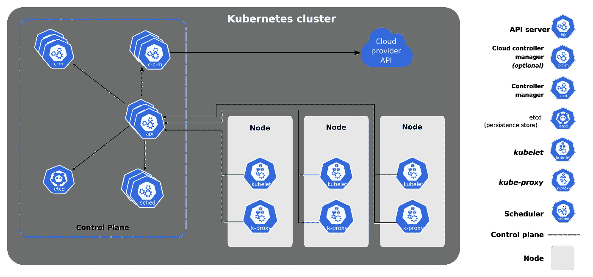
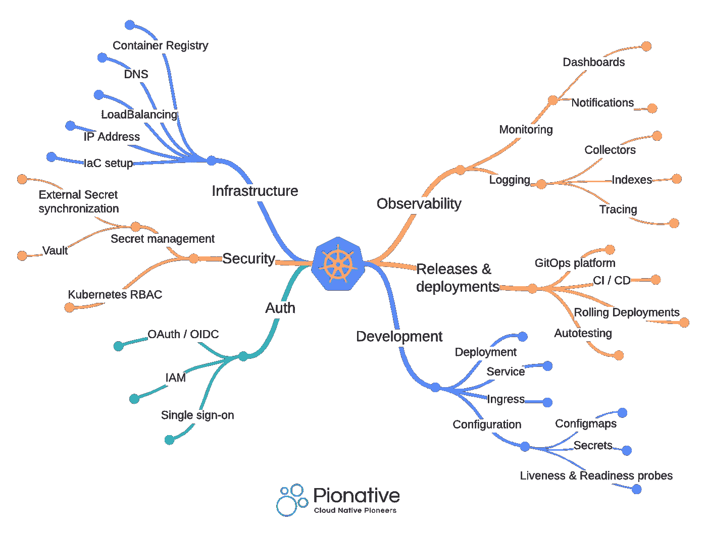
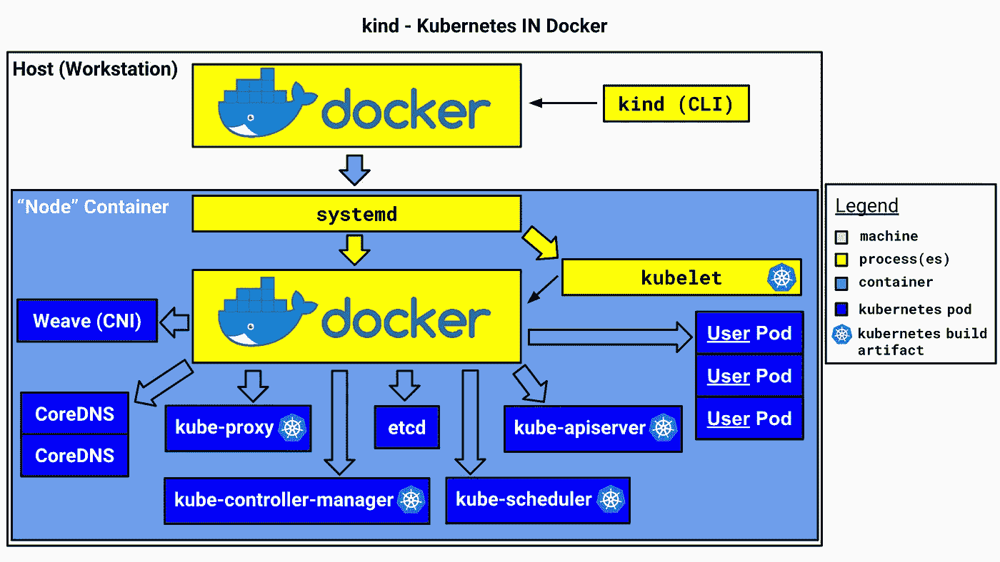
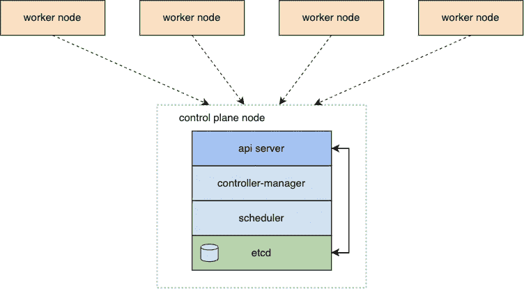
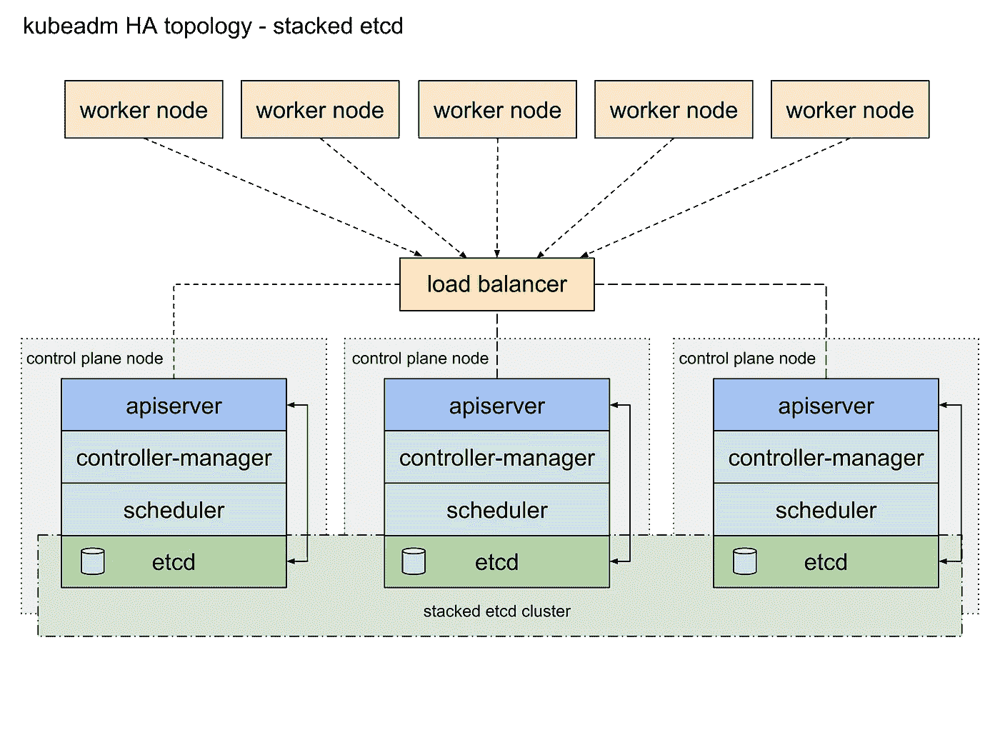
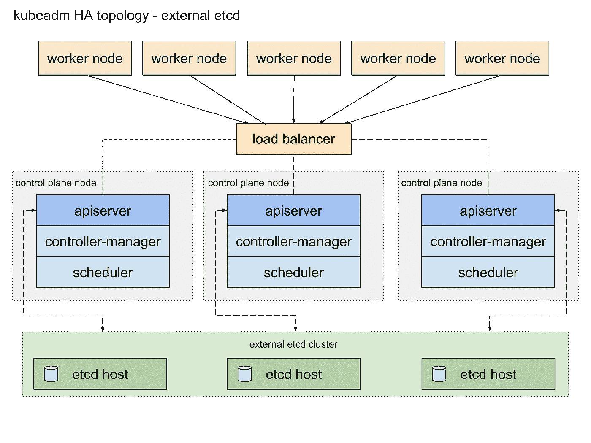

# Kubernetes — I:使用 terraform 和 terragrunt 的多节点部署

> 原文：<https://itnext.io/kubernetes-i-multi-node-deployment-using-terraform-and-terragrunt-30c40a1238e8?source=collection_archive---------1----------------------->

在为这篇文章收集想法和信息时，我意识到 Kubernetes 的世界有太多不为人知的东西。我决定不再只写一个帖子，而是写一个关于 Kubernetes 的多部分系列，以一种结构化的方式教育你们所有人关于我所知道的和将要知道的关于 Kubernetes 的一切。我花了一段时间整理我所有的知识和经验，同时写这个帖子，从一个普通的角度来解释 Kubernetes。一些博客系列，比如我虔诚关注的伊凡·维利奇科的博客系列，有助于建立对 Kubernetes 及其复杂性的基本理解。然而，除了[架构组件](https://kubernetes.io/docs/concepts/overview/components/)之外，对于组件如何在逻辑上相互叠加，比如 Kubernetes-API 的组件、定制资源定义、操作符、CNI 等等，普遍缺乏理解。我将在接下来的文章中写下这些概念。

Kubetnetes 的建筑构件。来源:kubernetes.io

 [## Kubernetes 组件

### Kubernetes 集群由作为控制平面一部分的组件和一组称为…

kubernetes.io](https://kubernetes.io/docs/concepts/overview/components/) 

在我之前的角色中，我有机会从零开始以各种规模部署 Kubernetes。这些角色和经历使我将 Kubernetes 集群发行版本质上分为两种基本类型:

*   用户管理的开源 Kubernetes 集群，如 [Rancher](https://www.rancher.com/) 、 [kind](https://kind.sigs.k8s.io/) 或 [OpenShift](https://www.redhat.com/en/technologies/cloud-computing/openshift) :这些 Kubernetes 集群通常作为开源和维护解决方案从其提供商处获得。用户可以在其底层基础设施上部署适合其用例的各种架构，或者依赖维护者提供的[托管服务](https://www.suse.com/products/suse-rancher-hosted/)。
*   云管理的 Kubernetes 集群，如 GKE、EKS 和 AKS:这些是由云提供商维护的 Kubernetes 的公开可用、易于设置的一键式部署变体。控制平面、其可扩展性和安全性的管理完全由云提供商负责，而数据平面的管理则由用户负责。

 [## Kubernetes -谷歌 Kubernetes 引擎(GKE) |谷歌云

### 发送反馈最自动化和可扩展的托管 Kubernetes 平台。新客户可获得 300 美元的免费积分，用于…

cloud.google.com](https://cloud.google.com/kubernetes-engine)  [## 托管 Kubernetes 服务-亚马逊 EKS -亚马逊网络服务

### 亚马逊弹性 Kubernetes 服务(EKS)利用与 AWS 服务的内置集成，如 EC2、VPC、IAM、EBS 和…

aws.amazon.com](https://aws.amazon.com/eks/)  [## 托管 Kubernetes 服务(AKS) | Microsoft Azure

### Azure Kubernetes 服务(AKS)是一种托管的 Kubernetes 服务，具有强化的安全性和快速交付。部署和…

azure.microsoft.com](https://azure.microsoft.com/en-us/products/kubernetes-service/#overview) 

这两种类型的集群发行版之间的主要区别在于，在用户管理的集群中，用户管理控制平面的安全性、冗余性和可扩展性，以及数据平面和两者之间的所有组件的安全性、冗余性和可扩展性。这与云管理的集群形成对比，在云管理的集群中，控制平面的可扩展性、冗余和安全性由云服务提供商管理，而用户管理数据平面的事务。有效地设置用户管理的集群是一项艰巨的任务，根据经验，需要花费大量的时间和精力来管理所有松散的部分。这些可以是以[的形式管理 Kubernetes 版本升级](https://kubernetes.io/docs/tasks/administer-cluster/kubeadm/kubeadm-upgrade/)、[正确配置底层虚拟机](https://docs.ranchermanager.rancher.io/how-to-guides/new-user-guides/kubernetes-clusters-in-rancher-setup/launch-kubernetes-with-rancher/use-new-nodes-in-an-infra-provider/vsphere/create-a-vm-template)、[安全地对正在运行的集群进行快照](https://docs.ranchermanager.rancher.io/how-to-guides/new-user-guides/backup-restore-and-disaster-recovery/back-up-rancher-launched-kubernetes-clusters)、[恢复 etcd 数据库](https://etcd.io/docs/v3.3/op-guide/recovery/)、[加密节点之间的通信](https://docs.ranchermanager.rancher.io/how-to-guides/new-user-guides/kubernetes-resources-setup/encrypt-http-communication)等等。然而，从零开始建立一个用户管理的 Kubernetes 集群是一个巨大的学习经历，这个过程教会了很多“耐心”和对所有管理的 Kubernetes 提供商的尊重。设置一个云管理的 Kubernetes 集群相当简单，只需要点击几下按钮就可以完成配置。然而，根据不同的用例，如何有效地设置您的托管集群来满足您的增长的可伸缩性和安全性可能有点棘手。

Kubernetes 和它的抽象的所有不同的角落！演职员表:[https://www.pionative.com/](https://www.pionative.com/)

Kubernetes 有不同的部署模式来满足用户的可伸缩性和冗余需求。这些是:

*   单实例部署:如[牧场主码头工人部署](https://docs.ranchermanager.rancher.io/pages-for-subheaders/rancher-on-a-single-node-with-docker)或[类](https://kind.sigs.k8s.io/)集群。在此部署中，Kubernetes 安装在 docker 之上，docker 安装在裸机或类似的计算实例上。它通常适用于学习、本地开发和调试场景，但由于可伸缩性和冗余性的限制，不建议用于生产用例。

演职员表:kind.sigs.k8s.io

*   多工作节点部署:在这个部署中，有多个工作节点或节点组与单个实例控制平面通信。工作节点从控制平面承担任务和其他责任，并可以根据需要进行缩放设置。但是，如果工作节点的数量快速增长，则可能会出现瓶颈和/或延迟问题，因为单个控制平面可能会受到限制或可能不可用。

Kubernetes 上的多节点部署。根据您的需求，工作节点的范围可以从 1 到 n。

*   多工作节点 HA 部署:HA 通常被称为高可用性部署。在这种部署中，多个冗余控制平面以仲裁方式运行，并且可能有也可能没有以 HA 集群格式并行运行的多个 [etcd 数据库](https://kubernetes.io/docs/concepts/overview/components/#etcd)实例。每个控制平面通常部署到不同的可用性区域，这种设置可确保在一个或多个可用性区域停机的情况下，一个实例保证可用性。这种设置对于运行相似或相关应用程序或工作负载的多节点组来说很常见。当您希望在 Kubernetes 上调度或捆绑特定的应用程序组及其资源时，这种配置非常有用，并且所有类型的 Kubernetes 集群都支持这种配置。我们将在这篇文章的后面对此进行更多的讨论。

采用多节点策略的高可用性集群。请注意各个 etcd 集群，[在彼此之间共享状态](https://learnk8s.io/etcd-kubernetes) credits: kubernetes.io

*   具有外部 etcd 节点和多工作节点部署的 HA 冗余控制平面部署:在这种模式下，您的 Kubernetes 集群将如虎添翼！这可能是 Kubernetes 集群中最冗余和高可用性的形式，它的所有重要工作组件都完全分布在自然界中。这也是在生产环境中运行 Kubernetes 的推荐方式。

鸣谢:kubernetes.io

 [## 高可用性拓扑的选项

### 本页解释了配置高可用性(HA) Kubernetes 集群拓扑的两个选项。你…

kubernetes.io](https://kubernetes.io/docs/setup/production-environment/tools/kubeadm/ha-topology/) 

我以前有机会部署 Kubernetes 的单实例 docker 部署，我们主要用于我们的开发环境，以及 Rancher 的高可用性 Kubernetes 集群和 EKS 和 AKS 集群的多节点部署。我发现，如果使用 IaC 以声明的方式定义资源，管理集群和向集群添加组件会容易得多。我曾经一起使用过 terraform 和 terragrunt，也曾经写过如何用它们来最好地构建你的项目。通过 terraform 和 terragrunt 部署多节点集群使得这个过程变得简单易懂。

 [## 使用 terragrunt 构建 terraform 项目—第一部分

### 这篇文章旨在提供一个关于如何构建你的 terraform 项目的观点，并用 terragrunt 对它进行配置…

itnext.io](/structuring-terraform-project-using-terragrunt-part-i-4c6e936c4858) 

讨论所有这些不同类型的部署模式的原因是为了理解我为什么选择写多节点部署。单节点部署非常适合实验或学习目的，但是没有什么实际价值，并且很少用于生产。随着越来越多的人从内部和自托管环境转向托管云服务，他们将受益于控制平面的开箱即用高可用性和冗余特性，您创建的任何新 Kubernetes 集群都可以随时使用这些特性。但是，数据平面仍然是用户的责任，了解扩展、隔离和分配工作负载的不同方式非常重要。

 [## Council Post:为什么迁移到云:基础知识、好处和现实生活中的例子

### 的首席执行官。Evgeniy 是软件开发、技术创业和新兴技术方面的专家…

www.forbes.com](https://www.forbes.com/sites/forbestechcouncil/2021/03/12/why-migrate-to-the-cloud-the-basics-benefits-and-real-life-examples/) 

在 Kubernetes 的世界里，理解[隔离](https://cloud.google.com/blog/products/gcp/exploring-container-security-isolation-at-different-layers-of-the-kubernetes-stack)的概念是很重要的。容器化应用程序是为您的应用程序和工作负载提供隔离环境的第一步。Kubernetes 通过在 pods 中运行这些容器来提供初始隔离层，pods 为在其中运行的应用程序容器提供隔离；包括[网络策略](https://kubernetes.io/docs/concepts/services-networking/network-policies/)资源(我以前写过关于此类[网络策略](/network-policies-in-kubernetes-c983c1b5eee9)的文章，鼓励你看看并尝试一下)。然后，相关的/相关的 pod 被弱隔离并封装在 Kubernetes 的名称空间中，这些名称空间限定了所有需要的资源(秘密、配置映射、角色、绑定、策略等)。)内部，这是 pod 成功运行所需要的。Kubernetes 中的[节点可以是运行 pods 的物理机或虚拟机，通常多个节点运行在一个 Kubernetes 集群中，由一个控制平面管理，该控制平面具有调度相关工作负载的特定策略。这可以通过在 Kubernetes worker 节点(或仅指托管集群中的 worker 节点)上调度这些应用程序来进一步补充，这些节点是为了托管类似的应用程序而特意创建的。节点通常构成 Kubernetes 集群的数据层，负责提供资源(CPU、内存、卷等。)和运行时(容器执行引擎，如](https://kubernetes.io/docs/concepts/architecture/nodes/) [containerd](https://containerd.io/) )到容器化的应用程序。该策略确保相关工作负载共享相同的计算资源，并驻留在相同的底层节点实例上。

Kubernetes 的隔离层。学分:cloud.google.com

您通常需要 Kubernetes 运行某些基础级别的应用程序包，这些应用程序包构成了应用程序有效运行的重要组成部分。这些应用程序通常是在 Kubernetes 软件包管理器的帮助下安装和配置的，比如到目前为止 Kubernetes 最著名和最常用的软件包管理器 [Helm](https://helm.sh/) 。通过舵图安装的这些应用程序的一些例子有[证书管理器](https://cert-manager.io/)、[入口-nginx](https://github.com/kubernetes/ingress-nginx) 、[链接器](https://linkerd.io/)等。这为您的 Kubernetes 集群添加了大量特性，并帮助您的应用程序实现其用例。然而，在 Kubernetes 看来，这些只是安排在它上面执行特定工作的吊舱。我们可以将这些应用程序简称为操作关键型应用程序或 OpsApps。它们需要与其他面向客户端的应用程序隔离开来，以便它们拥有自己的专用资源，并且不会被任何消耗大量资源的客户端应用程序所阻碍。该策略将工作节点组分为两个基本类别:

*   OpsApps(关键业务应用程序)节点
*   应用程序节点

我们将创建一个高度可用的 Kubernetes 集群，它将运行多个 worker 节点，每个节点都有自己的用途和要调度的应用程序组。这将提供资源隔离，并更好地管理基础设施上的应用程序。为了实现这一点，我通过 Anton Babenkov 的著名[模块创建了一个全新的 VPC，它允许我几乎立即配置 VPC、创建多 AZ 子网、配置网关和设置路由表。这节省了时间，并有助于建立一个可分解的环境。](https://registry.terraform.io/modules/terraform-aws-modules/vpc/aws/latest)

我希望我能感谢 Anton 提供的这段完美的代码，它为您节省了设置生产级 VPC 和子网的时间。

下一步是为 Kubernetes 设置 [IAM 角色](https://docs.aws.amazon.com/eks/latest/userguide/service_IAM_role.html)、 [IAM 策略](https://docs.aws.amazon.com/eks/latest/userguide/security-iam-awsmanpol.html)和[安全组](https://aws.github.io/aws-eks-best-practices/security/docs/)，以加强集群的安全性。我们需要创建这些不同的角色，因为它们负责管理集群的可伸缩性和安全性，并为它们分配相应的策略。

接下来，我们创建安全组和安全组规则，以限制对集群的访问。

最后也是最后一步；创建 Kubernetes 集群，创建节点，并将所有组件连接在一起。

创建集群后，我们使用 Kubernetes 提供的不同技术使 OpsApps pods 附加到特定节点，并排斥该节点组中的其他应用程序。这些是节点亲合性、污染和容忍以及节点选择器机制。我们使用这些应用程序的舵图来配置与不同节点相关联的标签和选择器，以将它们调度到适当的节点上。

*   NodeSelector: Node Selector 的工作方式非常类似于 Node Affinity，不同之处在于它直接匹配节点标签。
*   节点亲和性和反亲和性:节点亲和性和反亲和性允许您高度定制 pod 调度的规则和逻辑。它比 NodeSelector 更具表达性，允许在符合特定规则或约束的节点上调度 pod。
*   污染和容忍:*节点亲和性*是 Pods 的一个属性，它将 Pods 吸引到一组节点上(作为一种偏好或硬性要求)。*污点*则相反；它们允许一个节点排斥一组豆荚。容忍适用于 pod，并允许(但不要求)pod 调度到具有匹配污点的节点上。

 [## 将窗格分配给节点

### 您可以约束一个 Pod，使它被限制在特定的节点上运行，或者更喜欢在特定的节点上运行…

kubernetes.io](https://kubernetes.io/docs/concepts/scheduling-eviction/assign-pod-node/) 

我将很快贴出一个如何做到这一点的例子！

*PS。如果你觉得这有用，我真的很感激 github repo 上的一颗星，因为它允许我在未来创建更多相关的内容。*

 [## GitHub-aliabbasjaffri/multi node-terraform-terra grunt:多节点 terra form 代码库…

### 在 AWS 云上使用 terragrunt 的多节点 terraform 代码存储库我使用 terraform 和 terragrunt 是为了…

github.com](https://github.com/aliabbasjaffri/multinode-terraform-terragrunt)