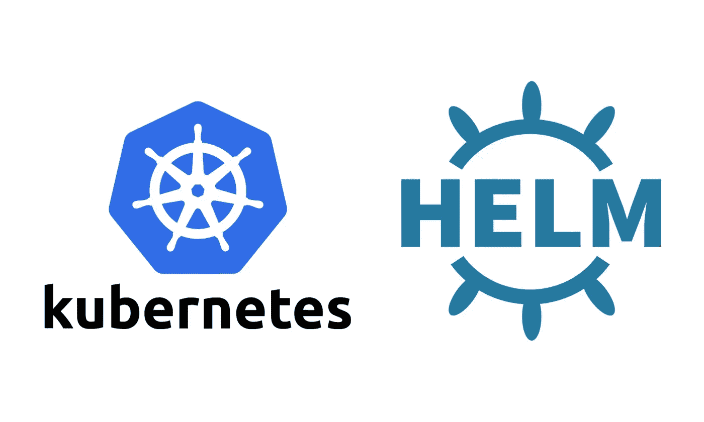
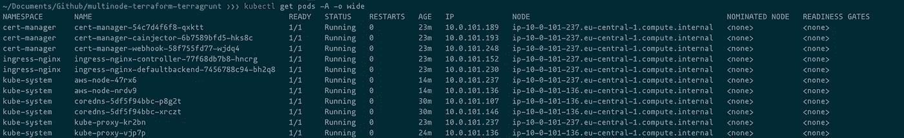
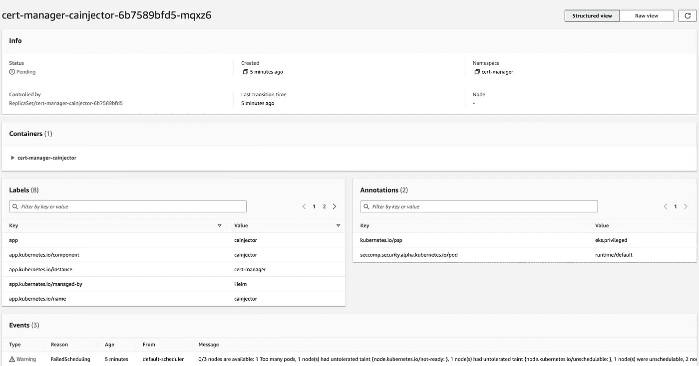
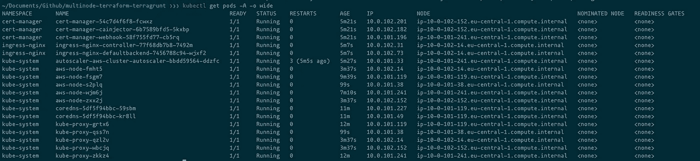
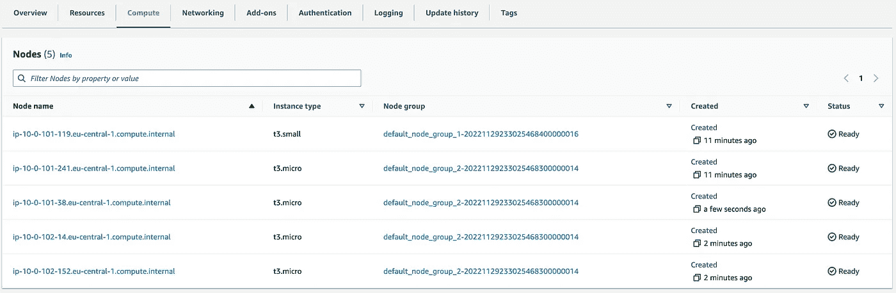

# Kubernetes — II:使用 terraform & terragrunt 在专用节点上部署应用程序

> 原文：<https://itnext.io/kubernetes-ii-deploying-applications-on-dedicated-nodes-using-terraform-terragrunt-9fef9ea96d8d?source=collection_archive---------0----------------------->



图片来源: [macstadium](https://www.macstadium.com/blog/how-to-k8s-getting-started-with-helm-charts)

在本系列的第一部分中，我们介绍了 Kubernetes 集群的不同架构模式，并使用 terraform & terragrunt 在 EKS 上创建了一个多节点 Kubernetes 集群。在第二部分中，我们将探索如何使用 terraform & terragrunt 在 Kubernetes 上确定性地部署应用程序生命周期管理的舵图。

[](/kubernetes-i-multi-node-deployment-using-terraform-and-terragrunt-30c40a1238e8) [## Kubernetes — I:使用 terraform 和 terragrunt 的多节点部署

### 本文讨论了 Kubernetes 的不同部署架构，以及如何使用…

itnext.io](/kubernetes-i-multi-node-deployment-using-terraform-and-terragrunt-30c40a1238e8) 

Operations applications，简称 OpsApps，是我们在 Kubernetes 上调度的包，用于为我们的应用程序运行建立基础。这些软件包增强了应用程序的功能，并允许用户充分利用提供给他们的服务。这样的包被安装在 Kubernetes 上，使用一个流行的和广泛使用的包管理器，称为 Helm，这些包被称为 Helm Charts(Helm 上的包以一种特殊的格式打包，称为 *charts* ，一个 Kubernetes 资源的集合)。

[](https://helm.sh/) [## 舵

### Helm 是查找、共享和使用为 Kubernetes 构建的软件的最佳方式。Helm 帮助您管理 Kubernetes…

helm.sh](https://helm.sh/) 

Helm 使得在 Kubernetes 上部署应用程序包变得很容易。您可以为任何应用程序创建 helm 部署；可以把它看作是部署在 Kubernetes 上的应用程序打包工具。这些包通常带有一个庞大的配置列表，通常采用名为 values.yaml 的 yaml 文件的形式。该文件为您的 OpsApps 提供了一个确定性的部署环境，因为该文件在其配置被应用后被签入 git。在这篇文章的最后，我们将会看到如何使用 terraform 自动部署舵图。

Helm charts 为运行在 Kubernetes 上的面向微服务的架构提供了坚实、高效的功能结构基础。这些图表中最值得注意的是`ingress-nginx`、`hashicorp vault`、`cert-manager`、`rabbitmq`和`linkerd`等等。每个图表都专注于其特定的功能，并允许应用程序开发人员专注于开发其应用程序的业务逻辑，而不是创建大规模运行的支持基础架构。

让我们来理解一下 [ingress-nginx](https://kubernetes.github.io/ingress-nginx) 图表的例子。Kubernetes 中的控制器至少跟踪一种资源类型，并确保[使集群更接近期望的状态](https://kubernetes.io/docs/concepts/architecture/controller)。一个[入口控制器](https://kubernetes.io/docs/concepts/services-networking/ingress/)，比如 ingress-nginx，从 Kubernetes 集群外部公开 http 和 https 路由，并充当集群内请求数据的服务的负载平衡器。使用这个掌舵图，开发人员可以利用服务的负载管理、公共端点的 TLS/SSL 终止以及有限的缓存服务，而不必自己设置所有这些服务。

 [## 欢迎- NGINX 入口控制器

### 这是入口 NGINX 控制器的文档。它是围绕 Kubernetes 入口资源构建的，使用了…

kubernetes.github.io](https://kubernetes.github.io/ingress-nginx/) [](https://kubernetes.io/docs/concepts/architecture/controller/) [## 控制器

### 在机器人和自动化中，控制回路是调节系统状态的非终止回路。这里有一个…

kubernetes.io](https://kubernetes.io/docs/concepts/architecture/controller/) 

可以使用 cli 工具在 Kubernetes 集群上配置 Helm chart，该工具指向`.kubeconfig`文件夹的`kubeconfig`中的[当前上下文](https://kubernetes.io/docs/tasks/access-application-cluster/configure-access-multiple-clusters/)。这是最易于使用的方法，但对于在多个集群或生产集群上应用更改，这可能并不完美。维护人员需要跟踪进入他们的 Kubernetes 集群的不同舵图的配置，以及比较他们想要引入系统的任何新变化。这就是 terraform & terragrunt 出现的原因。在 Hashicorp 的 [Helm provider 的帮助下，用户可以对其集群进行确定性的、可重复的更改。唯一的要求是下载舵图表的值文件，以正确配置和应用图表。这将解决问题的前半部分；在 Kubernetes 集群上安装 OpsApps，但是我们仍然需要弄清楚如何在专用于这些 OpsApps 的节点组上调度这些应用程序。这是因为这些是操作关键型应用程序，需要专门访问资源，如 CPU、RAM、磁盘空间等。](https://registry.terraform.io/providers/hashicorp/helm/latest/docs)

 [## 地形注册表

### 编辑描述

registry.terraform.io](https://registry.terraform.io/providers/hashicorp/helm/latest/docs) 

不同 Kubernetes 节点组上应用程序执行的这种分离是由内置工具管理的，如 NodeSelector、Taints & Tolerations 和 Node Affinity & Anti-Affinity 机制。这些技术使 OpsApps 应用程序单元连接到特定的节点，并排斥该节点组中的其他应用程序。这是通过创建标签并将它们附加到节点和应用程序上来实现的，这些标签帮助 Kubernetes 识别哪些应用程序将被调度到哪些节点上。让我们简单看看这些机制是如何让 Kubernetes 实现这一点的。

*   NodeSelector: Node Selector 的工作方式非常类似于 Node Affinity，不同之处在于它直接匹配在节点创建期间定义的节点标签。
*   节点亲和性和反亲和性:节点亲和性和反亲和性允许您高度定制 pod 调度的规则和逻辑。它比 NodeSelector 更具表达性，允许在符合特定规则或约束的节点上调度 pod。
*   污染和容忍:*节点亲和性*是 Pods 的一个属性，它将 Pods 吸引到一组节点上(作为一种偏好或硬性要求)。*污点*则相反；这是节点的属性，允许一个节点击退一组豆荚。容忍适用于 pod，并允许(但不要求)pod 调度到具有匹配污点的节点上。

[](https://kubernetes.io/docs/concepts/scheduling-eviction/assign-pod-node/) [## 将窗格分配给节点

### 您可以约束一个 Pod，使它被限制在特定的节点上运行，或者更喜欢在特定的节点上运行…

kubernetes.io](https://kubernetes.io/docs/concepts/scheduling-eviction/assign-pod-node/) 

从我在 Kubernetes 系列的第一篇文章上离开的地方继续，我将向 Kubernetes 集群添加三个舵图，并在各自的 OpsApps 节点组上调度它们。我采取了另一种策略，通过利用 terraform 中模块的力量，重构了代码，使其简洁、易于理解。为了创建 eks 集群、节点组和 eks 的 IRSA，我使用了来自 [Anton Babenko](https://github.com/antonbabenko) 的 terragrunt-aws-eks 模块。IRSA，即服务帐户的 IAM 角色，是 AWS 的一项功能，它允许您通过组合 [OpenID Connect](https://openid.net/connect/) (OIDC)身份提供者和 Kubernetes 服务帐户注释，在 pod 级别使用 IAM 角色。

[](https://docs.aws.amazon.com/eks/latest/userguide/iam-roles-for-service-accounts.html) [## 服务帐户的 IAM 角色

### 了解 pods 中的应用程序如何访问 AWS 服务。

docs.aws.amazon.com](https://docs.aws.amazon.com/eks/latest/userguide/iam-roles-for-service-accounts.html) [](https://github.com/terraform-aws-modules/terraform-aws-eks) [## GitHub-terra form-AWS-modules/terra form-AWS-eks:terra form 模块创建弹性 Kubernetes…

### 创建 AWS EKS (Kubernetes)资源的 Terraform 模块请注意，我们努力提供全面的…

github.com](https://github.com/terraform-aws-modules/terraform-aws-eks) 

让我们从使用这个模块创建一个 eks 集群开始。

```
################################################################################
# Supporting Resources
################################################################################

resource "aws_kms_key" "eks" {
  description             = var.aws_kms_key.description
  deletion_window_in_days = var.aws_kms_key.deletion_window_in_days
  enable_key_rotation     = var.aws_kms_key.enable_key_rotation
  tags                    = var.aws_kms_key.tags
}

resource "aws_security_group" "additional_security_group" {
  name_prefix = var.aws_security_group.name_prefix
  vpc_id      = var.aws_security_group.vpc_id

  dynamic "ingress" {
    for_each = var.aws_security_group.ingresses
    content {
      from_port   = ingress.value.from_port
      to_port     = ingress.value.to_port
      protocol    = ingress.value.protocol
      cidr_blocks = ingress.value.cidr_blocks
    }
  }
  tags = var.aws_security_group.tags
}

################################################################################
# Supporting Resources
################################################################################

################################################################################
# EKS Module
################################################################################

module "eks" {
  source  = "terraform-aws-modules/eks/aws"
  version = "18.30.3"

  cluster_name                    = var.aws_eks_cluster.cluster_name
  cluster_version                 = var.aws_eks_cluster.cluster_version
  cluster_endpoint_private_access = var.aws_eks_cluster.cluster_endpoint_private_access
  cluster_endpoint_public_access  = var.aws_eks_cluster.cluster_endpoint_public_access

  cluster_addons = {
    coredns = {
      resolve_conflicts = "OVERWRITE"
    }
    kube-proxy = {}
    # vpc-cni = {
    #   resolve_conflicts        = "OVERWRITE"
    #   service_account_role_arn = module.vpc_cni_irsa.iam_role_arn
    # }
  }

  cluster_encryption_config = [{
    provider_key_arn = aws_kms_key.eks.arn
    resources        = ["secrets"]
  }]

  vpc_id     = var.aws_eks_cluster.vpc_id
  subnet_ids = var.aws_eks_cluster.subnets

  # Extend cluster security group rules
  cluster_security_group_additional_rules = var.aws_eks_cluster.cluster_security_group_additional_rules

  # Extend node-to-node security group rules
  node_security_group_additional_rules = var.aws_eks_cluster.node_security_group_additional_rules

  # eks_managed_node_group_defaults = {
  #   iam_role_attach_cni_policy = true
  # }

  eks_managed_node_groups = var.aws_eks_cluster.eks_managed_node_groups

  tags = var.aws_eks_cluster.tags
}

################################################################################
# EKS Module
################################################################################

module "vpc_cni_irsa" {
  source  = "terraform-aws-modules/iam/aws//modules/iam-role-for-service-accounts-eks"
  version = "~> 4.12"

  role_name_prefix      = var.vpc_cni_irsa.role_name_prefix
  attach_vpc_cni_policy = var.vpc_cni_irsa.attach_vpc_cni_policy
  vpc_cni_enable_ipv4   = var.vpc_cni_irsa.vpc_cni_enable_ipv4

  oidc_providers = {
    main = {
      provider_arn               = module.eks.oidc_provider_arn
      namespace_service_accounts = ["kube-system:aws-node"]
    }
  }

  tags = var.aws_eks_cluster.tags
}
```

这些设备各自的地形地貌配置如下。注意`eks_managed_node_groups`块中的标签和污点。

```
inputs = {
  aws_kms_key = {
    description             = "EKS Secret Encryption Key"
    deletion_window_in_days = 7
    enable_key_rotation     = true
    tags                    = local.tags
  }

  aws_security_group = {
    name_prefix = "eks-cluster-additional-sg"
    vpc_id      = dependency.vpc.outputs.vpc_id
    ingresses = [{
      from_port = 22
      to_port   = 22
      protocol  = "tcp"
      cidr_blocks = [
        "10.0.0.0/8",
        "172.16.0.0/12",
        "192.168.0.0/16",
      ]
    }]
    tags = local.tags
  }

  aws_eks_cluster = {
    cluster_name                    = "eks-cluster"
    cluster_version                 = "1.24"
    cluster_endpoint_private_access = true
    cluster_endpoint_public_access  = true
    vpc_id                          = dependency.vpc.outputs.vpc_id
    subnets                         = dependency.vpc.outputs.vpc_public_subnets_ids
    cluster_security_group_additional_rules = {
      egress_nodes_ephemeral_ports_tcp = {
        description                = "To node 1025-65535"
        protocol                   = "tcp"
        from_port                  = 1025
        to_port                    = 65535
        type                       = "egress"
        source_node_security_group = true
      }
    }
    node_security_group_additional_rules = {
      ingress_self_all = {
        description = "Node to node all ports/protocols"
        protocol    = "-1"
        from_port   = 0
        to_port     = 0
        type        = "ingress"
        self        = true
      }
      egress_all = {
        description      = "Node all egress"
        protocol         = "-1"
        from_port        = 0
        to_port          = 0
        type             = "egress"
        cidr_blocks      = ["0.0.0.0/0"]
        ipv6_cidr_blocks = ["::/0"]
      }
    }
    eks_managed_node_groups = {
      default_node_group_1 = {
        create_launch_template = false
        launch_template_name   = ""

        disk_size = 50

        min_size     = 1
        max_size     = 7
        desired_size = 1

        capacity_type        = "SPOT"
        force_update_version = true
        instance_types       = ["t3.small"]
        taints               = []
      }
      default_node_group_2 = {
        create_launch_template = false
        launch_template_name   = ""

        disk_size = 50

        min_size     = 1
        max_size     = 7
        desired_size = 1

        capacity_type        = "SPOT"
        force_update_version = true
        instance_types       = ["t3.small"]

        labels = {
          NodeTypeClass = "appops"
        }

        taints = [{
          key    = "dedicated"
          value  = "appops"
          effect = "NO_SCHEDULE"
          }
        ]
      }
    }
    tags = local.tags
  }
  vpc_cni_irsa = {
    role_name_prefix      = "VPC-CNI-IRSA"
    attach_vpc_cni_policy = true
    vpc_cni_enable_ipv4   = true
    tags                  = local.tags
  }
}
```

为舵释放创建一个模块，因为它将被多次重复使用

```
resource "helm_release" "helm_chart" {
  name             = var.helm_chart.name
  namespace        = var.helm_chart.namespace
  create_namespace = var.helm_chart.create_namespace
  repository       = var.helm_chart.repository
  chart            = var.helm_chart.chart
  version          = var.helm_chart.chart_version
  cleanup_on_fail  = true
  values           = [var.helm_chart.values]

  dynamic "set" {
    for_each = var.helm_chart.set
    content {
      name  = set.value.name
      value = set.value.value
      type  = set.value.type
    }
  }
}
```

在 Helm charts 的 values.yaml 中的 NodeSelector 中添加标签，并相应地设置节点关联。我一直想在 set function 中添加复杂的层次类型，但是在 terragrunt 非常有限的支持下，这似乎是一个不可能的任务。我决定更好地直接更新这个任务的值文件。

```
# Note the labels and taints in the eks_managed_node_groups block
labels = {
  NodeTypeClass = "appops"
}

taints = [{
  key    = "dedicated"
  value  = "appops"
  effect = "NO_SCHEDULE"
  }
]
```

由于我们配置的节点标签和污点，我们的舵图将具有以下配置:

```
# node selector
nodeSelector:
  kubernetes.io/os: linux
  NodeTypeClass: appops

## 
# tolerations
tolerations:
  - key: "dedicated"
    operator: "Equal"
    value: "appops"
    effect: "NoSchedule"

##
# node affinity
affinity:
  nodeAffinity:
    requiredDuringSchedulingIgnoredDuringExecution:
      nodeSelectorTerms:
        - matchExpressions:
            - key: NodeTypeClass
              operator: In
              values:
                - appops
```

使用 terragrunt 最好的一点是，你可以在根目录下执行`terragrunt run-all apply`,然后去喝咖啡，等你回来的时候，所有的基础设施都已经部署好了。



尤里卡，所有的豆荚都是健康的！注意所有的 opsapps、ingress-nginx 和 cert-manager 是如何在同一个节点上调度的。

我可以看到我的`OpsApps`pod 在各自的节点上被调度。但是我真的很想看到自动缩放的效果，所以我将节点的实例类型从`t3.small`设置为`t3.micro`。当我使用该配置再次创建集群时，我可以看到创建了节点，但是 pod 遇到了以下错误



计划失败— 5 分钟—默认计划程序 0/3 个节点可用:1 个单元太多，1 个节点有不可容忍的污点{ node . kubernetes . io/not-ready:}，1 个节点有不可容忍的污点{ node . kubernetes . io/unschedulable:}，1 个节点不可计划，2 个节点与单元的节点关联/选择器不匹配。抢占:0/3 个节点可用:1 未找到传入 pod 的抢占受害者，2 抢占对计划没有帮助。

我遵循了书中的所有技巧，但看起来我肯定错过了一些东西，因为我的节点没有像预期的那样自动缩放。就在那时，我发现我设法只创建了节点组，但需要从群集内部向控制平面发出信号，表明容量需求不匹配，需要更多资源来满足这一需求。我们已经创建了`Autoscaling Group`作为集群创建的一部分，我们只需要安装一个自动调整集群大小的组件；这个组件是[集群自动缩放器](https://github.com/kubernetes/autoscaler)。伟大的一部分是，它可以作为一个舵图表，我只需要使用相同的舵释放组件，我已经创建了。

[](https://aws.github.io/aws-eks-best-practices/cluster-autoscaling/) [## 集群-自动缩放- EKS 最佳实践指南

### Kubernetes 集群自动缩放器是一个流行的集群自动缩放解决方案，由 SIG 自动缩放维护。这是…

aws.github.io](https://aws.github.io/aws-eks-best-practices/cluster-autoscaling/)  [## 自动缩放

### 自动缩放是一种自动缩放资源以满足不断变化的需求的功能。这是一个主要的…

docs.aws.amazon.com](https://docs.aws.amazon.com/eks/latest/userguide/autoscaling.html) 

一旦完成，让我们应用这些变化，看看我们的掌舵图表是否在我们各自的节点上被安排。



这次更多的节点。它显示我们的节点确实是由 t3.micro 类型的实例创建的



EKS 集群的潜行峰值验证了这一点。

*PS。如果你觉得这篇文章有用的话，我真的很感激在 github repo 上打一颗星并分享这篇文章，因为它允许我在未来创建更多相关的内容。*

[](https://github.com/aliabbasjaffri/multinode-terraform-terragrunt) [## GitHub-aliabbasjaffri/multi node-terraform-terra grunt:多节点 terra form 代码库…

### 在 AWS 云上使用 terragrunt 的多节点 terraform 代码存储库我使用 terraform 和 terragrunt 是为了…

github.com](https://github.com/aliabbasjaffri/multinode-terraform-terragrunt)