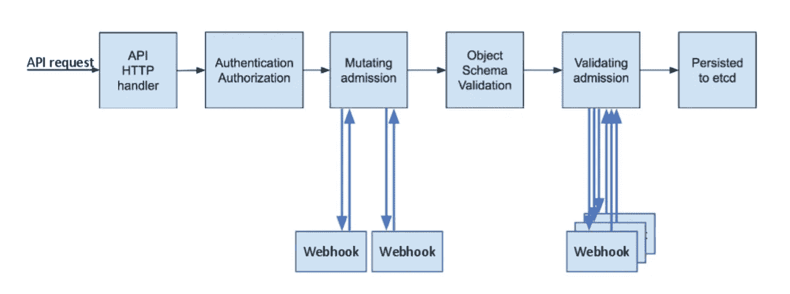

# Kubernetes 图像政策 webhook 解释

> 原文：<https://itnext.io/kubernetes-image-policy-webhook-explained-ac1063d3ea97?source=collection_archive---------3----------------------->



这张图片来自 k8s 文档

## 介绍

在本文中，我们将探索 webhook 在 kubernetes 中的工作方式，更具体地说，是关于 ImagePolicyWebhook，kubernetes 的文档对它的描述有点模糊，因为没有真实的例子或实现，所以这里我们将把它分解成不同的替代方案，在现实世界的场景中，我更喜欢依靠 [OPA Gatekeeper](https://github.com/open-policy-agent/gatekeeper) ， 我计划通过添加一个数据库，让 webhook 允许或不允许基于漏洞扫描的图像，例如只允许容器中的中等或较低的漏洞，这将是另一天的帖子，如果你有兴趣，你可以在这个 [repo](https://github.com/kainlite/kube-image-bouncer) 、[查看更多](https://techsquad.rocks/blog/kubernetes_image_policy_webhook_explained/#closing-words)中提供帮助。

有两种方法来实现这一点，每一种都有稍微不同的行为，一种方法是使用 [ImagePolicyWebhook](https://kubernetes.io/docs/reference/access-authn-authz/admission-controllers/#imagepolicywebhook) ，另一种方法是使用[准入控制器](https://kubernetes.io/docs/reference/access-authn-authz/admission-controllers/)或者工作验证或者变异，这里我使用了验证 Webhook，你可以了解更多[这里](https://kubernetes.io/docs/reference/access-authn-authz/extensible-admission-controllers/)。

该准入控制器将拒绝所有使用带有`latest`标签的图像的 pod，并且在将来我们将会看到是否所有的 pod 都不能满足所需的安全级别。

## 比较

[ImagePolicyWebhook](https://kubernetes.io/docs/admin/admission-controllers/#imagepolicywebhook) 是一个仅评估映像的准入控制器，您需要解析请求、逻辑和响应，以便允许或拒绝群集中的映像。

`ImagePolicyWebhook`的好处:

*   如果 webhook 端点不可达，可以指示 API 服务器拒绝图像，这非常方便，但也可能带来问题，例如核心 pods 将无法调度。

`ImagePolicyWebhook`不好的地方:

*   配置有点复杂，需要访问主节点或 apiserver 配置，文档不清楚，很难进行更改、更新等。
*   部署并不简单，因为您需要用 systemd 部署它，或者在主机中将它作为 docker 容器运行，更新 dns 等等。

另一方面,[validatingadmissionweb hook](https://kubernetes.io/docs/reference/access-authn-authz/extensible-admission-controllers)可以用于更多的东西，而不仅仅是图像(如果你使用变异的，那么，你可以动态地注入或改变东西)。

`ValidatingAdmissionWebhook`的精彩之处:

*   更容易部署，因为该服务作为一个单元运行。
*   一切都可以成为 kubernetes 的资源。
*   不需要更少的人工干预和对主设备的访问。
*   如果 pod 或服务不可用，那么所有图像都将被允许，这在某些情况下可能是一个安全风险，因此如果您走这条路，请确保它高度可用，这实际上可以通过指定`failurePolicy`到`Fail`而不是`Ignore`来配置(默认为`Fail`)。

`ValidatingAdmissionWebhook`不好的地方:

*   任何拥有足够 RBAC 权限的人都可以更新/更改配置，因为这只是另一个 kubernetes 资源。

## 建筑物

如果您打算将其用作普通服务:

```
$ go get github.com/kainlite/kube-image-bouncer
```

您也可以使用此 [Docker 图像](https://hub.docker.com/r/kainlite/kube-image-bouncer/):

```
$ docker pull kainlite/kube-image-bouncer
```

## 证书

我们可以依靠 kubernetes CA 来生成我们需要的证书。如果您想了解更多信息，请点击此处:

创建企业社会责任:

```
$ cat <<EOF | cfssl genkey - | cfssljson -bare server
{
  "hosts": [
    "image-bouncer-webhook.default.svc",
    "image-bouncer-webhook.default.svc.cluster.local",
    "image-bouncer-webhook.default.pod.cluster.local",
    "192.0.2.24",
    "10.0.34.2"
  ],
  "CN": "system:node:image-bouncer-webhook.default.pod.cluster.local",
  "key": {
    "algo": "ecdsa",
    "size": 256
  },
  "names": [
    {
      "O": "system:nodes"
    }
  ]
}
EOF
```

然后将其应用到集群

```
$ cat <<EOF | kubectl apply -f -
apiVersion: certificates.k8s.io/v1
kind: CertificateSigningRequest
metadata:
  name: image-bouncer-webhook.default
spec:
  request: $(cat server.csr | base64 | tr -d '\n')
  signerName: kubernetes.io/kubelet-serving
  usages:
  - digital signature
  - key encipherment
  - server auth
EOF
```

批准并获取您的证书以备后用

```
$ kubectl get csr image-bouncer-webhook.default -o jsonpath='{.status.certificate}' | base64 --decode > server.crt
```

## ImagePolicyWebhook 路径

有两种可能的方法来部署这个控制器(webhook ),为此，您需要创建证书，如下所述，但首先我们需要注意其他细节，将其添加到主服务器或 bouncer 将运行的主机文件中:

我们使用这个名称是因为它必须与证书中的名称相匹配，因为它将在 kuberntes 之外运行，甚至可能是外部可用的，我们只是用一个 hosts 条目来伪装它

```
$ echo "127.0.0.1 image-bouncer-webhook.default.svc" >> /etc/hosts
```

同样，在 apiserver 中，您需要用这些设置更新它:

```
--admission-control-config-file=/etc/kubernetes/kube-image-bouncer/admission_configuration.json --enable-admission-plugins=ImagePolicyWebhook
```

如果使用这种方法，您不需要创建`validating-webhook-configuration.yaml`资源，也不需要应用 kubernetes 部署来在集群中运行。

创建一个名为`/etc/kubernetes/kube-image-bouncer/admission_configuration.json`文件的接纳控制配置文件，内容如下:

```
{
  "imagePolicy": {
     "kubeConfigFile": "/etc/kubernetes/kube-image-bouncer/kube-image-bouncer.yml",
     "allowTTL": 50,
     "denyTTL": 50,
     "retryBackoff": 500,
     "defaultAllow": false
  }
}
```

如果您想要默认允许图像，请调整默认值。

用以下内容创建一个 kubeconfig 文件`/etc/kubernetes/kube-image-bouncer/kube-image-bouncer.yml`:

```
apiVersion: v1
kind: Config
clusters:
- cluster:
    certificate-authority: /etc/kubernetes/kube-image-bouncer/pki/server.crt
    server: [https://image-bouncer-webhook.default.svc:1323/image_policy](https://image-bouncer-webhook.default.svc:1323/image_policy)
  name: bouncer_webhook
contexts:
- context:
    cluster: bouncer_webhook
    user: api-server
  name: bouncer_validator
current-context: bouncer_validator
preferences: {}
users:
- name: api-server
  user:
    client-certificate: /etc/kubernetes/pki/apiserver.crt
    client-key:  /etc/kubernetes/pki/apiserver.key
```

这个配置文件指示 API 服务器到达位于`https://image-bouncer-webhook.default.svc:1323`的 webhook 服务器并使用它的`/image_policy`端点，我们正在重用来自 API server 的证书和我们已经生成的用于 kube-image-bouncer 的证书。

请注意，您需要与证书一起放在文件夹中，这样才能工作:

```
$ docker run --rm -v `pwd`/server-key.pem:/certs/server-key.pem:ro \
-v `pwd`/server.crt:/certs/server.crt:ro -p 1323:1323 \
--network hostkainlite/kube-image-bouncer \
-k /certs/server-key.pem -c /certs/server.crt
```

## 验证 gAdmissionWebhook 路径

如果你走这条路，你需要做的就是生成证书，其他的事情都可以用 kubectl 来做，首先你必须创建一个 tls secret 来保存 webhook 证书和密钥(我们刚刚在上一步中生成了它):

```
$ kubectl create secret tls tls-image-bouncer-webhook \ 
--key server-key.pem \ 
--cert server.pem
```

然后为`image-bouncer-webhook`创建一个 kubernetes 部署:

```
$ kubectl apply -f kubernetes/image-bouncer-webhook.yaml
```

最后，创建利用我们的 webhook 端点的`ValidatingWebhookConfiguration`,您可以使用它，但是一定要用 base64:

```
$ kubectl apply -f kubernetes/validating-webhook-configuration.yaml
```

或者，您可以像这样简单地生成`validating-webhook-configuration.yaml`文件，并一次性应用它:

```
$ cat <<EOF | kubectl apply -f -
apiVersion: admissionregistration.k8s.io/v1
kind: ValidatingWebhookConfiguration
metadata:
  name: image-bouncer-webook
webhooks:
  - name: image-bouncer-webhook.default.svc
    rules:
      - apiGroups:
          - ""
        apiVersions:
          - v1
        operations:
          - CREATE
        resources:
          - pods
    failurePolicy: Ignore
    sideEffects: None
    admissionReviewVersions: ["v1", "v1beta1"]
    clientConfig:
      caBundle: $(kubectl get csr image-bouncer-webhook.default -o jsonpath='{.status.certificate}')
      service:
        name: image-bouncer-webhook
        namespace: default
EOF
```

这可以很容易地自动化(舵图表即将推出&mldr;)，变化可能需要一点时间来反映，所以等待几秒钟，并尝试一下。

## 测试

两条路径的工作方式应该相同，您将会看到类似的错误消息，例如:

```
Error creating: pods "nginx-latest-sdsmb" is forbidden: image policy webhook backend denied one or more images: Images using latest tag are not allowed
```

或者

```
Warning FailedCreate 23s (x15 over 43s) replication-controller Error creating: admission webhook "image-bouncer-webhook.default.svc" denied the request: Images using latest tag are not allowed
```

创建一个 nginx 版本化的 RC 来验证版本化的版本仍然工作:

```
$ cat <<EOF | kubectl apply -f -
apiVersion: v1
kind: ReplicationController
metadata:
  name: nginx-versioned
spec:
  replicas: 1
  selector:
    app: nginx-versioned
  template:
    metadata:
      name: nginx-versioned
      labels:
        app: nginx-versioned
    spec:
      containers:
      - name: nginx-versioned
        image: nginx:1.13.8
        ports:
        - containerPort: 80
EOF
```

确保/检查复制控制器确实在运行:

```
$ kubectl get rc
NAME              DESIRED   CURRENT   READY     AGE
nginx-versioned   1         1         0         2h
```

现在为 nginx-latest 创建一个，以验证我们的控制器/webhook 实际上可以拒绝包含使用最新标签的图像的 pod:

```
$ cat <<EOF | kubectl apply -f -
apiVersion: v1
kind: ReplicationController
metadata:
  name: nginx-latest
spec:
  replicas: 1
  selector:
    app: nginx-latest
  template:
    metadata:
      name: nginx-latest
      labels:
        app: nginx-latest
    spec:
      containers:
      - name: nginx-latest
        image: nginx
        ports:
        - containerPort: 80
EOF
```

如果我们检查 pod，它不应被创建，RC 应显示类似于以下输出的内容，您也可以使用`kubectl get events --sort-by='{.lastTimestamp}'`进行检查:

```
$ kubectl describe rc nginx-latest
Name:         nginx-latest
Namespace:    default
Selector:     app=nginx-latest
Labels:       app=nginx-latest
Annotations:  <none>
Replicas:     0 current / 1 desired
Pods Status:  0 Running / 0 Waiting / 0 Succeeded / 0 Failed
Pod Template:
  Labels:  app=nginx-latest
  Containers:
   nginx-latest:
    Image:        nginx
    Port:         80/TCP
    Host Port:    0/TCP
    Environment:  <none>
    Mounts:       <none>
  Volumes:        <none>
Conditions:
  Type             Status  Reason
  ----             ------  ------
  ReplicaFailure   True    FailedCreate
Events:
  Type     Reason        Age                 From                    Message
  ----     ------        ----                ----                    -------
  Warning  FailedCreate  23s (x15 over 43s)  replication-controller  Error creating: admission webhook "image-bouncer-webhook.default.svc" denied the request: Images using latest tag are not allowed
```

## 排除故障

如果您正在使用准入控制器路径，查看 apiserver 日志总是有用的，因为它将在那里记录失败的原因，以及来自 image-bouncer 的日志，例如:apiserver

```
W0107 17:39:00.619560       1 dispatcher.go:142] rejected by webhook "image-bouncer-webhook.default.svc": &errors.StatusError{ErrStatus:v1.Status{TypeMeta:v1.TypeMeta{Kind:"", APIVersion:""}, ListMeta:v1.ListMeta{ SelfLink:"", ResourceVersion:"", Continue:"", RemainingItemCount:(*int64)(nil)}, Status:"Failure", Message:"admission webhook \"image-bouncer-webhook.default.svc\" denied the request: Images using latest tag are not allowed", Reason:"", Details:(*v1.StatusDetails)(nil), Code:400}}
```

kube-image-bouncer

```
echo: http: TLS handshake error from 127.0.0.1:49414: remote error: tls: bad certificate
method=POST, uri=/image_policy?timeout=30s, status=200
method=POST, uri=/image_policy?timeout=30s, status=200
method=POST, uri=/image_policy?timeout=30s, status=200
```

错误来自手动测试，其他是来自 apiserver 的成功请求。

## 代码本身

让我们简单看一下创建准入控制器或 webhook 的关键部分:

这是`main.go`的一部分，正如我们可以看到的，我们正在用不同的方法处理两个`POST`路径，以及一些其他验证，我们需要知道的是，我们将收到一个带有 JSON 有效负载的 POST 方法调用，并且我们需要转换成一个准入控制器审查请求。

```
app.Action = func(c *cli.Context) error {
        e := echo.New()
        e.POST("/image_policy", handlers.PostImagePolicy())
        e.POST("/", handlers.PostValidatingAdmission())e.Use(middleware.LoggerWithConfig(middleware.LoggerConfig{
            Format: "method=${method}, uri=${uri}, status=${status}\n",
        }))if debug {
            e.Logger.SetLevel(log.DEBUG)
        }if whitelist != "" {
            handlers.RegistryWhitelist = strings.Split(whitelist, ",")
            fmt.Printf(
                "Accepting only images from these registries: %+v\n",
                handlers.RegistryWhitelist)
            fmt.Println("WARN: this feature is implemented only by the ValidatingAdmissionWebhook code")
        } else {
            fmt.Println("WARN: accepting images from ALL registries")
        }var err error
        if cert != "" && key != "" {
            err = e.StartTLS(fmt.Sprintf(":%d", port), cert, key)
        } else {
            err = e.Start(fmt.Sprintf(":%d", port))
        }if err != nil {
            return cli.NewExitError(err, 1)
        }return nil
    }app.Run(os.Args)
```

这是来自`handlers/validating_admission.go`的一段，基本上它解析并验证图像是否应该被允许，然后它发送一个[许可响应](https://pkg.go.dev/k8s.io/api/admission/v1beta1)，标志`Allowed`设置为真或假。如果你想进一步了解这里使用的不同类型，你可以探索一下 [v1beta1。入院文件](https://pkg.go.dev/k8s.io/api/admission/v1beta1)

```
func PostValidatingAdmission() echo.HandlerFunc {
    return func(c echo.Context) error {
        var admissionReview v1beta1.AdmissionReviewerr := c.Bind(&admissionReview)
        if err != nil {
            c.Logger().Errorf("Something went wrong while unmarshalling admission review: %+v", err)
            return c.JSON(http.StatusBadRequest, err)
        }
        c.Logger().Debugf("admission review: %+v", admissionReview)pod := v1.Pod{}
        if err := json.Unmarshal(admissionReview.Request.Object.Raw, &pod); err != nil {
            c.Logger().Errorf("Something went wrong while unmarshalling pod object: %+v", err)
            return c.JSON(http.StatusBadRequest, err)
        }
        c.Logger().Debugf("pod: %+v", pod)admissionReview.Response = &v1beta1.AdmissionResponse{
            Allowed: true,
            UID:     admissionReview.Request.UID,
        }
        images := []string{}for _, container := range pod.Spec.Containers {
            images = append(images, container.Image)
            usingLatest, err := rules.IsUsingLatestTag(container.Image)
            if err != nil {
                c.Logger().Errorf("Error while parsing image name: %+v", err)
                return c.JSON(http.StatusInternalServerError, "error while parsing image name")
            }
            if usingLatest {
                admissionReview.Response.Allowed = false
                admissionReview.Response.Result = &metav1.Status{
                    Message: "Images using latest tag are not allowed",
                }
                break
            }if len(RegistryWhitelist) > 0 {
                validRegistry, err := rules.IsFromWhiteListedRegistry(
                    container.Image,
                    RegistryWhitelist)
                if err != nil {
                    c.Logger().Errorf("Error while looking for image registry: %+v", err)
                    return c.JSON(
                        http.StatusInternalServerError,
                        "error while looking for image registry")
                }
                if !validRegistry {
                    admissionReview.Response.Allowed = false
                    admissionReview.Response.Result = &metav1.Status{
                        Message: "Images from a non whitelisted registry",
                    }
                    break
                }
            }
        }if admissionReview.Response.Allowed {
            c.Logger().Debugf("All images accepted: %v", images)
        } else {
            c.Logger().Infof("Rejected images: %v", images)
        }c.Logger().Debugf("admission response: %+v", admissionReview.Response)return c.JSON(http.StatusOK, admissionReview)
    }
}
```

一切都在这个[回购](https://github.com/kainlite/kube-image-bouncer)里。

## 结束语

这个例子和最初的帖子是在这里[完成的](https://github.com/flavio/kube-image-bouncer)，所以感谢 [Flavio Castelli](https://flavio.castelli.me/) 创建了这样一个伟大的例子，我的修改主要是解释它是如何工作的，以及它在最新的 kubernetes 版本(目前是 v1.20.0)中工作所需的修改，因为我正在学习使用它并创建自己的例子。

项目中的自述文件可能与本文不匹配，但应该都可以，我还没有更新整个自述文件。

# 正误表

如果您发现任何错误或有任何建议，请给我发消息，以便解决问题。

此外，您还可以在这里查看源代码和[生成代码](https://github.com/kainlite/kainlite.github.io)和[源代码](https://github.com/kainlite/blog)的变化

*原载于 2021 年 1 月 7 日*[*https://tech squad . rocks*](https://techsquad.rocks/blog/kubernetes_image_policy_webhook_explained/)*。*